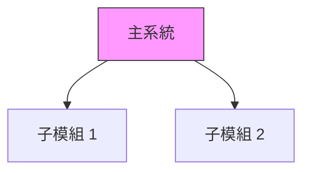

# CLAUDE.md

This file provides guidance to Claude Code (claude.ai/code) when working with code in this repository.

---

## 倉庫概覽

這是一個**多書籍寫作專案集合**，包含技術書籍、學習筆記和文學作品。

### 專案清單

| 專案 | 類型 | 狀態 | 說明 |
|------|------|------|------|
| `AZ-900/` | 技術書籍 | ✅ 完成 | Azure 基礎建設實戰（8章，~108K字） |
| `software-engineering-study/` | 學習筆記 | 🔄 進行中 | 實踐軟體工程第9版學習筆記（30章） |
| `bdd-in-action/` | 技術書籍 | 🔄 進行中 | BDD 實戰指南（68%完成，~239K字） |
| `claude-agent-sdk-in-action/` | 技術書籍 | 🔄 進行中 | Claude Agent SDK 企業開發實戰（9章完成） |
| `claude-code-infrastructure-in-action/` | 技術書籍 | 🔄 進行中 | Claude Code 開發環境實戰（13章完成） |
| `claude-skills-book/` | 技術書籍 | ✅ 完成 | Claude 技能系統書（10章完成） |
| `dbt-migration-in-action/` | 技術書籍 | ✅ 完成 | DBT 遷移實戰（12章完成） |
| `pocket-psychologist/` | 心理自助書 | ✅ 完成 | 口袋心理師（200篇，~80K字） |
| `hakka-merchant-novel/` | 歷史小說 | ⏳ 規劃中 | 客商風云（二月河風格，目標80-120萬字） |
| `shanxi-merchant-chronicle/` | 歷史小說 | 🔄 進行中 | 晉商風雲錄 |
| `npc-consciousness-novel/` | 哲學輕小說 | ⏳ 規劃中 | 幻影的舞台（目標30-50萬字） |

---

## Git 工作流

### 分支命名
```
claude/{project-name}-{sessionId}
```

### 提交流程
```bash
# 使用 HEREDOC 格式化提交信息
git commit -m "$(cat <<'EOF'
標題：簡潔描述

- 完成的工作
- 重要變更

Co-Authored-By: Claude <claude@anthropic.com>
EOF
)"

# 推送必須使用 -u 標記
git push -u origin <branch-name>
```

### 網絡重試策略
- 指數退避：2s, 4s, 8s, 16s
- 最多重試 4 次

---

## 寫作風格指南

### 技術書籍（Manning "in Action" 風格）

適用：`claude-agent-sdk-in-action/`, `claude-code-infrastructure-in-action/`, `bdd-in-action/`, `AZ-900/`, `dbt-migration-in-action/`

**核心要求**：
1. **專案驅動**：每章以具體企業場景開始
2. **漸進式教學**：從基礎到進階，逐步增加複雜性
3. **完整可運行**：所有程式碼範例可直接執行
4. **詳細註解**：使用 ‹1›, ‹2› 標記關鍵程式碼
5. **解釋「為何」**：說明設計決策的原因
6. **第二人稱**：使用「你」、「我們」的親切語氣
7. **章節總結**：回顧核心概念，預告下一章

**標準結構**：
```
{book}/
├── README.md              # 專案總覽
├── manuscript/
│   └── chapters/          # 各章節 .md 檔案
├── code-examples/         # 完整可運行程式碼
├── diagrams/              # Mermaid 架構圖
└── resources/             # 補充資源
```

### 心理自助書（Millie Hardie 風格）

適用：`pocket-psychologist/`

**核心要求**：
- 每篇 300-400 字（1 分鐘可讀完）
- 開場：「我是心理師，給我 60 秒」
- 使用視覺化比喻（茶壺、氣球、森林路徑）
- 對話體或第二人稱
- 去病理化語言（「水燒開了」而非「你有障礙」）

**禁忌**：
- ❌ 「研究顯示...」（太學術）
- ❌ 「你應該...」（太說教）
- ❌ 「一切都會好的」（有毒正向）
- ❌ 專業術語不加解釋

### 歷史小說（二月河風格）

適用：`hakka-merchant-novel/`, `shanxi-merchant-chronicle/`

**核心要求**：
- 第一人稱自述（主人翁回憶一生）
- 文白相間的語言風格
- 歷史事件嚴格遵守 `timeline/` 時間線
- 人物設定查閱 `characters/` 目錄

**標準結構**：
```
{novel}/
├── README.md
├── manuscript/
│   ├── outline.md         # 詳細大綱
│   └── chapters/          # 各章節
├── characters/            # 人物設定
│   ├── protagonist.md     # 主角
│   ├── family.md          # 家族
│   └── historical.md      # 歷史人物
├── timeline/              # 歷史時間線
└── research/              # 背景研究
```

### 哲學輕小說

適用：`npc-consciousness-novel/`

**核心要求**：
- 香月美夜式細膩日常描寫
- 通過角色經歷引出哲學問題（不說教）
- 多視角敘事
- 開放式結局

---

## 圖表規範

所有圖表使用 Mermaid 語法：



---

## 程式碼規範

### Python（Agent SDK 書籍）
```python
class RefactoringCoordinator:
    """
    ‹1› 重構協調器 - 負責管理重構流程

    核心職責：
    1. 掃描程式碼庫
    2. 建立 Subagents
    3. 收集結果
    """
    def __init__(self, api_key: str, codebase_path: str):
        # ‹2› 初始化主 Agent
        self.main_agent = Agent(...)
```

### TypeScript（Infrastructure 書籍）
```typescript
// ‹1› 規則引擎核心
interface SkillRule {
    name: string;
    triggers: TriggerConfig;
    priority: number;
}
```

---

## 快速參考

### 開始新章節前
- [ ] 查閱該書的 `README.md` 確認進度
- [ ] 確認章節學習目標
- [ ] 準備程式碼範例或人物/時間線資料
- [ ] 使用 TodoWrite 建立任務清單

### 完成章節後
- [ ] 確認字數達標
- [ ] Git 提交並 push
- [ ] 更新該書的進度追蹤
