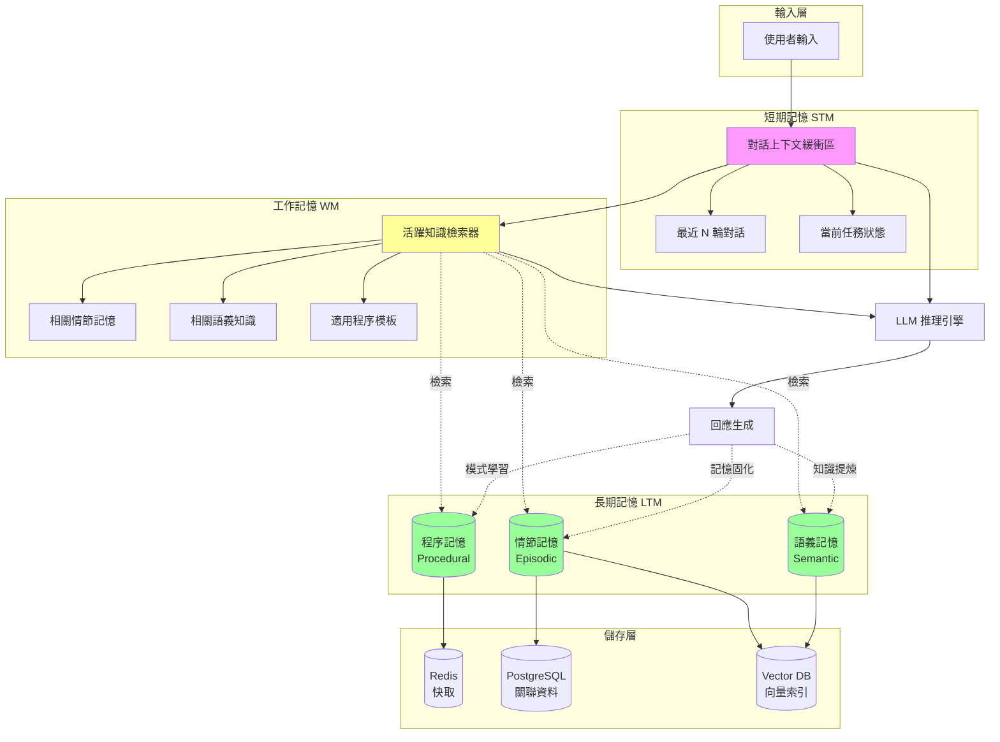
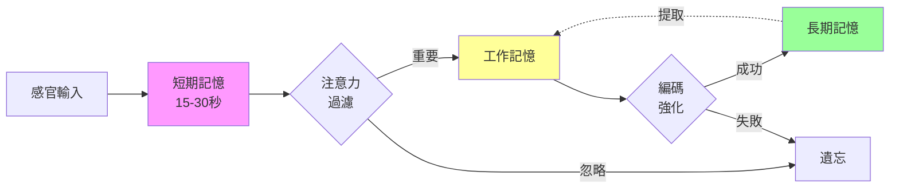
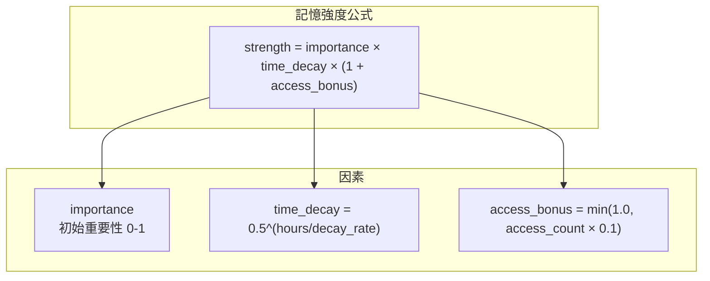
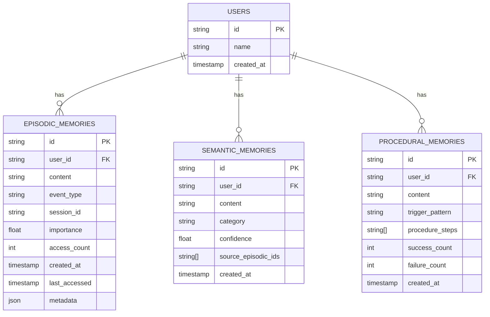

# Agent Memory 系統架構圖

## 三層記憶架構

```mermaid
graph TB
    subgraph "輸入層"
        A[使用者輸入]
    end

    subgraph "短期記憶 STM"
        B[對話上下文緩衝區]
        B1[最近 N 輪對話]
        B2[當前任務狀態]
        B --> B1
        B --> B2
    end

    subgraph "工作記憶 WM"
        C[活躍知識檢索器]
        C1[相關情節記憶]
        C2[相關語義知識]
        C3[適用程序模板]
        C --> C1
        C --> C2
        C --> C3
    end

    subgraph "長期記憶 LTM"
        D1[(情節記憶<br/>Episodic)]
        D2[(語義記憶<br/>Semantic)]
        D3[(程序記憶<br/>Procedural)]
    end

    subgraph "儲存層"
        E1[(Redis<br/>快取)]
        E2[(PostgreSQL<br/>關聯資料)]
        E3[(Vector DB<br/>向量索引)]
    end

    A --> B
    B --> C
    C -.檢索.-> D1
    C -.檢索.-> D2
    C -.檢索.-> D3
    D1 --> E2
    D1 --> E3
    D2 --> E3
    D3 --> E1

    B --> F[LLM 推理引擎]
    C --> F
    F --> G[回應生成]

    G -.記憶固化.-> D1
    G -.知識提煉.-> D2
    G -.模式學習.-> D3

    style B fill:#f9f
    style C fill:#ff9
    style D1 fill:#9f9
    style D2 fill:#9f9
    style D3 fill:#9f9
```

## 記憶生命週期

```mermaid
graph LR
    A[感官輸入] --> B[短期記憶<br/>15-30秒]
    B --> C{注意力<br/>過濾}
    C -->|重要| D[工作記憶]
    C -->|忽略| E[遺忘]
    D --> F{編碼<br/>強化}
    F -->|成功| G[長期記憶]
    F -->|失敗| E
    G -.提取.-> D

    style B fill:#f9f
    style D fill:#ff9
    style G fill:#9f9
```

## 記憶強度衰減

```mermaid
graph TB
    subgraph "記憶強度公式"
        A["strength = importance × time_decay × (1 + access_bonus)"]
    end

    subgraph "因素"
        B[importance<br/>初始重要性 0-1]
        C["time_decay = 0.5^(hours/decay_rate)"]
        D["access_bonus = min(1.0, access_count × 0.1)"]
    end

    A --> B
    A --> C
    A --> D
```

## 資料庫 Schema

```mermaid
erDiagram
    USERS ||--o{ EPISODIC_MEMORIES : has
    USERS ||--o{ SEMANTIC_MEMORIES : has
    USERS ||--o{ PROCEDURAL_MEMORIES : has

    USERS {
        string id PK
        string name
        timestamp created_at
    }

    EPISODIC_MEMORIES {
        string id PK
        string user_id FK
        string content
        string event_type
        string session_id
        float importance
        int access_count
        timestamp created_at
        timestamp last_accessed
        json metadata
    }

    SEMANTIC_MEMORIES {
        string id PK
        string user_id FK
        string content
        string category
        float confidence
        string[] source_episodic_ids
        timestamp created_at
    }

    PROCEDURAL_MEMORIES {
        string id PK
        string user_id FK
        string content
        string trigger_pattern
        string[] procedure_steps
        int success_count
        int failure_count
        timestamp created_at
    }
```
