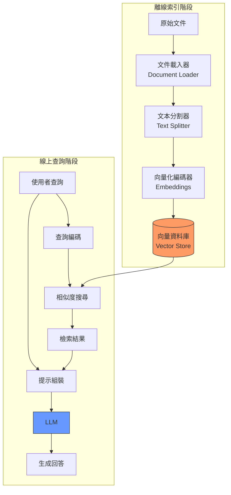
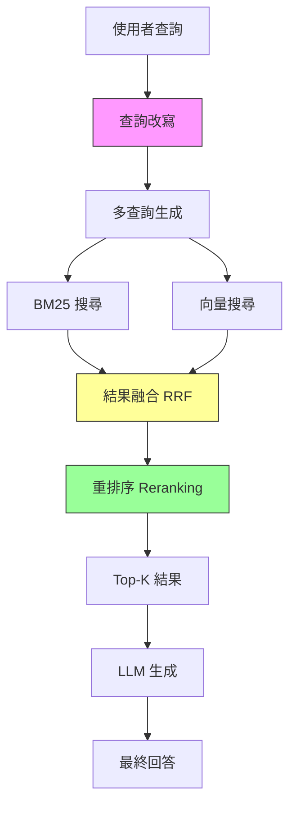
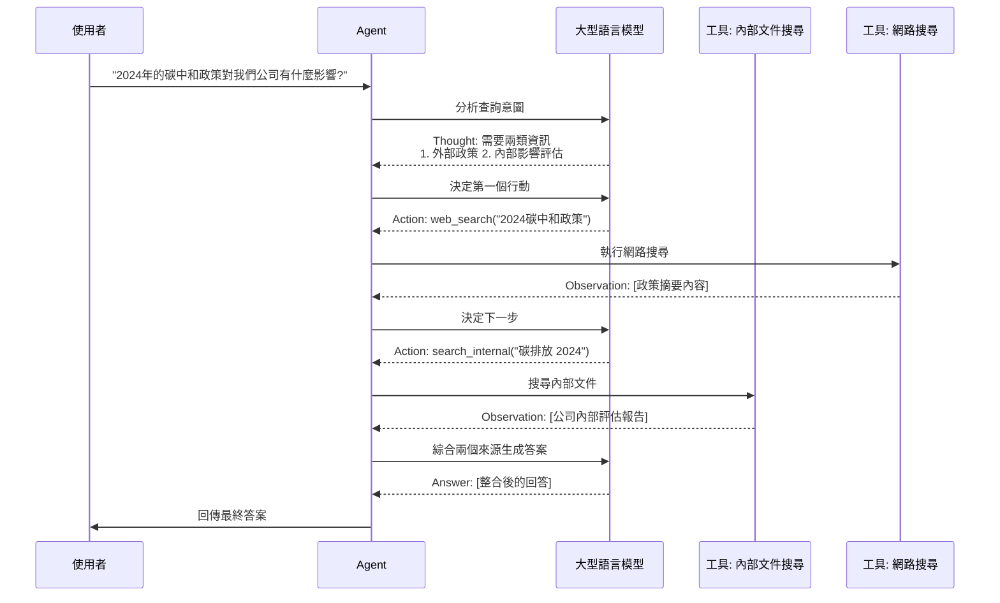

# RAG 系統架構圖

## 基礎 RAG 流程

```mermaid
graph TB
    subgraph "離線索引階段"
        A[原始文件] --> B[文件載入器<br/>Document Loader]
        B --> C[文本分割器<br/>Text Splitter]
        C --> D[向量化編碼器<br/>Embeddings]
        D --> E[(向量資料庫<br/>Vector Store)]
    end

    subgraph "線上查詢階段"
        F[使用者查詢] --> G[查詢編碼]
        G --> H[相似度搜尋]
        E --> H
        H --> I[檢索結果]
        I --> J[提示組裝]
        F --> J
        J --> K[LLM]
        K --> L[生成回答]
    end

    style E fill:#f96,stroke:#333
    style K fill:#69f,stroke:#333
```

## Advanced RAG 流程

```mermaid
graph TB
    A[使用者查詢] --> B[查詢改寫]
    B --> C[多查詢生成]
    C --> D1[BM25 搜尋]
    C --> D2[向量搜尋]
    D1 --> E[結果融合 RRF]
    D2 --> E
    E --> F[重排序 Reranking]
    F --> G[Top-K 結果]
    G --> H[LLM 生成]
    H --> I[最終回答]

    style B fill:#f9f,stroke:#333
    style E fill:#ff9,stroke:#333
    style F fill:#9f9,stroke:#333
```

## Agentic RAG 流程

```mermaid
sequenceDiagram
    participant U as 使用者
    participant A as Agent
    participant LLM as 大型語言模型
    participant T1 as 工具: 內部文件搜尋
    participant T2 as 工具: 網路搜尋

    U->>A: "2024年的碳中和政策對我們公司有什麼影響?"
    A->>LLM: 分析查詢意圖
    LLM-->>A: Thought: 需要兩類資訊<br/>1. 外部政策 2. 內部影響評估
    A->>LLM: 決定第一個行動
    LLM-->>A: Action: web_search("2024碳中和政策")
    A->>T2: 執行網路搜尋
    T2-->>A: Observation: [政策摘要內容]
    A->>LLM: 決定下一步
    LLM-->>A: Action: search_internal("碳排放 2024")
    A->>T1: 搜尋內部文件
    T1-->>A: Observation: [公司內部評估報告]
    A->>LLM: 綜合兩個來源生成答案
    LLM-->>A: Answer: [整合後的回答]
    A->>U: 回傳最終答案
```
