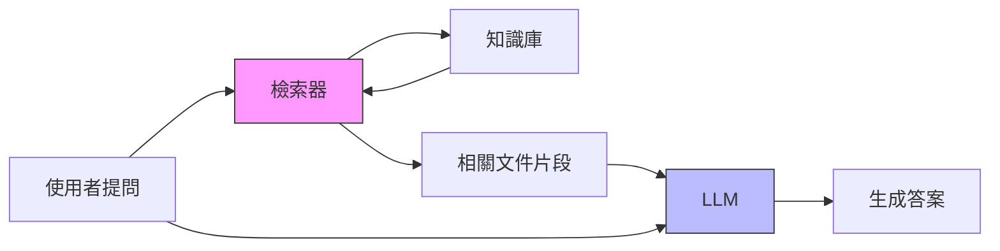
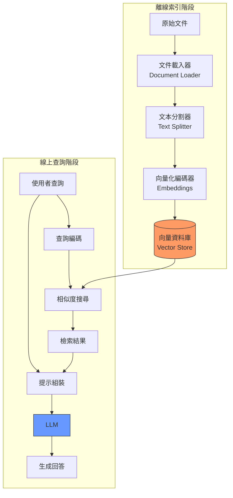

# 第 1 章：你的第一個 RAG 系統：打造企業文件問答助手

> 本章學習目標：
> - 理解為什麼 LLM 需要外部記憶（RAG）
> - 掌握 RAG 系統的核心組件與資料流程
> - 從零開始構建一個可運行的企業文件問答系統
> - 學會評估 RAG 系統的基礎效能指標

---

## 1.1 為什麼需要 RAG？LLM 的記憶限制

想像你剛入職一家新公司，HR 給了你厚厚一疊員工手冊、技術文件、和公司政策文件。第一天你就收到一封郵件，問你「公司的遠端工作政策是什麼？」你會怎麼做？

你不會憑空回答，而是會翻開那疊文件，找到相關章節，然後基於文件內容來回答。

這正是 **RAG（Retrieval-Augmented Generation，檢索增強生成）** 的核心思想：讓 AI 模型在回答問題前，先「查閱資料」，而不是僅憑訓練時學到的知識回答。

### 1.1.1 LLM 的三大限制

大型語言模型（LLM）雖然強大，但有三個根本性的限制：

**知識截止日期（Knowledge Cutoff）**

GPT-4 的訓練資料截止於 2023 年 4 月，Claude 3 的知識截止於 2024 年初。這意味著：

```
使用者：「2024 年第四季度的營收報告顯示什麼？」
純 LLM：「我沒有 2024 年的資料，無法回答這個問題。」
```

**無法訪問私有資料**

LLM 只知道公開的網路資料，對於你公司的：
- 內部 Wiki
- 客戶資料
- 專有技術文件

它一無所知。

**幻覺問題（Hallucination）**

當 LLM 不知道答案時，它不會說「不知道」，而是會自信地編造一個看似合理的答案：

```
使用者：「我們公司的請假流程是什麼？」
純 LLM：「根據一般公司政策，你需要提前三天向主管申請...」
        # 這是編造的，你公司可能是提前一天或一週！
```

### 1.1.2 RAG 如何解決這些問題

RAG 的核心思想很簡單：

```
RAG = 檢索（Retrieval）+ 生成（Generation）
```

1. **檢索**：當使用者提問時，先從知識庫中找出相關的文件片段
2. **增強**：將這些片段作為「上下文」提供給 LLM
3. **生成**：LLM 基於檢索到的內容生成答案

這樣，LLM 就從「憑記憶回答」變成了「開卷考試」。



### 1.1.3 RAG vs. 微調（Fine-tuning）

你可能會問：「為什麼不直接用公司資料微調一個模型？」

| 比較維度 | RAG | 微調 |
|----------|-----|------|
| **資料更新** | 即時生效 | 需要重新訓練 |
| **成本** | 低（只需向量資料庫） | 高（GPU 訓練成本） |
| **可追溯性** | 可以顯示資料來源 | 無法追蹤知識來源 |
| **幻覺控制** | 較好（有文件支撐） | 較差（仍可能編造） |
| **適用場景** | 知識密集型任務 | 風格/格式調整 |

**結論**：對於企業知識問答場景，RAG 幾乎總是更好的選擇。

---

## 1.2 RAG 系統的核心組件

一個完整的 RAG 系統包含六個核心組件，讓我們逐一拆解：



### ‹1› 文件載入器（Document Loader）

文件載入器負責將各種格式的原始文件轉換為統一的文本格式。

**支援的格式**：
- PDF（使用 `PyPDF2` 或 `pdfplumber`）
- Word（使用 `python-docx`）
- Markdown（直接讀取）
- HTML（使用 `BeautifulSoup`）
- CSV/Excel（使用 `pandas`）

**關鍵考量**：
- 保留文件的結構資訊（標題、段落、列表）
- 提取元資料（檔名、頁碼、創建時間）
- 處理特殊字符和編碼問題

### ‹2› 文本分割器（Text Splitter）

LLM 有上下文長度限制（如 GPT-4 的 128K tokens），且檢索精度與文本長度成反比。因此需要將長文件切分成小塊（chunks）。

**分割策略**：

| 策略 | 優點 | 缺點 | 適用場景 |
|------|------|------|----------|
| 固定長度 | 簡單一致 | 可能切斷句子 | 結構化文件 |
| 按句子 | 語義完整 | 長度不均 | 自然語言文件 |
| 按段落 | 保留上下文 | 可能過長 | 技術文件 |
| 遞歸分割 | 平衡各方 | 較複雜 | 通用場景 |

**最佳實踐**：
- Chunk 大小：256-1024 tokens（視模型而定）
- 重疊（Overlap）：50-200 tokens（防止資訊斷裂）

### ‹3› 向量化編碼器（Embeddings）

將文本轉換為高維向量（通常 384-1536 維），使語義相似的文本在向量空間中距離接近。

**常用模型**：

| 模型 | 維度 | 特點 |
|------|------|------|
| OpenAI `text-embedding-3-small` | 1536 | 高品質，需付費 |
| OpenAI `text-embedding-3-large` | 3072 | 最高品質，成本較高 |
| `sentence-transformers/all-MiniLM-L6-v2` | 384 | 免費，輕量 |
| `BAAI/bge-large-zh-v1.5` | 1024 | 中文優化 |

**選擇考量**：
- 語言支援（中文需要專門優化的模型）
- 延遲要求（本地模型 vs. API）
- 成本預算

### ‹4› 向量資料庫（Vector Store）

專門儲存和檢索向量的資料庫，支援高效的相似度搜尋。

**主流選項**：

| 資料庫 | 類型 | 特點 |
|--------|------|------|
| ChromaDB | 嵌入式 | 輕量，適合開發 |
| FAISS | 函式庫 | Meta 出品，高效 |
| Pinecone | 雲端託管 | 全託管，免維運 |
| Weaviate | 自建/雲端 | 功能豐富 |
| Qdrant | 自建/雲端 | Rust 寫成，高效 |
| Milvus | 自建 | 大規模場景 |

本章我們使用 **ChromaDB**，因為它：
- 零配置，pip install 即可使用
- 支援持久化
- 內建常用的 embedding 函數

### ‹5› 檢索器（Retriever）

根據使用者查詢，從向量資料庫中找出最相關的文件片段。

**核心概念**：

```python
# 相似度計算
相似度 = cosine_similarity(query_vector, document_vector)

# 檢索 Top-K 結果
results = vector_store.similarity_search(query, k=5)
```

**相似度度量**：
- **餘弦相似度（Cosine Similarity）**：最常用，範圍 [-1, 1]
- **歐氏距離（Euclidean Distance）**：絕對距離
- **點積（Dot Product）**：計算效率最高

### ‹6› LLM 整合層

將檢索結果與使用者查詢組合成提示（Prompt），交給 LLM 生成最終答案。

**提示模板範例**：

```
你是一個專業的企業知識助手。請根據以下提供的文件內容回答使用者的問題。

如果文件內容無法回答問題，請誠實地說「根據提供的資料，我無法回答這個問題」。

## 參考文件
{context}

## 使用者問題
{question}

## 回答
```

---

## 1.3 實作：從文件到答案的完整流程

現在讓我們動手實作一個完整的 RAG 系統。

### 1.3.1 環境準備

首先，創建專案目錄並安裝依賴：

```bash
mkdir enterprise-rag
cd enterprise-rag
python -m venv venv
source venv/bin/activate  # Windows: venv\Scripts\activate

pip install langchain langchain-openai chromadb pypdf python-dotenv
```

創建 `.env` 文件設定 API 金鑰：

```env
OPENAI_API_KEY=sk-your-api-key-here
```

### 1.3.2 文件預處理與分塊策略

```python
# basic_rag.py
"""
企業文件問答助手 v0.1
‹1› 這是本書的核心專案起點
"""

import os
from pathlib import Path
from typing import List, Dict, Any

from dotenv import load_dotenv
from langchain.text_splitter import RecursiveCharacterTextSplitter
from langchain_community.document_loaders import (
    PyPDFLoader,
    TextLoader,
    DirectoryLoader
)
from langchain_core.documents import Document

load_dotenv()


class DocumentProcessor:
    """
    文件處理器
    ‹2› 負責載入和分割文件
    """

    def __init__(
        self,
        chunk_size: int = 512,
        chunk_overlap: int = 50
    ):
        # ‹3› 遞歸分割器：優先按段落分割，不夠再按句子，最後按字符
        self.text_splitter = RecursiveCharacterTextSplitter(
            chunk_size=chunk_size,
            chunk_overlap=chunk_overlap,
            length_function=len,
            separators=["\n\n", "\n", "。", ".", " ", ""]
        )

    def load_documents(self, directory: str) -> List[Document]:
        """
        載入目錄下的所有文件
        ‹4› 支援 PDF、TXT、MD 格式
        """
        documents = []
        dir_path = Path(directory)

        # 載入 PDF 文件
        for pdf_path in dir_path.glob("**/*.pdf"):
            loader = PyPDFLoader(str(pdf_path))
            documents.extend(loader.load())
            print(f"已載入: {pdf_path.name}")

        # 載入文本文件
        for txt_path in dir_path.glob("**/*.txt"):
            loader = TextLoader(str(txt_path), encoding="utf-8")
            documents.extend(loader.load())
            print(f"已載入: {txt_path.name}")

        # 載入 Markdown 文件
        for md_path in dir_path.glob("**/*.md"):
            loader = TextLoader(str(md_path), encoding="utf-8")
            documents.extend(loader.load())
            print(f"已載入: {md_path.name}")

        return documents

    def split_documents(
        self,
        documents: List[Document]
    ) -> List[Document]:
        """
        將文件分割成小塊
        ‹5› 每個 chunk 都保留原始文件的元資料
        """
        chunks = self.text_splitter.split_documents(documents)

        # 為每個 chunk 添加唯一 ID
        for i, chunk in enumerate(chunks):
            chunk.metadata["chunk_id"] = i

        print(f"共分割成 {len(chunks)} 個文本塊")
        return chunks
```

### 1.3.3 向量化與索引建立

```python
# 繼續 basic_rag.py

from langchain_openai import OpenAIEmbeddings
from langchain_community.vectorstores import Chroma


class VectorStoreManager:
    """
    向量資料庫管理器
    ‹6› 負責向量化和儲存
    """

    def __init__(
        self,
        persist_directory: str = "./chroma_db",
        collection_name: str = "enterprise_docs"
    ):
        self.persist_directory = persist_directory
        self.collection_name = collection_name

        # ‹7› 使用 OpenAI 的 embedding 模型
        self.embeddings = OpenAIEmbeddings(
            model="text-embedding-3-small"
        )

        self.vector_store = None

    def create_index(self, documents: List[Document]) -> None:
        """
        建立向量索引
        ‹8› 將文件向量化並儲存到 ChromaDB
        """
        print("正在建立向量索引...")

        self.vector_store = Chroma.from_documents(
            documents=documents,
            embedding=self.embeddings,
            persist_directory=self.persist_directory,
            collection_name=self.collection_name
        )

        print(f"索引建立完成，共 {len(documents)} 個向量")

    def load_index(self) -> None:
        """
        載入已存在的索引
        ‹9› 避免重複建立索引
        """
        self.vector_store = Chroma(
            persist_directory=self.persist_directory,
            embedding_function=self.embeddings,
            collection_name=self.collection_name
        )
        print("已載入現有索引")

    def search(
        self,
        query: str,
        k: int = 5
    ) -> List[Document]:
        """
        相似度搜尋
        ‹10› 返回最相關的 k 個文件片段
        """
        if not self.vector_store:
            raise ValueError("請先建立或載入索引")

        results = self.vector_store.similarity_search(query, k=k)
        return results

    def search_with_score(
        self,
        query: str,
        k: int = 5
    ) -> List[tuple]:
        """
        帶分數的搜尋
        ‹11› 返回文件和相似度分數（用於除錯和評估）
        """
        if not self.vector_store:
            raise ValueError("請先建立或載入索引")

        results = self.vector_store.similarity_search_with_score(query, k=k)
        return results
```

### 1.3.4 查詢處理與上下文組裝

```python
# 繼續 basic_rag.py

from langchain_openai import ChatOpenAI
from langchain_core.prompts import ChatPromptTemplate
from langchain_core.output_parsers import StrOutputParser
from langchain_core.runnables import RunnablePassthrough


class RAGEngine:
    """
    RAG 引擎
    ‹12› 整合檢索和生成
    """

    def __init__(
        self,
        vector_store_manager: VectorStoreManager,
        model_name: str = "gpt-4o-mini"
    ):
        self.vector_manager = vector_store_manager

        # ‹13› 初始化 LLM
        self.llm = ChatOpenAI(
            model=model_name,
            temperature=0  # ‹14› 設為 0 以獲得一致的輸出
        )

        # ‹15› 定義 RAG 提示模板
        self.prompt_template = ChatPromptTemplate.from_template("""
你是一個專業的企業知識助手。請根據以下提供的文件內容回答使用者的問題。

重要規則：
1. 只根據提供的文件內容回答，不要使用外部知識
2. 如果文件內容無法回答問題，請說「根據提供的資料，我無法找到這個問題的答案」
3. 回答時請引用相關的文件來源
4. 保持回答簡潔、專業

## 參考文件內容
{context}

## 使用者問題
{question}

## 回答
""")

    def _format_docs(self, docs: List[Document]) -> str:
        """
        格式化檢索結果
        ‹16› 將多個文件片段組合成上下文字串
        """
        formatted = []
        for i, doc in enumerate(docs, 1):
            source = doc.metadata.get("source", "未知來源")
            page = doc.metadata.get("page", "")
            page_info = f" (第 {page + 1} 頁)" if page else ""

            formatted.append(f"""
---文件 {i}{page_info}---
來源: {source}
內容: {doc.page_content}
""")

        return "\n".join(formatted)

    def query(self, question: str, k: int = 5) -> Dict[str, Any]:
        """
        執行 RAG 查詢
        ‹17› 完整的檢索-生成流程
        """
        # 步驟 1: 檢索相關文件
        retrieved_docs = self.vector_manager.search(question, k=k)

        # 步驟 2: 格式化上下文
        context = self._format_docs(retrieved_docs)

        # 步驟 3: 組裝提示並生成回答
        chain = (
            self.prompt_template
            | self.llm
            | StrOutputParser()
        )

        answer = chain.invoke({
            "context": context,
            "question": question
        })

        # ‹18› 返回答案和來源（用於可追溯性）
        return {
            "question": question,
            "answer": answer,
            "sources": [
                {
                    "content": doc.page_content[:200] + "...",
                    "source": doc.metadata.get("source", "未知"),
                    "page": doc.metadata.get("page", None)
                }
                for doc in retrieved_docs
            ]
        }
```

### 1.3.5 完整的使用範例

```python
# 繼續 basic_rag.py

def main():
    """
    主程式
    ‹19› 展示完整的使用流程
    """
    # 步驟 1: 初始化組件
    doc_processor = DocumentProcessor(
        chunk_size=512,
        chunk_overlap=50
    )

    vector_manager = VectorStoreManager(
        persist_directory="./chroma_db",
        collection_name="enterprise_docs"
    )

    # 步驟 2: 載入和處理文件（首次運行時）
    documents_dir = "./documents"

    if not Path(documents_dir).exists():
        print("請創建 ./documents 目錄並放入文件")
        return

    # 檢查是否已有索引
    if Path("./chroma_db").exists():
        print("發現現有索引，直接載入...")
        vector_manager.load_index()
    else:
        print("建立新索引...")
        documents = doc_processor.load_documents(documents_dir)
        chunks = doc_processor.split_documents(documents)
        vector_manager.create_index(chunks)

    # 步驟 3: 初始化 RAG 引擎
    rag_engine = RAGEngine(vector_manager)

    # 步驟 4: 互動式查詢
    print("\n=== 企業文件問答助手 v0.1 ===")
    print("輸入問題開始查詢，輸入 'quit' 退出\n")

    while True:
        question = input("你的問題: ").strip()

        if question.lower() == 'quit':
            print("再見！")
            break

        if not question:
            continue

        # 執行查詢
        result = rag_engine.query(question)

        print(f"\n回答: {result['answer']}")
        print("\n參考來源:")
        for i, source in enumerate(result['sources'], 1):
            print(f"  {i}. {source['source']}")
        print()


if __name__ == "__main__":
    main()
```

---

## 1.4 測試與驗證

### 1.4.1 準備測試文件

創建 `./documents/` 目錄，放入一些測試文件：

```markdown
<!-- ./documents/remote_work_policy.md -->

# 遠端工作政策

## 1. 適用範圍
本政策適用於所有全職員工。

## 2. 遠端工作申請
- 員工需提前 3 個工作天向主管提出申請
- 每週最多可申請 2 天遠端工作
- 特殊情況（如疫情期間）可申請全遠端

## 3. 工作時間要求
- 核心工作時間：上午 10:00 - 下午 4:00 必須在線
- 需保持通訊軟體隨時可聯繫
- 每日需更新工作進度到專案管理系統

## 4. 設備與安全
- 公司提供筆記型電腦
- 必須使用公司 VPN 連線
- 禁止在公共 WiFi 環境處理敏感資料
```

### 1.4.2 執行測試

```bash
python basic_rag.py
```

**測試對話範例**：

```
你的問題: 公司的遠端工作政策是什麼？

回答: 根據公司的遠端工作政策：

1. **適用範圍**：本政策適用於所有全職員工。

2. **申請流程**：
   - 員工需提前 3 個工作天向主管提出申請
   - 每週最多可申請 2 天遠端工作
   - 特殊情況（如疫情期間）可申請全遠端

3. **工作時間要求**：
   - 核心工作時間為上午 10:00 至下午 4:00，必須在線
   - 需保持通訊軟體隨時可聯繫
   - 每日需更新工作進度到專案管理系統

4. **設備與安全**：
   - 公司提供筆記型電腦
   - 必須使用公司 VPN 連線
   - 禁止在公共 WiFi 環境處理敏感資料

參考來源:
  1. ./documents/remote_work_policy.md
```

### 1.4.3 基礎效能評估

創建一個簡單的評估腳本：

```python
# evaluate_rag.py
"""
RAG 系統基礎評估
‹20› 測量回應時間和檢索品質
"""

import time
from basic_rag import DocumentProcessor, VectorStoreManager, RAGEngine

def evaluate_rag():
    # 初始化
    vector_manager = VectorStoreManager()
    vector_manager.load_index()
    rag_engine = RAGEngine(vector_manager)

    # 測試問題集
    test_questions = [
        "遠端工作需要提前幾天申請？",
        "每週最多可以遠端工作幾天？",
        "遠端工作時必須使用什麼連線？",
        "核心工作時間是幾點到幾點？",
    ]

    results = []

    for question in test_questions:
        start_time = time.time()
        result = rag_engine.query(question)
        elapsed_time = time.time() - start_time

        results.append({
            "question": question,
            "time_ms": elapsed_time * 1000,
            "answer_length": len(result["answer"]),
            "sources_count": len(result["sources"])
        })

        print(f"問題: {question}")
        print(f"耗時: {elapsed_time * 1000:.2f} ms")
        print(f"回答長度: {len(result['answer'])} 字符")
        print("---")

    # 統計摘要
    avg_time = sum(r["time_ms"] for r in results) / len(results)
    print(f"\n平均回應時間: {avg_time:.2f} ms")


if __name__ == "__main__":
    evaluate_rag()
```

---

## 1.5 這個方案的侷限性

恭喜！你已經建立了第一個可運行的 RAG 系統。但在進入下一章之前，讓我們誠實地面對這個「Naive RAG」的侷限性：

### 1.5.1 檢索品質問題

**問題 1：語義不匹配**

```
使用者：「WFH 政策是什麼？」
系統：（找不到相關內容，因為文件中沒有 "WFH" 這個詞）
```

「WFH（Work From Home）」和「遠端工作」是同義詞，但簡單的向量搜尋可能無法建立這種連結。

**問題 2：檢索噪音**

當知識庫很大時，Top-5 的結果可能包含不相關的內容，干擾 LLM 的判斷。

**問題 3：跨文件推理**

```
使用者：「比較 A 專案和 B 專案的預算」
```

如果 A 和 B 的資訊分散在不同文件中，簡單的 Top-K 檢索可能無法同時找到兩者。

### 1.5.2 效能問題

| 指標 | 當前狀態 | 期望值 |
|------|----------|--------|
| 平均延遲 | 2-3 秒 | < 1 秒 |
| 首次載入 | 需要索引 | 即時可用 |
| 大規模擴展 | 未支援 | 百萬級文件 |

### 1.5.3 功能缺失

- **無法處理多輪對話**：每次查詢都是獨立的
- **無法學習使用者偏好**：每個使用者都是一樣的
- **無法主動查詢**：只能被動回答
- **無法操作外部系統**：只能讀取資料，不能執行動作

---

## 1.6 總結與下一步

### 本章回顧

在本章中，我們：

1. **理解了 RAG 的必要性**：LLM 的知識截止、私有資料訪問、幻覺問題
2. **掌握了 RAG 的六大組件**：文件載入器、文本分割器、向量編碼器、向量資料庫、檢索器、LLM 整合層
3. **實作了完整的 RAG 系統**：約 200 行 Python 代碼
4. **認識了 Naive RAG 的侷限性**：為後續章節的優化奠定基礎

### 關鍵決策說明

| 決策點 | 選擇 | 原因 |
|--------|------|------|
| 向量資料庫 | ChromaDB | 零配置，適合開發階段 |
| Embedding 模型 | OpenAI text-embedding-3-small | 高品質，1536 維足夠 |
| Chunk 大小 | 512 tokens | 平衡上下文完整性與檢索精度 |
| 重疊大小 | 50 tokens | 防止關鍵資訊被切斷 |
| LLM | GPT-4o-mini | 成本效益最佳 |

### 下一章預告

在第 2 章「優化檢索品質」中，我們將：

- 實作 **查詢改寫（Query Rewriting）** 解決語義不匹配問題
- 引入 **混合檢索（Hybrid Search）** 結合關鍵字和向量搜尋
- 加入 **重排序（Reranking）** 提升檢索精度
- 建立 **評估框架** 量化優化效果

讓我們繼續前進！

---

## 本章程式碼清單

| 檔案 | 說明 |
|------|------|
| `basic_rag.py` | RAG 系統核心實作 |
| `evaluate_rag.py` | 基礎評估腳本 |
| `requirements.txt` | 依賴套件清單 |
| `docker-compose.yml` | 容器化部署配置 |

完整程式碼請參見 `code-examples/chapter-01/` 目錄。
