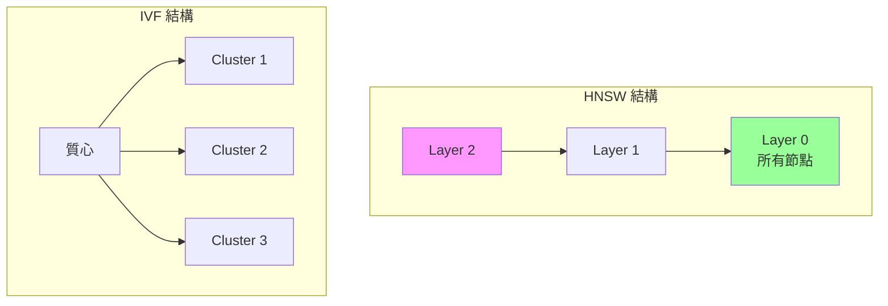
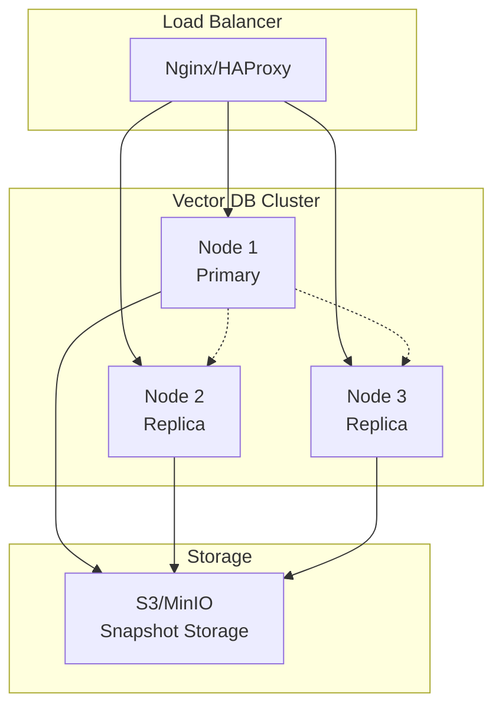
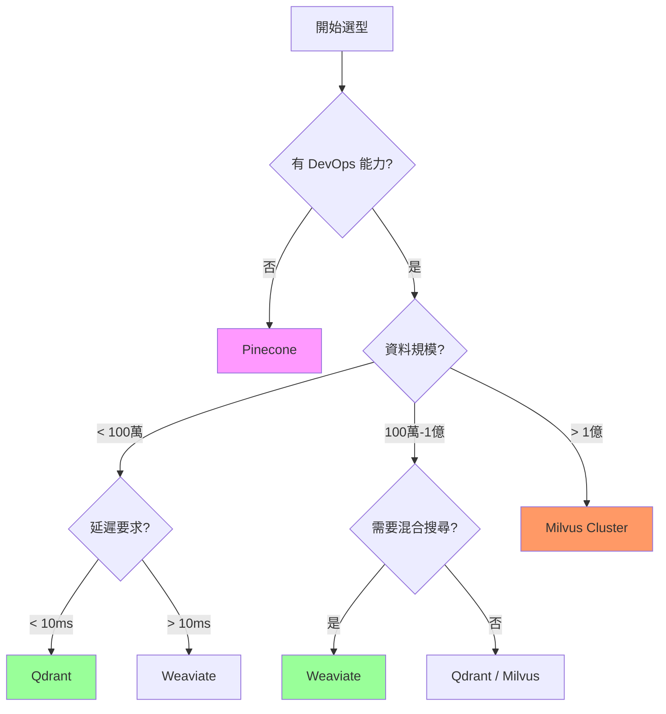

# 第 3 章：企業級向量資料庫選型與部署

> 本章學習目標：
> - 理解向量資料庫的核心能力與架構差異
> - 掌握 Pinecone、Weaviate、Qdrant、Milvus 的特點與適用場景
> - 學會設計和執行向量資料庫效能基準測試
> - 能夠根據企業需求做出合理的技術選型

---

## 3.1 向量資料庫的核心能力

在前兩章，我們使用 ChromaDB 作為開發環境的向量資料庫。但當系統需要處理百萬級文件、支撐數百併發使用者、保證 99.9% 可用性時，我們需要更專業的解決方案。

### 3.1.1 為什麼需要專門的向量資料庫？

**傳統資料庫的局限**

```sql
-- 傳統 SQL 無法高效執行這種查詢
SELECT * FROM documents
ORDER BY cosine_similarity(embedding, query_embedding)
LIMIT 10;
-- 時間複雜度: O(n)，100萬文件需要數秒
```

**向量資料庫的優勢**

```
向量資料庫使用近似最近鄰 (ANN) 算法
時間複雜度: O(log n)
100萬文件只需數十毫秒
```

### 3.1.2 核心技術：ANN 索引算法

向量資料庫的核心是 **近似最近鄰（Approximate Nearest Neighbor, ANN）** 算法。常見的索引類型包括：

| 索引類型 | 算法 | 特點 | 代表實現 |
|----------|------|------|----------|
| **HNSW** | 層次可導航小世界 | 高精度、高記憶體 | Weaviate, Qdrant |
| **IVF** | 倒排文件索引 | 適合大規模 | Milvus, Faiss |
| **PQ** | 乘積量化 | 壓縮向量、節省記憶體 | Pinecone |
| **Flat** | 暴力搜尋 | 100% 精確 | 小規模場景 |



### 3.1.3 向量資料庫的關鍵指標

| 指標 | 說明 | 重要性 |
|------|------|--------|
| **QPS** | 每秒查詢數 | 吞吐能力 |
| **Latency (P99)** | 99% 請求的延遲 | 用戶體驗 |
| **Recall@K** | Top-K 的召回率 | 搜尋品質 |
| **Index Build Time** | 索引建立時間 | 資料更新效率 |
| **Memory Usage** | 記憶體占用 | 成本 |

---

## 3.2 市場主流方案橫向比較

### 3.2.1 雲端託管方案

#### Pinecone

**特點**：全託管、零維運、開箱即用

```python
# Pinecone 使用範例
import pinecone
from pinecone import Pinecone, ServerlessSpec

# 初始化
pc = Pinecone(api_key="your-api-key")

# 創建索引
pc.create_index(
    name="enterprise-docs",
    dimension=1536,
    metric="cosine",
    spec=ServerlessSpec(
        cloud="aws",
        region="us-east-1"
    )
)

# 插入向量
index = pc.Index("enterprise-docs")
index.upsert(vectors=[
    {
        "id": "doc1",
        "values": [0.1, 0.2, ...],  # 1536 維向量
        "metadata": {"source": "policy.pdf", "page": 1}
    }
])

# 查詢
results = index.query(
    vector=[0.1, 0.2, ...],
    top_k=5,
    include_metadata=True,
    filter={"source": {"$eq": "policy.pdf"}}
)
```

**優勢**：
- 無需維運，自動擴展
- 低延遲（通常 < 50ms）
- 豐富的過濾功能

**劣勢**：
- 成本較高（$70+/月起）
- 資料必須上傳到雲端
- 無法自訂索引參數

**適用場景**：中小型團隊、快速上線、無 DevOps 資源

---

#### Zilliz Cloud（Milvus 雲端版）

**特點**：Milvus 的全託管版本，企業級功能

```python
# Zilliz Cloud 使用範例
from pymilvus import MilvusClient

client = MilvusClient(
    uri="https://your-cluster.zillizcloud.com",
    token="your-api-key"
)

# 創建集合
client.create_collection(
    collection_name="enterprise_docs",
    dimension=1536
)

# 插入資料
client.insert(
    collection_name="enterprise_docs",
    data=[
        {"id": 1, "vector": [0.1, 0.2, ...], "text": "..."}
    ]
)

# 搜尋
results = client.search(
    collection_name="enterprise_docs",
    data=[[0.1, 0.2, ...]],
    limit=5
)
```

**定價**：按計算單元（CU）計費，起價 $65/月

---

### 3.2.2 自建方案

#### Weaviate

**特點**：功能最豐富，內建 AI 能力

```python
# Weaviate 使用範例
import weaviate
from weaviate.classes.config import Configure, Property, DataType

# 連接
client = weaviate.connect_to_local()

# 創建 Schema
client.collections.create(
    name="EnterpriseDoc",
    vectorizer_config=Configure.Vectorizer.text2vec_openai(),  # 內建向量化
    properties=[
        Property(name="content", data_type=DataType.TEXT),
        Property(name="source", data_type=DataType.TEXT),
    ]
)

# 插入（自動向量化）
collection = client.collections.get("EnterpriseDoc")
collection.data.insert(
    properties={
        "content": "遠端工作政策...",
        "source": "policy.pdf"
    }
)

# 語義搜尋
response = collection.query.near_text(
    query="work from home rules",
    limit=5
)
```

**獨特功能**：
- 內建向量化模組（不需要外部 Embedding API）
- 支援 GraphQL 查詢
- 混合搜尋（BM25 + 向量）開箱即用

**部署**：

```yaml
# docker-compose.yml for Weaviate
version: '3.4'
services:
  weaviate:
    image: semitechnologies/weaviate:1.24.0
    ports:
      - "8080:8080"
    environment:
      QUERY_DEFAULTS_LIMIT: 25
      AUTHENTICATION_ANONYMOUS_ACCESS_ENABLED: 'true'
      PERSISTENCE_DATA_PATH: '/var/lib/weaviate'
      DEFAULT_VECTORIZER_MODULE: 'text2vec-openai'
      ENABLE_MODULES: 'text2vec-openai,generative-openai'
      OPENAI_APIKEY: ${OPENAI_API_KEY}
    volumes:
      - weaviate_data:/var/lib/weaviate
volumes:
  weaviate_data:
```

---

#### Qdrant

**特點**：Rust 編寫，高效能，豐富的過濾功能

```python
# Qdrant 使用範例
from qdrant_client import QdrantClient
from qdrant_client.models import Distance, VectorParams, PointStruct

# 連接
client = QdrantClient(host="localhost", port=6333)

# 創建集合
client.create_collection(
    collection_name="enterprise_docs",
    vectors_config=VectorParams(
        size=1536,
        distance=Distance.COSINE
    )
)

# 插入
client.upsert(
    collection_name="enterprise_docs",
    points=[
        PointStruct(
            id=1,
            vector=[0.1, 0.2, ...],
            payload={
                "content": "遠端工作政策...",
                "source": "policy.pdf",
                "department": "HR"
            }
        )
    ]
)

# 搜尋（帶過濾）
from qdrant_client.models import Filter, FieldCondition, MatchValue

results = client.search(
    collection_name="enterprise_docs",
    query_vector=[0.1, 0.2, ...],
    limit=5,
    query_filter=Filter(
        must=[
            FieldCondition(
                key="department",
                match=MatchValue(value="HR")
            )
        ]
    )
)
```

**獨特功能**：
- 極其靈活的過濾條件
- 支援向量負載壓縮（降低記憶體）
- 內建分片和複製

**部署**：

```yaml
# docker-compose.yml for Qdrant
version: '3.4'
services:
  qdrant:
    image: qdrant/qdrant:v1.8.0
    ports:
      - "6333:6333"
      - "6334:6334"  # gRPC
    volumes:
      - qdrant_data:/qdrant/storage
    environment:
      QDRANT__SERVICE__HTTP_PORT: 6333
      QDRANT__SERVICE__GRPC_PORT: 6334
volumes:
  qdrant_data:
```

---

#### Milvus

**特點**：大規模場景首選，支援十億級向量

```python
# Milvus 使用範例
from pymilvus import (
    connections,
    Collection,
    FieldSchema,
    CollectionSchema,
    DataType
)

# 連接
connections.connect(host="localhost", port="19530")

# 定義 Schema
fields = [
    FieldSchema(name="id", dtype=DataType.INT64, is_primary=True),
    FieldSchema(name="vector", dtype=DataType.FLOAT_VECTOR, dim=1536),
    FieldSchema(name="content", dtype=DataType.VARCHAR, max_length=65535),
]
schema = CollectionSchema(fields=fields)

# 創建集合
collection = Collection(name="enterprise_docs", schema=schema)

# 創建索引
index_params = {
    "metric_type": "COSINE",
    "index_type": "HNSW",
    "params": {"M": 16, "efConstruction": 256}
}
collection.create_index(field_name="vector", index_params=index_params)

# 插入
collection.insert([
    [1, 2, 3],  # ids
    [[0.1, 0.2, ...], [0.3, 0.4, ...], [0.5, 0.6, ...]],  # vectors
    ["content1", "content2", "content3"]  # contents
])

# 載入到記憶體
collection.load()

# 搜尋
results = collection.search(
    data=[[0.1, 0.2, ...]],
    anns_field="vector",
    param={"metric_type": "COSINE", "params": {"ef": 128}},
    limit=5
)
```

**獨特功能**：
- 支援多種索引類型（IVF_FLAT, IVF_PQ, HNSW 等）
- 分散式架構，支援水平擴展
- 支援 GPU 加速

**部署（Milvus Standalone）**：

```yaml
# docker-compose.yml for Milvus
version: '3.5'
services:
  etcd:
    image: quay.io/coreos/etcd:v3.5.5
    environment:
      - ETCD_AUTO_COMPACTION_MODE=revision
      - ETCD_AUTO_COMPACTION_RETENTION=1000
    command: etcd -advertise-client-urls=http://etcd:2379 -listen-client-urls http://0.0.0.0:2379

  minio:
    image: minio/minio:RELEASE.2023-03-20T20-16-18Z
    environment:
      MINIO_ACCESS_KEY: minioadmin
      MINIO_SECRET_KEY: minioadmin
    command: minio server /minio_data

  milvus:
    image: milvusdb/milvus:v2.3.0
    ports:
      - "19530:19530"
      - "9091:9091"
    depends_on:
      - etcd
      - minio
    environment:
      ETCD_ENDPOINTS: etcd:2379
      MINIO_ADDRESS: minio:9000
```

---

### 3.2.3 混合方案：Elasticsearch + kNN

**特點**：利用現有 Elasticsearch 基礎設施

```python
# Elasticsearch kNN 使用範例
from elasticsearch import Elasticsearch

es = Elasticsearch(["http://localhost:9200"])

# 創建索引（包含向量欄位）
es.indices.create(
    index="enterprise_docs",
    body={
        "mappings": {
            "properties": {
                "content": {"type": "text"},
                "embedding": {
                    "type": "dense_vector",
                    "dims": 1536,
                    "index": True,
                    "similarity": "cosine"
                }
            }
        }
    }
)

# 插入
es.index(
    index="enterprise_docs",
    body={
        "content": "遠端工作政策...",
        "embedding": [0.1, 0.2, ...]
    }
)

# kNN 搜尋
results = es.search(
    index="enterprise_docs",
    body={
        "knn": {
            "field": "embedding",
            "query_vector": [0.1, 0.2, ...],
            "k": 5,
            "num_candidates": 100
        }
    }
)
```

**優勢**：
- 利用現有基礎設施，無需新增組件
- 支援文字搜尋 + 向量搜尋的混合
- 成熟的生態系統

**劣勢**：
- 向量搜尋效能不如專門的向量資料庫
- 記憶體占用較高

---

## 3.3 效能基準測試實作

讓我們建立一個標準化的基準測試框架，公平比較各個資料庫。

### 3.3.1 測試資料集準備

```python
# benchmark/dataset.py
"""
基準測試資料集
‹1› 使用 Wikipedia 子集作為標準測試資料
"""

import numpy as np
from sentence_transformers import SentenceTransformer
from datasets import load_dataset


class BenchmarkDataset:
    """
    基準測試資料集生成器
    """

    def __init__(self, size: int = 100_000):
        self.size = size
        self.embedder = SentenceTransformer("all-MiniLM-L6-v2")
        self.dimension = 384  # MiniLM 的維度

    def generate_wikipedia_dataset(self) -> tuple:
        """
        生成 Wikipedia 測試資料
        ‹2› 返回文本、向量、和查詢集
        """
        print(f"載入 Wikipedia 資料集（{self.size} 筆）...")

        # 載入 Wikipedia 子集
        dataset = load_dataset(
            "wikipedia",
            "20220301.en",
            split=f"train[:{self.size}]"
        )

        texts = [doc["text"][:500] for doc in dataset]  # 截取前 500 字

        print("向量化文本...")
        vectors = self.embedder.encode(
            texts,
            show_progress_bar=True,
            batch_size=64
        )

        # 生成查詢集（從資料集中隨機選取 1000 個作為查詢）
        query_indices = np.random.choice(len(texts), size=1000, replace=False)
        query_vectors = vectors[query_indices]

        return texts, vectors, query_vectors, query_indices

    def generate_synthetic_dataset(self) -> tuple:
        """
        生成合成測試資料
        ‹3› 用於大規模壓力測試
        """
        print(f"生成 {self.size} 個隨機向量...")

        vectors = np.random.randn(self.size, self.dimension).astype(np.float32)
        # 歸一化（便於使用 cosine similarity）
        vectors = vectors / np.linalg.norm(vectors, axis=1, keepdims=True)

        # 生成查詢
        query_vectors = np.random.randn(1000, self.dimension).astype(np.float32)
        query_vectors = query_vectors / np.linalg.norm(query_vectors, axis=1, keepdims=True)

        return None, vectors, query_vectors, None
```

### 3.3.2 統一測試介面

```python
# benchmark/runner.py
"""
基準測試執行器
"""

from abc import ABC, abstractmethod
import time
import numpy as np
from typing import List, Dict, Any
from dataclasses import dataclass


@dataclass
class BenchmarkResult:
    """
    基準測試結果
    """
    database_name: str
    insert_time_sec: float
    index_build_time_sec: float
    qps: float
    latency_p50_ms: float
    latency_p99_ms: float
    recall_at_10: float
    memory_usage_mb: float


class VectorDBBenchmark(ABC):
    """
    向量資料庫基準測試基類
    ‹1› 所有資料庫測試必須實現這些方法
    """

    @abstractmethod
    def setup(self) -> None:
        """初始化連接和集合"""
        pass

    @abstractmethod
    def insert(self, vectors: np.ndarray, batch_size: int = 1000) -> float:
        """
        批次插入向量
        ‹2› 返回總耗時（秒）
        """
        pass

    @abstractmethod
    def build_index(self) -> float:
        """
        建立索引
        ‹3› 返回耗時（秒）
        """
        pass

    @abstractmethod
    def search(self, query_vector: np.ndarray, top_k: int = 10) -> List[int]:
        """
        執行搜尋
        ‹4› 返回 Top-K 結果的 ID
        """
        pass

    @abstractmethod
    def get_memory_usage(self) -> float:
        """
        獲取記憶體使用量（MB）
        """
        pass

    def run_benchmark(
        self,
        vectors: np.ndarray,
        query_vectors: np.ndarray,
        ground_truth: np.ndarray = None
    ) -> BenchmarkResult:
        """
        執行完整的基準測試
        ‹5› 統一的測試流程
        """
        # 初始化
        self.setup()

        # 插入測試
        insert_time = self.insert(vectors)

        # 索引建立測試
        index_time = self.build_index()

        # 搜尋測試
        latencies = []
        results = []

        for query_vec in query_vectors:
            start = time.perf_counter()
            result = self.search(query_vec, top_k=10)
            latency = (time.perf_counter() - start) * 1000  # 轉為毫秒

            latencies.append(latency)
            results.append(result)

        # 計算指標
        qps = len(query_vectors) / sum(latencies) * 1000
        latency_p50 = np.percentile(latencies, 50)
        latency_p99 = np.percentile(latencies, 99)

        # 計算召回率（如果有 ground truth）
        recall = 0.0
        if ground_truth is not None:
            recall = self._calculate_recall(results, ground_truth)

        memory = self.get_memory_usage()

        return BenchmarkResult(
            database_name=self.__class__.__name__,
            insert_time_sec=insert_time,
            index_build_time_sec=index_time,
            qps=qps,
            latency_p50_ms=latency_p50,
            latency_p99_ms=latency_p99,
            recall_at_10=recall,
            memory_usage_mb=memory
        )

    def _calculate_recall(
        self,
        results: List[List[int]],
        ground_truth: np.ndarray
    ) -> float:
        """
        計算 Recall@10
        ‹6› 與暴力搜尋結果比較
        """
        recalls = []
        for result, truth in zip(results, ground_truth):
            intersection = len(set(result) & set(truth[:10]))
            recalls.append(intersection / 10)
        return np.mean(recalls)
```

### 3.3.3 各資料庫的測試實現

```python
# benchmark/implementations.py

class QdrantBenchmark(VectorDBBenchmark):
    """Qdrant 基準測試"""

    def __init__(self, host: str = "localhost", port: int = 6333):
        self.host = host
        self.port = port
        self.client = None
        self.collection_name = "benchmark"

    def setup(self):
        from qdrant_client import QdrantClient
        from qdrant_client.models import Distance, VectorParams

        self.client = QdrantClient(host=self.host, port=self.port)

        # 刪除舊集合（如果存在）
        try:
            self.client.delete_collection(self.collection_name)
        except:
            pass

        # 創建新集合
        self.client.create_collection(
            collection_name=self.collection_name,
            vectors_config=VectorParams(
                size=384,
                distance=Distance.COSINE
            )
        )

    def insert(self, vectors: np.ndarray, batch_size: int = 1000) -> float:
        from qdrant_client.models import PointStruct

        start = time.perf_counter()

        for i in range(0, len(vectors), batch_size):
            batch = vectors[i:i+batch_size]
            points = [
                PointStruct(
                    id=i + j,
                    vector=vec.tolist()
                )
                for j, vec in enumerate(batch)
            ]
            self.client.upsert(
                collection_name=self.collection_name,
                points=points
            )

        return time.perf_counter() - start

    def build_index(self) -> float:
        # Qdrant 的 HNSW 索引在插入時自動建立
        return 0.0

    def search(self, query_vector: np.ndarray, top_k: int = 10) -> List[int]:
        results = self.client.search(
            collection_name=self.collection_name,
            query_vector=query_vector.tolist(),
            limit=top_k
        )
        return [hit.id for hit in results]

    def get_memory_usage(self) -> float:
        info = self.client.get_collection(self.collection_name)
        # 估算記憶體使用
        return info.vectors_count * 384 * 4 / 1024 / 1024  # 簡化計算


class MilvusBenchmark(VectorDBBenchmark):
    """Milvus 基準測試"""

    def __init__(self, host: str = "localhost", port: int = 19530):
        self.host = host
        self.port = port
        self.collection = None
        self.collection_name = "benchmark"

    def setup(self):
        from pymilvus import (
            connections, Collection, FieldSchema,
            CollectionSchema, DataType, utility
        )

        connections.connect(host=self.host, port=self.port)

        # 刪除舊集合
        if utility.has_collection(self.collection_name):
            utility.drop_collection(self.collection_name)

        # 創建 Schema
        fields = [
            FieldSchema(name="id", dtype=DataType.INT64, is_primary=True),
            FieldSchema(name="vector", dtype=DataType.FLOAT_VECTOR, dim=384),
        ]
        schema = CollectionSchema(fields=fields)

        self.collection = Collection(name=self.collection_name, schema=schema)

    def insert(self, vectors: np.ndarray, batch_size: int = 1000) -> float:
        start = time.perf_counter()

        for i in range(0, len(vectors), batch_size):
            batch = vectors[i:i+batch_size]
            ids = list(range(i, i + len(batch)))
            self.collection.insert([ids, batch.tolist()])

        self.collection.flush()
        return time.perf_counter() - start

    def build_index(self) -> float:
        start = time.perf_counter()

        index_params = {
            "metric_type": "COSINE",
            "index_type": "HNSW",
            "params": {"M": 16, "efConstruction": 256}
        }
        self.collection.create_index(
            field_name="vector",
            index_params=index_params
        )

        self.collection.load()
        return time.perf_counter() - start

    def search(self, query_vector: np.ndarray, top_k: int = 10) -> List[int]:
        results = self.collection.search(
            data=[query_vector.tolist()],
            anns_field="vector",
            param={"metric_type": "COSINE", "params": {"ef": 128}},
            limit=top_k
        )
        return [hit.id for hit in results[0]]

    def get_memory_usage(self) -> float:
        # 簡化估算
        return self.collection.num_entities * 384 * 4 / 1024 / 1024
```

### 3.3.4 執行基準測試

```python
# run_benchmark.py
"""
執行基準測試
"""

from benchmark.dataset import BenchmarkDataset
from benchmark.implementations import QdrantBenchmark, MilvusBenchmark
import pandas as pd


def main():
    # 生成資料集
    dataset = BenchmarkDataset(size=100_000)
    texts, vectors, query_vectors, query_indices = dataset.generate_wikipedia_dataset()

    # 計算 ground truth（暴力搜尋）
    print("計算 Ground Truth...")
    from sklearn.metrics.pairwise import cosine_similarity
    similarities = cosine_similarity(query_vectors, vectors)
    ground_truth = similarities.argsort()[:, ::-1][:, :10]

    # 執行各資料庫測試
    results = []

    benchmarks = [
        QdrantBenchmark(),
        MilvusBenchmark(),
        # 可以添加更多資料庫
    ]

    for benchmark in benchmarks:
        print(f"\n測試 {benchmark.__class__.__name__}...")
        result = benchmark.run_benchmark(vectors, query_vectors, ground_truth)
        results.append(result)
        print(f"  QPS: {result.qps:.2f}")
        print(f"  P99 延遲: {result.latency_p99_ms:.2f} ms")
        print(f"  Recall@10: {result.recall_at_10:.4f}")

    # 輸出結果表格
    df = pd.DataFrame([vars(r) for r in results])
    print("\n" + "="*60)
    print("基準測試結果")
    print("="*60)
    print(df.to_markdown(index=False))


if __name__ == "__main__":
    main()
```

---

## 3.4 企業級部署考量

### ‹1› 高可用性架構



### ‹2› 備份與災難復原

```yaml
# Kubernetes CronJob for Backup
apiVersion: batch/v1
kind: CronJob
metadata:
  name: qdrant-backup
spec:
  schedule: "0 2 * * *"  # 每天凌晨 2 點
  jobTemplate:
    spec:
      template:
        spec:
          containers:
          - name: backup
            image: qdrant/qdrant:v1.8.0
            command:
            - /bin/sh
            - -c
            - |
              qdrant-client snapshot create --collection enterprise_docs
              aws s3 cp /qdrant/snapshots/ s3://backup-bucket/qdrant/ --recursive
          restartPolicy: OnFailure
```

### ‹3› 監控與告警

```yaml
# Prometheus 告警規則
groups:
- name: vector-db-alerts
  rules:
  - alert: HighQueryLatency
    expr: histogram_quantile(0.99, rate(qdrant_search_duration_seconds_bucket[5m])) > 0.5
    for: 5m
    labels:
      severity: warning
    annotations:
      summary: "向量資料庫查詢延遲過高"
      description: "P99 延遲超過 500ms 已持續 5 分鐘"

  - alert: LowRecall
    expr: qdrant_search_recall_at_10 < 0.9
    for: 10m
    labels:
      severity: critical
    annotations:
      summary: "搜尋召回率下降"
      description: "Recall@10 低於 90% 已持續 10 分鐘"
```

---

## 3.5 成本分析：雲端 vs. 自建

### 3.5.1 成本模型

**雲端方案（以 Pinecone 為例）**：

| 規模 | Pod 配置 | 月成本 |
|------|----------|--------|
| 小型（< 100K vectors） | s1.x1 | $70 |
| 中型（< 1M vectors） | s1.x2 | $140 |
| 大型（< 10M vectors） | s1.x4 | $280 |
| 企業級（> 10M vectors） | 專屬叢集 | $1,000+ |

**自建方案成本估算**：

```
硬體成本（以 AWS 為例）：

節點配置：r6g.xlarge (4 vCPU, 32GB RAM)
- 單節點月成本：~$150
- 3 節點高可用：~$450/月

額外成本：
- EBS 存儲（500GB）：~$50/月
- 數據傳輸：~$50/月
- 維運人力：~$500/月（按 10% 人力估算）

自建總成本：~$1,050/月

VS 雲端方案：
- 10M vectors 規模：~$280/月（Pinecone）
- 但無需維運人力
```

### 3.5.2 TCO 計算器

```python
# tco_calculator.py
"""
總擁有成本計算器
"""


def calculate_tco(
    vector_count: int,
    query_qps: float,
    availability_requirement: float,  # 0.99, 0.999, 0.9999
    team_has_devops: bool
) -> dict:
    """
    計算不同方案的 TCO
    """

    # Pinecone 定價
    if vector_count < 100_000:
        pinecone_monthly = 70
    elif vector_count < 1_000_000:
        pinecone_monthly = 140
    elif vector_count < 10_000_000:
        pinecone_monthly = 280
    else:
        pinecone_monthly = 1000

    # 自建 Qdrant（AWS）
    if availability_requirement >= 0.9999:
        nodes = 5  # 多區域部署
    elif availability_requirement >= 0.999:
        nodes = 3  # 單區域高可用
    else:
        nodes = 1  # 單節點

    # 根據資料量選擇機器類型
    if vector_count < 1_000_000:
        instance_cost = 150  # r6g.xlarge
    elif vector_count < 10_000_000:
        instance_cost = 300  # r6g.2xlarge
    else:
        instance_cost = 600  # r6g.4xlarge

    qdrant_infra_monthly = nodes * instance_cost

    # 維運成本
    if team_has_devops:
        ops_cost = 200  # 有經驗，維護成本低
    else:
        ops_cost = 800  # 無經驗，學習曲線

    qdrant_total_monthly = qdrant_infra_monthly + ops_cost

    return {
        "pinecone": {
            "monthly": pinecone_monthly,
            "yearly": pinecone_monthly * 12,
            "pros": ["零維運", "即開即用", "自動擴展"],
            "cons": ["成本隨規模增長", "資料在雲端"]
        },
        "qdrant_self_hosted": {
            "monthly": qdrant_total_monthly,
            "yearly": qdrant_total_monthly * 12,
            "pros": ["資料可控", "可定制", "大規模更經濟"],
            "cons": ["需要維運能力", "初期投入高"]
        }
    }


# 使用範例
result = calculate_tco(
    vector_count=5_000_000,
    query_qps=100,
    availability_requirement=0.999,
    team_has_devops=True
)

print(f"Pinecone 年成本: ${result['pinecone']['yearly']}")
print(f"自建 Qdrant 年成本: ${result['qdrant_self_hosted']['yearly']}")
```

---

## 3.6 決策框架：根據場景選型

### 決策樹



### 選型查核清單

```markdown
## 向量資料庫選型查核清單

### 資料規模
- [ ] < 100 萬 vectors → ChromaDB / Qdrant (單機)
- [ ] 100 萬 ~ 1000 萬 vectors → Weaviate / Qdrant (叢集)
- [ ] > 1000 萬 vectors → Milvus / Pinecone

### 查詢模式
- [ ] 簡單 KNN 查詢 → 任意方案
- [ ] 需要複雜過濾 → Weaviate / Qdrant / Milvus
- [ ] 需要混合檢索 → Weaviate / Elasticsearch

### 團隊能力
- [ ] 無 DevOps 資源 → Pinecone (全託管)
- [ ] 有 Kubernetes 經驗 → Weaviate / Qdrant
- [ ] 有分散式系統經驗 → Milvus

### 預算限制
- [ ] 緊縮預算 → 自建 Qdrant
- [ ] 中等預算 → Weaviate Cloud / Zilliz
- [ ] 充裕預算 → Pinecone / Zilliz Enterprise

### 合規要求
- [ ] 資料必須本地化 → 自建方案
- [ ] 需要 SOC 2 認證 → Pinecone / Zilliz
- [ ] 需要 HIPAA 合規 → Pinecone Enterprise
```

---

## 3.7 總結與下一步

### 本章回顧

在本章中，我們：

1. **理解了向量資料庫的核心能力**：ANN 索引、關鍵指標
2. **橫向比較了主流方案**：
   - Pinecone（全託管、零維運）
   - Weaviate（功能豐富、內建 AI）
   - Qdrant（高效能、豐富過濾）
   - Milvus（大規模場景首選）
3. **實作了基準測試框架**：標準化的效能評估
4. **掌握了企業級部署要點**：高可用、備份、監控
5. **建立了決策框架**：根據場景選擇最適合的方案

### 關鍵決策說明

| 決策點 | 建議 | 原因 |
|--------|------|------|
| 開發環境 | ChromaDB | 零配置，快速上手 |
| 中小規模生產 | Qdrant | 效能優異，部署簡單 |
| 需要混合搜尋 | Weaviate | 原生支援，開箱即用 |
| 十億級向量 | Milvus | 分散式架構，久經考驗 |
| 零維運需求 | Pinecone | 全託管服務 |

### 下一章預告

第一部分「基礎篇」到此結束。在第 4 章「從被動檢索到主動決策」中，我們將進入「進階篇」，學習：

- Agent 的核心概念：感知、規劃、執行、反思
- ReAct 模式的深度實作
- 讓 RAG 系統具備「主動思考」的能力

讓我們從「檢索」邁向「智慧」！

---

## 本章程式碼清單

| 檔案 | 說明 |
|------|------|
| `benchmark/dataset.py` | 測試資料集生成 |
| `benchmark/runner.py` | 基準測試框架 |
| `benchmark/implementations.py` | 各資料庫測試實現 |
| `tco_calculator.py` | TCO 計算器 |
| `docker-compose-*.yml` | 各資料庫部署配置 |

完整程式碼請參見 `code-examples/chapter-03/` 目錄。
