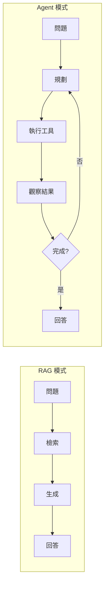
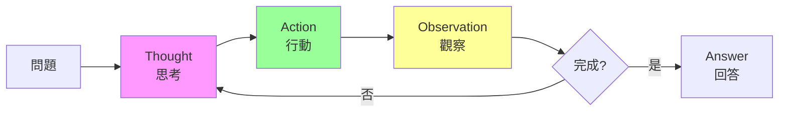

# 第 4 章：從被動檢索到主動決策：Agent 架構入門

> 本章學習目標：
> - 理解為什麼單純的 RAG 無法滿足複雜場景
> - 掌握 Agent 的四大核心能力：感知、規劃、執行、反思
> - 深入理解並實作 ReAct 模式
> - 構建具備工具使用能力的 Agentic RAG 系統

---

## 4.1 為什麼 RAG 不夠用？複雜查詢的挑戰

在前三章，我們建立了一個效能優異的 RAG 系統。但當面對真實的企業場景時，你會發現純 RAG 有其根本性的限制。

### 4.1.1 RAG 的天花板

讓我們看幾個 RAG 無法處理的場景：

**場景 1：需要跨系統操作**

```
使用者：「查詢最近一週的 P0 bug，通知相關開發者，並創建追蹤 issue」

RAG 的回答：「根據文件，P0 bug 的定義是...」

期望的回答：
1. 實際查詢 Jira，找到 5 個 P0 bug
2. 發送 Slack 通知給相關開發者
3. 在 GitHub 創建追蹤 issue
4. 回報執行結果
```

**場景 2：需要多步驟推理**

```
使用者：「分析我們產品在日本市場的定價策略是否合理」

RAG 的回答：「根據定價文件，日本市場的價格是...」

期望的回答：
1. 查詢日本市場的產品定價
2. 查詢日本競爭對手的定價
3. 查詢日本的經濟指標（GDP、購買力）
4. 綜合分析並給出建議
```

**場景 3：需要動態決策**

```
使用者：「幫我準備下週的週報」

RAG 的回答：「週報模板如下...」

期望的回答：
1. 查詢本週完成的任務（從專案管理系統）
2. 查詢本週的會議紀錄（從日曆）
3. 查詢本週的程式碼提交（從 Git）
4. 自動彙整成週報格式
```

### 4.1.2 RAG vs Agent 的本質差異

| 維度 | RAG | Agent |
|------|-----|-------|
| **行為模式** | 被動回應 | 主動規劃 |
| **能力範圍** | 只能讀取 | 可以執行動作 |
| **決策方式** | 單步決策 | 多步推理 |
| **錯誤處理** | 無 | 可重試、可替代 |
| **狀態管理** | 無狀態 | 有工作記憶 |



---

## 4.2 Agent 的核心概念

Agent（智慧代理）是能夠感知環境、做出決策、執行行動的自主系統。讓我們從認知架構的角度理解 Agent。

### 4.2.1 感知（Perception）：理解使用者意圖

Agent 的第一步是理解使用者到底想要什麼。這不僅是文字理解，還包括：

- **意圖識別**：使用者是想查詢資訊還是執行動作？
- **實體提取**：涉及哪些人、系統、時間？
- **上下文關聯**：與之前的對話有什麼關係？

```python
# perception.py
"""
Agent 感知模組
‹1› 負責理解使用者意圖
"""

from langchain_openai import ChatOpenAI
from langchain_core.prompts import ChatPromptTemplate
from pydantic import BaseModel, Field
from typing import List, Optional
from enum import Enum


class IntentType(str, Enum):
    """使用者意圖類型"""
    QUERY = "query"           # 查詢資訊
    ACTION = "action"         # 執行動作
    ANALYSIS = "analysis"     # 分析任務
    MULTI_STEP = "multi_step" # 多步驟任務


class Entity(BaseModel):
    """提取的實體"""
    type: str = Field(description="實體類型：person, system, time, etc.")
    value: str = Field(description="實體值")
    confidence: float = Field(description="置信度 0-1")


class PerceivedIntent(BaseModel):
    """
    感知結果
    ‹2› 結構化的意圖理解
    """
    intent_type: IntentType
    primary_goal: str = Field(description="主要目標的簡潔描述")
    entities: List[Entity] = Field(default_factory=list)
    requires_tools: List[str] = Field(default_factory=list)
    complexity: int = Field(description="複雜度 1-5", ge=1, le=5)


class PerceptionModule:
    """
    感知模組
    ‹3› 將自然語言轉換為結構化意圖
    """

    def __init__(self, llm: ChatOpenAI = None):
        self.llm = llm or ChatOpenAI(model="gpt-4o-mini", temperature=0)

    async def perceive(self, user_input: str, context: str = "") -> PerceivedIntent:
        """
        感知使用者輸入
        ‹4› 返回結構化的意圖理解
        """
        prompt = ChatPromptTemplate.from_template("""
分析以下使用者輸入，提取意圖和關鍵資訊。

可用的工具系統：
- jira: Jira 問題追蹤系統
- slack: Slack 訊息系統
- github: GitHub 程式碼倉庫
- calendar: Google 日曆
- database: 內部資料庫查詢
- search: 向量搜尋（內部文件）

對話上下文：
{context}

使用者輸入：
{user_input}

請以 JSON 格式輸出分析結果，格式如下：
{{
    "intent_type": "query|action|analysis|multi_step",
    "primary_goal": "主要目標的簡潔描述",
    "entities": [
        {{"type": "實體類型", "value": "實體值", "confidence": 0.9}}
    ],
    "requires_tools": ["可能需要的工具列表"],
    "complexity": 1-5
}}
""")

        chain = prompt | self.llm

        result = await chain.ainvoke({
            "user_input": user_input,
            "context": context
        })

        # 解析 JSON
        import json
        try:
            parsed = json.loads(result.content)
            return PerceivedIntent(**parsed)
        except (json.JSONDecodeError, ValueError) as e:
            # 降級處理
            return PerceivedIntent(
                intent_type=IntentType.QUERY,
                primary_goal=user_input,
                entities=[],
                requires_tools=["search"],
                complexity=1
            )
```

### 4.2.2 規劃（Planning）：分解任務

Agent 需要將複雜任務分解為可執行的步驟。這是 Agent 與 RAG 最核心的差異。

```python
# planning.py
"""
Agent 規劃模組
‹1› 負責任務分解和執行計劃
"""

from pydantic import BaseModel, Field
from typing import List, Optional
from enum import Enum


class StepType(str, Enum):
    """步驟類型"""
    TOOL_CALL = "tool_call"     # 調用工具
    REASONING = "reasoning"      # 推理思考
    WAIT_INPUT = "wait_input"    # 等待使用者輸入


class ExecutionStep(BaseModel):
    """
    執行步驟
    ‹2› 單個可執行的任務步驟
    """
    step_id: int
    step_type: StepType
    description: str
    tool_name: Optional[str] = None
    tool_input: Optional[dict] = None
    depends_on: List[int] = Field(default_factory=list)  # 依賴的步驟 ID


class ExecutionPlan(BaseModel):
    """
    執行計劃
    ‹3› 完整的任務執行藍圖
    """
    goal: str
    steps: List[ExecutionStep]
    estimated_tools: List[str]
    requires_human_approval: bool = False


class PlanningModule:
    """
    規劃模組
    ‹4› 將目標轉換為執行計劃
    """

    def __init__(self, llm: ChatOpenAI = None):
        self.llm = llm or ChatOpenAI(model="gpt-4o", temperature=0)

    async def create_plan(
        self,
        intent: PerceivedIntent,
        available_tools: List[str]
    ) -> ExecutionPlan:
        """
        創建執行計劃
        ‹5› 根據意圖和可用工具生成步驟
        """
        prompt = ChatPromptTemplate.from_template("""
你是一個任務規劃專家。根據使用者的目標，制定詳細的執行計劃。

目標: {goal}
意圖類型: {intent_type}
識別的實體: {entities}
可用工具: {available_tools}

規劃原則:
1. 每個步驟應該是原子性的（可單獨執行）
2. 明確步驟之間的依賴關係
3. 考慮可能的失敗情況和替代方案
4. 涉及刪除或發送通知等不可逆操作時，標記需要人工確認

請以 JSON 格式輸出執行計劃：
{{
    "goal": "目標描述",
    "steps": [
        {{
            "step_id": 1,
            "step_type": "tool_call|reasoning|wait_input",
            "description": "步驟描述",
            "tool_name": "工具名稱（如果是 tool_call）",
            "tool_input": {{"param": "value"}},
            "depends_on": []
        }}
    ],
    "estimated_tools": ["將使用的工具列表"],
    "requires_human_approval": false
}}
""")

        chain = prompt | self.llm

        result = await chain.ainvoke({
            "goal": intent.primary_goal,
            "intent_type": intent.intent_type.value,
            "entities": [e.dict() for e in intent.entities],
            "available_tools": available_tools
        })

        import json
        try:
            parsed = json.loads(result.content)
            return ExecutionPlan(**parsed)
        except (json.JSONDecodeError, ValueError):
            # 降級為單步驟計劃
            return ExecutionPlan(
                goal=intent.primary_goal,
                steps=[
                    ExecutionStep(
                        step_id=1,
                        step_type=StepType.TOOL_CALL,
                        description="執行搜尋",
                        tool_name="search",
                        tool_input={"query": intent.primary_goal}
                    )
                ],
                estimated_tools=["search"],
                requires_human_approval=False
            )
```

### 4.2.3 執行（Action）：調用工具

Agent 通過工具與外部世界互動。工具是 Agent 的「手腳」。

```python
# action.py
"""
Agent 執行模組
‹1› 負責工具調用和動作執行
"""

from abc import ABC, abstractmethod
from typing import Dict, Any, Optional
from pydantic import BaseModel


class ToolResult(BaseModel):
    """工具執行結果"""
    success: bool
    data: Any = None
    error: Optional[str] = None
    execution_time_ms: float = 0


class Tool(ABC):
    """
    工具基類
    ‹2› 所有工具必須實現此介面
    """
    name: str
    description: str
    parameters_schema: Dict[str, Any]

    @abstractmethod
    async def execute(self, **kwargs) -> ToolResult:
        """執行工具"""
        pass


class ActionModule:
    """
    執行模組
    ‹3› 管理工具註冊和執行
    """

    def __init__(self):
        self.tools: Dict[str, Tool] = {}

    def register_tool(self, tool: Tool):
        """註冊工具"""
        self.tools[tool.name] = tool

    async def execute_step(self, step: ExecutionStep) -> ToolResult:
        """
        執行單個步驟
        ‹4› 調用工具並處理結果
        """
        if step.step_type != StepType.TOOL_CALL:
            return ToolResult(success=True, data="Non-tool step completed")

        tool_name = step.tool_name
        if tool_name not in self.tools:
            return ToolResult(
                success=False,
                error=f"Tool '{tool_name}' not found"
            )

        tool = self.tools[tool_name]

        import time
        start = time.time()

        try:
            result = await tool.execute(**(step.tool_input or {}))
            result.execution_time_ms = (time.time() - start) * 1000
            return result
        except Exception as e:
            return ToolResult(
                success=False,
                error=str(e),
                execution_time_ms=(time.time() - start) * 1000
            )
```

### 4.2.4 反思（Reflection）：評估結果

Agent 需要評估執行結果，決定是否需要調整計劃或重試。

```python
# reflection.py
"""
Agent 反思模組
‹1› 負責結果評估和計劃調整
"""

from pydantic import BaseModel
from typing import List, Optional
from enum import Enum


class ReflectionOutcome(str, Enum):
    """反思結果"""
    SUCCESS = "success"           # 任務完成
    NEED_RETRY = "need_retry"     # 需要重試
    NEED_REPLAN = "need_replan"   # 需要重新規劃
    NEED_INPUT = "need_input"     # 需要使用者輸入
    FAILED = "failed"             # 無法完成


class ReflectionResult(BaseModel):
    """
    反思結果
    ‹2› 對執行結果的評估
    """
    outcome: ReflectionOutcome
    reasoning: str
    next_action: Optional[str] = None
    adjusted_plan: Optional[ExecutionPlan] = None


class ReflectionModule:
    """
    反思模組
    ‹3› 評估執行結果並決定下一步
    """

    def __init__(self, llm: ChatOpenAI = None):
        self.llm = llm or ChatOpenAI(model="gpt-4o-mini", temperature=0)

    async def reflect(
        self,
        original_goal: str,
        executed_steps: List[dict],
        step_results: List[ToolResult],
        remaining_steps: List[ExecutionStep]
    ) -> ReflectionResult:
        """
        反思執行結果
        ‹4› 決定是否繼續、重試或重新規劃
        """
        prompt = ChatPromptTemplate.from_template("""
評估當前的任務執行狀態，決定下一步行動。

原始目標: {goal}

已執行的步驟:
{executed_steps}

執行結果:
{results}

剩餘步驟:
{remaining_steps}

請評估：
1. 目標是否已達成？
2. 是否有步驟失敗需要重試？
3. 是否需要調整計劃？
4. 是否需要詢問使用者更多資訊？

以 JSON 格式輸出：
{{
    "outcome": "success|need_retry|need_replan|need_input|failed",
    "reasoning": "評估的理由",
    "next_action": "建議的下一步動作（如果有）"
}}
""")

        chain = prompt | self.llm

        result = await chain.ainvoke({
            "goal": original_goal,
            "executed_steps": executed_steps,
            "results": [r.dict() for r in step_results],
            "remaining_steps": [s.dict() for s in remaining_steps]
        })

        import json
        try:
            parsed = json.loads(result.content)
            return ReflectionResult(**parsed)
        except (json.JSONDecodeError, ValueError):
            return ReflectionResult(
                outcome=ReflectionOutcome.FAILED,
                reasoning="Unable to parse reflection result"
            )
```

---

## 4.3 ReAct 模式深度剖析

**ReAct（Reasoning + Acting）** 是目前最主流的 Agent 設計模式，由 Google Research 在 2022 年提出。它的核心思想是：讓 LLM 交替進行「思考」和「行動」。

### 4.3.1 ReAct 循環



**ReAct 提示模板**：

```
你是一個能夠使用工具的 AI 助手。請按照以下格式回應：

Thought: 我需要先思考這個問題...（你的推理過程）
Action: tool_name[tool_input]
Observation: （工具返回的結果）
... (可以重複多次)
Thought: 我現在有足夠的資訊來回答了
Answer: （最終答案）

可用的工具：
{tools}

問題：{question}
```

### 4.3.2 完整的 ReAct Agent 實作

```python
# react_agent.py
"""
ReAct Agent 完整實作
‹1› 核心的思考-行動循環
"""

import re
from typing import List, Dict, Any, Optional
from langchain_openai import ChatOpenAI
from langchain_core.prompts import ChatPromptTemplate


class ReActAgent:
    """
    ReAct 模式 Agent
    ‹2› 交替進行思考和行動
    """

    def __init__(
        self,
        llm: ChatOpenAI = None,
        tools: Dict[str, Tool] = None,
        max_iterations: int = 10
    ):
        self.llm = llm or ChatOpenAI(model="gpt-4o", temperature=0)
        self.tools = tools or {}
        self.max_iterations = max_iterations

        # ‹3› ReAct 提示模板
        self.prompt = ChatPromptTemplate.from_template("""
你是一個能夠使用工具解決問題的 AI 助手。

請按照以下格式回應（每次只輸出一個 Thought-Action 對或最終 Answer）：

Thought: 分析當前情況，思考下一步該做什麼
Action: tool_name[tool_input]

或者，如果你已經有足夠資訊：

Thought: 我已經有足夠的資訊來回答問題了
Answer: 你的最終回答

可用的工具：
{tool_descriptions}

之前的對話：
{scratchpad}

問題：{question}
""")

    def _format_tool_descriptions(self) -> str:
        """格式化工具描述"""
        descriptions = []
        for name, tool in self.tools.items():
            descriptions.append(f"- {name}: {tool.description}")
        return "\n".join(descriptions)

    def _parse_response(self, response: str) -> Dict[str, Any]:
        """
        解析 LLM 回應
        ‹4› 提取 Thought、Action 或 Answer
        """
        result = {"type": None, "content": None}

        # 嘗試匹配 Answer
        answer_match = re.search(r"Answer:\s*(.+?)$", response, re.DOTALL)
        if answer_match:
            result["type"] = "answer"
            result["content"] = answer_match.group(1).strip()
            return result

        # 匹配 Thought
        thought_match = re.search(r"Thought:\s*(.+?)(?=Action:|$)", response, re.DOTALL)
        if thought_match:
            result["thought"] = thought_match.group(1).strip()

        # 匹配 Action
        action_match = re.search(r"Action:\s*(\w+)\[(.+?)\]", response)
        if action_match:
            result["type"] = "action"
            result["tool_name"] = action_match.group(1)
            result["tool_input"] = action_match.group(2)
            return result

        # 無法解析，視為回答
        result["type"] = "answer"
        result["content"] = response
        return result

    async def run(self, question: str) -> Dict[str, Any]:
        """
        執行 ReAct 循環
        ‹5› 主要的執行邏輯
        """
        scratchpad = []  # ‹6› 工作記憶
        iteration = 0

        while iteration < self.max_iterations:
            iteration += 1

            # ‹7› 構建提示
            prompt_value = self.prompt.format(
                tool_descriptions=self._format_tool_descriptions(),
                scratchpad=self._format_scratchpad(scratchpad),
                question=question
            )

            # ‹8› 調用 LLM
            response = await self.llm.ainvoke(prompt_value)
            response_text = response.content

            # ‹9› 解析回應
            parsed = self._parse_response(response_text)

            if parsed["type"] == "answer":
                # 任務完成
                return {
                    "answer": parsed["content"],
                    "iterations": iteration,
                    "scratchpad": scratchpad
                }

            elif parsed["type"] == "action":
                # ‹10› 執行工具
                tool_name = parsed["tool_name"]
                tool_input = parsed["tool_input"]

                # 記錄思考和行動
                scratchpad.append({
                    "thought": parsed.get("thought", ""),
                    "action": f"{tool_name}[{tool_input}]"
                })

                # 執行工具
                if tool_name in self.tools:
                    try:
                        result = await self.tools[tool_name].execute(
                            query=tool_input
                        )
                        observation = result.data if result.success else f"Error: {result.error}"
                    except Exception as e:
                        observation = f"Error: {str(e)}"
                else:
                    observation = f"Error: Tool '{tool_name}' not found"

                # ‹11› 記錄觀察結果
                scratchpad[-1]["observation"] = observation

        # 達到最大迭代次數
        return {
            "answer": "I couldn't complete the task within the iteration limit.",
            "iterations": iteration,
            "scratchpad": scratchpad
        }

    def _format_scratchpad(self, scratchpad: List[Dict]) -> str:
        """格式化工作記憶"""
        if not scratchpad:
            return "(無)"

        formatted = []
        for i, entry in enumerate(scratchpad, 1):
            formatted.append(f"[步驟 {i}]")
            if entry.get("thought"):
                formatted.append(f"Thought: {entry['thought']}")
            if entry.get("action"):
                formatted.append(f"Action: {entry['action']}")
            if entry.get("observation"):
                formatted.append(f"Observation: {entry['observation']}")
            formatted.append("")

        return "\n".join(formatted)
```

### 4.3.3 ReAct 執行範例

```python
# 使用範例
async def demo_react():
    # 創建工具
    search_tool = VectorSearchTool(vector_store)
    jira_tool = JiraSearchTool(jira_client)

    # 創建 Agent
    agent = ReActAgent(
        tools={
            "search": search_tool,
            "jira": jira_tool
        }
    )

    # 執行
    result = await agent.run(
        "找出最近一週的 P0 bug，並總結它們的共同原因"
    )

    print("=== ReAct 執行過程 ===")
    for entry in result["scratchpad"]:
        print(f"\nThought: {entry.get('thought', '')}")
        print(f"Action: {entry.get('action', '')}")
        print(f"Observation: {entry.get('observation', '')[:200]}...")

    print(f"\n=== 最終答案 ===")
    print(result["answer"])
```

**執行輸出**：

```
=== ReAct 執行過程 ===

Thought: 我需要查詢 Jira 系統中最近一週的 P0 bug
Action: jira[project = PROD AND priority = P0 AND created >= -7d]
Observation: 找到 5 個 P0 bug:
1. PROD-123: 登入頁面崩潰
2. PROD-125: 支付失敗
3. PROD-127: 資料同步錯誤
...

Thought: 現在我需要分析這些 bug 的共同原因。讓我搜尋相關的技術文件
Action: search[P0 bug 根因分析 登入 支付 資料同步]
Observation: 根據技術文件，這些問題都與最近的資料庫遷移有關...

Thought: 我現在有足夠的資訊來回答問題了
Answer: 最近一週共有 5 個 P0 bug，主要原因分析如下...

=== 最終答案 ===
最近一週共有 5 個 P0 bug，主要原因分析如下：
1. 資料庫遷移導致的連線問題（3 個）
2. 快取失效導致的效能問題（1 個）
3. 第三方 API 變更導致的整合問題（1 個）

建議：優先處理資料庫連線問題，並加強遷移前的測試...
```

---

## 4.4 實作：構建你的第一個 Agent

現在讓我們將所有模組整合成一個完整的 Agentic RAG 系統。

### 4.4.1 工具介面設計

```python
# tools/base.py
"""
工具基礎設施
"""

from abc import ABC, abstractmethod
from pydantic import BaseModel, Field
from typing import Dict, Any, List


class ToolSchema(BaseModel):
    """
    工具 Schema
    ‹1› LLM 可理解的工具描述
    """
    name: str
    description: str
    parameters: Dict[str, Any]
    examples: List[Dict[str, str]] = Field(default_factory=list)


class BaseTool(ABC):
    """
    工具基類
    ‹2› 所有工具繼承此類
    """

    @property
    @abstractmethod
    def schema(self) -> ToolSchema:
        """返回工具 Schema"""
        pass

    @abstractmethod
    async def execute(self, **kwargs) -> ToolResult:
        """執行工具"""
        pass

    def to_llm_format(self) -> Dict[str, Any]:
        """
        轉換為 LLM 可用的格式
        ‹3› 用於構建提示
        """
        s = self.schema
        return {
            "name": s.name,
            "description": s.description,
            "parameters": s.parameters,
            "examples": [
                f"  - {ex['input']} → {ex['output']}"
                for ex in s.examples
            ]
        }
```

### 4.4.2 實作核心工具

```python
# tools/implementations.py
"""
具體工具實作
"""


class VectorSearchTool(BaseTool):
    """
    向量搜尋工具
    ‹1› 搜尋內部文件
    """

    def __init__(self, vector_store):
        self.vector_store = vector_store

    @property
    def schema(self) -> ToolSchema:
        return ToolSchema(
            name="search_docs",
            description="搜尋公司內部文件。使用自然語言查詢，返回最相關的文件片段。",
            parameters={
                "type": "object",
                "properties": {
                    "query": {
                        "type": "string",
                        "description": "搜尋查詢（自然語言）"
                    },
                    "top_k": {
                        "type": "integer",
                        "description": "返回結果數量",
                        "default": 5
                    }
                },
                "required": ["query"]
            },
            examples=[
                {"input": "遠端工作政策", "output": "返回 5 份相關文件"},
                {"input": "請假流程", "output": "返回請假相關的文件片段"}
            ]
        )

    async def execute(self, query: str, top_k: int = 5) -> ToolResult:
        try:
            results = self.vector_store.similarity_search(query, k=top_k)
            formatted = [
                {
                    "content": doc.page_content[:500],
                    "source": doc.metadata.get("source", "unknown")
                }
                for doc in results
            ]
            return ToolResult(success=True, data=formatted)
        except Exception as e:
            return ToolResult(success=False, error=str(e))


class WebSearchTool(BaseTool):
    """
    網路搜尋工具
    ‹2› 搜尋外部網路資訊
    """

    def __init__(self, api_key: str = None):
        self.api_key = api_key or os.getenv("SERPER_API_KEY")

    @property
    def schema(self) -> ToolSchema:
        return ToolSchema(
            name="web_search",
            description="搜尋網路獲取最新資訊。適用於需要即時資訊或公司外部知識的查詢。",
            parameters={
                "type": "object",
                "properties": {
                    "query": {
                        "type": "string",
                        "description": "搜尋查詢"
                    }
                },
                "required": ["query"]
            },
            examples=[
                {"input": "2024 AI 趨勢", "output": "返回最新的 AI 趨勢新聞"},
            ]
        )

    async def execute(self, query: str) -> ToolResult:
        import aiohttp

        url = "https://google.serper.dev/search"
        headers = {"X-API-KEY": self.api_key}
        payload = {"q": query, "num": 5}

        try:
            async with aiohttp.ClientSession() as session:
                async with session.post(url, json=payload, headers=headers) as resp:
                    data = await resp.json()

            results = [
                {
                    "title": r.get("title"),
                    "snippet": r.get("snippet"),
                    "link": r.get("link")
                }
                for r in data.get("organic", [])[:5]
            ]
            return ToolResult(success=True, data=results)
        except Exception as e:
            return ToolResult(success=False, error=str(e))


class CalculatorTool(BaseTool):
    """
    計算工具
    ‹3› 執行數學計算
    """

    @property
    def schema(self) -> ToolSchema:
        return ToolSchema(
            name="calculator",
            description="執行數學計算。支援基本運算和常用數學函數。",
            parameters={
                "type": "object",
                "properties": {
                    "expression": {
                        "type": "string",
                        "description": "數學表達式，如 '2 + 2' 或 'sqrt(16)'"
                    }
                },
                "required": ["expression"]
            },
            examples=[
                {"input": "2 + 2", "output": "4"},
                {"input": "sqrt(16) * 2", "output": "8.0"}
            ]
        )

    async def execute(self, expression: str) -> ToolResult:
        import math

        # 安全的數學環境
        safe_dict = {
            "abs": abs, "round": round,
            "min": min, "max": max,
            "sum": sum, "pow": pow,
            "sqrt": math.sqrt, "log": math.log,
            "sin": math.sin, "cos": math.cos,
            "pi": math.pi, "e": math.e
        }

        try:
            result = eval(expression, {"__builtins__": {}}, safe_dict)
            return ToolResult(success=True, data=result)
        except Exception as e:
            return ToolResult(success=False, error=f"計算錯誤: {str(e)}")
```

### 4.4.3 整合的 Agentic RAG 系統

```python
# agentic_rag.py
"""
Agentic RAG 系統
‹1› 整合 Agent 和 RAG 的完整系統
"""


class AgenticRAG:
    """
    具備 Agent 能力的 RAG 系統
    ‹2› 可以思考、規劃、執行、反思
    """

    def __init__(
        self,
        vector_store,
        llm: ChatOpenAI = None,
        additional_tools: List[BaseTool] = None
    ):
        self.llm = llm or ChatOpenAI(model="gpt-4o", temperature=0)

        # ‹3› 初始化核心工具
        self.tools = {
            "search_docs": VectorSearchTool(vector_store),
            "web_search": WebSearchTool(),
            "calculator": CalculatorTool(),
        }

        # 添加額外工具
        if additional_tools:
            for tool in additional_tools:
                self.tools[tool.schema.name] = tool

        # ‹4› 初始化各模組
        self.perception = PerceptionModule(self.llm)
        self.planning = PlanningModule(self.llm)
        self.reflection = ReflectionModule(self.llm)

        # ‹5› 初始化 ReAct Agent
        self.react_agent = ReActAgent(
            llm=self.llm,
            tools=self.tools
        )

    async def process(self, user_input: str, context: str = "") -> Dict[str, Any]:
        """
        處理使用者輸入
        ‹6› 完整的 Agent 處理流程
        """
        # 步驟 1: 感知
        intent = await self.perception.perceive(user_input, context)

        # ‹7› 簡單查詢直接使用 RAG
        if intent.intent_type == IntentType.QUERY and intent.complexity <= 2:
            return await self._simple_rag_response(user_input)

        # ‹8› 複雜任務使用 Agent
        result = await self.react_agent.run(user_input)

        return {
            "answer": result["answer"],
            "intent": intent.dict(),
            "execution_trace": result.get("scratchpad", []),
            "iterations": result.get("iterations", 0)
        }

    async def _simple_rag_response(self, query: str) -> Dict[str, Any]:
        """
        簡單 RAG 回應
        ‹9› 對於簡單查詢，直接使用 RAG
        """
        # 搜尋
        search_result = await self.tools["search_docs"].execute(query=query)

        if not search_result.success:
            return {"answer": "抱歉，搜尋時發生錯誤。", "error": search_result.error}

        # 生成回答
        context = "\n\n".join([
            f"來源: {doc['source']}\n內容: {doc['content']}"
            for doc in search_result.data
        ])

        prompt = ChatPromptTemplate.from_template("""
根據以下文件內容回答問題。

文件:
{context}

問題: {question}

回答:
""")

        chain = prompt | self.llm
        response = await chain.ainvoke({
            "context": context,
            "question": query
        })

        return {
            "answer": response.content,
            "sources": [doc["source"] for doc in search_result.data],
            "mode": "simple_rag"
        }
```

---

## 4.5 Agent 的可觀測性

### 4.5.1 決策鏈追蹤

```python
# observability.py
"""
Agent 可觀測性模組
"""

from dataclasses import dataclass, field
from datetime import datetime
from typing import List, Dict, Any
import json


@dataclass
class TraceEvent:
    """追蹤事件"""
    timestamp: datetime
    event_type: str  # perception, planning, action, reflection, answer
    data: Dict[str, Any]
    duration_ms: float = 0


@dataclass
class AgentTrace:
    """
    完整的 Agent 執行追蹤
    ‹1› 用於除錯和分析
    """
    trace_id: str
    start_time: datetime
    user_input: str
    events: List[TraceEvent] = field(default_factory=list)
    final_answer: str = ""
    total_tokens: int = 0
    total_cost: float = 0

    def add_event(
        self,
        event_type: str,
        data: Dict[str, Any],
        duration_ms: float = 0
    ):
        self.events.append(TraceEvent(
            timestamp=datetime.now(),
            event_type=event_type,
            data=data,
            duration_ms=duration_ms
        ))

    def to_json(self) -> str:
        """導出為 JSON"""
        return json.dumps({
            "trace_id": self.trace_id,
            "start_time": self.start_time.isoformat(),
            "user_input": self.user_input,
            "events": [
                {
                    "timestamp": e.timestamp.isoformat(),
                    "event_type": e.event_type,
                    "data": e.data,
                    "duration_ms": e.duration_ms
                }
                for e in self.events
            ],
            "final_answer": self.final_answer,
            "total_tokens": self.total_tokens,
            "total_cost": self.total_cost
        }, indent=2, ensure_ascii=False)

    def print_summary(self):
        """打印執行摘要"""
        print(f"\n{'='*60}")
        print(f"Agent 執行追蹤 [{self.trace_id}]")
        print(f"{'='*60}")
        print(f"輸入: {self.user_input}")
        print(f"\n執行步驟:")

        for i, event in enumerate(self.events, 1):
            print(f"\n  [{i}] {event.event_type} ({event.duration_ms:.1f}ms)")
            if event.event_type == "action":
                print(f"      工具: {event.data.get('tool_name')}")
                print(f"      結果: {str(event.data.get('result', ''))[:100]}...")
            elif event.event_type == "thought":
                print(f"      思考: {event.data.get('content', '')[:100]}...")

        print(f"\n{'='*60}")
        print(f"最終答案: {self.final_answer[:200]}...")
        print(f"總 Token: {self.total_tokens}, 成本: ${self.total_cost:.4f}")
```

### 4.5.2 視覺化儀表板數據

```python
# 輸出結構化數據供 Grafana 等工具使用
def export_metrics(trace: AgentTrace) -> Dict[str, Any]:
    """
    導出監控指標
    ‹2› 供監控系統使用
    """
    action_events = [e for e in trace.events if e.event_type == "action"]
    thought_events = [e for e in trace.events if e.event_type == "thought"]

    return {
        "trace_id": trace.trace_id,
        "timestamp": trace.start_time.isoformat(),
        "metrics": {
            "total_duration_ms": sum(e.duration_ms for e in trace.events),
            "thought_count": len(thought_events),
            "action_count": len(action_events),
            "iteration_count": len(action_events),
            "tokens_used": trace.total_tokens,
            "cost_usd": trace.total_cost
        },
        "tool_usage": {
            e.data.get("tool_name"): e.duration_ms
            for e in action_events
            if e.data.get("tool_name")
        }
    }
```

---

## 4.6 總結與下一步

### 本章回顧

在本章中，我們：

1. **理解了 RAG 的局限性**：無法執行動作、無法多步推理
2. **掌握了 Agent 的四大能力**：感知、規劃、執行、反思
3. **深入學習了 ReAct 模式**：思考-行動-觀察的循環
4. **實作了完整的 Agentic RAG**：整合工具使用和智慧決策
5. **建立了可觀測性基礎**：追蹤和監控 Agent 行為

### 關鍵決策說明

| 決策點 | 選擇 | 原因 |
|--------|------|------|
| Agent 模式 | ReAct | 簡單有效，易於調試 |
| 簡單查詢 | 直接 RAG | 減少不必要的迭代成本 |
| 複雜度閾值 | 2 | 平衡效率與能力 |
| 最大迭代數 | 10 | 防止無限循環 |

### 下一章預告

在第 5 章「多資料來源整合」中，我們將：

- 設計統一的資料來源抽象層
- 實作查詢路由器（Query Router）
- 學習結果融合算法（RRF、加權融合）
- 整合 SQL 資料庫、API、向量資料庫

---

## 本章程式碼清單

| 檔案 | 說明 |
|------|------|
| `perception.py` | 感知模組 |
| `planning.py` | 規劃模組 |
| `action.py` | 執行模組 |
| `reflection.py` | 反思模組 |
| `react_agent.py` | ReAct Agent 實作 |
| `tools/*.py` | 工具實作 |
| `agentic_rag.py` | 整合系統 |
| `observability.py` | 可觀測性模組 |

完整程式碼請參見 `code-examples/chapter-04/` 目錄。
