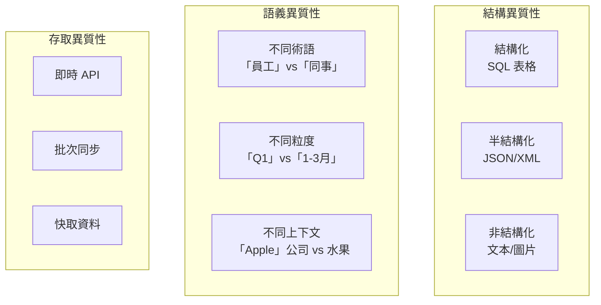

# 第 5 章：多資料來源整合：構建異質性檢索系統

> 本章學習目標：
> - 理解企業資料異質性的挑戰
> - 設計統一的資料來源抽象介面
> - 實作智慧查詢路由器
> - 掌握結果融合算法（RRF、加權融合）

---

## 5.1 企業資料的異質性挑戰

企業的知識不只存在於文件中。一個完整的企業知識系統需要整合：

- **向量資料庫**：內部文件、知識庫
- **關聯式資料庫**：員工資訊、客戶資料、訂單記錄
- **外部 API**：天氣、股價、新聞
- **SaaS 系統**：Jira、Confluence、Salesforce

### 5.1.1 資料異質性的三個維度



### 5.1.2 統一查詢的複雜性

```
使用者問題：「張三的上季度業績如何？跟部門平均比起來怎麼樣？」

需要的資料：
1. 員工資料庫：找到「張三」的 ID 和部門
2. 業績系統：查詢張三的 Q3 銷售數據
3. 部門統計：計算部門平均業績
4. 知識庫：查找業績評估標準
```

---

## 5.2 設計統一的資料來源介面

### 5.2.1 DataSource 抽象基類

```python
# data_sources/base.py
"""
資料來源抽象層
‹1› 定義統一的資料來源介面
"""

from abc import ABC, abstractmethod
from typing import List, Dict, Any, Optional
from pydantic import BaseModel, Field
from datetime import datetime


class SearchResult(BaseModel):
    """
    統一的搜尋結果格式
    ‹2› 所有資料來源返回相同格式
    """
    id: str
    content: str
    score: float = Field(ge=0, le=1, description="相關性分數 0-1")
    source_type: str
    source_name: str
    metadata: Dict[str, Any] = Field(default_factory=dict)
    timestamp: Optional[datetime] = None


class DataSourceCapability(BaseModel):
    """
    資料來源能力描述
    ‹3› 用於查詢路由決策
    """
    supports_semantic_search: bool = False
    supports_keyword_search: bool = False
    supports_filters: bool = False
    supports_aggregation: bool = False
    data_domains: List[str] = Field(default_factory=list)
    example_queries: List[str] = Field(default_factory=list)


class DataSource(ABC):
    """
    資料來源抽象基類
    ‹4› 所有資料來源適配器必須實現此介面
    """

    @property
    @abstractmethod
    def name(self) -> str:
        """資料來源名稱"""
        pass

    @property
    @abstractmethod
    def description(self) -> str:
        """資料來源描述"""
        pass

    @property
    @abstractmethod
    def capabilities(self) -> DataSourceCapability:
        """資料來源能力"""
        pass

    @abstractmethod
    async def search(
        self,
        query: str,
        top_k: int = 5,
        filters: Optional[Dict[str, Any]] = None
    ) -> List[SearchResult]:
        """
        執行搜尋
        ‹5› 返回統一格式的結果
        """
        pass

    async def health_check(self) -> bool:
        """健康檢查"""
        return True

    def to_router_format(self) -> Dict[str, Any]:
        """
        轉換為路由器可用的格式
        ‹6› 供查詢路由器使用
        """
        return {
            "name": self.name,
            "description": self.description,
            "capabilities": self.capabilities.dict(),
        }
```

### 5.2.2 VectorStoreAdapter

```python
# data_sources/vector_store.py
"""
向量資料庫適配器
"""


class VectorStoreAdapter(DataSource):
    """
    向量資料庫適配器
    ‹1› 將向量搜尋包裝成統一介面
    """

    def __init__(
        self,
        vector_store,
        embedder,
        source_name: str = "company_documents"
    ):
        self.store = vector_store
        self.embedder = embedder
        self._name = source_name

    @property
    def name(self) -> str:
        return self._name

    @property
    def description(self) -> str:
        return "公司內部文件知識庫，包含政策、技術文檔、培訓資料等"

    @property
    def capabilities(self) -> DataSourceCapability:
        return DataSourceCapability(
            supports_semantic_search=True,
            supports_keyword_search=False,
            supports_filters=True,
            supports_aggregation=False,
            data_domains=["policies", "technical_docs", "training"],
            example_queries=[
                "遠端工作政策是什麼？",
                "如何申請請假？",
                "系統架構文檔"
            ]
        )

    async def search(
        self,
        query: str,
        top_k: int = 5,
        filters: Optional[Dict[str, Any]] = None
    ) -> List[SearchResult]:
        """
        執行向量搜尋
        ‹2› 將向量搜尋結果轉換為統一格式
        """
        # 向量化查詢
        query_embedding = self.embedder.encode(query)

        # 執行搜尋
        results = self.store.similarity_search_with_score(
            query,
            k=top_k,
            filter=filters
        )

        # 轉換為統一格式
        return [
            SearchResult(
                id=f"vec_{i}",
                content=doc.page_content,
                score=self._normalize_score(score),  # ‹3› 歸一化分數
                source_type="vector_store",
                source_name=self.name,
                metadata={
                    "source_file": doc.metadata.get("source", ""),
                    "page": doc.metadata.get("page"),
                    **doc.metadata
                }
            )
            for i, (doc, score) in enumerate(results)
        ]

    def _normalize_score(self, score: float) -> float:
        """
        歸一化分數到 [0, 1]
        ‹4› ChromaDB 返回距離，需要轉換為相似度
        """
        # 假設使用餘弦距離，範圍 [0, 2]
        # 轉換為相似度 [0, 1]
        return max(0, 1 - score / 2)
```

### 5.2.3 SQLDatabaseAdapter

```python
# data_sources/sql_database.py
"""
SQL 資料庫適配器
"""

import asyncpg
from langchain_openai import ChatOpenAI


class SQLDatabaseAdapter(DataSource):
    """
    SQL 資料庫適配器
    ‹1› 支援自然語言轉 SQL
    """

    def __init__(
        self,
        connection_string: str,
        llm: ChatOpenAI = None,
        source_name: str = "employee_database"
    ):
        self.connection_string = connection_string
        self.llm = llm or ChatOpenAI(model="gpt-4o-mini", temperature=0)
        self._name = source_name
        self._pool = None
        self._schema_cache = None

    @property
    def name(self) -> str:
        return self._name

    @property
    def description(self) -> str:
        return "員工與組織資料庫，包含員工資訊、部門結構、績效資料等"

    @property
    def capabilities(self) -> DataSourceCapability:
        return DataSourceCapability(
            supports_semantic_search=False,
            supports_keyword_search=True,
            supports_filters=True,
            supports_aggregation=True,
            data_domains=["employees", "departments", "performance"],
            example_queries=[
                "張三的聯繫方式是什麼？",
                "研發部門有多少人？",
                "上季度銷售冠軍是誰？"
            ]
        )

    async def _get_pool(self):
        if not self._pool:
            self._pool = await asyncpg.create_pool(self.connection_string)
        return self._pool

    async def _get_schema(self) -> str:
        """
        獲取資料庫 Schema
        ‹2› 用於 Text-to-SQL
        """
        if self._schema_cache:
            return self._schema_cache

        pool = await self._get_pool()
        async with pool.acquire() as conn:
            # 查詢表結構
            tables = await conn.fetch("""
                SELECT table_name, column_name, data_type
                FROM information_schema.columns
                WHERE table_schema = 'public'
                ORDER BY table_name, ordinal_position
            """)

        # 格式化 Schema
        schema_dict = {}
        for row in tables:
            table = row['table_name']
            if table not in schema_dict:
                schema_dict[table] = []
            schema_dict[table].append(f"{row['column_name']} ({row['data_type']})")

        self._schema_cache = "\n".join([
            f"Table {table}:\n  - " + "\n  - ".join(cols)
            for table, cols in schema_dict.items()
        ])

        return self._schema_cache

    async def search(
        self,
        query: str,
        top_k: int = 5,
        filters: Optional[Dict[str, Any]] = None
    ) -> List[SearchResult]:
        """
        執行自然語言查詢
        ‹3› 先轉換為 SQL，再執行
        """
        # 步驟 1: 自然語言轉 SQL
        sql_query = await self._text_to_sql(query, top_k)

        # 步驟 2: 執行 SQL
        pool = await self._get_pool()
        async with pool.acquire() as conn:
            try:
                rows = await conn.fetch(sql_query)
            except Exception as e:
                return [SearchResult(
                    id="sql_error",
                    content=f"SQL 執行錯誤: {str(e)}",
                    score=0,
                    source_type="sql_database",
                    source_name=self.name
                )]

        # 步驟 3: 轉換為統一格式
        return [
            SearchResult(
                id=f"sql_{i}",
                content=self._format_row(dict(row)),
                score=1.0,  # ‹4› SQL 結果沒有相關性分數
                source_type="sql_database",
                source_name=self.name,
                metadata={"raw_data": dict(row)}
            )
            for i, row in enumerate(rows[:top_k])
        ]

    async def _text_to_sql(self, query: str, limit: int) -> str:
        """
        自然語言轉 SQL
        ‹5› 使用 LLM 進行轉換
        """
        schema = await self._get_schema()

        prompt = f"""
你是一個 SQL 專家。根據使用者的自然語言問題，生成 PostgreSQL 查詢。

資料庫 Schema:
{schema}

使用者問題: {query}

規則:
1. 只生成 SELECT 查詢（安全考量）
2. 必須加上 LIMIT {limit}
3. 只輸出 SQL 語句，不要解釋

SQL:
"""

        response = await self.llm.ainvoke(prompt)
        sql = response.content.strip()

        # 移除可能的 markdown 格式
        if sql.startswith("```"):
            sql = sql.split("\n", 1)[1].rsplit("```", 1)[0]

        return sql

    def _format_row(self, row: Dict[str, Any]) -> str:
        """
        將資料行格式化為自然語言
        ‹6› 提升 LLM 的理解
        """
        parts = [f"{k}: {v}" for k, v in row.items() if v is not None]
        return " | ".join(parts)
```

### 5.2.4 ExternalAPIAdapter

```python
# data_sources/external_api.py
"""
外部 API 適配器
"""

import aiohttp


class WeatherAPIAdapter(DataSource):
    """
    天氣 API 適配器
    ‹1› 示範外部 API 整合
    """

    def __init__(self, api_key: str):
        self.api_key = api_key

    @property
    def name(self) -> str:
        return "weather_api"

    @property
    def description(self) -> str:
        return "即時天氣資訊 API，可查詢全球城市的天氣狀況"

    @property
    def capabilities(self) -> DataSourceCapability:
        return DataSourceCapability(
            supports_semantic_search=False,
            supports_keyword_search=True,
            supports_filters=True,
            supports_aggregation=False,
            data_domains=["weather", "climate"],
            example_queries=[
                "台北今天天氣如何？",
                "東京明天會下雨嗎？"
            ]
        )

    async def search(
        self,
        query: str,
        top_k: int = 5,
        filters: Optional[Dict[str, Any]] = None
    ) -> List[SearchResult]:
        """
        查詢天氣
        ‹2› 解析城市名稱並查詢 API
        """
        # 從查詢中提取城市
        city = filters.get("city") if filters else self._extract_city(query)

        if not city:
            return [SearchResult(
                id="weather_error",
                content="無法識別要查詢的城市",
                score=0,
                source_type="api",
                source_name=self.name
            )]

        # 調用天氣 API
        url = f"https://api.weatherapi.com/v1/current.json"
        params = {"key": self.api_key, "q": city, "lang": "zh_tw"}

        async with aiohttp.ClientSession() as session:
            async with session.get(url, params=params) as resp:
                if resp.status != 200:
                    return [SearchResult(
                        id="weather_error",
                        content=f"API 錯誤: {resp.status}",
                        score=0,
                        source_type="api",
                        source_name=self.name
                    )]

                data = await resp.json()

        # 格式化結果
        location = data.get("location", {})
        current = data.get("current", {})

        content = f"""
{location.get('name', city)} 目前天氣:
- 溫度: {current.get('temp_c')}°C
- 體感溫度: {current.get('feelslike_c')}°C
- 天氣狀況: {current.get('condition', {}).get('text', '')}
- 濕度: {current.get('humidity')}%
- 風速: {current.get('wind_kph')} km/h
"""

        return [SearchResult(
            id=f"weather_{city}",
            content=content,
            score=1.0,
            source_type="api",
            source_name=self.name,
            metadata={"raw_data": data}
        )]

    def _extract_city(self, query: str) -> Optional[str]:
        """簡單的城市提取（實際應使用 NER）"""
        cities = ["台北", "台中", "高雄", "東京", "大阪", "北京", "上海"]
        for city in cities:
            if city in query:
                return city
        return None
```

---

## 5.3 查詢路由策略

### 5.3.1 基於規則的路由

```python
# routing/rule_based.py
"""
基於規則的查詢路由
"""


class RuleBasedRouter:
    """
    規則路由器
    ‹1› 使用預定義規則決定查詢目標
    """

    def __init__(self, data_sources: List[DataSource]):
        self.sources = {ds.name: ds for ds in data_sources}
        self.rules = self._build_rules()

    def _build_rules(self) -> List[Dict]:
        """
        建立路由規則
        ‹2› 根據關鍵字和資料域匹配
        """
        return [
            {
                "keywords": ["員工", "同事", "聯繫方式", "email", "部門"],
                "domains": ["employees", "departments"],
                "target": "employee_database"
            },
            {
                "keywords": ["政策", "規定", "流程", "如何"],
                "domains": ["policies", "procedures"],
                "target": "company_documents"
            },
            {
                "keywords": ["天氣", "氣溫", "下雨"],
                "domains": ["weather"],
                "target": "weather_api"
            }
        ]

    def route(self, query: str) -> List[str]:
        """
        決定查詢路由
        ‹3› 返回應該查詢的資料來源列表
        """
        query_lower = query.lower()
        matched_sources = set()

        for rule in self.rules:
            # 關鍵字匹配
            if any(kw in query_lower for kw in rule["keywords"]):
                if rule["target"] in self.sources:
                    matched_sources.add(rule["target"])

        # 如果沒有匹配，使用預設來源
        if not matched_sources:
            matched_sources.add("company_documents")

        return list(matched_sources)
```

### 5.3.2 基於 LLM 的智慧路由

```python
# routing/llm_router.py
"""
LLM 智慧路由
"""


class LLMQueryRouter:
    """
    LLM 智慧路由器
    ‹1› 使用 LLM 理解查詢意圖並路由
    """

    def __init__(
        self,
        data_sources: List[DataSource],
        llm: ChatOpenAI = None
    ):
        self.sources = {ds.name: ds for ds in data_sources}
        self.llm = llm or ChatOpenAI(model="gpt-4o-mini", temperature=0)

    async def route(self, query: str) -> Dict[str, Any]:
        """
        智慧路由
        ‹2› 返回目標來源和查詢策略
        """
        # 構建資料來源描述
        sources_desc = "\n".join([
            f"- {name}: {ds.description}\n  能力: {ds.capabilities.data_domains}"
            for name, ds in self.sources.items()
        ])

        prompt = f"""
分析使用者查詢，決定應該查詢哪些資料來源。

可用的資料來源:
{sources_desc}

使用者查詢: {query}

請以 JSON 格式輸出:
{{
    "target_sources": ["source1", "source2"],
    "query_strategy": "parallel" 或 "sequential",
    "reasoning": "選擇這些來源的原因",
    "sub_queries": {{
        "source1": "針對該來源優化的子查詢",
        "source2": "針對該來源優化的子查詢"
    }}
}}
"""

        response = await self.llm.ainvoke(prompt)

        import json
        try:
            return json.loads(response.content)
        except json.JSONDecodeError:
            # 降級為預設路由
            return {
                "target_sources": ["company_documents"],
                "query_strategy": "parallel",
                "reasoning": "無法解析路由決策，使用預設來源"
            }
```

### 5.3.3 並行查詢 vs 順序查詢

```python
# routing/executor.py
"""
查詢執行器
"""

import asyncio
from typing import List


class QueryExecutor:
    """
    查詢執行器
    ‹1› 管理多資料來源的查詢執行
    """

    def __init__(self, data_sources: Dict[str, DataSource]):
        self.sources = data_sources

    async def execute_parallel(
        self,
        routing_decision: Dict[str, Any],
        original_query: str,
        top_k: int = 5
    ) -> List[SearchResult]:
        """
        並行執行多個查詢
        ‹2› 同時查詢所有資料來源
        """
        target_sources = routing_decision["target_sources"]
        sub_queries = routing_decision.get("sub_queries", {})

        # 創建並行任務
        tasks = []
        for source_name in target_sources:
            if source_name in self.sources:
                source = self.sources[source_name]
                # 使用子查詢（如果有）或原始查詢
                query = sub_queries.get(source_name, original_query)
                tasks.append(source.search(query, top_k=top_k))

        # 並行執行
        results = await asyncio.gather(*tasks, return_exceptions=True)

        # 合併結果
        all_results = []
        for result in results:
            if isinstance(result, list):
                all_results.extend(result)
            # 忽略異常結果

        return all_results

    async def execute_sequential(
        self,
        routing_decision: Dict[str, Any],
        original_query: str,
        top_k: int = 5
    ) -> List[SearchResult]:
        """
        順序執行查詢
        ‹3› 根據前一個結果決定下一步
        """
        target_sources = routing_decision["target_sources"]
        sub_queries = routing_decision.get("sub_queries", {})

        all_results = []
        context = {}  # ‹4› 傳遞上下文

        for source_name in target_sources:
            if source_name not in self.sources:
                continue

            source = self.sources[source_name]
            query = sub_queries.get(source_name, original_query)

            # 使用上下文增強查詢（如果有）
            if context:
                query = f"{query}\n上下文: {context}"

            results = await source.search(query, top_k=top_k)
            all_results.extend(results)

            # 更新上下文
            if results:
                context[source_name] = results[0].content[:200]

        return all_results
```

---

## 5.4 結果融合與排序

### 5.4.1 Reciprocal Rank Fusion (RRF)

```python
# fusion/rrf.py
"""
Reciprocal Rank Fusion
"""

from typing import List, Dict
from collections import defaultdict


def reciprocal_rank_fusion(
    result_lists: List[List[SearchResult]],
    k: int = 60
) -> List[SearchResult]:
    """
    RRF 結果融合
    ‹1› 基於排名的融合方法

    公式: score = Σ(1 / (k + rank_i))

    Args:
        result_lists: 多個來源的結果列表
        k: RRF 常數，通常設為 60

    Returns:
        融合並排序後的結果
    """
    # 計算每個文件的 RRF 分數
    rrf_scores: Dict[str, Dict] = defaultdict(lambda: {"score": 0, "doc": None})

    for results in result_lists:
        for rank, result in enumerate(results, start=1):
            doc_id = result.id
            rrf_scores[doc_id]["score"] += 1 / (k + rank)
            rrf_scores[doc_id]["doc"] = result

    # 排序
    sorted_items = sorted(
        rrf_scores.items(),
        key=lambda x: x[1]["score"],
        reverse=True
    )

    # 更新分數並返回
    fused_results = []
    for doc_id, data in sorted_items:
        result = data["doc"]
        result.score = data["score"]  # 更新為 RRF 分數
        result.metadata["rrf_score"] = data["score"]
        fused_results.append(result)

    return fused_results
```

### 5.4.2 加權平均融合

```python
# fusion/weighted.py
"""
加權融合
"""


def weighted_fusion(
    result_lists: List[List[SearchResult]],
    weights: List[float] = None,
    normalize: bool = True
) -> List[SearchResult]:
    """
    加權平均融合
    ‹1› 根據來源可信度加權

    Args:
        result_lists: 多個來源的結果列表
        weights: 每個來源的權重
        normalize: 是否歸一化分數

    Returns:
        融合並排序後的結果
    """
    if weights is None:
        weights = [1.0] * len(result_lists)

    # 確保權重數量匹配
    assert len(weights) == len(result_lists)

    # 歸一化每個來源的分數
    if normalize:
        normalized_lists = []
        for results in result_lists:
            if not results:
                normalized_lists.append([])
                continue

            max_score = max(r.score for r in results)
            min_score = min(r.score for r in results)
            score_range = max_score - min_score or 1

            normalized = []
            for r in results:
                r_copy = r.copy()
                r_copy.score = (r.score - min_score) / score_range
                normalized.append(r_copy)
            normalized_lists.append(normalized)

        result_lists = normalized_lists

    # 計算加權分數
    doc_scores: Dict[str, Dict] = defaultdict(lambda: {"score": 0, "doc": None})

    for weight, results in zip(weights, result_lists):
        for result in results:
            doc_id = result.id
            doc_scores[doc_id]["score"] += weight * result.score
            doc_scores[doc_id]["doc"] = result

    # 排序並返回
    sorted_items = sorted(
        doc_scores.items(),
        key=lambda x: x[1]["score"],
        reverse=True
    )

    fused_results = []
    for doc_id, data in sorted_items:
        result = data["doc"]
        result.score = data["score"]
        fused_results.append(result)

    return fused_results
```

### 5.4.3 去重策略

```python
# fusion/dedup.py
"""
結果去重
"""

from difflib import SequenceMatcher


def deduplicate_results(
    results: List[SearchResult],
    similarity_threshold: float = 0.85
) -> List[SearchResult]:
    """
    去除重複或高度相似的結果
    ‹1› 基於內容相似度去重

    Args:
        results: 待去重的結果列表
        similarity_threshold: 相似度閾值

    Returns:
        去重後的結果
    """
    unique_results = []

    for result in results:
        is_duplicate = False

        for existing in unique_results:
            # 計算文本相似度
            similarity = SequenceMatcher(
                None,
                result.content[:500],
                existing.content[:500]
            ).ratio()

            if similarity >= similarity_threshold:
                is_duplicate = True
                # 保留分數較高的
                if result.score > existing.score:
                    unique_results.remove(existing)
                    unique_results.append(result)
                break

        if not is_duplicate:
            unique_results.append(result)

    return unique_results
```

---

## 5.5 實作：三層架構設計

```python
# multi_source_rag.py
"""
多資料來源 RAG 系統
‹1› 完整的整合實作
"""


class MultiSourceRAG:
    """
    多資料來源 RAG 系統
    ‹2› 整合多個異質資料來源
    """

    def __init__(
        self,
        data_sources: List[DataSource],
        llm: ChatOpenAI = None,
        use_llm_router: bool = True
    ):
        self.sources = {ds.name: ds for ds in data_sources}
        self.llm = llm or ChatOpenAI(model="gpt-4o", temperature=0)

        # 路由器
        if use_llm_router:
            self.router = LLMQueryRouter(data_sources, self.llm)
        else:
            self.router = RuleBasedRouter(data_sources)

        # 執行器
        self.executor = QueryExecutor(self.sources)

    async def query(
        self,
        question: str,
        top_k: int = 5,
        fusion_method: str = "rrf"
    ) -> Dict[str, Any]:
        """
        執行多來源查詢
        ‹3› 完整的查詢流程
        """
        # 步驟 1: 路由決策
        if isinstance(self.router, LLMQueryRouter):
            routing = await self.router.route(question)
        else:
            routing = {
                "target_sources": self.router.route(question),
                "query_strategy": "parallel"
            }

        # 步驟 2: 執行查詢
        strategy = routing.get("query_strategy", "parallel")
        if strategy == "parallel":
            results = await self.executor.execute_parallel(
                routing, question, top_k=top_k * 2  # 多取一些用於融合
            )
        else:
            results = await self.executor.execute_sequential(
                routing, question, top_k=top_k * 2
            )

        # 步驟 3: 結果融合
        if len(routing["target_sources"]) > 1:
            # 按來源分組
            grouped = defaultdict(list)
            for r in results:
                grouped[r.source_name].append(r)

            if fusion_method == "rrf":
                fused = reciprocal_rank_fusion(list(grouped.values()))
            else:
                fused = weighted_fusion(list(grouped.values()))
        else:
            fused = results

        # 步驟 4: 去重
        deduped = deduplicate_results(fused)[:top_k]

        # 步驟 5: 生成回答
        answer = await self._generate_answer(question, deduped)

        return {
            "answer": answer,
            "sources": [
                {
                    "source": r.source_name,
                    "content": r.content[:200],
                    "score": r.score
                }
                for r in deduped
            ],
            "routing": routing
        }

    async def _generate_answer(
        self,
        question: str,
        results: List[SearchResult]
    ) -> str:
        """生成回答"""
        context = "\n\n---\n\n".join([
            f"[來源: {r.source_name}]\n{r.content}"
            for r in results
        ])

        prompt = f"""
根據以下來自多個資料來源的資訊，回答使用者的問題。

參考資料:
{context}

問題: {question}

回答:
"""

        response = await self.llm.ainvoke(prompt)
        return response.content
```

---

## 5.6 效能優化與快取策略

```python
# caching.py
"""
查詢快取
"""

import hashlib
import json
from datetime import datetime, timedelta
from typing import Optional
import redis


class QueryCache:
    """
    查詢結果快取
    ‹1› 減少重複查詢
    """

    def __init__(
        self,
        redis_client: redis.Redis,
        default_ttl: int = 3600  # 1 小時
    ):
        self.redis = redis_client
        self.default_ttl = default_ttl

    def _generate_key(self, query: str, sources: List[str]) -> str:
        """生成快取鍵"""
        content = f"{query}:{sorted(sources)}"
        return f"query_cache:{hashlib.md5(content.encode()).hexdigest()}"

    async def get(
        self,
        query: str,
        sources: List[str]
    ) -> Optional[Dict[str, Any]]:
        """獲取快取"""
        key = self._generate_key(query, sources)
        cached = self.redis.get(key)

        if cached:
            return json.loads(cached)
        return None

    async def set(
        self,
        query: str,
        sources: List[str],
        result: Dict[str, Any],
        ttl: int = None
    ):
        """設置快取"""
        key = self._generate_key(query, sources)
        ttl = ttl or self.default_ttl

        self.redis.setex(
            key,
            ttl,
            json.dumps(result, default=str)
        )
```

---

## 5.7 總結與下一步

### 本章回顧

在本章中，我們：

1. **理解了企業資料異質性**：結構、語義、存取三個維度
2. **設計了統一的資料來源介面**：DataSource 抽象類
3. **實作了三種資料適配器**：向量資料庫、SQL 資料庫、外部 API
4. **掌握了查詢路由策略**：基於規則和 LLM 的路由
5. **學習了結果融合算法**：RRF 和加權融合

### 關鍵決策說明

| 決策點 | 選擇 | 原因 |
|--------|------|------|
| 路由方式 | LLM 路由 | 更智慧，能處理複雜查詢 |
| 融合算法 | RRF | 不需歸一化，效果穩定 |
| 快取策略 | 1 小時 TTL | 平衡新鮮度與效能 |

### 下一章預告

在第 6 章「Agent 工具生態系統」中，我們將：

- 設計可擴展的工具註冊框架
- 實作 5 個主要企業工具（Jira、Slack、GitHub 等）
- 建立安全的工具調用審計機制
- 學習工具的組合與編排

---

## 本章程式碼清單

| 檔案 | 說明 |
|------|------|
| `data_sources/base.py` | 資料來源抽象類 |
| `data_sources/vector_store.py` | 向量資料庫適配器 |
| `data_sources/sql_database.py` | SQL 資料庫適配器 |
| `data_sources/external_api.py` | 外部 API 適配器 |
| `routing/rule_based.py` | 規則路由器 |
| `routing/llm_router.py` | LLM 路由器 |
| `fusion/rrf.py` | RRF 融合 |
| `multi_source_rag.py` | 完整整合 |

完整程式碼請參見 `code-examples/chapter-05/` 目錄。
