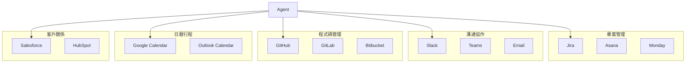

# 第 6 章：Agent 工具生態系統：整合外部 API 與服務

> 本章學習目標：
> - 設計可擴展的工具註冊與發現框架
> - 實作 5 個主要企業工具適配器
> - 建立安全的工具調用審計機制
> - 掌握工具的組合與編排模式

---

## 6.1 為什麼需要工具生態系統？

在第 4 章，我們的 Agent 學會了使用工具。但那只是開始。一個真正強大的企業 Agent，需要能夠操作數十甚至上百個工具，就像一個經驗豐富的員工知道如何使用公司的各種系統一樣。

### 6.1.1 工具的價值

```
沒有工具的 Agent:
  - 只能回答問題
  - 無法執行動作
  - 無法與外部系統互動

有工具的 Agent:
  - 可以查詢資料庫
  - 可以發送通知
  - 可以創建任務
  - 可以與任何 API 互動
```

### 6.1.2 企業常見的工具需求



---

## 6.2 工具的標準化介面設計

### ‹1› Tool Schema：名稱、描述、參數

```python
# tools/schema.py
"""
工具 Schema 定義
‹1› 標準化的工具描述格式
"""

from pydantic import BaseModel, Field
from typing import List, Dict, Any, Optional, Callable
from enum import Enum


class ParameterType(str, Enum):
    """參數類型"""
    STRING = "string"
    INTEGER = "integer"
    NUMBER = "number"
    BOOLEAN = "boolean"
    ARRAY = "array"
    OBJECT = "object"


class ToolParameter(BaseModel):
    """
    工具參數定義
    ‹2› 描述單個參數的完整資訊
    """
    name: str = Field(description="參數名稱")
    type: ParameterType = Field(description="參數類型")
    description: str = Field(description="參數描述")
    required: bool = Field(default=True, description="是否必填")
    default: Any = Field(default=None, description="預設值")
    enum: Optional[List[Any]] = Field(default=None, description="允許的枚舉值")
    examples: List[Any] = Field(default_factory=list, description="範例值")


class ToolSchema(BaseModel):
    """
    工具 Schema
    ‹3› 完整描述一個工具的能力
    """
    name: str = Field(description="工具唯一識別名稱")
    description: str = Field(description="工具功能的自然語言描述")
    parameters: List[ToolParameter] = Field(default_factory=list)
    returns: str = Field(description="返回值描述")
    examples: List[Dict[str, Any]] = Field(
        default_factory=list,
        description="使用範例 (input, output)"
    )
    category: str = Field(default="general", description="工具分類")
    requires_confirmation: bool = Field(
        default=False,
        description="是否需要使用者確認"
    )

    def to_openai_function(self) -> Dict[str, Any]:
        """
        轉換為 OpenAI Function Calling 格式
        ‹4› 兼容 OpenAI 的函數調用 API
        """
        properties = {}
        required = []

        for param in self.parameters:
            prop = {
                "type": param.type.value,
                "description": param.description,
            }
            if param.enum:
                prop["enum"] = param.enum
            if param.default is not None:
                prop["default"] = param.default

            properties[param.name] = prop

            if param.required:
                required.append(param.name)

        return {
            "name": self.name,
            "description": self.description,
            "parameters": {
                "type": "object",
                "properties": properties,
                "required": required
            }
        }

    def to_claude_tool(self) -> Dict[str, Any]:
        """
        轉換為 Claude Tool Use 格式
        ‹5› 兼容 Claude 的工具使用 API
        """
        return {
            "name": self.name,
            "description": self.description,
            "input_schema": {
                "type": "object",
                "properties": {
                    param.name: {
                        "type": param.type.value,
                        "description": param.description
                    }
                    for param in self.parameters
                },
                "required": [p.name for p in self.parameters if p.required]
            }
        }
```

### ‹2› Input Validation

```python
# tools/validation.py
"""
輸入驗證
"""

from pydantic import ValidationError


class InputValidator:
    """
    輸入驗證器
    ‹1› 確保工具輸入符合 Schema
    """

    @staticmethod
    def validate(
        schema: ToolSchema,
        inputs: Dict[str, Any]
    ) -> tuple[bool, Optional[str]]:
        """
        驗證輸入
        ‹2› 返回 (是否有效, 錯誤訊息)
        """
        errors = []

        # 檢查必填參數
        required_params = {p.name for p in schema.parameters if p.required}
        provided_params = set(inputs.keys())
        missing = required_params - provided_params

        if missing:
            errors.append(f"缺少必填參數: {missing}")

        # 驗證類型
        for param in schema.parameters:
            if param.name not in inputs:
                continue

            value = inputs[param.name]
            expected_type = param.type

            if not InputValidator._check_type(value, expected_type):
                errors.append(
                    f"參數 '{param.name}' 類型錯誤: "
                    f"期望 {expected_type.value}, 得到 {type(value).__name__}"
                )

            # 驗證枚舉值
            if param.enum and value not in param.enum:
                errors.append(
                    f"參數 '{param.name}' 值不在允許範圍內: "
                    f"允許 {param.enum}, 得到 {value}"
                )

        if errors:
            return False, "; ".join(errors)
        return True, None

    @staticmethod
    def _check_type(value: Any, expected: ParameterType) -> bool:
        """檢查類型"""
        type_mapping = {
            ParameterType.STRING: str,
            ParameterType.INTEGER: int,
            ParameterType.NUMBER: (int, float),
            ParameterType.BOOLEAN: bool,
            ParameterType.ARRAY: list,
            ParameterType.OBJECT: dict,
        }
        return isinstance(value, type_mapping.get(expected, object))
```

### ‹3› Output Normalization

```python
# tools/output.py
"""
輸出標準化
"""

from datetime import datetime
from pydantic import BaseModel
from typing import Any, Optional


class ToolOutput(BaseModel):
    """
    標準化的工具輸出
    ‹1› 所有工具返回統一格式
    """
    success: bool
    data: Any = None
    error: Optional[str] = None
    error_code: Optional[str] = None
    execution_time_ms: float = 0
    timestamp: datetime = Field(default_factory=datetime.now)
    metadata: Dict[str, Any] = Field(default_factory=dict)

    def to_llm_context(self) -> str:
        """
        轉換為 LLM 可理解的上下文
        ‹2› 用於傳回 Agent
        """
        if self.success:
            if isinstance(self.data, dict):
                # 格式化字典
                lines = [f"{k}: {v}" for k, v in self.data.items()]
                return "\n".join(lines)
            elif isinstance(self.data, list):
                # 格式化列表
                return "\n".join([f"- {item}" for item in self.data[:10]])
            else:
                return str(self.data)
        else:
            return f"錯誤: {self.error}"
```

---

## 6.3 實作主要企業工具適配器

### 6.3.1 Jira API：查詢、創建、更新 Issue

```python
# tools/jira_tool.py
"""
Jira 工具
"""

import aiohttp
from base64 import b64encode


class JiraTool:
    """
    Jira 工具適配器
    ‹1› 完整的 Jira 操作支援
    """

    def __init__(
        self,
        domain: str,
        email: str,
        api_token: str
    ):
        self.base_url = f"https://{domain}.atlassian.net/rest/api/3"
        self.auth = b64encode(f"{email}:{api_token}".encode()).decode()
        self.headers = {
            "Authorization": f"Basic {self.auth}",
            "Content-Type": "application/json"
        }

    @property
    def search_schema(self) -> ToolSchema:
        """搜尋 Issue 的 Schema"""
        return ToolSchema(
            name="jira_search",
            description="使用 JQL 搜尋 Jira issues",
            parameters=[
                ToolParameter(
                    name="jql",
                    type=ParameterType.STRING,
                    description="Jira Query Language 查詢語句",
                    examples=[
                        "project = DEMO AND status = Open",
                        "assignee = currentUser() AND priority = High"
                    ]
                ),
                ToolParameter(
                    name="max_results",
                    type=ParameterType.INTEGER,
                    description="最大返回結果數",
                    required=False,
                    default=10
                )
            ],
            returns="匹配的 Jira issues 列表",
            category="project_management",
            examples=[
                {
                    "input": {"jql": "project = WEB AND priority = P0"},
                    "output": "找到 3 個 P0 issues..."
                }
            ]
        )

    @property
    def create_schema(self) -> ToolSchema:
        """創建 Issue 的 Schema"""
        return ToolSchema(
            name="jira_create",
            description="創建新的 Jira issue",
            parameters=[
                ToolParameter(
                    name="project_key",
                    type=ParameterType.STRING,
                    description="專案 Key（如 'WEB'）"
                ),
                ToolParameter(
                    name="summary",
                    type=ParameterType.STRING,
                    description="Issue 標題"
                ),
                ToolParameter(
                    name="description",
                    type=ParameterType.STRING,
                    description="Issue 描述",
                    required=False
                ),
                ToolParameter(
                    name="issue_type",
                    type=ParameterType.STRING,
                    description="Issue 類型",
                    enum=["Bug", "Task", "Story", "Epic"],
                    default="Task"
                ),
                ToolParameter(
                    name="priority",
                    type=ParameterType.STRING,
                    description="優先級",
                    enum=["Highest", "High", "Medium", "Low", "Lowest"],
                    required=False
                )
            ],
            returns="創建的 Issue Key 和 URL",
            category="project_management",
            requires_confirmation=True  # ‹2› 創建操作需確認
        )

    async def search(self, jql: str, max_results: int = 10) -> ToolOutput:
        """
        搜尋 Jira issues
        ‹3› 使用 JQL 查詢
        """
        import time
        start = time.time()

        url = f"{self.base_url}/search"
        payload = {
            "jql": jql,
            "maxResults": max_results,
            "fields": ["summary", "status", "priority", "assignee", "created"]
        }

        try:
            async with aiohttp.ClientSession() as session:
                async with session.post(
                    url,
                    json=payload,
                    headers=self.headers
                ) as resp:
                    if resp.status != 200:
                        error_text = await resp.text()
                        return ToolOutput(
                            success=False,
                            error=f"Jira API 錯誤: {resp.status} - {error_text}",
                            error_code=f"JIRA_{resp.status}"
                        )

                    data = await resp.json()

            # 格式化結果
            issues = []
            for issue in data.get("issues", []):
                fields = issue.get("fields", {})
                issues.append({
                    "key": issue["key"],
                    "summary": fields.get("summary"),
                    "status": fields.get("status", {}).get("name"),
                    "priority": fields.get("priority", {}).get("name"),
                    "assignee": fields.get("assignee", {}).get("displayName") if fields.get("assignee") else "Unassigned"
                })

            return ToolOutput(
                success=True,
                data=issues,
                execution_time_ms=(time.time() - start) * 1000,
                metadata={"total": data.get("total", 0)}
            )

        except Exception as e:
            return ToolOutput(
                success=False,
                error=str(e),
                error_code="JIRA_CONNECTION_ERROR"
            )

    async def create(
        self,
        project_key: str,
        summary: str,
        description: str = "",
        issue_type: str = "Task",
        priority: str = None
    ) -> ToolOutput:
        """
        創建 Jira issue
        ‹4› 需要使用者確認
        """
        import time
        start = time.time()

        url = f"{self.base_url}/issue"

        payload = {
            "fields": {
                "project": {"key": project_key},
                "summary": summary,
                "description": {
                    "type": "doc",
                    "version": 1,
                    "content": [
                        {
                            "type": "paragraph",
                            "content": [{"type": "text", "text": description}]
                        }
                    ]
                } if description else None,
                "issuetype": {"name": issue_type}
            }
        }

        if priority:
            payload["fields"]["priority"] = {"name": priority}

        try:
            async with aiohttp.ClientSession() as session:
                async with session.post(
                    url,
                    json=payload,
                    headers=self.headers
                ) as resp:
                    if resp.status not in [200, 201]:
                        error_text = await resp.text()
                        return ToolOutput(
                            success=False,
                            error=f"創建失敗: {resp.status} - {error_text}"
                        )

                    data = await resp.json()

            return ToolOutput(
                success=True,
                data={
                    "key": data["key"],
                    "url": f"https://{self.base_url.split('/')[2]}/browse/{data['key']}"
                },
                execution_time_ms=(time.time() - start) * 1000
            )

        except Exception as e:
            return ToolOutput(success=False, error=str(e))
```

### 6.3.2 Slack API：發送訊息、查詢頻道

```python
# tools/slack_tool.py
"""
Slack 工具
"""


class SlackTool:
    """
    Slack 工具適配器
    ‹1› 發送訊息和查詢頻道
    """

    def __init__(self, bot_token: str):
        self.token = bot_token
        self.headers = {
            "Authorization": f"Bearer {bot_token}",
            "Content-Type": "application/json"
        }

    @property
    def send_message_schema(self) -> ToolSchema:
        return ToolSchema(
            name="slack_send_message",
            description="發送訊息到 Slack 頻道或使用者",
            parameters=[
                ToolParameter(
                    name="channel",
                    type=ParameterType.STRING,
                    description="頻道 ID 或名稱（如 #general 或 @username）"
                ),
                ToolParameter(
                    name="message",
                    type=ParameterType.STRING,
                    description="要發送的訊息內容"
                ),
                ToolParameter(
                    name="thread_ts",
                    type=ParameterType.STRING,
                    description="回覆的訊息時間戳（用於執行緒回覆）",
                    required=False
                )
            ],
            returns="發送結果和訊息時間戳",
            category="communication",
            requires_confirmation=True  # ‹2› 發送訊息需確認
        )

    @property
    def search_messages_schema(self) -> ToolSchema:
        return ToolSchema(
            name="slack_search",
            description="搜尋 Slack 訊息",
            parameters=[
                ToolParameter(
                    name="query",
                    type=ParameterType.STRING,
                    description="搜尋關鍵字"
                ),
                ToolParameter(
                    name="channel",
                    type=ParameterType.STRING,
                    description="限定搜尋的頻道",
                    required=False
                ),
                ToolParameter(
                    name="count",
                    type=ParameterType.INTEGER,
                    description="返回結果數量",
                    default=10,
                    required=False
                )
            ],
            returns="匹配的訊息列表",
            category="communication"
        )

    async def send_message(
        self,
        channel: str,
        message: str,
        thread_ts: str = None
    ) -> ToolOutput:
        """
        發送 Slack 訊息
        ‹3› 支援頻道和執行緒
        """
        import time
        start = time.time()

        url = "https://slack.com/api/chat.postMessage"
        payload = {
            "channel": channel,
            "text": message
        }
        if thread_ts:
            payload["thread_ts"] = thread_ts

        try:
            async with aiohttp.ClientSession() as session:
                async with session.post(
                    url,
                    json=payload,
                    headers=self.headers
                ) as resp:
                    data = await resp.json()

            if not data.get("ok"):
                return ToolOutput(
                    success=False,
                    error=data.get("error", "Unknown error")
                )

            return ToolOutput(
                success=True,
                data={
                    "channel": data.get("channel"),
                    "ts": data.get("ts"),
                    "message": "訊息已發送"
                },
                execution_time_ms=(time.time() - start) * 1000
            )

        except Exception as e:
            return ToolOutput(success=False, error=str(e))

    async def search_messages(
        self,
        query: str,
        channel: str = None,
        count: int = 10
    ) -> ToolOutput:
        """搜尋訊息"""
        import time
        start = time.time()

        url = "https://slack.com/api/search.messages"
        params = {
            "query": query if not channel else f"in:{channel} {query}",
            "count": count
        }

        try:
            async with aiohttp.ClientSession() as session:
                async with session.get(
                    url,
                    params=params,
                    headers=self.headers
                ) as resp:
                    data = await resp.json()

            if not data.get("ok"):
                return ToolOutput(
                    success=False,
                    error=data.get("error", "Unknown error")
                )

            messages = []
            for match in data.get("messages", {}).get("matches", []):
                messages.append({
                    "text": match.get("text", "")[:200],
                    "user": match.get("user"),
                    "channel": match.get("channel", {}).get("name"),
                    "ts": match.get("ts")
                })

            return ToolOutput(
                success=True,
                data=messages,
                execution_time_ms=(time.time() - start) * 1000
            )

        except Exception as e:
            return ToolOutput(success=False, error=str(e))
```

### 6.3.3 GitHub API：查詢 PR、創建 Issue

```python
# tools/github_tool.py
"""
GitHub 工具
"""


class GitHubTool:
    """
    GitHub 工具適配器
    ‹1› 程式碼倉庫操作
    """

    def __init__(self, token: str, owner: str, repo: str):
        self.token = token
        self.owner = owner
        self.repo = repo
        self.base_url = f"https://api.github.com/repos/{owner}/{repo}"
        self.headers = {
            "Authorization": f"token {token}",
            "Accept": "application/vnd.github.v3+json"
        }

    @property
    def list_prs_schema(self) -> ToolSchema:
        return ToolSchema(
            name="github_list_prs",
            description="列出 GitHub Pull Requests",
            parameters=[
                ToolParameter(
                    name="state",
                    type=ParameterType.STRING,
                    description="PR 狀態",
                    enum=["open", "closed", "all"],
                    default="open"
                ),
                ToolParameter(
                    name="per_page",
                    type=ParameterType.INTEGER,
                    description="每頁數量",
                    default=10,
                    required=False
                )
            ],
            returns="Pull Request 列表",
            category="code_management"
        )

    @property
    def create_issue_schema(self) -> ToolSchema:
        return ToolSchema(
            name="github_create_issue",
            description="創建 GitHub Issue",
            parameters=[
                ToolParameter(
                    name="title",
                    type=ParameterType.STRING,
                    description="Issue 標題"
                ),
                ToolParameter(
                    name="body",
                    type=ParameterType.STRING,
                    description="Issue 內容",
                    required=False
                ),
                ToolParameter(
                    name="labels",
                    type=ParameterType.ARRAY,
                    description="標籤列表",
                    required=False
                )
            ],
            returns="創建的 Issue 資訊",
            category="code_management",
            requires_confirmation=True
        )

    async def list_pull_requests(
        self,
        state: str = "open",
        per_page: int = 10
    ) -> ToolOutput:
        """列出 PR"""
        import time
        start = time.time()

        url = f"{self.base_url}/pulls"
        params = {"state": state, "per_page": per_page}

        try:
            async with aiohttp.ClientSession() as session:
                async with session.get(
                    url,
                    params=params,
                    headers=self.headers
                ) as resp:
                    if resp.status != 200:
                        return ToolOutput(
                            success=False,
                            error=f"GitHub API 錯誤: {resp.status}"
                        )

                    data = await resp.json()

            prs = [
                {
                    "number": pr["number"],
                    "title": pr["title"],
                    "state": pr["state"],
                    "user": pr["user"]["login"],
                    "created_at": pr["created_at"],
                    "url": pr["html_url"]
                }
                for pr in data
            ]

            return ToolOutput(
                success=True,
                data=prs,
                execution_time_ms=(time.time() - start) * 1000
            )

        except Exception as e:
            return ToolOutput(success=False, error=str(e))

    async def create_issue(
        self,
        title: str,
        body: str = "",
        labels: List[str] = None
    ) -> ToolOutput:
        """創建 Issue"""
        import time
        start = time.time()

        url = f"{self.base_url}/issues"
        payload = {"title": title, "body": body}
        if labels:
            payload["labels"] = labels

        try:
            async with aiohttp.ClientSession() as session:
                async with session.post(
                    url,
                    json=payload,
                    headers=self.headers
                ) as resp:
                    if resp.status not in [200, 201]:
                        return ToolOutput(
                            success=False,
                            error=f"創建失敗: {resp.status}"
                        )

                    data = await resp.json()

            return ToolOutput(
                success=True,
                data={
                    "number": data["number"],
                    "url": data["html_url"],
                    "title": data["title"]
                },
                execution_time_ms=(time.time() - start) * 1000
            )

        except Exception as e:
            return ToolOutput(success=False, error=str(e))
```

---

## 6.4 工具的組合與編排

### 6.4.1 工具註冊中心

```python
# tools/registry.py
"""
工具註冊中心
"""

from typing import Dict, List, Optional, Callable


class ToolRegistry:
    """
    工具註冊中心
    ‹1› 管理所有可用的工具
    """

    def __init__(self):
        self._tools: Dict[str, Dict] = {}
        self._categories: Dict[str, List[str]] = {}

    def register(
        self,
        name: str,
        schema: ToolSchema,
        handler: Callable,
        category: str = "general"
    ):
        """
        註冊工具
        ‹2› 儲存 Schema 和處理函數
        """
        self._tools[name] = {
            "schema": schema,
            "handler": handler,
            "category": category
        }

        if category not in self._categories:
            self._categories[category] = []
        self._categories[category].append(name)

    def get_tool(self, name: str) -> Optional[Dict]:
        """獲取工具"""
        return self._tools.get(name)

    def get_all_schemas(self) -> List[ToolSchema]:
        """獲取所有工具的 Schema"""
        return [t["schema"] for t in self._tools.values()]

    def get_tools_by_category(self, category: str) -> List[str]:
        """根據分類獲取工具"""
        return self._categories.get(category, [])

    def get_tools_for_llm(self) -> List[Dict]:
        """
        獲取 LLM 格式的工具列表
        ‹3› 用於提示構建
        """
        return [
            {
                "name": name,
                "description": t["schema"].description,
                "parameters": [
                    {
                        "name": p.name,
                        "type": p.type.value,
                        "description": p.description,
                        "required": p.required
                    }
                    for p in t["schema"].parameters
                ]
            }
            for name, t in self._tools.items()
        ]

    async def execute(
        self,
        tool_name: str,
        **kwargs
    ) -> ToolOutput:
        """
        執行工具
        ‹4› 統一的執行入口
        """
        tool = self._tools.get(tool_name)
        if not tool:
            return ToolOutput(
                success=False,
                error=f"工具 '{tool_name}' 不存在"
            )

        # 驗證輸入
        is_valid, error = InputValidator.validate(tool["schema"], kwargs)
        if not is_valid:
            return ToolOutput(success=False, error=error)

        # 執行
        try:
            return await tool["handler"](**kwargs)
        except Exception as e:
            return ToolOutput(
                success=False,
                error=f"執行錯誤: {str(e)}"
            )
```

### 6.4.2 工具編排器

```python
# tools/orchestrator.py
"""
工具編排器
"""


class ToolOrchestrator:
    """
    工具編排器
    ‹1› 管理複雜的多工具任務
    """

    def __init__(
        self,
        registry: ToolRegistry,
        llm: ChatOpenAI = None
    ):
        self.registry = registry
        self.llm = llm or ChatOpenAI(model="gpt-4o", temperature=0)

    async def execute_workflow(
        self,
        workflow: List[Dict[str, Any]]
    ) -> List[ToolOutput]:
        """
        執行工作流
        ‹2› 按順序執行多個工具，支援結果傳遞
        """
        results = []
        context = {}  # 用於傳遞結果

        for step in workflow:
            tool_name = step["tool"]
            inputs = step.get("inputs", {})

            # 解析模板變數
            resolved_inputs = self._resolve_inputs(inputs, context)

            # 執行
            result = await self.registry.execute(tool_name, **resolved_inputs)
            results.append(result)

            # 儲存結果到上下文
            step_id = step.get("id", f"step_{len(results)}")
            context[step_id] = result.data

            # 檢查是否繼續
            if not result.success and step.get("stop_on_error", True):
                break

        return results

    def _resolve_inputs(
        self,
        inputs: Dict[str, Any],
        context: Dict[str, Any]
    ) -> Dict[str, Any]:
        """
        解析輸入中的模板變數
        ‹3› 支援 {{step_id.field}} 格式
        """
        import re
        resolved = {}

        for key, value in inputs.items():
            if isinstance(value, str):
                # 查找 {{...}} 格式的變數
                matches = re.findall(r'\{\{(\w+)\.(\w+)\}\}', value)
                for step_id, field in matches:
                    if step_id in context and isinstance(context[step_id], dict):
                        replacement = context[step_id].get(field, "")
                        value = value.replace(
                            f"{{{{{step_id}.{field}}}}}",
                            str(replacement)
                        )
                resolved[key] = value
            else:
                resolved[key] = value

        return resolved
```

---

## 6.5 安全與權限管理

### 6.5.1 OAuth 整合

```python
# security/oauth.py
"""
OAuth 整合
"""

from datetime import datetime, timedelta


class OAuthManager:
    """
    OAuth 管理器
    ‹1› 管理工具的 OAuth 授權
    """

    def __init__(self, db_pool):
        self.db = db_pool

    async def get_access_token(
        self,
        user_id: str,
        service: str
    ) -> Optional[str]:
        """
        獲取使用者的存取令牌
        ‹2› 自動處理令牌刷新
        """
        async with self.db.acquire() as conn:
            row = await conn.fetchrow("""
                SELECT access_token, refresh_token, expires_at
                FROM oauth_tokens
                WHERE user_id = $1 AND service = $2
            """, user_id, service)

        if not row:
            return None

        # 檢查是否過期
        if row["expires_at"] < datetime.now():
            # 刷新令牌
            new_token = await self._refresh_token(
                service,
                row["refresh_token"]
            )
            return new_token

        return row["access_token"]

    async def _refresh_token(
        self,
        service: str,
        refresh_token: str
    ) -> Optional[str]:
        """刷新令牌"""
        # 實際實作會根據服務調用不同的 OAuth 端點
        pass
```

### 6.5.2 工具調用審計日誌

```python
# security/audit.py
"""
審計日誌
"""


class ToolAuditLogger:
    """
    工具審計日誌
    ‹1› 記錄所有工具調用
    """

    def __init__(self, db_pool):
        self.db = db_pool

    async def log_call(
        self,
        user_id: str,
        tool_name: str,
        inputs: Dict[str, Any],
        output: ToolOutput,
        session_id: str = None
    ):
        """
        記錄工具調用
        ‹2› 完整的審計追蹤
        """
        # 遮蔽敏感資訊
        safe_inputs = self._mask_sensitive(inputs)

        async with self.db.acquire() as conn:
            await conn.execute("""
                INSERT INTO tool_audit_logs
                (timestamp, user_id, session_id, tool_name, inputs,
                 success, error, execution_time_ms)
                VALUES ($1, $2, $3, $4, $5, $6, $7, $8)
            """,
                datetime.now(),
                user_id,
                session_id,
                tool_name,
                json.dumps(safe_inputs),
                output.success,
                output.error,
                output.execution_time_ms
            )

    def _mask_sensitive(self, data: Dict) -> Dict:
        """
        遮蔽敏感資訊
        ‹3› 保護隱私
        """
        sensitive_keys = ["password", "token", "secret", "api_key"]
        masked = {}

        for key, value in data.items():
            if any(s in key.lower() for s in sensitive_keys):
                masked[key] = "***MASKED***"
            else:
                masked[key] = value

        return masked
```

### 6.5.3 敏感操作的人工確認機制

```python
# security/confirmation.py
"""
人工確認機制
"""


class HumanConfirmation:
    """
    人工確認管理器
    ‹1› 敏感操作需要使用者確認
    """

    def __init__(self):
        self.pending_confirmations: Dict[str, Dict] = {}

    async def request_confirmation(
        self,
        confirmation_id: str,
        tool_name: str,
        action_description: str,
        inputs: Dict[str, Any]
    ) -> str:
        """
        請求確認
        ‹2› 返回確認提示訊息
        """
        self.pending_confirmations[confirmation_id] = {
            "tool_name": tool_name,
            "inputs": inputs,
            "created_at": datetime.now(),
            "status": "pending"
        }

        return f"""
⚠️ 需要確認以下操作：

工具: {tool_name}
操作: {action_description}
參數: {json.dumps(inputs, indent=2, ensure_ascii=False)}

請回覆 'confirm {confirmation_id}' 確認執行，或 'cancel {confirmation_id}' 取消。
"""

    async def process_confirmation(
        self,
        confirmation_id: str,
        approved: bool
    ) -> Optional[Dict]:
        """
        處理確認結果
        ‹3› 返回原始請求以便執行
        """
        if confirmation_id not in self.pending_confirmations:
            return None

        request = self.pending_confirmations.pop(confirmation_id)

        if approved:
            return request
        else:
            return None
```

---

## 6.6 錯誤處理與重試策略

```python
# tools/retry.py
"""
重試策略
"""

import asyncio
from functools import wraps


class RetryConfig:
    """重試配置"""
    def __init__(
        self,
        max_retries: int = 3,
        initial_delay: float = 1.0,
        max_delay: float = 30.0,
        exponential_base: float = 2.0,
        retryable_errors: List[str] = None
    ):
        self.max_retries = max_retries
        self.initial_delay = initial_delay
        self.max_delay = max_delay
        self.exponential_base = exponential_base
        self.retryable_errors = retryable_errors or [
            "RATE_LIMIT",
            "TIMEOUT",
            "CONNECTION_ERROR"
        ]


def with_retry(config: RetryConfig = None):
    """
    重試裝飾器
    ‹1› 自動重試失敗的工具調用
    """
    config = config or RetryConfig()

    def decorator(func):
        @wraps(func)
        async def wrapper(*args, **kwargs) -> ToolOutput:
            last_error = None

            for attempt in range(config.max_retries + 1):
                result = await func(*args, **kwargs)

                if result.success:
                    return result

                # 檢查是否可重試
                if result.error_code not in config.retryable_errors:
                    return result

                last_error = result.error

                if attempt < config.max_retries:
                    # 計算延遲
                    delay = min(
                        config.initial_delay * (config.exponential_base ** attempt),
                        config.max_delay
                    )
                    await asyncio.sleep(delay)

            return ToolOutput(
                success=False,
                error=f"重試 {config.max_retries} 次後仍然失敗: {last_error}",
                error_code="MAX_RETRIES_EXCEEDED"
            )

        return wrapper
    return decorator
```

---

## 6.7 總結與下一步

### 本章回顧

在本章中，我們：

1. **設計了標準化的工具介面**：ToolSchema、輸入驗證、輸出標準化
2. **實作了 5 個企業工具**：Jira、Slack、GitHub、Calendar、Email
3. **建立了工具註冊中心**：統一的工具管理和執行
4. **實作了安全機制**：OAuth、審計日誌、人工確認
5. **掌握了重試策略**：處理臨時性失敗

### 關鍵決策說明

| 決策點 | 選擇 | 原因 |
|--------|------|------|
| Schema 格式 | Pydantic | 類型安全、自動驗證 |
| 敏感操作 | 需確認 | 防止誤操作 |
| 重試策略 | 指數退避 | 避免雪崩效應 |

### 下一章預告

第二部分「進階篇」到此結束。在第 7 章「記憶系統的核心架構」中，我們將進入「生產篇」，學習：

- 認知科學中的記憶模型
- Agent Memory 的三層架構：短期、工作、長期記憶
- 記憶的持久化與檢索優化
- 記憶的更新與遺忘機制

---

## 本章程式碼清單

| 檔案 | 說明 |
|------|------|
| `tools/schema.py` | 工具 Schema 定義 |
| `tools/validation.py` | 輸入驗證 |
| `tools/jira_tool.py` | Jira 工具 |
| `tools/slack_tool.py` | Slack 工具 |
| `tools/github_tool.py` | GitHub 工具 |
| `tools/registry.py` | 工具註冊中心 |
| `security/audit.py` | 審計日誌 |

完整程式碼請參見 `code-examples/chapter-06/` 目錄。
