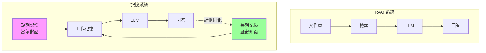
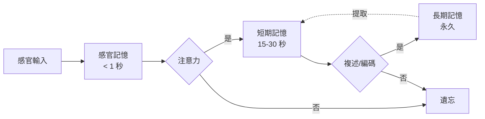
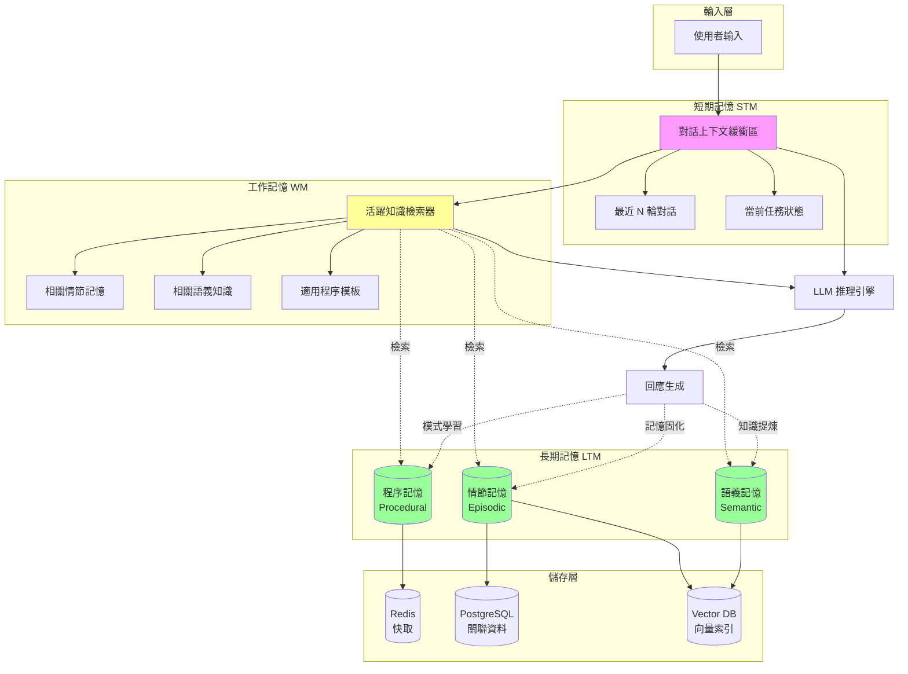

# 第 7 章：記憶系統的核心架構：從短期到長期記憶

> 本章學習目標：
> - 理解 RAG 與記憶的本質差異
> - 掌握認知科學中的記憶模型
> - 設計並實作 Agent 的三層記憶架構
> - 學會記憶的持久化、檢索與更新策略

---

## 7.1 為什麼 RAG 不等於記憶？

在前六章，我們建立了一個強大的 Agentic RAG 系統。但它有一個根本性的缺陷：**它沒有記憶**。

### 7.1.1 RAG 的本質是「查閱」而非「記得」

```
場景：使用者第一次對話
使用者：「我叫張三，在研發部門工作」
Agent：「你好張三！很高興認識你。」

場景：使用者第二天再次對話
使用者：「我昨天跟你說過我在哪個部門，記得嗎？」
Agent：「抱歉，我不記得我們之前的對話...」
```

RAG 只能查詢**預先索引的文件**，而無法記住**使用者告訴它的事情**。

### 7.1.2 RAG vs Memory 的根本差異

| 維度 | RAG | Memory |
|------|-----|--------|
| **資料來源** | 預先索引的文件 | 互動中產生的資訊 |
| **時效性** | 索引時的快照 | 持續更新 |
| **個人化** | 所有使用者相同 | 每個使用者獨立 |
| **關係理解** | 無 | 理解「我」、「你」、「我們的對話」 |
| **學習能力** | 無 | 可以從錯誤中學習 |

### 7.1.3 真正的記憶系統需要什麼？



---

## 7.2 認知科學中的記憶模型

要設計 Agent 的記憶系統，我們需要先理解人類記憶是如何運作的。

### 7.2.1 Atkinson-Shiffrin 記憶模型



### 7.2.2 記憶類型對應 Agent 設計

| 人類記憶 | Agent 對應 | 實現方式 |
|----------|------------|----------|
| **感官記憶** | 原始輸入 | 使用者的原始訊息 |
| **短期記憶** | 對話上下文 | 當前會話的最近 N 輪 |
| **工作記憶** | 活躍記憶 | 從長期記憶檢索的相關內容 |
| **長期記憶** | 持久化知識 | 資料庫中的使用者資料 |

### 7.2.3 長期記憶的三種類型

1. **情節記憶（Episodic Memory）**
   - 特定事件的記憶
   - 「上週三，使用者詢問了專案進度」
   - 包含時間、地點、人物

2. **語義記憶（Semantic Memory）**
   - 提煉的事實和知識
   - 「使用者偏好簡潔的回答」
   - 「使用者是 Python 開發者」

3. **程序記憶（Procedural Memory）**
   - 學習的技能和模式
   - 「處理使用者問題時，先確認需求再提供解決方案」
   - 「這類錯誤通常用這種方式解決」

---

## 7.3 Agent Memory 的技術架構

### 7.3.1 三層記憶架構



### 7.3.2 資料模型設計

```python
# memory/models.py
"""
記憶系統資料模型
"""

from dataclasses import dataclass, field
from datetime import datetime
from typing import List, Dict, Any, Optional
from enum import Enum
import uuid


class MemoryType(str, Enum):
    """記憶類型"""
    EPISODIC = "episodic"    # 情節記憶
    SEMANTIC = "semantic"    # 語義記憶
    PROCEDURAL = "procedural"  # 程序記憶


@dataclass
class MemoryEntry:
    """
    記憶條目
    ‹1› 所有類型記憶的基礎結構
    """
    id: str = field(default_factory=lambda: str(uuid.uuid4()))
    user_id: str = ""
    memory_type: MemoryType = MemoryType.EPISODIC
    content: str = ""
    embedding: Optional[List[float]] = None

    # 時間資訊
    created_at: datetime = field(default_factory=datetime.now)
    last_accessed: Optional[datetime] = None
    access_count: int = 0

    # 重要性與衰減
    importance: float = 0.5  # ‹2› 0-1，影響檢索和遺忘
    decay_rate: float = 0.1  # ‹3› 記憶衰減速率

    # 元資料
    metadata: Dict[str, Any] = field(default_factory=dict)

    def calculate_current_strength(self) -> float:
        """
        計算當前記憶強度
        ‹4› 結合重要性、訪問次數、時間衰減
        """
        # 時間衰減因子
        if self.last_accessed:
            hours_since_access = (datetime.now() - self.last_accessed).total_seconds() / 3600
        else:
            hours_since_access = (datetime.now() - self.created_at).total_seconds() / 3600

        time_decay = pow(0.5, hours_since_access * self.decay_rate / 24)

        # 訪問頻率加成
        access_bonus = min(1.0, self.access_count * 0.1)

        # 綜合強度
        strength = self.importance * time_decay * (1 + access_bonus)
        return min(1.0, max(0.0, strength))


@dataclass
class EpisodicMemory(MemoryEntry):
    """
    情節記憶
    ‹5› 記錄特定事件
    """
    memory_type: MemoryType = MemoryType.EPISODIC

    # 事件詳情
    event_type: str = ""  # conversation, action, observation
    participants: List[str] = field(default_factory=list)
    location: Optional[str] = None

    # 上下文
    session_id: Optional[str] = None
    conversation_turn: Optional[int] = None

    # 情感標記
    sentiment: Optional[str] = None  # positive, negative, neutral


@dataclass
class SemanticMemory(MemoryEntry):
    """
    語義記憶
    ‹6› 提煉的事實和知識
    """
    memory_type: MemoryType = MemoryType.SEMANTIC

    # 知識分類
    category: str = ""  # user_preference, domain_knowledge, fact
    confidence: float = 0.5  # ‹7› 知識的確信度

    # 來源追溯
    source_episodic_ids: List[str] = field(default_factory=list)

    # 衝突管理
    supersedes: Optional[str] = None  # 如果這個知識覆蓋了舊知識


@dataclass
class ProceduralMemory(MemoryEntry):
    """
    程序記憶
    ‹8› 學習的技能和模式
    """
    memory_type: MemoryType = MemoryType.PROCEDURAL

    # 觸發條件
    trigger_pattern: str = ""  # 觸發這個程序的模式
    trigger_examples: List[str] = field(default_factory=list)

    # 執行步驟
    procedure_steps: List[str] = field(default_factory=list)

    # 效果統計
    success_count: int = 0
    failure_count: int = 0

    @property
    def success_rate(self) -> float:
        total = self.success_count + self.failure_count
        return self.success_count / total if total > 0 else 0.5
```

---

## 7.4 實作短期記憶：對話上下文管理

```python
# memory/short_term.py
"""
短期記憶（對話上下文）
"""

import redis
import json
from typing import List, Dict, Any
from datetime import datetime


class ShortTermMemory:
    """
    短期記憶管理器
    ‹1› 使用 Redis 管理對話上下文
    """

    def __init__(
        self,
        redis_client: redis.Redis,
        max_turns: int = 10,
        session_ttl: int = 3600  # 1 小時
    ):
        self.redis = redis_client
        self.max_turns = max_turns
        self.session_ttl = session_ttl

    def _session_key(self, session_id: str) -> str:
        """生成 Redis 鍵"""
        return f"stm:session:{session_id}"

    async def add_turn(
        self,
        session_id: str,
        role: str,
        content: str,
        metadata: Dict[str, Any] = None
    ):
        """
        添加對話輪次
        ‹2› 自動維護最大輪次限制
        """
        key = self._session_key(session_id)

        turn = {
            "role": role,  # user 或 assistant
            "content": content,
            "timestamp": datetime.now().isoformat(),
            "metadata": metadata or {}
        }

        # 使用 Redis List (LPUSH + LTRIM)
        self.redis.lpush(key, json.dumps(turn))
        self.redis.ltrim(key, 0, self.max_turns * 2 - 1)  # 每輪 2 條（user + assistant）
        self.redis.expire(key, self.session_ttl)

    async def get_context(
        self,
        session_id: str,
        max_turns: int = None
    ) -> List[Dict[str, Any]]:
        """
        獲取對話上下文
        ‹3› 返回按時間順序排列的對話
        """
        key = self._session_key(session_id)
        max_items = (max_turns or self.max_turns) * 2

        raw_turns = self.redis.lrange(key, 0, max_items - 1)

        turns = [json.loads(t) for t in raw_turns]
        # Redis List 是 LIFO，需要反轉
        turns.reverse()

        return turns

    async def get_formatted_context(
        self,
        session_id: str,
        max_turns: int = None
    ) -> str:
        """
        獲取格式化的對話上下文
        ‹4› 用於構建 LLM 提示
        """
        turns = await self.get_context(session_id, max_turns)

        formatted = []
        for turn in turns:
            role = "使用者" if turn["role"] == "user" else "助手"
            formatted.append(f"{role}: {turn['content']}")

        return "\n".join(formatted)

    async def get_last_user_message(self, session_id: str) -> Optional[str]:
        """獲取最後一條使用者訊息"""
        turns = await self.get_context(session_id, max_turns=3)

        for turn in reversed(turns):
            if turn["role"] == "user":
                return turn["content"]
        return None

    async def clear_session(self, session_id: str):
        """清除會話"""
        key = self._session_key(session_id)
        self.redis.delete(key)

    async def get_session_summary(self, session_id: str) -> Dict[str, Any]:
        """
        獲取會話摘要
        ‹5› 用於傳遞給長期記憶
        """
        turns = await self.get_context(session_id)

        if not turns:
            return {"turn_count": 0, "topics": [], "summary": ""}

        # 簡單的主題提取（實際應使用 LLM）
        all_content = " ".join([t["content"] for t in turns])
        words = all_content.split()[:100]  # 取前 100 個詞

        return {
            "turn_count": len(turns),
            "start_time": turns[0]["timestamp"] if turns else None,
            "end_time": turns[-1]["timestamp"] if turns else None,
            "content_preview": " ".join(words),
            "topics": []  # 實際應使用 NLP 提取
        }
```

---

## 7.5 實作長期記憶：持久化與檢索

```python
# memory/long_term.py
"""
長期記憶管理
"""

import asyncpg
from typing import List, Optional
from sentence_transformers import SentenceTransformer


class LongTermMemory:
    """
    長期記憶管理器
    ‹1› 整合 PostgreSQL 和向量資料庫
    """

    def __init__(
        self,
        postgres_pool: asyncpg.Pool,
        vector_store,
        embedder: SentenceTransformer = None
    ):
        self.pg = postgres_pool
        self.vdb = vector_store
        self.embedder = embedder or SentenceTransformer("all-MiniLM-L6-v2")

    # ========== 情節記憶 ==========

    async def store_episodic(
        self,
        memory: EpisodicMemory
    ) -> str:
        """
        儲存情節記憶
        ‹2› 雙寫到 PostgreSQL 和向量資料庫
        """
        # 向量化
        memory.embedding = self.embedder.encode(memory.content).tolist()

        # 寫入 PostgreSQL
        async with self.pg.acquire() as conn:
            await conn.execute("""
                INSERT INTO episodic_memories
                (id, user_id, content, event_type, session_id,
                 importance, created_at, metadata)
                VALUES ($1, $2, $3, $4, $5, $6, $7, $8)
            """,
                memory.id,
                memory.user_id,
                memory.content,
                memory.event_type,
                memory.session_id,
                memory.importance,
                memory.created_at,
                json.dumps(memory.metadata)
            )

        # 寫入向量資料庫
        await self.vdb.upsert(
            collection="episodic_memories",
            id=memory.id,
            vector=memory.embedding,
            metadata={
                "user_id": memory.user_id,
                "event_type": memory.event_type,
                "importance": memory.importance,
                "timestamp": memory.created_at.isoformat()
            }
        )

        return memory.id

    async def retrieve_episodic(
        self,
        user_id: str,
        query: str,
        top_k: int = 5,
        min_importance: float = 0.0
    ) -> List[EpisodicMemory]:
        """
        檢索相關的情節記憶
        ‹3› 結合向量搜尋和重要性過濾
        """
        # 向量化查詢
        query_embedding = self.embedder.encode(query).tolist()

        # 向量搜尋
        results = await self.vdb.search(
            collection="episodic_memories",
            query_vector=query_embedding,
            top_k=top_k * 2,  # 多取一些用於過濾
            filter={"user_id": user_id}
        )

        # 從 PostgreSQL 獲取完整資料
        memory_ids = [r["id"] for r in results]
        async with self.pg.acquire() as conn:
            rows = await conn.fetch("""
                SELECT * FROM episodic_memories
                WHERE id = ANY($1) AND importance >= $2
                ORDER BY importance DESC, created_at DESC
                LIMIT $3
            """, memory_ids, min_importance, top_k)

        # 更新訪問統計
        await self._update_access_stats(memory_ids)

        return [self._row_to_episodic(r) for r in rows]

    # ========== 語義記憶 ==========

    async def store_semantic(
        self,
        memory: SemanticMemory
    ) -> str:
        """
        儲存語義記憶
        ‹4› 處理知識更新和衝突
        """
        # 檢查是否存在相似的知識
        existing = await self._find_similar_semantic(
            memory.user_id,
            memory.content
        )

        if existing:
            # 更新現有知識的信心度
            await self._update_semantic_confidence(
                existing.id,
                memory.confidence
            )
            return existing.id

        # 向量化
        memory.embedding = self.embedder.encode(memory.content).tolist()

        # 儲存新知識
        async with self.pg.acquire() as conn:
            await conn.execute("""
                INSERT INTO semantic_memories
                (id, user_id, content, category, confidence,
                 source_episodic_ids, created_at)
                VALUES ($1, $2, $3, $4, $5, $6, $7)
            """,
                memory.id,
                memory.user_id,
                memory.content,
                memory.category,
                memory.confidence,
                memory.source_episodic_ids,
                memory.created_at
            )

        # 寫入向量資料庫
        await self.vdb.upsert(
            collection="semantic_memories",
            id=memory.id,
            vector=memory.embedding,
            metadata={
                "user_id": memory.user_id,
                "category": memory.category,
                "confidence": memory.confidence
            }
        )

        return memory.id

    async def retrieve_semantic(
        self,
        user_id: str,
        query: str,
        category: str = None,
        top_k: int = 5
    ) -> List[SemanticMemory]:
        """
        檢索語義記憶
        ‹5› 可按類別過濾
        """
        query_embedding = self.embedder.encode(query).tolist()

        filter_conditions = {"user_id": user_id}
        if category:
            filter_conditions["category"] = category

        results = await self.vdb.search(
            collection="semantic_memories",
            query_vector=query_embedding,
            top_k=top_k,
            filter=filter_conditions
        )

        memory_ids = [r["id"] for r in results]
        async with self.pg.acquire() as conn:
            rows = await conn.fetch("""
                SELECT * FROM semantic_memories
                WHERE id = ANY($1)
                ORDER BY confidence DESC
            """, memory_ids)

        return [self._row_to_semantic(r) for r in rows]

    # ========== 程序記憶 ==========

    async def store_procedural(
        self,
        memory: ProceduralMemory
    ) -> str:
        """
        儲存程序記憶
        ‹6› 學習的技能和模式
        """
        memory.embedding = self.embedder.encode(
            memory.trigger_pattern + " " + memory.content
        ).tolist()

        async with self.pg.acquire() as conn:
            await conn.execute("""
                INSERT INTO procedural_memories
                (id, user_id, content, trigger_pattern, procedure_steps,
                 success_count, failure_count, created_at)
                VALUES ($1, $2, $3, $4, $5, $6, $7, $8)
            """,
                memory.id,
                memory.user_id,
                memory.content,
                memory.trigger_pattern,
                memory.procedure_steps,
                memory.success_count,
                memory.failure_count,
                memory.created_at
            )

        await self.vdb.upsert(
            collection="procedural_memories",
            id=memory.id,
            vector=memory.embedding,
            metadata={
                "user_id": memory.user_id,
                "success_rate": memory.success_rate
            }
        )

        return memory.id

    async def retrieve_procedural(
        self,
        user_id: str,
        trigger: str,
        top_k: int = 3
    ) -> List[ProceduralMemory]:
        """
        檢索程序記憶
        ‹7› 根據觸發模式匹配
        """
        query_embedding = self.embedder.encode(trigger).tolist()

        results = await self.vdb.search(
            collection="procedural_memories",
            query_vector=query_embedding,
            top_k=top_k,
            filter={"user_id": user_id}
        )

        memory_ids = [r["id"] for r in results]
        async with self.pg.acquire() as conn:
            rows = await conn.fetch("""
                SELECT * FROM procedural_memories
                WHERE id = ANY($1)
                ORDER BY (success_count::float / NULLIF(success_count + failure_count, 0)) DESC
            """, memory_ids)

        return [self._row_to_procedural(r) for r in rows]

    # ========== 輔助方法 ==========

    async def _update_access_stats(self, memory_ids: List[str]):
        """更新訪問統計"""
        async with self.pg.acquire() as conn:
            await conn.execute("""
                UPDATE episodic_memories
                SET access_count = access_count + 1,
                    last_accessed = NOW()
                WHERE id = ANY($1)
            """, memory_ids)

    async def _find_similar_semantic(
        self,
        user_id: str,
        content: str,
        threshold: float = 0.9
    ) -> Optional[SemanticMemory]:
        """查找相似的語義記憶"""
        query_embedding = self.embedder.encode(content).tolist()

        results = await self.vdb.search(
            collection="semantic_memories",
            query_vector=query_embedding,
            top_k=1,
            filter={"user_id": user_id}
        )

        if results and results[0].get("score", 0) >= threshold:
            async with self.pg.acquire() as conn:
                row = await conn.fetchrow("""
                    SELECT * FROM semantic_memories WHERE id = $1
                """, results[0]["id"])
            return self._row_to_semantic(row) if row else None

        return None
```

---

## 7.6 記憶的更新與遺忘機制

### 7.6.1 記憶固化：從短期到長期

```python
# memory/consolidation.py
"""
記憶固化模組
‹1› 將對話轉化為長期記憶
"""

from langchain_openai import ChatOpenAI


class MemoryConsolidator:
    """
    記憶固化器
    ‹2› 使用 LLM 從對話中提煉記憶
    """

    def __init__(
        self,
        llm: ChatOpenAI = None,
        long_term_memory: LongTermMemory = None
    ):
        self.llm = llm or ChatOpenAI(model="gpt-4o-mini", temperature=0)
        self.ltm = long_term_memory

    async def consolidate_session(
        self,
        user_id: str,
        session_id: str,
        conversation: List[Dict[str, str]]
    ):
        """
        固化一個會話的記憶
        ‹3› 提煉情節和語義記憶
        """
        # 步驟 1: 提取情節記憶
        episodes = await self._extract_episodes(conversation)
        for episode in episodes:
            memory = EpisodicMemory(
                user_id=user_id,
                session_id=session_id,
                content=episode["content"],
                event_type=episode["type"],
                importance=episode.get("importance", 0.5),
                metadata={"raw_turn": episode.get("turn_index")}
            )
            await self.ltm.store_episodic(memory)

        # 步驟 2: 提取語義記憶
        facts = await self._extract_semantic_facts(user_id, conversation)
        for fact in facts:
            memory = SemanticMemory(
                user_id=user_id,
                content=fact["fact"],
                category=fact["category"],
                confidence=fact.get("confidence", 0.7)
            )
            await self.ltm.store_semantic(memory)

    async def _extract_episodes(
        self,
        conversation: List[Dict[str, str]]
    ) -> List[Dict[str, Any]]:
        """
        提取重要事件
        ‹4› 使用 LLM 識別值得記住的事件
        """
        conversation_text = "\n".join([
            f"{turn['role']}: {turn['content']}"
            for turn in conversation
        ])

        prompt = f"""
分析以下對話，提取值得記住的重要事件或時刻。

對話內容:
{conversation_text}

請以 JSON 格式輸出重要事件:
[
    {{
        "content": "事件描述",
        "type": "conversation|decision|request|feedback",
        "importance": 0.1-1.0,
        "turn_index": 對應的對話輪次索引
    }}
]

只提取真正重要的事件（如決策、請求、明確的偏好表達等），
不要提取日常寒暄或無意義的交流。
"""

        response = await self.llm.ainvoke(prompt)

        import json
        try:
            return json.loads(response.content)
        except json.JSONDecodeError:
            return []

    async def _extract_semantic_facts(
        self,
        user_id: str,
        conversation: List[Dict[str, str]]
    ) -> List[Dict[str, Any]]:
        """
        提取語義知識
        ‹5› 從對話中提煉可複用的事實
        """
        conversation_text = "\n".join([
            f"{turn['role']}: {turn['content']}"
            for turn in conversation
        ])

        prompt = f"""
從以下對話中提取關於使用者的事實和知識。

對話內容:
{conversation_text}

請以 JSON 格式輸出:
[
    {{
        "fact": "提煉的事實（如：使用者偏好簡潔的回答）",
        "category": "user_preference|personal_info|domain_knowledge|work_context",
        "confidence": 0.5-1.0
    }}
]

注意:
- 只提取明確的事實，不要推測
- 用第三人稱描述（「使用者」而非「我」）
- 每個事實應該獨立且可複用
"""

        response = await self.llm.ainvoke(prompt)

        import json
        try:
            return json.loads(response.content)
        except json.JSONDecodeError:
            return []
```

### 7.6.2 記憶遺忘機制

```python
# memory/forgetting.py
"""
記憶遺忘機制
‹1› 模擬人類的遺忘曲線
"""

from datetime import datetime, timedelta


class MemoryForgetting:
    """
    記憶遺忘管理器
    ‹2› 定期清理低重要性、長時間未訪問的記憶
    """

    def __init__(
        self,
        postgres_pool: asyncpg.Pool,
        vector_store
    ):
        self.pg = postgres_pool
        self.vdb = vector_store

    async def cleanup_old_memories(
        self,
        user_id: str = None,
        importance_threshold: float = 0.3,
        days_threshold: int = 90
    ):
        """
        清理過時記憶
        ‹3› 基於重要性和時間的清理策略
        """
        cutoff_date = datetime.now() - timedelta(days=days_threshold)

        async with self.pg.acquire() as conn:
            # 查找要刪除的記憶
            query = """
                SELECT id, user_id FROM episodic_memories
                WHERE importance < $1
                  AND (last_accessed IS NULL OR last_accessed < $2)
            """
            params = [importance_threshold, cutoff_date]

            if user_id:
                query += " AND user_id = $3"
                params.append(user_id)

            to_delete = await conn.fetch(query, *params)
            deleted_ids = [r["id"] for r in to_delete]

            if deleted_ids:
                # 刪除 PostgreSQL 記錄
                await conn.execute("""
                    DELETE FROM episodic_memories
                    WHERE id = ANY($1)
                """, deleted_ids)

                # 刪除向量索引
                await self.vdb.delete(
                    collection="episodic_memories",
                    ids=deleted_ids
                )

        return len(deleted_ids)

    async def decay_memories(self, user_id: str):
        """
        衰減記憶重要性
        ‹4› 模擬遺忘曲線
        """
        async with self.pg.acquire() as conn:
            # 對長時間未訪問的記憶降低重要性
            await conn.execute("""
                UPDATE episodic_memories
                SET importance = importance * 0.95
                WHERE user_id = $1
                  AND last_accessed < NOW() - INTERVAL '7 days'
                  AND importance > 0.1
            """, user_id)

    async def strengthen_memory(
        self,
        memory_id: str,
        boost: float = 0.1
    ):
        """
        強化記憶
        ‹5› 當記憶被成功使用時調用
        """
        async with self.pg.acquire() as conn:
            await conn.execute("""
                UPDATE episodic_memories
                SET importance = LEAST(1.0, importance + $1),
                    access_count = access_count + 1,
                    last_accessed = NOW()
                WHERE id = $2
            """, boost, memory_id)
```

---

## 7.7 記憶的隱私與安全

```python
# memory/privacy.py
"""
記憶隱私保護
"""


class MemoryPrivacy:
    """
    記憶隱私管理器
    ‹1› 確保使用者資料安全
    """

    def __init__(self, encryption_service, postgres_pool):
        self.encryption = encryption_service
        self.pg = postgres_pool

    async def export_user_memories(self, user_id: str) -> Dict[str, Any]:
        """
        匯出使用者記憶
        ‹2› GDPR 資料可攜權
        """
        async with self.pg.acquire() as conn:
            episodic = await conn.fetch("""
                SELECT * FROM episodic_memories WHERE user_id = $1
            """, user_id)

            semantic = await conn.fetch("""
                SELECT * FROM semantic_memories WHERE user_id = $1
            """, user_id)

            procedural = await conn.fetch("""
                SELECT * FROM procedural_memories WHERE user_id = $1
            """, user_id)

        return {
            "user_id": user_id,
            "export_time": datetime.now().isoformat(),
            "episodic_memories": [dict(r) for r in episodic],
            "semantic_memories": [dict(r) for r in semantic],
            "procedural_memories": [dict(r) for r in procedural]
        }

    async def delete_user_memories(self, user_id: str) -> Dict[str, int]:
        """
        刪除使用者記憶
        ‹3› GDPR 被遺忘權
        """
        deleted_counts = {}

        async with self.pg.acquire() as conn:
            # 刪除各類記憶
            for table in ["episodic_memories", "semantic_memories", "procedural_memories"]:
                result = await conn.execute(f"""
                    DELETE FROM {table} WHERE user_id = $1
                """, user_id)
                deleted_counts[table] = int(result.split()[-1])

        # 同步刪除向量索引
        for collection in ["episodic_memories", "semantic_memories", "procedural_memories"]:
            # 需要先查詢再刪除
            pass

        return deleted_counts

    async def anonymize_memories(
        self,
        user_id: str,
        retain_patterns: bool = True
    ):
        """
        匿名化記憶
        ‹4› 保留統計價值但移除個人資訊
        """
        # 實作細節取決於業務需求
        pass
```

---

## 7.8 總結與下一步

### 本章回顧

在本章中，我們：

1. **理解了 RAG 與記憶的本質差異**
2. **學習了認知科學的記憶模型**：感官、短期、工作、長期記憶
3. **設計了三層記憶架構**：情節、語義、程序記憶
4. **實作了短期記憶**：使用 Redis 管理對話上下文
5. **實作了長期記憶**：使用 PostgreSQL + 向量資料庫
6. **實作了記憶固化與遺忘機制**

### 關鍵決策說明

| 決策點 | 選擇 | 原因 |
|--------|------|------|
| 短期記憶儲存 | Redis | 快速、自動過期 |
| 長期記憶儲存 | PostgreSQL + Vector DB | 結構化 + 語義檢索 |
| 記憶衰減模型 | 指數衰減 | 符合遺忘曲線 |

### 下一章預告

在第 8 章「個人化與適應性學習」中，我們將：

- 設計使用者偏好建模系統
- 實作隱式反饋收集器
- 建立 A/B 測試框架
- 量化個人化效果

---

## 本章程式碼清單

| 檔案 | 說明 |
|------|------|
| `memory/models.py` | 記憶資料模型 |
| `memory/short_term.py` | 短期記憶管理 |
| `memory/long_term.py` | 長期記憶管理 |
| `memory/consolidation.py` | 記憶固化 |
| `memory/forgetting.py` | 遺忘機制 |
| `memory/privacy.py` | 隱私保護 |

完整程式碼請參見 `code-examples/chapter-07/` 目錄。
