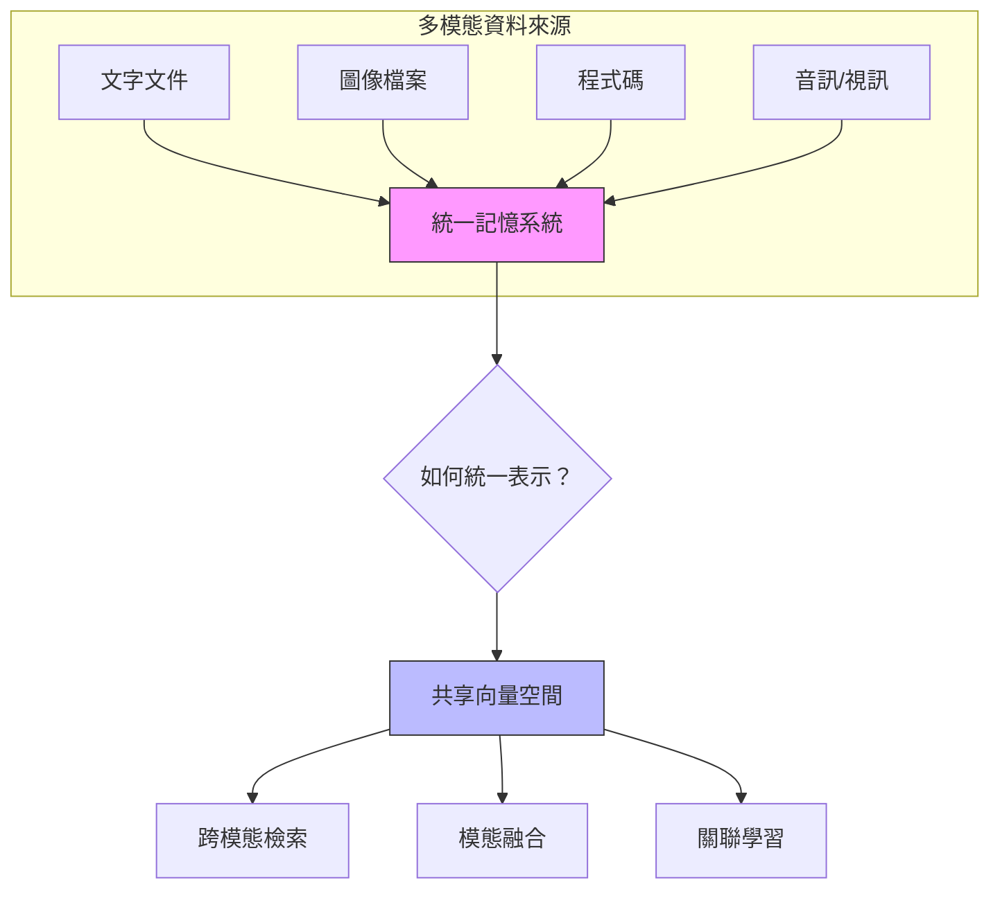
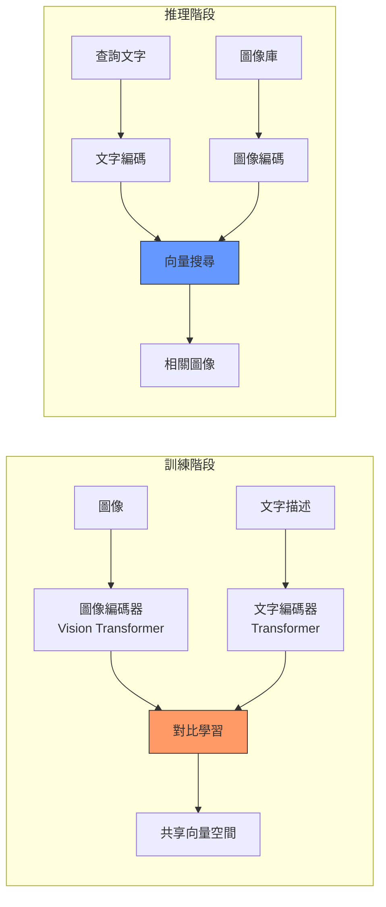

# 第 9 章：多模態記憶：讓 Agent 理解文字、圖像與程式碼

> 本章學習目標：
> - 理解多模態記憶系統的架構設計原理
> - 掌握 CLIP 模型實現圖文跨模態檢索
> - 使用 CodeBERT 建立程式碼語義檢索系統
> - 實作統一的多模態記憶管理框架
> - 設計跨模態關聯與融合策略

---

## 9.1 為什麼需要多模態記憶？

在前面的章節中，我們建立的記憶系統主要處理文本資料。但在真實的企業環境中，知識不僅僅以文字形式存在：

- **設計團隊**：使用 Figma 設計稿、流程圖、線框圖
- **工程團隊**：程式碼、架構圖、API 文件
- **產品團隊**：產品截圖、使用者流程圖、數據圖表
- **營運團隊**：報表截圖、儀表板、數據視覺化

### 9.1.1 多模態記憶的價值

```
傳統文字記憶:
使用者：「上次的登入頁面設計是什麼樣的？」
Agent：「抱歉，我只有文字記錄，沒有設計圖。」

多模態記憶:
使用者：「上次的登入頁面設計是什麼樣的？」
Agent：「根據記憶，上次的登入頁面設計如下...」
       [展示設計圖]
       「主要特點：藍色主題、社交登入按鈕、簡潔表單」
```

### 9.1.2 多模態記憶的挑戰



核心挑戰：
1. **表示統一**：不同模態的資料如何映射到同一向量空間？
2. **語義對齊**：「登入按鈕」的文字描述如何與實際按鈕圖像關聯？
3. **檢索效率**：跨模態檢索如何保持高效能？

---

## 9.2 多模態記憶系統架構

### 9.2.1 整體架構設計

```python
# multimodal/architecture.py
"""
多模態記憶系統架構
"""

from abc import ABC, abstractmethod
from dataclasses import dataclass, field
from typing import List, Dict, Any, Optional, Union
from enum import Enum
from datetime import datetime
import numpy as np


class ModalityType(Enum):
    """
    模態類型枚舉
    ‹1› 定義系統支援的所有模態類型
    """
    TEXT = "text"
    IMAGE = "image"
    CODE = "code"
    AUDIO = "audio"
    VIDEO = "video"
    STRUCTURED = "structured"  # 表格、JSON 等


@dataclass
class MultimodalMemory:
    """
    多模態記憶項目
    ‹2› 統一的記憶資料結構
    """
    memory_id: str
    modality: ModalityType
    content: Any  # 原始內容（文字、圖像路徑、程式碼等）
    embedding: np.ndarray  # ‹3› 統一向量表示
    metadata: Dict[str, Any] = field(default_factory=dict)

    # 跨模態關聯
    related_memories: List[str] = field(default_factory=list)  # ‹4› 關聯的記憶 ID

    # 時間戳記
    created_at: datetime = field(default_factory=datetime.now)
    accessed_at: datetime = field(default_factory=datetime.now)

    # 來源追蹤
    source: str = ""
    source_type: str = ""  # file, url, api, user_input


class ModalityEncoder(ABC):
    """
    模態編碼器抽象基類
    ‹5› 所有模態編碼器都需要實作這個介面
    """

    @abstractmethod
    def encode(self, content: Any) -> np.ndarray:
        """將內容編碼為向量"""
        pass

    @abstractmethod
    def get_dimension(self) -> int:
        """返回向量維度"""
        pass

    @property
    @abstractmethod
    def modality_type(self) -> ModalityType:
        """返回支援的模態類型"""
        pass


class MultimodalMemorySystem:
    """
    多模態記憶系統
    ‹6› 統一管理所有模態的記憶
    """

    def __init__(
        self,
        vector_store,
        encoders: Dict[ModalityType, ModalityEncoder]
    ):
        self.vector_store = vector_store
        self.encoders = encoders

        # ‹7› 驗證所有編碼器輸出維度一致
        dimensions = [enc.get_dimension() for enc in encoders.values()]
        if len(set(dimensions)) > 1:
            raise ValueError(
                f"編碼器維度不一致: {dimensions}。"
                "所有編碼器必須輸出相同維度的向量。"
            )
        self.embedding_dim = dimensions[0]

    async def store(
        self,
        content: Any,
        modality: ModalityType,
        metadata: Dict[str, Any] = None
    ) -> str:
        """
        儲存多模態記憶
        ‹8› 自動選擇對應的編碼器
        """
        if modality not in self.encoders:
            raise ValueError(f"不支援的模態類型: {modality}")

        encoder = self.encoders[modality]
        embedding = encoder.encode(content)

        memory = MultimodalMemory(
            memory_id=self._generate_id(),
            modality=modality,
            content=content,
            embedding=embedding,
            metadata=metadata or {}
        )

        await self.vector_store.upsert(
            id=memory.memory_id,
            vector=embedding.tolist(),
            metadata={
                "modality": modality.value,
                "content_preview": self._get_preview(content, modality),
                **(metadata or {})
            }
        )

        return memory.memory_id

    async def search(
        self,
        query: Any,
        query_modality: ModalityType,
        target_modalities: List[ModalityType] = None,
        k: int = 10
    ) -> List[MultimodalMemory]:
        """
        跨模態檢索
        ‹9› 用一種模態的查詢檢索其他模態的記憶
        """
        encoder = self.encoders[query_modality]
        query_embedding = encoder.encode(query)

        # 建立模態過濾器
        filters = {}
        if target_modalities:
            filters["modality"] = {
                "$in": [m.value for m in target_modalities]
            }

        results = await self.vector_store.search(
            vector=query_embedding.tolist(),
            k=k,
            filters=filters
        )

        return self._results_to_memories(results)
```

---

## 9.3 圖文跨模態檢索：CLIP 實戰

CLIP（Contrastive Language-Image Pre-training）是 OpenAI 開發的多模態模型，能夠將文字和圖像映射到同一個向量空間。

### 9.3.1 CLIP 的核心原理



### 9.3.2 CLIP 編碼器實作

```python
# multimodal/clip_encoder.py
"""
CLIP 圖文編碼器
"""

import torch
from PIL import Image
from transformers import CLIPProcessor, CLIPModel
import numpy as np
from typing import Union
import requests
from io import BytesIO


class CLIPEncoder:
    """
    CLIP 編碼器
    ‹1› 支援文字和圖像的統一編碼
    """

    def __init__(
        self,
        model_name: str = "openai/clip-vit-base-patch32",
        device: str = None
    ):
        # ‹2› 自動選擇運算裝置
        if device is None:
            self.device = "cuda" if torch.cuda.is_available() else "cpu"
        else:
            self.device = device

        # ‹3› 載入預訓練的 CLIP 模型
        self.model = CLIPModel.from_pretrained(model_name).to(self.device)
        self.processor = CLIPProcessor.from_pretrained(model_name)

        # 設為評估模式
        self.model.eval()

        print(f"CLIP 模型已載入，使用裝置: {self.device}")

    def encode_text(self, text: Union[str, List[str]]) -> np.ndarray:
        """
        編碼文字
        ‹4› 將文字轉換為 512 維向量
        """
        if isinstance(text, str):
            text = [text]

        with torch.no_grad():
            inputs = self.processor(
                text=text,
                return_tensors="pt",
                padding=True,
                truncation=True,
                max_length=77  # CLIP 的最大文字長度
            ).to(self.device)

            # ‹5› 獲取文字特徵向量
            text_features = self.model.get_text_features(**inputs)

            # L2 正規化
            text_features = text_features / text_features.norm(
                dim=-1, keepdim=True
            )

        return text_features.cpu().numpy()

    def encode_image(
        self,
        image: Union[str, Image.Image, List]
    ) -> np.ndarray:
        """
        編碼圖像
        ‹6› 支援多種輸入格式
        """
        # 處理輸入
        if isinstance(image, str):
            if image.startswith("http"):
                # URL
                response = requests.get(image)
                image = Image.open(BytesIO(response.content))
            else:
                # 檔案路徑
                image = Image.open(image)

        if not isinstance(image, list):
            image = [image]

        with torch.no_grad():
            inputs = self.processor(
                images=image,
                return_tensors="pt"
            ).to(self.device)

            # ‹7› 獲取圖像特徵向量
            image_features = self.model.get_image_features(**inputs)

            # L2 正規化
            image_features = image_features / image_features.norm(
                dim=-1, keepdim=True
            )

        return image_features.cpu().numpy()

    def compute_similarity(
        self,
        text: Union[str, List[str]],
        images: List[Union[str, Image.Image]]
    ) -> np.ndarray:
        """
        計算文字與圖像的相似度
        ‹8› 返回相似度矩陣
        """
        text_features = self.encode_text(text)
        image_features = self.encode_image(images)

        # ‹9› 計算餘弦相似度（因為已經 L2 正規化，點積即為餘弦相似度）
        similarity = text_features @ image_features.T

        return similarity

    def get_dimension(self) -> int:
        """返回向量維度"""
        return 512  # CLIP base 模型的維度


class CLIPTextEncoder(ModalityEncoder):
    """
    CLIP 文字編碼器（符合 ModalityEncoder 介面）
    """

    def __init__(self, clip_encoder: CLIPEncoder):
        self.clip = clip_encoder

    def encode(self, content: str) -> np.ndarray:
        return self.clip.encode_text(content)[0]

    def get_dimension(self) -> int:
        return self.clip.get_dimension()

    @property
    def modality_type(self) -> ModalityType:
        return ModalityType.TEXT


class CLIPImageEncoder(ModalityEncoder):
    """
    CLIP 圖像編碼器（符合 ModalityEncoder 介面）
    """

    def __init__(self, clip_encoder: CLIPEncoder):
        self.clip = clip_encoder

    def encode(self, content: Union[str, Image.Image]) -> np.ndarray:
        return self.clip.encode_image(content)[0]

    def get_dimension(self) -> int:
        return self.clip.get_dimension()

    @property
    def modality_type(self) -> ModalityType:
        return ModalityType.IMAGE
```

### 9.3.3 圖文檢索系統實作

```python
# multimodal/image_text_retrieval.py
"""
圖文跨模態檢索系統
"""

from dataclasses import dataclass
from typing import List, Dict, Any, Optional
from pathlib import Path
import hashlib


@dataclass
class ImageMemory:
    """圖像記憶"""
    image_id: str
    file_path: str
    embedding: np.ndarray
    description: str = ""  # 可選的文字描述
    tags: List[str] = field(default_factory=list)
    metadata: Dict[str, Any] = field(default_factory=dict)


class ImageTextRetrievalSystem:
    """
    圖文檢索系統
    ‹1› 支援文字搜圖和以圖搜圖
    """

    def __init__(
        self,
        clip_encoder: CLIPEncoder,
        vector_store,
        image_storage_path: str = "./image_store"
    ):
        self.clip = clip_encoder
        self.vector_store = vector_store
        self.storage_path = Path(image_storage_path)
        self.storage_path.mkdir(parents=True, exist_ok=True)

    async def index_image(
        self,
        image_path: str,
        description: str = "",
        tags: List[str] = None,
        metadata: Dict[str, Any] = None
    ) -> str:
        """
        索引單張圖像
        ‹2› 同時儲存圖像向量和元資料
        """
        # 生成唯一 ID
        with open(image_path, "rb") as f:
            image_hash = hashlib.md5(f.read()).hexdigest()[:12]
        image_id = f"img_{image_hash}"

        # 編碼圖像
        image_embedding = self.clip.encode_image(image_path)[0]

        # 如果有描述，也編碼描述並取平均（可選的融合策略）
        if description:
            text_embedding = self.clip.encode_text(description)[0]
            # ‹3› 加權融合：圖像特徵為主，文字為輔
            combined_embedding = 0.7 * image_embedding + 0.3 * text_embedding
            combined_embedding = combined_embedding / np.linalg.norm(combined_embedding)
        else:
            combined_embedding = image_embedding

        # 儲存到向量資料庫
        await self.vector_store.upsert(
            id=image_id,
            vector=combined_embedding.tolist(),
            metadata={
                "type": "image",
                "file_path": image_path,
                "description": description,
                "tags": tags or [],
                **(metadata or {})
            }
        )

        return image_id

    async def index_directory(
        self,
        directory: str,
        extensions: List[str] = None
    ) -> int:
        """
        批次索引目錄中的所有圖像
        ‹4› 支援 jpg、png、webp 等格式
        """
        if extensions is None:
            extensions = [".jpg", ".jpeg", ".png", ".webp", ".gif"]

        dir_path = Path(directory)
        indexed_count = 0

        for ext in extensions:
            for image_path in dir_path.glob(f"**/*{ext}"):
                try:
                    await self.index_image(str(image_path))
                    indexed_count += 1
                    print(f"已索引: {image_path.name}")
                except Exception as e:
                    print(f"索引失敗 {image_path.name}: {e}")

        print(f"共索引 {indexed_count} 張圖像")
        return indexed_count

    async def search_by_text(
        self,
        query: str,
        k: int = 10
    ) -> List[Dict[str, Any]]:
        """
        以文字搜尋圖像
        ‹5› 這是 CLIP 最強大的功能
        """
        query_embedding = self.clip.encode_text(query)[0]

        results = await self.vector_store.search(
            vector=query_embedding.tolist(),
            k=k,
            filters={"type": "image"}
        )

        return [
            {
                "image_id": r["id"],
                "file_path": r["metadata"]["file_path"],
                "description": r["metadata"].get("description", ""),
                "score": r["score"],
                "tags": r["metadata"].get("tags", [])
            }
            for r in results
        ]

    async def search_by_image(
        self,
        image_path: str,
        k: int = 10,
        exclude_self: bool = True
    ) -> List[Dict[str, Any]]:
        """
        以圖搜圖
        ‹6› 找到視覺上相似的圖像
        """
        query_embedding = self.clip.encode_image(image_path)[0]

        results = await self.vector_store.search(
            vector=query_embedding.tolist(),
            k=k + (1 if exclude_self else 0),  # 多取一個以便排除自己
            filters={"type": "image"}
        )

        # 排除自己（如果需要）
        if exclude_self:
            results = [
                r for r in results
                if r["metadata"]["file_path"] != image_path
            ][:k]

        return [
            {
                "image_id": r["id"],
                "file_path": r["metadata"]["file_path"],
                "score": r["score"]
            }
            for r in results
        ]

    async def find_images_by_tags(
        self,
        tags: List[str],
        k: int = 10
    ) -> List[Dict[str, Any]]:
        """
        組合查詢：文字 + 標籤
        ‹7› 先用標籤過濾，再用文字排序
        """
        # 將標籤組合成查詢文字
        query = " ".join(tags)
        query_embedding = self.clip.encode_text(query)[0]

        # 建立標籤過濾器
        tag_filter = {
            "tags": {"$contains_any": tags}
        }

        results = await self.vector_store.search(
            vector=query_embedding.tolist(),
            k=k,
            filters={"type": "image", **tag_filter}
        )

        return results
```

### 9.3.4 使用範例

```python
# examples/image_search_demo.py
"""
圖文檢索使用範例
"""

import asyncio


async def main():
    # 初始化
    clip = CLIPEncoder()
    vector_store = QdrantVectorStore(collection_name="multimodal_memories")

    retrieval_system = ImageTextRetrievalSystem(
        clip_encoder=clip,
        vector_store=vector_store
    )

    # 索引圖像目錄
    await retrieval_system.index_directory("./product_images")

    # 文字搜圖
    results = await retrieval_system.search_by_text(
        query="藍色的運動鞋",
        k=5
    )

    print("搜尋結果：")
    for r in results:
        print(f"  - {r['file_path']} (分數: {r['score']:.3f})")

    # 以圖搜圖
    similar_images = await retrieval_system.search_by_image(
        image_path="./query_image.jpg",
        k=5
    )

    print("\n相似圖像：")
    for r in similar_images:
        print(f"  - {r['file_path']} (分數: {r['score']:.3f})")


if __name__ == "__main__":
    asyncio.run(main())
```

---

## 9.4 程式碼語義檢索：CodeBERT 實戰

程式碼是一種特殊的「語言」，需要專門的模型來理解其語義。CodeBERT 是微軟開發的預訓練模型，專門用於程式碼理解任務。

### 9.4.1 為什麼需要專門的程式碼編碼器？

```
一般文字編碼器:
query: "排序演算法"
code:  "def quicksort(arr): ..."
結果: 相似度低（因為沒有「排序」這個詞）

程式碼專用編碼器:
query: "排序演算法"
code:  "def quicksort(arr): ..."
結果: 相似度高（理解 quicksort 是排序演算法）
```

### 9.4.2 CodeBERT 編碼器實作

```python
# multimodal/code_encoder.py
"""
程式碼語義編碼器
"""

from transformers import AutoTokenizer, AutoModel
import torch
import numpy as np
from typing import List, Union, Optional


class CodeBERTEncoder:
    """
    CodeBERT 編碼器
    ‹1› 專門用於程式碼語義理解
    """

    def __init__(
        self,
        model_name: str = "microsoft/codebert-base",
        device: str = None
    ):
        if device is None:
            self.device = "cuda" if torch.cuda.is_available() else "cpu"
        else:
            self.device = device

        # ‹2› 載入 CodeBERT 模型和 tokenizer
        self.tokenizer = AutoTokenizer.from_pretrained(model_name)
        self.model = AutoModel.from_pretrained(model_name).to(self.device)
        self.model.eval()

        print(f"CodeBERT 已載入，使用裝置: {self.device}")

    def encode(
        self,
        code_or_query: Union[str, List[str]],
        is_code: bool = True,
        max_length: int = 512
    ) -> np.ndarray:
        """
        編碼程式碼或自然語言查詢
        ‹3› 兩者使用相同的編碼方式
        """
        if isinstance(code_or_query, str):
            code_or_query = [code_or_query]

        with torch.no_grad():
            # ‹4› Tokenize 輸入
            inputs = self.tokenizer(
                code_or_query,
                return_tensors="pt",
                padding=True,
                truncation=True,
                max_length=max_length
            ).to(self.device)

            # ‹5› 獲取模型輸出
            outputs = self.model(**inputs)

            # ‹6› 使用 [CLS] token 的輸出作為整體表示
            embeddings = outputs.last_hidden_state[:, 0, :]

            # L2 正規化
            embeddings = embeddings / embeddings.norm(dim=-1, keepdim=True)

        return embeddings.cpu().numpy()

    def encode_code(self, code: Union[str, List[str]]) -> np.ndarray:
        """編碼程式碼"""
        return self.encode(code, is_code=True)

    def encode_query(self, query: Union[str, List[str]]) -> np.ndarray:
        """編碼自然語言查詢"""
        return self.encode(query, is_code=False)

    def get_dimension(self) -> int:
        """返回向量維度"""
        return 768  # CodeBERT base 的維度


class UnifiedCodeEncoder(ModalityEncoder):
    """
    統一程式碼編碼器（符合 ModalityEncoder 介面）
    ‹7› 可以編碼多種程式語言
    """

    SUPPORTED_LANGUAGES = [
        "python", "javascript", "typescript", "java", "go",
        "rust", "cpp", "c", "csharp", "ruby", "php"
    ]

    def __init__(self, codebert: CodeBERTEncoder):
        self.codebert = codebert

    def encode(self, content: Union[str, dict]) -> np.ndarray:
        """
        編碼程式碼
        ‹8› 支援純字串或帶語言標記的字典
        """
        if isinstance(content, dict):
            code = content.get("code", "")
            language = content.get("language", "")
            # 可選：添加語言標記
            if language:
                code = f"# Language: {language}\n{code}"
        else:
            code = content

        return self.codebert.encode_code(code)[0]

    def get_dimension(self) -> int:
        return self.codebert.get_dimension()

    @property
    def modality_type(self) -> ModalityType:
        return ModalityType.CODE
```

### 9.4.3 程式碼檢索系統

```python
# multimodal/code_retrieval.py
"""
程式碼語義檢索系統
"""

import ast
import re
from dataclasses import dataclass, field
from typing import List, Dict, Any, Optional
from pathlib import Path


@dataclass
class CodeSnippet:
    """程式碼片段"""
    snippet_id: str
    code: str
    language: str
    file_path: str
    start_line: int
    end_line: int

    # 結構資訊
    snippet_type: str = ""  # function, class, method, module
    name: str = ""  # 函數名、類名
    docstring: str = ""

    # 向量表示
    embedding: np.ndarray = None


class CodeChunker:
    """
    程式碼分塊器
    ‹1› 智慧地將程式碼分割成語義單元
    """

    def chunk_python(self, file_path: str) -> List[CodeSnippet]:
        """
        解析 Python 檔案
        ‹2› 使用 AST 提取函數和類別
        """
        with open(file_path, "r", encoding="utf-8") as f:
            source = f.read()

        try:
            tree = ast.parse(source)
        except SyntaxError:
            # 如果解析失敗，退回到基於行的分割
            return self._fallback_chunking(file_path, source, "python")

        snippets = []

        for node in ast.walk(tree):
            if isinstance(node, ast.FunctionDef):
                # ‹3› 提取函數
                snippet = self._extract_function(node, source, file_path)
                snippets.append(snippet)

            elif isinstance(node, ast.ClassDef):
                # ‹4› 提取類別
                snippet = self._extract_class(node, source, file_path)
                snippets.append(snippet)

        return snippets

    def _extract_function(
        self,
        node: ast.FunctionDef,
        source: str,
        file_path: str
    ) -> CodeSnippet:
        """提取函數程式碼"""
        lines = source.split("\n")
        start = node.lineno - 1
        end = node.end_lineno
        code = "\n".join(lines[start:end])

        # 提取 docstring
        docstring = ast.get_docstring(node) or ""

        return CodeSnippet(
            snippet_id=f"{file_path}:{node.name}",
            code=code,
            language="python",
            file_path=file_path,
            start_line=start + 1,
            end_line=end,
            snippet_type="function",
            name=node.name,
            docstring=docstring
        )

    def _extract_class(
        self,
        node: ast.ClassDef,
        source: str,
        file_path: str
    ) -> CodeSnippet:
        """提取類別程式碼"""
        lines = source.split("\n")
        start = node.lineno - 1
        end = node.end_lineno
        code = "\n".join(lines[start:end])

        docstring = ast.get_docstring(node) or ""

        return CodeSnippet(
            snippet_id=f"{file_path}:{node.name}",
            code=code,
            language="python",
            file_path=file_path,
            start_line=start + 1,
            end_line=end,
            snippet_type="class",
            name=node.name,
            docstring=docstring
        )


class CodeRetrievalSystem:
    """
    程式碼檢索系統
    ‹5› 支援自然語言搜尋程式碼
    """

    def __init__(
        self,
        code_encoder: CodeBERTEncoder,
        vector_store,
        chunker: CodeChunker = None
    ):
        self.encoder = code_encoder
        self.vector_store = vector_store
        self.chunker = chunker or CodeChunker()

    async def index_codebase(
        self,
        directory: str,
        languages: List[str] = None
    ) -> int:
        """
        索引整個程式碼庫
        ‹6› 自動偵測語言並分塊
        """
        if languages is None:
            languages = ["python"]  # 目前主要支援 Python

        language_extensions = {
            "python": [".py"],
            "javascript": [".js", ".jsx"],
            "typescript": [".ts", ".tsx"],
            "java": [".java"],
            "go": [".go"]
        }

        indexed_count = 0
        dir_path = Path(directory)

        for lang in languages:
            extensions = language_extensions.get(lang, [])

            for ext in extensions:
                for file_path in dir_path.glob(f"**/*{ext}"):
                    # 跳過 node_modules、venv 等目錄
                    if any(p in str(file_path) for p in [
                        "node_modules", "venv", ".git", "__pycache__"
                    ]):
                        continue

                    try:
                        snippets = self.chunker.chunk_python(str(file_path))

                        for snippet in snippets:
                            await self._index_snippet(snippet)
                            indexed_count += 1

                    except Exception as e:
                        print(f"索引失敗 {file_path}: {e}")

        print(f"共索引 {indexed_count} 個程式碼片段")
        return indexed_count

    async def _index_snippet(self, snippet: CodeSnippet):
        """索引單個程式碼片段"""
        # ‹7› 結合程式碼和 docstring 進行編碼
        content_to_encode = snippet.code
        if snippet.docstring:
            content_to_encode = f"{snippet.docstring}\n{snippet.code}"

        embedding = self.encoder.encode_code(content_to_encode)[0]

        await self.vector_store.upsert(
            id=snippet.snippet_id,
            vector=embedding.tolist(),
            metadata={
                "type": "code",
                "language": snippet.language,
                "file_path": snippet.file_path,
                "start_line": snippet.start_line,
                "end_line": snippet.end_line,
                "snippet_type": snippet.snippet_type,
                "name": snippet.name,
                "docstring": snippet.docstring,
                "code_preview": snippet.code[:200] + "..." if len(snippet.code) > 200 else snippet.code
            }
        )

    async def search(
        self,
        query: str,
        k: int = 10,
        language: str = None,
        snippet_type: str = None
    ) -> List[Dict[str, Any]]:
        """
        用自然語言搜尋程式碼
        ‹8› 核心功能：自然語言 -> 程式碼
        """
        query_embedding = self.encoder.encode_query(query)[0]

        # 建立過濾器
        filters = {"type": "code"}
        if language:
            filters["language"] = language
        if snippet_type:
            filters["snippet_type"] = snippet_type

        results = await self.vector_store.search(
            vector=query_embedding.tolist(),
            k=k,
            filters=filters
        )

        return [
            {
                "snippet_id": r["id"],
                "file_path": r["metadata"]["file_path"],
                "name": r["metadata"]["name"],
                "snippet_type": r["metadata"]["snippet_type"],
                "code_preview": r["metadata"]["code_preview"],
                "score": r["score"],
                "start_line": r["metadata"]["start_line"],
                "end_line": r["metadata"]["end_line"]
            }
            for r in results
        ]

    async def find_similar_code(
        self,
        code: str,
        k: int = 10
    ) -> List[Dict[str, Any]]:
        """
        找到相似的程式碼
        ‹9› 用於重複程式碼檢測、程式碼推薦
        """
        code_embedding = self.encoder.encode_code(code)[0]

        results = await self.vector_store.search(
            vector=code_embedding.tolist(),
            k=k,
            filters={"type": "code"}
        )

        return results
```

---

## 9.5 維度對齊：統一多模態向量空間

不同的編碼器會產生不同維度的向量（CLIP: 512, CodeBERT: 768, 文字: 1536）。我們需要一個投影層來統一它們。

### 9.5.1 投影層設計

```python
# multimodal/projection.py
"""
向量維度投影
"""

import torch
import torch.nn as nn
import numpy as np
from typing import Dict


class DimensionProjector(nn.Module):
    """
    維度投影器
    ‹1› 將不同維度的向量投影到統一維度
    """

    def __init__(
        self,
        source_dims: Dict[str, int],
        target_dim: int = 512
    ):
        super().__init__()

        self.target_dim = target_dim
        self.projectors = nn.ModuleDict()

        # ‹2› 為每個來源維度建立投影層
        for name, source_dim in source_dims.items():
            self.projectors[name] = nn.Sequential(
                nn.Linear(source_dim, target_dim),
                nn.LayerNorm(target_dim),
                nn.ReLU(),
                nn.Linear(target_dim, target_dim)
            )

        print(f"投影器已初始化: {list(source_dims.keys())} -> {target_dim}維")

    def project(
        self,
        vectors: np.ndarray,
        source_name: str
    ) -> np.ndarray:
        """
        投影向量
        ‹3› 將來源向量投影到目標維度
        """
        if source_name not in self.projectors:
            raise ValueError(f"未知的來源: {source_name}")

        with torch.no_grad():
            tensor = torch.FloatTensor(vectors)
            projected = self.projectors[source_name](tensor)

            # L2 正規化
            projected = projected / projected.norm(dim=-1, keepdim=True)

        return projected.numpy()


class UnifiedEmbeddingSpace:
    """
    統一嵌入空間
    ‹4› 管理多模態向量的統一表示
    """

    def __init__(
        self,
        target_dim: int = 512,
        device: str = "cpu"
    ):
        self.target_dim = target_dim
        self.device = device

        # 預設的來源維度
        self.source_dims = {
            "clip_text": 512,
            "clip_image": 512,
            "codebert": 768,
            "openai_small": 1536,
            "openai_large": 3072
        }

        self.projector = DimensionProjector(
            self.source_dims,
            target_dim
        ).to(device)

    def unify(
        self,
        vectors: np.ndarray,
        source: str
    ) -> np.ndarray:
        """
        統一向量維度
        ‹5› 如果來源維度等於目標維度，直接返回
        """
        source_dim = self.source_dims.get(source)

        if source_dim is None:
            raise ValueError(f"未知的向量來源: {source}")

        if source_dim == self.target_dim:
            # 維度已經一致，只做正規化
            return vectors / np.linalg.norm(vectors, axis=-1, keepdims=True)

        # 需要投影
        return self.projector.project(vectors, source)

    def train_projector(
        self,
        paired_data: List[Dict[str, np.ndarray]],
        epochs: int = 10,
        learning_rate: float = 1e-4
    ):
        """
        訓練投影器
        ‹6› 使用配對資料對齊向量空間

        paired_data 格式：
        [
            {"clip_text": vec1, "codebert": vec2, "label": "same"},
            ...
        ]
        """
        optimizer = torch.optim.Adam(
            self.projector.parameters(),
            lr=learning_rate
        )

        criterion = nn.CosineEmbeddingLoss()

        for epoch in range(epochs):
            total_loss = 0

            for pair in paired_data:
                # 假設有兩個來源需要對齊
                sources = [k for k in pair.keys() if k != "label"]
                if len(sources) < 2:
                    continue

                src1, src2 = sources[:2]
                vec1 = torch.FloatTensor(pair[src1]).to(self.device)
                vec2 = torch.FloatTensor(pair[src2]).to(self.device)

                # 投影
                proj1 = self.projector.projectors[src1](vec1)
                proj2 = self.projector.projectors[src2](vec2)

                # 計算損失（相同概念應該接近）
                label = torch.tensor([1.0]).to(self.device)
                loss = criterion(proj1.unsqueeze(0), proj2.unsqueeze(0), label)

                optimizer.zero_grad()
                loss.backward()
                optimizer.step()

                total_loss += loss.item()

            print(f"Epoch {epoch + 1}/{epochs}, Loss: {total_loss / len(paired_data):.4f}")
```

---

## 9.6 跨模態關聯學習

當使用者上傳一張架構圖時，我們希望 Agent 能夠自動關聯到相關的程式碼和文件。

### 9.6.1 關聯圖建構

```python
# multimodal/association.py
"""
跨模態關聯學習
"""

from collections import defaultdict
from dataclasses import dataclass
from typing import List, Dict, Set, Tuple
import numpy as np


@dataclass
class CrossModalAssociation:
    """跨模態關聯"""
    source_id: str
    source_modality: ModalityType
    target_id: str
    target_modality: ModalityType
    association_type: str  # semantic, temporal, explicit
    strength: float  # 0.0 - 1.0


class AssociationGraph:
    """
    跨模態關聯圖
    ‹1› 管理不同模態記憶之間的關聯
    """

    def __init__(self, similarity_threshold: float = 0.7):
        self.associations: Dict[str, List[CrossModalAssociation]] = defaultdict(list)
        self.similarity_threshold = similarity_threshold

    def add_explicit_association(
        self,
        source_id: str,
        source_modality: ModalityType,
        target_id: str,
        target_modality: ModalityType,
        strength: float = 1.0
    ):
        """
        添加顯式關聯
        ‹2› 使用者或系統明確建立的關聯
        """
        association = CrossModalAssociation(
            source_id=source_id,
            source_modality=source_modality,
            target_id=target_id,
            target_modality=target_modality,
            association_type="explicit",
            strength=strength
        )

        # 雙向添加
        self.associations[source_id].append(association)

        reverse = CrossModalAssociation(
            source_id=target_id,
            source_modality=target_modality,
            target_id=source_id,
            target_modality=source_modality,
            association_type="explicit",
            strength=strength
        )
        self.associations[target_id].append(reverse)

    def discover_semantic_associations(
        self,
        memory_system: MultimodalMemorySystem,
        memory_ids: List[str]
    ) -> List[CrossModalAssociation]:
        """
        發現語義關聯
        ‹3› 基於向量相似度自動建立關聯
        """
        discovered = []

        # 獲取所有記憶的向量
        embeddings = {}
        modalities = {}

        for mid in memory_ids:
            memory = memory_system.get_memory(mid)
            if memory:
                embeddings[mid] = memory.embedding
                modalities[mid] = memory.modality

        # 計算兩兩相似度
        ids = list(embeddings.keys())

        for i, id1 in enumerate(ids):
            for id2 in ids[i + 1:]:
                # 跳過同模態（通常同模態的相似度另外處理）
                if modalities[id1] == modalities[id2]:
                    continue

                # 計算餘弦相似度
                similarity = np.dot(embeddings[id1], embeddings[id2])

                if similarity >= self.similarity_threshold:
                    association = CrossModalAssociation(
                        source_id=id1,
                        source_modality=modalities[id1],
                        target_id=id2,
                        target_modality=modalities[id2],
                        association_type="semantic",
                        strength=float(similarity)
                    )
                    discovered.append(association)
                    self.associations[id1].append(association)

        return discovered

    def get_related(
        self,
        memory_id: str,
        target_modality: ModalityType = None,
        min_strength: float = 0.5
    ) -> List[CrossModalAssociation]:
        """
        獲取相關記憶
        ‹4› 查詢與指定記憶關聯的其他記憶
        """
        associations = self.associations.get(memory_id, [])

        filtered = [
            a for a in associations
            if a.strength >= min_strength
            and (target_modality is None or a.target_modality == target_modality)
        ]

        # 按強度排序
        return sorted(filtered, key=lambda x: x.strength, reverse=True)


class TemporalAssociationTracker:
    """
    時序關聯追蹤器
    ‹5› 追蹤同一會話中出現的不同模態記憶
    """

    def __init__(self, time_window_seconds: int = 300):
        self.time_window = time_window_seconds
        self.session_memories: Dict[str, List[Tuple[str, datetime, ModalityType]]] = {}

    def record(
        self,
        session_id: str,
        memory_id: str,
        modality: ModalityType,
        timestamp: datetime = None
    ):
        """記錄記憶訪問"""
        if session_id not in self.session_memories:
            self.session_memories[session_id] = []

        self.session_memories[session_id].append((
            memory_id,
            timestamp or datetime.now(),
            modality
        ))

    def find_temporal_associations(
        self,
        session_id: str
    ) -> List[CrossModalAssociation]:
        """
        發現時序關聯
        ‹6› 在時間窗口內出現的不同模態記憶可能相關
        """
        memories = self.session_memories.get(session_id, [])
        associations = []

        for i, (id1, time1, mod1) in enumerate(memories):
            for id2, time2, mod2 in memories[i + 1:]:
                # 跳過同模態
                if mod1 == mod2:
                    continue

                # 計算時間差
                time_diff = abs((time2 - time1).total_seconds())

                if time_diff <= self.time_window:
                    # 時間越近，關聯越強
                    strength = 1.0 - (time_diff / self.time_window)

                    associations.append(CrossModalAssociation(
                        source_id=id1,
                        source_modality=mod1,
                        target_id=id2,
                        target_modality=mod2,
                        association_type="temporal",
                        strength=strength
                    ))

        return associations
```

---

## 9.7 整合：多模態企業知識庫 v3.0

現在讓我們把所有組件整合成一個完整的多模態記憶系統。

### 9.7.1 整合架構

```python
# multimodal/enterprise_knowledge_base.py
"""
多模態企業知識庫 v3.0
"""

from typing import List, Dict, Any, Optional, Union
from dataclasses import dataclass
from datetime import datetime


@dataclass
class SearchResult:
    """統一的搜尋結果"""
    memory_id: str
    modality: ModalityType
    content_preview: str
    score: float
    metadata: Dict[str, Any]
    related: List[str] = field(default_factory=list)


class MultimodalEnterpriseKB:
    """
    多模態企業知識庫
    ‹1› 整合文字、圖像、程式碼的統一記憶系統
    """

    def __init__(
        self,
        vector_store,
        clip_model_name: str = "openai/clip-vit-base-patch32",
        codebert_model_name: str = "microsoft/codebert-base"
    ):
        # ‹2› 初始化編碼器
        self.clip = CLIPEncoder(clip_model_name)
        self.codebert = CodeBERTEncoder(codebert_model_name)

        # ‹3› 建立統一嵌入空間
        self.embedding_space = UnifiedEmbeddingSpace(target_dim=512)

        # ‹4› 初始化各模態檢索系統
        self.image_retrieval = ImageTextRetrievalSystem(
            clip_encoder=self.clip,
            vector_store=vector_store
        )

        self.code_retrieval = CodeRetrievalSystem(
            code_encoder=self.codebert,
            vector_store=vector_store
        )

        # ‹5› 關聯圖
        self.association_graph = AssociationGraph()
        self.temporal_tracker = TemporalAssociationTracker()

        self.vector_store = vector_store

    async def ingest_document(
        self,
        content: Any,
        modality: ModalityType,
        metadata: Dict[str, Any] = None
    ) -> str:
        """
        攝入文件
        ‹6› 自動選擇編碼方式
        """
        if modality == ModalityType.TEXT:
            embedding = self.clip.encode_text(content)[0]
            embedding = self.embedding_space.unify(embedding, "clip_text")

        elif modality == ModalityType.IMAGE:
            embedding = self.clip.encode_image(content)[0]
            embedding = self.embedding_space.unify(embedding, "clip_image")

        elif modality == ModalityType.CODE:
            embedding = self.codebert.encode_code(content)[0]
            embedding = self.embedding_space.unify(embedding, "codebert")

        else:
            raise ValueError(f"不支援的模態: {modality}")

        # 儲存到向量資料庫
        memory_id = self._generate_id(modality)

        await self.vector_store.upsert(
            id=memory_id,
            vector=embedding.tolist(),
            metadata={
                "modality": modality.value,
                "content_preview": self._get_preview(content, modality),
                "ingested_at": datetime.now().isoformat(),
                **(metadata or {})
            }
        )

        return memory_id

    async def search(
        self,
        query: str,
        query_modality: ModalityType = ModalityType.TEXT,
        target_modalities: List[ModalityType] = None,
        k: int = 10,
        include_related: bool = True
    ) -> List[SearchResult]:
        """
        統一搜尋介面
        ‹7› 支援跨模態檢索
        """
        # 編碼查詢
        if query_modality == ModalityType.TEXT:
            query_embedding = self.clip.encode_text(query)[0]
            query_embedding = self.embedding_space.unify(query_embedding, "clip_text")
        elif query_modality == ModalityType.IMAGE:
            query_embedding = self.clip.encode_image(query)[0]
            query_embedding = self.embedding_space.unify(query_embedding, "clip_image")
        elif query_modality == ModalityType.CODE:
            query_embedding = self.codebert.encode_query(query)[0]
            query_embedding = self.embedding_space.unify(query_embedding, "codebert")

        # 建立過濾器
        filters = {}
        if target_modalities:
            filters["modality"] = {"$in": [m.value for m in target_modalities]}

        # 向量搜尋
        raw_results = await self.vector_store.search(
            vector=query_embedding.tolist(),
            k=k,
            filters=filters
        )

        # 轉換結果
        results = []
        for r in raw_results:
            related = []
            if include_related:
                # 查詢關聯記憶
                associations = self.association_graph.get_related(
                    r["id"],
                    min_strength=0.5
                )
                related = [a.target_id for a in associations[:3]]

            results.append(SearchResult(
                memory_id=r["id"],
                modality=ModalityType(r["metadata"]["modality"]),
                content_preview=r["metadata"].get("content_preview", ""),
                score=r["score"],
                metadata=r["metadata"],
                related=related
            ))

        return results

    async def search_with_context(
        self,
        query: str,
        context_memories: List[str],
        k: int = 10
    ) -> List[SearchResult]:
        """
        上下文感知搜尋
        ‹8› 結合當前對話上下文進行搜尋
        """
        # 獲取上下文記憶的向量
        context_vectors = []
        for mid in context_memories:
            memory = await self.vector_store.get(mid)
            if memory:
                context_vectors.append(memory["vector"])

        # 計算上下文中心
        if context_vectors:
            context_center = np.mean(context_vectors, axis=0)
        else:
            context_center = None

        # 編碼查詢
        query_embedding = self.clip.encode_text(query)[0]
        query_embedding = self.embedding_space.unify(query_embedding, "clip_text")

        # 如果有上下文，融合查詢和上下文
        if context_center is not None:
            # ‹9› 加權融合：查詢為主，上下文為輔
            combined = 0.7 * query_embedding + 0.3 * context_center
            combined = combined / np.linalg.norm(combined)
        else:
            combined = query_embedding

        results = await self.vector_store.search(
            vector=combined.tolist(),
            k=k
        )

        return self._convert_results(results)

    async def find_related_across_modalities(
        self,
        memory_id: str,
        k_per_modality: int = 3
    ) -> Dict[ModalityType, List[SearchResult]]:
        """
        跨模態關聯發現
        ‹10› 給定一個記憶，找出其他模態的相關記憶
        """
        # 獲取原始記憶
        memory = await self.vector_store.get(memory_id)
        if not memory:
            return {}

        source_modality = ModalityType(memory["metadata"]["modality"])
        query_vector = memory["vector"]

        results = {}

        # 對每種模態分別搜尋
        for modality in ModalityType:
            if modality == source_modality:
                continue

            modality_results = await self.vector_store.search(
                vector=query_vector,
                k=k_per_modality,
                filters={"modality": modality.value}
            )

            if modality_results:
                results[modality] = self._convert_results(modality_results)

        return results

    def _generate_id(self, modality: ModalityType) -> str:
        """生成唯一 ID"""
        import uuid
        prefix = modality.value[:3]
        return f"{prefix}_{uuid.uuid4().hex[:12]}"

    def _get_preview(
        self,
        content: Any,
        modality: ModalityType
    ) -> str:
        """生成內容預覽"""
        if modality == ModalityType.TEXT:
            return content[:200] if len(content) > 200 else content
        elif modality == ModalityType.IMAGE:
            return f"[圖像: {content}]" if isinstance(content, str) else "[圖像]"
        elif modality == ModalityType.CODE:
            lines = content.split("\n")
            return "\n".join(lines[:5]) + ("..." if len(lines) > 5 else "")
        return str(content)[:100]

    def _convert_results(
        self,
        raw_results: List[Dict]
    ) -> List[SearchResult]:
        """轉換搜尋結果"""
        return [
            SearchResult(
                memory_id=r["id"],
                modality=ModalityType(r["metadata"]["modality"]),
                content_preview=r["metadata"].get("content_preview", ""),
                score=r["score"],
                metadata=r["metadata"]
            )
            for r in raw_results
        ]
```

### 9.7.2 使用範例

```python
# examples/multimodal_demo.py
"""
多模態知識庫使用範例
"""

import asyncio


async def main():
    # 初始化
    vector_store = QdrantVectorStore(collection_name="enterprise_kb_v3")
    kb = MultimodalEnterpriseKB(vector_store)

    # 攝入文件
    print("=== 攝入文件 ===")

    # 文字文件
    text_id = await kb.ingest_document(
        content="我們的登入系統使用 OAuth 2.0 協議，支援 Google 和 GitHub 登入。",
        modality=ModalityType.TEXT,
        metadata={"source": "auth_docs.md", "category": "authentication"}
    )
    print(f"文字文件 ID: {text_id}")

    # 圖像
    image_id = await kb.ingest_document(
        content="./designs/login_page_v2.png",
        modality=ModalityType.IMAGE,
        metadata={"source": "figma_export", "version": "v2"}
    )
    print(f"圖像 ID: {image_id}")

    # 程式碼
    code = '''
def authenticate_user(provider: str, token: str) -> User:
    """使用 OAuth 驗證使用者"""
    if provider == "google":
        return GoogleAuth.verify(token)
    elif provider == "github":
        return GitHubAuth.verify(token)
    raise ValueError(f"Unknown provider: {provider}")
'''
    code_id = await kb.ingest_document(
        content=code,
        modality=ModalityType.CODE,
        metadata={"file": "auth/oauth.py", "function": "authenticate_user"}
    )
    print(f"程式碼 ID: {code_id}")

    # 建立顯式關聯
    kb.association_graph.add_explicit_association(
        source_id=text_id,
        source_modality=ModalityType.TEXT,
        target_id=code_id,
        target_modality=ModalityType.CODE,
        strength=0.9
    )

    # 搜尋測試
    print("\n=== 搜尋測試 ===")

    # 文字搜尋所有模態
    results = await kb.search(
        query="OAuth 登入功能",
        k=5,
        include_related=True
    )

    print("\n搜尋「OAuth 登入功能」結果：")
    for r in results:
        print(f"  - [{r.modality.value}] {r.content_preview[:50]}... (分數: {r.score:.3f})")
        if r.related:
            print(f"    關聯: {r.related}")

    # 只搜尋程式碼
    code_results = await kb.search(
        query="使用者認證函數",
        target_modalities=[ModalityType.CODE],
        k=3
    )

    print("\n搜尋「使用者認證函數」（僅程式碼）：")
    for r in code_results:
        print(f"  - {r.content_preview}")

    # 跨模態關聯發現
    print("\n=== 跨模態關聯 ===")
    related = await kb.find_related_across_modalities(text_id)

    for modality, items in related.items():
        print(f"\n{modality.value} 相關記憶：")
        for item in items:
            print(f"  - {item.content_preview[:50]}...")


if __name__ == "__main__":
    asyncio.run(main())
```

---

## 9.8 效能優化

多模態編碼通常很耗時。以下是一些優化策略：

### 9.8.1 批次處理與快取

```python
# multimodal/optimization.py
"""
多模態處理效能優化
"""

from functools import lru_cache
import hashlib
from typing import List, Dict, Any
import asyncio


class BatchEncoder:
    """
    批次編碼器
    ‹1› 累積請求後批次處理
    """

    def __init__(
        self,
        encoder,
        batch_size: int = 32,
        max_wait_ms: int = 100
    ):
        self.encoder = encoder
        self.batch_size = batch_size
        self.max_wait = max_wait_ms / 1000

        self.pending: List[Dict] = []
        self.results: Dict[str, Any] = {}
        self._lock = asyncio.Lock()

    async def encode(self, content: Any, content_id: str = None):
        """
        提交編碼請求
        ‹2› 返回 Future，在批次處理完成後返回結果
        """
        if content_id is None:
            content_id = self._hash_content(content)

        future = asyncio.Future()

        async with self._lock:
            self.pending.append({
                "content": content,
                "id": content_id,
                "future": future
            })

            # 如果達到批次大小，立即處理
            if len(self.pending) >= self.batch_size:
                await self._process_batch()

        # 等待結果或超時
        try:
            return await asyncio.wait_for(future, timeout=self.max_wait)
        except asyncio.TimeoutError:
            # 超時則強制處理
            await self._process_batch()
            return await future

    async def _process_batch(self):
        """處理當前批次"""
        if not self.pending:
            return

        batch = self.pending[:self.batch_size]
        self.pending = self.pending[self.batch_size:]

        contents = [item["content"] for item in batch]

        # ‹3› 批次編碼
        embeddings = self.encoder.encode(contents)

        # 設定結果
        for item, embedding in zip(batch, embeddings):
            item["future"].set_result(embedding)

    def _hash_content(self, content: Any) -> str:
        """計算內容雜湊"""
        if isinstance(content, str):
            return hashlib.md5(content.encode()).hexdigest()[:12]
        return hashlib.md5(str(content).encode()).hexdigest()[:12]


class EmbeddingCache:
    """
    向量快取
    ‹4› 避免重複編碼相同內容
    """

    def __init__(self, max_size: int = 10000, redis_client=None):
        self.max_size = max_size
        self.redis = redis_client
        self.local_cache = {}

    async def get(self, content_hash: str) -> np.ndarray:
        """獲取快取的向量"""
        # 先查本地
        if content_hash in self.local_cache:
            return self.local_cache[content_hash]

        # 再查 Redis
        if self.redis:
            cached = await self.redis.get(f"emb:{content_hash}")
            if cached:
                embedding = np.frombuffer(cached, dtype=np.float32)
                self.local_cache[content_hash] = embedding
                return embedding

        return None

    async def set(
        self,
        content_hash: str,
        embedding: np.ndarray,
        ttl: int = 86400
    ):
        """儲存向量到快取"""
        # 本地快取
        if len(self.local_cache) >= self.max_size:
            # LRU 淘汰（簡化版）
            self.local_cache.pop(next(iter(self.local_cache)))
        self.local_cache[content_hash] = embedding

        # Redis 快取
        if self.redis:
            await self.redis.setex(
                f"emb:{content_hash}",
                ttl,
                embedding.tobytes()
            )


class CachedEncoder:
    """
    帶快取的編碼器
    ‹5› 組合快取和批次處理
    """

    def __init__(self, encoder, cache: EmbeddingCache):
        self.encoder = encoder
        self.cache = cache

    async def encode(self, content: Any) -> np.ndarray:
        """編碼並快取"""
        content_hash = self._hash(content)

        # 查詢快取
        cached = await self.cache.get(content_hash)
        if cached is not None:
            return cached

        # 編碼
        embedding = self.encoder.encode(content)
        if isinstance(embedding, np.ndarray) and embedding.ndim > 1:
            embedding = embedding[0]

        # 儲存快取
        await self.cache.set(content_hash, embedding)

        return embedding

    def _hash(self, content: Any) -> str:
        if isinstance(content, str):
            return hashlib.sha256(content.encode()).hexdigest()[:16]
        return hashlib.sha256(str(content).encode()).hexdigest()[:16]
```

---

## 9.9 總結與下一步

### 本章回顧

在本章中，我們：

1. **理解了多模態記憶的必要性**：企業知識不僅是文字，還包括圖像、程式碼等
2. **掌握了 CLIP 的使用**：實現圖文跨模態檢索
3. **學會了 CodeBERT 的應用**：用自然語言搜尋程式碼
4. **設計了維度對齊策略**：統一不同編碼器的向量空間
5. **建立了跨模態關聯機制**：自動發現不同模態記憶之間的關聯
6. **實作了多模態企業知識庫 v3.0**：整合所有組件的完整系統

### 關鍵決策說明

| 決策點 | 選擇 | 原因 |
|--------|------|------|
| 圖文編碼器 | CLIP | 開源、效果好、圖文對齊 |
| 程式碼編碼器 | CodeBERT | 專為程式碼設計，理解語義 |
| 統一維度 | 512 | 平衡效能與品質 |
| 關聯發現 | 語義 + 時序 | 覆蓋更多關聯場景 |
| 效能優化 | 批次 + 快取 | 減少編碼延遲和重複計算 |

### 下一章預告

在第 10 章「可觀測性與除錯」中，我們將學習：

- 使用 OpenTelemetry 追蹤 Agent 的完整執行流程
- 建立 Grafana 監控儀表板
- 實作分散式追蹤和錯誤定位
- 設計 Agent 行為的除錯工具

---

完整程式碼請參見 `code-examples/chapter-09/` 目錄。
