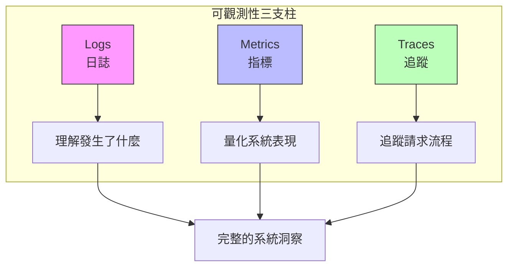

# 第 10 章：可觀測性與除錯：掌握 Agent 的一舉一動

> 本章學習目標：
> - 理解 Agent 系統可觀測性的三大支柱
> - 使用 OpenTelemetry 實作分散式追蹤
> - 建立 Grafana 監控儀表板
> - 設計 Agent 行為的除錯與重放機制

---

## 10.1 為什麼 Agent 系統特別難除錯？

傳統軟體的執行路徑是確定的：輸入 A 總是產生輸出 B。但 Agent 系統截然不同：

```
傳統系統：
Input → 固定邏輯 → Output
        └── 可預測、可重現

Agent 系統：
Input → LLM 推理 → 工具選擇 → 工具執行 → LLM 推理 → ...
        └── 非確定性    └── 外部依賴   └── 狀態變化
```

### 10.1.1 Agent 除錯的挑戰

**非確定性**：同樣的輸入，LLM 可能產生不同的推理結果。

**複雜的執行路徑**：Agent 可能呼叫多個工具、進行多輪推理，執行路徑難以預測。

**外部依賴**：向量資料庫、API、LLM 服務等外部系統都可能影響結果。

**狀態管理**：記憶系統的狀態會影響 Agent 的行為，但狀態是隱藏的。

### 10.1.2 可觀測性的三大支柱



---

## 10.2 OpenTelemetry 整合

OpenTelemetry 是雲原生可觀測性的標準，我們將用它來追蹤 Agent 的執行流程。

### 10.2.1 基礎設定

```python
# observability/telemetry.py
"""
OpenTelemetry 整合
"""

from opentelemetry import trace, metrics
from opentelemetry.sdk.trace import TracerProvider
from opentelemetry.sdk.trace.export import BatchSpanProcessor
from opentelemetry.exporter.otlp.proto.grpc.trace_exporter import OTLPSpanExporter
from opentelemetry.sdk.metrics import MeterProvider
from opentelemetry.exporter.otlp.proto.grpc.metric_exporter import OTLPMetricExporter
from opentelemetry.sdk.resources import Resource
from opentelemetry.instrumentation.requests import RequestsInstrumentor
from opentelemetry.instrumentation.aiohttp_client import AioHttpClientInstrumentor
from functools import wraps
from typing import Dict, Any, Optional
import time


def setup_telemetry(
    service_name: str = "agent-memory-system",
    otlp_endpoint: str = "localhost:4317"
):
    """
    初始化 OpenTelemetry
    ‹1› 設定追蹤和指標的導出
    """
    # 建立資源標識
    resource = Resource.create({
        "service.name": service_name,
        "service.version": "1.0.0",
        "deployment.environment": "production"
    })

    # ‹2› 設定追蹤 (Tracing)
    tracer_provider = TracerProvider(resource=resource)
    otlp_exporter = OTLPSpanExporter(endpoint=otlp_endpoint, insecure=True)
    tracer_provider.add_span_processor(BatchSpanProcessor(otlp_exporter))
    trace.set_tracer_provider(tracer_provider)

    # ‹3› 設定指標 (Metrics)
    meter_provider = MeterProvider(resource=resource)
    metrics.set_meter_provider(meter_provider)

    # ‹4› 自動儀器化 HTTP 請求
    RequestsInstrumentor().instrument()
    AioHttpClientInstrumentor().instrument()

    return trace.get_tracer(service_name), metrics.get_meter(service_name)


# 全域追蹤器和計量器
tracer, meter = setup_telemetry()


class AgentTracer:
    """
    Agent 專用追蹤器
    ‹5› 提供 Agent 執行追蹤的高階 API
    """

    def __init__(self, tracer_instance=None):
        self.tracer = tracer_instance or tracer

        # ‹6› 定義指標
        self.request_counter = meter.create_counter(
            "agent.requests.total",
            description="Total number of agent requests"
        )
        self.latency_histogram = meter.create_histogram(
            "agent.request.latency",
            description="Agent request latency in milliseconds"
        )
        self.token_counter = meter.create_counter(
            "agent.tokens.total",
            description="Total tokens consumed"
        )
        self.tool_call_counter = meter.create_counter(
            "agent.tool_calls.total",
            description="Total tool calls"
        )

    def trace_agent_request(self, request_id: str = None):
        """
        追蹤 Agent 請求的裝飾器
        ‹7› 自動記錄請求的開始、結束、延遲
        """
        def decorator(func):
            @wraps(func)
            async def wrapper(*args, **kwargs):
                with self.tracer.start_as_current_span(
                    "agent.request",
                    attributes={
                        "request.id": request_id or str(time.time()),
                        "agent.name": func.__name__
                    }
                ) as span:
                    start_time = time.time()
                    try:
                        result = await func(*args, **kwargs)

                        # 記錄成功
                        span.set_attribute("request.status", "success")
                        self.request_counter.add(1, {"status": "success"})

                        return result

                    except Exception as e:
                        # 記錄錯誤
                        span.set_attribute("request.status", "error")
                        span.set_attribute("error.message", str(e))
                        span.record_exception(e)
                        self.request_counter.add(1, {"status": "error"})
                        raise

                    finally:
                        latency = (time.time() - start_time) * 1000
                        self.latency_histogram.record(latency)
                        span.set_attribute("request.latency_ms", latency)

            return wrapper
        return decorator

    def trace_llm_call(
        self,
        model: str,
        prompt_tokens: int,
        completion_tokens: int,
        response_time_ms: float
    ):
        """
        追蹤 LLM 呼叫
        ‹8› 記錄 token 使用量和響應時間
        """
        span = trace.get_current_span()

        span.add_event("llm_call", {
            "model": model,
            "prompt_tokens": prompt_tokens,
            "completion_tokens": completion_tokens,
            "response_time_ms": response_time_ms
        })

        self.token_counter.add(
            prompt_tokens + completion_tokens,
            {"model": model, "type": "total"}
        )

    def trace_tool_call(
        self,
        tool_name: str,
        success: bool,
        duration_ms: float,
        error: str = None
    ):
        """
        追蹤工具呼叫
        ‹9› 記錄工具執行結果
        """
        span = trace.get_current_span()

        attributes = {
            "tool.name": tool_name,
            "tool.success": success,
            "tool.duration_ms": duration_ms
        }
        if error:
            attributes["tool.error"] = error

        span.add_event("tool_call", attributes)

        self.tool_call_counter.add(1, {
            "tool": tool_name,
            "status": "success" if success else "error"
        })

    def trace_memory_operation(
        self,
        operation: str,  # retrieve, store, update
        memory_type: str,  # short_term, long_term
        count: int,
        latency_ms: float
    ):
        """
        追蹤記憶操作
        ‹10› 記錄記憶系統的讀寫操作
        """
        span = trace.get_current_span()

        span.add_event("memory_operation", {
            "operation": operation,
            "memory_type": memory_type,
            "item_count": count,
            "latency_ms": latency_ms
        })
```

### 10.2.2 追蹤 Agent 執行流程

```python
# observability/agent_instrumentation.py
"""
Agent 執行追蹤
"""

from contextlib import asynccontextmanager
from typing import AsyncGenerator
import uuid


class InstrumentedAgent:
    """
    帶有完整追蹤的 Agent
    ‹1› 包裝原始 Agent，添加可觀測性
    """

    def __init__(self, agent, tracer: AgentTracer):
        self.agent = agent
        self.tracer = tracer

    @asynccontextmanager
    async def trace_turn(
        self,
        user_input: str,
        session_id: str
    ) -> AsyncGenerator:
        """
        追蹤單輪對話
        ‹2› 建立對話層級的追蹤上下文
        """
        turn_id = str(uuid.uuid4())

        with tracer.tracer.start_as_current_span(
            "agent.turn",
            attributes={
                "turn.id": turn_id,
                "session.id": session_id,
                "user.input.length": len(user_input)
            }
        ) as span:
            context = TurnContext(
                turn_id=turn_id,
                session_id=session_id,
                span=span,
                tracer=self.tracer
            )
            yield context

            # 記錄對話摘要
            span.set_attribute("turn.reasoning_steps", context.reasoning_steps)
            span.set_attribute("turn.tool_calls", context.tool_calls)
            span.set_attribute("turn.total_tokens", context.total_tokens)


class TurnContext:
    """
    對話輪次上下文
    ‹3› 追蹤單輪對話中的所有操作
    """

    def __init__(self, turn_id: str, session_id: str, span, tracer: AgentTracer):
        self.turn_id = turn_id
        self.session_id = session_id
        self.span = span
        self.tracer = tracer

        # 統計
        self.reasoning_steps = 0
        self.tool_calls = 0
        self.total_tokens = 0
        self.events = []

    def record_reasoning(
        self,
        thought: str,
        action: str,
        observation: str = None
    ):
        """
        記錄推理步驟
        ‹4› ReAct 模式的 Thought-Action-Observation
        """
        self.reasoning_steps += 1

        event = {
            "step": self.reasoning_steps,
            "thought": thought[:500],  # 截斷長文本
            "action": action
        }
        if observation:
            event["observation"] = observation[:500]

        self.span.add_event(f"reasoning_step_{self.reasoning_steps}", event)
        self.events.append(event)

    def record_tool_use(
        self,
        tool_name: str,
        args: Dict[str, Any],
        result: Any,
        duration_ms: float,
        success: bool = True
    ):
        """
        記錄工具使用
        ‹5› 詳細記錄工具的輸入輸出
        """
        self.tool_calls += 1

        with self.tracer.tracer.start_as_current_span(
            f"tool.{tool_name}",
            attributes={
                "tool.name": tool_name,
                "tool.args": str(args)[:1000],
                "tool.success": success,
                "tool.duration_ms": duration_ms
            }
        ) as tool_span:
            if not success:
                tool_span.set_attribute("tool.error", str(result))

        self.tracer.trace_tool_call(
            tool_name=tool_name,
            success=success,
            duration_ms=duration_ms
        )

    def record_llm_call(
        self,
        model: str,
        messages: list,
        response: str,
        prompt_tokens: int,
        completion_tokens: int,
        duration_ms: float
    ):
        """
        記錄 LLM 呼叫
        ‹6› 追蹤 LLM 的輸入輸出
        """
        self.total_tokens += prompt_tokens + completion_tokens

        with self.tracer.tracer.start_as_current_span(
            "llm.completion",
            attributes={
                "llm.model": model,
                "llm.prompt_tokens": prompt_tokens,
                "llm.completion_tokens": completion_tokens,
                "llm.duration_ms": duration_ms,
                "llm.messages_count": len(messages)
            }
        ):
            pass

        self.tracer.trace_llm_call(
            model=model,
            prompt_tokens=prompt_tokens,
            completion_tokens=completion_tokens,
            response_time_ms=duration_ms
        )
```

---

## 10.3 結構化日誌系統

### 10.3.1 日誌設計

```python
# observability/logging.py
"""
結構化日誌系統
"""

import structlog
import logging
from datetime import datetime
from typing import Any, Dict
import json


def setup_structured_logging(
    level: str = "INFO",
    json_output: bool = True
):
    """
    設定結構化日誌
    ‹1› 使用 structlog 產生機器可讀的日誌
    """
    # 處理器鏈
    processors = [
        structlog.stdlib.filter_by_level,
        structlog.stdlib.add_logger_name,
        structlog.stdlib.add_log_level,
        structlog.stdlib.PositionalArgumentsFormatter(),
        structlog.processors.TimeStamper(fmt="iso"),
        structlog.processors.StackInfoRenderer(),
        structlog.processors.format_exc_info,
        structlog.processors.UnicodeDecoder(),
    ]

    if json_output:
        processors.append(structlog.processors.JSONRenderer())
    else:
        processors.append(structlog.dev.ConsoleRenderer())

    structlog.configure(
        processors=processors,
        wrapper_class=structlog.stdlib.BoundLogger,
        context_class=dict,
        logger_factory=structlog.stdlib.LoggerFactory(),
        cache_logger_on_first_use=True,
    )

    # 設定標準 logging
    logging.basicConfig(
        format="%(message)s",
        level=getattr(logging, level.upper())
    )


class AgentLogger:
    """
    Agent 專用日誌器
    ‹2› 提供語義化的日誌方法
    """

    def __init__(self, name: str = "agent"):
        self.logger = structlog.get_logger(name)

    def log_request_start(
        self,
        request_id: str,
        user_id: str,
        input_text: str,
        session_id: str
    ):
        """記錄請求開始"""
        self.logger.info(
            "request_started",
            request_id=request_id,
            user_id=user_id,
            session_id=session_id,
            input_length=len(input_text),
            input_preview=input_text[:100]
        )

    def log_request_complete(
        self,
        request_id: str,
        duration_ms: float,
        tokens_used: int,
        tool_calls: int,
        status: str = "success"
    ):
        """記錄請求完成"""
        self.logger.info(
            "request_completed",
            request_id=request_id,
            duration_ms=duration_ms,
            tokens_used=tokens_used,
            tool_calls=tool_calls,
            status=status
        )

    def log_reasoning_step(
        self,
        request_id: str,
        step: int,
        thought: str,
        action: str
    ):
        """
        記錄推理步驟
        ‹3› 追蹤 Agent 的思考過程
        """
        self.logger.debug(
            "reasoning_step",
            request_id=request_id,
            step=step,
            thought=thought[:200],
            action=action
        )

    def log_tool_call(
        self,
        request_id: str,
        tool_name: str,
        args: Dict[str, Any],
        success: bool,
        duration_ms: float,
        error: str = None
    ):
        """記錄工具呼叫"""
        log_data = {
            "request_id": request_id,
            "tool_name": tool_name,
            "args": self._sanitize_args(args),
            "success": success,
            "duration_ms": duration_ms
        }
        if error:
            log_data["error"] = error

        level = "info" if success else "warning"
        getattr(self.logger, level)("tool_call", **log_data)

    def log_memory_access(
        self,
        request_id: str,
        operation: str,
        memory_type: str,
        count: int,
        latency_ms: float
    ):
        """記錄記憶存取"""
        self.logger.debug(
            "memory_access",
            request_id=request_id,
            operation=operation,
            memory_type=memory_type,
            item_count=count,
            latency_ms=latency_ms
        )

    def log_error(
        self,
        request_id: str,
        error_type: str,
        error_message: str,
        context: Dict[str, Any] = None
    ):
        """記錄錯誤"""
        self.logger.error(
            "agent_error",
            request_id=request_id,
            error_type=error_type,
            error_message=error_message,
            context=context or {}
        )

    def _sanitize_args(self, args: Dict[str, Any]) -> Dict[str, Any]:
        """
        清理敏感資訊
        ‹4› 避免在日誌中記錄敏感資料
        """
        sensitive_keys = {"password", "token", "api_key", "secret", "credential"}
        sanitized = {}

        for key, value in args.items():
            if any(s in key.lower() for s in sensitive_keys):
                sanitized[key] = "[REDACTED]"
            elif isinstance(value, str) and len(value) > 500:
                sanitized[key] = value[:500] + "...[truncated]"
            else:
                sanitized[key] = value

        return sanitized
```

---

## 10.4 Grafana 監控儀表板

### 10.4.1 關鍵指標定義

```python
# observability/metrics_definitions.py
"""
Agent 監控指標定義
"""

from dataclasses import dataclass
from typing import List


@dataclass
class MetricDefinition:
    """指標定義"""
    name: str
    type: str  # counter, gauge, histogram
    description: str
    labels: List[str]
    unit: str = ""


# ‹1› 核心業務指標
AGENT_METRICS = [
    # 請求指標
    MetricDefinition(
        name="agent_requests_total",
        type="counter",
        description="Total number of agent requests",
        labels=["status", "user_tier"],
        unit="requests"
    ),
    MetricDefinition(
        name="agent_request_duration_seconds",
        type="histogram",
        description="Agent request duration",
        labels=["status"],
        unit="seconds"
    ),

    # Token 使用
    MetricDefinition(
        name="agent_tokens_total",
        type="counter",
        description="Total tokens consumed",
        labels=["model", "type"],  # type: prompt/completion
        unit="tokens"
    ),
    MetricDefinition(
        name="agent_token_cost_dollars",
        type="counter",
        description="Estimated token cost",
        labels=["model"],
        unit="dollars"
    ),

    # 工具使用
    MetricDefinition(
        name="agent_tool_calls_total",
        type="counter",
        description="Total tool invocations",
        labels=["tool_name", "status"],
        unit="calls"
    ),
    MetricDefinition(
        name="agent_tool_duration_seconds",
        type="histogram",
        description="Tool execution duration",
        labels=["tool_name"],
        unit="seconds"
    ),

    # 記憶系統
    MetricDefinition(
        name="agent_memory_operations_total",
        type="counter",
        description="Memory system operations",
        labels=["operation", "memory_type"],
        unit="operations"
    ),
    MetricDefinition(
        name="agent_memory_hit_rate",
        type="gauge",
        description="Memory cache hit rate",
        labels=["memory_type"],
        unit="ratio"
    ),

    # 品質指標
    MetricDefinition(
        name="agent_user_satisfaction_score",
        type="gauge",
        description="User satisfaction score (0-1)",
        labels=["feedback_type"],
        unit="score"
    ),
    MetricDefinition(
        name="agent_hallucination_rate",
        type="gauge",
        description="Estimated hallucination rate",
        labels=[],
        unit="ratio"
    ),
]
```

### 10.4.2 Grafana 儀表板配置

```json
// grafana/dashboards/agent-overview.json
{
  "dashboard": {
    "title": "Agent Memory System Overview",
    "tags": ["agent", "memory", "production"],
    "timezone": "browser",
    "panels": [
      {
        "title": "Request Rate",
        "type": "stat",
        "gridPos": {"h": 4, "w": 6, "x": 0, "y": 0},
        "targets": [
          {
            "expr": "sum(rate(agent_requests_total[5m]))",
            "legendFormat": "Requests/sec"
          }
        ],
        "options": {
          "colorMode": "value",
          "graphMode": "area"
        }
      },
      {
        "title": "Error Rate",
        "type": "stat",
        "gridPos": {"h": 4, "w": 6, "x": 6, "y": 0},
        "targets": [
          {
            "expr": "sum(rate(agent_requests_total{status='error'}[5m])) / sum(rate(agent_requests_total[5m])) * 100",
            "legendFormat": "Error %"
          }
        ],
        "options": {
          "colorMode": "value",
          "thresholds": {
            "steps": [
              {"color": "green", "value": null},
              {"color": "yellow", "value": 1},
              {"color": "red", "value": 5}
            ]
          }
        }
      },
      {
        "title": "P95 Latency",
        "type": "stat",
        "gridPos": {"h": 4, "w": 6, "x": 12, "y": 0},
        "targets": [
          {
            "expr": "histogram_quantile(0.95, sum(rate(agent_request_duration_seconds_bucket[5m])) by (le))",
            "legendFormat": "P95 Latency"
          }
        ],
        "options": {
          "unit": "s"
        }
      },
      {
        "title": "Token Usage (Hourly)",
        "type": "stat",
        "gridPos": {"h": 4, "w": 6, "x": 18, "y": 0},
        "targets": [
          {
            "expr": "sum(increase(agent_tokens_total[1h]))",
            "legendFormat": "Tokens/hour"
          }
        ]
      },
      {
        "title": "Request Latency Distribution",
        "type": "heatmap",
        "gridPos": {"h": 8, "w": 12, "x": 0, "y": 4},
        "targets": [
          {
            "expr": "sum(rate(agent_request_duration_seconds_bucket[5m])) by (le)",
            "legendFormat": "{{le}}"
          }
        ]
      },
      {
        "title": "Tool Usage Breakdown",
        "type": "piechart",
        "gridPos": {"h": 8, "w": 12, "x": 12, "y": 4},
        "targets": [
          {
            "expr": "sum(increase(agent_tool_calls_total[1h])) by (tool_name)",
            "legendFormat": "{{tool_name}}"
          }
        ]
      },
      {
        "title": "Token Cost Over Time",
        "type": "timeseries",
        "gridPos": {"h": 8, "w": 24, "x": 0, "y": 12},
        "targets": [
          {
            "expr": "sum(rate(agent_token_cost_dollars[1h])) by (model) * 3600",
            "legendFormat": "{{model}} $/hour"
          }
        ],
        "options": {
          "unit": "currencyUSD"
        }
      }
    ]
  }
}
```

---

## 10.5 分散式追蹤與錯誤定位

### 10.5.1 追蹤上下文傳播

```python
# observability/distributed_tracing.py
"""
分散式追蹤
"""

from opentelemetry import trace
from opentelemetry.propagate import inject, extract
from opentelemetry.trace.propagation.tracecontext import TraceContextTextMapPropagator
from typing import Dict, Any
import aiohttp


class DistributedTracer:
    """
    分散式追蹤器
    ‹1› 在多服務環境中傳播追蹤上下文
    """

    def __init__(self):
        self.propagator = TraceContextTextMapPropagator()
        self.tracer = trace.get_tracer("distributed-agent")

    def inject_context(self, headers: Dict[str, str]) -> Dict[str, str]:
        """
        注入追蹤上下文到 HTTP 標頭
        ‹2› 讓下游服務繼承追蹤 ID
        """
        inject(headers)
        return headers

    def extract_context(self, headers: Dict[str, str]):
        """
        從 HTTP 標頭提取追蹤上下文
        ‹3› 繼承上游服務的追蹤 ID
        """
        return extract(headers)

    async def traced_http_call(
        self,
        method: str,
        url: str,
        **kwargs
    ) -> aiohttp.ClientResponse:
        """
        帶追蹤的 HTTP 呼叫
        ‹4› 自動傳播追蹤上下文
        """
        with self.tracer.start_as_current_span(
            f"http.{method.lower()}",
            attributes={
                "http.method": method,
                "http.url": url
            }
        ) as span:
            # 注入追蹤上下文
            headers = kwargs.pop("headers", {})
            self.inject_context(headers)
            kwargs["headers"] = headers

            async with aiohttp.ClientSession() as session:
                async with session.request(method, url, **kwargs) as response:
                    span.set_attribute("http.status_code", response.status)
                    return response


class ErrorAnalyzer:
    """
    錯誤分析器
    ‹5› 分析追蹤數據定位錯誤根因
    """

    def __init__(self, jaeger_url: str):
        self.jaeger_url = jaeger_url

    async def find_error_traces(
        self,
        service: str,
        time_range_minutes: int = 60,
        limit: int = 100
    ) -> list:
        """
        查詢錯誤追蹤
        ‹6› 從 Jaeger 查詢失敗的追蹤
        """
        import aiohttp
        from datetime import datetime, timedelta

        end_time = datetime.now()
        start_time = end_time - timedelta(minutes=time_range_minutes)

        params = {
            "service": service,
            "start": int(start_time.timestamp() * 1000000),
            "end": int(end_time.timestamp() * 1000000),
            "limit": limit,
            "tags": '{"error":"true"}'
        }

        async with aiohttp.ClientSession() as session:
            async with session.get(
                f"{self.jaeger_url}/api/traces",
                params=params
            ) as response:
                data = await response.json()
                return self._parse_traces(data)

    def analyze_error_patterns(self, traces: list) -> Dict[str, Any]:
        """
        分析錯誤模式
        ‹7› 找出常見的錯誤原因
        """
        error_patterns = {}

        for trace_data in traces:
            for span in trace_data.get("spans", []):
                if span.get("tags", {}).get("error"):
                    error_type = self._extract_error_type(span)
                    operation = span.get("operationName", "unknown")

                    key = f"{operation}:{error_type}"
                    if key not in error_patterns:
                        error_patterns[key] = {
                            "count": 0,
                            "examples": [],
                            "operation": operation,
                            "error_type": error_type
                        }

                    error_patterns[key]["count"] += 1
                    if len(error_patterns[key]["examples"]) < 3:
                        error_patterns[key]["examples"].append({
                            "trace_id": trace_data.get("traceID"),
                            "timestamp": span.get("startTime"),
                            "message": self._extract_error_message(span)
                        })

        # 按頻率排序
        sorted_patterns = sorted(
            error_patterns.values(),
            key=lambda x: x["count"],
            reverse=True
        )

        return {
            "total_errors": len(traces),
            "patterns": sorted_patterns[:10],
            "analysis_time": datetime.now().isoformat()
        }

    def _extract_error_type(self, span: dict) -> str:
        """提取錯誤類型"""
        tags = span.get("tags", {})
        for tag in tags:
            if tag.get("key") == "error.type":
                return tag.get("value", "unknown")
        return "unknown"

    def _extract_error_message(self, span: dict) -> str:
        """提取錯誤訊息"""
        logs = span.get("logs", [])
        for log in logs:
            for field in log.get("fields", []):
                if field.get("key") == "message":
                    return field.get("value", "")
        return ""

    def _parse_traces(self, data: dict) -> list:
        """解析 Jaeger 回傳的追蹤資料"""
        return data.get("data", [])
```

---

## 10.6 Agent 行為重放與除錯

### 10.6.1 執行記錄與重放

```python
# observability/replay.py
"""
Agent 執行重放系統
"""

from dataclasses import dataclass, field
from typing import List, Dict, Any, Optional
from datetime import datetime
import json
import asyncio


@dataclass
class ExecutionStep:
    """執行步驟"""
    step_type: str  # reasoning, tool_call, llm_call, memory_op
    timestamp: datetime
    input_data: Dict[str, Any]
    output_data: Dict[str, Any]
    duration_ms: float
    metadata: Dict[str, Any] = field(default_factory=dict)


@dataclass
class ExecutionRecord:
    """
    完整執行記錄
    ‹1› 記錄 Agent 的完整執行過程
    """
    record_id: str
    session_id: str
    user_id: str
    user_input: str
    final_output: str
    steps: List[ExecutionStep]
    total_duration_ms: float
    total_tokens: int
    success: bool
    error: Optional[str] = None
    created_at: datetime = field(default_factory=datetime.now)


class ExecutionRecorder:
    """
    執行記錄器
    ‹2› 記錄 Agent 執行的每個步驟
    """

    def __init__(self, storage_backend):
        self.storage = storage_backend
        self.current_steps: List[ExecutionStep] = []

    def start_recording(
        self,
        record_id: str,
        session_id: str,
        user_id: str,
        user_input: str
    ):
        """開始記錄"""
        self.record_id = record_id
        self.session_id = session_id
        self.user_id = user_id
        self.user_input = user_input
        self.current_steps = []
        self.start_time = datetime.now()

    def record_step(
        self,
        step_type: str,
        input_data: Dict[str, Any],
        output_data: Dict[str, Any],
        duration_ms: float,
        metadata: Dict[str, Any] = None
    ):
        """
        記錄單個步驟
        ‹3› 每個操作都被記錄下來
        """
        step = ExecutionStep(
            step_type=step_type,
            timestamp=datetime.now(),
            input_data=self._sanitize(input_data),
            output_data=self._sanitize(output_data),
            duration_ms=duration_ms,
            metadata=metadata or {}
        )
        self.current_steps.append(step)

    async def finish_recording(
        self,
        final_output: str,
        total_tokens: int,
        success: bool,
        error: str = None
    ) -> ExecutionRecord:
        """
        完成記錄
        ‹4› 儲存完整的執行記錄
        """
        total_duration = (datetime.now() - self.start_time).total_seconds() * 1000

        record = ExecutionRecord(
            record_id=self.record_id,
            session_id=self.session_id,
            user_id=self.user_id,
            user_input=self.user_input,
            final_output=final_output,
            steps=self.current_steps,
            total_duration_ms=total_duration,
            total_tokens=total_tokens,
            success=success,
            error=error
        )

        await self.storage.save_record(record)
        return record

    def _sanitize(self, data: Dict[str, Any]) -> Dict[str, Any]:
        """清理敏感資料"""
        # 深拷貝並遮蔽敏感欄位
        import copy
        sanitized = copy.deepcopy(data)
        sensitive_keys = {"password", "api_key", "token", "secret"}

        def mask_recursive(obj):
            if isinstance(obj, dict):
                for key in obj:
                    if any(s in key.lower() for s in sensitive_keys):
                        obj[key] = "[REDACTED]"
                    else:
                        mask_recursive(obj[key])
            elif isinstance(obj, list):
                for item in obj:
                    mask_recursive(item)

        mask_recursive(sanitized)
        return sanitized


class ExecutionReplayer:
    """
    執行重放器
    ‹5› 重放 Agent 的執行過程
    """

    def __init__(self, storage_backend):
        self.storage = storage_backend

    async def replay(
        self,
        record_id: str,
        step_by_step: bool = False,
        callback=None
    ) -> ExecutionRecord:
        """
        重放執行記錄
        ‹6› 可逐步執行或完整重放
        """
        record = await self.storage.get_record(record_id)
        if not record:
            raise ValueError(f"Record not found: {record_id}")

        print(f"\n{'='*60}")
        print(f"Replaying execution: {record_id}")
        print(f"User input: {record.user_input}")
        print(f"{'='*60}\n")

        for i, step in enumerate(record.steps):
            self._display_step(i + 1, step)

            if step_by_step:
                input("Press Enter to continue...")

            if callback:
                await callback(step)

        print(f"\n{'='*60}")
        print(f"Final output: {record.final_output}")
        print(f"Total duration: {record.total_duration_ms:.2f}ms")
        print(f"Total tokens: {record.total_tokens}")
        print(f"Success: {record.success}")
        if record.error:
            print(f"Error: {record.error}")
        print(f"{'='*60}\n")

        return record

    def _display_step(self, step_num: int, step: ExecutionStep):
        """顯示步驟詳情"""
        print(f"\n--- Step {step_num}: {step.step_type} ---")
        print(f"Time: {step.timestamp.isoformat()}")
        print(f"Duration: {step.duration_ms:.2f}ms")
        print(f"Input: {json.dumps(step.input_data, indent=2, ensure_ascii=False)[:500]}")
        print(f"Output: {json.dumps(step.output_data, indent=2, ensure_ascii=False)[:500]}")

    async def compare_executions(
        self,
        record_id_1: str,
        record_id_2: str
    ) -> Dict[str, Any]:
        """
        比較兩次執行
        ‹7› 找出執行差異
        """
        record1 = await self.storage.get_record(record_id_1)
        record2 = await self.storage.get_record(record_id_2)

        differences = {
            "step_count_diff": len(record2.steps) - len(record1.steps),
            "duration_diff_ms": record2.total_duration_ms - record1.total_duration_ms,
            "token_diff": record2.total_tokens - record1.total_tokens,
            "success_diff": record1.success != record2.success,
            "step_differences": []
        }

        # 比較步驟
        max_steps = max(len(record1.steps), len(record2.steps))
        for i in range(max_steps):
            step1 = record1.steps[i] if i < len(record1.steps) else None
            step2 = record2.steps[i] if i < len(record2.steps) else None

            if step1 and step2:
                if step1.step_type != step2.step_type:
                    differences["step_differences"].append({
                        "step": i + 1,
                        "type": "type_mismatch",
                        "record1": step1.step_type,
                        "record2": step2.step_type
                    })
            elif step1:
                differences["step_differences"].append({
                    "step": i + 1,
                    "type": "missing_in_record2",
                    "record1": step1.step_type
                })
            else:
                differences["step_differences"].append({
                    "step": i + 1,
                    "type": "missing_in_record1",
                    "record2": step2.step_type
                })

        return differences
```

---

## 10.7 告警與異常檢測

### 10.7.1 告警規則

```python
# observability/alerting.py
"""
告警系統
"""

from dataclasses import dataclass
from typing import List, Dict, Any, Callable
from enum import Enum
import asyncio


class AlertSeverity(Enum):
    INFO = "info"
    WARNING = "warning"
    CRITICAL = "critical"


@dataclass
class AlertRule:
    """
    告警規則
    ‹1› 定義觸發告警的條件
    """
    name: str
    description: str
    severity: AlertSeverity
    condition: str  # PromQL 表達式
    threshold: float
    duration_seconds: int
    labels: Dict[str, str]


# ‹2› 預定義的告警規則
AGENT_ALERT_RULES = [
    AlertRule(
        name="HighErrorRate",
        description="Agent error rate is above 5%",
        severity=AlertSeverity.CRITICAL,
        condition='sum(rate(agent_requests_total{status="error"}[5m])) / sum(rate(agent_requests_total[5m])) * 100',
        threshold=5.0,
        duration_seconds=300,
        labels={"team": "agent", "component": "core"}
    ),
    AlertRule(
        name="HighLatency",
        description="P95 latency is above 10 seconds",
        severity=AlertSeverity.WARNING,
        condition='histogram_quantile(0.95, sum(rate(agent_request_duration_seconds_bucket[5m])) by (le))',
        threshold=10.0,
        duration_seconds=300,
        labels={"team": "agent", "component": "core"}
    ),
    AlertRule(
        name="TokenBudgetExceeded",
        description="Hourly token usage exceeds budget",
        severity=AlertSeverity.WARNING,
        condition='sum(increase(agent_tokens_total[1h]))',
        threshold=1000000,  # 100萬 token/小時
        duration_seconds=60,
        labels={"team": "agent", "component": "cost"}
    ),
    AlertRule(
        name="MemorySystemDown",
        description="Memory system is not responding",
        severity=AlertSeverity.CRITICAL,
        condition='sum(rate(agent_memory_operations_total[1m]))',
        threshold=0,  # 如果為 0 則表示沒有操作
        duration_seconds=120,
        labels={"team": "agent", "component": "memory"}
    ),
    AlertRule(
        name="ToolFailureSpike",
        description="Tool failure rate spike detected",
        severity=AlertSeverity.WARNING,
        condition='sum(rate(agent_tool_calls_total{status="error"}[5m])) / sum(rate(agent_tool_calls_total[5m])) * 100',
        threshold=10.0,
        duration_seconds=180,
        labels={"team": "agent", "component": "tools"}
    ),
]


class AnomalyDetector:
    """
    異常檢測器
    ‹3› 基於統計的異常檢測
    """

    def __init__(self, window_size: int = 100):
        self.window_size = window_size
        self.metrics_history: Dict[str, List[float]] = {}

    def record(self, metric_name: str, value: float):
        """記錄指標值"""
        if metric_name not in self.metrics_history:
            self.metrics_history[metric_name] = []

        history = self.metrics_history[metric_name]
        history.append(value)

        # 保持窗口大小
        if len(history) > self.window_size:
            history.pop(0)

    def is_anomaly(
        self,
        metric_name: str,
        value: float,
        std_threshold: float = 3.0
    ) -> bool:
        """
        檢測異常
        ‹4› 使用 Z-score 方法
        """
        history = self.metrics_history.get(metric_name, [])

        if len(history) < 10:
            return False

        import statistics
        mean = statistics.mean(history)
        std = statistics.stdev(history)

        if std == 0:
            return False

        z_score = abs(value - mean) / std
        return z_score > std_threshold

    def get_statistics(self, metric_name: str) -> Dict[str, float]:
        """獲取指標統計"""
        history = self.metrics_history.get(metric_name, [])

        if not history:
            return {}

        import statistics
        return {
            "mean": statistics.mean(history),
            "std": statistics.stdev(history) if len(history) > 1 else 0,
            "min": min(history),
            "max": max(history),
            "count": len(history)
        }
```

---

## 10.8 總結與下一步

### 本章回顧

在本章中，我們：

1. **理解了 Agent 可觀測性的挑戰**：非確定性、複雜執行路徑、外部依賴
2. **實作了 OpenTelemetry 整合**：分散式追蹤、指標收集
3. **建立了結構化日誌系統**：語義化日誌、敏感資料過濾
4. **設計了 Grafana 監控儀表板**：核心業務指標、成本追蹤
5. **實作了執行重放系統**：記錄與重放 Agent 執行過程
6. **建立了告警與異常檢測**：主動發現系統問題

### 關鍵決策說明

| 決策點 | 選擇 | 原因 |
|--------|------|------|
| 追蹤標準 | OpenTelemetry | 雲原生標準，廠商中立 |
| 日誌格式 | JSON 結構化 | 易於查詢和分析 |
| 指標儲存 | Prometheus | 成熟穩定，生態豐富 |
| 追蹤後端 | Jaeger | 開源免費，功能完整 |
| 異常檢測 | Z-score | 簡單有效，易於理解 |

### 下一章預告

在第 11 章「成本優化與效能調校」中，我們將學習：

- Token 使用量的精確監控與預算控制
- 智慧快取策略減少 API 呼叫
- 模型路由：根據任務複雜度選擇模型
- 批次處理與請求合併優化

---

完整程式碼請參見 `code-examples/chapter-10/` 目錄。
