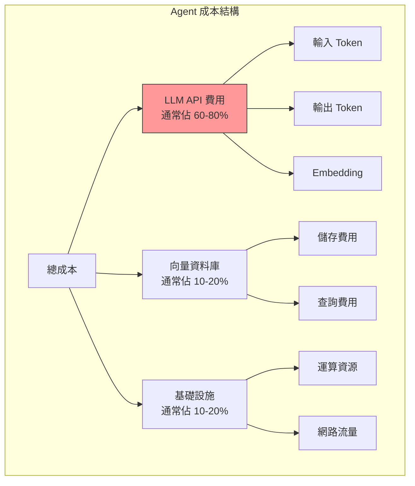

# 第 11 章：成本優化與效能調校：讓 Agent 經濟實惠

> 本章學習目標：
> - 建立 Token 使用量的精確監控與預算控制
> - 實作智慧快取策略減少 API 呼叫
> - 設計模型路由系統，根據任務選擇最適合的模型
> - 掌握批次處理與請求合併的優化技巧

---

## 11.1 Agent 系統的成本結構

在生產環境中，Agent 系統的成本可能快速累積。讓我們先了解成本的組成：



### 11.1.1 Token 成本計算

```python
# cost/token_calculator.py
"""
Token 成本計算器
"""

from dataclasses import dataclass
from typing import Dict
from datetime import datetime


@dataclass
class ModelPricing:
    """模型定價（每百萬 token）"""
    input_price: float
    output_price: float
    cached_input_price: float = 0.0  # 快取的輸入價格


# ‹1› 2024 年主流模型定價
MODEL_PRICING: Dict[str, ModelPricing] = {
    # OpenAI
    "gpt-4o": ModelPricing(5.0, 15.0, 2.5),
    "gpt-4o-mini": ModelPricing(0.15, 0.60, 0.075),
    "gpt-4-turbo": ModelPricing(10.0, 30.0),
    "gpt-3.5-turbo": ModelPricing(0.50, 1.50),

    # Claude
    "claude-3-opus": ModelPricing(15.0, 75.0),
    "claude-3-sonnet": ModelPricing(3.0, 15.0),
    "claude-3-haiku": ModelPricing(0.25, 1.25),

    # Embedding
    "text-embedding-3-small": ModelPricing(0.02, 0.0),
    "text-embedding-3-large": ModelPricing(0.13, 0.0),
}


class TokenCostCalculator:
    """
    Token 成本計算器
    ‹2› 精確計算 API 呼叫成本
    """

    def __init__(self, custom_pricing: Dict[str, ModelPricing] = None):
        self.pricing = {**MODEL_PRICING, **(custom_pricing or {})}

    def calculate_cost(
        self,
        model: str,
        input_tokens: int,
        output_tokens: int,
        cached_tokens: int = 0
    ) -> float:
        """
        計算單次呼叫成本
        ‹3› 支援 prompt 快取計算
        """
        if model not in self.pricing:
            raise ValueError(f"Unknown model: {model}")

        pricing = self.pricing[model]

        # 計算各部分成本
        regular_input_cost = (input_tokens - cached_tokens) * pricing.input_price / 1_000_000
        cached_input_cost = cached_tokens * pricing.cached_input_price / 1_000_000
        output_cost = output_tokens * pricing.output_price / 1_000_000

        return regular_input_cost + cached_input_cost + output_cost

    def estimate_monthly_cost(
        self,
        model: str,
        avg_input_tokens: int,
        avg_output_tokens: int,
        requests_per_day: int,
        cache_hit_rate: float = 0.0
    ) -> Dict[str, float]:
        """
        估算月度成本
        ‹4› 幫助做預算規劃
        """
        pricing = self.pricing[model]
        requests_per_month = requests_per_day * 30

        # 計算 token 總量
        total_input = avg_input_tokens * requests_per_month
        total_output = avg_output_tokens * requests_per_month
        cached_input = int(total_input * cache_hit_rate)
        regular_input = total_input - cached_input

        # 計算成本
        input_cost = regular_input * pricing.input_price / 1_000_000
        cached_cost = cached_input * pricing.cached_input_price / 1_000_000
        output_cost = total_output * pricing.output_price / 1_000_000

        total = input_cost + cached_cost + output_cost

        return {
            "monthly_requests": requests_per_month,
            "total_input_tokens": total_input,
            "total_output_tokens": total_output,
            "input_cost": input_cost,
            "cached_cost": cached_cost,
            "output_cost": output_cost,
            "total_cost": total,
            "cost_per_request": total / requests_per_month if requests_per_month > 0 else 0
        }
```

---

## 11.2 Token 使用監控與預算控制

### 11.2.1 即時 Token 監控

```python
# cost/token_monitor.py
"""
Token 使用監控
"""

from dataclasses import dataclass, field
from datetime import datetime, timedelta
from typing import Dict, List, Optional
from collections import defaultdict
import asyncio


@dataclass
class TokenUsage:
    """Token 使用記錄"""
    timestamp: datetime
    model: str
    input_tokens: int
    output_tokens: int
    cost: float
    user_id: str
    request_id: str


@dataclass
class UsageBudget:
    """使用預算"""
    daily_token_limit: int
    daily_cost_limit: float
    monthly_token_limit: int
    monthly_cost_limit: float


class TokenUsageMonitor:
    """
    Token 使用監控器
    ‹1› 追蹤和限制 Token 使用
    """

    def __init__(self, redis_client, default_budget: UsageBudget = None):
        self.redis = redis_client
        self.default_budget = default_budget or UsageBudget(
            daily_token_limit=1_000_000,
            daily_cost_limit=50.0,
            monthly_token_limit=20_000_000,
            monthly_cost_limit=1000.0
        )
        self.calculator = TokenCostCalculator()

    async def record_usage(
        self,
        model: str,
        input_tokens: int,
        output_tokens: int,
        user_id: str,
        request_id: str
    ) -> TokenUsage:
        """
        記錄 Token 使用
        ‹2› 同時更新多個維度的統計
        """
        cost = self.calculator.calculate_cost(model, input_tokens, output_tokens)

        usage = TokenUsage(
            timestamp=datetime.now(),
            model=model,
            input_tokens=input_tokens,
            output_tokens=output_tokens,
            cost=cost,
            user_id=user_id,
            request_id=request_id
        )

        # 更新 Redis 計數器
        today = datetime.now().strftime("%Y-%m-%d")
        month = datetime.now().strftime("%Y-%m")
        total_tokens = input_tokens + output_tokens

        pipe = self.redis.pipeline()

        # ‹3› 全域統計
        pipe.incrbyfloat(f"token:daily:{today}:tokens", total_tokens)
        pipe.incrbyfloat(f"token:daily:{today}:cost", cost)
        pipe.incrbyfloat(f"token:monthly:{month}:tokens", total_tokens)
        pipe.incrbyfloat(f"token:monthly:{month}:cost", cost)

        # ‹4› 按使用者統計
        pipe.incrbyfloat(f"token:user:{user_id}:daily:{today}:tokens", total_tokens)
        pipe.incrbyfloat(f"token:user:{user_id}:daily:{today}:cost", cost)

        # ‹5› 按模型統計
        pipe.incrbyfloat(f"token:model:{model}:daily:{today}:tokens", total_tokens)
        pipe.incrbyfloat(f"token:model:{model}:daily:{today}:cost", cost)

        # 設定過期時間
        pipe.expire(f"token:daily:{today}:tokens", 86400 * 7)  # 保留 7 天
        pipe.expire(f"token:daily:{today}:cost", 86400 * 7)

        await pipe.execute()

        return usage

    async def check_budget(
        self,
        user_id: str = None,
        budget: UsageBudget = None
    ) -> Dict[str, any]:
        """
        檢查預算
        ‹6› 返回預算使用情況和是否超限
        """
        budget = budget or self.default_budget
        today = datetime.now().strftime("%Y-%m-%d")
        month = datetime.now().strftime("%Y-%m")

        # 獲取當前使用量
        if user_id:
            daily_tokens = float(await self.redis.get(f"token:user:{user_id}:daily:{today}:tokens") or 0)
            daily_cost = float(await self.redis.get(f"token:user:{user_id}:daily:{today}:cost") or 0)
        else:
            daily_tokens = float(await self.redis.get(f"token:daily:{today}:tokens") or 0)
            daily_cost = float(await self.redis.get(f"token:daily:{today}:cost") or 0)

        monthly_tokens = float(await self.redis.get(f"token:monthly:{month}:tokens") or 0)
        monthly_cost = float(await self.redis.get(f"token:monthly:{month}:cost") or 0)

        return {
            "daily": {
                "tokens_used": int(daily_tokens),
                "tokens_limit": budget.daily_token_limit,
                "tokens_remaining": max(0, budget.daily_token_limit - daily_tokens),
                "tokens_percentage": (daily_tokens / budget.daily_token_limit * 100) if budget.daily_token_limit > 0 else 0,
                "cost_used": daily_cost,
                "cost_limit": budget.daily_cost_limit,
                "cost_remaining": max(0, budget.daily_cost_limit - daily_cost),
                "exceeded": daily_tokens >= budget.daily_token_limit or daily_cost >= budget.daily_cost_limit
            },
            "monthly": {
                "tokens_used": int(monthly_tokens),
                "tokens_limit": budget.monthly_token_limit,
                "tokens_remaining": max(0, budget.monthly_token_limit - monthly_tokens),
                "tokens_percentage": (monthly_tokens / budget.monthly_token_limit * 100) if budget.monthly_token_limit > 0 else 0,
                "cost_used": monthly_cost,
                "cost_limit": budget.monthly_cost_limit,
                "cost_remaining": max(0, budget.monthly_cost_limit - monthly_cost),
                "exceeded": monthly_tokens >= budget.monthly_token_limit or monthly_cost >= budget.monthly_cost_limit
            }
        }

    async def get_usage_trend(
        self,
        days: int = 7,
        user_id: str = None
    ) -> List[Dict]:
        """
        獲取使用趨勢
        ‹7› 用於圖表展示
        """
        trend = []

        for i in range(days):
            date = (datetime.now() - timedelta(days=i)).strftime("%Y-%m-%d")

            if user_id:
                tokens = float(await self.redis.get(f"token:user:{user_id}:daily:{date}:tokens") or 0)
                cost = float(await self.redis.get(f"token:user:{user_id}:daily:{date}:cost") or 0)
            else:
                tokens = float(await self.redis.get(f"token:daily:{date}:tokens") or 0)
                cost = float(await self.redis.get(f"token:daily:{date}:cost") or 0)

            trend.append({
                "date": date,
                "tokens": int(tokens),
                "cost": cost
            })

        return list(reversed(trend))


class BudgetEnforcer:
    """
    預算執行器
    ‹8› 在超出預算時採取行動
    """

    def __init__(self, monitor: TokenUsageMonitor):
        self.monitor = monitor

    async def enforce(
        self,
        user_id: str,
        budget: UsageBudget = None
    ) -> Dict[str, any]:
        """
        執行預算檢查
        ‹9› 返回是否允許繼續以及建議的模型
        """
        status = await self.monitor.check_budget(user_id, budget)

        result = {
            "allowed": True,
            "suggested_model": None,
            "warning": None
        }

        # 檢查是否超出每日限制
        if status["daily"]["exceeded"]:
            result["allowed"] = False
            result["warning"] = "Daily budget exceeded"
            return result

        # 檢查是否接近限制（>80%）
        if status["daily"]["tokens_percentage"] > 80:
            result["warning"] = f"Daily budget at {status['daily']['tokens_percentage']:.1f}%"
            result["suggested_model"] = "gpt-4o-mini"  # 建議使用更便宜的模型

        # 檢查月度預算
        if status["monthly"]["exceeded"]:
            result["allowed"] = False
            result["warning"] = "Monthly budget exceeded"
            return result

        if status["monthly"]["tokens_percentage"] > 90:
            result["warning"] = f"Monthly budget at {status['monthly']['tokens_percentage']:.1f}%"
            result["suggested_model"] = "gpt-4o-mini"

        return result
```

---

## 11.3 智慧快取策略

### 11.3.1 多層快取架構

```python
# cost/caching.py
"""
智慧快取系統
"""

from abc import ABC, abstractmethod
from dataclasses import dataclass
from typing import Optional, Dict, Any, List
from datetime import datetime, timedelta
import hashlib
import json


@dataclass
class CacheEntry:
    """快取條目"""
    key: str
    value: Any
    created_at: datetime
    expires_at: datetime
    hit_count: int = 0
    last_accessed: datetime = None


class CacheLayer(ABC):
    """快取層抽象類別"""

    @abstractmethod
    async def get(self, key: str) -> Optional[Any]:
        pass

    @abstractmethod
    async def set(self, key: str, value: Any, ttl: int = None) -> bool:
        pass

    @abstractmethod
    async def delete(self, key: str) -> bool:
        pass


class MemoryCache(CacheLayer):
    """
    記憶體快取
    ‹1› 第一層快取，最快但容量有限
    """

    def __init__(self, max_size: int = 1000):
        self.cache: Dict[str, CacheEntry] = {}
        self.max_size = max_size

    async def get(self, key: str) -> Optional[Any]:
        if key not in self.cache:
            return None

        entry = self.cache[key]

        # 檢查是否過期
        if datetime.now() > entry.expires_at:
            del self.cache[key]
            return None

        entry.hit_count += 1
        entry.last_accessed = datetime.now()
        return entry.value

    async def set(self, key: str, value: Any, ttl: int = 300) -> bool:
        # LRU 淘汰
        if len(self.cache) >= self.max_size:
            self._evict_lru()

        self.cache[key] = CacheEntry(
            key=key,
            value=value,
            created_at=datetime.now(),
            expires_at=datetime.now() + timedelta(seconds=ttl),
            last_accessed=datetime.now()
        )
        return True

    async def delete(self, key: str) -> bool:
        if key in self.cache:
            del self.cache[key]
            return True
        return False

    def _evict_lru(self):
        """淘汰最近最少使用的條目"""
        if not self.cache:
            return

        oldest_key = min(
            self.cache.keys(),
            key=lambda k: self.cache[k].last_accessed or self.cache[k].created_at
        )
        del self.cache[oldest_key]


class RedisCache(CacheLayer):
    """
    Redis 快取
    ‹2› 第二層快取，分散式共享
    """

    def __init__(self, redis_client, prefix: str = "agent:cache"):
        self.redis = redis_client
        self.prefix = prefix

    async def get(self, key: str) -> Optional[Any]:
        full_key = f"{self.prefix}:{key}"
        data = await self.redis.get(full_key)

        if data is None:
            return None

        return json.loads(data)

    async def set(self, key: str, value: Any, ttl: int = 3600) -> bool:
        full_key = f"{self.prefix}:{key}"
        await self.redis.setex(full_key, ttl, json.dumps(value))
        return True

    async def delete(self, key: str) -> bool:
        full_key = f"{self.prefix}:{key}"
        result = await self.redis.delete(full_key)
        return result > 0


class MultiLayerCache:
    """
    多層快取
    ‹3› 組合記憶體和 Redis 快取
    """

    def __init__(
        self,
        memory_cache: MemoryCache,
        redis_cache: RedisCache
    ):
        self.l1 = memory_cache
        self.l2 = redis_cache

    async def get(self, key: str) -> Optional[Any]:
        # 先查 L1
        value = await self.l1.get(key)
        if value is not None:
            return value

        # 再查 L2
        value = await self.l2.get(key)
        if value is not None:
            # 回填 L1
            await self.l1.set(key, value)
            return value

        return None

    async def set(
        self,
        key: str,
        value: Any,
        l1_ttl: int = 300,
        l2_ttl: int = 3600
    ) -> bool:
        # 同時寫入兩層
        await self.l1.set(key, value, l1_ttl)
        await self.l2.set(key, value, l2_ttl)
        return True


class SemanticCache:
    """
    語義快取
    ‹4› 基於語義相似度的快取
    """

    def __init__(
        self,
        embedding_model,
        vector_store,
        similarity_threshold: float = 0.95
    ):
        self.embedder = embedding_model
        self.vector_store = vector_store
        self.threshold = similarity_threshold

    async def get(self, query: str) -> Optional[Dict[str, Any]]:
        """
        語義查詢快取
        ‹5› 如果有足夠相似的查詢，返回其結果
        """
        query_embedding = await self.embedder.embed(query)

        results = await self.vector_store.search(
            vector=query_embedding,
            k=1,
            filter={"type": "cache"}
        )

        if results and results[0]["score"] >= self.threshold:
            return {
                "hit": True,
                "cached_query": results[0]["metadata"]["query"],
                "cached_response": results[0]["metadata"]["response"],
                "similarity": results[0]["score"]
            }

        return None

    async def set(self, query: str, response: str):
        """儲存查詢和回應"""
        query_embedding = await self.embedder.embed(query)

        await self.vector_store.upsert(
            id=self._generate_id(query),
            vector=query_embedding,
            metadata={
                "type": "cache",
                "query": query,
                "response": response,
                "created_at": datetime.now().isoformat()
            }
        )

    def _generate_id(self, query: str) -> str:
        return f"cache_{hashlib.md5(query.encode()).hexdigest()}"


class AgentResponseCache:
    """
    Agent 回應快取
    ‹6› 整合多種快取策略
    """

    def __init__(
        self,
        multi_layer_cache: MultiLayerCache,
        semantic_cache: SemanticCache = None
    ):
        self.cache = multi_layer_cache
        self.semantic_cache = semantic_cache

    def _make_cache_key(
        self,
        query: str,
        context_hash: str = None
    ) -> str:
        """
        生成快取鍵
        ‹7› 包含查詢和上下文
        """
        key_parts = [query]
        if context_hash:
            key_parts.append(context_hash)

        key_string = "|".join(key_parts)
        return hashlib.sha256(key_string.encode()).hexdigest()[:32]

    async def get_cached_response(
        self,
        query: str,
        context_hash: str = None,
        use_semantic: bool = True
    ) -> Optional[Dict[str, Any]]:
        """
        獲取快取的回應
        ‹8› 優先精確匹配，其次語義匹配
        """
        # 嘗試精確匹配
        exact_key = self._make_cache_key(query, context_hash)
        exact_result = await self.cache.get(exact_key)

        if exact_result:
            return {
                "type": "exact",
                "response": exact_result,
                "cache_key": exact_key
            }

        # 嘗試語義匹配
        if use_semantic and self.semantic_cache:
            semantic_result = await self.semantic_cache.get(query)
            if semantic_result and semantic_result["hit"]:
                return {
                    "type": "semantic",
                    "response": semantic_result["cached_response"],
                    "original_query": semantic_result["cached_query"],
                    "similarity": semantic_result["similarity"]
                }

        return None

    async def cache_response(
        self,
        query: str,
        response: str,
        context_hash: str = None,
        cache_semantic: bool = True
    ):
        """
        快取回應
        ‹9› 同時儲存精確和語義快取
        """
        # 精確快取
        exact_key = self._make_cache_key(query, context_hash)
        await self.cache.set(exact_key, response)

        # 語義快取
        if cache_semantic and self.semantic_cache:
            await self.semantic_cache.set(query, response)
```

---

## 11.4 模型路由：智慧選擇模型

### 11.4.1 任務複雜度評估

```python
# cost/model_router.py
"""
智慧模型路由
"""

from dataclasses import dataclass
from typing import Dict, List, Optional
from enum import Enum
import re


class TaskComplexity(Enum):
    SIMPLE = "simple"
    MEDIUM = "medium"
    COMPLEX = "complex"


@dataclass
class ModelConfig:
    """模型配置"""
    name: str
    max_tokens: int
    cost_per_1k_input: float
    cost_per_1k_output: float
    supports_tools: bool
    supports_vision: bool
    quality_score: float  # 0-1


class TaskComplexityAnalyzer:
    """
    任務複雜度分析器
    ‹1› 評估任務需要的模型能力
    """

    def __init__(self):
        # ‹2› 複雜度指標
        self.complexity_indicators = {
            "simple": [
                r"翻譯",
                r"摘要",
                r"格式化",
                r"簡單問答",
                r"列出",
                r"解釋.*是什麼"
            ],
            "complex": [
                r"分析",
                r"比較",
                r"設計",
                r"規劃",
                r"優化",
                r"評估",
                r"多步驟",
                r"程式碼審查",
                r"架構"
            ]
        }

    def analyze(self, query: str, context: Dict = None) -> TaskComplexity:
        """
        分析任務複雜度
        ‹3› 基於規則和啟發式判斷
        """
        query_lower = query.lower()

        # 檢查簡單指標
        simple_score = sum(
            1 for pattern in self.complexity_indicators["simple"]
            if re.search(pattern, query_lower)
        )

        # 檢查複雜指標
        complex_score = sum(
            1 for pattern in self.complexity_indicators["complex"]
            if re.search(pattern, query_lower)
        )

        # 考慮上下文
        if context:
            # 多輪對話增加複雜度
            if context.get("turn_count", 0) > 3:
                complex_score += 1

            # 需要工具增加複雜度
            if context.get("requires_tools"):
                complex_score += 1

            # 長上下文增加複雜度
            if context.get("context_length", 0) > 4000:
                complex_score += 1

        # 判斷複雜度
        if complex_score >= 2:
            return TaskComplexity.COMPLEX
        elif simple_score >= 2 or (simple_score > complex_score):
            return TaskComplexity.SIMPLE
        else:
            return TaskComplexity.MEDIUM


class ModelRouter:
    """
    模型路由器
    ‹4› 根據任務選擇最適合的模型
    """

    def __init__(self):
        self.analyzer = TaskComplexityAnalyzer()

        # ‹5› 模型配置
        self.models = {
            "gpt-4o": ModelConfig(
                name="gpt-4o",
                max_tokens=128000,
                cost_per_1k_input=0.005,
                cost_per_1k_output=0.015,
                supports_tools=True,
                supports_vision=True,
                quality_score=0.95
            ),
            "gpt-4o-mini": ModelConfig(
                name="gpt-4o-mini",
                max_tokens=128000,
                cost_per_1k_input=0.00015,
                cost_per_1k_output=0.0006,
                supports_tools=True,
                supports_vision=True,
                quality_score=0.80
            ),
            "claude-3-sonnet": ModelConfig(
                name="claude-3-sonnet",
                max_tokens=200000,
                cost_per_1k_input=0.003,
                cost_per_1k_output=0.015,
                supports_tools=True,
                supports_vision=True,
                quality_score=0.90
            ),
            "claude-3-haiku": ModelConfig(
                name="claude-3-haiku",
                max_tokens=200000,
                cost_per_1k_input=0.00025,
                cost_per_1k_output=0.00125,
                supports_tools=True,
                supports_vision=True,
                quality_score=0.75
            )
        }

        # ‹6› 複雜度到模型的映射
        self.complexity_routing = {
            TaskComplexity.SIMPLE: ["gpt-4o-mini", "claude-3-haiku"],
            TaskComplexity.MEDIUM: ["claude-3-sonnet", "gpt-4o-mini"],
            TaskComplexity.COMPLEX: ["gpt-4o", "claude-3-sonnet"]
        }

    def route(
        self,
        query: str,
        context: Dict = None,
        constraints: Dict = None
    ) -> str:
        """
        路由到最適合的模型
        ‹7› 考慮複雜度、成本、功能需求
        """
        complexity = self.analyzer.analyze(query, context)
        candidates = self.complexity_routing[complexity]

        constraints = constraints or {}

        # 應用限制條件
        filtered = []
        for model_name in candidates:
            model = self.models[model_name]

            # 檢查功能需求
            if constraints.get("requires_tools") and not model.supports_tools:
                continue
            if constraints.get("requires_vision") and not model.supports_vision:
                continue

            # 檢查 token 限制
            if constraints.get("min_context_length", 0) > model.max_tokens:
                continue

            # 檢查成本限制
            max_cost = constraints.get("max_cost_per_request")
            if max_cost:
                estimated_cost = self._estimate_cost(model, context)
                if estimated_cost > max_cost:
                    continue

            filtered.append(model_name)

        # 返回第一個符合條件的模型
        if filtered:
            return filtered[0]

        # 如果沒有符合條件的，返回預設
        return "gpt-4o-mini"

    def _estimate_cost(self, model: ModelConfig, context: Dict) -> float:
        """估算成本"""
        input_tokens = context.get("estimated_input_tokens", 1000)
        output_tokens = context.get("estimated_output_tokens", 500)

        return (
            input_tokens * model.cost_per_1k_input / 1000 +
            output_tokens * model.cost_per_1k_output / 1000
        )


class AdaptiveModelRouter(ModelRouter):
    """
    自適應模型路由器
    ‹8› 根據歷史表現動態調整路由
    """

    def __init__(self, feedback_store):
        super().__init__()
        self.feedback = feedback_store
        self.model_performance: Dict[str, Dict] = {}

    async def update_performance(
        self,
        model: str,
        task_type: str,
        success: bool,
        user_satisfaction: float,
        latency_ms: float,
        cost: float
    ):
        """
        更新模型表現
        ‹9› 記錄每次使用的結果
        """
        key = f"{model}:{task_type}"

        if key not in self.model_performance:
            self.model_performance[key] = {
                "success_count": 0,
                "total_count": 0,
                "total_satisfaction": 0,
                "total_latency": 0,
                "total_cost": 0
            }

        perf = self.model_performance[key]
        perf["total_count"] += 1
        if success:
            perf["success_count"] += 1
        perf["total_satisfaction"] += user_satisfaction
        perf["total_latency"] += latency_ms
        perf["total_cost"] += cost

    def route(
        self,
        query: str,
        context: Dict = None,
        constraints: Dict = None
    ) -> str:
        """
        自適應路由
        ‹10› 考慮歷史表現
        """
        # 先用基本路由獲取候選
        base_model = super().route(query, context, constraints)

        # 如果有足夠的歷史數據，考慮調整
        task_type = context.get("task_type", "general")

        candidates = []
        for model_name in self.models.keys():
            key = f"{model_name}:{task_type}"
            if key in self.model_performance:
                perf = self.model_performance[key]
                if perf["total_count"] >= 10:
                    success_rate = perf["success_count"] / perf["total_count"]
                    avg_satisfaction = perf["total_satisfaction"] / perf["total_count"]

                    score = success_rate * 0.5 + avg_satisfaction * 0.5
                    candidates.append((model_name, score))

        # 如果有高表現的候選，優先選擇
        if candidates:
            candidates.sort(key=lambda x: x[1], reverse=True)
            best_model, best_score = candidates[0]

            # 只有在顯著優於基本路由時才切換
            if best_score > 0.8:
                return best_model

        return base_model
```

---

## 11.5 批次處理與請求合併

### 11.5.1 請求批次處理器

```python
# cost/batching.py
"""
請求批次處理
"""

from dataclasses import dataclass, field
from typing import List, Dict, Any, Callable, Awaitable
from datetime import datetime
import asyncio
import uuid


@dataclass
class BatchRequest:
    """批次請求"""
    request_id: str
    content: Any
    future: asyncio.Future
    created_at: datetime = field(default_factory=datetime.now)


class RequestBatcher:
    """
    請求批次處理器
    ‹1› 累積請求後批次處理以節省成本
    """

    def __init__(
        self,
        processor: Callable[[List[Any]], Awaitable[List[Any]]],
        batch_size: int = 10,
        max_wait_ms: int = 100
    ):
        self.processor = processor
        self.batch_size = batch_size
        self.max_wait = max_wait_ms / 1000

        self.pending: List[BatchRequest] = []
        self._lock = asyncio.Lock()
        self._timer_task: asyncio.Task = None

    async def submit(self, content: Any) -> Any:
        """
        提交請求
        ‹2› 返回 Future，在批次處理完成後返回結果
        """
        request_id = str(uuid.uuid4())
        future = asyncio.get_event_loop().create_future()

        request = BatchRequest(
            request_id=request_id,
            content=content,
            future=future
        )

        async with self._lock:
            self.pending.append(request)

            # 如果達到批次大小，立即處理
            if len(self.pending) >= self.batch_size:
                await self._process_batch()
            elif self._timer_task is None:
                # 啟動定時器
                self._timer_task = asyncio.create_task(self._wait_and_process())

        return await future

    async def _wait_and_process(self):
        """等待後處理"""
        await asyncio.sleep(self.max_wait)

        async with self._lock:
            self._timer_task = None
            if self.pending:
                await self._process_batch()

    async def _process_batch(self):
        """
        處理批次
        ‹3› 一次處理多個請求
        """
        if not self.pending:
            return

        batch = self.pending[:self.batch_size]
        self.pending = self.pending[self.batch_size:]

        contents = [req.content for req in batch]

        try:
            # 批次處理
            results = await self.processor(contents)

            # 分發結果
            for request, result in zip(batch, results):
                request.future.set_result(result)

        except Exception as e:
            # 錯誤分發給所有請求
            for request in batch:
                request.future.set_exception(e)


class EmbeddingBatcher:
    """
    Embedding 批次處理器
    ‹4› 專門優化 embedding 請求
    """

    def __init__(
        self,
        embedding_model,
        batch_size: int = 100,
        max_wait_ms: int = 50
    ):
        self.model = embedding_model

        async def batch_embed(texts: List[str]) -> List[List[float]]:
            return await self.model.embed_batch(texts)

        self.batcher = RequestBatcher(
            processor=batch_embed,
            batch_size=batch_size,
            max_wait_ms=max_wait_ms
        )

    async def embed(self, text: str) -> List[float]:
        """獲取單個文本的 embedding"""
        return await self.batcher.submit(text)

    async def embed_many(self, texts: List[str]) -> List[List[float]]:
        """
        批次獲取多個文本的 embedding
        ‹5› 直接批次處理，不經過 batcher
        """
        return await self.model.embed_batch(texts)


class LLMRequestDeduplicator:
    """
    LLM 請求去重器
    ‹6› 合併相同的請求
    """

    def __init__(self, ttl_seconds: int = 5):
        self.pending: Dict[str, asyncio.Future] = {}
        self.ttl = ttl_seconds
        self._lock = asyncio.Lock()

    def _make_key(self, messages: List[Dict], model: str) -> str:
        """生成請求鍵"""
        import hashlib
        import json

        content = json.dumps({"messages": messages, "model": model}, sort_keys=True)
        return hashlib.sha256(content.encode()).hexdigest()

    async def deduplicated_call(
        self,
        llm_client,
        messages: List[Dict],
        model: str,
        **kwargs
    ) -> Any:
        """
        去重的 LLM 呼叫
        ‹7› 相同請求共享結果
        """
        key = self._make_key(messages, model)

        async with self._lock:
            if key in self.pending:
                # 已有相同請求在處理中，等待結果
                return await self.pending[key]

            # 創建新的 Future
            future = asyncio.get_event_loop().create_future()
            self.pending[key] = future

        try:
            # 執行實際呼叫
            result = await llm_client.chat(messages=messages, model=model, **kwargs)
            future.set_result(result)
            return result

        except Exception as e:
            future.set_exception(e)
            raise

        finally:
            # 清理
            async with self._lock:
                if key in self.pending:
                    del self.pending[key]
```

---

## 11.6 成本優化最佳實踐

### 11.6.1 優化檢查清單

```python
# cost/optimization_checklist.py
"""
成本優化檢查清單
"""

from dataclasses import dataclass
from typing import List, Dict
from enum import Enum


class OptimizationCategory(Enum):
    PROMPT = "prompt"
    CACHING = "caching"
    MODEL = "model"
    ARCHITECTURE = "architecture"


@dataclass
class OptimizationTip:
    """優化建議"""
    category: OptimizationCategory
    title: str
    description: str
    potential_savings: str
    implementation_effort: str  # low, medium, high
    priority: int  # 1-5, 5 being highest


# ‹1› 成本優化建議清單
OPTIMIZATION_TIPS: List[OptimizationTip] = [
    # Prompt 優化
    OptimizationTip(
        category=OptimizationCategory.PROMPT,
        title="精簡系統提示",
        description="移除系統提示中的冗餘內容，使用更簡潔的指令",
        potential_savings="10-30%",
        implementation_effort="low",
        priority=5
    ),
    OptimizationTip(
        category=OptimizationCategory.PROMPT,
        title="使用 Few-shot 而非 Zero-shot",
        description="用精選的範例替代冗長的解釋",
        potential_savings="5-15%",
        implementation_effort="medium",
        priority=4
    ),
    OptimizationTip(
        category=OptimizationCategory.PROMPT,
        title="動態調整上下文長度",
        description="根據任務複雜度動態決定要包含多少歷史對話",
        potential_savings="20-40%",
        implementation_effort="medium",
        priority=5
    ),

    # 快取優化
    OptimizationTip(
        category=OptimizationCategory.CACHING,
        title="啟用語義快取",
        description="相似查詢返回快取結果，減少 API 呼叫",
        potential_savings="30-60%",
        implementation_effort="medium",
        priority=5
    ),
    OptimizationTip(
        category=OptimizationCategory.CACHING,
        title="使用 Prompt Caching",
        description="利用 OpenAI/Anthropic 的 prompt caching 功能",
        potential_savings="50%（輸入 token）",
        implementation_effort="low",
        priority=5
    ),
    OptimizationTip(
        category=OptimizationCategory.CACHING,
        title="快取工具執行結果",
        description="相同參數的工具呼叫返回快取結果",
        potential_savings="10-30%",
        implementation_effort="low",
        priority=4
    ),

    # 模型優化
    OptimizationTip(
        category=OptimizationCategory.MODEL,
        title="實作模型路由",
        description="簡單任務使用便宜模型，複雜任務使用強大模型",
        potential_savings="40-70%",
        implementation_effort="medium",
        priority=5
    ),
    OptimizationTip(
        category=OptimizationCategory.MODEL,
        title="使用 Fine-tuned 小模型",
        description="針對特定任務微調小模型替代通用大模型",
        potential_savings="80-90%",
        implementation_effort="high",
        priority=3
    ),

    # 架構優化
    OptimizationTip(
        category=OptimizationCategory.ARCHITECTURE,
        title="批次處理請求",
        description="累積請求後批次處理，減少 API 開銷",
        potential_savings="10-20%",
        implementation_effort="medium",
        priority=4
    ),
    OptimizationTip(
        category=OptimizationCategory.ARCHITECTURE,
        title="實作請求去重",
        description="合併短時間內的相同請求",
        potential_savings="5-15%",
        implementation_effort="low",
        priority=3
    ),
    OptimizationTip(
        category=OptimizationCategory.ARCHITECTURE,
        title="減少推理步驟",
        description="優化 Agent 流程，減少不必要的 LLM 呼叫",
        potential_savings="20-50%",
        implementation_effort="high",
        priority=4
    ),
]


def get_optimization_recommendations(
    current_metrics: Dict
) -> List[OptimizationTip]:
    """
    根據當前指標推薦優化措施
    ‹2› 優先推薦高影響、低成本的優化
    """
    recommendations = []

    # 分析快取命中率
    cache_hit_rate = current_metrics.get("cache_hit_rate", 0)
    if cache_hit_rate < 0.3:
        recommendations.extend([
            tip for tip in OPTIMIZATION_TIPS
            if tip.category == OptimizationCategory.CACHING
        ])

    # 分析模型使用
    expensive_model_ratio = current_metrics.get("expensive_model_ratio", 0)
    if expensive_model_ratio > 0.5:
        recommendations.extend([
            tip for tip in OPTIMIZATION_TIPS
            if tip.category == OptimizationCategory.MODEL
        ])

    # 分析 token 效率
    avg_input_tokens = current_metrics.get("avg_input_tokens", 0)
    if avg_input_tokens > 2000:
        recommendations.extend([
            tip for tip in OPTIMIZATION_TIPS
            if tip.category == OptimizationCategory.PROMPT
        ])

    # 去重並排序
    seen = set()
    unique_recommendations = []
    for tip in recommendations:
        if tip.title not in seen:
            seen.add(tip.title)
            unique_recommendations.append(tip)

    return sorted(unique_recommendations, key=lambda x: x.priority, reverse=True)
```

---

## 11.7 總結與下一步

### 本章回顧

在本章中，我們：

1. **理解了 Agent 的成本結構**：LLM API、向量資料庫、基礎設施
2. **建立了 Token 監控系統**：即時追蹤、預算控制
3. **實作了多層快取策略**：記憶體快取、Redis 快取、語義快取
4. **設計了智慧模型路由**：根據任務複雜度選擇模型
5. **優化了請求處理**：批次處理、請求去重

### 關鍵決策說明

| 決策點 | 選擇 | 原因 |
|--------|------|------|
| 快取架構 | 多層快取 | 平衡速度和容量 |
| 語義快取閾值 | 0.95 | 確保回應品質 |
| 批次大小 | 10-100 | 平衡延遲和效率 |
| 預算週期 | 日+月 | 兼顧短期和長期控制 |
| 模型路由策略 | 基於複雜度 | 簡單有效 |

### 成本優化效果估算

| 優化措施 | 預期節省 |
|----------|----------|
| 語義快取 | 30-60% |
| 模型路由 | 40-70% |
| Prompt Caching | 50%（輸入）|
| 批次處理 | 10-20% |
| **綜合效果** | **60-80%** |

### 下一章預告

在第 12 章「安全與隱私保護」中，我們將學習：

- 資料加密與安全儲存
- 存取控制與權限管理（RBAC）
- 審計日誌與合規要求
- 防止 Prompt Injection 攻擊

---

完整程式碼請參見 `code-examples/chapter-11/` 目錄。
