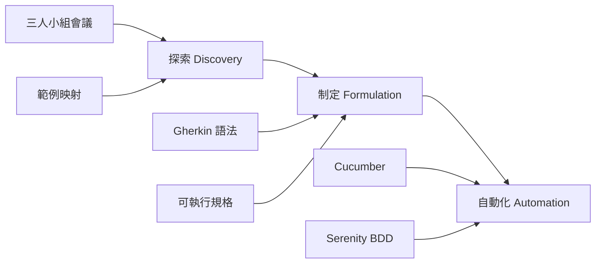

# BDD in Action 中文實戰指南

> **行為驅動開發實戰：從需求探索到自動化測試的完整指南**

---

## 書籍資訊

| 項目 | 內容 |
|------|------|
| **原著** | *BDD in Action, Second Edition* |
| **原作者** | John Ferguson Smart |
| **類型** | 技術實戰書籍（Manning "in Action" 風格） |
| **目標字數** | 30-40 萬字 |
| **語言** | 繁體中文 |

---

## 作者簡介

**John Ferguson Smart** 是 Serenity BDD 框架的創作者與主要開發者，亦是線上培訓平台 Serenity Dojo 的創辦人。他在行為驅動開發領域擁有豐富的實戰經驗，致力於幫助團隊提升軟體品質與協作效率。

---

## 內容亮點

- **BDD 如何正面影響團隊合作**：互動及與利害關係人的協作
- **需求探索與分析**：協助團隊釐清假設並降低風險
- **強化測試效能**：驗收測試、整合測試與單元測試的全面提升
- **自動化報告與動態文件**：提升開發透明度的 Living Documentation
- **適合所有開發團隊**：無需任何 BDD 經驗即可上手
- **多語言範例**：以 Java、JavaScript 與 TypeScript 為主，可輕鬆轉換

---

## 專案結構

```
bdd-in-action/
├── README.md                    # 專案總覽（本文件）
├── manuscript/                  # 書稿內容
│   ├── outline.md              # 詳細章節大綱
│   └── chapters/               # 各章節內容
│       ├── part-01/            # 第一部：第一步
│       ├── part-02/            # 第二部：用 BDD 定義需求
│       └── part-03/            # 第三部：用 BDD 寫程式碼
├── code-examples/              # 完整可運行的程式碼範例
├── diagrams/                   # 技術圖表與架構圖
├── resources/                  # 補充資源與參考文獻
└── planning/                   # 寫作計畫與進度追蹤
```

---

## 章節結構

### Part 1：第一步（Chapter 01-03）

| 章節 | 標題 | 狀態 | 預估字數 |
|------|------|------|----------|
| Ch01 | 建置能帶來改變的軟體 | ✅ 已完成 | 15,200 |
| Ch02 | 初探行為驅動開發 | ✅ 已完成 | 18,500 |
| Ch03 | 行為驅動開發：旋風之旅 | ⏳ 待撰寫 | 22,000 |

### Part 2：我想要什麼？用 BDD 定義需求（Chapter 04-07）

| 章節 | 標題 | 狀態 | 預估字數 |
|------|------|------|----------|
| Ch04 | 推測：從業務目標到優先功能 | ⏳ 待撰寫 | 20,000 |
| Ch05 | 對功能進行描述與優先排序 | ⏳ 待撰寫 | 18,000 |
| Ch06 | 用範例說明功能 | ⏳ 待撰寫 | 22,000 |
| Ch07 | 從範例到可執行規格 | ⏳ 待撰寫 | 25,000 |

### Part 3：要怎麼實作？用 BDD 寫程式碼（Chapter 08-16）

| 章節 | 標題 | 狀態 | 預估字數 |
|------|------|------|----------|
| Ch08 | 從可執行規格到自動化驗收測試 | ⏳ 待撰寫 | 28,000 |
| Ch09 | 撰寫穩固的自動化驗收測試 | ⏳ 待撰寫 | 22,000 |
| Ch10 | 自動化使用者介面層的驗收標準 | ⏳ 待撰寫 | 25,000 |
| Ch11 | UI 層的測試自動化設計模式 | ⏳ 待撰寫 | 22,000 |
| Ch12 | 可擴充的測試自動化與「演員劇本模式」 | ⏳ 待撰寫 | 28,000 |
| Ch13 | 微服務和 API 的 BDD 與可執行規格 | ⏳ 待撰寫 | 25,000 |
| Ch14 | 既有系統的可執行規格（Serenity/JS） | ⏳ 待撰寫 | 22,000 |
| Ch15 | 可攜式測試自動化（Serenity/JS） | ⏳ 待撰寫 | 20,000 |
| Ch16 | 動態文件與釋出版本的證據 | ⏳ 待撰寫 | 18,000 |

**總計**：約 350,000 字

---

## 核心概念

### BDD 三階段流程



### 關鍵術語

| 術語 | 英文 | 說明 |
|------|------|------|
| 行為驅動開發 | BDD | Behavior-Driven Development |
| 可執行規格 | Executable Specification | 可自動執行的需求文件 |
| 動態文件 | Living Documentation | 與程式碼同步的文件 |
| 範例映射 | Example Mapping | 需求探索技術 |
| 三人小組 | Three Amigos | PO + Dev + QA 協作 |
| 演員劇本模式 | Screenplay Pattern | 測試自動化設計模式 |

---

## 技術棧

### 主要工具

- **Cucumber**：BDD 測試框架
- **Serenity BDD**：進階報告與測試管理
- **Serenity/JS**：JavaScript/TypeScript BDD 框架

### 程式語言

- **Java**：主要範例語言
- **JavaScript/TypeScript**：現代前端與 Node.js 範例

### 相關技術

- **Gherkin**：自然語言規格語法
- **Page Object Pattern**：UI 測試設計模式
- **Screenplay Pattern**：可擴充測試自動化模式

---

## 寫作風格

本書採用 **Manning "in Action" 風格**：

1. **專案驅動**：每章以具體案例開場
2. **漸進式學習**：從基礎到進階循序漸進
3. **實體產出**：完整可運行的程式碼與設定檔
4. **詳細註解**：使用 ‹1›, ‹2› 標記關鍵部分
5. **解釋「為何」**：深入討論設計決策
6. **親切語氣**：第二人稱導師式指導

---

## 目標讀者

- **軟體開發者**：想提升測試技能的工程師
- **QA 工程師**：想學習自動化測試的測試人員
- **產品經理**：想了解如何更好地定義需求
- **團隊領導**：想提升團隊協作效率的主管

### 先備知識

- 基本程式設計經驗（任何語言）
- 了解軟體開發流程
- 無需 BDD 經驗

---

## 參考資源

### 官方資源

- [Cucumber 官方文件](https://cucumber.io/docs)
- [Serenity BDD 官方網站](https://serenity-bdd.info/)
- [Serenity/JS 官方文件](https://serenity-js.org/)

### 原書程式碼

- [GitHub: bdd-in-action/second-edition](https://github.com/bdd-in-action/second-edition)

---

## 進度追蹤

| 階段 | 狀態 | 完成度 |
|------|------|--------|
| 專案建立 | ✅ 完成 | 100% |
| 章節大綱 | ✅ 完成 | 100% |
| Part 1 撰寫 | ⏳ 進行中 | 67% (2/3) |
| Part 2 撰寫 | ⏳ 待開始 | 0% |
| Part 3 撰寫 | ⏳ 待開始 | 0% |
| 程式碼範例 | ⏳ 待開始 | 0% |
| 校對修訂 | ⏳ 待開始 | 0% |

### 字數統計

| 部分 | 已完成 | 目標 | 進度 |
|------|--------|------|------|
| Part 1 | 33,700 | 55,000 | 61% |
| Part 2 | 0 | 85,000 | 0% |
| Part 3 | 0 | 210,000 | 0% |
| **總計** | **33,700** | **350,000** | **10%** |

---

## 授權聲明

本專案為學習與研究目的，基於 John Ferguson Smart 的 *BDD in Action, Second Edition* 進行中文實戰內容創作。

---

**最後更新**：2025-11-22
**當前任務**：撰寫 Chapter 03 - 行為驅動開發：旋風之旅
