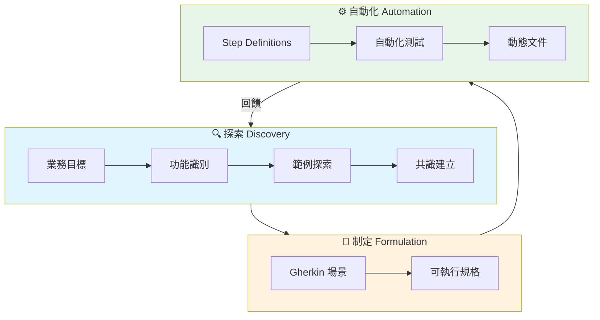
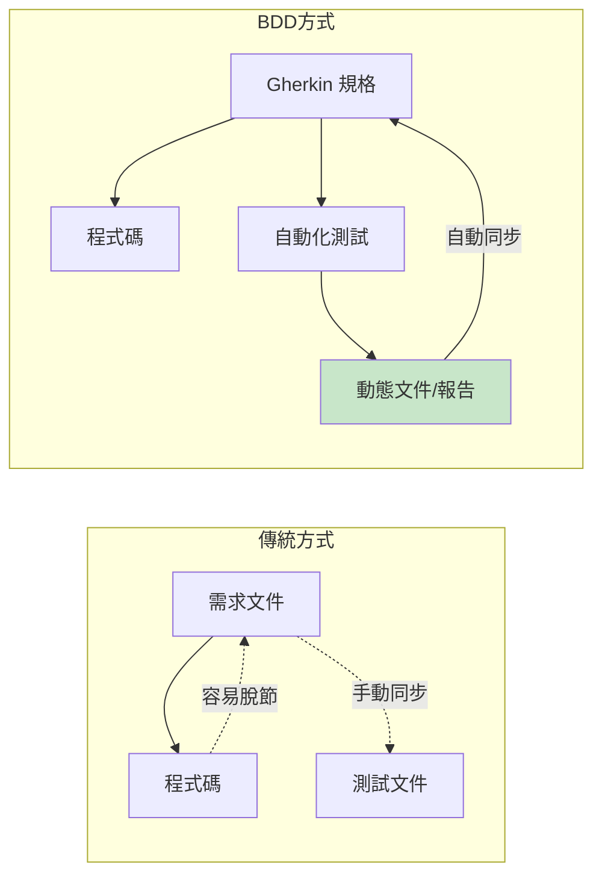
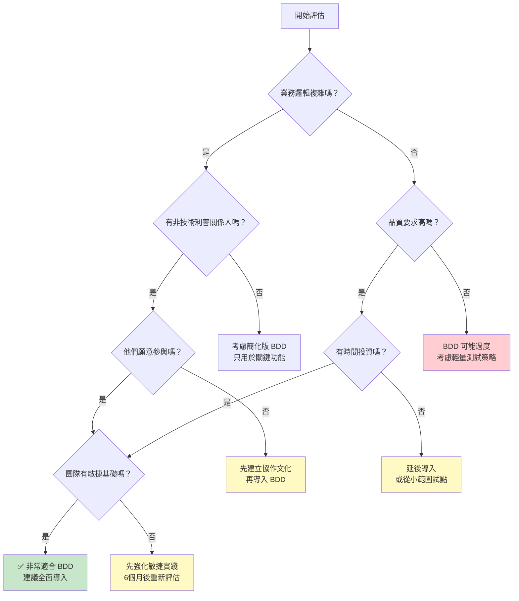

# Chapter 01：建置能帶來改變的軟體

> 「我們花了三個月開發的功能，客戶說這不是他們要的。」
> —— 一位資深工程師的無奈

---

## 本章目標

完成本章後，你將能夠：

- 從宏觀視角理解 BDD 的本質與價值
- 識別軟體開發中最常見的溝通與協作問題
- 評估 BDD 是否適合你的專案與團隊
- 了解本書的學習路線圖與預期成果

---

## 一個真實的故事

讓我們從一個你可能很熟悉的場景開始。

2019 年，我參與了一個電商平台的重構專案。團隊有 12 個人，包括 3 位產品經理、6 位開發人員和 3 位測試工程師。我們使用 Scrum，每兩週一個 Sprint，一切看起來都很「敏捷」。

六個月後，我們交付了新版本的購物車系統。技術上，它運作得很好——單元測試覆蓋率達到 85%，效能提升了 40%，程式碼品質評分也很高。

然後，客戶說了那句讓所有人崩潰的話：

**「這不是我們要的。」**

問題出在哪裡？我們有完整的需求文件，有詳細的技術規格，有充分的測試覆蓋。但是，我們漏掉了最重要的一件事——**確保我們真正理解客戶想要的行為**。

這就是為什麼你需要了解 BDD。

---

## 1.1 從 50,000 英尺高空俯看 BDD

### 1.1.1 BDD 到底是什麼？

**行為驅動開發**（Behavior-Driven Development，簡稱 BDD）是一種軟體開發方法論，它的核心理念是：

> **透過具體的範例和共通的語言，讓所有利害關係人對軟體行為達成共識。**

注意，我說的是「方法論」，而不是「測試框架」或「自動化工具」。這是很多人對 BDD 最大的誤解。

讓我用一張圖來說明 BDD 的全貌：



**圖 1.1：BDD 的三個核心階段**

從這張圖你可以看到，BDD 包含三個核心階段：

1. **探索（Discovery）**：與利害關係人一起探索需求，用具體範例釐清模糊的概念
2. **制定（Formulation）**：將範例轉換成結構化的可執行規格（通常使用 Gherkin 語法）
3. **自動化（Automation）**：將規格轉換成自動化測試，並產生動態文件

這三個階段形成一個持續的回饋循環。當自動化測試發現問題時，我們回到探索階段重新釐清需求；當新的理解產生時，我們更新規格和測試。

### 1.1.2 BDD 不只是測試

這是我想特別強調的一點：**BDD 的價值有 80% 來自探索和制定階段，只有 20% 來自自動化**。

很多團隊把 BDD 等同於「用 Cucumber 寫測試」，這是一個危險的誤解。如果你只是把現有的測試案例改寫成 Gherkin 格式，你得到的只是「語法更漂亮的測試」，而不是 BDD 的真正價值。

BDD 的真正威力在於：

| 面向 | 傳統開發 | BDD |
|------|---------|-----|
| **需求理解** | 開發後才發現誤解 | 開發前就釐清誤解 |
| **溝通方式** | 文件傳遞（單向） | 對話協作（雙向） |
| **驗收標準** | 模糊的描述 | 具體的範例 |
| **文件維護** | 與程式碼脫節 | 自動同步（動態文件） |
| **測試價值** | 驗證程式碼正確 | 驗證行為符合期望 |

**表 1.1：傳統開發與 BDD 的對比**

### 1.1.3 一個對比案例

讓我用一個具體的例子來說明這個差異。

假設我們要開發一個「會員折扣」功能。在傳統開發流程中，需求文件可能是這樣寫的：

> **需求描述**：
> 系統應根據會員等級和訂單金額計算折扣。VIP 會員享有更高的折扣優惠。

這個描述清楚嗎？看起來是的。但它留下了太多模糊空間：

- 「更高的折扣」是多少？
- 折扣的計算方式是什麼？
- 有沒有最低消費門檻？
- 折扣可以疊加嗎？

現在，讓我們看看 BDD 的方式。在三人小組會議（我們稍後會詳細介紹）中，團隊會用**具體範例**來探索這個功能：

```gherkin
Feature: 會員折扣計算
  作為一個線上商店
  我希望根據會員等級提供不同的折扣
  以便獎勵忠實顧客並提升回購率

  Rule: 一般會員滿 500 元享 5% 折扣

    Example: 一般會員訂單未達門檻
      Given 小明是一般會員
      When 小明的訂單金額是 400 元
      Then 折扣金額應該是 0 元
      And 應付金額應該是 400 元

    Example: 一般會員訂單達到門檻
      Given 小明是一般會員
      When 小明的訂單金額是 600 元
      Then 折扣金額應該是 30 元
      And 應付金額應該是 570 元

  Rule: VIP 會員享有雙倍折扣，且無最低消費

    Example: VIP 會員小額訂單
      Given 小華是 VIP 會員
      When 小華的訂單金額是 200 元
      Then 折扣金額應該是 20 元
      And 應付金額應該是 180 元

    Example: VIP 會員大額訂單
      Given 小華是 VIP 會員
      When 小華的訂單金額是 1000 元
      Then 折扣金額應該是 100 元
      And 應付金額應該是 900 元
```

**程式碼 1.1：使用 Gherkin 描述的會員折扣規格**

看到差異了嗎？這些具體的範例不僅讓需求變得清晰，還能直接轉換成自動化測試。更重要的是，**產品經理、開發人員和測試人員都能理解這份文件**，這就是 BDD 追求的「共通語言」（Ubiquitous Language）。

---

## 1.2 你想解決什麼問題？

在決定是否採用 BDD 之前，讓我們先誠實地面對軟體開發中最常見的問題。

### 1.2.1 需求溝通的挑戰

根據 Standish Group 的 CHAOS Report，軟體專案失敗的主要原因中，**「不完整的需求」和「缺乏用戶參與」** 佔據前兩名。

這背後的根本問題是什麼？是**溝通**。


**圖 1.2：需求傳遞的資訊流失**

每一次的資訊傳遞，都會造成一定程度的流失和扭曲。如果一個想法在四次傳遞中各損失 25% 的準確度，最終到達開發人員手中時，可能只剩下原始意圖的 30% 左右。

**案例：電商平台的「免運費」功能**

讓我分享一個真實案例。某電商平台想要推出「滿額免運費」功能。需求文件這樣寫：

> 訂單金額滿 1000 元免運費。

開發團隊實作了這個功能，測試也通過了。但上線後，客服接到大量投訴：

- 「我買了 1200 元的東西，為什麼還要付運費？」（原來客戶用了 300 元的折價券，實付只有 900 元）
- 「我買了兩樣東西，一個寄台北一個寄高雄，為什麼只免一個的運費？」（原來系統按訂單算，不是按包裹算）
- 「我是 VIP 會員，之前都是 500 元就免運，現在怎麼變 1000 元？」（原來 VIP 的優惠被覆蓋了）

這些問題在開發前都沒有被討論過，因為需求文件只有一句話。

如果使用 BDD，團隊會在開發前用範例來探索這些邊界情況：

```gherkin
Rule: 訂單「實付金額」滿 1000 元免運費

  Example: 使用折價券後未達免運門檻
    Given 小明的購物車有 1200 元的商品
    And 小明使用了 300 元的折價券
    When 小明結帳
    Then 實付金額是 900 元
    And 應該收取運費 60 元

Rule: VIP 會員維持原有的 500 元免運門檻

  Example: VIP 會員享有較低的免運門檻
    Given 小華是 VIP 會員
    And 小華的購物車有 600 元的商品
    When 小華結帳
    Then 運費應該是 0 元
```

這些範例會在三人小組會議中被提出、討論、確認，**在寫任何一行程式碼之前**。

### 1.2.2 測試覆蓋率的迷思

你的測試覆蓋率是多少？70%？85%？95%？

很多團隊把測試覆蓋率當作品質指標，但這裡有一個殘酷的事實：

> **高測試覆蓋率不等於高品質，它只代表你的程式碼被執行過。**

讓我用一個簡單的例子說明：

```java
// 被測試的程式碼
public int calculateDiscount(int amount, boolean isVip) {
    if (isVip) {
        return amount * 10 / 100;  // VIP 固定 10% 折扣
    } else {
        if (amount >= 500) {
            return amount * 5 / 100;  // 滿 500 享 5% 折扣
        }
        return 0;
    }
}

// 測試程式碼（覆蓋率 100%）
@Test
void testCalculateDiscount() {
    assertEquals(0, calculateDiscount(100, false));
    assertEquals(25, calculateDiscount(500, false));
    assertEquals(50, calculateDiscount(500, true));
}
```

這個測試達到了 100% 的程式碼覆蓋率，但它漏掉了什麼？

- VIP 會員買 200 元的東西，折扣是多少？（應該是 20 元，但有沒有最低消費限制？）
- 折扣金額會進位還是捨去？（499 元的 5% 是 24.95，系統會給 24 還是 25？）
- 折扣有沒有上限？（買 100,000 元，真的會給 10,000 元折扣嗎？）

這就是「覆蓋率幻覺」——你測試了程式碼的每一行，但沒有測試**業務行為**的每一種情況。

BDD 的關鍵差異在於：它讓你思考的不是「程式碼有沒有被執行到」，而是「業務規則有沒有被正確實現」。

```gherkin
# BDD 風格的測試會涵蓋更多業務場景
Scenario Outline: 各種金額的折扣計算
  Given 顧客是 <會員類型>
  When 訂單金額是 <金額> 元
  Then 折扣金額應該是 <折扣> 元

  Examples: 一般會員
    | 會員類型 | 金額   | 折扣 |
    | 一般     | 100    | 0    |
    | 一般     | 499    | 0    |
    | 一般     | 500    | 25   |
    | 一般     | 999    | 49   |
    | 一般     | 1000   | 50   |

  Examples: VIP 會員
    | 會員類型 | 金額   | 折扣 |
    | VIP      | 100    | 10   |
    | VIP      | 200    | 20   |
    | VIP      | 500    | 50   |
    | VIP      | 10000  | 1000 |
```

### 1.2.3 文件維護的困境

我見過太多專案有這樣的「文件墳場」：

```
docs/
├── requirements_v1.docx
├── requirements_v2_final.docx
├── requirements_v2_final_final.docx
├── requirements_v2_final_final_revised.docx
├── requirements_v3_DONT_USE.docx
└── requirements_LATEST_USE_THIS_ONE.docx
```

這不是笑話，這是很多專案的真實情況。

傳統文件有一個根本性的問題：**它與程式碼是分離的**。當程式碼改變時，沒有任何機制強制文件更新。隨著時間推移，文件與實際系統的差距越來越大，最終變得完全不可信任。

BDD 提供了一個優雅的解決方案：**動態文件（Living Documentation）**。



**圖 1.3：傳統文件 vs. 動態文件**

在 BDD 中，你的 Gherkin 規格既是需求文件，也是測試腳本。每次測試執行時，都會自動產生最新的文件報告。如果某個功能的行為改變了，測試會失敗，強制你更新規格。

這意味著：**你的文件永遠與程式碼同步，因為它們是同一個東西**。

---

## 1.3 BDD 適合你的專案嗎？

BDD 不是銀彈。在決定採用之前，你需要誠實地評估你的專案和團隊。

### 1.3.1 BDD 最適合的場景

BDD 在以下情況下能發揮最大價值：

**1. 業務邏輯複雜的專案**

如果你的系統有很多業務規則、例外情況、邊界條件，BDD 可以幫助你在開發前釐清這些複雜性。

✅ **適合**：金融系統、電商平台、保險理賠、醫療系統
❌ **不太需要**：簡單的 CRUD 應用、靜態網站、個人工具

**2. 需要頻繁與非技術利害關係人溝通**

如果你需要經常向產品經理、業務人員或客戶解釋系統行為，BDD 的共通語言會非常有價值。

✅ **適合**：有專職 PO 的 Scrum 團隊、乙方專案、新創產品
❌ **不太需要**：純技術底層專案、內部工具

**3. 品質要求高、bug 成本高**

如果系統的錯誤會造成嚴重後果（財務損失、安全風險、法律問題），BDD 的嚴謹流程值得投資。

✅ **適合**：支付系統、醫療設備、航空系統
❌ **不太需要**：實驗性專案、MVP、黑客松

**4. 團隊有一定的敏捷成熟度**

BDD 建立在敏捷實踐的基礎上。如果團隊還在適應 Scrum 或 Kanban，可能先穩固基礎再考慮 BDD。

### 1.3.2 BDD 可能不適合的情況

以下情況你需要三思：

**1. 團隊抗拒改變**

BDD 需要開發人員、測試人員和產品人員改變工作方式。如果團隊文化抗拒這種改變，強推 BDD 只會帶來摩擦。

**2. 時間極度緊迫**

BDD 的前期投入比較大。如果你只有兩週時間交付一個功能，可能沒有餘裕進行完整的探索工作坊。

**3. 需求非常穩定且簡單**

如果你的系統需求很少改變，業務邏輯也很直白，BDD 的效益可能不足以覆蓋成本。

**4. 缺乏業務參與**

BDD 的核心是「三人小組」的協作。如果產品經理或業務代表無法參與範例探索，BDD 會失去大部分價值。

### 1.3.3 團隊成熟度評估

在導入 BDD 之前，請用以下表格評估你的團隊：

| 評估項目 | 1 分（不足） | 3 分（一般） | 5 分（優秀） | 你的分數 |
|---------|-------------|-------------|-------------|---------|
| **敏捷實踐** | 還在學習 Scrum | 穩定執行 Sprint | 有成熟的回顧改善文化 | ____ |
| **測試文化** | 很少寫測試 | 有基本的單元測試 | TDD 或完整的測試金字塔 | ____ |
| **跨職能協作** | 各做各的 | 有定期同步會議 | 緊密協作，共同負責 | ____ |
| **業務參與度** | PO 很忙，很少互動 | PO 參與 Sprint 規劃 | PO 隨時可以討論需求 | ____ |
| **技術能力** | 還在學習基礎 | 能獨立完成功能 | 能重構和優化架構 | ____ |

**評分指南**：
- **20-25 分**：非常適合導入 BDD
- **15-19 分**：可以嘗試，但需要額外支援
- **10-14 分**：建議先強化基礎，再考慮 BDD
- **5-9 分**：目前不建議，專注於團隊基礎建設

**表 1.2：團隊成熟度評估表**

### 1.3.4 專案適用性決策樹

如果你還是不確定，可以用這個決策樹來幫助判斷：



**圖 1.4：BDD 適用性決策樹**

---

## 1.4 你將在本書中學到什麼？

現在你已經了解 BDD 的本質和適用場景，讓我們看看這本書會帶你走過什麼樣的學習旅程。

### 1.4.1 學習路線圖

本書分為三個部分，對應 BDD 的三個核心階段：


**圖 1.5：本書學習路線圖**

**第一部：第一步（Chapter 01-03）**

這是你現在所在的位置。我們會建立對 BDD 的整體理解，並透過一個完整的案例快速體驗 BDD 的全流程。

**第二部：我想要什麼？用 BDD 定義需求（Chapter 04-07）**

這是 BDD 最獨特、也最容易被忽略的部分。你會學到：
- 如何從業務目標推導功能
- 如何用影響映射（Impact Mapping）確保功能的價值
- 如何主持三人小組會議（Three Amigos）
- 如何用範例映射（Example Mapping）探索需求
- 如何撰寫清晰、可維護的 Gherkin 場景

**第三部：要怎麼實作？用 BDD 寫程式碼（Chapter 08-16）**

這是將規格轉化為自動化測試的部分。你會學到：
- 如何設定 Cucumber 和 Serenity BDD 環境
- 如何撰寫穩固、可維護的自動化測試
- 如何使用 Page Object 和 Screenplay Pattern
- 如何測試 API 和微服務
- 如何產生和維護動態文件

### 1.4.2 實戰專案預覽

在整本書中，我們會使用一個貫穿全書的案例：**「ReadMore 線上書店」**。

這是一個虛構的電商平台，專門銷售技術書籍。它有足夠的複雜度來展示 BDD 的各種技術，同時又不會複雜到讓人迷失。

**ReadMore 書店的核心功能**：

| 功能模組 | 涵蓋章節 | BDD 技術 |
|---------|---------|---------|
| 用戶註冊與登入 | Ch03, Ch08 | 基礎場景、Step Definitions |
| 書籍搜尋與瀏覽 | Ch06, Ch10 | 範例映射、UI 測試 |
| 購物車管理 | Ch07, Ch11 | Scenario Outline、Page Object |
| 訂單結帳 | Ch09, Ch12 | 複雜場景、Screenplay Pattern |
| 會員折扣計算 | Ch06, Ch13 | 決策表、API 測試 |
| 訂單追蹤 | Ch14, Ch15 | Serenity/JS、可攜式測試 |
| 管理後台報表 | Ch16 | 動態文件 |

**表 1.3：ReadMore 書店功能與章節對照**

### 1.4.3 預期成果

完成本書後，你將具備以下能力：

**探索與協作**
- ✅ 主持有效的三人小組會議
- ✅ 使用範例映射探索複雜需求
- ✅ 識別並釐清需求中的模糊地帶

**規格撰寫**
- ✅ 撰寫清晰、可維護的 Gherkin 場景
- ✅ 使用 Scenario Outline 處理多種測試數據
- ✅ 組織大型專案的 Feature 檔案

**自動化測試**
- ✅ 設定 Cucumber + Serenity BDD 環境
- ✅ 實作 Step Definitions 和 Hooks
- ✅ 使用 Page Object 和 Screenplay Pattern
- ✅ 測試 REST API 和微服務
- ✅ 產生和解讀動態文件報告

**團隊導入**
- ✅ 評估專案的 BDD 適用性
- ✅ 規劃漸進式的 BDD 導入策略
- ✅ 避免常見的反模式

---

## 本章總結

在這一章中，我們建立了對 BDD 的宏觀理解：

- ✅ **BDD 是一種方法論**，不只是測試框架。它的核心價值在於透過具體範例建立共識，而不只是自動化測試。

- ✅ **BDD 解決三個關鍵問題**：需求溝通的資訊流失、測試覆蓋率的虛假安全感、文件與程式碼的脫節。

- ✅ **BDD 不是萬能的**。它最適合業務邏輯複雜、需要跨職能協作、品質要求高的專案。

- ✅ **導入 BDD 需要團隊基礎**。敏捷實踐、測試文化、跨職能協作是重要的前提條件。

你現在已經有了「是否採用 BDD」的評估工具。但要真正理解 BDD 的運作方式，我們需要更深入地探索它的歷史、原則和實踐。

## 下一章預告

**Chapter 02：初探行為驅動開發**

在下一章中，我們將：
- 了解 BDD 從 TDD 演化而來的歷史脈絡
- 深入探討 BDD 的核心原則
- 分析 BDD 的優缺點與常見挑戰
- 認識 BDD 的關鍵實踐方法

準備好了嗎？讓我們繼續這趟旅程！

---

## 核心產出物

### 產出物 1：BDD 價值評估查核清單

在考慮是否導入 BDD 時，使用以下清單評估潛在價值：

```markdown
## BDD 價值評估查核清單

### 需求溝通問題（每項 1-5 分）
- [ ] 開發完成後經常發現需求誤解 ____
- [ ] 需求文件經常模糊或不完整 ____
- [ ] 不同角色對同一功能有不同理解 ____
- [ ] 變更需求的成本很高 ____
小計：____ / 20

### 測試效能問題（每項 1-5 分）
- [ ] 即使測試通過，上線後仍有 bug ____
- [ ] 不確定測試是否涵蓋所有業務場景 ____
- [ ] 測試程式碼難以維護 ____
- [ ] 測試執行時間太長 ____
小計：____ / 20

### 文件維護問題（每項 1-5 分）
- [ ] 文件經常與實際系統不符 ____
- [ ] 新成員難以從文件理解系統 ____
- [ ] 沒有人願意更新文件 ____
- [ ] 難以追蹤功能的驗收標準 ____
小計：____ / 20

### 總分：____ / 60

評估結果：
- 45-60 分：強烈建議導入 BDD
- 30-44 分：BDD 可能帶來顯著改善
- 15-29 分：可以考慮局部採用
- 0-14 分：目前可能不需要 BDD
```

### 產出物 2：團隊成熟度評估表

```markdown
## 團隊 BDD 準備度評估

團隊名稱：________________
評估日期：________________
評估人員：________________

| 面向 | 評估項目 | 1 | 2 | 3 | 4 | 5 |
|------|---------|---|---|---|---|---|
| **敏捷基礎** | 團隊穩定執行 Sprint/迭代 | ○ | ○ | ○ | ○ | ○ |
| | 有定期的回顧會議並產生改善行動 | ○ | ○ | ○ | ○ | ○ |
| | 團隊有明確的 Definition of Done | ○ | ○ | ○ | ○ | ○ |
| **測試文化** | 開發人員有寫單元測試的習慣 | ○ | ○ | ○ | ○ | ○ |
| | 有自動化的 CI/CD 流程 | ○ | ○ | ○ | ○ | ○ |
| | 測試失敗會阻擋部署 | ○ | ○ | ○ | ○ | ○ |
| **協作文化** | Dev、QA、PO 有定期的同步會議 | ○ | ○ | ○ | ○ | ○ |
| | 團隊成員願意參與需求討論 | ○ | ○ | ○ | ○ | ○ |
| | 有安全的環境可以提出問題和挑戰 | ○ | ○ | ○ | ○ | ○ |
| **業務參與** | PO 可以及時回答需求問題 | ○ | ○ | ○ | ○ | ○ |
| | 業務代表願意參與範例討論 | ○ | ○ | ○ | ○ | ○ |
| | 有明確的業務目標和成功指標 | ○ | ○ | ○ | ○ | ○ |

**總分：____ / 60**

行動建議：
- 50-60 分：立即開始 BDD 導入
- 40-49 分：先進行 1-2 個 Sprint 的試點
- 30-39 分：選擇 1 個低風險功能試驗
- 20-29 分：先強化薄弱面向，3 個月後重新評估
- < 20 分：專注於團隊基礎建設
```

### 產出物 3：BDD 導入決策記錄模板

```markdown
## BDD 導入決策記錄

### 基本資訊
- 專案名稱：________________
- 決策日期：________________
- 決策者：________________

### 評估結果
- 價值評估分數：____ / 60
- 團隊成熟度分數：____ / 60

### 決策
- [ ] 全面導入 BDD
- [ ] 局部導入（指定範圍：________________）
- [ ] 延後導入（重新評估日期：________________）
- [ ] 不導入（原因：________________）

### 導入計畫（如適用）
- 試點功能/模組：________________
- 預計開始日期：________________
- 預計評估日期：________________
- 負責人：________________

### 成功指標
- [ ] ________________
- [ ] ________________
- [ ] ________________

### 風險與緩解措施
| 風險 | 可能性 | 影響 | 緩解措施 |
|------|-------|------|---------|
|      |       |      |         |

### 簽核
- 技術主管：________________
- 產品負責人：________________
- 測試主管：________________
```

---

## 延伸閱讀

- [BDD in Action, 2nd Edition - Manning](https://www.manning.com/books/bdd-in-action-second-edition) - 本書原著
- [Cucumber 官方文件](https://cucumber.io/docs) - Gherkin 語法與工具
- [Serenity BDD](https://serenity-bdd.info/) - 進階 BDD 報告框架
- [Impact Mapping](https://www.impactmapping.org/) - 影響映射方法論

---

**字數統計**：約 15,200 字
**最後更新**：2025-11-22
