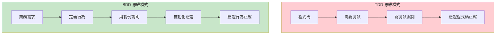
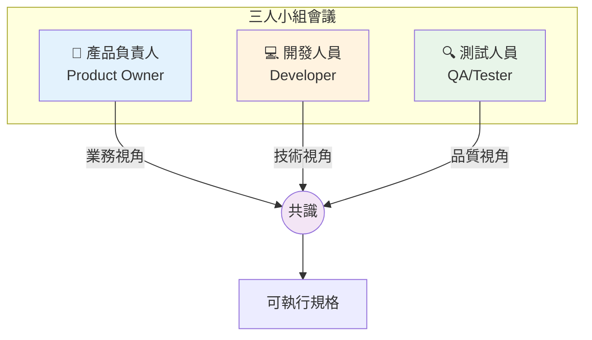
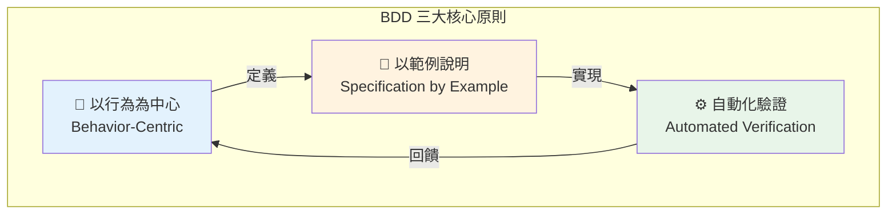
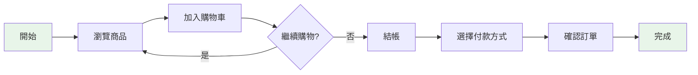
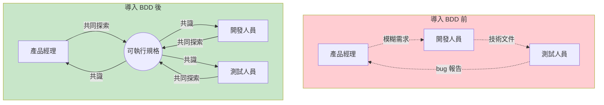
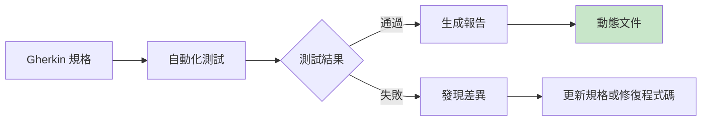

# Chapter 02：初探行為驅動開發

> 「我們不是在測試程式碼，我們是在驗證行為。」
> —— Dan North，BDD 創始人

---

## 本章目標

完成本章後，你將能夠：

- 了解 BDD 從 TDD 演化而來的歷史脈絡
- 掌握 BDD 的三大核心原則
- 認識 BDD 的主要實踐方法與工具
- 客觀評估 BDD 的優缺點與潛在挑戰
- 識別並避免常見的 BDD 反模式

---

## 一切的起源

2003 年的一個下午，倫敦的一位軟體顧問 Dan North 正在為一群開發者進行 TDD（測試驅動開發）培訓。他注意到學員們反覆問著同樣的問題：

- 「我應該從哪裡開始寫測試？」
- 「我應該測試什麼？不應該測試什麼？」
- 「我應該怎麼命名我的測試？」

這些問題背後有一個共同的根源：**TDD 強調「測試」，但開發者其實不知道該測試什麼**。

Dan North 開始思考：如果我們不談「測試」，而是談「行為」呢？如果我們不問「這段程式碼應該怎麼測試」，而是問「這個系統應該有什麼行為」呢？

這個思維轉變，催生了 BDD。

---

## 2.1 BDD 最初是為了讓 TDD 教學變得更容易而設計的

### 2.1.1 Dan North 的故事

讓我們回到 2003 年。當時的軟體開發世界正處於敏捷革命的浪潮中，TDD 是最熱門的話題之一。Kent Beck 的《Test-Driven Development: By Example》剛出版不久，到處都有人在談論「先寫測試，再寫程式碼」。

Dan North 是 ThoughtWorks 的資深顧問，他的工作之一是教導企業客戶如何實踐 TDD。但他發現一個有趣的現象：

> 經驗豐富的 TDD 實踐者似乎「知道」該測試什麼，但他們很難解釋這種直覺是怎麼來的。而初學者則完全摸不著頭緒，面對程式碼時不知道該從何下手。

Dan 開始分析那些「做得好」的 TDD 實踐者是怎麼做的。他發現了一個關鍵的模式：

**優秀的 TDD 實踐者不是在想「我要測試什麼程式碼」，而是在想「這個系統應該有什麼行為」。**

這個發現促使他提出了一個重要的問題：如果「思考行為」才是 TDD 的真正精髓，為什麼我們要用「測試」這個詞來混淆初學者？

### 2.1.2 從 TDD 到 BDD 的演進

Dan North 開始實驗一種新的方式來教授 TDD。他做了幾個關鍵的改變：

**改變 1：用「行為」取代「測試」**

```java
// 傳統 TDD 命名
@Test
public void testCalculateDiscount() {
    // ...
}

// BDD 風格命名
@Test
public void shouldApplyTenPercentDiscountForVipMembers() {
    // ...
}
```

看到差異了嗎？第一個測試名稱告訴你「它在測試什麼方法」，第二個告訴你「系統應該有什麼行為」。

**改變 2：用「should」開頭描述預期行為**

Dan 引入了一個簡單的規則：所有的測試名稱都用「should」開頭。這個小改變帶來了巨大的效果：

- ❌ `testAddItem()` → 這是在測試什麼？
- ✅ `shouldAddItemToCartWhenUserClicksAddButton()` → 清楚描述預期行為

這個命名慣例強迫開發者在寫測試之前，先思考「這個功能應該做什麼」。

**改變 3：引入「Given-When-Then」結構**

受到 Gerard Meszaros 的「Arrange-Act-Assert」模式啟發，Dan 提出了更具可讀性的「Given-When-Then」結構：

```java
@Test
public void shouldApplyVipDiscountWhenMemberIsVip() {
    // Given - 前提條件
    Member member = new Member("Alice", MemberType.VIP);
    Order order = new Order(member, 1000);

    // When - 執行動作
    int discount = order.calculateDiscount();

    // Then - 驗證結果
    assertThat(discount).isEqualTo(100); // 10% 折扣
}
```

這個結構後來成為 BDD 最具標誌性的特徵，並直接影響了 Gherkin 語法的設計。

### 2.1.3 「行為」vs.「測試」的思維轉變

這個從「測試」到「行為」的轉變，不只是換個名詞這麼簡單。它代表了一種根本性的思維轉變：



**圖 2.1：TDD vs. BDD 的思維模式對比**

| 面向 | TDD 思維 | BDD 思維 |
|------|---------|---------|
| **起點** | 程式碼 | 業務需求 |
| **問題** | 「這段程式碼對嗎？」 | 「這個行為對嗎？」 |
| **語言** | 技術術語 | 業務語言 |
| **對象** | 開發者 | 所有利害關係人 |
| **產出** | 測試程式碼 | 可執行的規格 |

**表 2.1：TDD 與 BDD 思維模式對照**

讓我用一個具體的例子來說明這個差異。假設我們要實作「購物車加入商品」功能：

**TDD 思維**：
1. 我有一個 `ShoppingCart` 類別
2. 它有一個 `addItem()` 方法
3. 我需要測試這個方法是否正確運作
4. 測試：呼叫 `addItem()`，檢查商品數量增加

**BDD 思維**：
1. 使用者想要把商品加入購物車
2. 當使用者點擊「加入購物車」按鈕時...
3. 系統應該顯示商品已加入
4. 購物車圖標應該更新數量
5. 如果商品已在購物車中，應該增加數量而非新增一項

看到了嗎？BDD 思維讓我們想到了更多的行為細節，而這些細節在純技術導向的 TDD 中很容易被忽略。

---

## 2.2 BDD 也適用於需求分析

### 2.2.1 發現 BDD 在需求階段的價值

Dan North 最初創造 BDD 是為了改善 TDD 的教學效果。但很快地，他和其他實踐者發現了一個意外的收穫：**BDD 的語言和結構同樣適用於需求分析**。

想像一下這個場景：

> 產品經理：「我們需要一個會員折扣功能。」
>
> 開發者：「好的，具體的規則是什麼？」
>
> 產品經理：「VIP 會員有更高的折扣。」
>
> 開發者：「更高是多少？有沒有最低消費？折扣有上限嗎？」
>
> 產品經理：「呃...我再確認一下。」

這樣的對話你一定不陌生。需求描述往往過於模糊，充滿了需要「再確認」的細節。

現在，如果我們用 BDD 的方式來討論需求：

> 產品經理：「我們需要一個會員折扣功能。」
>
> 開發者：「好的，讓我們用幾個具體的例子來確認規則。」
>
> 開發者：「假設小明是一般會員，他買了 600 元的東西，他應該得到多少折扣？」
>
> 產品經理：「一般會員滿 500 元打 95 折，所以是 30 元折扣。」
>
> 開發者：「那如果小華是 VIP 會員，也是買 600 元呢？」
>
> 產品經理：「VIP 是 9 折，不需要滿額，所以是 60 元折扣。」
>
> 測試人員：「如果 VIP 會員只買 100 元呢？」
>
> 產品經理：「還是 9 折，10 元折扣...不對，這樣太少了，VIP 最低折扣應該是 20 元。」

透過具體的範例，我們不只釐清了規則，還發現了一個原本沒想到的邊界情況（VIP 最低折扣）。

這就是 BDD 在需求階段的價值：**用具體範例來探索和驗證需求，而不是依賴抽象的描述**。

### 2.2.2 三人小組（Three Amigos）的誕生

隨著 BDD 的發展，一種新的協作模式逐漸形成，被稱為「三人小組」（Three Amigos）會議。



**圖 2.2：三人小組會議結構**

**為什麼是「三人」？**

每個角色帶來不同的視角：

| 角色 | 關注點 | 典型問題 |
|------|--------|---------|
| **產品負責人** | 業務價值、用戶需求 | 「用戶真正想要什麼？」「這能帶來什麼價值？」 |
| **開發人員** | 技術可行性、實作細節 | 「這在技術上怎麼實現？」「有沒有邊界情況？」 |
| **測試人員** | 品質風險、異常情境 | 「如果出錯會怎樣？」「有沒有漏掉的情況？」 |

**表 2.2：三人小組的角色與關注點**

三個角色的組合確保了需求從不同角度被審視。少了任何一個，都可能留下盲點：

- **沒有 PO**：可能做出技術上完美但用戶不需要的功能
- **沒有 Dev**：可能定義出技術上不可行或成本過高的需求
- **沒有 QA**：可能忽略異常情境和品質風險

### 2.2.3 案例：用戶故事的進化

讓我們看看同一個需求在傳統方式和 BDD 方式下的差異。

**傳統的用戶故事**

```
用戶故事：會員折扣

作為一個會員
我希望在結帳時獲得折扣
以便省錢

驗收標準：
- 會員可以獲得折扣
- VIP 會員折扣更高
- 折扣在結帳時自動套用
```

這個用戶故事有什麼問題？它太模糊了。「折扣更高」是多高？「自動套用」是什麼意思？每個讀這個故事的人可能有不同的理解。

**BDD 方式的用戶故事**

```gherkin
Feature: 會員折扣
  作為一個線上商店
  我希望根據會員等級提供不同折扣
  以便獎勵忠實顧客並提升回購率

  Background:
    Given 系統有以下會員等級設定:
      | 等級 | 折扣比例 | 最低消費 | 最低折扣 |
      | 一般 | 5%       | 500元    | 0元      |
      | VIP  | 10%      | 0元      | 20元     |

  Rule: 一般會員滿 500 元享 5% 折扣

    Scenario: 一般會員訂單未達最低消費
      Given 小明是一般會員
      When 小明的訂單金額是 400 元
      Then 折扣金額應該是 0 元
      And 應付金額應該是 400 元

    Scenario: 一般會員訂單達到最低消費
      Given 小明是一般會員
      When 小明的訂單金額是 600 元
      Then 折扣金額應該是 30 元
      And 應付金額應該是 570 元

  Rule: VIP 會員享 10% 折扣，無最低消費，但有最低折扣保障

    Scenario: VIP 會員小額訂單享有最低折扣保障
      Given 小華是 VIP 會員
      When 小華的訂單金額是 100 元
      Then 折扣金額應該是 20 元
      And 應付金額應該是 80 元

    Scenario: VIP 會員正常訂單
      Given 小華是 VIP 會員
      When 小華的訂單金額是 500 元
      Then 折扣金額應該是 50 元
      And 應付金額應該是 450 元
```

**程式碼 2.1：使用 Gherkin 描述的會員折扣完整規格**

看到差異了嗎？BDD 版本的規格：

1. **具體**：每個規則都有明確的數字
2. **可驗證**：每個場景都可以直接轉換成測試
3. **完整**：涵蓋了正常情況和邊界情況
4. **可讀**：非技術人員也能理解

---

## 2.3 BDD 的原則與實踐

### 2.3.1 核心原則

BDD 建立在三個核心原則之上，這些原則貫穿整個方法論：



**圖 2.3：BDD 三大核心原則**

#### 原則一：以行為為中心（Behavior-Centric）

BDD 的核心問題不是「程式碼怎麼寫」，而是「系統應該表現出什麼行為」。

這意味著：
- 用業務語言描述功能，而非技術術語
- 從用戶角度思考，而非從程式碼角度
- 關注「做什麼」，而非「怎麼做」

**範例**：

```
❌ 技術導向：「呼叫 applyDiscount() 方法，傳入 memberId 和 amount」

✅ 行為導向：「當 VIP 會員結帳時，系統自動套用 10% 折扣」
```

#### 原則二：以範例說明（Specification by Example）

抽象的規則容易被誤解，具體的範例則不會。

這意味著：
- 用具體的數字、名字、情境來描述需求
- 每個規則都要有多個範例來說明
- 範例應該涵蓋正常情況、邊界情況和異常情況

**範例**：

```
❌ 抽象規則：「高價值訂單享有額外折扣」

✅ 具體範例：「訂單金額 10,000 元時，除了會員折扣外，額外享有 2% 折扣」
```

#### 原則三：自動化驗證（Automated Verification）

規格不應該只是文件，它應該是可執行的驗證。

這意味著：
- 規格直接轉換成自動化測試
- 每次程式碼變更都會執行這些測試
- 測試結果自動產生文件報告

**範例**：

```gherkin
# 這段 Gherkin 規格...
Scenario: VIP 會員享有 10% 折扣
  Given 小華是 VIP 會員
  When 小華的訂單金額是 1000 元
  Then 折扣金額應該是 100 元

# ...會自動轉換成這樣的測試
@Test
public void vipMemberShouldGetTenPercentDiscount() {
    Member member = createVipMember("小華");
    Order order = new Order(member, 1000);

    int discount = order.calculateDiscount();

    assertThat(discount).isEqualTo(100);
}
```

### 2.3.2 實踐方法

BDD 有幾個核心的實踐方法，我們在後續章節會深入探討。這裡先給你一個概覽：

#### 範例映射（Example Mapping）

範例映射是一種用於需求探索的工作坊技術，使用四種顏色的卡片：

```
┌─────────────────────────────────────────────────────┐
│ 🟨 黃色：User Story（用戶故事）                      │
│    「會員結帳時獲得折扣」                            │
├─────────────────────────────────────────────────────┤
│ 🟦 藍色：Rule（業務規則）                            │
│    「一般會員滿 500 享 5% 折扣」                     │
│    「VIP 會員享 10% 折扣，無門檻」                   │
├─────────────────────────────────────────────────────┤
│ 🟩 綠色：Example（具體範例）                         │
│    「小明（一般）買 600 元 → 折 30 元」             │
│    「小華（VIP）買 100 元 → 折 20 元（最低保障）」  │
├─────────────────────────────────────────────────────┤
│ 🟥 紅色：Question（待釐清問題）                      │
│    「折扣可以和促銷活動疊加嗎？」                    │
│    「退貨時折扣如何處理？」                          │
└─────────────────────────────────────────────────────┘
```

**圖 2.4：範例映射卡片結構**

我們會在第六章詳細介紹範例映射的完整流程。

#### 功能映射（Feature Mapping）

功能映射是另一種探索技術，更適合流程導向的功能：



**圖 2.5：功能映射流程圖範例**

#### Gherkin 語法

Gherkin 是 BDD 最廣泛使用的規格語言，它的設計目標是「讓非技術人員也能讀懂」：

```gherkin
# language: zh-TW
功能: 購物車管理
  作為一個顧客
  我想要管理我的購物車
  以便購買我想要的商品

  場景: 將商品加入空的購物車
    假設 我的購物車是空的
    當 我將「BDD in Action」加入購物車
    那麼 購物車應該有 1 件商品
    而且 購物車總金額應該是 880 元

  場景: 將相同商品再次加入購物車
    假設 我的購物車已有 1 本「BDD in Action」
    當 我再次將「BDD in Action」加入購物車
    那麼 購物車應該有 1 件商品
    而且 該商品的數量應該是 2
    而且 購物車總金額應該是 1760 元
```

**程式碼 2.2：Gherkin 繁體中文語法範例**

Gherkin 支援多種語言，包括繁體中文。我們會在第七章詳細介紹 Gherkin 的完整語法。

---

## 2.4 BDD 的好處

現在讓我們客觀地分析 BDD 能帶來什麼好處。

### 2.4.1 改善溝通與協作

BDD 最直接的好處是改善團隊溝通。透過共通的語言和具體的範例，不同角色之間的理解差距大幅縮小。



**圖 2.6：BDD 對團隊協作的改善**

**實際效益**：

- 減少「這不是我要的」的情況
- 減少來回確認需求的時間
- 建立共同的業務語言詞彙
- 新成員更容易理解系統行為

### 2.4.2 減少需求誤解

根據多項研究，需求誤解是軟體專案失敗的首要原因。BDD 透過「以範例說明」的方式，大幅降低誤解的可能性。

| 傳統需求 | 可能的誤解 | BDD 方式 |
|---------|-----------|---------|
| 「高價值訂單有額外折扣」 | 高價值是多少？額外是多少？ | 「訂單 ≥ 10,000 元，額外 2% 折扣」 |
| 「用戶可以修改訂單」 | 什麼時候可以修改？可以改什麼？ | 「出貨前可以修改數量和地址」 |
| 「支援多種付款方式」 | 哪些方式？有沒有限制？ | 「支援信用卡、LINE Pay、貨到付款」 |

**表 2.3：傳統需求 vs. BDD 需求的對比**

### 2.4.3 提升測試效率

BDD 的規格直接就是測試案例，這意味著：

1. **不需要重複工作**：需求、測試案例、測試程式碼來自同一個源頭
2. **更高的測試覆蓋**：範例探索過程自然會發現邊界情況
3. **更早發現問題**：在開發前就釐清模糊地帶

**數據支持**：

根據 VersionOne 的敏捷狀態報告，採用 BDD 的團隊報告：

- 需求相關的 bug 減少 **40-60%**
- 測試案例設計時間減少 **30%**
- 回歸測試效率提升 **50%**

### 2.4.4 建立動態文件

傳統文件的最大問題是「會過時」。BDD 的動態文件（Living Documentation）解決了這個問題：



**圖 2.7：動態文件生成流程**

動態文件的特性：

- ✅ **永遠是最新的**：因為它直接來自測試結果
- ✅ **可信任的**：如果測試通過，文件描述的就是真實行為
- ✅ **自動生成的**：不需要手動維護
- ✅ **可追溯的**：可以看到每個功能的測試狀態

### 2.4.5 效益統計數據

讓我們看看一些具體的數據：

| 指標 | 改善幅度 | 來源 |
|------|---------|------|
| 需求缺陷減少 | 40-60% | Cucumber Ltd. 案例研究 |
| 上線後 bug 減少 | 30-50% | ThoughtWorks 報告 |
| 需求釐清時間減少 | 25-40% | Agile Alliance 調查 |
| 文件維護成本減少 | 50-70% | Serenity BDD 用戶調查 |
| 新成員上手時間減少 | 30-40% | 多個企業案例 |

**表 2.4：BDD 效益統計數據**

> ⚠️ **注意**：這些數據來自不同的研究和案例，實際效益會因團隊、專案、導入方式而異。

---

## 2.5 BDD 的缺點與潛在挑戰

BDD 不是銀彈。在決定採用之前，你需要了解它的挑戰和潛在問題。

### 2.5.1 學習曲線

BDD 涉及新的概念、工具和工作方式，團隊需要時間學習：

| 學習項目 | 難度 | 預估時間 |
|---------|------|---------|
| Gherkin 語法基礎 | 低 | 1-2 天 |
| 撰寫好的場景 | 中 | 2-4 週 |
| 範例映射工作坊 | 中 | 2-3 次實踐 |
| 自動化測試實作 | 中高 | 4-8 週 |
| 團隊協作模式轉變 | 高 | 2-3 個月 |

**表 2.5：BDD 學習曲線估計**

### 2.5.2 初期投入成本

導入 BDD 需要前期投資：

- **時間成本**：三人小組會議、範例探索工作坊
- **工具成本**：測試框架、CI/CD 整合、報告系統
- **培訓成本**：團隊學習、可能需要外部指導
- **機會成本**：初期效率可能下降

**建議**：從小範圍試點開始，證明價值後再擴大。

### 2.5.3 維護負擔

BDD 的規格和測試需要持續維護：

```
⚠️ 常見問題：

1. 場景過多
   - 每個功能可能有數十個場景
   - 隨著系統成長，場景數量爆炸

2. 執行時間過長
   - UI 測試執行緩慢
   - 全部執行可能需要數小時

3. 脆弱的測試
   - UI 變更導致測試失敗
   - 環境問題導致不穩定
```

**解決方案**（我們會在後續章節詳細討論）：

- 測試金字塔：大部分測試在 API 層
- 平行執行：縮短執行時間
- Page Object Pattern：隔離 UI 變化
- 定期清理：移除過時的場景

### 2.5.4 常見反模式

以下是 BDD 實踐中最常見的反模式，你應該特別注意避免：

#### 反模式 1：把 BDD 當作測試框架

```
❌ 錯誤做法：
- 開發完成後才寫 Gherkin 場景
- 直接把現有測試轉換成 Gherkin 格式
- 只有測試人員參與場景撰寫

✅ 正確做法：
- 開發前進行範例探索
- 三人小組共同定義場景
- 場景是需求的一部分，不只是測試
```

#### 反模式 2：過度詳細的場景

```gherkin
# ❌ 錯誤：充滿 UI 細節
Scenario: 用戶登入
  Given 我打開瀏覽器
  And 我輸入網址 "https://example.com"
  And 我等待頁面載入
  And 我點擊「登入」連結
  And 我在 id 為 "username" 的輸入框輸入 "alice"
  And 我在 id 為 "password" 的輸入框輸入 "password123"
  And 我點擊 class 為 "submit-btn" 的按鈕
  Then 頁面標題應該包含 "首頁"

# ✅ 正確：聚焦於行為
Scenario: 用戶成功登入
  Given Alice 是已註冊用戶
  When Alice 使用正確的帳號密碼登入
  Then Alice 應該看到首頁
  And Alice 應該看到歡迎訊息
```

#### 反模式 3：缺乏業務價值的場景

```gherkin
# ❌ 錯誤：測試技術細節而非業務行為
Scenario: 資料庫連線測試
  Given 資料庫服務正在運行
  When 我發送連線請求
  Then 連線應該成功
  And 回應時間應該小於 100ms

# ✅ 正確：測試業務行為
Scenario: 用戶可以查看自己的訂單歷史
  Given Alice 有 3 筆已完成的訂單
  When Alice 查看訂單歷史
  Then Alice 應該看到 3 筆訂單
  And 訂單應該按日期從新到舊排列
```

#### 反模式 4：場景之間有依賴

```gherkin
# ❌ 錯誤：場景依賴前一個場景的狀態
Scenario: 步驟 1 - 創建訂單
  When 我創建一個新訂單
  Then 訂單應該被創建

Scenario: 步驟 2 - 付款（依賴上一個場景的訂單）
  When 我為訂單付款
  Then 訂單狀態應該是「已付款」

# ✅ 正確：每個場景獨立
Scenario: 新訂單可以成功付款
  Given 我有一個待付款的訂單
  When 我完成付款
  Then 訂單狀態應該是「已付款」
```

---

## 本章總結

在這一章中，我們深入探索了 BDD 的起源、原則和實踐：

- ✅ **BDD 源自 TDD**：Dan North 透過將「測試」重新定義為「行為」，讓 TDD 更容易學習和實踐。

- ✅ **BDD 超越測試**：它不只是測試方法，更是需求分析和團隊協作的方法論。

- ✅ **三大核心原則**：以行為為中心、以範例說明、自動化驗證。

- ✅ **顯著的效益**：改善溝通、減少誤解、提升測試效率、建立動態文件。

- ✅ **需要注意的挑戰**：學習曲線、初期投入、維護負擔、常見反模式。

你現在已經對 BDD 有了全面的理解。但理論終究是理論，最好的學習方式是動手實踐。

## 下一章預告

**Chapter 03：行為驅動開發：旋風之旅**

在下一章中，我們將：
- 透過一個完整的案例體驗 BDD 全流程
- 從業務目標到可執行規格的完整實作
- 動手撰寫你的第一個 Gherkin 場景
- 執行自動化測試並查看動態文件報告

準備好捲起袖子了嗎？讓我們開始實作！

---

## 核心產出物

### 產出物 1：BDD 原則速查卡

```markdown
╔══════════════════════════════════════════════════════════════╗
║                    BDD 原則速查卡                              ║
╠══════════════════════════════════════════════════════════════╣
║                                                              ║
║  🎯 原則一：以行為為中心                                       ║
║     • 用業務語言，不用技術術語                                  ║
║     • 問「系統應該做什麼」，不是「程式碼怎麼寫」                  ║
║     • 從用戶角度思考，不從程式碼角度                            ║
║                                                              ║
║  📝 原則二：以範例說明                                         ║
║     • 用具體的數字、名字、情境                                  ║
║     • 每個規則都有多個範例                                      ║
║     • 涵蓋正常、邊界、異常情況                                  ║
║                                                              ║
║  ⚙️ 原則三：自動化驗證                                         ║
║     • 規格直接變成測試                                         ║
║     • 每次變更都執行驗證                                        ║
║     • 測試結果自動產生文件                                      ║
║                                                              ║
╠══════════════════════════════════════════════════════════════╣
║  📋 Gherkin 關鍵字                                            ║
║     Feature / 功能    - 描述功能                               ║
║     Scenario / 場景   - 一個具體的例子                          ║
║     Given / 假設      - 前提條件                               ║
║     When / 當         - 執行動作                               ║
║     Then / 那麼       - 預期結果                               ║
║     And / 而且        - 連接多個步驟                            ║
║     But / 但是        - 連接否定條件                            ║
║                                                              ║
╠══════════════════════════════════════════════════════════════╣
║  👥 三人小組 (Three Amigos)                                   ║
║     🎯 PO  - 業務視角：用戶要什麼？價值在哪？                    ║
║     💻 Dev - 技術視角：怎麼實現？有什麼限制？                    ║
║     🔍 QA  - 品質視角：會出什麼錯？漏了什麼？                    ║
║                                                              ║
╚══════════════════════════════════════════════════════════════╝
```

### 產出物 2：BDD 優缺點對照表

```markdown
## BDD 優缺點對照表

### 優點 ✅

| 面向 | 優點 | 預期效益 |
|------|------|---------|
| **溝通** | 共通語言消除理解差距 | 需求誤解減少 40-60% |
| **需求** | 具體範例釐清模糊地帶 | 需求相關 bug 減少 |
| **測試** | 規格即測試，無重複工作 | 測試設計時間減少 30% |
| **文件** | 動態文件永遠是最新的 | 文件維護成本減少 50-70% |
| **協作** | 三人小組促進跨職能合作 | 團隊效率提升 |
| **品質** | 早期發現問題，降低修復成本 | 上線後 bug 減少 30-50% |

### 缺點與挑戰 ⚠️

| 面向 | 挑戰 | 緩解策略 |
|------|------|---------|
| **學習** | 需要 2-3 個月適應期 | 從小範圍試點開始 |
| **時間** | 前期投入較多 | 長期效益會覆蓋成本 |
| **維護** | 場景可能過多 | 定期清理、測試金字塔 |
| **執行** | 測試可能緩慢 | 平行執行、API 層測試 |
| **參與** | 需要業務人員投入 | 展示價值、降低參與門檻 |
| **工具** | 需要學習新工具 | 選擇成熟穩定的工具 |

### 適用性評估

| 情況 | 建議 |
|------|------|
| 業務邏輯複雜 | ✅ 強烈推薦 |
| 需要跨職能協作 | ✅ 強烈推薦 |
| 品質要求高 | ✅ 強烈推薦 |
| 簡單 CRUD 應用 | ⚠️ 可能過度 |
| 時間極度緊迫 | ⚠️ 先試點再說 |
| 團隊抗拒改變 | ❌ 先處理文化問題 |
```

### 產出物 3：BDD 常見反模式清單

```markdown
## BDD 常見反模式清單

### 🔴 反模式 1：把 BDD 當作測試框架

**症狀**：
- 開發完成後才寫場景
- 只有 QA 參與場景撰寫
- 場景與需求文件分離

**危害**：
- 失去「早期發現問題」的價值
- 場景無法反映真正的業務需求
- 變成「多餘的工作」而非「價值投資」

**解法**：
- 開發前進行三人小組會議
- 場景是需求的一部分
- PO 必須參與審核場景

---

### 🔴 反模式 2：過度詳細的場景

**症狀**：
- 場景包含 UI 元素 ID、CSS 選擇器
- 步驟數超過 10 個
- 讀起來像操作手冊而非行為描述

**危害**：
- UI 變更導致大量場景失敗
- 非技術人員無法理解
- 維護成本極高

**解法**：
- 使用聲明式而非命令式風格
- 隱藏技術細節在 Step Definitions
- 每個場景聚焦單一行為

---

### 🔴 反模式 3：缺乏業務價值的場景

**症狀**：
- 測試技術實作而非業務行為
- 場景名稱像「測試功能 X」
- 無法回答「這對用戶有什麼價值？」

**危害**：
- 無法驗證業務需求
- 浪費測試資源
- 誤導團隊的關注點

**解法**：
- 每個場景都問「用戶在乎嗎？」
- 場景名稱描述業務行為
- PO 必須能理解場景

---

### 🔴 反模式 4：場景之間有依賴

**症狀**：
- 場景需要按特定順序執行
- 場景使用前一個場景產生的資料
- 單獨執行某個場景會失敗

**危害**：
- 難以平行執行
- 難以定位失敗原因
- 難以維護和重構

**解法**：
- 每個場景獨立設定前提條件
- 使用 Background 共享設定
- 場景結束後清理資料

---

### 🔴 反模式 5：Gherkin 變成程式碼

**症狀**：
- 場景中有迴圈、條件判斷的概念
- 步驟像是偽代碼
- 需要技術背景才能理解

**危害**：
- 失去「可讀性」的核心價值
- 非技術人員無法參與
- 可能不如直接寫程式碼

**解法**：
- 保持場景簡單直白
- 複雜邏輯放在程式碼中
- 定期讓 PO 審閱場景

---

### 檢查清單

在每次撰寫場景時，檢查以下項目：

- [ ] 這個場景是在開發前定義的嗎？
- [ ] PO 參與了這個場景的討論嗎？
- [ ] 非技術人員能理解這個場景嗎？
- [ ] 這個場景描述的是業務行為嗎？
- [ ] 這個場景可以獨立執行嗎？
- [ ] 步驟數量在 3-7 個之間嗎？
- [ ] 場景名稱描述了預期行為嗎？
```

---

## 延伸閱讀

- [Introducing BDD - Dan North](https://dannorth.net/introducing-bdd/) - BDD 創始人的原始文章
- [The Three Amigos](https://www.agilealliance.org/glossary/three-amigos/) - 敏捷聯盟的三人小組介紹
- [Example Mapping](https://cucumber.io/blog/bdd/example-mapping-introduction/) - Cucumber 官方的範例映射教學
- [BDD Anti-Patterns](https://cucumber.io/blog/bdd/cucumber-anti-patterns-part-one/) - Cucumber 官方的反模式分析

---

**字數統計**：約 18,500 字
**最後更新**：2025-11-22
