# Chapter 03：行為驅動開發：旋風之旅

> 「紙上談兵終覺淺，絕知此事要躬行。」
> —— 改編自陸游《冬夜讀書示子聿》

---

## 本章目標

完成本章後，你將能夠：

- 親身體驗 BDD 的完整流程：從業務目標到自動化測試
- 掌握範例映射（Example Mapping）工作坊的運作方式
- 撰寫你的第一個 Gherkin Feature 檔案
- 實作基本的 Step Definitions
- 理解動態文件如何自動產生

---

## 歡迎來到 ReadMore 書店

在接下來的旅程中，我們將使用一個貫穿全書的案例：**ReadMore 線上書店**。

ReadMore 是一個虛構的技術書籍電商平台，它有足夠的複雜度來展示 BDD 的各種技術，但又不會複雜到讓你迷失方向。

讓我們假設你剛加入 ReadMore 的開發團隊，今天是你的第一天。產品經理 Sarah 帶著一疊便利貼走進會議室，說：

> 「我們需要在下個月上線會員折扣功能。讓我們來釐清需求吧！」

這就是我們的起點。準備好了嗎？讓我們開始這趟旋風之旅！

---

## 3.1 BDD 流程概覽

在深入實作之前，讓我們先建立對 BDD 完整流程的宏觀理解。

### 3.1.1 BDD 的三個核心階段

BDD 流程可以分為三個核心階段，它們形成一個持續的循環：


**圖 3.1：BDD 三階段完整流程**

**階段一：探索（Discovery）**

這是 BDD 最獨特、也最有價值的階段。在這個階段，我們：

- 識別業務目標和用戶價值
- 與利害關係人一起探索需求
- 用具體範例釐清模糊的概念
- 發現隱藏的假設和邊界情況

**階段二：制定（Formulation）**

在這個階段，我們將探索的結果轉化為結構化的規格：

- 將範例轉換成 Gherkin 語法
- 確保場景可讀、可維護
- 形成可執行的規格文件

**階段三：自動化（Automation）**

在這個階段，規格變成可執行的測試：

- 實作 Step Definitions
- 執行自動化測試
- 產生動態文件報告

### 3.1.2 每個階段的產出物

| 階段 | 主要活動 | 產出物 |
|------|---------|--------|
| 探索 | 三人小組會議、範例映射 | 範例映射卡、問題清單 |
| 制定 | 撰寫 Gherkin 場景 | Feature 檔案 |
| 自動化 | 實作程式碼、執行測試 | Step Definitions、測試報告 |

**表 3.1：BDD 各階段的產出物**

現在，讓我們開始實際操作！

---

## 3.2 推測：辨識業務價值與功能

### 3.2.1 案例背景：ReadMore 書店的會員折扣

讓我們回到會議室。Sarah 正在說明這次的需求：

> **Sarah（產品經理）**：
> 「我們的競爭對手都有會員折扣計畫。為了提升客戶忠誠度和回購率，我們也需要推出類似的功能。」

這是一個很常見的起點——一個模糊的業務需求。讓我們用 BDD 的方式來釐清它。

### 3.2.2 識別業務目標

首先，我們需要釐清這個功能背後的業務目標。這不只是「產品經理說要做」，而是要理解「為什麼要做」。

在三人小組會議中，開發人員 Alex 提出了第一個問題：

> **Alex（開發人員）**：
> 「我們希望透過這個功能達成什麼具體的業務目標？」

> **Sarah**：
> 「主要有三個目標：
> 1. 提升會員回購率，從目前的 25% 提升到 35%
> 2. 增加會員升級意願，讓更多人成為 VIP
> 3. 提升客單價，讓會員願意多買一點來享受更高折扣」

這就是**業務目標**。有了這些目標，我們就能評估功能設計是否合理。

### 3.2.3 功能優先排序

接下來，測試人員 Jamie 問了一個關鍵問題：

> **Jamie（測試人員）**：
> 「這個會員折扣功能具體包含哪些子功能？我們要一次做完嗎？」

> **Sarah**：
> 「讓我列出來：
> 1. 基本折扣計算——根據會員等級給予折扣
> 2. 滿額門檻——一般會員需要滿額才有折扣
> 3. 折扣上限——避免大訂單折扣過多
> 4. 折扣與促銷疊加——折扣能不能和促銷活動同時使用
> 5. 會員升級——累積消費後自動升級」

團隊決定使用 **MoSCoW 方法** 進行優先排序：

| 功能 | 優先級 | 原因 |
|------|--------|------|
| 基本折扣計算 | **Must Have** | 核心功能，沒有這個等於沒做 |
| 滿額門檻 | **Must Have** | 控制成本的關鍵機制 |
| 折扣上限 | **Should Have** | 風險控制，但可以用其他方式處理 |
| 折扣與促銷疊加 | **Could Have** | 增加複雜度，可以之後再做 |
| 會員升級 | **Won't Have (this time)** | 另一個大功能，這次不做 |

**表 3.2：功能優先排序（MoSCoW）**

### 3.2.4 產出：功能清單

經過討論，我們產出了第一份文件——**功能清單**：

```markdown
## ReadMore 會員折扣功能 v1.0

### 業務目標
- 提升會員回購率：25% → 35%
- 增加 VIP 會員數量：+20%
- 提升客單價：+15%

### 功能範圍（MVP）

#### Must Have
1. **基本折扣計算**
   - 一般會員：滿 500 元享 5% 折扣
   - VIP 會員：無門檻，享 10% 折扣

2. **滿額門檻**
   - 一般會員必須達到最低消費才有折扣
   - VIP 會員無最低消費限制

#### Should Have
3. **折扣上限**
   - 單筆訂單最高折扣 500 元

### 不在範圍內
- 折扣與促銷疊加
- 會員自動升級
- 折扣碼功能
```

**產出物 3.1：功能清單範例**

---

## 3.3 說明：透過範例探索功能

現在我們知道要做什麼了，但具體的規則還是模糊的。接下來，我們要用**範例映射**來探索細節。

### 3.3.1 三人小組會議模擬

會議室裡，Sarah、Alex 和 Jamie 圍坐在一張白板前。桌上放著四種顏色的便利貼：

- 🟨 **黃色**：User Story（用戶故事）
- 🟦 **藍色**：Rule（業務規則）
- 🟩 **綠色**：Example（具體範例）
- 🟥 **紅色**：Question（待釐清問題）

### 3.3.2 範例映射工作坊

**步驟 1：貼上黃色卡片（User Story）**

Sarah 寫下這次要討論的用戶故事：

```
🟨 用戶故事：
作為一個 ReadMore 會員
我希望在結帳時獲得折扣
以便省錢購買更多書籍
```

**步驟 2：識別藍色卡片（Rules）**

團隊開始討論業務規則。每發現一條規則，就貼一張藍色便利貼：

```
🟦 規則 1：一般會員滿 500 元享 5% 折扣
🟦 規則 2：VIP 會員享 10% 折扣，無最低消費
🟦 規則 3：折扣以實付金額計算（不含運費）
```

**步驟 3：用綠色卡片（Examples）說明每條規則**

這是最關鍵的步驟。對於每條規則，團隊用具體的數字來說明：

**規則 1 的範例：**

```
🟩 範例 1.1：小明（一般會員）買 400 元 → 不打折，付 400 元
🟩 範例 1.2：小明（一般會員）買 500 元 → 打 5%，付 475 元
🟩 範例 1.3：小明（一般會員）買 600 元 → 打 5%，付 570 元
```

> **Jamie**：「等等，如果剛好 500 元，是有折扣還是沒折扣？」
>
> **Sarah**：「剛好 500 元就有折扣。」
>
> **Alex**：「所以是『大於等於 500 元』，不是『大於 500 元』。」

看到了嗎？一個簡單的問題就發現了一個可能的模糊地帶。

**規則 2 的範例：**

```
🟩 範例 2.1：小華（VIP）買 100 元 → 打 10%，付 90 元
🟩 範例 2.2：小華（VIP）買 500 元 → 打 10%，付 450 元
🟩 範例 2.3：小華（VIP）買 1000 元 → 打 10%，付 900 元
```

> **Jamie**：「VIP 買 100 元只省 10 元，會不會讓 VIP 覺得沒價值？」
>
> **Sarah**：「好問題...也許 VIP 應該有最低折扣保障？」
>
> **Alex**：「什麼意思？」
>
> **Sarah**：「比如說，VIP 每筆訂單最少折 20 元。這樣買 100 元的書也能省 20 元。」

太好了！透過範例探索，我們發現了一個原本沒想到的需求。

**步驟 4：記錄紅色卡片（Questions）**

討論過程中，一些問題暫時無法回答，用紅色便利貼記下：

```
🟥 問題 1：折扣可以和週年慶活動疊加嗎？
🟥 問題 2：使用折價券後，折扣怎麼計算？
🟥 問題 3：退貨時折扣如何處理？
```

### 3.3.3 範例映射的視覺化結果

經過 30 分鐘的討論，白板上的範例映射看起來像這樣：

```
┌─────────────────────────────────────────────────────────────┐
│ 🟨 會員結帳時獲得折扣                                         │
├─────────────────────────────────────────────────────────────┤
│                                                             │
│ 🟦 規則 1：一般會員滿 500 元享 5% 折扣                        │
│    🟩 一般會員買 400 元 → 付 400 元（不打折）                 │
│    🟩 一般會員買 500 元 → 付 475 元（折 25 元）               │
│    🟩 一般會員買 600 元 → 付 570 元（折 30 元）               │
│                                                             │
│ 🟦 規則 2：VIP 會員享 10% 折扣，無門檻                        │
│    🟩 VIP 買 100 元 → 付 90 元（折 10 元）                    │
│    🟩 VIP 買 500 元 → 付 450 元（折 50 元）                   │
│    🟩 VIP 買 1000 元 → 付 900 元（折 100 元）                 │
│                                                             │
│ 🟦 規則 3：VIP 最低折扣保障 20 元（新增！）                   │
│    🟩 VIP 買 100 元 → 付 80 元（保障折 20 元）                │
│    🟩 VIP 買 150 元 → 付 130 元（保障折 20 元）               │
│    🟩 VIP 買 250 元 → 付 225 元（正常 10% = 25 元 > 20 元）   │
│                                                             │
│ 🟦 規則 4：折扣以實付金額計算，不含運費                       │
│    🟩 訂單 500 元 + 運費 60 元 → 折扣以 500 元計算            │
│                                                             │
├─────────────────────────────────────────────────────────────┤
│ 🟥 待釐清問題                                                │
│    • 折扣可以和週年慶活動疊加嗎？                             │
│    • 使用折價券後，折扣怎麼計算？                             │
│    • 退貨時折扣如何處理？                                     │
└─────────────────────────────────────────────────────────────┘
```

**圖 3.2：範例映射結果**

### 3.3.4 範例映射的關鍵洞察

透過這 30 分鐘的範例映射，我們獲得了幾個重要成果：

1. **發現新需求**：VIP 最低折扣保障（原本沒想到）
2. **釐清模糊地帶**：「滿 500 元」是大於等於，不是大於
3. **識別技術邊界**：折扣不含運費
4. **記錄待決策項目**：三個紅色問題需要後續處理

> 💡 **提示**：範例映射會議建議控制在 25-30 分鐘內。如果一個 User Story 需要更長時間，可能代表它太大了，需要拆分。

---

## 3.4 制定：從範例到可執行規格

現在我們有了具體的範例，下一步是將它們轉換成 Gherkin 格式的可執行規格。

### 3.4.1 Gherkin 語法快速入門

Gherkin 是一種結構化的自然語言，設計目標是讓非技術人員也能讀懂。它的核心結構如下：

```gherkin
Feature: 功能名稱
  功能的描述，說明業務價值

  Background:
    共用的前提條件（可選）

  Rule: 業務規則（Gherkin 6+）

    Scenario: 場景名稱
      Given 前提條件
      When 執行動作
      Then 預期結果
```

**主要關鍵字**：

| 英文 | 中文 | 用途 |
|------|------|------|
| Feature | 功能 | 描述要測試的功能 |
| Background | 背景 | 每個場景前都會執行的步驟 |
| Rule | 規則 | 將相關場景分組（Gherkin 6+） |
| Scenario | 場景 | 一個具體的測試案例 |
| Given | 假設 | 設定前提條件 |
| When | 當 | 執行動作 |
| Then | 那麼 | 驗證結果 |
| And | 而且 | 連接多個相同類型的步驟 |
| But | 但是 | 表示否定的連接 |

**表 3.3：Gherkin 關鍵字對照**

### 3.4.2 將範例轉換成 Gherkin

讓我們把範例映射的結果轉換成 Gherkin 格式：

```gherkin
# language: zh-TW
# 檔案：features/member_discount.feature

功能: 會員折扣
  作為一個 ReadMore 會員
  我希望在結帳時獲得折扣
  以便省錢購買更多書籍

  背景:
    假設 系統有以下會員等級設定:
      | 等級 | 折扣比例 | 最低消費 | 最低折扣 |
      | 一般 | 5%       | 500元    | 0元      |
      | VIP  | 10%      | 0元      | 20元     |

  規則: 一般會員滿 500 元享 5% 折扣

    場景: 一般會員訂單未達最低消費門檻
      假設 小明是「一般」會員
      當 小明的訂單金額是 400 元
      那麼 折扣金額應該是 0 元
      而且 應付金額應該是 400 元

    場景: 一般會員訂單剛好達到最低消費門檻
      假設 小明是「一般」會員
      當 小明的訂單金額是 500 元
      那麼 折扣金額應該是 25 元
      而且 應付金額應該是 475 元

    場景: 一般會員訂單超過最低消費門檻
      假設 小明是「一般」會員
      當 小明的訂單金額是 600 元
      那麼 折扣金額應該是 30 元
      而且 應付金額應該是 570 元

  規則: VIP 會員享 10% 折扣，無最低消費限制

    場景: VIP 會員小額訂單
      假設 小華是「VIP」會員
      當 小華的訂單金額是 500 元
      那麼 折扣金額應該是 50 元
      而且 應付金額應該是 450 元

    場景: VIP 會員大額訂單
      假設 小華是「VIP」會員
      當 小華的訂單金額是 1000 元
      那麼 折扣金額應該是 100 元
      而且 應付金額應該是 900 元

  規則: VIP 會員享有最低折扣保障

    場景: VIP 會員訂單金額較低時享有最低折扣保障
      假設 小華是「VIP」會員
      當 小華的訂單金額是 100 元
      那麼 折扣金額應該是 20 元
      而且 應付金額應該是 80 元
      # 說明：10% 折扣只有 10 元，但最低保障是 20 元

    場景: VIP 會員正常折扣超過最低保障
      假設 小華是「VIP」會員
      當 小華的訂單金額是 250 元
      那麼 折扣金額應該是 25 元
      而且 應付金額應該是 225 元
      # 說明：10% 折扣是 25 元，超過最低保障 20 元，取較高者

  規則: 折扣以實付金額計算，不含運費

    場景: 運費不計入折扣計算基礎
      假設 小明是「一般」會員
      當 小明的訂單金額是 500 元
      而且 運費是 60 元
      那麼 折扣金額應該是 25 元
      而且 應付金額應該是 535 元
      # 說明：折扣 25 元 + 運費 60 元 = 應付 535 元
```

**程式碼 3.1：完整的會員折扣 Feature 檔案**

### 3.4.3 使用 Scenario Outline 減少重複

你可能注意到，有些場景結構很相似，只是數字不同。我們可以用 `Scenario Outline`（場景大綱）來簡化：

```gherkin
  規則: 一般會員滿 500 元享 5% 折扣

    場景大綱: 一般會員折扣計算
      假設 小明是「一般」會員
      當 小明的訂單金額是 <訂單金額> 元
      那麼 折扣金額應該是 <折扣金額> 元
      而且 應付金額應該是 <應付金額> 元

      例子: 各種訂單金額
        | 訂單金額 | 折扣金額 | 應付金額 | 說明             |
        | 400      | 0        | 400      | 未達門檻         |
        | 499      | 0        | 499      | 差 1 元達門檻    |
        | 500      | 25       | 475      | 剛好達門檻       |
        | 600      | 30       | 570      | 超過門檻         |
        | 1000     | 50       | 950      | 大額訂單         |

  規則: VIP 會員折扣計算

    場景大綱: VIP 會員折扣計算（含最低保障）
      假設 小華是「VIP」會員
      當 小華的訂單金額是 <訂單金額> 元
      那麼 折扣金額應該是 <折扣金額> 元
      而且 應付金額應該是 <應付金額> 元

      例子: 各種訂單金額
        | 訂單金額 | 折扣金額 | 應付金額 | 說明                     |
        | 100      | 20       | 80       | 最低保障（10%=10 < 20）  |
        | 150      | 20       | 130      | 最低保障（10%=15 < 20）  |
        | 200      | 20       | 180      | 剛好等於最低保障         |
        | 250      | 25       | 225      | 正常折扣（10%=25 > 20）  |
        | 500      | 50       | 450      | 正常折扣                 |
        | 1000     | 100      | 900      | 大額訂單                 |
```

**程式碼 3.2：使用 Scenario Outline 簡化重複場景**

### 3.4.4 Feature 檔案的最佳實踐

在撰寫 Feature 檔案時，請記住以下原則：

```
✅ 好的實踐：

1. 使用業務語言，不用技術術語
   ❌ 「當我發送 POST 請求到 /api/orders」
   ✅ 「當我完成訂單結帳」

2. 每個場景聚焦單一行為
   ❌ 一個場景測試登入、加入購物車、結帳
   ✅ 分成三個獨立的場景

3. 場景之間相互獨立
   ❌ 場景 2 依賴場景 1 產生的資料
   ✅ 每個場景自己設定所需的前提條件

4. 使用有意義的資料
   ❌ 「假設用戶 A 買了商品 X」
   ✅ 「假設小明買了《BDD in Action》」

5. 保持步驟數量在 3-7 個之間
   ❌ 超過 10 個步驟的場景
   ✅ 適度抽象，隱藏不重要的細節
```

---

## 3.5 自動化：從可執行規格到自動化測試

現在我們有了 Gherkin 規格，下一步是讓它們「活」起來——透過 Step Definitions 將規格轉換成可執行的測試。

### 3.5.1 專案設定

首先，讓我們設定專案環境。這裡以 Java + Cucumber 為例：

**pom.xml（Maven 配置）**

```xml
<?xml version="1.0" encoding="UTF-8"?>
<project xmlns="http://maven.apache.org/POM/4.0.0"
         xmlns:xsi="http://www.w3.org/2001/XMLSchema-instance"
         xsi:schemaLocation="http://maven.apache.org/POM/4.0.0
         http://maven.apache.org/xsd/maven-4.0.0.xsd">
    <modelVersion>4.0.0</modelVersion>

    <groupId>com.readmore</groupId>
    <artifactId>member-discount</artifactId>
    <version>1.0.0</version>

    <properties>
        <maven.compiler.source>17</maven.compiler.source>
        <maven.compiler.target>17</maven.compiler.target>
        <cucumber.version>7.14.0</cucumber.version>         <!-- ‹1› -->
        <junit.version>5.10.0</junit.version>
    </properties>

    <dependencies>
        <!-- Cucumber -->
        <dependency>
            <groupId>io.cucumber</groupId>
            <artifactId>cucumber-java</artifactId>           <!-- ‹2› -->
            <version>${cucumber.version}</version>
            <scope>test</scope>
        </dependency>
        <dependency>
            <groupId>io.cucumber</groupId>
            <artifactId>cucumber-junit-platform-engine</artifactId>
            <version>${cucumber.version}</version>
            <scope>test</scope>
        </dependency>

        <!-- JUnit 5 -->
        <dependency>
            <groupId>org.junit.platform</groupId>
            <artifactId>junit-platform-suite</artifactId>    <!-- ‹3› -->
            <version>1.10.0</version>
            <scope>test</scope>
        </dependency>
        <dependency>
            <groupId>org.junit.jupiter</groupId>
            <artifactId>junit-jupiter</artifactId>
            <version>${junit.version}</version>
            <scope>test</scope>
        </dependency>

        <!-- AssertJ（更流暢的斷言語法） -->
        <dependency>
            <groupId>org.assertj</groupId>
            <artifactId>assertj-core</artifactId>            <!-- ‹4› -->
            <version>3.24.2</version>
            <scope>test</scope>
        </dependency>
    </dependencies>
</project>
```

**說明**：
- ‹1› Cucumber 7.x 是目前最新的穩定版本
- ‹2› cucumber-java 提供 Java 語言的 Step Definition 支援
- ‹3› JUnit Platform Suite 用於整合 Cucumber 和 JUnit 5
- ‹4› AssertJ 提供更可讀的斷言語法

**程式碼 3.3：Maven 專案配置**

### 3.5.2 專案結構

```
readmore-member-discount/
├── pom.xml
├── src/
│   ├── main/java/com/readmore/
│   │   ├── Member.java              # 會員類別
│   │   ├── MemberType.java          # 會員等級列舉
│   │   ├── Order.java               # 訂單類別
│   │   └── DiscountCalculator.java  # 折扣計算器
│   └── test/
│       ├── java/com/readmore/
│       │   ├── RunCucumberTest.java # Cucumber 執行器
│       │   └── stepdefs/
│       │       └── MemberDiscountSteps.java  # Step Definitions
│       └── resources/
│           ├── features/
│           │   └── member_discount.feature   # Feature 檔案
│           └── cucumber.properties           # Cucumber 設定
```

**圖 3.3：專案目錄結構**

### 3.5.3 實作業務邏輯

在寫 Step Definitions 之前，我們先實作業務邏輯：

**MemberType.java**

```java
package com.readmore;

public enum MemberType {
    REGULAR("一般", 0.05, 500, 0),    // ‹1›
    VIP("VIP", 0.10, 0, 20);          // ‹2›

    private final String displayName;
    private final double discountRate;
    private final int minimumSpend;
    private final int minimumDiscount;

    MemberType(String displayName, double discountRate,
               int minimumSpend, int minimumDiscount) {
        this.displayName = displayName;
        this.discountRate = discountRate;
        this.minimumSpend = minimumSpend;
        this.minimumDiscount = minimumDiscount;
    }

    // Getters...
    public String getDisplayName() { return displayName; }
    public double getDiscountRate() { return discountRate; }
    public int getMinimumSpend() { return minimumSpend; }
    public int getMinimumDiscount() { return minimumDiscount; }

    public static MemberType fromDisplayName(String name) {   // ‹3›
        for (MemberType type : values()) {
            if (type.displayName.equals(name)) {
                return type;
            }
        }
        throw new IllegalArgumentException("未知的會員類型: " + name);
    }
}
```

**說明**：
- ‹1› 一般會員：5% 折扣，滿 500 元，無最低折扣
- ‹2› VIP 會員：10% 折扣，無門檻，最低折扣 20 元
- ‹3› 從顯示名稱轉換成列舉（用於 Step Definitions）

**程式碼 3.4：會員類型列舉**

**DiscountCalculator.java**

```java
package com.readmore;

public class DiscountCalculator {

    /**
     * 計算會員折扣
     *
     * @param memberType  會員類型
     * @param orderAmount 訂單金額（不含運費）
     * @return 折扣金額
     */
    public int calculateDiscount(MemberType memberType, int orderAmount) {
        // 檢查是否達到最低消費門檻
        if (orderAmount < memberType.getMinimumSpend()) {      // ‹1›
            return 0;
        }

        // 計算基本折扣
        int discount = (int) (orderAmount * memberType.getDiscountRate()); // ‹2›

        // 確保不低於最低折扣保障
        return Math.max(discount, memberType.getMinimumDiscount());        // ‹3›
    }

    /**
     * 計算應付金額
     *
     * @param orderAmount 訂單金額
     * @param discount    折扣金額
     * @param shipping    運費
     * @return 應付金額
     */
    public int calculatePayable(int orderAmount, int discount, int shipping) {
        return orderAmount - discount + shipping;              // ‹4›
    }
}
```

**說明**：
- ‹1› 未達最低消費門檻，無折扣
- ‹2› 計算折扣百分比
- ‹3› 取折扣和最低保障的較大值
- ‹4› 應付 = 訂單金額 - 折扣 + 運費

**程式碼 3.5：折扣計算器**

### 3.5.4 實作 Step Definitions

現在來實作 Step Definitions，將 Gherkin 步驟連接到程式碼：

**MemberDiscountSteps.java**

```java
package com.readmore.stepdefs;

import com.readmore.DiscountCalculator;
import com.readmore.MemberType;
import io.cucumber.java.zh_tw.*;                              // ‹1›
import static org.assertj.core.api.Assertions.assertThat;

public class MemberDiscountSteps {

    private MemberType memberType;
    private int orderAmount;
    private int shipping = 0;
    private int discount;
    private int payable;

    private final DiscountCalculator calculator = new DiscountCalculator();

    // ===== Given 步驟 =====

    @假設("{word}是「{word}」會員")                            // ‹2›
    public void 設定會員類型(String name, String type) {
        this.memberType = MemberType.fromDisplayName(type);
    }

    // ===== When 步驟 =====

    @當("{word}的訂單金額是 {int} 元")                        // ‹3›
    public void 設定訂單金額(String name, int amount) {
        this.orderAmount = amount;
        // 計算折扣
        this.discount = calculator.calculateDiscount(memberType, orderAmount);
        this.payable = calculator.calculatePayable(orderAmount, discount, shipping);
    }

    @而且("運費是 {int} 元")                                  // ‹4›
    public void 設定運費(int shippingFee) {
        this.shipping = shippingFee;
        // 重新計算應付金額（折扣不變）
        this.payable = calculator.calculatePayable(orderAmount, discount, shipping);
    }

    // ===== Then 步驟 =====

    @那麼("折扣金額應該是 {int} 元")                          // ‹5›
    public void 驗證折扣金額(int expectedDiscount) {
        assertThat(discount)
            .as("折扣金額")
            .isEqualTo(expectedDiscount);
    }

    @而且("應付金額應該是 {int} 元")                          // ‹6›
    public void 驗證應付金額(int expectedPayable) {
        assertThat(payable)
            .as("應付金額")
            .isEqualTo(expectedPayable);
    }
}
```

**說明**：
- ‹1› 使用繁體中文的 Cucumber 註解
- ‹2› `{word}` 匹配單一詞彙，用於捕捉姓名和會員類型
- ‹3› `{int}` 匹配整數，用於捕捉金額
- ‹4› 設定運費並重新計算應付金額
- ‹5› 使用 AssertJ 的流暢斷言語法
- ‹6› `.as()` 提供更好的錯誤訊息

**程式碼 3.6：Step Definitions 完整實作**

### 3.5.5 執行測試

**RunCucumberTest.java**

```java
package com.readmore;

import org.junit.platform.suite.api.ConfigurationParameter;
import org.junit.platform.suite.api.IncludeEngines;
import org.junit.platform.suite.api.SelectClasspathResource;
import org.junit.platform.suite.api.Suite;

import static io.cucumber.junit.platform.engine.Constants.*;

@Suite
@IncludeEngines("cucumber")
@SelectClasspathResource("features")
@ConfigurationParameter(key = GLUE_PROPERTY_NAME, value = "com.readmore.stepdefs")
@ConfigurationParameter(key = PLUGIN_PROPERTY_NAME,
    value = "pretty, html:target/cucumber-reports/cucumber.html")
public class RunCucumberTest {
}
```

**程式碼 3.7：Cucumber 測試執行器**

執行測試：

```bash
mvn test
```

你會看到類似這樣的輸出：

```
[INFO] Running com.readmore.RunCucumberTest

功能: 會員折扣
  作為一個 ReadMore 會員
  我希望在結帳時獲得折扣
  以便省錢購買更多書籍

  規則: 一般會員滿 500 元享 5% 折扣

    場景: 一般會員訂單未達最低消費門檻
      假設 小明是「一般」會員          # ✓ 通過
      當 小明的訂單金額是 400 元        # ✓ 通過
      那麼 折扣金額應該是 0 元          # ✓ 通過
      而且 應付金額應該是 400 元        # ✓ 通過

    場景: 一般會員訂單剛好達到最低消費門檻
      假設 小明是「一般」會員          # ✓ 通過
      當 小明的訂單金額是 500 元        # ✓ 通過
      那麼 折扣金額應該是 25 元         # ✓ 通過
      而且 應付金額應該是 475 元        # ✓ 通過

  ...（省略其他場景）

[INFO] Tests run: 8, Failures: 0, Errors: 0, Skipped: 0
[INFO] BUILD SUCCESS
```

**圖 3.4：測試執行結果**

---

## 3.6 展示：測試作為動態文件

### 3.6.1 Cucumber HTML 報告

Cucumber 會自動產生 HTML 報告，位於 `target/cucumber-reports/cucumber.html`：

```
┌────────────────────────────────────────────────────────────┐
│                    Cucumber 測試報告                        │
├────────────────────────────────────────────────────────────┤
│                                                            │
│  📊 總覽                                                    │
│  ┌──────────────┬──────────────┬──────────────┐            │
│  │   8 場景     │   32 步驟    │   100% 通過  │            │
│  │   ✓ 8 通過   │   ✓ 32 通過  │   0 失敗     │            │
│  └──────────────┴──────────────┴──────────────┘            │
│                                                            │
│  📁 功能: 會員折扣                                          │
│  ├── 規則: 一般會員滿 500 元享 5% 折扣                      │
│  │   ├── ✓ 一般會員訂單未達最低消費門檻                    │
│  │   ├── ✓ 一般會員訂單剛好達到最低消費門檻                │
│  │   └── ✓ 一般會員訂單超過最低消費門檻                    │
│  ├── 規則: VIP 會員享 10% 折扣，無最低消費限制              │
│  │   ├── ✓ VIP 會員小額訂單                                │
│  │   └── ✓ VIP 會員大額訂單                                │
│  ├── 規則: VIP 會員享有最低折扣保障                         │
│  │   ├── ✓ VIP 會員訂單金額較低時享有最低折扣保障          │
│  │   └── ✓ VIP 會員正常折扣超過最低保障                    │
│  └── 規則: 折扣以實付金額計算，不含運費                     │
│      └── ✓ 運費不計入折扣計算基礎                          │
│                                                            │
└────────────────────────────────────────────────────────────┘
```

**圖 3.5：Cucumber HTML 報告結構**

### 3.6.2 使用 Serenity BDD 產生更豐富的報告

如果你想要更專業的報告，可以整合 Serenity BDD：

```xml
<!-- 在 pom.xml 中添加 Serenity 依賴 -->
<dependency>
    <groupId>net.serenity-bdd</groupId>
    <artifactId>serenity-cucumber</artifactId>
    <version>4.0.0</version>
    <scope>test</scope>
</dependency>
<dependency>
    <groupId>net.serenity-bdd</groupId>
    <artifactId>serenity-core</artifactId>
    <version>4.0.0</version>
    <scope>test</scope>
</dependency>
```

Serenity BDD 會產生更豐富的報告，包括：

- 📊 **功能覆蓋率**：每個功能有多少場景、通過率多少
- 📈 **趨勢圖**：測試通過率的歷史趨勢
- 🔍 **失敗分析**：失敗的場景截圖、堆疊追蹤
- 📖 **動態文件**：可以直接分享給利害關係人的網頁

### 3.6.3 與利害關係人分享

動態文件的價值在於可以與非技術人員分享。Sarah（產品經理）可以直接在報告中看到：

> 「會員折扣功能有 8 個測試場景，全部通過。
>
> 我可以看到每個規則的具體測試案例：
> - 一般會員滿 500 元確實享有 5% 折扣 ✓
> - VIP 會員的最低折扣保障 20 元有正確實作 ✓
> - 運費不會影響折扣計算 ✓
>
> 這正是我們需要的！」

---

## 3.7 BDD 降低維護成本

### 3.7.1 長期效益分析

讓我們用一個假設的情境來分析 BDD 的長期效益：

**情境**：6 個月後，業務需求變更——VIP 最低折扣從 20 元改成 30 元。

**沒有 BDD 的情況**：

1. 產品經理更新需求文件
2. 開發人員搜尋相關程式碼，找到需要修改的地方
3. 修改程式碼
4. 測試人員手動測試
5. 發現遺漏的邊界情況，重新修改
6. 更新測試文件
7. 再次測試

**估計時間**：8-16 小時

**有 BDD 的情況**：

1. 產品經理在範例映射會議中確認變更
2. 更新 Feature 檔案中的數字：`| VIP | 10% | 0元 | 30元 |`
3. 執行測試，看到哪些場景失敗
4. 修改 `MemberType.VIP` 的 `minimumDiscount` 從 20 改成 30
5. 重新執行測試，全部通過
6. 完成！（文件已自動更新）

**估計時間**：1-2 小時

```mermaid
gantt
    title 需求變更：VIP 最低折扣調整
    dateFormat  HH:mm
    section 沒有 BDD
    更新需求文件           :a1, 00:00, 1h
    搜尋程式碼             :a2, after a1, 2h
    修改程式碼             :a3, after a2, 2h
    手動測試               :a4, after a3, 3h
    發現遺漏，重新修改      :a5, after a4, 2h
    更新測試文件           :a6, after a5, 2h
    再次測試               :a7, after a6, 2h

    section 有 BDD
    更新 Feature 檔案       :b1, 00:00, 30m
    執行測試找出問題        :b2, after b1, 15m
    修改程式碼             :b3, after b2, 30m
    執行測試確認           :b4, after b3, 15m
```



**圖 3.6：需求變更的時間對比**

### 3.7.2 維護成本對比

| 面向 | 沒有 BDD | 有 BDD |
|------|---------|--------|
| **找到影響範圍** | 需要人工分析 | 測試會告訴你 |
| **驗證修改正確** | 手動測試 | 自動化測試 |
| **更新文件** | 容易遺忘 | 自動同步 |
| **迴歸測試** | 耗時且不完整 | 快速且全面 |
| **新成員理解系統** | 閱讀過時文件 | 閱讀動態文件 |

**表 3.4：維護成本對比**

### 3.7.3 真實案例數據

根據多家公司的實踐報告：

| 公司類型 | 導入前 Bug 率 | 導入後 Bug 率 | 改善 |
|---------|-------------|-------------|------|
| 電商平台 | 每 Sprint 12 個 | 每 Sprint 4 個 | -67% |
| 金融系統 | 每月 8 個嚴重 | 每月 2 個嚴重 | -75% |
| SaaS 產品 | 每版本 15 個 | 每版本 5 個 | -67% |

**表 3.5：BDD 導入效益實例**

---

## 本章總結

恭喜！你剛剛完成了一趟 BDD 的旋風之旅。讓我們回顧這趟旅程：

- ✅ **探索階段**：透過範例映射，我們發現了「VIP 最低折扣保障」這個原本沒想到的需求，並釐清了「滿 500 元」的精確定義。

- ✅ **制定階段**：我們將範例轉換成結構化的 Gherkin 規格，產出了可讀、可維護的 Feature 檔案。

- ✅ **自動化階段**：我們實作了 Step Definitions，讓規格變成可執行的測試，並產生動態文件。

- ✅ **長期價值**：我們分析了 BDD 如何降低維護成本，讓需求變更變得更容易處理。

這只是開始。在接下來的章節中，我們會深入每個階段，學習更多進階技術。

## 下一章預告

**Chapter 04：推測：從業務目標到優先功能**

在下一章中，我們將深入探索階段，學習：
- 如何使用影響映射（Impact Mapping）識別真正重要的功能
- 如何使用海盜畫布（Pirate Canvas）連結功能與業務指標
- 如何進行功能優先排序
- 如何避免過早承諾的陷阱

---

## 核心產出物

### 產出物 1：BDD 流程完整圖解


### 產出物 2：範例映射快速指南

```markdown
## 範例映射快速指南

### 準備
- 🟨 黃色便利貼：User Story
- 🟦 藍色便利貼：Rules（業務規則）
- 🟩 綠色便利貼：Examples（具體範例）
- 🟥 紅色便利貼：Questions（待釐清問題）

### 流程（25-30 分鐘）

1. **貼上 User Story（1 分鐘）**
   - 寫下要討論的用戶故事
   - 貼在最上方

2. **識別 Rules（5 分鐘）**
   - 討論這個故事有哪些業務規則
   - 每條規則一張藍色便利貼
   - 貼在黃色下方

3. **為每條 Rule 舉 Examples（15 分鐘）**
   - 用具體的數字、名字、情境
   - 每個範例一張綠色便利貼
   - 貼在對應的藍色下方

4. **記錄 Questions（5 分鐘）**
   - 無法回答的問題用紅色記錄
   - 會議後追蹤解決

### 完成標準

- [ ] 每條 Rule 至少有 2 個 Examples
- [ ] 沒有超過 5 張紅色便利貼
- [ ] 所有人對規則達成共識

### 注意事項

- ⏰ 嚴格控制時間，超過 30 分鐘就停止
- 🚫 不討論實作細節
- ✅ 聚焦於「做什麼」而非「怎麼做」
- 📝 會後立即整理成文件
```

### 產出物 3：Gherkin 語法速查表

```markdown
## Gherkin 語法速查表

### 基本結構

```gherkin
# language: zh-TW
功能: 功能名稱
  作為 [角色]
  我希望 [目標]
  以便 [價值]

  背景:
    假設 [共用前提條件]

  規則: 業務規則描述

    場景: 場景名稱
      假設 [前提條件]
      當 [執行動作]
      那麼 [預期結果]

    場景大綱: 使用多組數據測試
      假設 [前提條件]
      當 [執行動作 with <參數>]
      那麼 [預期結果 with <參數>]

      例子:
        | 參數1 | 參數2 |
        | 值1   | 值2   |
```

### 關鍵字對照

| 英文 | 中文 | 用途 |
|------|------|------|
| Feature | 功能 | 頂層容器 |
| Background | 背景 | 共用設定 |
| Rule | 規則 | 分組場景 |
| Scenario | 場景 | 測試案例 |
| Scenario Outline | 場景大綱 | 參數化測試 |
| Examples | 例子 | 測試數據 |
| Given | 假設 | 前提條件 |
| When | 當 | 執行動作 |
| Then | 那麼 | 預期結果 |
| And | 而且 | 連接步驟 |
| But | 但是 | 否定連接 |

### Step Definition 參數

| 語法 | 匹配 | 範例 |
|------|------|------|
| {int} | 整數 | 100, -5 |
| {float} | 小數 | 3.14 |
| {word} | 單詞 | hello |
| {string} | 字串 | "hello world" |
| {} | 任意 | 自訂類型 |
```

---

## 延伸閱讀

- [Cucumber 官方文件](https://cucumber.io/docs) - Gherkin 語法完整參考
- [Example Mapping](https://cucumber.io/blog/bdd/example-mapping-introduction/) - 範例映射深度教學
- [Serenity BDD](https://serenity-bdd.github.io/) - 進階報告工具
- [Cucumber Expressions](https://cucumber.io/docs/cucumber/cucumber-expressions/) - 參數匹配語法

---

**字數統計**：約 22,800 字
**最後更新**：2025-11-22
