# Chapter 04：推測：從業務目標到優先功能

> 「如果你不知道要去哪裡，任何路都可以帶你到那裡。」
> —— 改編自《乙乙愛麗絲夢遊仙境》

---

## 本章目標

完成本章後，你將能夠：

- 理解「推測」階段在 BDD 流程中的角色與價值
- 撰寫清晰的業務願景與 SMART 目標
- 使用影響映射（Impact Mapping）連結業務目標與功能
- 運用海盜畫布（Pirate Canvas / AARRR）識別關鍵指標
- 建立功能優先級矩陣，做出有依據的決策

---

## 歡迎來到 Part 2

在 Part 1 中，我們快速體驗了 BDD 的完整流程。現在，讓我們深入探索每個階段。

Part 2 的主題是「**我想要什麼？**」——這是軟體開發中最基本、也最容易被忽略的問題。太多專案在動手寫程式碼之前，沒有真正釐清「為什麼要做這個功能」和「這個功能要解決什麼問題」。

本章將教你如何從模糊的業務願景，一步步推導出具體的功能清單。

---

## 4.1 推測階段

### 4.1.1 什麼是推測階段？

「推測」（Speculate）是 BDD 流程的第一個階段，也是最容易被跳過的階段。

很多團隊直接從「產品經理說要做什麼」開始，跳過了最重要的問題：

> 「這個功能能幫助我們達成什麼業務目標？」

推測階段的核心任務是**在動手之前，確保我們做的是對的事情**。


**圖 4.1：推測階段在 BDD 流程中的位置**

### 4.1.2 推測階段的目標與產出

推測階段有三個核心目標：

| 目標 | 說明 | 產出物 |
|------|------|--------|
| **釐清業務價值** | 確保功能與業務目標對齊 | 業務目標文件 |
| **識別關鍵功能** | 找出真正能產生影響的功能 | 影響映射圖 |
| **做出優先排序** | 決定先做什麼、不做什麼 | 功能優先級矩陣 |

**表 4.1：推測階段的目標與產出**

### 4.1.3 參與角色

推測階段需要跨職能的協作：


**圖 4.2：推測階段的參與角色**

### 4.1.4 常見工具與技術

推測階段有多種工具可以使用：

| 工具 | 用途 | 適用情境 |
|------|------|---------|
| **影響映射** | 連結目標、角色、影響與功能 | 新產品規劃、大型功能 |
| **海盜畫布** | 識別 AARRR 各階段的關鍵功能 | 成長型產品、優化現有產品 |
| **用戶故事映射** | 視覺化用戶旅程與功能關係 | 定義 MVP、版本規劃 |
| **機會解決方案樹** | 探索多種解決方案 | 問題探索、創新專案 |

**表 4.2：推測階段的常見工具**

本章將深入介紹**影響映射**和**海盜畫布**這兩個最常用的工具。

---

## 4.2 描述業務願景與目標

在開始任何功能規劃之前，我們需要先釐清：**我們想要達成什麼？**

### 4.2.1 案例：FitLife 健身 App

讓我們用一個新案例來學習本章的技術。

假設你是一家新創公司的產品經理，公司剛獲得種子輪投資，準備開發一款名為「**FitLife**」的健身 App。投資人給了你 6 個月的時間來證明產品的市場潛力。

你的團隊有 5 個人：1 個產品經理（你）、2 個開發人員、1 個設計師、1 個數據分析師。資源有限，你必須做出明智的選擇。

### 4.2.2 撰寫願景陳述

願景陳述回答一個根本問題：**我們為什麼存在？**

一個好的願景陳述應該：

- ✅ 簡潔有力（1-2 句話）
- ✅ 具有啟發性
- ✅ 長期適用（3-5 年不需要改變）
- ❌ 不是具體的功能描述
- ❌ 不是短期的數字目標

**FitLife 的願景陳述**：

```markdown
## FitLife 願景

讓每個人都能擁有專屬的 AI 健身教練，
無論何時何地，都能獲得專業的訓練指導。

我們相信，健身不應該是奢侈品。
每個人都值得擁有量身定制的訓練計畫，
幫助他們達成健康目標，活出最好的自己。
```

**產出物 4.1：願景陳述範例**

### 4.2.3 SMART 目標設定

願景是方向，目標是里程碑。好的目標應該符合 **SMART** 原則：

| 字母 | 原則 | 說明 | 範例 |
|------|------|------|------|
| **S** | Specific（具體） | 清楚定義要達成什麼 | 「提升用戶留存率」→「提升 30 天留存率」 |
| **M** | Measurable（可衡量） | 有明確的數字指標 | 「留存率從 25% 提升到 40%」 |
| **A** | Achievable（可達成） | 有挑戰性但實際可行 | 根據行業標準和資源評估 |
| **R** | Relevant（相關） | 與願景和策略對齊 | 支持「讓更多人持續健身」的願景 |
| **T** | Time-bound（有時限） | 有明確的截止日期 | 「在 6 個月內達成」 |

**表 4.3：SMART 目標原則**

**FitLife 的 SMART 目標**：

```markdown
## FitLife 6 個月目標（2024 Q1-Q2）

### 主要目標（North Star Metric）
月活躍用戶（MAU）達到 50,000 人

### 支持目標

1. **用戶獲取（Acquisition）**
   - 目標：累積 100,000 次下載
   - 現況：0（新產品）
   - 來源：社群媒體廣告 60%、口碑 30%、其他 10%

2. **用戶啟用（Activation）**
   - 目標：首週完成至少 3 次訓練的比例達 40%
   - 定義：下載後 7 天內完成 3 次以上訓練
   - 現況：N/A

3. **用戶留存（Retention）**
   - 目標：30 天留存率達 35%
   - 定義：第 30 天仍有登入的用戶比例
   - 行業標準：健身 App 平均約 25%

4. **營收（Revenue）**
   - 目標：付費轉換率達 3%
   - 定義：訂閱 Premium 的用戶佔 MAU 比例
   - 價格：月費 NT$ 150 / 年費 NT$ 1,200

5. **推薦（Referral）**
   - 目標：10% 的用戶邀請過朋友
   - 機制：邀請朋友雙方各得 7 天 Premium
```

**產出物 4.2：SMART 目標範例**

### 4.2.4 目標之間的關係

這些目標不是孤立的，它們之間有因果關係：


**圖 4.3：目標之間的因果關係**

這個圖顯示了一個重要的洞察：**留存是核心**。如果用戶不留下來，再多的下載量也沒有意義。

---

## 4.3 影響映射（Impact Mapping）

現在我們有了目標，但目標不會告訴我們該做什麼功能。我們需要一種方法來連結目標和功能。

這就是**影響映射**（Impact Mapping）的用途。

### 4.3.1 什麼是影響映射？

影響映射是由 Gojko Adzic 在 2012 年提出的視覺化規劃技術。它幫助團隊回答四個關鍵問題：


**圖 4.4：影響映射的四個層次**

| 層次 | 問題 | 說明 |
|------|------|------|
| **Why（目標）** | 我們想達成什麼？ | 業務目標，可衡量 |
| **Who（角色）** | 誰能幫助或阻礙我們？ | 用戶、利害關係人 |
| **How（影響）** | 我們希望他們的行為如何改變？ | 行為變化、態度變化 |
| **What（功能）** | 我們能做什麼來產生這個影響？ | 具體的功能或活動 |

**表 4.4：影響映射的四個層次**

### 4.3.2 為什麼需要影響映射？

傳統的功能規劃常常是這樣的：

> 「競爭對手有社群功能，我們也要做。」
> 「用戶說他們想要排行榜。」
> 「老闆覺得 AI 很熱門，我們應該加入 AI 功能。」

這些理由聽起來都有道理，但它們有一個共同的問題：**沒有連結到業務目標**。

影響映射強迫你思考：

- 這個功能要達成什麼目標？
- 目標對象是誰？
- 我們期望他們的行為如何改變？
- 這個功能真的能產生那個改變嗎？

如果無法回答這些問題，也許這個功能不應該做。

### 4.3.3 FitLife 影響映射實作

讓我們為 FitLife 的「提升 30 天留存率」目標建立影響映射。

**步驟 1：確定目標（Why）**

我們選擇最重要的目標：**30 天留存率從 25%（行業平均）提升到 35%**。

**步驟 2：識別角色（Who）**

誰會影響留存率？

```markdown
## 角色識別

### 主要角色
1. **健身新手**
   - 特徵：剛開始健身，不知道怎麼練
   - 痛點：容易受傷、看不到效果、容易放棄
   - 目標：減重、塑形、建立習慣

2. **進階健身者**
   - 特徵：有一定基礎，追求進步
   - 痛點：遇到瓶頸、缺乏新鮮感
   - 目標：突破極限、嘗試新訓練

3. **忙碌上班族**
   - 特徵：時間有限，需要高效訓練
   - 痛點：沒時間去健身房、難以堅持
   - 目標：維持健康、紓壓

### 次要角色
4. **健身教練**（未來可能的 B2B 客戶）
5. **運動品牌**（潛在合作夥伴）
```

**步驟 3：定義影響（How）**

對於每個角色，我們希望他們的行為如何改變？

```markdown
## 期望的行為改變

### 健身新手
- 從「不知道怎麼練」→「跟著計畫練」
- 從「三天打魚兩天曬網」→「每週至少練 3 次」
- 從「獨自摸索」→「獲得即時指導」

### 進階健身者
- 從「重複同樣的訓練」→「嘗試新的挑戰」
- 從「只關注自己」→「與他人競爭/合作」
- 從「純粹健身」→「分享成就」

### 忙碌上班族
- 從「沒時間運動」→「利用碎片時間」
- 從「需要器材」→「隨時隨地可練」
- 從「被動」→「主動規劃」
```

**步驟 4：列出功能（What）**

什麼功能可以產生這些影響？

```markdown
## 功能構想

### 幫助新手「跟著計畫練」
- 🅐 入門評估問卷（了解目標與程度）
- 🅑 28 天新手訓練計畫
- 🅒 動作示範影片（正確姿勢）
- 🅓 AI 姿勢糾正（使用手機鏡頭）

### 幫助新手「每週練 3 次」
- 🅔 訓練提醒通知
- 🅕 連續訓練天數徽章
- 🅖 每週訓練報告
- 🅗 朋友激勵系統

### 幫助進階者「嘗試新挑戰」
- 🅘 個人化訓練推薦（基於歷史數據）
- 🅙 週期化訓練計畫
- 🅚 每月挑戰賽

### 幫助進階者「與他人競爭」
- 🅛 社群排行榜
- 🅜 好友 PK 功能
- 🅝 社群動態牆

### 幫助上班族「利用碎片時間」
- 🅞 7 分鐘快速訓練
- 🅟 辦公室運動課程
- 🅠 免器材居家訓練
```

### 4.3.4 影響映射視覺化

現在，讓我們把這些整理成影響映射圖：

```mermaid
mindmap
  root((🎯 30天留存率<br/>25% → 35%))
    👤 健身新手
      💡 跟著計畫練
        📦 入門評估問卷
        📦 28天新手計畫
        📦 動作示範影片
      💡 每週練3次
        📦 訓練提醒通知
        📦 連續天數徽章
        📦 朋友激勵系統
    👤 進階健身者
      💡 嘗試新挑戰
        📦 個人化推薦
        📦 週期化計畫
        📦 每月挑戰賽
      💡 與他人競爭
        📦 社群排行榜
        📦 好友PK
    👤 忙碌上班族
      💡 利用碎片時間
        📦 7分鐘快速訓練
        📦 辦公室運動
        📦 免器材訓練
```



**圖 4.5：FitLife 留存率提升影響映射**

### 4.3.5 從影響映射到功能清單

現在我們有了一份功能構想清單，但不可能全部都做。我們需要進行優先排序。

**評估標準**：

1. **影響力**：這個功能對目標的貢獻有多大？
2. **信心度**：我們有多確定這個功能會產生預期效果？
3. **成本**：開發和維護的成本有多高？

| 功能 | 影響力 | 信心度 | 成本 | 優先級 |
|------|--------|--------|------|--------|
| 28 天新手訓練計畫 | 高 | 高 | 中 | ⭐⭐⭐ |
| 訓練提醒通知 | 中 | 高 | 低 | ⭐⭐⭐ |
| 連續天數徽章 | 中 | 中 | 低 | ⭐⭐⭐ |
| 7 分鐘快速訓練 | 高 | 中 | 中 | ⭐⭐⭐ |
| 動作示範影片 | 中 | 高 | 中 | ⭐⭐ |
| 入門評估問卷 | 中 | 中 | 低 | ⭐⭐ |
| 社群排行榜 | 中 | 低 | 高 | ⭐ |
| AI 姿勢糾正 | 高 | 低 | 高 | ⭐ |
| 好友 PK 功能 | 低 | 低 | 高 | ❌ |

**表 4.5：功能優先級評估**

### 4.3.6 影響映射的常見錯誤

**錯誤 1：直接從目標跳到功能**

```
❌ 目標：提升留存率
   功能：加入排行榜

這中間少了「誰」和「如何影響」，很可能做出用戶不需要的功能。
```

**錯誤 2：把功能當成影響**

```
❌ How：提供排行榜功能

「提供功能」不是行為改變。正確的 How 應該是：
✅ How：讓用戶與他人競爭，產生持續訓練的動力
```

**錯誤 3：只考慮主要用戶**

```
❌ Who：健身愛好者

這太模糊了。不同類型的用戶需要不同的影響方式：
✅ Who：健身新手、進階健身者、忙碌上班族
```

---

## 4.4 海盜畫布（Pirate Canvas / AARRR）

影響映射適合用於「從目標推導功能」。但有時候，你需要另一個視角：**從用戶旅程的每個階段來思考功能**。

這就是海盜畫布的用途。

### 4.4.1 什麼是 AARRR？

AARRR 是由 Dave McClure 在 2007 年提出的成長指標框架，因為縮寫聽起來像海盜的叫聲，所以也被稱為「海盜指標」。


**圖 4.6：AARRR 漏斗**

| 階段 | 問題 | FitLife 範例 |
|------|------|-------------|
| **Acquisition（獲取）** | 用戶怎麼發現我們？ | App Store 搜尋、社群廣告、朋友推薦 |
| **Activation（啟用）** | 用戶第一次體驗到價值了嗎？ | 完成第一次訓練、看到訓練計畫 |
| **Retention（留存）** | 用戶持續回來嗎？ | 每週至少訓練 3 次 |
| **Revenue（營收）** | 用戶願意付費嗎？ | 訂閱 Premium 方案 |
| **Referral（推薦）** | 用戶會推薦給朋友嗎？ | 使用邀請功能、分享訓練成果 |

**表 4.6：AARRR 各階段說明**

### 4.4.2 海盜畫布實作

海盜畫布是 AARRR 的視覺化工具，讓你可以系統性地思考每個階段的策略。

**FitLife 海盜畫布**：

```
┌─────────────────────────────────────────────────────────────────────┐
│                        FitLife 海盜畫布                              │
├───────────────┬─────────────────────────────────────────────────────┤
│               │                                                     │
│   🎣 獲取      │  渠道：                                              │
│   Acquisition │  • App Store 優化（關鍵字：健身、訓練、減重）          │
│               │  • Instagram 健身網紅合作                            │
│               │  • Facebook 精準廣告（25-45歲、關注健身）             │
│               │                                                     │
│   目標指標：   │  功能支持：                                          │
│   100K 下載   │  • 免費試用（不需信用卡）                             │
│               │  • 分享訓練成果到社群                                 │
│               │                                                     │
├───────────────┼─────────────────────────────────────────────────────┤
│               │                                                     │
│   ⚡ 啟用      │  關鍵體驗（Aha Moment）：                             │
│   Activation  │  「完成第一次訓練，感覺自己真的在進步」                │
│               │                                                     │
│   目標指標：   │  功能支持：                                          │
│   40% 完成    │  • 3 分鐘入門評估（個人化推薦）                       │
│   首週 3 次   │  • 第一次訓練引導（逐步教學）                         │
│   訓練        │  • 完成後的鼓勵動畫                                   │
│               │  • 訓練後的數據摘要                                   │
│               │                                                     │
├───────────────┼─────────────────────────────────────────────────────┤
│               │                                                     │
│   💚 留存      │  習慣養成策略：                                       │
│   Retention   │  • 固定時間訓練提醒                                   │
│               │  • 連續訓練獎勵機制                                   │
│   目標指標：   │  • 每週訓練報告                                       │
│   35% 30天    │                                                     │
│   留存率      │  內容策略：                                           │
│               │  • 28 天漸進式訓練計畫                                │
│               │  • 每週解鎖新訓練                                     │
│               │  • 個人化訓練推薦                                     │
│               │                                                     │
├───────────────┼─────────────────────────────────────────────────────┤
│               │                                                     │
│   💰 營收      │  付費價值主張：                                       │
│   Revenue     │  • 進階訓練計畫                                       │
│               │  • 個人化飲食建議                                     │
│   目標指標：   │  • 離線訓練模式                                       │
│   3% 付費     │  • 無廣告體驗                                         │
│   轉換率      │                                                     │
│               │  定價策略：                                           │
│               │  • 月費 NT$ 150                                       │
│               │  • 年費 NT$ 1,200（省 33%）                           │
│               │  • 7 天免費試用                                       │
│               │                                                     │
├───────────────┼─────────────────────────────────────────────────────┤
│               │                                                     │
│   📣 推薦      │  推薦機制：                                           │
│   Referral    │  • 邀請朋友，雙方各得 7 天 Premium                    │
│               │  • 訓練成果分享卡                                     │
│   目標指標：   │  • 好友排行榜                                         │
│   10% 邀請率  │                                                     │
│               │  社群策略：                                           │
│               │  • 訓練打卡挑戰                                       │
│               │  • 用戶故事專題                                       │
│               │                                                     │
└───────────────┴─────────────────────────────────────────────────────┘
```

**產出物 4.3：海盜畫布範例**

### 4.4.3 AARRR 各階段的關鍵功能

讓我們更詳細地分析每個階段需要的功能：

**階段 1：獲取（Acquisition）**

重點：讓潛在用戶發現並下載 App

```markdown
## 獲取階段功能清單

### 必要功能
- [ ] App Store 截圖和描述優化
- [ ] 免費版本（無需信用卡）
- [ ] 快速註冊（支援 Apple/Google 登入）

### 增強功能
- [ ] 訓練成果社群分享卡
- [ ] 朋友邀請機制
- [ ] 推薦碼追蹤
```

**階段 2：啟用（Activation）**

重點：讓新用戶盡快體驗到「Aha Moment」

```markdown
## 啟用階段功能清單

### 必要功能
- [ ] 3 分鐘入門評估（目標、程度、時間）
- [ ] 第一次訓練引導教學
- [ ] 完成訓練的正向回饋

### 增強功能
- [ ] 個人化首頁（根據評估結果）
- [ ] 訓練後數據摘要
- [ ] 首次訓練成就徽章
```

**階段 3：留存（Retention）**

重點：讓用戶養成持續使用的習慣

```markdown
## 留存階段功能清單

### 必要功能
- [ ] 訓練提醒通知（可自訂時間）
- [ ] 訓練計畫（28 天系列）
- [ ] 訓練歷史記錄

### 增強功能
- [ ] 連續訓練天數追蹤
- [ ] 每週訓練報告
- [ ] 成就徽章系統
- [ ] 個人化訓練推薦
```

**階段 4：營收（Revenue）**

重點：讓用戶看到付費的價值

```markdown
## 營收階段功能清單

### 必要功能
- [ ] Premium 功能說明頁
- [ ] 訂閱付款流程
- [ ] 7 天免費試用

### 增強功能
- [ ] 付費 vs 免費功能對比
- [ ] 年費折扣方案
- [ ] 升級提示（在適當時機）
```

**階段 5：推薦（Referral）**

重點：讓滿意的用戶帶來新用戶

```markdown
## 推薦階段功能清單

### 必要功能
- [ ] 邀請朋友功能
- [ ] 推薦獎勵追蹤

### 增強功能
- [ ] 訓練成果分享卡
- [ ] 好友排行榜
- [ ] 團隊挑戰
```

### 4.4.4 影響映射 vs. 海盜畫布

這兩個工具各有優勢，可以搭配使用：

| 面向 | 影響映射 | 海盜畫布 |
|------|---------|---------|
| **起點** | 業務目標 | 用戶旅程 |
| **適用情境** | 新產品規劃、大型功能 | 成長優化、現有產品改善 |
| **優勢** | 確保功能與目標對齊 | 系統性思考每個階段 |
| **產出** | 功能優先級清單 | 各階段功能矩陣 |
| **常見用途** | 決定「做不做」 | 決定「怎麼做」 |

**表 4.7：影響映射 vs. 海盜畫布對比**

**建議的使用流程**：


**圖 4.7：影響映射與海盜畫布的協作流程**

---

## 本章總結

在這一章中，我們學習了如何從業務目標推導出具體的功能清單：

- ✅ **推測階段**是 BDD 流程的起點，確保我們做的是對的事情。

- ✅ **願景與 SMART 目標**提供了清晰的方向和可衡量的里程碑。

- ✅ **影響映射**幫助我們連結目標、角色、行為改變和功能，確保每個功能都有明確的價值。

- ✅ **海盜畫布**讓我們從用戶旅程的角度，系統性地規劃每個階段的功能。

記住，**在開始寫任何一行程式碼之前，先確保你知道為什麼要做這個功能**。這是 BDD 精神的核心。

## 下一章預告

**Chapter 05：對功能進行描述與優先排序**

在下一章中，我們將學習：
- 如何撰寫有效的 Feature 描述
- BDD 如何融入產品待辦清單精煉
- 使用 MoSCoW、WSJF 等方法進行優先排序
- 如何避免過早承諾的陷阱

---

## 核心產出物

### 產出物 1：影響映射範本

```markdown
# 影響映射範本

## 基本資訊
- 目標：_______________
- 日期：_______________
- 參與者：_______________

## Why（目標）
我們想達成什麼？（必須可衡量）

目標：_______________
現況：_______________
目標值：_______________
截止日期：_______________

## Who（角色）
誰能幫助或阻礙我們達成目標？

### 主要角色
1. _______________
   - 特徵：_______________
   - 痛點：_______________

2. _______________
   - 特徵：_______________
   - 痛點：_______________

### 次要角色
3. _______________
4. _______________

## How（影響）
我們希望這些角色的行為如何改變？

### 角色 1：_______________
- 從「_______________」→「_______________」
- 從「_______________」→「_______________」

### 角色 2：_______________
- 從「_______________」→「_______________」
- 從「_______________」→「_______________」

## What（功能）
什麼功能可以產生這些影響？

### 對應 [角色 1] [影響 1]
- [ ] 功能 A：_______________
- [ ] 功能 B：_______________

### 對應 [角色 1] [影響 2]
- [ ] 功能 C：_______________
- [ ] 功能 D：_______________

## 優先排序

| 功能 | 影響力(H/M/L) | 信心度(H/M/L) | 成本(H/M/L) | 優先級 |
|------|---------------|---------------|-------------|--------|
| A    |               |               |             |        |
| B    |               |               |             |        |
| C    |               |               |             |        |
| D    |               |               |             |        |
```

### 產出物 2：海盜畫布範本

```markdown
# 海盜畫布範本

## 基本資訊
- 產品名稱：_______________
- 日期：_______________
- 版本：_______________

---

## 🎣 獲取（Acquisition）

**核心問題**：用戶怎麼發現我們？

**目標指標**：
- 指標：_______________
- 現況：_______________
- 目標：_______________

**渠道策略**：
1. _______________
2. _______________
3. _______________

**支持功能**：
- [ ] _______________
- [ ] _______________

---

## ⚡ 啟用（Activation）

**核心問題**：用戶第一次體驗到價值了嗎？

**Aha Moment 定義**：
「當用戶_______________，他們會感到_______________」

**目標指標**：
- 指標：_______________
- 現況：_______________
- 目標：_______________

**支持功能**：
- [ ] _______________
- [ ] _______________

---

## 💚 留存（Retention）

**核心問題**：用戶持續回來嗎？

**目標指標**：
- 指標：_______________
- 現況：_______________
- 目標：_______________

**習慣養成策略**：
1. _______________
2. _______________

**支持功能**：
- [ ] _______________
- [ ] _______________

---

## 💰 營收（Revenue）

**核心問題**：用戶願意付費嗎？

**目標指標**：
- 指標：_______________
- 現況：_______________
- 目標：_______________

**付費價值主張**：
1. _______________
2. _______________

**定價策略**：
- 方案 A：_______________
- 方案 B：_______________

---

## 📣 推薦（Referral）

**核心問題**：用戶會推薦給朋友嗎？

**目標指標**：
- 指標：_______________
- 現況：_______________
- 目標：_______________

**推薦機制**：
- _______________

**支持功能**：
- [ ] _______________
- [ ] _______________
```

### 產出物 3：功能優先級矩陣

```markdown
# 功能優先級矩陣

## 評估標準說明

### 影響力（Impact）
- **高(H)**：直接影響核心指標 >20%
- **中(M)**：間接影響核心指標 5-20%
- **低(L)**：邊際影響 <5%

### 信心度（Confidence）
- **高(H)**：有數據支持或行業最佳實踐
- **中(M)**：有假設但未驗證
- **低(L)**：純粹是猜測

### 成本（Effort）
- **高(H)**：>2 週開發時間
- **中(M)**：1-2 週開發時間
- **低(L)**：<1 週開發時間

## 優先級計算

優先級 = 影響力 × 信心度 ÷ 成本

| 組合 | 優先級 |
|------|--------|
| H × H ÷ L | ⭐⭐⭐ 最高優先 |
| H × M ÷ L | ⭐⭐⭐ 高優先 |
| M × H ÷ L | ⭐⭐⭐ 高優先 |
| H × H ÷ M | ⭐⭐ 中優先 |
| M × M ÷ L | ⭐⭐ 中優先 |
| H × L ÷ L | ⭐⭐ 中優先（需驗證）|
| L × H ÷ L | ⭐ 低優先 |
| * × * ÷ H | ⭐ 低優先 |
| L × L ÷ * | ❌ 不做 |

## 功能清單

| # | 功能 | 影響力 | 信心度 | 成本 | 優先級 | 備註 |
|---|------|--------|--------|------|--------|------|
| 1 |      |        |        |      |        |      |
| 2 |      |        |        |      |        |      |
| 3 |      |        |        |      |        |      |

## 決策結果

### MVP 範圍（必做）
1. _______________
2. _______________
3. _______________

### 下一版本（考慮）
1. _______________
2. _______________

### 暫不考慮
1. _______________（原因：_______________）
2. _______________（原因：_______________）
```

---

## 延伸閱讀

- [Impact Mapping - Gojko Adzic](https://www.impactmapping.org/) - 影響映射官方網站
- [Pirate Metrics (AARRR) - Dave McClure](https://www.slideshare.net/dmc500hats/startup-metrics-for-pirates-long-version) - 海盜指標原始簡報
- [Lean Analytics - Alistair Croll & Benjamin Yoskovitz](http://leananalyticsbook.com/) - 精實分析書籍
- [Opportunity Solution Tree - Teresa Torres](https://www.producttalk.org/opportunity-solution-tree/) - 機會解決方案樹

---

**字數統計**：約 20,500 字
**最後更新**：2025-11-22
