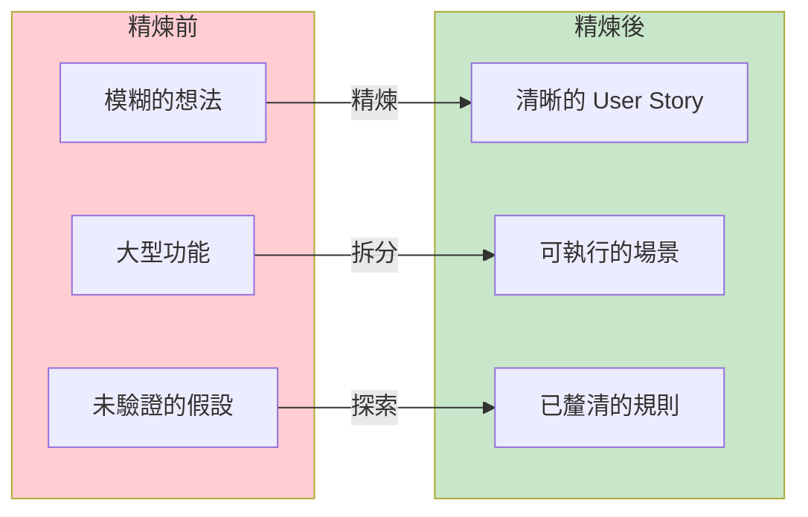
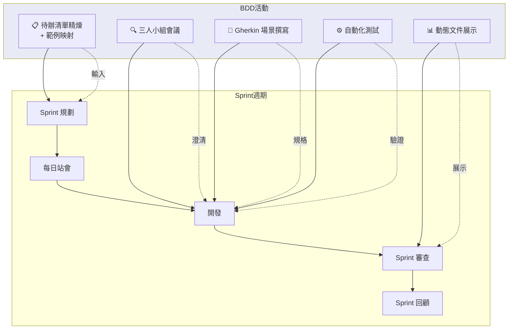
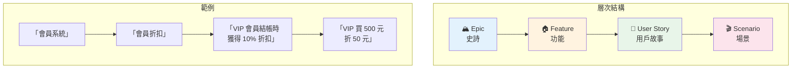
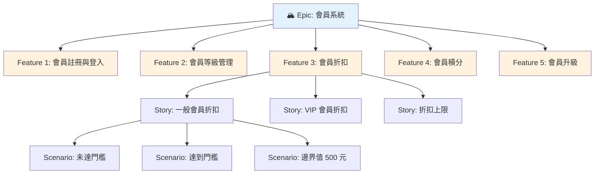
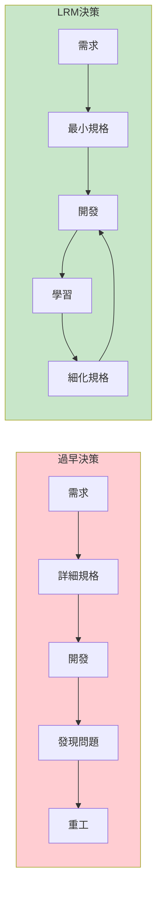
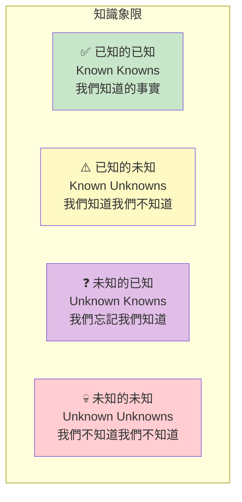
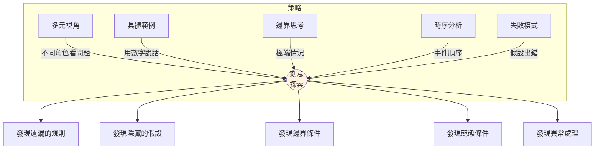
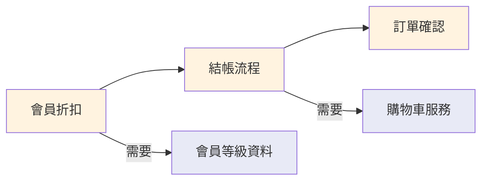
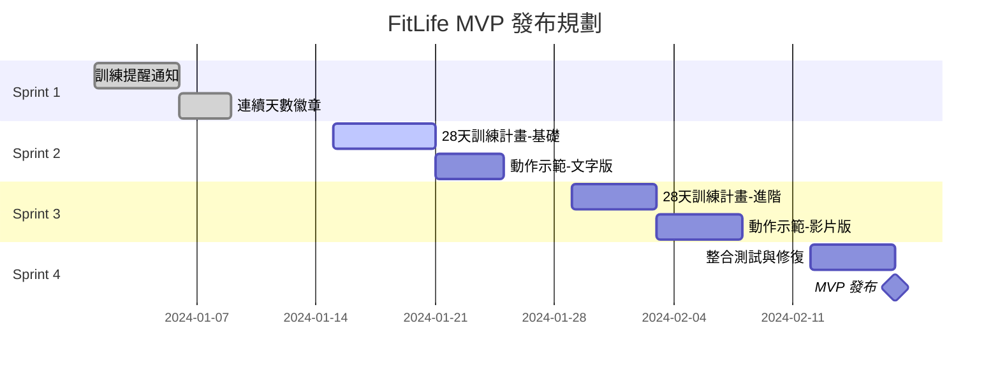

# Chapter 05：對功能進行描述與優先排序

> 「最好的決策是在你需要做決策的那一刻做出的，不早也不晚。」
> —— 精實軟體開發原則

---

## 本章目標

完成本章後，你將能夠：

- 理解 BDD 如何融入產品待辦清單精煉流程
- 區分 Feature、User Story、Epic 的層次與粒度
- 運用「最後責任時刻」原則避免過早承諾
- 透過刻意探索發現「未知的未知」
- 使用多種優先排序技術（MoSCoW、WSJF、價值 vs. 成本）
- 評估功能就緒度，做出明智的 Sprint 規劃

---

## 從影響映射到可執行規格

在上一章中，我們學會了用影響映射從業務目標推導功能清單。但那只是起點。

現在的問題是：

- 這些功能應該怎麼描述？
- 哪些應該先做？
- 什麼時候才算「準備好」可以開發？

本章將回答這些問題。

---

## 5.1 BDD 與產品待辦清單精煉

### 5.1.1 什麼是待辦清單精煉？

**待辦清單精煉**（Backlog Refinement，也稱為 Backlog Grooming）是敏捷開發中的關鍵活動。它的目的是確保產品待辦清單（Product Backlog）中的項目足夠清晰、足夠小，可以被團隊理解和估算。

根據 Scrum Guide 的建議，團隊應該花費約 **10% 的時間** 在精煉活動上。



**圖 5.1：精煉前後的對比**

### 5.1.2 傳統精煉 vs. BDD 精煉

傳統的精煉會議通常聚焦於：
- 估算故事點
- 拆分大型故事
- 釐清模糊需求

BDD 為精煉帶來了一個關鍵的補充：**用具體範例來驗證理解**。

| 面向 | 傳統精煉 | BDD 精煉 |
|------|---------|---------|
| **驗證方式** | 口頭確認「我懂了」 | 用範例證明「我們的理解一致」 |
| **產出物** | 估算過的 User Story | 估算 + 範例映射 + 初步場景 |
| **參與者** | PO + 開發團隊 | 三人小組（PO + Dev + QA） |
| **發現問題** | 開發中才發現誤解 | 精煉時就發現誤解 |
| **細節程度** | 驗收標準（Acceptance Criteria） | 可執行規格（Executable Specification） |

**表 5.1：傳統精煉 vs. BDD 精煉**

### 5.1.3 BDD 如何融入 Scrum

讓我們看看 BDD 活動如何融入典型的 Scrum 週期：



**圖 5.2：BDD 融入 Scrum 週期**

**關鍵時機**：

| 活動 | 時機 | 頻率 |
|------|------|------|
| **範例映射** | Sprint 規劃前 1-2 天 | 每個 Sprint |
| **三人小組會議** | 開始開發故事之前 | 每個 User Story |
| **Gherkin 撰寫** | 三人小組會議之後 | 每個 User Story |
| **自動化測試** | 與開發同步進行 | 持續 |
| **動態文件展示** | Sprint 審查 | 每個 Sprint |

**表 5.2：BDD 活動的時機與頻率**

### 5.1.4 持續發現 vs. 批次精煉

有兩種精煉策略：

**批次精煉（Batch Refinement）**

```
┌─────────────────────────────────────────────────────┐
│                Sprint 週期                           │
├──────────┬──────────────────────────────────────────┤
│  精煉    │           開發                            │
│  (2天)   │         (8天)                            │
└──────────┴──────────────────────────────────────────┘

特點：
- 在 Sprint 開始前集中精煉
- 一次處理多個故事
- 適合穩定的團隊和需求
```

**持續發現（Continuous Discovery）**

```
┌─────────────────────────────────────────────────────┐
│                Sprint 週期                           │
├─────────────────────────────────────────────────────┤
│  精煉 → 開發 → 精煉 → 開發 → 精煉 → 開發            │
│  (持續交錯進行)                                      │
└─────────────────────────────────────────────────────┘

特點：
- 持續進行小規模精煉
- 每天或每兩天處理 1-2 個故事
- 適合快速變化的環境
```

**BDD 推薦持續發現**，因為：

1. **減少浪費**：不會精煉到最後發現不需要做的功能
2. **保持新鮮**：精煉後立即開發，不會遺忘細節
3. **快速反饋**：可以根據開發中的發現調整後續精煉

---

## 5.2 什麼是「功能」？

在 BDD 的語境中，「功能」（Feature）是一個經常被使用但很少被精確定義的詞。讓我們來釐清它。

### 5.2.1 Feature vs. User Story vs. Epic

這三個術語經常被混用，但它們有不同的層次和粒度：



**圖 5.3：Epic、Feature、User Story、Scenario 的層次關係**

| 層次 | 定義 | 交付週期 | 範例 |
|------|------|---------|------|
| **Epic** | 一個大型的業務目標或主題 | 數個月 | 會員系統、支付系統 |
| **Feature** | 一組相關的行為，提供完整的用戶價值 | 數週 | 會員折扣、訂單追蹤 |
| **User Story** | 一個可獨立交付的用戶價值單元 | 數天 | VIP 會員享有 10% 折扣 |
| **Scenario** | 一個具體的使用情境 | 數小時 | VIP 買 500 元時折 50 元 |

**表 5.3：不同層次的定義與週期**

### 5.2.2 Feature 在 Gherkin 中的角色

在 Gherkin 中，`Feature` 是最高層級的組織單位：

```gherkin
Feature: 會員折扣                              # ‹1›
  作為一個 ReadMore 會員                        # ‹2›
  我希望在結帳時獲得折扣
  以便省錢購買更多書籍

  Background:                                  # ‹3›
    Given 系統有以下會員等級設定...

  Rule: 一般會員滿 500 元享 5% 折扣            # ‹4›

    Scenario: 一般會員訂單達到門檻              # ‹5›
      Given 小明是一般會員
      When 小明的訂單金額是 600 元
      Then 折扣金額應該是 30 元

  Rule: VIP 會員享 10% 折扣

    Scenario: VIP 會員正常訂單
      ...
```

**說明**：
- ‹1› **Feature**：對應一個功能檔案，描述一組相關行為
- ‹2› **User Story 格式**：說明功能的目標用戶和價值
- ‹3› **Background**：所有場景共用的前提條件
- ‹4› **Rule**：業務規則，組織相關場景（Gherkin 6+）
- ‹5› **Scenario**：具體的測試案例

### 5.2.3 功能的粒度：多大才合適？

這是一個常見的問題：Feature 應該多大？

**太大的 Feature**：
```
❌ Feature: 電子商務系統
   包含：用戶註冊、商品瀏覽、購物車、結帳、訂單管理、會員系統...
```

這太大了，無法在合理時間內完成，也難以追蹤進度。

**太小的 Feature**：
```
❌ Feature: 顯示折扣金額
   只有一個場景：顯示計算出的折扣
```

這太小了，缺乏完整的用戶價值。

**適當的 Feature**：
```
✅ Feature: 會員折扣
   包含：不同會員等級的折扣規則、門檻計算、最低折扣保障

   完整的用戶價值：會員可以在結帳時獲得折扣
   合理的範圍：可以在 1-2 個 Sprint 內完成
```

**判斷標準**：

| 指標 | 太大 | 適當 | 太小 |
|------|------|------|------|
| **場景數量** | >30 個 | 5-15 個 | <3 個 |
| **規則數量** | >10 條 | 2-5 條 | 0-1 條 |
| **交付時間** | >3 週 | 1-2 週 | <1 天 |
| **獨立價值** | 需拆分才有價值 | 單獨交付有價值 | 太瑣碎 |

**表 5.4：Feature 粒度判斷標準**

### 5.2.4 案例：功能拆分實作

讓我們看一個實際的拆分案例。

**原始需求**（太大）：
```
Epic: 會員系統
- 會員註冊
- 會員登入
- 會員等級
- 會員折扣
- 會員積分
- 會員升級
```

**拆分為 Features**：



**圖 5.4：Epic 拆分為 Features 和 Stories**

**拆分原則**：

1. **INVEST 原則**：
   - **I**ndependent（獨立）：可以獨立開發和交付
   - **N**egotiable（可協商）：細節可以討論
   - **V**aluable（有價值）：對用戶有意義
   - **E**stimable（可估算）：團隊可以估算
   - **S**mall（小）：可在一個 Sprint 內完成
   - **T**estable（可測試）：有明確的驗收標準

2. **垂直切片**：每個切片都包含完整的用戶價值，而非水平分層（前端、後端、資料庫）

```
❌ 水平切片（不推薦）：
   Story 1: 實作折扣計算 API
   Story 2: 實作折扣顯示 UI
   Story 3: 實作折扣資料庫

✅ 垂直切片（推薦）：
   Story 1: 一般會員可以看到滿額折扣
   Story 2: VIP 會員可以看到無門檻折扣
   Story 3: 所有會員可以看到折扣上限提示
```

---

## 5.3 實際選擇：在必要之前，不要過早承諾

### 5.3.1 最後責任時刻（Last Responsible Moment）

「最後責任時刻」（Last Responsible Moment，簡稱 LRM）是精實軟體開發的核心原則之一。

> **定義**：在必須做出決策之前，不要過早做出決策。

這不是拖延，而是**有意識地延遲決策，以獲得更多資訊**。



**圖 5.5：過早決策 vs. 最後責任時刻**

### 5.3.2 漸進式細化

BDD 天然支持漸進式細化。我們不需要一開始就把所有細節想清楚：

**階段 1：Epic 層級（模糊）**
```markdown
我們需要一個會員折扣系統，讓會員有誘因持續購買。
```

**階段 2：Feature 層級（中等）**
```markdown
Feature: 會員折扣
- 不同會員等級有不同折扣
- 可能有最低消費門檻
- 需要考慮折扣上限
```

**階段 3：Story 層級（具體）**
```gherkin
Feature: 會員折扣

  Rule: 一般會員滿 500 元享 5% 折扣
  Rule: VIP 會員享 10% 折扣，無門檻
  Rule: 單筆訂單最高折扣 500 元
```

**階段 4：Scenario 層級（精確）**
```gherkin
Scenario: VIP 會員大額訂單觸發折扣上限
  Given 小華是 VIP 會員
  When 小華的訂單金額是 10000 元
  Then 折扣金額應該是 500 元
  # 說明：10% = 1000 元，但上限是 500 元
```

**關鍵原則**：

- **只細化即將開發的功能**：下個 Sprint 要做的功能需要精確的場景
- **保持選項開放**：未來才做的功能只需要模糊的描述
- **持續更新**：隨著理解加深，持續細化規格

### 5.3.3 避免過度規格化

過度規格化是 BDD 的常見反模式。它有幾個警訊：

```
⚠️ 過度規格化的警訊：

1. 一個 Feature 有超過 50 個場景
2. 場景中包含大量 UI 細節
3. 花費數週時間撰寫規格，卻還沒開始開發
4. 規格比程式碼還長
5. 團隊抱怨「寫 BDD 太花時間」
```

**解決方案**：

| 問題 | 解決方案 |
|------|---------|
| 場景太多 | 使用 Scenario Outline 合併相似場景 |
| UI 細節太多 | 提高抽象層次，隱藏實作細節 |
| 規格耗時太長 | 縮小範圍，只細化即將開發的部分 |
| 規格太冗長 | 使用 Background 和 Rule 組織 |

**表 5.5：過度規格化的解決方案**

---

## 5.4 刻意探索（Deliberate Discovery）

### 5.4.1 什麼是刻意探索？

**刻意探索**（Deliberate Discovery）是 Dan North 提出的概念，強調**有意識地發現你不知道的事情**。

> 「專案不會因為『你不知道的事情』而失敗，而是因為『你不知道你不知道的事情』而失敗。」
> —— Dan North



**圖 5.6：知識象限（Johari Window 變體）**

刻意探索的目標是：

1. **減少「未知的未知」**：透過提問和範例發現隱藏的假設
2. **轉化「已知的未知」**：透過研究和實驗回答已識別的問題
3. **激活「未知的已知」**：透過協作讓團隊分享隱藏的知識

### 5.4.2 刻意探索的技術

**技術 1：提問風暴（Question Storming）**

在範例映射之前，先進行 5 分鐘的提問風暴：

```markdown
## 會員折扣功能 - 提問風暴

### 業務問題
- 折扣的目的是什麼？提升留存還是提升客單價？
- 競爭對手的折扣策略是什麼？
- 折扣成本由誰承擔？

### 規則問題
- 折扣和促銷活動可以疊加嗎？
- 退貨時折扣如何處理？
- 折扣有生效日期限制嗎？

### 技術問題
- 折扣計算在前端還是後端？
- 如何處理並發訂單的折扣計算？
- 折扣資料需要保存多久？

### 邊界問題
- 訂單金額剛好等於門檻時怎麼算？
- 多個商品部分退貨時折扣怎麼重算？
- 會員在結帳過程中升級怎麼處理？
```

**技術 2：假設映射（Assumption Mapping）**

列出所有假設，並評估其風險：

| 假設 | 如果錯誤的影響 | 驗證方式 | 優先級 |
|------|---------------|---------|--------|
| VIP 會員占比約 10% | 折扣成本估算錯誤 | 查看現有數據 | 高 |
| 用戶在意折扣金額 | 功能沒有吸引力 | 用戶訪談 | 高 |
| 10% 折扣足夠有吸引力 | 轉換率不如預期 | A/B 測試 | 中 |
| 系統能支撐即時計算 | 效能問題 | 壓力測試 | 中 |

**表 5.6：假設映射範例**

**技術 3：探索式測試會議（Exploratory Testing Session）**

在開發中期，進行一次探索式測試會議：

```markdown
## 探索式測試會議

時間：45 分鐘
參與者：1 Dev + 1 QA + 1 PO

### 任務
探索會員折扣功能，嘗試「破壞」它

### 記錄格式
每個發現記錄：
- 我做了什麼
- 我預期什麼
- 實際發生什麼
- 這是問題嗎？

### 發現清單
1. [ ] 同時使用兩個折價券會怎樣？
2. [ ] 在結帳頁面重新整理會怎樣？
3. [ ] 用很舊的瀏覽器會怎樣？
4. [ ] 訂單金額輸入負數會怎樣？
```

### 5.4.3 發現「未知的未知」的策略



**圖 5.7：刻意探索的策略與成果**

**常用探索問題**：

```markdown
## 刻意探索問題清單

### 規則探索
- 「如果...會怎樣？」（邊界條件）
- 「這個規則有例外嗎？」
- 「這兩個規則會衝突嗎？」

### 時序探索
- 「如果順序不同會怎樣？」
- 「如果同時發生會怎樣？」
- 「如果中途取消會怎樣？」

### 資料探索
- 「如果資料缺失會怎樣？」
- 「如果資料格式錯誤會怎樣？」
- 「如果資料量很大會怎樣？」

### 角色探索
- 「不同角色看到的一樣嗎？」
- 「如果沒有權限會怎樣？」
- 「如果角色改變會怎樣？」
```

---

## 5.5 透過 BDD 進行版本發布與 Sprint 規劃

### 5.5.1 功能就緒度（Feature Readiness）

不是每個功能都「準備好」被開發。BDD 提供了一個評估框架：

```markdown
## 功能就緒度評估

### 等級定義

🔴 **未就緒（Not Ready）**
- 業務目標不明確
- 沒有進行範例映射
- 有太多未回答的問題

🟡 **部分就緒（Partially Ready）**
- 業務目標明確
- 已進行範例映射
- 核心規則清楚，但有邊界問題待釐清

🟢 **已就緒（Ready）**
- 業務目標明確且可衡量
- 完成範例映射，問題已解決
- Gherkin 場景已撰寫並審核
- 團隊對估算有信心
```

**功能就緒度評估表**：

| 評估項目 | 未就緒 | 部分就緒 | 已就緒 |
|---------|--------|---------|--------|
| 業務目標 | 模糊 | 大致清楚 | 可衡量 |
| 範例映射 | 未進行 | 已進行 | 已完成 |
| 紅色問題 | >5 個 | 1-5 個 | 0 個 |
| Gherkin 場景 | 無 | 草稿 | 已審核 |
| 估算信心 | 不確定 | 大致有信心 | 很有信心 |
| 團隊共識 | 有分歧 | 大致一致 | 完全一致 |

**表 5.7：功能就緒度評估表**

### 5.5.2 優先排序技術

BDD 並不規定使用哪種優先排序技術，但以下幾種與 BDD 特別契合：

**技術 1：MoSCoW**

```
M - Must Have（必須有）：沒有這個功能，產品無法交付
S - Should Have（應該有）：重要，但可以用變通方式處理
C - Could Have（可以有）：有了更好，但不影響核心價值
W - Won't Have（這次不做）：明確排除，避免範圍蔓延
```

**FitLife 範例**：

| 功能 | 優先級 | 理由 |
|------|--------|------|
| 28 天訓練計畫 | **Must** | 核心價值，沒有這個無法驗證留存 |
| 訓練提醒通知 | **Must** | 習慣養成的關鍵機制 |
| 動作示範影片 | **Should** | 重要，但可以先用文字說明 |
| 連續天數徽章 | **Should** | 增加黏性，但不是必要 |
| 社群排行榜 | **Could** | 錦上添花，MVP 可以沒有 |
| AI 姿勢糾正 | **Won't** | 技術複雜度太高，延後處理 |

**表 5.8：MoSCoW 優先排序範例**

**技術 2：WSJF（加權最短工作優先）**

WSJF = (業務價值 + 時間緊迫性 + 風險降低) / 工作量

```
WSJF = (商業價值 + 時效性 + 風險/機會) ÷ 工作規模

計分方式（1-10 分）：
- 商業價值：對營收或用戶的影響
- 時效性：延遲的成本
- 風險/機會：學習價值或風險降低
- 工作規模：開發所需時間
```

| 功能 | 價值 | 時效 | 風險 | 規模 | WSJF |
|------|------|------|------|------|------|
| 28 天訓練計畫 | 9 | 8 | 7 | 5 | **4.8** |
| 訓練提醒通知 | 7 | 7 | 5 | 2 | **9.5** |
| 動作示範影片 | 6 | 4 | 4 | 6 | **2.3** |
| 連續天數徽章 | 5 | 5 | 3 | 2 | **6.5** |
| 社群排行榜 | 4 | 3 | 2 | 7 | **1.3** |

**表 5.9：WSJF 計算範例**

根據 WSJF，優先順序是：訓練提醒 > 連續徽章 > 訓練計畫 > 示範影片 > 排行榜

**技術 3：價值 vs. 成本矩陣**

```
                高價值
                  │
    ┌─────────────┼─────────────┐
    │   Quick     │    Big      │
    │   Wins      │    Bets     │
    │   ⭐⭐⭐     │    ⭐⭐      │
    │  訓練提醒   │  訓練計畫   │
低 ─┼─────────────┼─────────────┤─ 高
成本 │   Fill      │   Money     │ 成本
    │   Ins       │   Pits      │
    │   ⭐        │    ❌       │
    │  天數徽章   │  AI糾正     │
    └─────────────┼─────────────┘
                  │
                低價值
```

**圖 5.8：價值 vs. 成本矩陣**

### 5.5.3 Sprint 規劃中的 BDD

在 Sprint 規劃會議中，BDD 可以幫助團隊：

**1. 用場景評估複雜度**

```markdown
## 估算依據

Feature: 會員折扣

場景數量：8 個
規則數量：4 條
邊界情況：3 個

團隊評估：
- 純開發：3 天
- 包含測試自動化：5 天
- 預留緩衝：1 天

總估算：6 天 ≈ 1 Sprint（含其他工作）
```

**2. 識別依賴關係**



**圖 5.9：功能依賴關係圖**

**3. Sprint 規劃查核清單**

```markdown
## Sprint 規劃 BDD 查核清單

### 進入 Sprint 前
- [ ] 所有 User Story 都已進行範例映射
- [ ] 紅色問題（待釐清）已全部解決
- [ ] 核心 Gherkin 場景已撰寫
- [ ] 團隊已審核並理解場景
- [ ] 估算基於場景複雜度

### Sprint 期間
- [ ] 三人小組會議在開發前進行
- [ ] 場景在開發中持續更新
- [ ] 自動化測試與開發同步

### Sprint 結束時
- [ ] 所有場景通過自動化測試
- [ ] 動態文件已產生
- [ ] 在 Sprint 審查中展示場景和報告
```

**產出物 5.1：Sprint 規劃 BDD 查核清單**

### 5.5.4 發布規劃與功能切片

對於較長期的發布規劃，BDD 提供了功能切片的框架：



**圖 5.10：發布規劃甘特圖**

**功能切片策略**：

```markdown
## 28 天訓練計畫 - 功能切片

### MVP 版本（Sprint 2-3）
- 3 個固定訓練計畫（減重、增肌、維持）
- 每週 3 次訓練
- 基本的進度追蹤

### V1.1 版本（Sprint 5-6）
- 個人化計畫推薦（基於評估結果）
- 每週 3-5 次可調整
- 完成率統計

### V1.2 版本（Sprint 7-8）
- AI 動態調整難度
- 多種訓練時長（15/30/45 分鐘）
- 訓練日曆整合
```

---

## 本章總結

在這一章中，我們學習了如何描述功能並進行優先排序：

- ✅ **BDD 融入精煉流程**：用範例映射取代口頭確認，提前發現誤解。

- ✅ **功能的層次與粒度**：理解 Epic、Feature、User Story、Scenario 的關係，選擇適當的粒度。

- ✅ **最後責任時刻**：避免過早承諾，漸進式細化規格。

- ✅ **刻意探索**：主動發現「未知的未知」，減少專案風險。

- ✅ **優先排序技術**：MoSCoW、WSJF、價值 vs. 成本矩陣各有適用場景。

- ✅ **功能就緒度**：評估功能是否準備好進入開發。

## 下一章預告

**Chapter 06：用範例說明功能**

在下一章中，我們將深入探索階段的核心技術：
- 三人小組會議的完整流程
- 範例映射工作坊的實戰技巧
- 如何用表格處理複雜的業務規則
- 功能映射與 OOPSI 框架

---

## 核心產出物

### 產出物 1：功能描述範本

```markdown
# 功能描述範本

## 基本資訊
- **功能名稱**：_______________
- **所屬 Epic**：_______________
- **負責人**：_______________
- **預計交付**：Sprint ___

## 業務目標
這個功能支持什麼業務目標？
- 目標：_______________
- 衡量指標：_______________
- 目標值：_______________

## 功能描述
作為 [角色]
我希望 [目標]
以便 [價值]

## 核心規則
1. _______________
2. _______________
3. _______________

## 範例映射狀態
- [ ] 已完成範例映射
- [ ] 紅色問題：___ 個
- [ ] 核心場景：___ 個

## 依賴關係
- 前置功能：_______________
- 需要的服務/資料：_______________

## 驗收標準
- [ ] 核心場景全部通過
- [ ] 邊界情況已處理
- [ ] 效能符合要求
- [ ] 已整合到主線

## 備註
_______________
```

### 產出物 2：優先級評估矩陣

```markdown
# 優先級評估矩陣

## 評估方法：WSJF

WSJF = (價值 + 時效 + 風險) ÷ 規模

### 計分標準（1-10）

**價值（Business Value）**
- 1-3：對業務指標影響小
- 4-6：對業務指標有中等影響
- 7-10：對核心指標有重大影響

**時效（Time Criticality）**
- 1-3：延遲影響小
- 4-6：延遲有中等影響
- 7-10：延遲會錯過重要時機

**風險/機會（Risk/Opportunity）**
- 1-3：風險低，學習價值小
- 4-6：中等風險或學習價值
- 7-10：高風險需盡早驗證，或高學習價值

**規模（Job Size）**
- 1-3：小（< 1 週）
- 4-6：中（1-2 週）
- 7-10：大（> 2 週）

### 評估表

| 功能 | 價值 | 時效 | 風險 | 規模 | WSJF | 排序 |
|------|------|------|------|------|------|------|
|      |      |      |      |      |      |      |
|      |      |      |      |      |      |      |
|      |      |      |      |      |      |      |

### 決策結果

**本 Sprint 納入**：
1. _______________（WSJF: ___）
2. _______________（WSJF: ___）

**下個 Sprint 候選**：
1. _______________（WSJF: ___）

**暫緩**：
1. _______________（原因：___）
```

### 產出物 3：功能就緒度評估表

```markdown
# 功能就緒度評估表

## 功能資訊
- **功能名稱**：_______________
- **評估日期**：_______________
- **評估人員**：_______________

## 評估項目

### 1. 業務目標（0-2 分）
- [ ] 0 分：目標不明確
- [ ] 1 分：目標明確但無法衡量
- [ ] 2 分：目標明確且可衡量

得分：___

### 2. 範例映射（0-2 分）
- [ ] 0 分：未進行
- [ ] 1 分：已進行但不完整
- [ ] 2 分：已完成，規則清晰

得分：___

### 3. 待釐清問題（0-2 分）
- [ ] 0 分：>5 個紅色問題
- [ ] 1 分：1-5 個紅色問題
- [ ] 2 分：0 個紅色問題

得分：___

### 4. Gherkin 場景（0-2 分）
- [ ] 0 分：無場景
- [ ] 1 分：有草稿未審核
- [ ] 2 分：已審核通過

得分：___

### 5. 估算信心（0-2 分）
- [ ] 0 分：無法估算
- [ ] 1 分：有估算但不確定
- [ ] 2 分：團隊有信心

得分：___

## 總分：___ / 10

## 就緒度判定
- 0-4 分：🔴 未就緒
- 5-7 分：🟡 部分就緒
- 8-10 分：🟢 已就緒

## 行動項目
如果未就緒，需要：
1. _______________
2. _______________
3. _______________
```

---

## 延伸閱讀

- [Specification by Example - Gojko Adzic](https://gojko.net/books/specification-by-example/) - BDD 精煉的經典書籍
- [User Story Mapping - Jeff Patton](https://www.jpattonassociates.com/user-story-mapping/) - 用戶故事映射
- [The Art of Agile Development - James Shore](https://www.jamesshore.com/v2/books/aoad2) - 敏捷開發最佳實踐
- [Deliberate Discovery - Dan North](https://dannorth.net/introducing-deliberate-discovery/) - 刻意探索原始文章

---

**字數統計**：約 18,200 字
**最後更新**：2025-11-22
