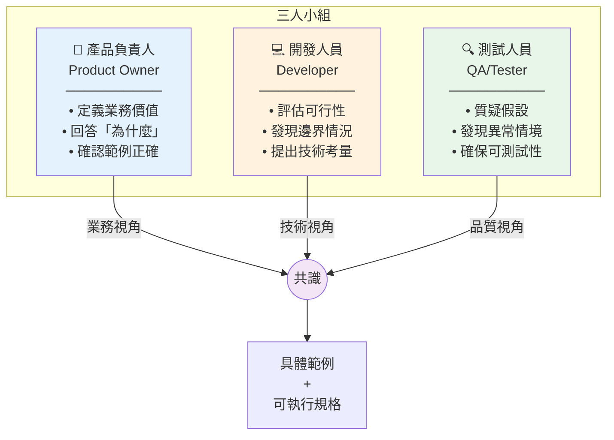
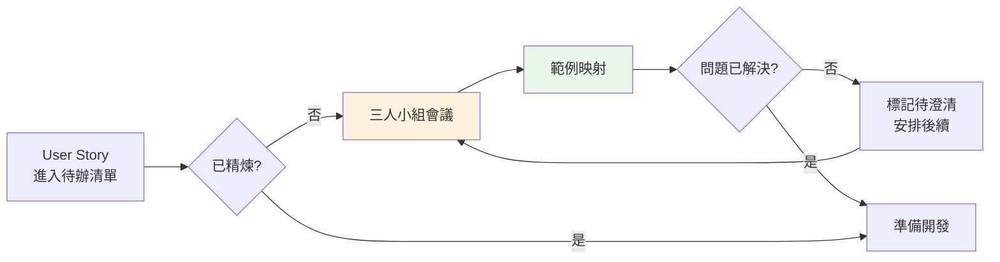
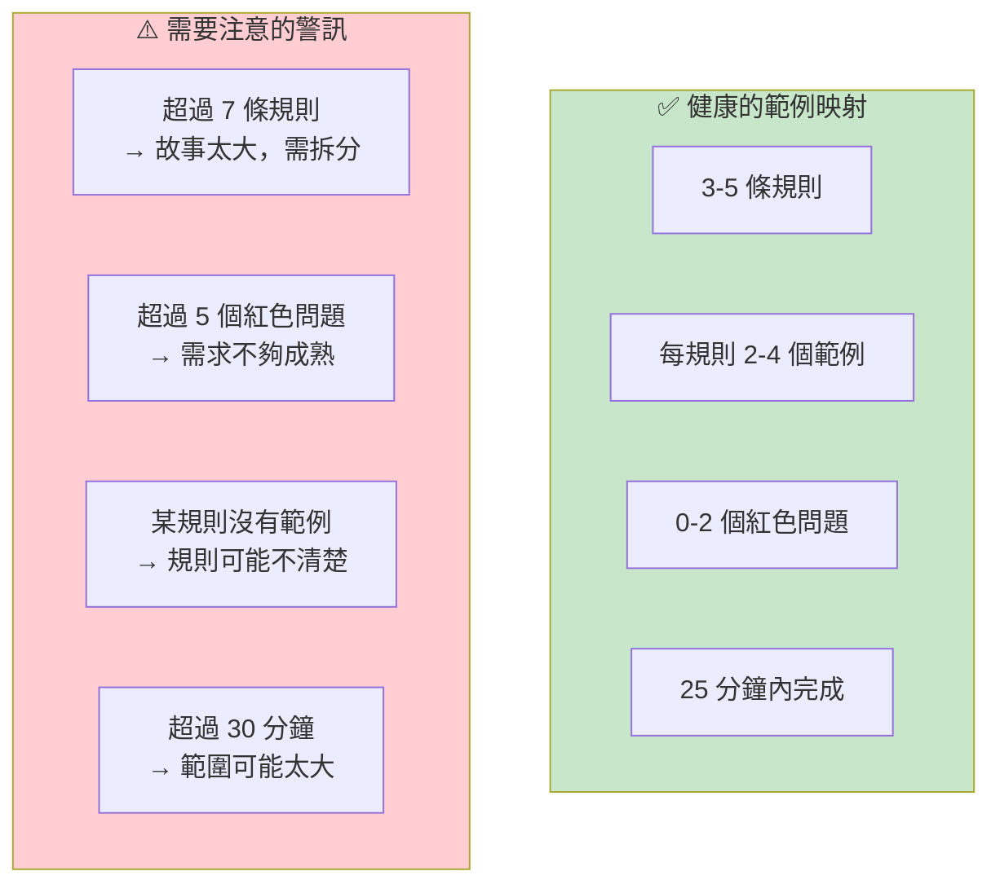
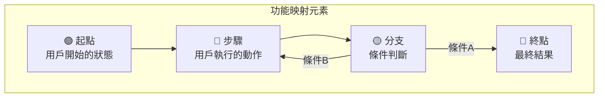
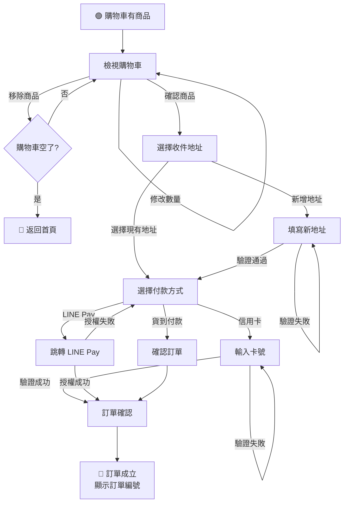
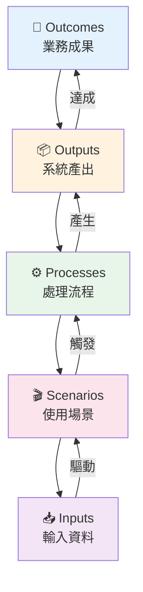

# Chapter 06：用範例說明功能

> 「告訴我事實，我會學習。告訴我真相，我會相信。但是給我一個故事，它將永遠活在我心中。」
> —— 印第安諺語

---

## 本章目標

完成本章後，你將能夠：

- 主持高效的三人小組會議（Three Amigos）
- 運用範例映射（Example Mapping）技術探索需求
- 使用決策表處理複雜的業務規則
- 掌握功能映射（Feature Mapping）的流程導向探索
- 應用 OOPSI 框架進行系統化需求分析
- 識別並處理範例探索中的常見陷阱

---

## 從模糊到清晰

在前兩章中，我們學會了如何從業務目標推導功能清單，以及如何進行優先排序。但功能清單只是起點——它告訴我們「做什麼」，卻沒有告訴我們「具體怎麼做」。

這一章的核心問題是：**如何將模糊的功能描述轉化為具體、可驗證的規格？**

答案是：**用範例說話**。

讓我們回到 ReadMore 書店的會議室，看看團隊如何用範例來探索「會員折扣」功能的細節。

---

## 6.1 「三人小組會議」與其他的需求探索工作坊

### 6.1.1 三人小組（Three Amigos）介紹

「三人小組」是 BDD 最核心的協作模式。它的名字來自 1986 年的同名喜劇電影，但在軟體開發中，它指的是三個關鍵角色的協作：



**圖 6.1：三人小組的角色與協作**

**為什麼是這三個角色？**

每個角色帶來獨特且互補的視角：

| 角色 | 核心問題 | 典型貢獻 |
|------|---------|---------|
| **產品負責人** | 「用戶需要什麼？」 | 業務規則、優先級、成功標準 |
| **開發人員** | 「技術上怎麼實現？」 | 邊界條件、技術限制、實作建議 |
| **測試人員** | 「可能會出什麼錯？」 | 異常情境、測試策略、品質風險 |

**表 6.1：三人小組的角色貢獻**

> 💡 **提示**：「三人」不是硬性規定。根據功能複雜度，你可以邀請 UX 設計師、架構師或領域專家參與。但核心的三個視角不應缺席。

### 6.1.2 會議流程與時間控制

三人小組會議應該是**短而頻繁**的，而不是長而稀少的。

**推薦的會議結構**（25-30 分鐘）：

```
┌─────────────────────────────────────────────────────────────┐
│                    三人小組會議流程                           │
├─────────────────────────────────────────────────────────────┤
│                                                             │
│  📋 開場（2 分鐘）                                           │
│     • PO 簡述 User Story                                    │
│     • 確認會議目標                                           │
│                                                             │
│  🔍 探索（15-20 分鐘）                                       │
│     • 識別業務規則                                           │
│     • 用範例說明每條規則                                      │
│     • 記錄問題和假設                                         │
│                                                             │
│  📝 總結（5 分鐘）                                           │
│     • 回顧識別的規則和範例                                    │
│     • 確認待解決的問題                                       │
│     • 決定是否需要後續會議                                    │
│                                                             │
│  ⏱️ 時間盒：嚴格控制在 30 分鐘內                             │
│     如果 30 分鐘無法完成，說明故事太大，需要拆分              │
│                                                             │
└─────────────────────────────────────────────────────────────┘
```

**產出物 6.1：三人小組會議流程**

### 6.1.3 會議頻率與時機

**什麼時候開三人小組會議？**



**圖 6.2：三人小組會議的觸發時機**

**推薦的頻率**：

| 團隊規模 | 建議頻率 | 說明 |
|---------|---------|------|
| 小團隊（3-5人） | 每天 15-30 分鐘 | 可以整合到每日站會後 |
| 中團隊（6-10人） | 每週 2-3 次 | 固定時段，如週二、週四下午 |
| 大團隊（10+人） | 按需安排 | 每個故事開發前進行 |

**表 6.2：三人小組會議頻率建議**

### 6.1.4 遠端協作技巧

在遠端工作環境中，三人小組會議需要一些調整：

**工具選擇**：

```markdown
## 遠端三人小組工具箱

### 視訊會議
- Zoom / Google Meet / Microsoft Teams
- 建議開啟視訊，增加互動感

### 協作白板
- Miro（推薦：有範例映射模板）
- FigJam
- Excalidraw

### 即時文件
- Google Docs
- Notion
- Confluence

### 範例映射專用
- CardBoard（專門的範例映射工具）
- 實體便利貼 + 手機拍照分享
```

**遠端會議注意事項**：

1. **提前準備**：會前 10 分鐘確認工具運作正常
2. **明確主持人**：指定一人負責時間控制和發言順序
3. **視覺化優先**：用白板而非純語音討論
4. **頻繁確認**：每討論完一個點，確認所有人理解一致
5. **會後記錄**：立即整理會議結論，分享給所有人

---

## 6.2 透過範例來說明功能

### 6.2.1 為什麼範例比規格更有效

讓我們做一個實驗。請閱讀以下兩段描述，然後告訴我：VIP 會員買 150 元的東西，應該得到多少折扣？

**描述 A（規格風格）**：
> VIP 會員享有 10% 折扣，無最低消費限制，但有最低折扣保障機制。

**描述 B（範例風格）**：
> - VIP 會員買 500 元 → 折扣 50 元（10%）
> - VIP 會員買 200 元 → 折扣 20 元（10%）
> - VIP 會員買 100 元 → 折扣 20 元（最低保障，而非 10 元）

現在你能回答問題了嗎？

從描述 A，你可能猜測答案是 15 元（10%），但「最低折扣保障」是多少？不清楚。

從描述 B，你可以推斷最低保障是 20 元，所以 150 元的訂單應該得到 20 元折扣（因為 10% 只有 15 元，低於保障）。

**這就是範例的力量**：它消除了模糊空間，讓所有人的理解一致。

### 6.2.2 好範例的特徵

不是所有範例都同樣有效。好的範例應該具備以下特徵：

```
✅ 好範例的特徵

1. 具體（Concrete）
   ❌ 「用戶購買商品」
   ✅ 「小明購買《BDD in Action》，定價 880 元」

2. 有意義的數據（Meaningful Data）
   ❌ 「訂單金額是 X 元」
   ✅ 「訂單金額是 499 元」（暗示接近 500 元門檻）

3. 覆蓋邊界（Boundary Coverage）
   ✅ 剛好 500 元、499 元、501 元
   ✅ 最小值、最大值、零

4. 說明規則（Illustrate Rules）
   每個範例都應該說明一條特定的規則

5. 可驗證（Verifiable）
   有明確的輸入和預期輸出
```

### 6.2.3 案例：登入功能的範例探索

讓我們用一個完整的案例來示範範例探索的過程。

**User Story**：
> 作為一個已註冊的用戶，我希望能夠登入系統，以便存取我的個人資料。

**三人小組會議記錄**：

```
PO（Sarah）：這個登入功能很直接，用戶輸入帳號密碼就可以登入。

Dev（Alex）：那如果密碼輸入錯誤呢？

Sarah：顯示錯誤訊息，讓他重新輸入。

QA（Jamie）：連續輸入錯誤幾次會怎樣？有沒有鎖定機制？

Sarah：好問題...應該要有。連續 5 次錯誤就暫時鎖定。

Alex：鎖定多久？

Sarah：15 分鐘。

Jamie：如果帳號不存在呢？錯誤訊息和密碼錯誤一樣嗎？

Sarah：為了安全，應該顯示同樣的訊息「帳號或密碼錯誤」，不能讓人知道帳號是否存在。

Alex：需要驗證碼嗎？

Sarah：第一次登入不需要，但如果之前有錯誤記錄，就需要。

Jamie：「之前有錯誤記錄」是指什麼時間範圍？

Sarah：24 小時內有錯誤就需要驗證碼。
```

**範例探索結果**：

```markdown
## 登入功能 - 範例映射

### 規則 1：正確憑證可以成功登入

範例 1.1：標準登入
- 輸入：帳號 alice@example.com，密碼 correct_password
- 結果：登入成功，導向首頁

### 規則 2：錯誤憑證會被拒絕（統一錯誤訊息）

範例 2.1：密碼錯誤
- 輸入：帳號 alice@example.com，密碼 wrong_password
- 結果：顯示「帳號或密碼錯誤」

範例 2.2：帳號不存在
- 輸入：帳號 unknown@example.com，密碼 any_password
- 結果：顯示「帳號或密碼錯誤」（相同訊息）

### 規則 3：連續 5 次錯誤，帳號鎖定 15 分鐘

範例 3.1：第 5 次錯誤觸發鎖定
- 前提：alice 已連續輸入錯誤 4 次
- 輸入：第 5 次錯誤密碼
- 結果：帳號鎖定，顯示「帳號已鎖定，請 15 分鐘後再試」

範例 3.2：鎖定期間無法登入
- 前提：alice 帳號已鎖定（5 分鐘前）
- 輸入：正確的帳號密碼
- 結果：仍然顯示「帳號已鎖定」

範例 3.3：鎖定期滿後可以登入
- 前提：alice 帳號鎖定已滿 15 分鐘
- 輸入：正確的帳號密碼
- 結果：登入成功

### 規則 4：24 小時內有錯誤記錄需要驗證碼

範例 4.1：有錯誤記錄，顯示驗證碼
- 前提：alice 在 2 小時前有 1 次錯誤記錄
- 結果：登入頁面顯示驗證碼欄位

範例 4.2：超過 24 小時，不需驗證碼
- 前提：alice 最後一次錯誤是 25 小時前
- 結果：登入頁面不顯示驗證碼

### 待釐清問題
🔴 鎖定期間錯誤次數會重置嗎？
🔴 驗證碼錯誤算不算在 5 次限制內？
🔴 用戶可以主動解鎖嗎（例如透過 Email）？
```

**產出物 6.2：登入功能範例映射結果**

### 6.2.4 範例的數量：多少才夠？

這是一個常見的問題：每條規則需要多少範例？

**經驗法則**：

```
最小範例數 = 規則數 × 2

每條規則至少需要：
- 1 個正向範例（符合規則的情況）
- 1 個邊界/負向範例（不符合或邊界情況）

複雜規則可能需要更多範例來覆蓋：
- 邊界值（等於、小於、大於）
- 特殊情況（空值、極端值）
- 組合情況（多個條件同時作用）
```

**判斷標準**：

| 情況 | 範例數量建議 |
|------|-------------|
| 簡單規則（布林判斷） | 2 個 |
| 數值邊界（門檻判斷） | 3-4 個 |
| 多條件組合 | 4-6 個 |
| 複雜業務邏輯 | 6-10 個 |
| 狀態機/流程 | 覆蓋所有狀態轉換 |

**表 6.3：範例數量建議**

> ⚠️ **警告**：範例不是越多越好。太多範例會造成維護負擔，也可能代表功能太複雜需要拆分。

---

## 6.3 使用表格來描述更複雜的需求

### 6.3.1 決策表（Decision Tables）

當業務規則涉及多個條件的組合時，使用**決策表**可以清晰地呈現所有情況。

**案例：訂單折扣規則**

ReadMore 書店的折扣規則變得更複雜了：

- 會員等級：一般、VIP
- 訂單金額：是否達到門檻
- 是否首次購買
- 是否使用折價券

**規格描述（難以理解）**：

> 一般會員滿 500 元享 5% 折扣，VIP 會員享 10% 折扣無門檻。首次購買額外 5% 折扣。使用折價券後，折扣以折價後金額計算。VIP 首購折扣上限 15%。

你能確定所有情況嗎？讓我們用決策表來整理：

**決策表（清晰明瞭）**：

| # | 會員等級 | 訂單金額 | 首次購買 | 基礎折扣 | 首購加成 | 最終折扣 |
|---|---------|---------|---------|---------|---------|---------|
| 1 | 一般 | < 500 | 否 | 0% | 0% | **0%** |
| 2 | 一般 | < 500 | 是 | 0% | 5% | **5%** |
| 3 | 一般 | ≥ 500 | 否 | 5% | 0% | **5%** |
| 4 | 一般 | ≥ 500 | 是 | 5% | 5% | **10%** |
| 5 | VIP | 任意 | 否 | 10% | 0% | **10%** |
| 6 | VIP | 任意 | 是 | 10% | 5% | **15%**（上限） |

**表 6.4：訂單折扣決策表**

### 6.3.2 從決策表到 Gherkin

決策表可以直接轉換成 Gherkin 的 `Scenario Outline`：

```gherkin
Feature: 訂單折扣計算

  Scenario Outline: 根據會員等級和訂單條件計算折扣
    Given 顧客是「<會員等級>」會員
    And 這<是否首購>顧客的首次購買
    When 訂單金額是 <訂單金額> 元
    Then 最終折扣應該是 <最終折扣>

    Examples: 一般會員
      | 會員等級 | 訂單金額 | 是否首購 | 最終折扣 |
      | 一般     | 400      | 不是     | 0%       |
      | 一般     | 400      | 是       | 5%       |
      | 一般     | 600      | 不是     | 5%       |
      | 一般     | 600      | 是       | 10%      |

    Examples: VIP 會員
      | 會員等級 | 訂單金額 | 是否首購 | 最終折扣 |
      | VIP      | 200      | 不是     | 10%      |
      | VIP      | 200      | 是       | 15%      |
      | VIP      | 1000     | 不是     | 10%      |
      | VIP      | 1000     | 是       | 15%      |
```

**程式碼 6.1：從決策表轉換的 Gherkin 場景**

### 6.3.3 範例表（Example Tables）

除了決策表，我們還可以使用**範例表**來列出具體的測試數據：

```gherkin
Feature: 運費計算

  Background:
    Given 系統運費規則如下:
      | 目的地   | 基本運費 | 免運門檻 |
      | 台北市   | 60 元    | 500 元   |
      | 新北市   | 60 元    | 500 元   |
      | 其他縣市 | 80 元    | 800 元   |
      | 離島     | 150 元   | 不適用   |

  Scenario Outline: 計算訂單運費
    Given 顧客的收件地址是「<目的地>」
    When 訂單金額是 <訂單金額> 元
    Then 運費應該是 <運費> 元
    And 訂單總額應該是 <總額> 元

    Examples: 本島運費
      | 目的地   | 訂單金額 | 運費 | 總額 |
      | 台北市   | 400      | 60   | 460  |
      | 台北市   | 500      | 0    | 500  |
      | 新北市   | 600      | 0    | 600  |
      | 台中市   | 700      | 80   | 780  |
      | 台中市   | 800      | 0    | 800  |

    Examples: 離島運費（無免運）
      | 目的地 | 訂單金額 | 運費 | 總額 |
      | 金門縣 | 500      | 150  | 650  |
      | 澎湖縣 | 1000     | 150  | 1150 |
```

**程式碼 6.2：使用範例表的運費計算場景**

### 6.3.4 何時使用表格

| 情況 | 建議方式 |
|------|---------|
| 單一規則、少量案例 | 獨立的 Scenario |
| 相同規則、多組數據 | Scenario Outline + Examples |
| 多條件組合判斷 | 決策表 + Scenario Outline |
| 需要展示計算過程 | Background 表格 + Scenario |
| 複雜狀態轉換 | 狀態表 + 多個 Scenario |

**表 6.5：表格使用時機**

---

## 6.4 範例映射（Example Mapping）

### 6.4.1 範例映射介紹

**範例映射**是由 Matt Wynne 在 2015 年提出的需求探索技術。它使用四種顏色的卡片來組織討論：

```
┌─────────────────────────────────────────────────────────────┐
│                     範例映射卡片系統                          │
├─────────────────────────────────────────────────────────────┤
│                                                             │
│  🟨 黃色卡片：User Story                                     │
│     • 放在最上方                                             │
│     • 一次會議只討論一個 Story                               │
│     • 格式：「作為...我希望...以便...」                       │
│                                                             │
│  🟦 藍色卡片：Rules（業務規則）                               │
│     • 放在黃色下方                                           │
│     • 每發現一條規則，增加一張                               │
│     • 簡潔描述規則內容                                       │
│                                                             │
│  🟩 綠色卡片：Examples（具體範例）                            │
│     • 放在對應規則的下方                                      │
│     • 每個範例一張卡片                                        │
│     • 使用具體的數字和名字                                    │
│                                                             │
│  🟥 紅色卡片：Questions（待釐清問題）                         │
│     • 放在相關規則旁邊                                        │
│     • 無法當場回答的問題                                      │
│     • 會後需要追蹤解決                                        │
│                                                             │
└─────────────────────────────────────────────────────────────┘
```

**圖 6.3：範例映射卡片系統**

### 6.4.2 範例映射工作坊流程

讓我們跟著 ReadMore 團隊進行一次完整的範例映射工作坊。

**準備工作**：

```markdown
## 範例映射工作坊準備清單

### 實體會議
- [ ] 四種顏色的便利貼（黃、藍、綠、紅）
- [ ] 白板或大張紙
- [ ] 馬克筆
- [ ] 計時器（25-30 分鐘）

### 遠端會議
- [ ] Miro 或類似的協作白板
- [ ] 範例映射模板
- [ ] 視訊會議連結
- [ ] 事先分享 User Story
```

**工作坊流程**：

**步驟 1：貼上黃色卡片（1 分鐘）**

Sarah（PO）在白板頂端貼上黃色便利貼：

```
🟨 User Story: 訂單折價券
   作為一個 ReadMore 會員
   我希望在結帳時使用折價券
   以便獲得更多優惠
```

**步驟 2：識別規則（5 分鐘）**

團隊開始討論，每發現一條規則就貼一張藍色卡片：

```
Sarah：折價券有不同面額，50元、100元、200元。

🟦 規則 1：折價券有不同面額（50/100/200元）

Alex：折價券有使用期限嗎？

Sarah：有的，每張券都有到期日。

🟦 規則 2：折價券有使用期限

Jamie：可以同時使用多張嗎？

Sarah：一筆訂單最多使用一張。

🟦 規則 3：一筆訂單最多使用一張折價券

Alex：有沒有最低消費限制？

Sarah：好問題，應該要有。折價券金額不能超過訂單的 50%。

🟦 規則 4：折價券金額不能超過訂單金額的 50%
```

**步驟 3：用範例說明規則（15 分鐘）**

對每條規則，用綠色卡片舉出具體範例：

```
🟦 規則 1：折價券有不同面額

🟩 小明使用 50 元折價券，訂單 300 元 → 付 250 元
🟩 小明使用 100 元折價券，訂單 500 元 → 付 400 元
🟩 小明使用 200 元折價券，訂單 800 元 → 付 600 元


🟦 規則 2：折價券有使用期限

🟩 小明使用未過期的折價券（到期日明天）→ 可以使用
🟩 小明使用已過期的折價券（到期日昨天）→ 顯示「折價券已過期」


🟦 規則 3：一筆訂單最多使用一張折價券

🟩 小明有兩張 50 元折價券，只能選一張使用


🟦 規則 4：折價券金額不能超過訂單金額的 50%

🟩 訂單 200 元，使用 200 元折價券 → 只能折 100 元
🟩 訂單 400 元，使用 200 元折價券 → 可以折 200 元
🟩 訂單 300 元，使用 200 元折價券 → 只能折 150 元
```

**步驟 4：記錄問題（持續進行）**

討論過程中發現的問題，用紅色卡片記錄：

```
🟥 問題：折價券可以和會員折扣同時使用嗎？
🟥 問題：部分退貨時折價券如何處理？
🟥 問題：折價券可以找零嗎？（訂單 80 元用 100 元券）
```

### 6.4.3 範例映射的視覺化結果

完成後，白板看起來像這樣：

```
┌─────────────────────────────────────────────────────────────────────────────┐
│                                                                             │
│  🟨 訂單折價券                                                               │
│     作為一個 ReadMore 會員，我希望使用折價券獲得優惠                          │
│                                                                             │
├─────────────────────────────────────────────────────────────────────────────┤
│                                                                             │
│  🟦 規則 1：不同面額          🟦 規則 2：使用期限                            │
│     🟩 50元券，300元訂單         🟩 未過期 → 可用                            │
│     🟩 100元券，500元訂單        🟩 已過期 → 顯示錯誤                        │
│     🟩 200元券，800元訂單                                                    │
│                                                                             │
│  🟦 規則 3：最多使用一張      🟦 規則 4：不超過訂單50%                       │
│     🟩 有兩張只能選一張          🟩 200元訂單用200元券 → 折100元            │
│                                  🟩 400元訂單用200元券 → 折200元            │
│                                  🟩 300元訂單用200元券 → 折150元            │
│                                                                             │
├─────────────────────────────────────────────────────────────────────────────┤
│  🟥 待釐清問題                                                               │
│     • 折價券可以和會員折扣同時使用嗎？                                        │
│     • 部分退貨時折價券如何處理？                                              │
│     • 折價券可以找零嗎？                                                      │
└─────────────────────────────────────────────────────────────────────────────┘
```

**圖 6.4：範例映射視覺化結果**

### 6.4.4 範例映射的健康指標

如何判斷一次範例映射是否成功？



**圖 6.5：範例映射健康指標**

### 6.4.5 範例映射後的行動

範例映射結束後，需要：

1. **解決紅色問題**：
   - 指定負責人
   - 設定解決期限
   - 必要時安排後續會議

2. **整理成文件**：
   - 將卡片內容轉成數位格式
   - 儲存在團隊的知識庫中

3. **準備撰寫 Gherkin**：
   - 確認所有問題已解決
   - 開始將範例轉換成場景

---

## 6.5 功能映射（Feature Mapping）

### 6.5.1 什麼是功能映射

**功能映射**是另一種探索技術，它更適合**流程導向**的功能。

與範例映射的差異：

| 面向 | 範例映射 | 功能映射 |
|------|---------|---------|
| **適用情境** | 規則導向的功能 | 流程導向的功能 |
| **組織方式** | 規則 + 範例 | 步驟 + 結果 |
| **視覺呈現** | 樹狀結構 | 流程圖 |
| **典型案例** | 折扣計算、權限判斷 | 結帳流程、註冊流程 |

**表 6.6：範例映射 vs. 功能映射**

### 6.5.2 功能映射的結構

功能映射使用以下元素：



**圖 6.6：功能映射的基本元素**

### 6.5.3 案例：結帳流程功能映射

讓我們為 ReadMore 書店的結帳流程建立功能映射：



**圖 6.7：結帳流程功能映射**

### 6.5.4 從功能映射到範例

功能映射完成後，我們可以為每個關鍵節點建立範例：

```markdown
## 結帳流程 - 關鍵範例

### 節點：選擇收件地址
- 範例 1：用戶有 3 個已儲存地址，選擇其中一個
- 範例 2：用戶沒有已儲存地址，必須新增
- 範例 3：用戶新增地址時，郵遞區號格式錯誤

### 節點：選擇付款方式
- 範例 4：選擇信用卡，輸入正確卡號
- 範例 5：選擇信用卡，卡號格式錯誤
- 範例 6：選擇信用卡，餘額不足
- 範例 7：選擇 LINE Pay，授權成功
- 範例 8：選擇 LINE Pay，用戶取消授權
- 範例 9：選擇貨到付款，地址在離島（不支援）

### 節點：訂單確認
- 範例 10：所有步驟完成，顯示訂單編號和預計送達時間
- 範例 11：結帳過程中商品售罄，顯示錯誤並返回購物車
```

---

## 6.6 OOPSI 框架

### 6.6.1 什麼是 OOPSI

**OOPSI** 是一個系統化的需求分析框架，它代表：

- **O**utcomes（成果）：我們想達成什麼？
- **O**utputs（產出）：需要產生什麼？
- **P**rocesses（流程）：需要什麼流程？
- **S**cenarios（場景）：有哪些使用情境？
- **I**nputs（輸入）：需要什麼資料？



**圖 6.8：OOPSI 框架結構**

### 6.6.2 OOPSI 應用案例

讓我們用 OOPSI 分析 ReadMore 的「會員折扣」功能：

```markdown
## 會員折扣 - OOPSI 分析

### Outcomes（成果）
- 提升會員回購率 20%
- 增加 VIP 會員數量 15%
- 提升客單價 10%

### Outputs（產出）
- 結帳頁面顯示折扣金額
- 訂單明細包含折扣項目
- 會員中心顯示折扣記錄

### Processes（流程）
1. 識別會員等級
2. 計算訂單金額（不含運費）
3. 根據規則計算折扣
4. 套用折扣到訂單
5. 記錄折扣使用

### Scenarios（場景）
- 一般會員未達門檻
- 一般會員達到門檻
- VIP 會員正常折扣
- VIP 會員最低保障
- 折扣達到上限

### Inputs（輸入）
- 會員 ID
- 會員等級
- 訂單商品清單
- 商品單價
- 商品數量
```

**產出物 6.3：OOPSI 分析範例**

### 6.6.3 OOPSI vs. 其他技術

| 技術 | 適用情境 | 優勢 |
|------|---------|------|
| **範例映射** | 單一功能的規則探索 | 快速、聚焦 |
| **功能映射** | 流程導向的功能 | 視覺化流程 |
| **OOPSI** | 複雜功能的全面分析 | 系統化、完整 |
| **影響映射** | 從目標推導功能 | 確保價值對齊 |

**表 6.7：不同探索技術的適用情境**

---

## 本章總結

在這一章中，我們深入學習了需求探索的核心技術：

- ✅ **三人小組會議**：PO、Dev、QA 三個視角的協作，確保需求被充分理解。

- ✅ **範例的力量**：用具體的數字和情境說明需求，消除模糊空間。

- ✅ **決策表**：處理多條件組合的業務規則，清晰呈現所有情況。

- ✅ **範例映射**：四色卡片系統（黃藍綠紅），結構化的需求探索工作坊。

- ✅ **功能映射**：流程導向的探索技術，適合結帳、註冊等流程功能。

- ✅ **OOPSI 框架**：系統化的需求分析，從成果到輸入的完整視角。

記住，**範例探索的目標不是產出完美的規格，而是讓團隊對需求達成共識**。一個有紅色問題的範例映射，遠勝過一份所有人都誤解的規格文件。

## 下一章預告

**Chapter 07：從範例到可執行規格**

在下一章中，我們將學習：
- 將範例轉換成 Gherkin 場景的完整流程
- Gherkin 語法的進階技巧
- 使用 Rule 和 Background 組織場景
- 撰寫表達力強的場景：模式與反模式
- 標籤策略與 Feature 檔案組織

---

## 核心產出物

### 產出物 1：三人小組會議議程表

```markdown
# 三人小組會議議程表

## 會議資訊
- **日期**：_______________
- **User Story**：_______________
- **參與者**：
  - PO：_______________
  - Dev：_______________
  - QA：_______________

---

## 會議流程

### 📋 開場（2 分鐘）
- [ ] PO 朗讀 User Story
- [ ] 確認會議目標：探索規則並用範例說明

### 🔍 探索（15-20 分鐘）

**發現的規則**：
1. 🟦 _______________
2. 🟦 _______________
3. 🟦 _______________
4. 🟦 _______________

**範例記錄**：
| 規則 | 範例 | 輸入 | 預期結果 |
|------|------|------|---------|
| 1    |      |      |         |
| 1    |      |      |         |
| 2    |      |      |         |
| 2    |      |      |         |

**待釐清問題**：
- 🟥 _______________（負責人：___，期限：___）
- 🟥 _______________（負責人：___，期限：___）

### 📝 總結（5 分鐘）
- [ ] 回顧識別的規則數量：___
- [ ] 回顧範例數量：___
- [ ] 紅色問題數量：___
- [ ] 決定是否需要後續會議：是 / 否

---

## 會議評估

| 指標 | 結果 | 健康標準 |
|------|------|---------|
| 規則數量 | ___ | 3-5 條 |
| 範例數量 | ___ | 6-15 個 |
| 紅色問題 | ___ | 0-2 個 |
| 會議時間 | ___ 分鐘 | ≤ 30 分鐘 |

**會議結論**：
- [ ] ✅ 健康：可以開始撰寫 Gherkin
- [ ] ⚠️ 需關注：解決紅色問題後可開始
- [ ] ❌ 需重來：故事太大或需求不明確
```

### 產出物 2：範例映射模板

```markdown
# 範例映射模板

## User Story
🟨 _______________________________________________
   作為 _______________
   我希望 _______________
   以便 _______________

---

## 規則與範例

### 🟦 規則 1：_______________

🟩 範例 1.1：_______________
   - 前提：_______________
   - 動作：_______________
   - 結果：_______________

🟩 範例 1.2：_______________
   - 前提：_______________
   - 動作：_______________
   - 結果：_______________

---

### 🟦 規則 2：_______________

🟩 範例 2.1：_______________
   - 前提：_______________
   - 動作：_______________
   - 結果：_______________

🟩 範例 2.2：_______________
   - 前提：_______________
   - 動作：_______________
   - 結果：_______________

---

### 🟦 規則 3：_______________

🟩 範例 3.1：_______________
🟩 範例 3.2：_______________

---

## 待釐清問題

🟥 問題 1：_______________
   - 負責人：_______________
   - 期限：_______________
   - 狀態：待處理 / 已解決

🟥 問題 2：_______________
   - 負責人：_______________
   - 期限：_______________
   - 狀態：待處理 / 已解決

---

## 會議資訊
- 日期：_______________
- 參與者：_______________
- 時長：___ 分鐘
```

### 產出物 3：決策表模板

```markdown
# 決策表模板

## 功能名稱：_______________

## 條件列表
1. 條件 A：_______________（可能值：___）
2. 條件 B：_______________（可能值：___）
3. 條件 C：_______________（可能值：___）

## 結果列表
1. 結果 X：_______________
2. 結果 Y：_______________
3. 結果 Z：_______________

## 決策表

| # | 條件 A | 條件 B | 條件 C | 結果 |
|---|--------|--------|--------|------|
| 1 |        |        |        |      |
| 2 |        |        |        |      |
| 3 |        |        |        |      |
| 4 |        |        |        |      |
| 5 |        |        |        |      |
| 6 |        |        |        |      |
| 7 |        |        |        |      |
| 8 |        |        |        |      |

## 備註
- _______________
- _______________
```

---

## 延伸閱讀

- [Example Mapping - Matt Wynne](https://cucumber.io/blog/bdd/example-mapping-introduction/) - 範例映射官方介紹
- [Three Amigos - Agile Alliance](https://www.agilealliance.org/glossary/three-amigos/) - 三人小組實踐指南
- [Feature Mapping - John Ferguson Smart](https://johnfergusonsmart.com/feature-mapping-a-simpler-path-from-stories-to-executable-acceptance-criteria/) - 功能映射原始文章
- [Discovery: Explore Behaviour Using Examples - Seb Rose & Gáspár Nagy](https://leanpub.com/bddbooks-discovery) - BDD 探索階段專書

---

**字數統計**：約 22,000 字
**最後更新**：2025-11-23
