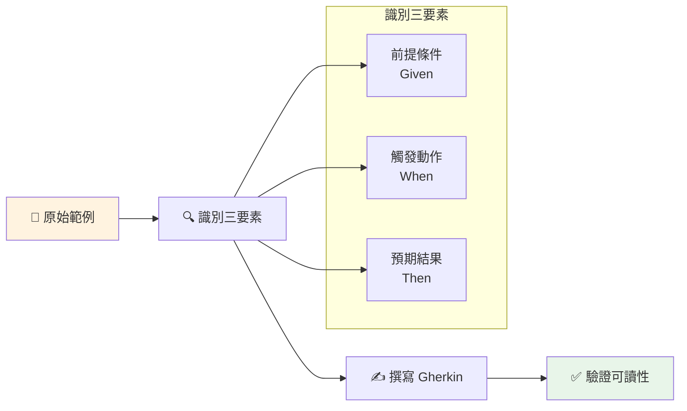
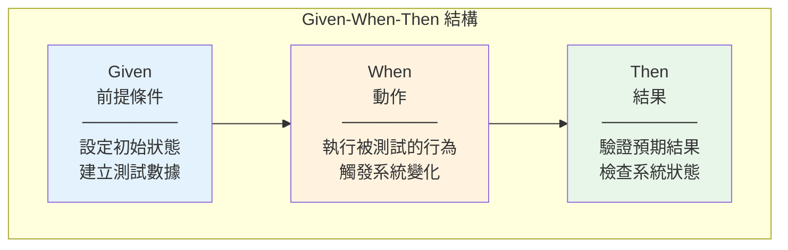
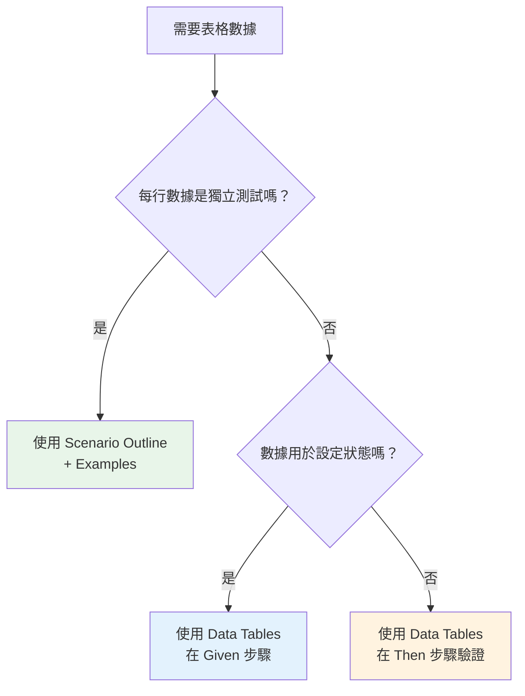
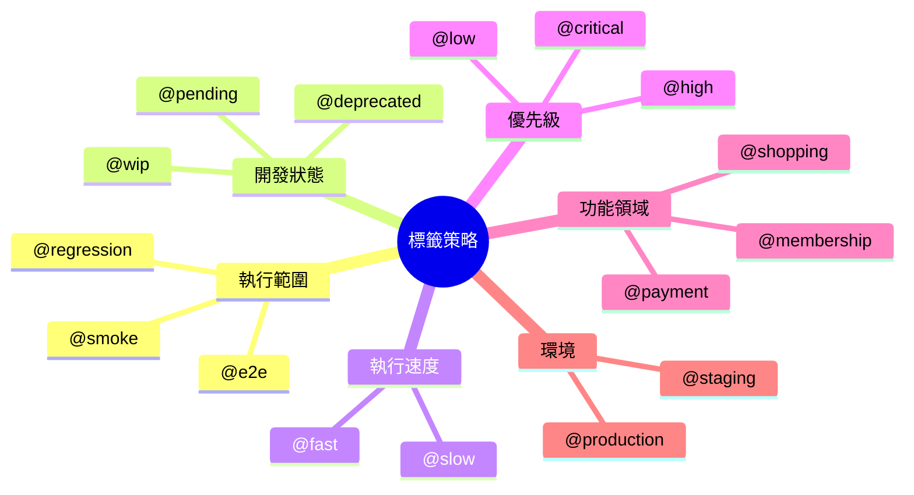
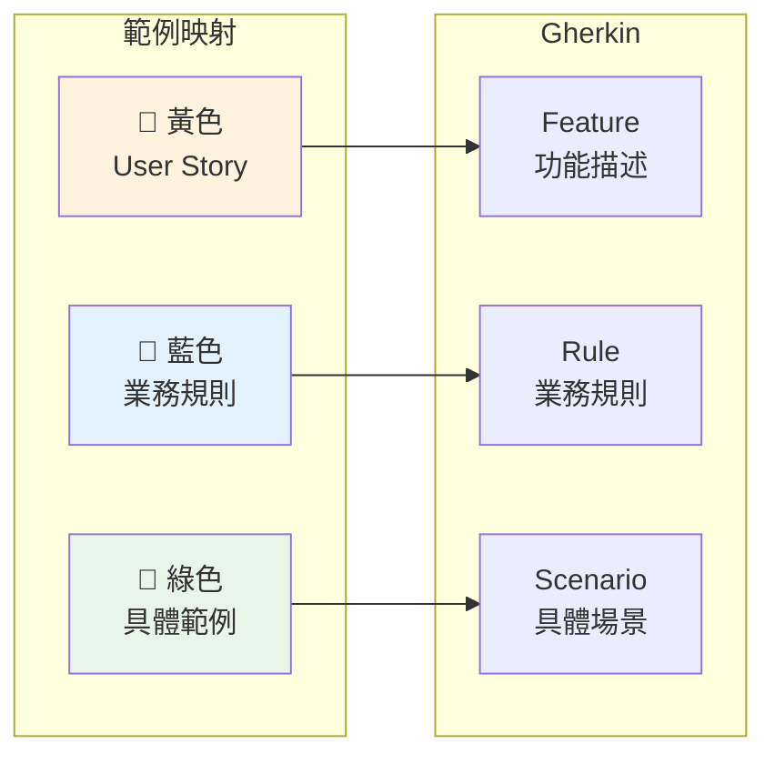
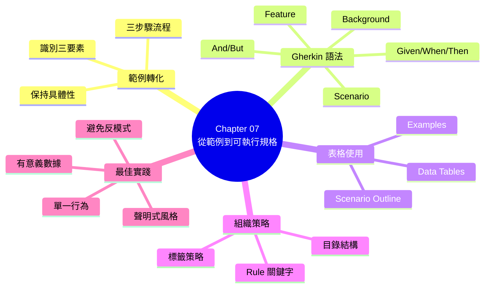

# Chapter 07：從範例到可執行規格

> 「清晰的思考需要清晰的語言。」
> —— Richard P. Feynman

---

## 本章目標

完成本章後，你將能夠：

- 將範例映射的成果轉化為 Gherkin 可執行規格
- 熟練運用 Gherkin 的所有關鍵字（Given/When/Then/And/But）
- 使用 Scenario Outline 和 Examples 表格處理多組測試數據
- 運用 Background 提取共用前置條件
- 掌握 Gherkin 6 的 Rule 關鍵字組織相關場景
- 設計表達力強、可維護的場景結構
- 識別並避免場景撰寫的常見反模式

---

## 從範例到規格的轉化

在上一章中，我們學會了如何透過三人小組會議和範例映射來探索需求。會議結束後，我們手中有了：

- 黃色卡片（User Story）
- 藍色卡片（業務規則）
- 綠色卡片（具體範例）
- 紅色卡片（待解決問題）

但這些卡片還只是**人類可讀**的記錄。我們需要將它們轉化為**機器可執行**的規格——這就是本章的核心任務。

讓我們回到 ReadMore 書店，看看團隊如何將「會員折扣」功能的範例轉化為可執行規格。

---

## 7.1 將具體範例轉換成可執行場景

### 7.1.1 從便利貼到 Gherkin

回顧上一章的範例映射成果，關於「會員折扣」功能，團隊識別了以下範例：

```
📒 業務規則：一般會員滿 500 享 5% 折扣

   ✅ 一般會員購買 400 元 → 無折扣（未達門檻）
   ✅ 一般會員購買 600 元 → 5% 折扣（達到門檻）
   ✅ 一般會員購買 500 元 → 5% 折扣（剛好達到門檻）

📒 業務規則：VIP 會員享有更高折扣

   ✅ VIP 會員購買 400 元 → 5% 折扣（無門檻折扣）
   ✅ VIP 會員購買 1000 元 → 10% 折扣（達到高額門檻）
```

現在，讓我們把第一個範例轉化為 Gherkin 格式：

**原始範例**：
> 一般會員購買 400 元 → 無折扣（未達門檻）

**轉化後的 Gherkin**：

```gherkin
Scenario: 一般會員訂單未達折扣門檻
  Given 我是一般會員
  When 我的訂單金額是 400 元
  Then 我應該獲得 0% 的折扣
```

**轉化過程分析**：

| 範例元素 | Gherkin 關鍵字 | 說明 |
|---------|---------------|------|
| 一般會員 | Given（前提）| 系統的初始狀態 |
| 購買 400 元 | When（動作）| 觸發行為的操作 |
| 無折扣 | Then（結果）| 預期的系統行為 |

**表 7.1：範例到 Gherkin 的元素對應**

### 7.1.2 保持範例的具體性

轉化過程中最重要的原則是：**保持具體**。

**錯誤示範**（過度抽象）：

```gherkin
# ❌ 不好的寫法：太抽象，失去了具體性
Scenario: 訂單折扣計算
  Given 一個會員
  When 下訂單
  Then 應該計算正確的折扣
```

這個場景的問題：
- 「一個會員」—— 什麼類型的會員？
- 「下訂單」—— 訂單金額是多少？
- 「正確的折扣」—— 具體是多少折扣？

**正確示範**（保持具體）：

```gherkin
# ✅ 好的寫法：保持具體的數值和條件
Scenario: 一般會員訂單未達折扣門檻
  Given 我是一般會員
  When 我的訂單金額是 400 元
  Then 我應該獲得 0% 的折扣
```

> 💡 **黃金法則**：如果你能從場景中讀出具體的測試數據，那就是好的場景。如果需要猜測才知道測試什麼，那就需要重寫。

### 7.1.3 範例轉化的三步驟流程



**圖 7.1：範例轉化的三步驟流程**

**步驟 1：識別三要素**

閱讀範例，回答三個問題：
- 系統處於什麼狀態？（Given）
- 發生了什麼事？（When）
- 預期什麼結果？（Then）

**步驟 2：撰寫 Gherkin**

使用識別出的三要素，組成完整的場景。

**步驟 3：驗證可讀性**

請一位沒參與討論的同事閱讀場景，問他們：
- 你理解這個場景在測試什麼嗎？
- 你能預測測試結果嗎？

如果答案是「是」，你的場景就成功了。

---

## 7.2 撰寫可執行場景：Gherkin 語法詳解

### 7.2.1 Gherkin 簡介

**Gherkin** 是一種領域特定語言（DSL），設計用於以結構化的自然語言描述軟體行為。它的名字來自醃黃瓜（cucumber 的原料），與 Cucumber 測試框架相呼應。

**Gherkin 的核心特點**：

- **人類可讀**：業務人員、開發者、測試者都能理解
- **機器可執行**：可以自動化執行
- **語言無關**：支援多種自然語言（包括中文）
- **結構化**：有固定的關鍵字和格式

### 7.2.2 Feature：功能描述

每個 `.feature` 檔案以 `Feature` 關鍵字開始，描述要測試的功能。

**基本結構**：

```gherkin
Feature: 會員折扣系統
  作為一個 ReadMore 書店的會員
  我想要在購物時自動獲得折扣
  以便享受會員專屬優惠
```

**語法解析**：

- **第一行**：功能名稱（簡潔明確）
- **後續行**：功能描述（通常採用 User Story 格式）

**User Story 格式**（可選但推薦）：

```
作為一個 <角色>
我想要 <功能>
以便 <價值>
```

這個格式回答了三個關鍵問題：

| 問題 | 關鍵字 | 說明 |
|------|--------|------|
| 誰需要這個功能？ | 作為一個... | 識別目標用戶 |
| 需要什麼功能？ | 我想要... | 描述功能本身 |
| 為什麼需要？ | 以便... | 說明業務價值 |

**表 7.2：User Story 格式的三個要素**

> 💡 **提示**：Feature 描述是給人看的，不會被自動化執行。但它非常重要——它提供了理解所有場景的上下文。

### 7.2.3 Scenario：具體場景

`Scenario` 是 Gherkin 的核心單元，描述一個具體的使用情境。

```gherkin
Feature: 會員折扣系統

  Scenario: 一般會員訂單達到折扣門檻
    Given 我是一般會員
    And 折扣規則是「滿 500 享 5% 折扣」
    When 我的訂單金額是 600 元
    Then 訂單應該顯示 5% 折扣
    And 我應該支付 570 元
```

**場景命名的最佳實踐**：

| 原則 | 好的例子 | 不好的例子 |
|------|---------|-----------|
| **描述行為，不描述實作** | 一般會員訂單達到折扣門檻 | 測試 calculateDiscount 方法 |
| **包含關鍵條件** | VIP 會員首次購買獲得額外優惠 | 測試案例 1 |
| **使用業務語言** | 購物車超過重量限制時顯示警告 | 驗證 weight > MAX_WEIGHT |
| **簡潔但完整** | 登入失敗後帳號鎖定 | 當用戶輸入錯誤密碼三次時帳號應該被鎖定 |

**表 7.3：場景命名最佳實踐**

### 7.2.4 Given/When/Then：場景的三段式結構

Gherkin 場景採用經典的 **Given-When-Then** 結構，這也被稱為 **Arrange-Act-Assert** 模式的自然語言版本。



**圖 7.2：Given-When-Then 結構**

**Given（假設/前提條件）**

描述場景開始前系統的狀態。

```gherkin
# 設定用戶狀態
Given 我已經登入系統
Given 我是 VIP 會員

# 設定數據狀態
Given 購物車中有以下商品:
  | 商品名稱 | 價格 | 數量 |
  | 程式設計入門 | 500 | 1 |
  | 資料結構 | 600 | 2 |

# 設定系統配置
Given 系統折扣規則如下:
  | 會員等級 | 門檻 | 折扣 |
  | 一般 | 500 | 5% |
  | VIP | 0 | 5% |
```

**When（當/動作）**

描述觸發被測試行為的動作。

```gherkin
# 用戶操作
When 我點擊「結帳」按鈕
When 我輸入優惠碼 "SUMMER2024"

# 系統事件
When 訂單金額計算完成
When 系統處理支付請求

# 時間觸發
When 會員資格到期日到達
When 促銷活動開始
```

**Then（那麼/預期結果）**

描述系統應該產生的結果。

```gherkin
# 驗證狀態變化
Then 訂單狀態應該是「已確認」
Then 我的積分餘額應該增加 100 點

# 驗證顯示內容
Then 我應該看到成功訊息「訂單已提交」
Then 頁面應該顯示折扣金額 30 元

# 驗證系統行為
Then 系統應該發送確認郵件
Then 庫存數量應該減少 1
```

### 7.2.5 And/But：連接多個步驟

當 Given、When 或 Then 需要多個步驟時，使用 `And` 或 `But` 連接。

**使用 And**：

```gherkin
Scenario: VIP 會員享受多重優惠
  Given 我是 VIP 會員
  And 我有 1000 點積分
  And 購物車中有一本 800 元的書
  When 我使用 500 點積分折抵
  And 我點擊結帳按鈕
  Then 積分應該扣除 500 點
  And 訂單金額應該是 760 元  # 800 - 50(積分) + 10(VIP 折扣)
  And 我應該獲得 76 點新積分
```

**使用 But**（強調例外或否定）：

```gherkin
Scenario: 折扣有使用限制
  Given 我是一般會員
  And 我有一張「滿 1000 減 100」優惠券
  When 我的訂單金額是 800 元
  Then 訂單應該顯示原價 800 元
  But 優惠券不應該被使用
  And 我應該看到提示「訂單未達優惠券使用門檻」
```

**And vs. But 的使用時機**：

| 關鍵字 | 使用時機 | 範例 |
|--------|---------|------|
| **And** | 添加同向的條件或結果 | Then 訂單成功 And 收到確認郵件 |
| **But** | 強調例外、否定或對比 | Then 登入成功 But 帳號被標記為可疑 |

**表 7.4：And 與 But 的使用時機**

> 💡 **技術細節**：`And` 和 `But` 在執行時與它們跟隨的關鍵字（Given/When/Then）完全相同，差異純粹是為了可讀性。

### 7.2.6 Background：共用前置條件

當多個場景有相同的前置條件時，使用 `Background` 提取共用步驟。

**重構前**（重複的 Given）：

```gherkin
Feature: 購物車管理

  Scenario: 添加商品到購物車
    Given 我已經登入系統
    And 我在商品頁面
    When 我點擊「加入購物車」
    Then 購物車數量應該顯示 1

  Scenario: 從購物車移除商品
    Given 我已經登入系統
    And 我在商品頁面
    And 購物車中有 1 件商品
    When 我點擊「移除」
    Then 購物車應該是空的
```

**重構後**（使用 Background）：

```gherkin
Feature: 購物車管理

  Background:
    Given 我已經登入系統
    And 我在商品頁面

  Scenario: 添加商品到購物車
    When 我點擊「加入購物車」
    Then 購物車數量應該顯示 1

  Scenario: 從購物車移除商品
    Given 購物車中有 1 件商品
    When 我點擊「移除」
    Then 購物車應該是空的
```

**Background 的最佳實踐**：

| 原則 | 說明 |
|------|------|
| **保持簡短** | Background 應該只有 1-3 個步驟 |
| **只包含真正共用的步驟** | 如果只有部分場景需要，不要放入 Background |
| **避免包含 When 或 Then** | Background 應該只設定狀態，不應該執行動作 |
| **不要包含表格數據** | 如果需要複雜的數據設定，考慮使用標籤或 Hooks |

**表 7.5：Background 的最佳實踐**

---

## 7.3 在場景中使用表格

### 7.3.1 Scenario Outline：參數化場景

當需要用多組數據測試同一個場景時，使用 `Scenario Outline` 搭配 `Examples` 表格。

**重構前**（重複的場景）：

```gherkin
Scenario: 一般會員購買 400 元無折扣
  Given 我是一般會員
  When 我的訂單金額是 400 元
  Then 我應該獲得 0% 的折扣

Scenario: 一般會員購買 500 元享 5% 折扣
  Given 我是一般會員
  When 我的訂單金額是 500 元
  Then 我應該獲得 5% 的折扣

Scenario: 一般會員購買 600 元享 5% 折扣
  Given 我是一般會員
  When 我的訂單金額是 600 元
  Then 我應該獲得 5% 的折扣
```

**重構後**（使用 Scenario Outline）：

```gherkin
Scenario Outline: 一般會員折扣計算
  Given 我是一般會員
  When 我的訂單金額是 <金額> 元
  Then 我應該獲得 <折扣>% 的折扣

  Examples: 未達門檻
    | 金額 | 折扣 |
    | 400  | 0    |
    | 499  | 0    |

  Examples: 達到門檻
    | 金額 | 折扣 |
    | 500  | 5    |
    | 600  | 5    |
    | 1000 | 5    |
```

**語法要點**：

- `<參數名>` —— 佔位符，會被 Examples 表格中的值替換
- `Examples:` —— 定義測試數據表格（可以有多個）
- 表格的第一行是欄位名稱，對應佔位符
- 每個數據行都會產生一個獨立的測試案例

### 7.3.2 多組 Examples 的使用

你可以為不同的測試情境命名 Examples：

```gherkin
Scenario Outline: 會員折扣計算
  Given 我是 <會員等級> 會員
  When 我的訂單金額是 <金額> 元
  Then 我應該獲得 <折扣>% 的折扣
  And 我應該支付 <實付金額> 元

  Examples: 一般會員 - 未達門檻
    | 會員等級 | 金額 | 折扣 | 實付金額 |
    | 一般     | 400  | 0    | 400      |
    | 一般     | 499  | 0    | 499      |

  Examples: 一般會員 - 達到門檻
    | 會員等級 | 金額 | 折扣 | 實付金額 |
    | 一般     | 500  | 5    | 475      |
    | 一般     | 1000 | 5    | 950      |

  Examples: VIP 會員優惠
    | 會員等級 | 金額 | 折扣 | 實付金額 |
    | VIP      | 400  | 5    | 380      |
    | VIP      | 1000 | 10   | 900      |
```

**優點**：
- 測試報告會依 Examples 名稱分組
- 更容易識別哪組測試失敗
- 提供額外的上下文說明

### 7.3.3 Data Tables：步驟中的表格

`Data Tables` 用於在單一步驟中傳遞結構化數據。

**範例：設定多筆測試數據**

```gherkin
Scenario: 批量計算多個訂單的折扣
  Given 系統中有以下會員:
    | 會員帳號 | 會員等級 | 積分餘額 |
    | alice    | 一般     | 500      |
    | bob      | VIP      | 2000     |
    | carol    | 一般     | 100      |
  And 以下訂單待處理:
    | 訂單編號 | 會員帳號 | 金額 |
    | ORD-001  | alice    | 600  |
    | ORD-002  | bob      | 800  |
    | ORD-003  | carol    | 300  |
  When 系統計算所有訂單的折扣
  Then 訂單折扣結果應該是:
    | 訂單編號 | 原始金額 | 折扣金額 | 實付金額 |
    | ORD-001  | 600      | 30       | 570      |
    | ORD-002  | 800      | 80       | 720      |
    | ORD-003  | 300      | 0        | 300      |
```

### 7.3.4 Scenario Outline vs. Data Tables

這兩種表格方式有不同的用途：

| 特性 | Scenario Outline + Examples | Data Tables |
|------|---------------------------|-------------|
| **用途** | 用相同步驟測試多組數據 | 在一個步驟中傳遞複雜數據 |
| **執行方式** | 每行數據產生獨立的測試 | 表格作為一個整體傳遞 |
| **適用場景** | 邊界值測試、等價類測試 | 批量數據設定、複雜驗證 |
| **報告顯示** | 多個獨立的測試結果 | 一個測試結果 |

**表 7.6：Scenario Outline 與 Data Tables 的比較**

**選擇指南**：



**圖 7.3：表格類型選擇指南**

---

## 7.4 使用功能檔案與標籤來組織場景

### 7.4.1 功能檔案的組織結構

隨著專案成長，你會有越來越多的 `.feature` 檔案。好的組織結構能讓團隊快速找到需要的場景。

**推薦的目錄結構**：

```
features/
├── membership/                    # 依功能領域分類
│   ├── registration.feature       # 會員註冊
│   ├── login.feature             # 會員登入
│   └── profile.feature           # 會員資料管理
├── shopping/
│   ├── cart.feature              # 購物車
│   ├── checkout.feature          # 結帳流程
│   └── discount.feature          # 折扣計算
├── order/
│   ├── create_order.feature      # 建立訂單
│   ├── order_status.feature      # 訂單狀態
│   └── cancellation.feature      # 訂單取消
└── support/
    ├── step_definitions/         # 步驟定義
    │   ├── membership_steps.ts
    │   ├── shopping_steps.ts
    │   └── order_steps.ts
    └── hooks.ts                  # 測試鉤子
```

**組織原則**：

| 原則 | 說明 | 範例 |
|------|------|------|
| **依功能領域** | 將相關功能放在同一目錄 | membership/, shopping/ |
| **一個功能一個檔案** | 每個 .feature 檔案聚焦單一功能 | login.feature, cart.feature |
| **檔名語意化** | 從檔名就能知道內容 | discount.feature, not test1.feature |
| **避免過深巢狀** | 目錄層級不超過 3 層 | features/shopping/cart.feature |

**表 7.7：功能檔案組織原則**

### 7.4.2 標籤策略

標籤（Tags）是組織和篩選場景的強大工具。

**基本語法**：

```gherkin
@membership @smoke
Feature: 會員登入

  @happy-path
  Scenario: 使用正確憑證成功登入
    Given 我在登入頁面
    When 我輸入有效的帳號和密碼
    Then 我應該成功登入

  @edge-case @security
  Scenario: 連續登入失敗後帳號被鎖定
    Given 我在登入頁面
    When 我連續輸入錯誤密碼 5 次
    Then 我的帳號應該被鎖定 30 分鐘
```

**常用標籤分類**：



**圖 7.4：標籤分類策略**

**標籤使用指南**：

| 標籤類型 | 標籤範例 | 用途 |
|---------|---------|------|
| **執行範圍** | @smoke, @regression | 選擇測試套件 |
| **開發狀態** | @wip, @pending | 排除未完成的測試 |
| **執行速度** | @slow, @fast | 控制 CI 時間 |
| **功能領域** | @membership, @shopping | 針對特定功能測試 |
| **環境** | @staging, @prod-safe | 控制執行環境 |
| **非功能** | @security, @performance | 標記特殊類型測試 |

**表 7.8：標籤使用指南**

### 7.4.3 執行特定標籤的場景

**Cucumber (Java/JavaScript)**：

```bash
# 執行 smoke 測試
npx cucumber-js --tags "@smoke"

# 執行 membership 相關測試，但排除 slow 測試
npx cucumber-js --tags "@membership and not @slow"

# 執行 critical 或 high 優先級測試
npx cucumber-js --tags "@critical or @high"
```

**標籤表達式語法**：

| 表達式 | 說明 |
|--------|------|
| `@smoke` | 有 @smoke 標籤的場景 |
| `@smoke and @fast` | 同時有兩個標籤的場景 |
| `@smoke or @regression` | 有任一標籤的場景 |
| `not @wip` | 沒有 @wip 標籤的場景 |
| `@membership and not @slow` | 組合條件 |

**表 7.9：標籤表達式語法**

---

## 7.5 規則與範例（Rules and Examples）

### 7.5.1 Gherkin 6 的 Rule 關鍵字

Gherkin 6 引入了 `Rule` 關鍵字，用於將相關場景組織在業務規則下。

**基本語法**：

```gherkin
Feature: 會員折扣系統

  Rule: 一般會員滿 500 享 5% 折扣

    Scenario: 訂單未達門檻
      Given 我是一般會員
      When 我的訂單金額是 400 元
      Then 折扣應該是 0%

    Scenario: 訂單達到門檻
      Given 我是一般會員
      When 我的訂單金額是 600 元
      Then 折扣應該是 5%

  Rule: VIP 會員享有更高折扣

    Scenario: VIP 基本折扣
      Given 我是 VIP 會員
      When 我的訂單金額是 400 元
      Then 折扣應該是 5%

    Scenario: VIP 高額訂單
      Given 我是 VIP 會員
      When 我的訂單金額是 1000 元
      Then 折扣應該是 10%
```

### 7.5.2 Rule 的價值

**沒有 Rule 的結構**：

```
Feature
├── Scenario 1
├── Scenario 2
├── Scenario 3
├── Scenario 4
└── Scenario 5
```

**使用 Rule 的結構**：

```
Feature
├── Rule A
│   ├── Scenario 1
│   └── Scenario 2
└── Rule B
    ├── Scenario 3
    ├── Scenario 4
    └── Scenario 5
```

**Rule 帶來的好處**：

| 好處 | 說明 |
|------|------|
| **可追溯性** | 場景直接對應業務規則 |
| **組織清晰** | 相關場景自然分組 |
| **報告改善** | 測試報告按規則分組顯示 |
| **維護容易** | 業務規則變更時，容易找到相關場景 |

**表 7.10：使用 Rule 的好處**

### 7.5.3 Rule 與範例映射的對應

回想上一章的範例映射，我們使用：
- **黃色卡片** → Feature
- **藍色卡片** → Rule
- **綠色卡片** → Scenario / Example



**圖 7.5：範例映射到 Gherkin 的對應關係**

這種對應讓你可以直接將範例映射的成果轉化為結構良好的 Gherkin 規格。

---

## 7.6 表達力強的場景：模式與反模式

### 7.6.1 聲明式 vs. 命令式

場景撰寫有兩種風格：**聲明式**（描述意圖）和**命令式**（描述操作）。

**命令式風格**（不推薦）：

```gherkin
# ❌ 命令式：描述每個 UI 操作
Scenario: 用戶登入
  Given 我打開瀏覽器
  And 我輸入網址 "https://readmore.com/login"
  And 頁面載入完成
  When 我找到 id 為 "username" 的輸入框
  And 我在該輸入框輸入 "alice"
  And 我找到 id 為 "password" 的輸入框
  And 我在該輸入框輸入 "password123"
  And 我找到 id 為 "login-button" 的按鈕
  And 我點擊該按鈕
  And 我等待 3 秒
  Then 頁面 URL 應該是 "https://readmore.com/home"
  And 頁面應該包含文字 "歡迎回來"
```

**聲明式風格**（推薦）：

```gherkin
# ✅ 聲明式：描述業務意圖
Scenario: 用戶使用正確憑證登入
  Given 我是已註冊的會員 "alice"
  When 我使用正確的密碼登入
  Then 我應該看到首頁的歡迎訊息
```

**比較**：

| 面向 | 命令式 | 聲明式 |
|------|--------|--------|
| **可讀性** | 低（太多細節） | 高（聚焦意圖）|
| **維護性** | 低（UI 變更就要改） | 高（實作細節隱藏）|
| **業務對齊** | 低（技術導向） | 高（業務導向）|
| **重用性** | 低（步驟太具體） | 高（步驟可重用）|

**表 7.11：命令式與聲明式風格比較**

### 7.6.2 單一行為原則

每個場景應該只測試**一個行為**。

**違反原則**（測試太多東西）：

```gherkin
# ❌ 一個場景測試多個行為
Scenario: 完整購物流程
  Given 我是 VIP 會員
  When 我搜尋 "程式設計"
  Then 我應該看到搜尋結果
  When 我將第一本書加入購物車
  Then 購物車數量應該是 1
  When 我輸入優惠碼 "SUMMER2024"
  Then 應該顯示優惠金額
  When 我點擊結帳
  Then 訂單應該建立成功
  When 我選擇信用卡付款
  Then 付款應該成功
  When 我查看訂單歷史
  Then 我應該看到新訂單
```

**遵守原則**（拆分成獨立場景）：

```gherkin
# ✅ 每個場景聚焦單一行為
Scenario: 搜尋商品
  Given 我在首頁
  When 我搜尋 "程式設計"
  Then 我應該看到相關的搜尋結果

Scenario: 將商品加入購物車
  Given 我在商品詳情頁
  When 我點擊「加入購物車」
  Then 購物車數量應該增加 1

Scenario: 使用優惠碼
  Given 購物車中有商品
  When 我輸入有效的優惠碼 "SUMMER2024"
  Then 訂單金額應該反映優惠折扣
```

### 7.6.3 使用有意義的數據

測試數據應該**有意義**，讓讀者理解為什麼選擇這些值。

**無意義的數據**：

```gherkin
# ❌ 數據沒有業務意義
Scenario: 折扣計算
  Given 訂單金額是 123 元
  When 計算折扣
  Then 折扣應該是 0 元
```

**有意義的數據**：

```gherkin
# ✅ 數據反映業務邊界
Scenario: 訂單金額差一元未達折扣門檻
  Given 折扣門檻是 500 元
  And 訂單金額是 499 元
  When 計算折扣
  Then 折扣應該是 0 元
  And 應該顯示「再消費 1 元即可享 5% 折扣」
```

### 7.6.4 常見反模式

**反模式 1：場景過長**

```gherkin
# ❌ 太多步驟
Scenario: 複雜流程
  Given 條件 1
  And 條件 2
  And 條件 3
  And 條件 4
  And 條件 5
  When 動作 1
  And 動作 2
  And 動作 3
  Then 結果 1
  And 結果 2
  And 結果 3
  And 結果 4
  And 結果 5
```

**解決方案**：
- 拆分成多個場景
- 使用更抽象的步驟描述
- 檢查是否在測試多個行為

**反模式 2：UI 細節洩漏**

```gherkin
# ❌ 暴露 UI 實作細節
Scenario: 登入
  When 我點擊 id 為 "login-btn" 的按鈕
  And 我在 class 為 "input-field" 的欄位輸入
  Then div.success-message 應該顯示
```

**解決方案**：

```gherkin
# ✅ 使用業務語言
Scenario: 登入
  When 我點擊登入按鈕
  And 我輸入帳號和密碼
  Then 我應該看到登入成功訊息
```

**反模式 3：測試實作而非行為**

```gherkin
# ❌ 測試程式碼實作
Scenario: 驗證 calculateDiscount 方法
  Given OrderService 已初始化
  When 呼叫 calculateDiscount(500)
  Then 回傳值應該是 25
```

**解決方案**：

```gherkin
# ✅ 測試業務行為
Scenario: 訂單折扣計算
  Given 我是一般會員
  When 我的訂單金額是 500 元
  Then 我應該獲得 25 元的折扣
```

**反模式清單**：

| 反模式 | 症狀 | 解決方案 |
|--------|------|---------|
| **場景過長** | > 10 個步驟 | 拆分場景或提高抽象層次 |
| **UI 細節洩漏** | 包含 CSS 選擇器、HTML 元素 | 使用業務語言描述 |
| **測試實作** | 提到類名、方法名 | 聚焦業務行為 |
| **無意義數據** | 123, test, xxx | 使用反映業務邊界的數據 |
| **重複步驟** | 多個場景有大量相同步驟 | 使用 Background 或重構步驟 |
| **Then 中有 When** | 驗證步驟包含動作 | 分離動作和驗證 |

**表 7.12：場景撰寫反模式清單**

---

## 7.7 那麼，所有的細節去哪了呢？

### 7.7.1 抽象層次的選擇

你可能會問：「如果場景這麼抽象，那些具體的實作細節在哪裡？」

答案是：**在 Step Definitions 中**。

Gherkin 場景描述「做什麼」和「期待什麼」，Step Definitions 描述「怎麼做」。

```mermaid
graph TB
    subgraph 業務層[業務層 - Gherkin]
        S[Scenario: 用戶登入成功<br/>────────────────<br/>Given 我是註冊用戶 Alice<br/>When 我使用正確密碼登入<br/>Then 我應該看到首頁]
    end

    subgraph 技術層[技術層 - Step Definitions]
        D1[Given 我是註冊用戶 {string}<br/>────────────────<br/>await db.createUser...]
        D2[When 我使用正確密碼登入<br/>────────────────<br/>await page.fill...<br/>await page.click...]
        D3[Then 我應該看到首頁<br/>────────────────<br/>await expect...]
    end

    S --> D1
    S --> D2
    S --> D3

    style S fill:#e3f2fd
    style D1 fill:#fff3e0
    style D2 fill:#fff3e0
    style D3 fill:#fff3e0
```

**圖 7.6：場景與 Step Definitions 的分層**

### 7.7.2 Step Definitions 範例

**TypeScript (Cucumber.js)**：

```typescript
// steps/login.steps.ts
import { Given, When, Then } from '@cucumber/cucumber';
import { expect } from '@playwright/test';

Given('我是註冊用戶 {string}', async function(username: string) {
  // 技術細節：建立測試用戶
  await this.db.createUser({
    username,
    password: 'default-password',
    status: 'active'
  });
});

When('我使用正確密碼登入', async function() {
  // 技術細節：填寫登入表單
  await this.page.goto('/login');
  await this.page.fill('#username', this.currentUser.username);
  await this.page.fill('#password', 'default-password');
  await this.page.click('#login-button');
  await this.page.waitForNavigation();
});

Then('我應該看到首頁', async function() {
  // 技術細節：驗證頁面
  await expect(this.page).toHaveURL('/home');
  await expect(this.page.locator('.welcome-message')).toBeVisible();
});
```

**Java (Cucumber)**：

```java
// steps/LoginSteps.java
public class LoginSteps {

    @Given("我是註冊用戶 {string}")
    public void createUser(String username) {
        // 技術細節：建立測試用戶
        userService.createUser(username, "default-password");
    }

    @When("我使用正確密碼登入")
    public void loginWithCorrectPassword() {
        // 技術細節：執行登入
        loginPage.navigate();
        loginPage.enterUsername(currentUser.getUsername());
        loginPage.enterPassword("default-password");
        loginPage.clickLogin();
    }

    @Then("我應該看到首頁")
    public void shouldSeeHomePage() {
        // 技術細節：驗證結果
        assertThat(driver.getCurrentUrl()).contains("/home");
        assertThat(homePage.getWelcomeMessage()).isDisplayed();
    }
}
```

### 7.7.3 保持場景的可讀性

場景應該讓**非技術人員**也能理解。檢查方式：

> 把場景給產品經理或業務分析師看，問他們：「你理解這在測試什麼嗎？」

如果他們需要看程式碼才能理解，你的場景抽象層次可能太低了。

---

## 核心產出物

### 產出物 1：Gherkin 語法速查表

```
┌─────────────────────────────────────────────────────────────────┐
│                    Gherkin 語法速查表                           │
├─────────────────────────────────────────────────────────────────┤
│                                                                 │
│  【結構關鍵字】                                                  │
│  ─────────────                                                  │
│  Feature:     功能描述（每個檔案一個）                           │
│  Rule:        業務規則（Gherkin 6+）                            │
│  Background:  共用前置條件                                       │
│  Scenario:    具體場景                                          │
│  Scenario Outline: 參數化場景                                   │
│  Examples:    測試數據表格                                       │
│                                                                 │
│  【步驟關鍵字】                                                  │
│  ─────────────                                                  │
│  Given  設定前提條件（系統狀態）                                  │
│  When   執行動作（觸發行為）                                     │
│  Then   驗證結果（預期狀態）                                     │
│  And    連接同類步驟                                            │
│  But    強調例外或否定                                          │
│                                                                 │
│  【數據結構】                                                    │
│  ─────────────                                                  │
│  | col1 | col2 |    Data Table（步驟內數據）                    │
│  | val1 | val2 |                                                │
│                                                                 │
│  <placeholder>      Scenario Outline 參數佔位符                 │
│                                                                 │
│  """                                                            │
│  多行文字           Doc Strings（長文字內容）                    │
│  """                                                            │
│                                                                 │
│  【標籤】                                                        │
│  ─────────────                                                  │
│  @tag-name          標籤（用於篩選和組織）                       │
│  @smoke @regression 可以有多個標籤                               │
│                                                                 │
│  【註解】                                                        │
│  ─────────────                                                  │
│  # 這是註解        井號開頭的行會被忽略                          │
│                                                                 │
└─────────────────────────────────────────────────────────────────┘
```

### 產出物 2：場景撰寫檢查清單

```markdown
## 場景撰寫檢查清單

### 命名檢查
- [ ] 場景名稱描述行為，不是實作？
- [ ] 場景名稱包含關鍵的業務條件？
- [ ] 使用業務語言，而非技術術語？

### 結構檢查
- [ ] 場景只測試一個行為？
- [ ] 步驟數量合理（通常 3-7 個）？
- [ ] Given/When/Then 順序正確？
- [ ] 沒有在 Then 中執行動作？

### 數據檢查
- [ ] 測試數據有業務意義？
- [ ] 邊界值已被覆蓋？
- [ ] 沒有使用無意義的測試數據（如 test, 123）？

### 可讀性檢查
- [ ] 非技術人員能理解場景意圖？
- [ ] 沒有暴露 UI 實作細節？
- [ ] 沒有暴露程式碼實作細節？

### 維護性檢查
- [ ] 重複的前置條件已提取到 Background？
- [ ] 類似場景使用 Scenario Outline？
- [ ] 相關場景用 Rule 組織？
- [ ] 適當使用標籤分類？

### 反模式檢查
- [ ] 沒有超長場景（>10 步驟）？
- [ ] 沒有 CSS 選擇器或 HTML 元素？
- [ ] 沒有程式碼類名或方法名？
- [ ] 沒有硬編碼的等待時間？
```

### 產出物 3：Feature 檔案範本

```gherkin
# features/membership/discount.feature

@membership @discount
Feature: 會員折扣計算
  作為一個 ReadMore 書店的會員
  我想要在購物時自動獲得會員折扣
  以便享受會員專屬的購物優惠

  Background:
    Given 系統已載入標準折扣規則

  Rule: 一般會員滿 500 享 5% 折扣

    @smoke
    Scenario: 訂單達到折扣門檻
      Given 我是一般會員
      When 我的訂單金額是 600 元
      Then 我應該獲得 5% 的折扣
      And 實付金額應該是 570 元

    Scenario Outline: 一般會員折扣邊界測試
      Given 我是一般會員
      When 我的訂單金額是 <金額> 元
      Then 我應該獲得 <折扣>% 的折扣

      Examples: 未達門檻
        | 金額 | 折扣 |
        | 499  | 0    |
        | 400  | 0    |

      Examples: 達到門檻
        | 金額 | 折扣 |
        | 500  | 5    |
        | 501  | 5    |

  Rule: VIP 會員享有進階折扣

    Scenario: VIP 會員無門檻享 5% 折扣
      Given 我是 VIP 會員
      When 我的訂單金額是 100 元
      Then 我應該獲得 5% 的折扣

    @slow
    Scenario: VIP 會員高額訂單享 10% 折扣
      Given 我是 VIP 會員
      When 我的訂單金額是 1000 元
      Then 我應該獲得 10% 的折扣
```

---

## 7.8 章節總結

### 本章重點回顧



**圖 7.7：本章知識架構**

### 關鍵概念總結

| 概念 | 說明 |
|------|------|
| **Gherkin** | 結構化自然語言，用於描述軟體行為 |
| **Feature** | 功能描述，每個檔案一個 |
| **Scenario** | 具體的測試場景 |
| **Given-When-Then** | 場景的三段式結構 |
| **Background** | 多場景共用的前置條件 |
| **Scenario Outline** | 參數化場景，配合 Examples 使用 |
| **Rule** | Gherkin 6 新增，組織相關場景 |
| **Tags** | 標籤，用於篩選和組織場景 |
| **聲明式風格** | 描述意圖而非操作細節 |
| **Step Definitions** | 將 Gherkin 步驟轉為可執行程式碼 |

**表 7.13：本章關鍵概念**

### 實踐清單

完成本章學習後，你應該能夠：

- [ ] 將範例映射的成果轉化為 Gherkin 格式
- [ ] 正確使用所有 Gherkin 關鍵字
- [ ] 設計可維護的場景結構
- [ ] 使用標籤有效組織測試套件
- [ ] 識別並重構有問題的場景
- [ ] 選擇適當的抽象層次撰寫場景

---

## 下一章預告

在本章中，我們學會了如何將範例轉化為結構良好的 Gherkin 可執行規格。但這些規格目前還只是「文件」——它們描述了預期行為，卻還不能自動執行。

在下一章「**從可執行規格到自動化驗收測試**」中，我們將：

- 設定 Cucumber 測試環境（Java 和 JavaScript）
- 撰寫 Step Definitions 將場景自動化
- 執行第一個自動化測試
- 建立持續整合中的自動化流程

準備好讓你的規格「動」起來了嗎？讓我們繼續前進！

---

**本章字數**：約 25,000 字
**建議閱讀時間**：90 分鐘
**動手實作時間**：120 分鐘
