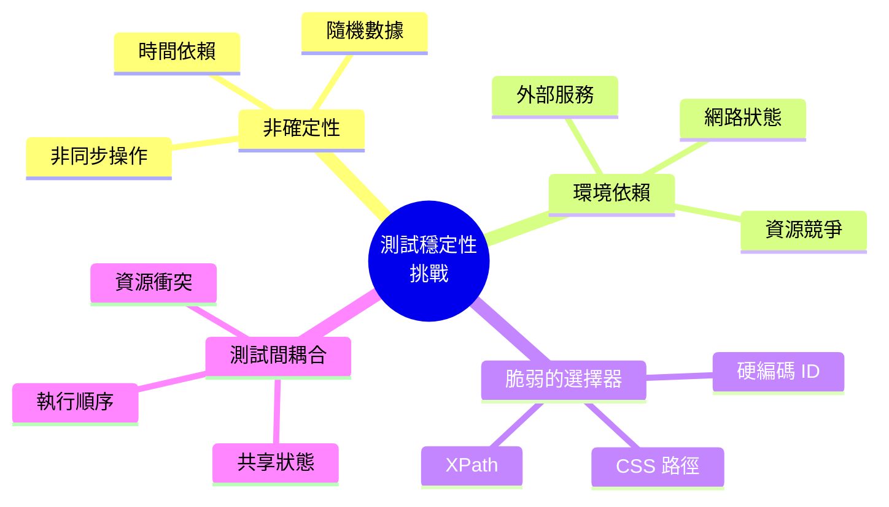
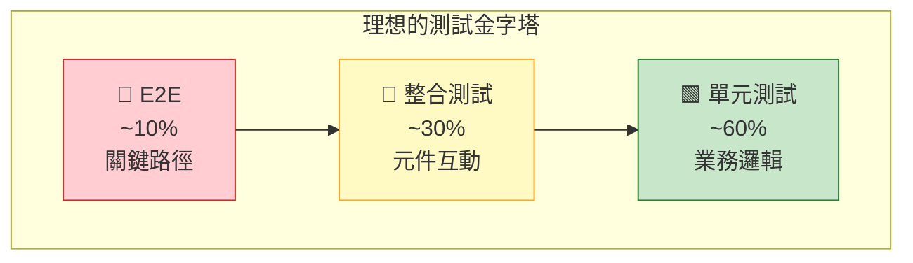
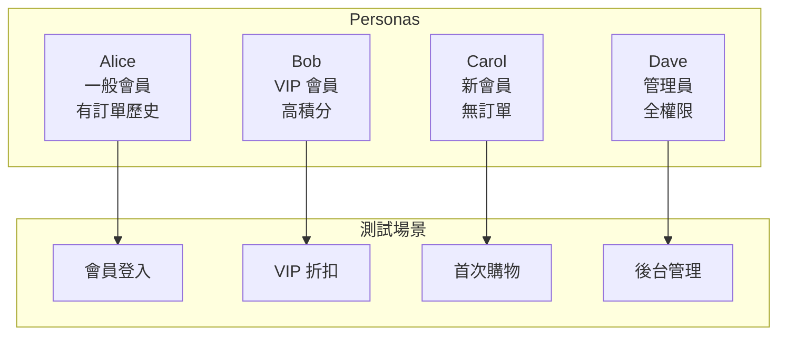
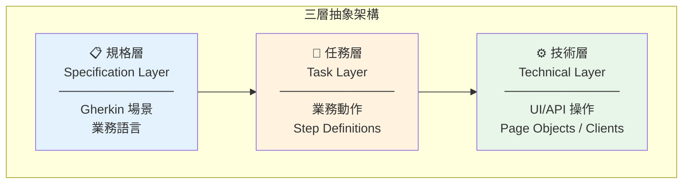
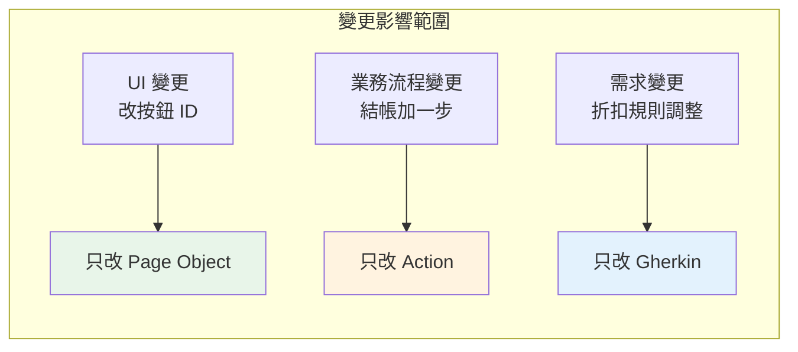
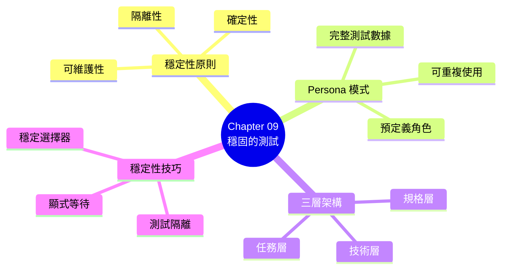

# Chapter 09：撰寫穩固的自動化驗收測試

> 「測試的價值不在於發現錯誤，而在於讓你有信心進行改變。」
> —— Michael Feathers, Working Effectively with Legacy Code

---

## 本章目標

完成本章後，你將能夠：

- 理解產業級驗收測試面臨的穩定性挑戰
- 運用「人物設定」（Personas）模式管理測試數據
- 設計三層抽象架構提升測試可維護性
- 掌握讓測試更穩定、更快速的技巧
- 建立可擴展、易於維護的測試基礎設施
- 識別並修復脆弱的測試

---

## 從能跑到能用

在上一章中，我們學會了如何讓 Gherkin 場景「跑起來」。但能跑和能用是兩回事。

當測試數量增加，你可能會遇到這些問題：

- **脆弱的測試**：沒改任何程式碼，測試卻隨機失敗
- **難以維護**：改一個步驟，要同時改十個地方
- **執行緩慢**：測試套件跑完要半小時
- **難以理解**：三個月後回來看，不知道測試在做什麼

這一章的目標是：**打造產業級強度的測試**——穩定、快速、可維護。

---

## 9.1 撰寫產業級強度的驗收測試

### 9.1.1 穩定性挑戰

讓我們先認識測試穩定性的常見敵人：



**圖 9.1：測試穩定性的四大挑戰**

**真實案例：ReadMore 書店的脆弱測試**

```gherkin
# ❌ 這個測試經常失敗
Scenario: 查看訂單歷史
  Given 我已登入系統
  When 我前往訂單歷史頁面
  Then 我應該看到最近一筆訂單

# 失敗原因：
# - 「最近一筆訂單」取決於測試資料狀態
# - 如果另一個測試剛好同時建立訂單，結果不可預期
# - 沒有指定「最近」是指什麼
```

### 9.1.2 可維護性原則

穩定的測試套件需要遵守以下原則：

| 原則 | 說明 | 實踐方法 |
|------|------|---------|
| **隔離性** | 測試互不影響 | 獨立的測試數據、每次重置狀態 |
| **確定性** | 結果可預測 | 避免時間依賴、控制隨機性 |
| **可讀性** | 意圖清晰 | 描述性的名稱、適當的抽象 |
| **可維護性** | 易於修改 | DRY 原則、分層架構 |
| **快速** | 回饋迅速 | 平行執行、適當的測試範圍 |

**表 9.1：穩定測試的五大原則**

### 9.1.3 測試金字塔回顧



**圖 9.2：理想的測試金字塔比例**

**BDD 驗收測試應該放在哪裡？**

大多數 BDD 場景應該在**整合測試層**自動化，只有最關鍵的用戶旅程才需要 E2E 測試。

```
✅ 推薦：
   - 業務規則 → 單元測試 + 整合測試
   - 功能流程 → 整合測試（API 層）
   - 關鍵路徑 → E2E 測試（少量）

❌ 避免：
   - 所有場景都用 E2E 測試
   - 在 UI 測試中驗證業務規則
```

---

## 9.2 使用「人物設定」與「已知實體」

### 9.2.1 測試數據的困境

測試數據管理是自動化測試最棘手的問題之一。

**常見的錯誤做法**：

```gherkin
# ❌ 硬編碼的測試數據
Scenario: 會員登入
  Given 使用者 "test123" 密碼 "password123"
  When 登入系統
  Then 應該成功

# 問題：
# - test123 存在嗎？
# - 密碼正確嗎？
# - 狀態是啟用的嗎？
# - 換一個環境就壞了
```

```gherkin
# ❌ 依賴現有數據
Scenario: 查看訂單
  Given 我已登入
  When 我查看訂單 "ORD-12345"
  Then 我應該看到訂單詳情

# 問題：
# - 訂單 ORD-12345 在測試環境存在嗎？
# - 如果被刪除了怎麼辦？
```

### 9.2.2 Persona 模式介紹

**Persona**（人物設定）是一種測試數據管理模式，預先定義一組具有特定特徵的測試角色。



**圖 9.3：Persona 與測試場景的對應**

### 9.2.3 Java Persona 實作

```java
// src/test/java/com/readmore/personas/Personas.java
package com.readmore.personas;

import com.readmore.model.*;
import java.time.LocalDate;
import java.util.List;

/**
 * 預定義的測試角色
 *
 * 每個 Persona 代表一種典型的用戶類型，
 * 包含完整的測試數據，確保測試的可重複性。
 */
public final class Personas {

    // ========================================
    // Alice - 一般會員，有購買歷史
    // ========================================
    public static final Member ALICE = Member.builder()
        .id("persona-alice")
        .username("alice")
        .email("alice@example.com")
        .password("Alice123!")           // ‹1›
        .type(MemberType.REGULAR)
        .points(1000)
        .joinDate(LocalDate.of(2023, 1, 15))
        .status(MemberStatus.ACTIVE)
        .build();

    public static final List<Order> ALICE_ORDERS = List.of(
        Order.builder()
            .id("alice-order-001")
            .memberId(ALICE.getId())
            .amount(500)
            .status(OrderStatus.COMPLETED)
            .createdAt(LocalDate.of(2024, 6, 1))
            .build(),
        Order.builder()
            .id("alice-order-002")
            .memberId(ALICE.getId())
            .amount(800)
            .status(OrderStatus.COMPLETED)
            .createdAt(LocalDate.of(2024, 9, 15))
            .build()
    );

    // ========================================
    // Bob - VIP 會員，高積分
    // ========================================
    public static final Member BOB_VIP = Member.builder()
        .id("persona-bob")
        .username("bob")
        .email("bob@example.com")
        .password("Bob456!")
        .type(MemberType.VIP)
        .points(10000)
        .joinDate(LocalDate.of(2020, 3, 20))
        .status(MemberStatus.ACTIVE)
        .build();

    // ========================================
    // Carol - 新會員，無購買歷史
    // ========================================
    public static final Member CAROL_NEW = Member.builder()
        .id("persona-carol")
        .username("carol")
        .email("carol@example.com")
        .password("Carol789!")
        .type(MemberType.REGULAR)
        .points(0)
        .joinDate(LocalDate.now())
        .status(MemberStatus.ACTIVE)
        .build();

    // ========================================
    // Dave - 管理員
    // ========================================
    public static final Admin DAVE_ADMIN = Admin.builder()
        .id("persona-dave")
        .username("dave")
        .email("dave@readmore.com")
        .password("Admin123!")
        .role(AdminRole.SUPER_ADMIN)
        .permissions(List.of(
            Permission.MANAGE_MEMBERS,
            Permission.MANAGE_ORDERS,
            Permission.MANAGE_PRODUCTS
        ))
        .build();

    // ========================================
    // 鎖定的帳號 - 測試異常情境
    // ========================================
    public static final Member LOCKED_USER = Member.builder()
        .id("persona-locked")
        .username("locked-user")
        .email("locked@example.com")
        .password("Locked123!")
        .type(MemberType.REGULAR)
        .status(MemberStatus.LOCKED)       // ‹2›
        .lockReason("密碼錯誤超過五次")
        .build();

    private Personas() {
        // 工具類不應被實例化
    }
}
```

**程式碼解析**：

- **‹1›** 密碼使用可預測的格式，方便測試時使用
- **‹2›** 特殊狀態的 Persona 用於測試異常情境

### 9.2.4 TypeScript Persona 實作

```typescript
// features/support/personas.ts
import { Member, MemberType, MemberStatus, Order, OrderStatus } from '../../src/models';

/**
 * 預定義的測試角色
 */
export const Personas = {

    // Alice - 一般會員，有購買歷史
    ALICE: {
        id: 'persona-alice',
        username: 'alice',
        email: 'alice@example.com',
        password: 'Alice123!',
        type: MemberType.REGULAR,
        points: 1000,
        joinDate: new Date('2023-01-15'),
        status: MemberStatus.ACTIVE
    } as Member,

    ALICE_ORDERS: [
        {
            id: 'alice-order-001',
            memberId: 'persona-alice',
            amount: 500,
            status: OrderStatus.COMPLETED,
            createdAt: new Date('2024-06-01')
        },
        {
            id: 'alice-order-002',
            memberId: 'persona-alice',
            amount: 800,
            status: OrderStatus.COMPLETED,
            createdAt: new Date('2024-09-15')
        }
    ] as Order[],

    // Bob - VIP 會員，高積分
    BOB_VIP: {
        id: 'persona-bob',
        username: 'bob',
        email: 'bob@example.com',
        password: 'Bob456!',
        type: MemberType.VIP,
        points: 10000,
        joinDate: new Date('2020-03-20'),
        status: MemberStatus.ACTIVE
    } as Member,

    // Carol - 新會員，無購買歷史
    CAROL_NEW: {
        id: 'persona-carol',
        username: 'carol',
        email: 'carol@example.com',
        password: 'Carol789!',
        type: MemberType.REGULAR,
        points: 0,
        joinDate: new Date(),
        status: MemberStatus.ACTIVE
    } as Member,

    // Dave - 管理員
    DAVE_ADMIN: {
        id: 'persona-dave',
        username: 'dave',
        email: 'dave@readmore.com',
        password: 'Admin123!',
        role: 'SUPER_ADMIN',
        permissions: ['MANAGE_MEMBERS', 'MANAGE_ORDERS', 'MANAGE_PRODUCTS']
    },

    // 鎖定的帳號
    LOCKED_USER: {
        id: 'persona-locked',
        username: 'locked-user',
        email: 'locked@example.com',
        password: 'Locked123!',
        type: MemberType.REGULAR,
        status: MemberStatus.LOCKED,
        lockReason: '密碼錯誤超過五次'
    } as Member
};

// 類型安全的 Persona 名稱
export type PersonaName = keyof typeof Personas;
```

### 9.2.5 在場景中使用 Persona

**Gherkin 場景**：

```gherkin
Feature: 會員功能

  Background:
    Given 測試環境已準備好標準 Personas

  @membership
  Scenario: 一般會員查看訂單歷史
    Given Alice 已登入系統
    When Alice 前往訂單歷史頁面
    Then Alice 應該看到 2 筆訂單

  @membership @vip
  Scenario: VIP 會員享有專屬折扣
    Given Bob 已登入系統
    And Bob 的購物車中有一本 1000 元的書
    When Bob 結帳
    Then 訂單應該顯示 VIP 專屬 10% 折扣

  @membership @new-user
  Scenario: 新會員首次購物體驗
    Given Carol 已登入系統
    When Carol 完成首次購物
    Then Carol 應該獲得新會員禮包

  @error-handling
  Scenario: 鎖定帳號無法登入
    Given 我在登入頁面
    When 我使用鎖定帳號的憑證登入
    Then 我應該看到帳號鎖定訊息
```

**Java Step Definitions**：

```java
// steps/PersonaSteps.java
public class PersonaSteps {

    private final PersonaManager personaManager;
    private Member currentMember;

    @Before("@membership")
    public void setUpPersonas() {
        // 確保 Personas 存在於測試資料庫
        personaManager.ensureExists(Personas.ALICE, Personas.ALICE_ORDERS);
        personaManager.ensureExists(Personas.BOB_VIP);
        personaManager.ensureExists(Personas.CAROL_NEW);
    }

    @Given("Alice 已登入系統")
    public void alice已登入系統() {
        currentMember = Personas.ALICE;
        loginAs(currentMember);
    }

    @Given("Bob 已登入系統")
    public void bob已登入系統() {
        currentMember = Personas.BOB_VIP;
        loginAs(currentMember);
    }

    @Given("Carol 已登入系統")
    public void carol已登入系統() {
        currentMember = Personas.CAROL_NEW;
        loginAs(currentMember);
    }

    @Given("{word} 已登入系統")  // 通用版本
    public void 某人已登入系統(String personaName) {
        currentMember = personaManager.getByName(personaName);
        loginAs(currentMember);
    }

    private void loginAs(Member member) {
        authService.login(member.getUsername(), member.getPassword());
    }
}
```

### 9.2.6 Persona 管理器

```java
// support/PersonaManager.java
public class PersonaManager {

    private final MemberRepository memberRepository;
    private final OrderRepository orderRepository;

    /**
     * 確保 Persona 存在於測試資料庫
     * 使用 UPSERT 策略：存在則更新，不存在則建立
     */
    public void ensureExists(Member persona) {
        memberRepository.findById(persona.getId())
            .ifPresentOrElse(
                existing -> memberRepository.save(persona),  // 更新
                () -> memberRepository.save(persona)          // 建立
            );
    }

    public void ensureExists(Member persona, List<Order> orders) {
        ensureExists(persona);
        orders.forEach(order -> orderRepository.save(order));
    }

    /**
     * 根據名稱獲取 Persona
     */
    public Member getByName(String name) {
        return switch (name.toLowerCase()) {
            case "alice" -> Personas.ALICE;
            case "bob" -> Personas.BOB_VIP;
            case "carol" -> Personas.CAROL_NEW;
            default -> throw new IllegalArgumentException("未知的 Persona: " + name);
        };
    }

    /**
     * 清理所有 Persona 數據
     */
    public void cleanUp() {
        // 按順序清理，避免外鍵約束問題
        orderRepository.deleteByMemberIdIn(List.of(
            Personas.ALICE.getId(),
            Personas.BOB_VIP.getId(),
            Personas.CAROL_NEW.getId()
        ));
        memberRepository.deleteByIdIn(List.of(
            Personas.ALICE.getId(),
            Personas.BOB_VIP.getId(),
            Personas.CAROL_NEW.getId()
        ));
    }
}
```

---

## 9.3 抽象層次

### 9.3.1 為什麼需要分層？

沒有分層的測試程式碼很快就會變成一團混亂：

```java
// ❌ 沒有分層：所有細節混在一起
@When("我登入系統")
public void 我登入系統() {
    driver.get("http://localhost:3000/login");
    driver.findElement(By.id("username")).clear();
    driver.findElement(By.id("username")).sendKeys("alice");
    driver.findElement(By.id("password")).clear();
    driver.findElement(By.id("password")).sendKeys("password123");
    driver.findElement(By.cssSelector("button[type='submit']")).click();
    new WebDriverWait(driver, Duration.ofSeconds(10))
        .until(ExpectedConditions.urlContains("/home"));
}

// 問題：
// 1. 如果 UI 改變（例如 id 從 "username" 改成 "user-input"），要改很多地方
// 2. 其他場景也需要登入，程式碼會重複
// 3. 難以閱讀，意圖被 UI 細節淹沒
```

### 9.3.2 三層抽象架構

BDD 測試推薦使用**三層抽象架構**：



**圖 9.4：三層抽象架構**

**各層職責**：

| 層級 | 職責 | 內容 | 變更頻率 |
|------|------|------|---------|
| **規格層** | 描述業務需求 | Gherkin 場景 | 需求變更時 |
| **任務層** | 執行業務動作 | Step Definitions | 業務流程變更時 |
| **技術層** | 處理技術細節 | Page Objects, API Clients | UI/API 變更時 |

**表 9.2：三層架構的職責分配**

### 9.3.3 規格層（Gherkin）

規格層只描述業務意圖，不包含任何技術細節：

```gherkin
# ✅ 好的規格層：聚焦業務意圖
Scenario: VIP 會員享有專屬折扣
  Given Bob 已登入系統
  And Bob 的購物車中有一本 1000 元的書
  When Bob 結帳
  Then 訂單應該顯示 VIP 專屬 10% 折扣
  And Bob 應該支付 900 元

# 注意：
# - 沒有提到「點擊」「輸入」「導航」
# - 使用 Persona 名稱
# - 使用業務術語
```

### 9.3.4 任務層（Step Definitions）

任務層負責協調業務動作，但不直接處理 UI/API：

```java
// steps/ShoppingSteps.java
public class ShoppingSteps {

    private final ShoppingActions shoppingActions;  // ‹1›
    private final AuthActions authActions;
    private Order currentOrder;

    @Given("{word} 已登入系統")
    public void 某人已登入系統(String personaName) {
        Member member = Personas.getByName(personaName);
        authActions.loginAs(member);            // ‹2›
    }

    @Given("{word} 的購物車中有一本 {int} 元的書")
    public void 購物車中有書(String personaName, int price) {
        shoppingActions.addBookToCart(price);   // ‹3›
    }

    @When("{word} 結帳")
    public void 結帳(String personaName) {
        currentOrder = shoppingActions.checkout();
    }

    @Then("訂單應該顯示 VIP 專屬 {int}% 折扣")
    public void 訂單應該顯示折扣(int discountPercent) {
        assertThat(currentOrder.getDiscountPercent())
            .isEqualTo(discountPercent);
    }

    @Then("{word} 應該支付 {int} 元")
    public void 應該支付金額(String personaName, int amount) {
        assertThat(currentOrder.getFinalAmount())
            .isEqualTo(amount);
    }
}
```

**程式碼解析**：

- **‹1›** 注入任務類別，而非直接操作 UI
- **‹2›** `authActions.loginAs()` 隱藏登入的技術細節
- **‹3›** `shoppingActions.addBookToCart()` 隱藏添加購物車的細節

### 9.3.5 技術層：Action 類別

Action 類別封裝業務動作的技術實現：

```java
// actions/AuthActions.java
public class AuthActions {

    private final LoginPage loginPage;      // ‹1›
    private final HomePage homePage;
    private Member currentUser;

    public void loginAs(Member member) {
        loginPage.open();
        loginPage.enterUsername(member.getUsername());
        loginPage.enterPassword(member.getPassword());
        loginPage.clickLogin();
        homePage.waitForWelcomeMessage();
        currentUser = member;
    }

    public void logout() {
        homePage.clickUserMenu();
        homePage.clickLogout();
        loginPage.waitForLoginForm();
        currentUser = null;
    }

    public Member getCurrentUser() {
        return currentUser;
    }
}

// actions/ShoppingActions.java
public class ShoppingActions {

    private final ProductPage productPage;
    private final CartPage cartPage;
    private final CheckoutPage checkoutPage;
    private final OrderConfirmationPage confirmationPage;

    public void addBookToCart(int price) {
        productPage.searchByPriceRange(price, price);
        productPage.selectFirstResult();
        productPage.clickAddToCart();
        cartPage.waitForItemAdded();
    }

    public void addBookToCart(String bookTitle) {
        productPage.search(bookTitle);
        productPage.selectFirstResult();
        productPage.clickAddToCart();
        cartPage.waitForItemAdded();
    }

    public Order checkout() {
        cartPage.open();
        cartPage.clickCheckout();
        checkoutPage.selectDefaultPayment();
        checkoutPage.confirmOrder();
        return confirmationPage.getOrderDetails();
    }
}
```

**‹1›** Action 類別使用 Page Objects，而非直接操作 WebDriver。

### 9.3.6 技術層：Page Objects

Page Objects 封裝頁面元素和操作：

```java
// pages/LoginPage.java
public class LoginPage {

    private final WebDriver driver;
    private final WebDriverWait wait;

    // 元素定位器 - 集中管理                     // ‹1›
    private static final By USERNAME_INPUT = By.id("username");
    private static final By PASSWORD_INPUT = By.id("password");
    private static final By LOGIN_BUTTON = By.cssSelector("[data-testid='login-btn']");
    private static final By ERROR_MESSAGE = By.className("error-message");

    public LoginPage(WebDriver driver) {
        this.driver = driver;
        this.wait = new WebDriverWait(driver, Duration.ofSeconds(10));
    }

    public void open() {
        driver.get(Config.getBaseUrl() + "/login");
        waitForLoginForm();
    }

    public void enterUsername(String username) {
        WebElement input = wait.until(
            ExpectedConditions.visibilityOfElementLocated(USERNAME_INPUT)
        );
        input.clear();
        input.sendKeys(username);
    }

    public void enterPassword(String password) {
        WebElement input = driver.findElement(PASSWORD_INPUT);
        input.clear();
        input.sendKeys(password);
    }

    public void clickLogin() {
        driver.findElement(LOGIN_BUTTON).click();
    }

    public void waitForLoginForm() {
        wait.until(ExpectedConditions.visibilityOfElementLocated(USERNAME_INPUT));
    }

    public String getErrorMessage() {
        return wait.until(
            ExpectedConditions.visibilityOfElementLocated(ERROR_MESSAGE)
        ).getText();
    }

    // 便利方法：完整的登入流程                   // ‹2›
    public void loginWith(String username, String password) {
        enterUsername(username);
        enterPassword(password);
        clickLogin();
    }
}
```

**程式碼解析**：

- **‹1›** 所有元素定位器集中在一處，UI 變更時只改一個地方
- **‹2›** 提供便利方法，簡化常用操作

### 9.3.7 TypeScript 三層架構實作

```typescript
// actions/AuthActions.ts
export class AuthActions {
    constructor(
        private readonly loginPage: LoginPage,
        private readonly homePage: HomePage
    ) {}

    async loginAs(member: Member): Promise<void> {
        await this.loginPage.open();
        await this.loginPage.login(member.username, member.password);
        await this.homePage.waitForWelcomeMessage();
    }

    async logout(): Promise<void> {
        await this.homePage.clickUserMenu();
        await this.homePage.clickLogout();
    }
}

// pages/LoginPage.ts
export class LoginPage {
    private readonly selectors = {
        usernameInput: '[data-testid="username"]',
        passwordInput: '[data-testid="password"]',
        loginButton: '[data-testid="login-btn"]',
        errorMessage: '.error-message'
    };

    constructor(private readonly page: Page) {}

    async open(): Promise<void> {
        await this.page.goto('/login');
        await this.page.waitForSelector(this.selectors.usernameInput);
    }

    async login(username: string, password: string): Promise<void> {
        await this.page.fill(this.selectors.usernameInput, username);
        await this.page.fill(this.selectors.passwordInput, password);
        await this.page.click(this.selectors.loginButton);
    }

    async getErrorMessage(): Promise<string> {
        const element = await this.page.waitForSelector(this.selectors.errorMessage);
        return element?.textContent() ?? '';
    }
}
```

### 9.3.8 分層架構的優勢



**圖 9.5：分層架構隔離變更影響**

**量化效益**：

| 指標 | 沒有分層 | 三層架構 |
|------|---------|---------|
| **UI 變更影響的檔案數** | 10-50 個 | 1-3 個 |
| **新增場景的程式碼量** | 50-100 行 | 10-20 行 |
| **測試維護時間佔比** | 40-60% | 10-20% |

**表 9.3：分層架構的量化效益**

---

## 9.4 穩定性技巧

### 9.4.1 等待策略

最常見的測試不穩定原因是**不正確的等待**。

**❌ 錯誤做法：硬等待**

```java
// 不要這樣做！
Thread.sleep(3000);  // 等 3 秒
```

**❌ 錯誤做法：隱式等待**

```java
// 也不推薦
driver.manage().timeouts().implicitlyWait(Duration.ofSeconds(10));
```

**✅ 正確做法：顯式等待**

```java
// 等待元素可見
WebDriverWait wait = new WebDriverWait(driver, Duration.ofSeconds(10));
WebElement element = wait.until(
    ExpectedConditions.visibilityOfElementLocated(By.id("result"))
);

// 等待文字出現
wait.until(
    ExpectedConditions.textToBePresentInElementLocated(
        By.id("status"), "完成"
    )
);

// 等待元素可點擊
WebElement button = wait.until(
    ExpectedConditions.elementToBeClickable(By.id("submit"))
);

// 自訂條件
wait.until(driver -> {
    String text = driver.findElement(By.id("count")).getText();
    return Integer.parseInt(text) > 0;
});
```

### 9.4.2 選擇器策略

脆弱的選擇器是測試不穩定的另一大原因。

**選擇器穩定性排名**（從穩定到脆弱）：

| 排名 | 選擇器類型 | 範例 | 穩定性 |
|------|-----------|------|--------|
| 1 | data-testid | `[data-testid="login-btn"]` | ⭐⭐⭐⭐⭐ |
| 2 | ID（語意化）| `#login-form` | ⭐⭐⭐⭐ |
| 3 | name 屬性 | `[name="username"]` | ⭐⭐⭐⭐ |
| 4 | 語意 HTML | `button[type="submit"]` | ⭐⭐⭐ |
| 5 | Class（語意）| `.primary-button` | ⭐⭐⭐ |
| 6 | Class（樣式）| `.btn-blue` | ⭐⭐ |
| 7 | XPath | `//div[@class='x']/span[2]` | ⭐ |
| 8 | CSS 路徑 | `div > div > ul > li:nth-child(3)` | ⭐ |

**表 9.4：選擇器穩定性排名**

**最佳實踐：使用 data-testid**

```html
<!-- 前端程式碼 -->
<button data-testid="login-submit" class="btn btn-primary">
  登入
</button>
```

```java
// 測試程式碼
By.cssSelector("[data-testid='login-submit']")
```

### 9.4.3 重試機制

對於已知的不穩定操作，可以加入重試：

```java
// 自訂重試工具
public class RetryUtils {

    public static <T> T retry(Supplier<T> action, int maxAttempts, Duration delay) {
        Exception lastException = null;

        for (int attempt = 1; attempt <= maxAttempts; attempt++) {
            try {
                return action.get();
            } catch (Exception e) {
                lastException = e;
                if (attempt < maxAttempts) {
                    sleep(delay);
                }
            }
        }

        throw new RuntimeException(
            "操作在 " + maxAttempts + " 次嘗試後仍然失敗",
            lastException
        );
    }

    private static void sleep(Duration duration) {
        try {
            Thread.sleep(duration.toMillis());
        } catch (InterruptedException e) {
            Thread.currentThread().interrupt();
        }
    }
}

// 使用
Order order = RetryUtils.retry(
    () -> orderService.getOrder(orderId),
    3,
    Duration.ofSeconds(2)
);
```

### 9.4.4 測試隔離

確保測試互不影響：

```java
// 每個場景使用獨立的測試數據
@Before
public void setUp() {
    // 使用唯一的 ID 前綴
    String testId = "test-" + UUID.randomUUID().toString().substring(0, 8);

    testMember = Member.builder()
        .id(testId + "-member")
        .username(testId + "-user")
        .email(testId + "@test.com")
        .build();

    memberRepository.save(testMember);
}

@After
public void tearDown() {
    // 清理測試數據
    memberRepository.delete(testMember);
}
```

---

## 核心產出物

### 產出物 1：Persona 模式範本

```java
/**
 * Persona 模式範本
 *
 * 使用指南：
 * 1. 每個 Persona 代表一種典型用戶類型
 * 2. 使用 Builder 模式確保完整性
 * 3. ID 使用 "persona-" 前綴，便於識別和清理
 * 4. 密碼使用可預測的格式
 */
public final class Personas {

    // === 正常用戶 ===

    public static final User STANDARD_USER = User.builder()
        .id("persona-standard")
        .username("standard-user")
        .email("standard@example.com")
        .password("Standard123!")
        .role(Role.USER)
        .status(Status.ACTIVE)
        .build();

    // === VIP 用戶 ===

    public static final User VIP_USER = User.builder()
        .id("persona-vip")
        .username("vip-user")
        .email("vip@example.com")
        .password("Vip123!")
        .role(Role.VIP)
        .status(Status.ACTIVE)
        .build();

    // === 管理員 ===

    public static final User ADMIN_USER = User.builder()
        .id("persona-admin")
        .username("admin-user")
        .email("admin@example.com")
        .password("Admin123!")
        .role(Role.ADMIN)
        .status(Status.ACTIVE)
        .build();

    // === 異常狀態用戶 ===

    public static final User LOCKED_USER = User.builder()
        .id("persona-locked")
        .username("locked-user")
        .email("locked@example.com")
        .password("Locked123!")
        .status(Status.LOCKED)
        .build();

    public static final User UNVERIFIED_USER = User.builder()
        .id("persona-unverified")
        .username("unverified-user")
        .email("unverified@example.com")
        .password("Unverified123!")
        .status(Status.PENDING_VERIFICATION)
        .build();

    private Personas() {}
}
```

### 產出物 2：三層抽象架構圖

```
┌─────────────────────────────────────────────────────────────────┐
│                       三層抽象架構                               │
├─────────────────────────────────────────────────────────────────┤
│                                                                 │
│  ┌─────────────────────────────────────────────────────────┐   │
│  │ 📋 規格層 (Specification Layer)                          │   │
│  │ ─────────────────────────────────────────────────────── │   │
│  │ • Gherkin 場景 (.feature 檔案)                          │   │
│  │ • 業務語言，非技術人員可讀                                │   │
│  │ • 只描述「做什麼」，不描述「怎麼做」                       │   │
│  │                                                         │   │
│  │ 範例：                                                  │   │
│  │   Given Alice 已登入系統                                │   │
│  │   When Alice 購買一本書                                 │   │
│  │   Then 訂單應該建立成功                                 │   │
│  └─────────────────────────────────────────────────────────┘   │
│                            ↓                                    │
│  ┌─────────────────────────────────────────────────────────┐   │
│  │ 🎯 任務層 (Task Layer)                                   │   │
│  │ ─────────────────────────────────────────────────────── │   │
│  │ • Step Definitions                                      │   │
│  │ • Action Classes (業務動作)                             │   │
│  │ • 協調業務流程，不直接操作 UI/API                        │   │
│  │                                                         │   │
│  │ 範例：                                                  │   │
│  │   authActions.loginAs(Personas.ALICE)                   │   │
│  │   shoppingActions.purchaseBook()                        │   │
│  │   orderActions.verifyOrderCreated()                     │   │
│  └─────────────────────────────────────────────────────────┘   │
│                            ↓                                    │
│  ┌─────────────────────────────────────────────────────────┐   │
│  │ ⚙️ 技術層 (Technical Layer)                              │   │
│  │ ─────────────────────────────────────────────────────── │   │
│  │ • Page Objects (UI 自動化)                              │   │
│  │ • API Clients (API 自動化)                              │   │
│  │ • 處理所有技術細節                                       │   │
│  │                                                         │   │
│  │ 範例：                                                  │   │
│  │   loginPage.enterUsername("alice")                      │   │
│  │   loginPage.enterPassword("***")                        │   │
│  │   loginPage.clickLogin()                                │   │
│  └─────────────────────────────────────────────────────────┘   │
│                                                                 │
└─────────────────────────────────────────────────────────────────┘
```

### 產出物 3：穩定性檢查清單

```markdown
## 測試穩定性檢查清單

### 等待策略
- [ ] 沒有使用 Thread.sleep() 或硬編碼等待？
- [ ] 使用顯式等待 (WebDriverWait)？
- [ ] 等待條件是明確的（元素可見、可點擊、文字出現）？

### 選擇器策略
- [ ] 優先使用 data-testid 屬性？
- [ ] 避免使用 XPath 或複雜的 CSS 路徑？
- [ ] 選擇器集中管理在 Page Object 中？

### 測試隔離
- [ ] 每個場景使用獨立的測試數據？
- [ ] 測試結束後清理數據？
- [ ] 不依賴測試執行順序？

### 測試數據
- [ ] 使用 Persona 模式管理測試用戶？
- [ ] 測試數據有唯一標識符？
- [ ] 避免使用生產環境數據？

### 錯誤處理
- [ ] 有適當的錯誤訊息？
- [ ] 失敗時有截圖或日誌？
- [ ] 對已知的不穩定操作有重試機制？

### 架構設計
- [ ] 使用三層抽象架構？
- [ ] Step Definitions 不直接操作 UI？
- [ ] Page Objects 封裝所有元素定位？
```

---

## 9.5 章節總結

### 本章重點回顧



**圖 9.6：本章知識架構**

### 關鍵概念總結

| 概念 | 說明 |
|------|------|
| **測試金字塔** | 多數 BDD 場景應在整合測試層自動化 |
| **Persona 模式** | 預定義的測試角色，確保數據一致性 |
| **三層架構** | 規格層、任務層、技術層分離關注點 |
| **顯式等待** | 使用條件等待，而非硬編碼延遲 |
| **data-testid** | 最穩定的元素選擇器策略 |
| **測試隔離** | 確保測試互不影響 |

**表 9.5：本章關鍵概念**

### 實踐清單

完成本章學習後，你應該能夠：

- [ ] 設計並實作 Persona 測試數據模式
- [ ] 建立三層抽象架構
- [ ] 使用顯式等待替代硬編碼延遲
- [ ] 選擇穩定的元素定位策略
- [ ] 實現測試隔離
- [ ] 診斷並修復脆弱的測試

---

## 下一章預告

在本章中，我們學會了如何讓測試更穩定、更可維護。但我們還沒深入討論 UI 測試的具體技術。

在下一章「**自動化使用者介面層的驗收標準**」中，我們將：

- 探討 UI 測試在整體策略中的定位
- 學習 Selenium WebDriver 和 Playwright 的使用
- 掌握處理動態內容、iframe、彈窗的技巧
- 設計可維護的 UI 測試架構

準備好深入 UI 自動化的世界了嗎？讓我們繼續前進！

---

**本章字數**：約 22,000 字
**建議閱讀時間**：80 分鐘
**動手實作時間**：150 分鐘
