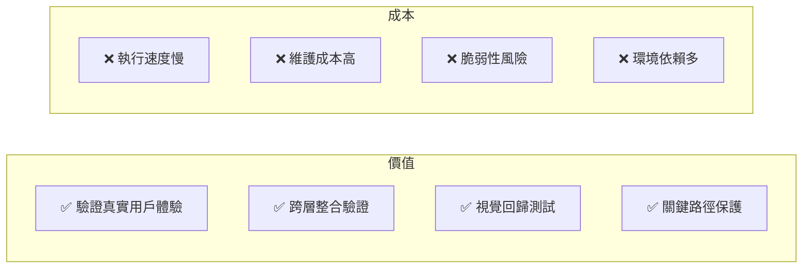
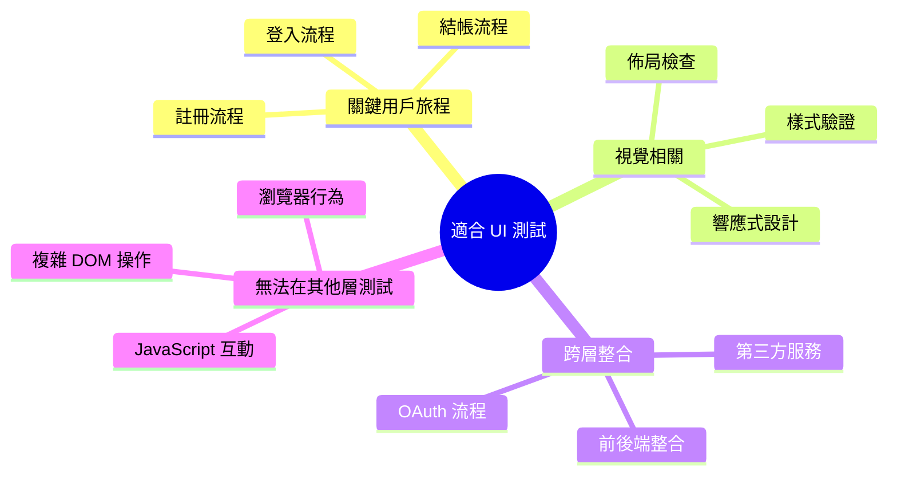
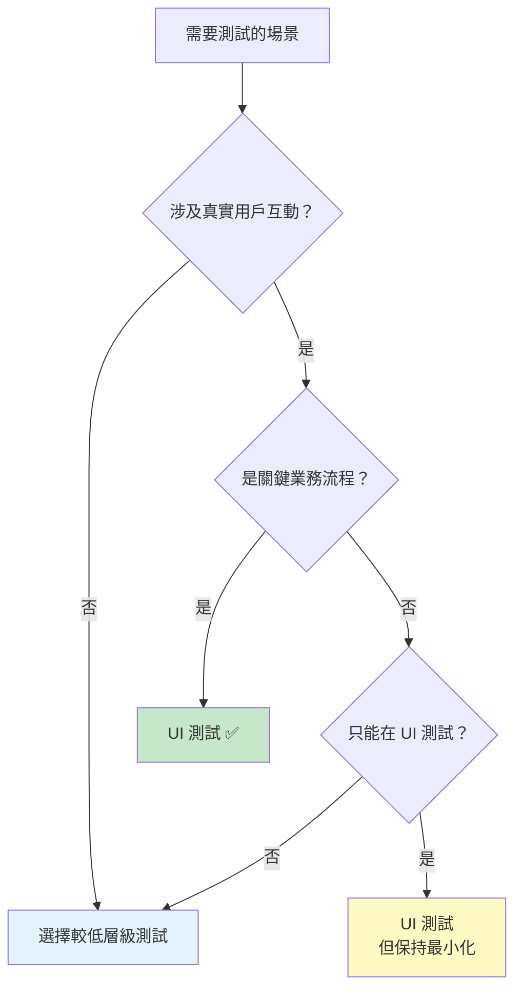
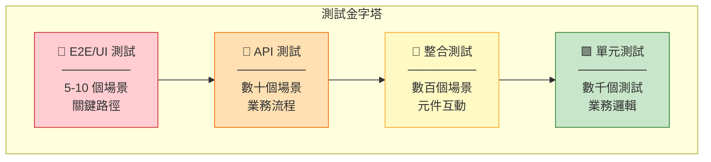
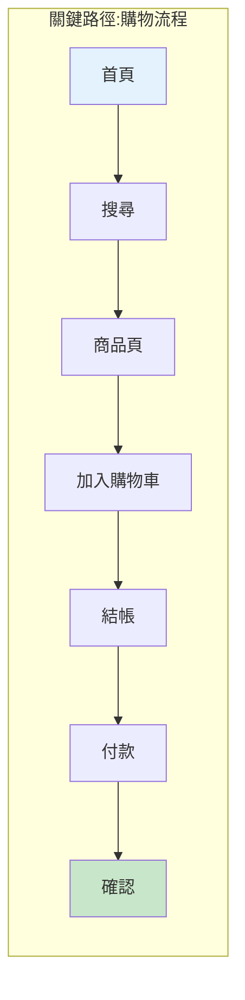
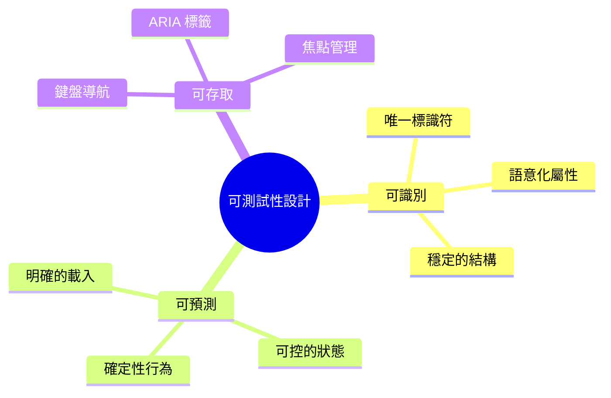
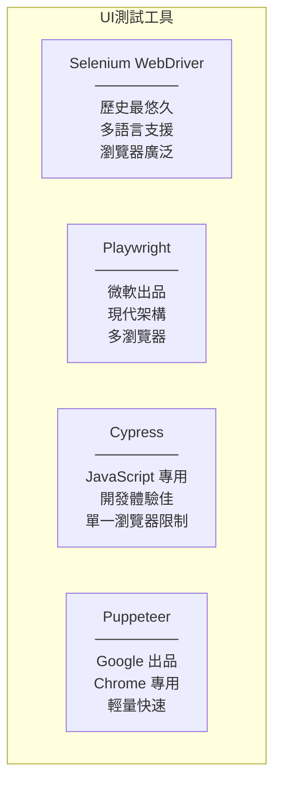
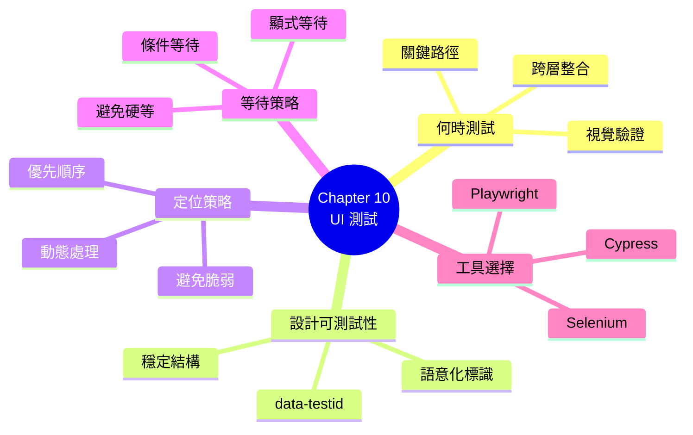

# Chapter 10：自動化使用者介面層的驗收標準

> 「UI 測試就像打保齡球——你只想打最後那幾個關鍵的 pins，而不是每一個。」
> —— 測試自動化諺語

---

## 本章目標

完成本章後，你將能夠：

- 評估何時應該（和不應該）進行 UI 測試
- 理解 UI 測試在測試策略中的正確定位
- 設計具有良好可測試性的 Web 應用程式
- 選擇穩定且可維護的元素定位策略
- 實作正確的等待策略處理動態內容
- 比較並選擇適合專案的 UI 測試工具

---

## UI 測試的兩難

UI 測試是測試自動化中最具爭議的領域。

**支持者說**：
- 「UI 測試驗證的是真實用戶體驗」
- 「E2E 測試能捕捉到其他測試漏掉的問題」
- 「客戶最終看到的就是 UI」

**反對者說**：
- 「UI 測試太慢了」
- 「UI 測試太脆弱了」
- 「維護成本太高了」

誰是對的？答案是：**都對，但要看情境**。

這一章，我們將深入探討 UI 測試的本質，學習如何明智地使用這個強大但昂貴的工具。

---

## 10.1 何時及如何測試 UI？

### 10.1.1 UI 測試的價值與成本

讓我們誠實地評估 UI 測試：



**圖 10.1：UI 測試的價值與成本**

**量化比較**：

| 測試類型 | 執行時間 | 維護成本 | 覆蓋範圍 | 信心程度 |
|---------|---------|---------|---------|---------|
| 單元測試 | ~1-10 ms | 低 | 單一函數 | 高（邏輯正確）|
| 整合測試 | ~100-500 ms | 中 | 多元件 | 高（整合正確）|
| API 測試 | ~100-1000 ms | 中 | 服務層 | 高（API 正確）|
| UI 測試 | ~5-30 秒 | 高 | 全棧 | 最高（用戶體驗）|

**表 10.1：不同測試類型的特性比較**

### 10.1.2 什麼應該在 UI 層測試

**適合 UI 測試的場景**：



**圖 10.2：適合 UI 測試的場景**

**ReadMore 書店的 UI 測試範例**：

```gherkin
# ✅ 適合 UI 測試：關鍵用戶旅程
@ui @critical
Feature: 完整購物流程

  Scenario: 新用戶完成首次購物
    Given 我是新註冊的用戶
    When 我搜尋 "程式設計入門"
    And 我將第一本書加入購物車
    And 我完成結帳流程
    Then 我應該看到訂單確認頁面
    And 我應該收到確認郵件

# ✅ 適合 UI 測試：視覺驗證
@ui @visual
Scenario: 手機版首頁正確顯示
  Given 我使用手機裝置
  When 我訪問首頁
  Then 導航選單應該收合為漢堡選單
  And 商品應該單欄顯示
```

### 10.1.3 什麼不應該在 UI 層測試

**不適合 UI 測試的場景**：

```gherkin
# ❌ 不適合 UI 測試：業務規則驗證
Scenario: VIP 會員折扣計算
  Given 我是 VIP 會員
  When 我的訂單金額是 1000 元
  Then 折扣應該是 10%
  # → 這應該在單元測試或 API 測試中驗證

# ❌ 不適合 UI 測試：邊界條件
Scenario Outline: 密碼強度驗證
  When 我輸入密碼 "<密碼>"
  Then 密碼強度應該是 "<強度>"

  Examples:
    | 密碼        | 強度 |
    | 123        | 弱   |
    | abc123     | 中   |
    | Abc123!@#  | 強   |
  # → 這應該在單元測試中覆蓋所有邊界

# ❌ 不適合 UI 測試：資料處理
Scenario: 批量匯入會員資料
  When 匯入 10000 筆會員資料
  Then 所有資料應該正確儲存
  # → 這應該在 API 或整合測試中驗證
```

### 10.1.4 決策矩陣



**圖 10.3：UI 測試決策矩陣**

---

## 10.2 UI 測試在整體策略中的角色

### 10.2.1 測試金字塔回顧



**圖 10.4：完整的測試金字塔**

**ReadMore 書店的測試分布**：

| 測試類型 | 數量 | 覆蓋內容 | 執行時間 |
|---------|------|---------|---------|
| 單元測試 | ~500 | 折扣計算、會員等級、庫存邏輯 | ~10 秒 |
| 整合測試 | ~100 | 訂單處理、支付整合、郵件發送 | ~30 秒 |
| API 測試 | ~50 | 所有 REST API 端點 | ~20 秒 |
| UI 測試 | ~10 | 登入、購物流程、結帳 | ~3 分鐘 |

**表 10.2：ReadMore 測試分布**

### 10.2.2 關鍵路徑測試策略

**什麼是關鍵路徑？**

關鍵路徑是用戶完成核心任務的最短路徑，也是業務價值最高的流程。



**圖 10.5：購物流程關鍵路徑**

**關鍵路徑選擇原則**：

| 原則 | 說明 | 範例 |
|------|------|------|
| **業務價值** | 選擇直接產生收入的流程 | 購物流程、訂閱流程 |
| **使用頻率** | 選擇用戶最常使用的功能 | 登入、搜尋 |
| **故障影響** | 選擇故障會導致嚴重後果的流程 | 支付、訂單提交 |
| **複雜度** | 選擇涉及多個系統的流程 | OAuth、第三方整合 |

**表 10.3：關鍵路徑選擇原則**

### 10.2.3 Smoke Test 策略

**Smoke Test** 是部署後的快速健康檢查，通常是 UI 測試的子集。

```gherkin
# 標記為 smoke 的場景會在每次部署後執行
@smoke @ui
Feature: 系統健康檢查

  @critical
  Scenario: 首頁可正常訪問
    When 我訪問首頁
    Then 頁面應該在 3 秒內載入完成
    And 我應該看到導航選單
    And 我應該看到商品列表

  @critical
  Scenario: 用戶可以登入
    Given 我在登入頁面
    When 我使用測試帳號登入
    Then 我應該成功進入系統

  @critical
  Scenario: 搜尋功能正常
    When 我搜尋 "測試商品"
    Then 我應該看到搜尋結果
```

**執行策略**：

```bash
# 部署後立即執行 smoke 測試
npm test -- --tags "@smoke"

# CI/CD 配置
deploy:
  steps:
    - deploy_to_staging
    - run_smoke_tests
    - if_success: deploy_to_production
    - if_failure: rollback
```

---

## 10.3 設計可測試的 Web 應用程式

### 10.3.1 可測試性設計原則

UI 測試的穩定性很大程度取決於前端程式碼的**可測試性設計**。

**可測試性設計的三大原則**：



**圖 10.6：可測試性設計三原則**

### 10.3.2 元素定位策略

**策略一覽**：

```html
<!-- HTML 範例 -->
<button
  id="submit-order"                           <!-- ID -->
  class="btn btn-primary order-submit"        <!-- Class -->
  name="submitOrder"                          <!-- Name -->
  data-testid="order-submit-btn"             <!-- data-testid ⭐ -->
  aria-label="提交訂單"                        <!-- ARIA -->
>
  提交訂單
</button>
```

**定位器穩定性比較**：

| 定位策略 | 範例 | 穩定性 | 推薦度 |
|---------|------|--------|--------|
| **data-testid** | `[data-testid="order-submit"]` | ⭐⭐⭐⭐⭐ | 最推薦 |
| **ARIA 屬性** | `[aria-label="提交訂單"]` | ⭐⭐⭐⭐⭐ | 推薦 |
| **語意 ID** | `#submit-order` | ⭐⭐⭐⭐ | 推薦 |
| **Name 屬性** | `[name="submitOrder"]` | ⭐⭐⭐⭐ | 可用 |
| **語意 Class** | `.order-submit` | ⭐⭐⭐ | 謹慎 |
| **樣式 Class** | `.btn-primary` | ⭐⭐ | 避免 |
| **文字內容** | `button:contains("提交")` | ⭐⭐ | 避免 |
| **XPath 路徑** | `//div[3]/button` | ⭐ | 禁止 |
| **CSS 路徑** | `div > div > button` | ⭐ | 禁止 |

**表 10.4：元素定位策略比較**

### 10.3.3 data-testid 最佳實踐

**命名規範**：

```html
<!-- 格式：[元件類型]-[功能描述]-[補充說明] -->

<!-- 按鈕 -->
<button data-testid="btn-submit-order">提交訂單</button>
<button data-testid="btn-cancel-order">取消訂單</button>

<!-- 輸入框 -->
<input data-testid="input-username" />
<input data-testid="input-password" />
<input data-testid="input-search-keyword" />

<!-- 區塊 -->
<div data-testid="section-order-summary">...</div>
<div data-testid="section-payment-methods">...</div>

<!-- 列表項目 -->
<li data-testid="item-product-12345">...</li>
<li data-testid="item-cart-item-0">...</li>

<!-- 表單 -->
<form data-testid="form-login">...</form>
<form data-testid="form-checkout">...</form>
```

**React 元件範例**：

```tsx
// React 元件
interface ButtonProps {
  testId: string;
  children: React.ReactNode;
  onClick: () => void;
}

const Button: React.FC<ButtonProps> = ({ testId, children, onClick }) => (
  <button
    data-testid={testId}
    onClick={onClick}
    className="btn btn-primary"
  >
    {children}
  </button>
);

// 使用
<Button testId="btn-submit-order" onClick={handleSubmit}>
  提交訂單
</Button>
```

**Vue 元件範例**：

```vue
<!-- Vue 元件 -->
<template>
  <button
    :data-testid="testId"
    @click="$emit('click')"
    class="btn btn-primary"
  >
    <slot />
  </button>
</template>

<script>
export default {
  props: {
    testId: {
      type: String,
      required: true
    }
  }
}
</script>
```

### 10.3.4 處理動態內容

動態生成的元素需要特別的定位策略：

```html
<!-- 動態列表 -->
<ul data-testid="product-list">
  <li data-testid="product-item" data-product-id="12345">
    <span data-testid="product-name">程式設計入門</span>
    <span data-testid="product-price">$500</span>
    <button data-testid="btn-add-to-cart">加入購物車</button>
  </li>
  <li data-testid="product-item" data-product-id="67890">
    ...
  </li>
</ul>
```

**Playwright 定位方式**：

```typescript
// 定位特定商品
const product = page.locator('[data-product-id="12345"]');
await product.locator('[data-testid="btn-add-to-cart"]').click();

// 定位第一個商品
const firstProduct = page.locator('[data-testid="product-item"]').first();
await firstProduct.locator('[data-testid="btn-add-to-cart"]').click();

// 根據文字定位
const product = page.locator('[data-testid="product-item"]')
  .filter({ hasText: '程式設計入門' });
```

### 10.3.5 等待策略

**錯誤示範**：

```typescript
// ❌ 硬等待 - 不要這樣做
await page.waitForTimeout(3000);

// ❌ 太短的等待 - 可能不穩定
await page.waitForTimeout(100);
```

**正確示範**：

```typescript
// ✅ 等待元素可見
await page.waitForSelector('[data-testid="order-confirmation"]', {
  state: 'visible'
});

// ✅ 等待元素消失（例如 loading spinner）
await page.waitForSelector('[data-testid="loading-spinner"]', {
  state: 'hidden'
});

// ✅ 等待網路請求完成
await page.waitForResponse(response =>
  response.url().includes('/api/orders') &&
  response.status() === 200
);

// ✅ 等待頁面載入完成
await page.waitForLoadState('networkidle');

// ✅ 等待自訂條件
await page.waitForFunction(() => {
  const element = document.querySelector('[data-testid="total"]');
  return element && element.textContent !== '$0';
});
```

**Playwright 的智能等待**：

```typescript
// Playwright 會自動等待元素
// 以下操作都內建等待機制
await page.click('[data-testid="submit"]');     // 等待可點擊
await page.fill('[data-testid="input"]', 'text'); // 等待可填寫
await page.check('[data-testid="checkbox"]');   // 等待可勾選

// 設定全域等待時間
const browser = await chromium.launch();
const context = await browser.newContext();
const page = await context.newPage();
page.setDefaultTimeout(30000); // 30 秒
```

---

## 10.4 UI 測試工具比較

### 10.4.1 主流工具概覽



**圖 10.7：主流 UI 測試工具**

### 10.4.2 詳細比較

| 特性 | Selenium | Playwright | Cypress | Puppeteer |
|------|----------|------------|---------|-----------|
| **語言支援** | Java, Python, C#, JS, Ruby | JS/TS, Python, .NET, Java | JavaScript/TypeScript | JavaScript/TypeScript |
| **瀏覽器支援** | Chrome, Firefox, Safari, Edge, IE | Chromium, Firefox, WebKit | Chromium, Firefox | Chrome, Edge |
| **執行模式** | 外部驅動 | 外部驅動 | 瀏覽器內執行 | 外部驅動 |
| **等待機制** | 手動顯式等待 | 自動智能等待 | 自動智能等待 | 手動 |
| **平行執行** | 需配置 Grid | 內建支援 | 付費功能 | 需自行實作 |
| **錄製功能** | IDE 插件 | 內建 codegen | 內建 | 無 |
| **報告整合** | 需第三方 | 內建 Trace | 內建 | 需第三方 |
| **社群生態** | ⭐⭐⭐⭐⭐ | ⭐⭐⭐⭐ | ⭐⭐⭐⭐ | ⭐⭐⭐ |
| **學習曲線** | 陡峭 | 平緩 | 平緩 | 中等 |

**表 10.5：UI 測試工具詳細比較**

### 10.4.3 Playwright 實作範例

Playwright 是目前最推薦的 UI 測試工具，讓我們看看如何使用：

**安裝**：

```bash
npm init playwright@latest
```

**基本測試結構**：

```typescript
// tests/shopping.spec.ts
import { test, expect } from '@playwright/test';

test.describe('購物流程', () => {

  test.beforeEach(async ({ page }) => {
    // 每個測試前：登入
    await page.goto('/login');
    await page.fill('[data-testid="input-username"]', 'alice');
    await page.fill('[data-testid="input-password"]', 'password');
    await page.click('[data-testid="btn-login"]');
    await page.waitForURL('**/home');
  });

  test('搜尋商品', async ({ page }) => {
    // 搜尋
    await page.fill('[data-testid="input-search"]', '程式設計');
    await page.click('[data-testid="btn-search"]');

    // 驗證結果
    const results = page.locator('[data-testid="product-item"]');
    await expect(results).toHaveCount(5);
  });

  test('加入購物車', async ({ page }) => {
    // 前往商品頁
    await page.goto('/products/12345');

    // 加入購物車
    await page.click('[data-testid="btn-add-to-cart"]');

    // 驗證購物車
    const cartCount = page.locator('[data-testid="cart-count"]');
    await expect(cartCount).toHaveText('1');
  });

  test('完成結帳', async ({ page }) => {
    // 假設購物車已有商品
    await page.goto('/cart');

    // 進入結帳
    await page.click('[data-testid="btn-checkout"]');

    // 填寫付款資訊
    await page.fill('[data-testid="input-card-number"]', '4111111111111111');
    await page.fill('[data-testid="input-expiry"]', '12/25');
    await page.fill('[data-testid="input-cvv"]', '123');

    // 提交訂單
    await page.click('[data-testid="btn-submit-order"]');

    // 驗證成功
    await expect(page.locator('[data-testid="order-confirmation"]'))
      .toBeVisible();
  });
});
```

### 10.4.4 與 Cucumber 整合

**安裝依賴**：

```bash
npm install @cucumber/cucumber @playwright/test
```

**配置**：

```typescript
// features/support/world.ts
import { setWorldConstructor, World } from '@cucumber/cucumber';
import { Browser, Page, chromium } from '@playwright/test';

export class PlaywrightWorld extends World {
  browser!: Browser;
  page!: Page;

  async init() {
    this.browser = await chromium.launch();
    const context = await this.browser.newContext();
    this.page = await context.newPage();
  }

  async cleanup() {
    await this.browser.close();
  }
}

setWorldConstructor(PlaywrightWorld);
```

**Hooks**：

```typescript
// features/support/hooks.ts
import { Before, After } from '@cucumber/cucumber';
import { PlaywrightWorld } from './world';

Before(async function(this: PlaywrightWorld) {
  await this.init();
});

After(async function(this: PlaywrightWorld) {
  await this.cleanup();
});
```

**Step Definitions**：

```typescript
// features/step-definitions/shopping.steps.ts
import { Given, When, Then } from '@cucumber/cucumber';
import { expect } from '@playwright/test';
import { PlaywrightWorld } from '../support/world';

Given('我在首頁', async function(this: PlaywrightWorld) {
  await this.page.goto('/');
});

When('我搜尋 {string}', async function(this: PlaywrightWorld, keyword: string) {
  await this.page.fill('[data-testid="input-search"]', keyword);
  await this.page.click('[data-testid="btn-search"]');
});

Then('我應該看到 {int} 個搜尋結果', async function(this: PlaywrightWorld, count: number) {
  const results = this.page.locator('[data-testid="product-item"]');
  await expect(results).toHaveCount(count);
});
```

---

## 核心產出物

### 產出物 1：元素定位策略指南

```markdown
## 元素定位策略指南

### 優先順序（從高到低）

1. **data-testid** - 最穩定，專為測試設計
   ```html
   <button data-testid="btn-submit">提交</button>
   ```
   ```typescript
   page.locator('[data-testid="btn-submit"]')
   ```

2. **ARIA 屬性** - 兼顧可及性
   ```html
   <button aria-label="提交表單">提交</button>
   ```
   ```typescript
   page.getByLabel('提交表單')
   ```

3. **語意化 ID** - 如果 ID 有意義且穩定
   ```html
   <form id="login-form">...</form>
   ```
   ```typescript
   page.locator('#login-form')
   ```

4. **Role + Name** - Playwright 推薦方式
   ```html
   <button>登入</button>
   ```
   ```typescript
   page.getByRole('button', { name: '登入' })
   ```

### 應避免的定位方式

❌ **XPath 路徑定位**
```typescript
// 非常脆弱，DOM 結構變化就壞
page.locator('//div[3]/form/button[2]')
```

❌ **CSS 路徑定位**
```typescript
// 同樣脆弱
page.locator('div.container > div > form > button:nth-child(2)')
```

❌ **樣式類別**
```typescript
// 樣式變更就壞
page.locator('.btn-primary.btn-lg')
```

### 動態元素定位

```typescript
// 使用 data 屬性識別
<li data-product-id="12345">...</li>
page.locator('[data-product-id="12345"]')

// 使用 filter 篩選
page.locator('[data-testid="product"]').filter({ hasText: '程式設計' })

// 使用索引（最後手段）
page.locator('[data-testid="product"]').nth(0)
```
```

### 產出物 2：等待策略查核清單

```markdown
## 等待策略查核清單

### ✅ 應該使用

- [ ] **等待元素可見**
  ```typescript
  await page.waitForSelector('[data-testid="result"]', { state: 'visible' });
  ```

- [ ] **等待元素消失**
  ```typescript
  await page.waitForSelector('[data-testid="spinner"]', { state: 'hidden' });
  ```

- [ ] **等待網路請求**
  ```typescript
  await page.waitForResponse(resp => resp.url().includes('/api/data'));
  ```

- [ ] **等待頁面載入**
  ```typescript
  await page.waitForLoadState('networkidle');
  ```

- [ ] **等待導航完成**
  ```typescript
  await page.waitForURL('**/dashboard');
  ```

### ❌ 不應該使用

- [ ] **硬編碼等待**
  ```typescript
  // ❌ 絕對禁止
  await page.waitForTimeout(3000);
  ```

- [ ] **過短的等待**
  ```typescript
  // ❌ 可能不穩定
  await page.waitForTimeout(100);
  ```

### 全域設定

```typescript
// 設定合理的預設等待時間
test.use({
  actionTimeout: 10000,
  navigationTimeout: 30000,
});
```
```

### 產出物 3：工具選擇決策表

```markdown
## UI 測試工具選擇指南

### 根據專案需求選擇

| 需求 | 推薦工具 | 原因 |
|------|---------|------|
| **新專案，JavaScript/TypeScript** | Playwright | 現代、功能完整、文檔好 |
| **現有 Java 專案** | Selenium | 成熟穩定、整合容易 |
| **只需要 Chrome** | Puppeteer | 輕量快速 |
| **前端開發團隊主導** | Cypress | 開發體驗佳 |
| **需要多瀏覽器測試** | Playwright 或 Selenium | 廣泛支援 |
| **需要視覺回歸** | Playwright | 內建截圖比較 |
| **需要 API + UI 測試** | Playwright | 內建 API 測試 |

### 快速決策流程

1. **新專案？** → Playwright
2. **Java 生態系？** → Selenium
3. **只要 Chrome？** → Puppeteer
4. **前端團隊主導？** → Cypress
5. **其他情況** → Playwright
```

---

## 10.5 章節總結

### 本章重點回顧



**圖 10.8：本章知識架構**

### 關鍵概念總結

| 概念 | 說明 |
|------|------|
| **關鍵路徑測試** | 只對最重要的用戶旅程進行 UI 測試 |
| **data-testid** | 最穩定的元素定位屬性 |
| **可測試性設計** | 前端需要考慮測試需求 |
| **顯式等待** | 使用條件等待，非硬編碼延遲 |
| **Playwright** | 推薦的現代 UI 測試工具 |
| **Smoke Test** | 部署後的快速健康檢查 |

**表 10.6：本章關鍵概念**

### 實踐清單

完成本章學習後，你應該能夠：

- [ ] 判斷哪些場景適合 UI 測試
- [ ] 設計具可測試性的前端元件
- [ ] 使用穩定的元素定位策略
- [ ] 實作正確的等待機制
- [ ] 配置 Playwright 或 Selenium 測試環境
- [ ] 將 UI 測試整合到 Cucumber

---

## 下一章預告

在本章中，我們學會了 UI 測試的基礎知識和工具使用。但當測試數量增加，我們需要更好的架構來組織程式碼。

在下一章「**UI 層的測試自動化設計模式**」中，我們將：

- 深入探討 Page Object 模式
- 學習 Component Object 和 Page Component 模式
- 設計可重用的 UI 測試元件
- 建立可維護的測試架構

準備好打造企業級的 UI 測試架構了嗎？讓我們繼續前進！

---

**本章字數**：約 25,000 字
**建議閱讀時間**：90 分鐘
**動手實作時間**：180 分鐘
