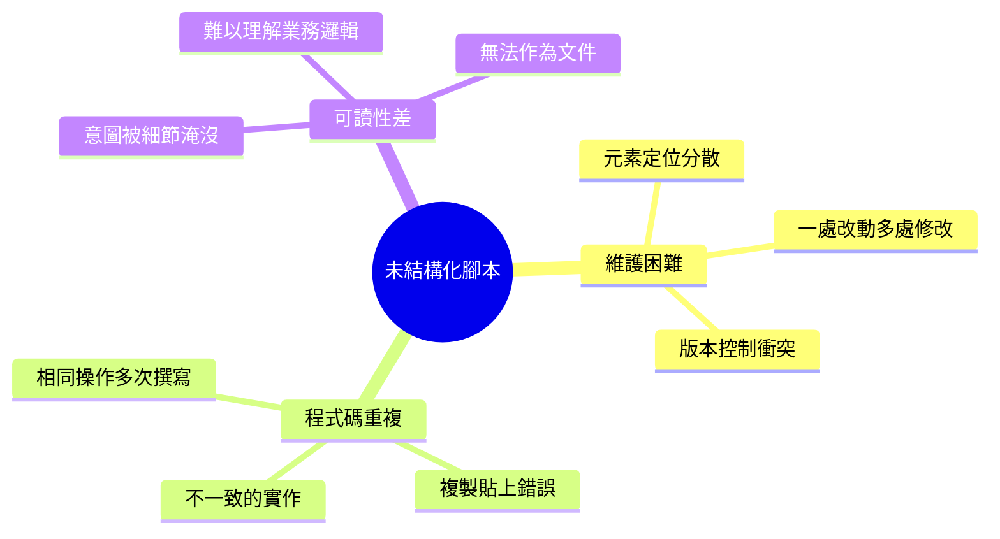
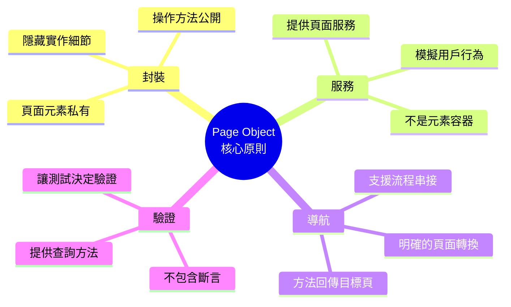
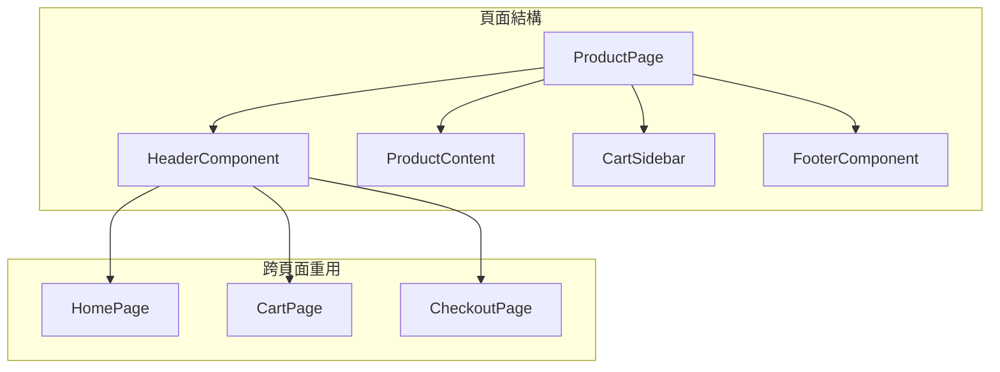
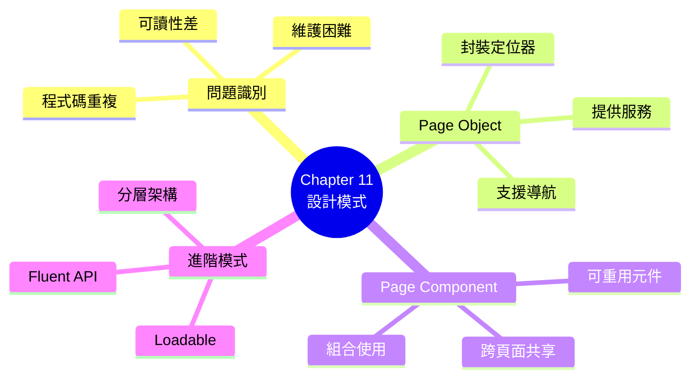

# Chapter 11：UI 層的測試自動化設計模式

> 「任何傻瓜都能寫出機器能讀懂的程式碼，優秀的工程師會寫出人類能讀懂的程式碼。」
> —— Martin Fowler

---

## 本章目標

完成本章後，你將能夠：

- 識別未結構化測試腳本的問題
- 理解並實作 Page Object 模式
- 掌握 Page Component 模式處理可重用元件
- 使用 Loadable Component 模式處理頁面載入
- 設計流暢介面（Fluent API）提升可讀性
- 選擇適合專案的設計模式組合

---

## 從混亂到有序

在上一章中，我們學會了 UI 測試的基礎知識。但當你開始撰寫更多測試時，很快就會遇到一個問題：**測試程式碼變得難以維護**。

這一章，我們將學習經過實戰驗證的設計模式，讓 UI 測試程式碼：

- **可維護**：UI 變更時只需改一處
- **可重用**：避免重複程式碼
- **可讀**：測試意圖一目了然

---

## 11.1 未結構化測試腳本的限制

### 11.1.1 維護噩夢：真實案例

讓我們看看 ReadMore 書店測試團隊的真實經歷：

**情境**：前端團隊將登入按鈕的 `id` 從 `login-btn` 改為 `submit-login`

**影響**：32 個測試檔案、87 處程式碼需要修改

```typescript
// ❌ 未結構化的測試腳本 - 問題所在
test('用戶登入', async ({ page }) => {
  await page.goto('/login');
  await page.fill('#username', 'alice');
  await page.fill('#password', 'password123');
  await page.click('#login-btn');  // 這個 ID 出現在 87 個地方！
  await expect(page.locator('.welcome')).toBeVisible();
});

test('登入失敗顯示錯誤', async ({ page }) => {
  await page.goto('/login');
  await page.fill('#username', 'alice');
  await page.fill('#password', 'wrong');
  await page.click('#login-btn');  // 又是這個 ID
  await expect(page.locator('.error')).toBeVisible();
});

// ... 還有 85 個地方使用這個 ID
```

### 11.1.2 未結構化腳本的三大問題



**圖 11.1：未結構化腳本的三大問題**

### 11.1.3 量化問題的影響

| 指標 | 未結構化 | 結構化（Page Object）|
|------|---------|---------------------|
| **UI 變更影響範圍** | 10-100 個檔案 | 1-3 個檔案 |
| **新增測試時間** | 30-60 分鐘 | 5-15 分鐘 |
| **維護時間佔比** | 60-80% | 20-30% |
| **程式碼重複率** | 40-60% | 5-10% |
| **新人上手時間** | 2-4 週 | 3-5 天 |

**表 11.1：結構化 vs. 未結構化的影響比較**

---

## 11.2 將定位邏輯與測試邏輯分離

### 11.2.1 關注點分離原則

**問題的根源**：定位邏輯和測試邏輯混在一起

```typescript
// ❌ 混合的關注點
test('購物流程', async ({ page }) => {
  // 定位邏輯和測試邏輯混在一起
  await page.fill('[data-testid="search-input"]', '程式設計');
  await page.click('[data-testid="search-btn"]');
  await page.click('[data-testid="product-item"]:first-child');
  await page.click('[data-testid="add-to-cart-btn"]');
  await expect(page.locator('[data-testid="cart-count"]')).toHaveText('1');
});
```

**解決方案**：分離兩種關注點

```mermaid
graph TB
    subgraph 分離後
        TEST[測試邏輯<br/>────────<br/>searchFor('程式設計')<br/>selectFirstProduct()<br/>addToCart()<br/>verifyCartCount(1)]
        PAGE[頁面定位<br/>────────<br/>searchInput<br/>searchButton<br/>productItems<br/>addToCartBtn<br/>cartCount]
    end

    TEST --> PAGE

    style TEST fill:#e3f2fd
    style PAGE fill:#fff3e0
```

**圖 11.2：關注點分離**

### 11.2.2 重構步驟

**步驟 1：識別重複的定位器**

```typescript
// 找出所有重複的定位器
const selectors = {
  searchInput: '[data-testid="search-input"]',
  searchButton: '[data-testid="search-btn"]',
  productItem: '[data-testid="product-item"]',
  addToCartBtn: '[data-testid="add-to-cart-btn"]',
  cartCount: '[data-testid="cart-count"]'
};
```

**步驟 2：建立頁面類別**

```typescript
// SearchPage.ts
export class SearchPage {
  private readonly selectors = {
    searchInput: '[data-testid="search-input"]',
    searchButton: '[data-testid="search-btn"]',
    productItem: '[data-testid="product-item"]'
  };

  constructor(private readonly page: Page) {}

  async search(keyword: string) {
    await this.page.fill(this.selectors.searchInput, keyword);
    await this.page.click(this.selectors.searchButton);
  }

  async selectFirstProduct() {
    await this.page.locator(this.selectors.productItem).first().click();
  }
}
```

**步驟 3：重寫測試**

```typescript
// ✅ 重構後的測試
test('購物流程', async ({ page }) => {
  const searchPage = new SearchPage(page);
  const productPage = new ProductPage(page);
  const cartPage = new CartPage(page);

  await searchPage.search('程式設計');
  await searchPage.selectFirstProduct();
  await productPage.addToCart();
  await cartPage.verifyItemCount(1);
});
```

---

## 11.3 介紹「頁面物件」模式（Page Object Pattern）

### 11.3.1 Page Object 的核心原則

**Page Object 模式**是 UI 測試最重要的設計模式，由 Martin Fowler 在 2013 年正式定義。

**核心原則**：



**圖 11.3：Page Object 核心原則**

### 11.3.2 Java Page Object 實作

```java
// pages/LoginPage.java
public class LoginPage {

    private final WebDriver driver;
    private final WebDriverWait wait;

    // ‹1› 元素定位器 - 私有且集中管理
    private static final By USERNAME_FIELD = By.cssSelector("[data-testid='username']");
    private static final By PASSWORD_FIELD = By.cssSelector("[data-testid='password']");
    private static final By LOGIN_BUTTON = By.cssSelector("[data-testid='login-btn']");
    private static final By ERROR_MESSAGE = By.cssSelector("[data-testid='error-msg']");
    private static final By REMEMBER_ME = By.cssSelector("[data-testid='remember-me']");

    public LoginPage(WebDriver driver) {
        this.driver = driver;
        this.wait = new WebDriverWait(driver, Duration.ofSeconds(10));
    }

    // ‹2› 導航方法
    public LoginPage open() {
        driver.get(Config.getBaseUrl() + "/login");
        wait.until(ExpectedConditions.visibilityOfElementLocated(USERNAME_FIELD));
        return this;
    }

    // ‹3› 操作方法 - 模擬用戶行為
    public LoginPage enterUsername(String username) {
        WebElement field = driver.findElement(USERNAME_FIELD);
        field.clear();
        field.sendKeys(username);
        return this;  // ‹4› 回傳 this 支援鏈式呼叫
    }

    public LoginPage enterPassword(String password) {
        WebElement field = driver.findElement(PASSWORD_FIELD);
        field.clear();
        field.sendKeys(password);
        return this;
    }

    public LoginPage checkRememberMe() {
        WebElement checkbox = driver.findElement(REMEMBER_ME);
        if (!checkbox.isSelected()) {
            checkbox.click();
        }
        return this;
    }

    // ‹5› 導航結果方法 - 回傳目標頁面
    public HomePage clickLogin() {
        driver.findElement(LOGIN_BUTTON).click();
        return new HomePage(driver);  // 成功登入，導向首頁
    }

    public LoginPage clickLoginExpectingError() {
        driver.findElement(LOGIN_BUTTON).click();
        wait.until(ExpectedConditions.visibilityOfElementLocated(ERROR_MESSAGE));
        return this;  // 登入失敗，停留在登入頁
    }

    // ‹6› 查詢方法 - 讓測試可以進行驗證
    public String getErrorMessage() {
        return driver.findElement(ERROR_MESSAGE).getText();
    }

    public boolean isErrorDisplayed() {
        try {
            return driver.findElement(ERROR_MESSAGE).isDisplayed();
        } catch (NoSuchElementException e) {
            return false;
        }
    }

    // ‹7› 便利方法 - 組合常用操作
    public HomePage loginAs(String username, String password) {
        return enterUsername(username)
            .enterPassword(password)
            .clickLogin();
    }

    public LoginPage attemptLoginAs(String username, String password) {
        return enterUsername(username)
            .enterPassword(password)
            .clickLoginExpectingError();
    }
}
```

**程式碼解析**：

- **‹1›** 所有定位器集中在類別頂部，UI 變更只改這裡
- **‹2›** `open()` 方法負責導航到頁面
- **‹3›** 每個方法模擬一個用戶操作
- **‹4›** 回傳 `this` 支援流暢介面
- **‹5›** 頁面轉換時回傳目標頁面的 Page Object
- **‹6›** 查詢方法提供狀態，不做斷言
- **‹7›** 便利方法組合常用操作序列

### 11.3.3 TypeScript Page Object 實作

```typescript
// pages/LoginPage.ts
import { Page, Locator, expect } from '@playwright/test';

export class LoginPage {
    // 元素定位器
    private readonly usernameField: Locator;
    private readonly passwordField: Locator;
    private readonly loginButton: Locator;
    private readonly errorMessage: Locator;
    private readonly rememberMeCheckbox: Locator;

    constructor(private readonly page: Page) {
        this.usernameField = page.locator('[data-testid="username"]');
        this.passwordField = page.locator('[data-testid="password"]');
        this.loginButton = page.locator('[data-testid="login-btn"]');
        this.errorMessage = page.locator('[data-testid="error-msg"]');
        this.rememberMeCheckbox = page.locator('[data-testid="remember-me"]');
    }

    async open(): Promise<this> {
        await this.page.goto('/login');
        await this.usernameField.waitFor({ state: 'visible' });
        return this;
    }

    async enterUsername(username: string): Promise<this> {
        await this.usernameField.fill(username);
        return this;
    }

    async enterPassword(password: string): Promise<this> {
        await this.passwordField.fill(password);
        return this;
    }

    async checkRememberMe(): Promise<this> {
        await this.rememberMeCheckbox.check();
        return this;
    }

    async clickLogin(): Promise<HomePage> {
        await this.loginButton.click();
        return new HomePage(this.page);
    }

    async clickLoginExpectingError(): Promise<this> {
        await this.loginButton.click();
        await this.errorMessage.waitFor({ state: 'visible' });
        return this;
    }

    async getErrorMessage(): Promise<string> {
        return await this.errorMessage.textContent() ?? '';
    }

    async isErrorDisplayed(): Promise<boolean> {
        return await this.errorMessage.isVisible();
    }

    // 便利方法
    async loginAs(username: string, password: string): Promise<HomePage> {
        await this.enterUsername(username);
        await this.enterPassword(password);
        return this.clickLogin();
    }

    async attemptLoginAs(username: string, password: string): Promise<this> {
        await this.enterUsername(username);
        await this.enterPassword(password);
        return this.clickLoginExpectingError();
    }
}
```

### 11.3.4 在測試中使用 Page Object

**Java 測試**：

```java
// tests/LoginTest.java
public class LoginTest {

    private WebDriver driver;
    private LoginPage loginPage;

    @BeforeEach
    void setUp() {
        driver = WebDriverFactory.create();
        loginPage = new LoginPage(driver);
    }

    @AfterEach
    void tearDown() {
        driver.quit();
    }

    @Test
    void shouldLoginSuccessfully() {
        // ✅ 簡潔、可讀的測試
        HomePage homePage = loginPage
            .open()
            .loginAs("alice", "password123");

        assertThat(homePage.getWelcomeMessage())
            .contains("歡迎回來，Alice");
    }

    @Test
    void shouldShowErrorForInvalidCredentials() {
        loginPage
            .open()
            .attemptLoginAs("alice", "wrongpassword");

        assertThat(loginPage.getErrorMessage())
            .isEqualTo("帳號或密碼錯誤");
    }

    @Test
    void shouldRememberUser() {
        HomePage homePage = loginPage
            .open()
            .enterUsername("alice")
            .enterPassword("password123")
            .checkRememberMe()
            .clickLogin();

        assertThat(homePage.isRememberMeActive()).isTrue();
    }
}
```

**TypeScript 測試**：

```typescript
// tests/login.spec.ts
import { test, expect } from '@playwright/test';
import { LoginPage } from '../pages/LoginPage';
import { HomePage } from '../pages/HomePage';

test.describe('登入功能', () => {
    let loginPage: LoginPage;

    test.beforeEach(async ({ page }) => {
        loginPage = new LoginPage(page);
        await loginPage.open();
    });

    test('成功登入', async () => {
        const homePage = await loginPage.loginAs('alice', 'password123');

        const welcomeMessage = await homePage.getWelcomeMessage();
        expect(welcomeMessage).toContain('歡迎回來，Alice');
    });

    test('無效憑證顯示錯誤', async () => {
        await loginPage.attemptLoginAs('alice', 'wrongpassword');

        const errorMessage = await loginPage.getErrorMessage();
        expect(errorMessage).toBe('帳號或密碼錯誤');
    });
});
```

### 11.3.5 Page Object 最佳實踐

| 原則 | 好的做法 | 避免的做法 |
|------|---------|-----------|
| **命名** | `LoginPage`, `enterUsername()` | `Page1`, `doStuff()` |
| **職責** | 一個類別一個頁面 | 一個類別多個頁面 |
| **斷言** | 在測試中驗證 | 在 Page Object 中斷言 |
| **回傳值** | 回傳 `this` 或目標頁面 | 回傳 `void` |
| **等待** | 在 Page Object 中處理 | 在測試中硬編碼 |
| **定位器** | 集中管理、私有 | 分散、公開 |

**表 11.2：Page Object 最佳實踐**

---

## 11.4 超越頁面物件的做法

### 11.4.1 Page Component 模式

當頁面包含可重用的元件（如導航列、側邊欄、對話框）時，使用 **Page Component** 模式。



**圖 11.4：Page Component 架構**

**TypeScript Page Component 實作**：

```typescript
// components/HeaderComponent.ts
export class HeaderComponent {
    private readonly searchInput: Locator;
    private readonly searchButton: Locator;
    private readonly cartIcon: Locator;
    private readonly cartCount: Locator;
    private readonly userMenu: Locator;

    constructor(private readonly page: Page) {
        const header = page.locator('[data-testid="header"]');
        this.searchInput = header.locator('[data-testid="search-input"]');
        this.searchButton = header.locator('[data-testid="search-btn"]');
        this.cartIcon = header.locator('[data-testid="cart-icon"]');
        this.cartCount = header.locator('[data-testid="cart-count"]');
        this.userMenu = header.locator('[data-testid="user-menu"]');
    }

    async search(keyword: string): Promise<SearchResultsPage> {
        await this.searchInput.fill(keyword);
        await this.searchButton.click();
        return new SearchResultsPage(this.page);
    }

    async openCart(): Promise<CartPage> {
        await this.cartIcon.click();
        return new CartPage(this.page);
    }

    async getCartItemCount(): Promise<number> {
        const text = await this.cartCount.textContent();
        return parseInt(text ?? '0', 10);
    }

    async openUserMenu(): Promise<void> {
        await this.userMenu.click();
    }

    async logout(): Promise<LoginPage> {
        await this.openUserMenu();
        await this.page.locator('[data-testid="logout-btn"]').click();
        return new LoginPage(this.page);
    }
}

// pages/ProductPage.ts - 使用 Component
export class ProductPage {
    readonly header: HeaderComponent;

    private readonly productTitle: Locator;
    private readonly productPrice: Locator;
    private readonly addToCartButton: Locator;

    constructor(private readonly page: Page) {
        this.header = new HeaderComponent(page);  // 組合 Component

        this.productTitle = page.locator('[data-testid="product-title"]');
        this.productPrice = page.locator('[data-testid="product-price"]');
        this.addToCartButton = page.locator('[data-testid="add-to-cart"]');
    }

    async addToCart(): Promise<this> {
        await this.addToCartButton.click();
        return this;
    }

    async getProductTitle(): Promise<string> {
        return await this.productTitle.textContent() ?? '';
    }

    async getProductPrice(): Promise<number> {
        const text = await this.productPrice.textContent();
        return parseFloat(text?.replace(/[^0-9.]/g, '') ?? '0');
    }
}
```

**在測試中使用**：

```typescript
test('從商品頁加入購物車', async ({ page }) => {
    const productPage = new ProductPage(page);
    await page.goto('/products/12345');

    // 使用頁面方法
    await productPage.addToCart();

    // 使用組合的 Component
    const cartCount = await productPage.header.getCartItemCount();
    expect(cartCount).toBe(1);

    // Component 提供的導航
    const cartPage = await productPage.header.openCart();
    // ...
});
```

### 11.4.2 Loadable Component 模式

處理需要等待載入完成的頁面：

```typescript
// pages/LoadablePage.ts
export abstract class LoadablePage {
    constructor(protected readonly page: Page) {}

    abstract isLoaded(): Promise<boolean>;

    async waitForLoad(timeout: number = 10000): Promise<this> {
        const startTime = Date.now();

        while (Date.now() - startTime < timeout) {
            if (await this.isLoaded()) {
                return this;
            }
            await this.page.waitForTimeout(100);
        }

        throw new Error(`頁面在 ${timeout}ms 內未完成載入`);
    }
}

// pages/DashboardPage.ts
export class DashboardPage extends LoadablePage {
    private readonly dashboardContent: Locator;
    private readonly loadingSpinner: Locator;

    constructor(page: Page) {
        super(page);
        this.dashboardContent = page.locator('[data-testid="dashboard"]');
        this.loadingSpinner = page.locator('[data-testid="loading"]');
    }

    async isLoaded(): Promise<boolean> {
        const spinnerHidden = !(await this.loadingSpinner.isVisible());
        const contentVisible = await this.dashboardContent.isVisible();
        return spinnerHidden && contentVisible;
    }

    async open(): Promise<this> {
        await this.page.goto('/dashboard');
        return this.waitForLoad();
    }
}
```

### 11.4.3 流暢介面（Fluent API）

流暢介面讓測試讀起來像自然語言：

```java
// Java Fluent API
public class ShoppingFlow {
    private final WebDriver driver;
    private Page currentPage;

    public ShoppingFlow(WebDriver driver) {
        this.driver = driver;
    }

    public ShoppingFlow startAt(String url) {
        driver.get(url);
        return this;
    }

    public ShoppingFlow loginAs(String username, String password) {
        currentPage = new LoginPage(driver)
            .enterUsername(username)
            .enterPassword(password)
            .clickLogin();
        return this;
    }

    public ShoppingFlow searchFor(String keyword) {
        currentPage = ((HomePage) currentPage)
            .getHeader()
            .search(keyword);
        return this;
    }

    public ShoppingFlow selectProduct(int index) {
        currentPage = ((SearchResultsPage) currentPage)
            .selectProduct(index);
        return this;
    }

    public ShoppingFlow addToCart() {
        ((ProductPage) currentPage).addToCart();
        return this;
    }

    public ShoppingFlow checkout() {
        currentPage = ((ProductPage) currentPage)
            .getHeader()
            .openCart()
            .checkout();
        return this;
    }

    public ShoppingFlow pay(PaymentDetails payment) {
        currentPage = ((CheckoutPage) currentPage)
            .enterPaymentDetails(payment)
            .confirmOrder();
        return this;
    }

    public OrderConfirmationPage complete() {
        return (OrderConfirmationPage) currentPage;
    }
}

// 使用
OrderConfirmationPage confirmation = new ShoppingFlow(driver)
    .startAt(baseUrl)
    .loginAs("alice", "password123")
    .searchFor("程式設計入門")
    .selectProduct(0)
    .addToCart()
    .checkout()
    .pay(PaymentDetails.testCard())
    .complete();

assertThat(confirmation.getOrderNumber()).isNotEmpty();
```

---

## 核心產出物

### 產出物 1：Page Object 範本

```typescript
// templates/PageObject.template.ts

import { Page, Locator } from '@playwright/test';

/**
 * Page Object 範本
 *
 * 使用指南：
 * 1. 一個類別對應一個頁面
 * 2. 元素定位器使用 data-testid
 * 3. 方法回傳 this 或目標頁面
 * 4. 不在 Page Object 中做斷言
 */
export class ExamplePage {
    // ========================================
    // 元素定位器（私有）
    // ========================================
    private readonly elementOne: Locator;
    private readonly elementTwo: Locator;
    private readonly submitButton: Locator;

    // ========================================
    // 建構子
    // ========================================
    constructor(private readonly page: Page) {
        this.elementOne = page.locator('[data-testid="element-one"]');
        this.elementTwo = page.locator('[data-testid="element-two"]');
        this.submitButton = page.locator('[data-testid="submit-btn"]');
    }

    // ========================================
    // 導航方法
    // ========================================
    async open(): Promise<this> {
        await this.page.goto('/example');
        await this.elementOne.waitFor({ state: 'visible' });
        return this;
    }

    // ========================================
    // 操作方法（回傳 this 支援鏈式呼叫）
    // ========================================
    async fillElementOne(value: string): Promise<this> {
        await this.elementOne.fill(value);
        return this;
    }

    async fillElementTwo(value: string): Promise<this> {
        await this.elementTwo.fill(value);
        return this;
    }

    // ========================================
    // 導航結果方法（回傳目標頁面）
    // ========================================
    async submit(): Promise<ResultPage> {
        await this.submitButton.click();
        return new ResultPage(this.page);
    }

    async submitExpectingError(): Promise<this> {
        await this.submitButton.click();
        // 等待錯誤訊息出現
        return this;
    }

    // ========================================
    // 查詢方法（提供狀態給測試驗證）
    // ========================================
    async getElementOneValue(): Promise<string> {
        return await this.elementOne.inputValue();
    }

    async isSubmitEnabled(): Promise<boolean> {
        return await this.submitButton.isEnabled();
    }

    // ========================================
    // 便利方法
    // ========================================
    async fillAndSubmit(value1: string, value2: string): Promise<ResultPage> {
        await this.fillElementOne(value1);
        await this.fillElementTwo(value2);
        return this.submit();
    }
}
```

### 產出物 2：Page Component 範本

```typescript
// templates/PageComponent.template.ts

import { Page, Locator } from '@playwright/test';

/**
 * Page Component 範本
 *
 * 使用指南：
 * 1. 用於可跨頁面重用的 UI 元件
 * 2. 接受父元素的 Locator 作為 scope
 * 3. 所有定位都在 scope 內進行
 */
export class ExampleComponent {
    private readonly root: Locator;
    private readonly title: Locator;
    private readonly content: Locator;
    private readonly actionButton: Locator;

    constructor(page: Page, rootSelector: string = '[data-testid="example-component"]') {
        this.root = page.locator(rootSelector);
        this.title = this.root.locator('[data-testid="title"]');
        this.content = this.root.locator('[data-testid="content"]');
        this.actionButton = this.root.locator('[data-testid="action-btn"]');
    }

    async isVisible(): Promise<boolean> {
        return await this.root.isVisible();
    }

    async getTitle(): Promise<string> {
        return await this.title.textContent() ?? '';
    }

    async getContent(): Promise<string> {
        return await this.content.textContent() ?? '';
    }

    async clickAction(): Promise<void> {
        await this.actionButton.click();
    }
}

// 在 Page Object 中使用
export class DashboardPage {
    readonly header: HeaderComponent;
    readonly sidebar: SidebarComponent;
    readonly notificationPanel: NotificationComponent;

    constructor(private readonly page: Page) {
        this.header = new HeaderComponent(page);
        this.sidebar = new SidebarComponent(page);
        this.notificationPanel = new NotificationComponent(page);
    }

    // ... 頁面特定方法
}
```

### 產出物 3：設計模式選擇指南

```markdown
## UI 測試設計模式選擇指南

### 根據專案規模選擇

| 專案規模 | 推薦模式 | 原因 |
|---------|---------|------|
| **小型（<10 頁面）** | 基本 Page Object | 簡單直接，夠用 |
| **中型（10-50 頁面）** | Page Object + Component | 需要重用元件 |
| **大型（>50 頁面）** | 分層架構 + Screenplay | 需要更好的組織 |

### 根據團隊經驗選擇

| 團隊經驗 | 推薦模式 | 學習曲線 |
|---------|---------|---------|
| **新手團隊** | 基本 Page Object | 平緩 |
| **有經驗** | Page Object + Fluent API | 中等 |
| **專家級** | Screenplay Pattern | 陡峭但值得 |

### 模式組合建議

```
小型專案：
  Page Object
    └── 基本實作即可

中型專案：
  Page Object
    ├── Page Component（可重用元件）
    └── Fluent API（常用流程）

大型專案：
  三層架構
    ├── 規格層（Gherkin）
    ├── 任務層（Actions/Tasks）
    └── 技術層
        ├── Page Objects
        ├── Page Components
        └── API Clients
```
```

---

## 11.5 章節總結

### 本章重點回顧



**圖 11.5：本章知識架構**

### 關鍵概念總結

| 概念 | 說明 |
|------|------|
| **Page Object** | 封裝頁面元素和操作的設計模式 |
| **Page Component** | 處理可重用 UI 元件的模式 |
| **Loadable Component** | 處理非同步載入頁面的模式 |
| **Fluent API** | 鏈式呼叫，讓程式碼讀起來像自然語言 |
| **關注點分離** | 定位邏輯與測試邏輯分開 |

**表 11.3：本章關鍵概念**

### 實踐清單

完成本章學習後，你應該能夠：

- [ ] 識別未結構化測試的問題
- [ ] 實作基本的 Page Object
- [ ] 使用 Page Component 重用元件
- [ ] 設計流暢介面提升可讀性
- [ ] 選擇適合專案的模式組合

---

## 下一章預告

Page Object 是很好的起點，但它有一個限制：當測試變得複雜時，Page Object 會變得臃腫。

在下一章「**可擴充的測試自動化與演員劇本模式**」中，我們將學習更進階的 **Screenplay Pattern**：

- 理解 Page Object 的限制
- 掌握 Actor、Task、Interaction 等概念
- 使用 Serenity BDD 實作 Screenplay
- 設計可擴展的測試架構

準備好進入進階測試自動化的世界了嗎？

---

**本章字數**：約 22,000 字
**建議閱讀時間**：80 分鐘
**動手實作時間**：150 分鐘
