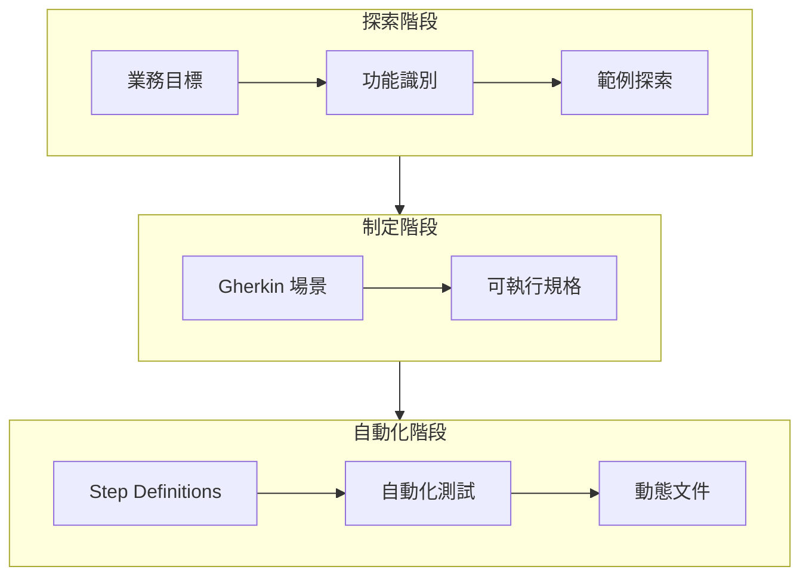
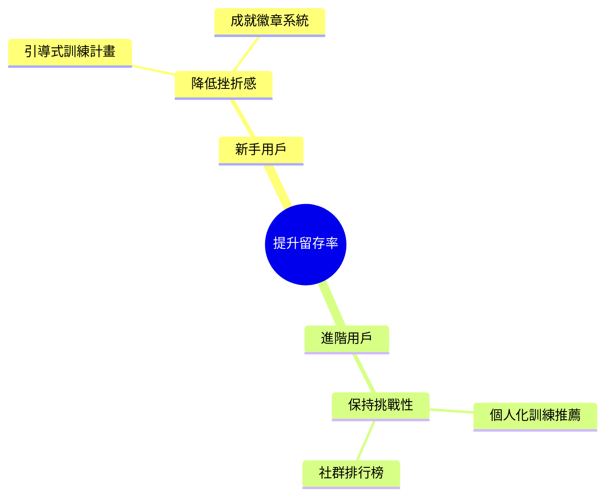
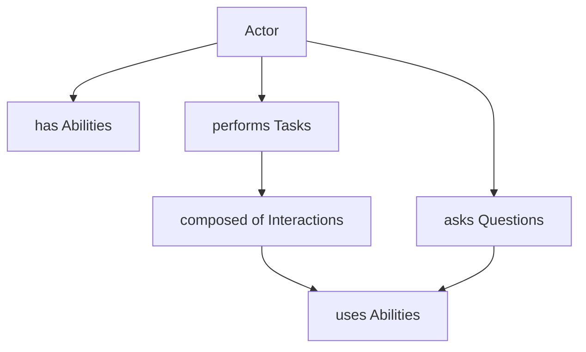
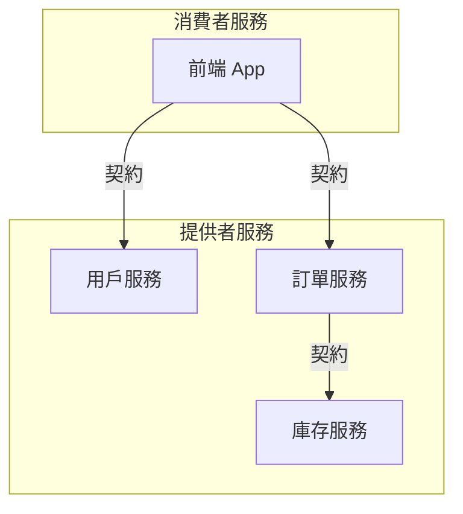
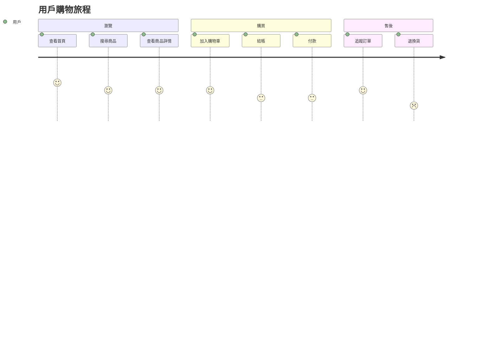
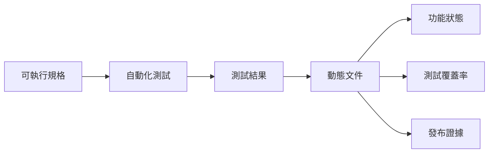

# BDD in Action 詳細章節大綱

> 行為驅動開發實戰：從需求探索到自動化測試的完整指南

---

## Part 1：第一步

### Chapter 01：建置能帶來改變的軟體

**核心目標**：理解 BDD 的本質與價值，建立正確的心態

**章節大綱**：

#### 1.1 從 50,000 英尺高空俯看 BDD
- BDD 的鳥瞰圖：不只是測試，而是協作方法論
- BDD 與傳統開發流程的對比
- 案例：一個失敗專案的反思

#### 1.2 你想解決什麼問題？
- 需求溝通的挑戰
- 測試覆蓋率的迷思
- 文件維護的困境
- 案例：電商平台的需求誤解災難

#### 1.3 BDD 適合你的專案嗎？
- 適用場景分析
- 不適用的情況
- 團隊成熟度評估
- 決策框架：是否採用 BDD

#### 1.4 你將在本書中學到什麼？
- 學習路線圖
- 實戰專案預覽
- 預期成果

**核心產出物**：
- [ ] BDD 價值評估查核清單
- [ ] 團隊成熟度評估表
- [ ] 專案適用性決策樹

**預估字數**：15,000 字

---

### Chapter 02：初探行為驅動開發

**核心目標**：理解 BDD 的歷史、原則與實踐

**章節大綱**：

#### 2.1 BDD 最初是為了讓 TDD 教學變得更容易而設計的
- Dan North 的故事
- 從 TDD 到 BDD 的演進
- 「行為」vs.「測試」的思維轉變

#### 2.2 BDD 也適用於需求分析
- 發現 BDD 在需求階段的價值
- 三人小組（Three Amigos）的誕生
- 案例：用戶故事的進化

#### 2.3 BDD 的原則與實踐
- 核心原則
  - 以行為為中心
  - 以範例說明
  - 自動化驗證
- 實踐方法
  - 範例映射（Example Mapping）
  - 功能映射（Feature Mapping）
  - Gherkin 語法

#### 2.4 BDD 的好處
- 改善溝通與協作
- 減少需求誤解
- 提升測試效率
- 建立動態文件
- 數據：BDD 團隊的效益統計

#### 2.5 BDD 的缺點與潛在挑戰
- 學習曲線
- 初期投入成本
- 維護負擔
- 常見反模式

**核心產出物**：
- [ ] BDD 原則速查卡
- [ ] 優缺點對照表
- [ ] 常見反模式清單

**預估字數**：18,000 字

---

### Chapter 03：行為驅動開發：旋風之旅

**核心目標**：透過完整案例體驗 BDD 全流程

**章節大綱**：

#### 3.1 BDD 流程
- 完整 BDD 循環圖解
- 三個階段：Discovery → Formulation → Automation



#### 3.2 推測：辨識業務價值與功能
- 案例：線上書店系統
- 識別業務目標
- 功能優先排序
- 產出：功能清單

#### 3.3 說明：透過範例探索功能
- 三人小組會議模擬
- 範例映射工作坊
- 產出：範例映射卡

#### 3.4 制定：從範例到可執行規格
- Gherkin 語法入門
- Given-When-Then 結構
- 產出：Feature 檔案

```gherkin
Feature: 購物車結帳
  作為一個已登入的顧客
  我想要完成購物車結帳
  以便購買我選擇的書籍

  Scenario: 成功結帳
    Given 我已登入系統
    And 購物車中有 2 本書
    When 我點擊「結帳」按鈕
    And 選擇信用卡付款
    Then 我應該看到訂單確認頁面
    And 收到確認郵件
```

#### 3.5 自動化：從可執行規格到自動化測試
- Step Definitions 實作
- 測試執行與報告
- 產出：自動化測試程式碼

#### 3.6 展示：測試作為動態文件
- Serenity BDD 報告
- 動態文件的價值
- 與利害關係人分享

#### 3.7 BDD 降低維護成本
- 長期效益分析
- 案例：6 個月後的維護成本對比

**核心產出物**：
- [ ] 完整的 Feature 檔案範例
- [ ] Step Definitions 程式碼
- [ ] BDD 流程圖
- [ ] Serenity 報告截圖

**預估字數**：22,000 字

---

## Part 2：我想要什麼？用 BDD 定義需求

### Chapter 04：推測：從業務目標到優先功能

**核心目標**：學習從業務目標推導功能的方法

**章節大綱**：

#### 4.1 推測階段
- 推測階段的目標與產出
- 參與角色
- 常見工具與技術

#### 4.2 描述業務願景與目標
- 願景陳述撰寫
- SMART 目標設定
- 案例：健身 App 的業務目標

```
願景：成為最受歡迎的個人健身教練 App
目標：
- 6 個月內達到 10 萬活躍用戶
- 用戶留存率提升至 40%
- 付費轉換率達到 5%
```

#### 4.3 影響映射（Impact Mapping）
- 影響映射的四個層次
  - Why：業務目標
  - Who：角色
  - How：影響
  - What：功能
- 實作工作坊流程
- 案例：健身 App 影響映射



#### 4.4 海盜畫布（Pirate Canvas / AARRR）
- AARRR 指標框架
  - Acquisition 獲取
  - Activation 啟用
  - Retention 留存
  - Revenue 營收
  - Referral 推薦
- 功能與指標的對應
- 案例：健身 App 海盜畫布

**核心產出物**：
- [ ] 影響映射範本
- [ ] 海盜畫布範本
- [ ] 功能優先級矩陣
- [ ] 業務目標與功能對照表

**預估字數**：20,000 字

---

### Chapter 05：對功能進行描述與優先排序

**核心目標**：學習描述功能與優先排序的技術

**章節大綱**：

#### 5.1 BDD 與產品待辦清單精煉
- 待辦清單精煉會議
- BDD 如何融入 Scrum
- 持續發現 vs. 批次精煉

#### 5.2 什麼是「功能」？
- Feature vs. User Story vs. Epic
- 功能的粒度
- 案例：功能拆分實作

#### 5.3 實際選擇：在必要之前，不要過早承諾
- 最後責任時刻（Last Responsible Moment）
- 漸進式細化
- 避免過度規格化

#### 5.4 刻意探索（Deliberate Discovery）
- 刻意探索的原則
- 探索式測試會議
- 發現未知的未知

#### 5.5 透過 BDD 進行版本發布與 Sprint 規劃
- 功能就緒度（Feature Readiness）
- Sprint 規劃中的 BDD
- 發布規劃與功能切片

**核心產出物**：
- [ ] 功能描述範本
- [ ] 優先級評估矩陣（MoSCoW、WSJF）
- [ ] Sprint 規劃查核清單
- [ ] 功能就緒度評估表

**預估字數**：18,000 字

---

### Chapter 06：用範例說明功能

**核心目標**：掌握需求探索工作坊的核心技術

**章節大綱**：

#### 6.1 「三人小組會議」與其他的需求探索工作坊
- 三人小組（Three Amigos）介紹
  - 產品負責人（PO）
  - 開發人員（Dev）
  - 測試人員（QA）
- 會議流程與時間控制
- 遠端協作技巧

#### 6.2 透過範例來說明功能
- 為什麼範例比規格更有效
- 好範例的特徵
- 案例：登入功能的範例探索

```
功能：用戶登入

範例 1：成功登入
- 輸入正確的帳號和密碼
- 結果：看到首頁

範例 2：密碼錯誤
- 輸入正確帳號但錯誤密碼
- 結果：看到錯誤訊息

範例 3：帳號被鎖定
- 連續輸入錯誤密碼 5 次
- 結果：帳號被暫時鎖定 15 分鐘

問題：
- 密碼錯誤幾次會鎖定？
- 鎖定多久？
- 需要驗證碼嗎？
```

#### 6.3 使用表格來描述更複雜的需求
- 決策表（Decision Tables）
- 範例表（Example Tables）
- 案例：訂單折扣規則

| 會員等級 | 訂單金額 | 折扣 |
|---------|---------|-----|
| 一般    | < 500   | 0%  |
| 一般    | >= 500  | 5%  |
| VIP     | < 500   | 5%  |
| VIP     | >= 500  | 10% |

#### 6.4 範例映射（Example Mapping）
- 四種顏色卡片
  - 黃色：User Story
  - 藍色：Rule/規則
  - 綠色：Example/範例
  - 紅色：Question/問題
- 範例映射工作坊流程
- 案例：完整的範例映射實作

#### 6.5 功能映射（Feature Mapping）
- 功能映射與範例映射的差異
- 流程導向的探索
- 案例：結帳流程功能映射

#### 6.6 OOPSI
- OOPSI 框架介紹
  - Outcomes：成果
  - Outputs：產出
  - Processes：流程
  - Scenarios：場景
  - Inputs：輸入
- 應用場景

**核心產出物**：
- [ ] 範例映射卡片範本
- [ ] 三人小組會議議程表
- [ ] 決策表範本
- [ ] 功能映射範本

**預估字數**：22,000 字

---

### Chapter 07：從範例到可執行規格

**核心目標**：掌握 Gherkin 語法與場景撰寫技巧

**章節大綱**：

#### 7.1 將具體範例轉換成可執行場景
- 從範例到 Gherkin 的轉換流程
- 保持範例的具體性
- 案例：登入功能的轉換

#### 7.2 撰寫可執行場景
- Gherkin 語法詳解
  - Feature：功能
  - Scenario：場景
  - Given：前提條件
  - When：動作
  - Then：預期結果
  - And/But：連接詞
- 場景撰寫最佳實踐

```gherkin
Feature: 用戶登入
  作為一個註冊用戶
  我想要登入系統
  以便存取我的個人資料

  Background:
    Given 系統中存在以下用戶:
      | username | password  | status |
      | alice    | pass123   | active |
      | bob      | pass456   | locked |

  Scenario: 使用正確憑證成功登入
    Given 我在登入頁面
    When 我輸入帳號 "alice" 和密碼 "pass123"
    And 我點擊登入按鈕
    Then 我應該被導向首頁
    And 我應該看到歡迎訊息 "歡迎回來，Alice"

  Scenario: 使用錯誤密碼登入失敗
    Given 我在登入頁面
    When 我輸入帳號 "alice" 和密碼 "wrongpass"
    And 我點擊登入按鈕
    Then 我應該停留在登入頁面
    And 我應該看到錯誤訊息 "帳號或密碼錯誤"
```

#### 7.3 在場景中使用表格
- Scenario Outline + Examples
- Data Tables
- 案例：批量測試數據

```gherkin
Scenario Outline: 會員折扣計算
  Given 我是 "<會員等級>" 會員
  When 我的訂單金額是 <金額> 元
  Then 我應該獲得 <折扣>% 的折扣

  Examples:
    | 會員等級 | 金額 | 折扣 |
    | 一般     | 400  | 0    |
    | 一般     | 600  | 5    |
    | VIP      | 400  | 5    |
    | VIP      | 600  | 10   |
```

#### 7.4 使用功能檔案與標籤來組織場景
- 功能檔案的組織結構
- 標籤策略
  - @smoke, @regression
  - @wip, @ignore
  - @slow, @fast
- 目錄結構最佳實踐

#### 7.5 規則與範例（Rules and Examples）
- Gherkin 6 的 Rule 關鍵字
- 案例：使用 Rule 組織場景

```gherkin
Feature: 訂單折扣

  Rule: 一般會員滿 500 享 5% 折扣

    Scenario: 一般會員訂單未達門檻
      Given 我是一般會員
      When 訂單金額是 400 元
      Then 折扣應該是 0%

    Scenario: 一般會員訂單達到門檻
      Given 我是一般會員
      When 訂單金額是 600 元
      Then 折扣應該是 5%

  Rule: VIP 會員享有更高折扣

    Scenario: VIP 會員基本折扣
      Given 我是 VIP 會員
      When 訂單金額是 400 元
      Then 折扣應該是 5%
```

#### 7.6 表達力強的場景：模式與反模式
- 好的模式
  - 聲明式 vs. 命令式
  - 單一行為原則
  - 有意義的資料
- 反模式
  - 場景過長
  - UI 細節洩漏
  - 無意義的資料

#### 7.7 那麼，所有的細節去哪了呢？
- 抽象層次的選擇
- 細節隱藏在 Step Definitions
- 保持場景的可讀性

**核心產出物**：
- [ ] Gherkin 語法速查表
- [ ] 場景撰寫檢查清單
- [ ] Feature 檔案範本
- [ ] 標籤策略指南

**預估字數**：25,000 字

---

## Part 3：要怎麼實作？用 BDD 寫程式碼

### Chapter 08：從可執行規格到自動化驗收測試

**核心目標**：學習使用 Cucumber 自動化 BDD 場景

**章節大綱**：

#### 8.1 自動化場景簡介
- 自動化測試金字塔
- 驗收測試的位置
- 自動化的價值與成本

#### 8.2 設定你的專案環境
- Java 環境設定
  - Maven/Gradle 配置
  - Cucumber 依賴
- JavaScript 環境設定
  - npm 配置
  - Cucumber.js 安裝
- TypeScript 環境設定
  - tsconfig 配置
  - 類型定義

```xml
<!-- pom.xml (Java) -->
<dependencies>
    <dependency>
        <groupId>io.cucumber</groupId>
        <artifactId>cucumber-java</artifactId>
        <version>7.14.0</version>
        <scope>test</scope>
    </dependency>
    <dependency>
        <groupId>io.cucumber</groupId>
        <artifactId>cucumber-junit-platform-engine</artifactId>
        <version>7.14.0</version>
        <scope>test</scope>
    </dependency>
</dependencies>
```

#### 8.3 執行 Cucumber 場景
- 命令列執行
- IDE 整合
- 報告生成

#### 8.4 撰寫 glue code
- Step Definitions 基礎
- 參數擷取
- 資料表處理

```java
// Java Step Definitions
public class LoginSteps {

    private LoginPage loginPage;
    private HomePage homePage;

    @Given("我在登入頁面")
    public void iAmOnTheLoginPage() {
        loginPage = new LoginPage(driver);
        loginPage.open();
    }

    @When("我輸入帳號 {string} 和密碼 {string}")
    public void iEnterUsernameAndPassword(String username, String password) {
        loginPage.enterUsername(username);
        loginPage.enterPassword(password);
    }

    @When("我點擊登入按鈕")
    public void iClickTheLoginButton() {
        homePage = loginPage.clickLogin();
    }

    @Then("我應該被導向首頁")
    public void iShouldBeRedirectedToHomePage() {
        assertThat(homePage.isDisplayed()).isTrue();
    }
}
```

#### 8.5 使用「背景」與「掛鉤」來進行設定與清除
- Background 的使用
- Before/After Hooks
- 場景級別 vs. 功能級別

```java
public class Hooks {

    @Before
    public void setUp() {
        // 每個場景前執行
        driver = WebDriverFactory.createDriver();
    }

    @After
    public void tearDown(Scenario scenario) {
        // 每個場景後執行
        if (scenario.isFailed()) {
            takeScreenshot(scenario);
        }
        driver.quit();
    }

    @Before("@database")
    public void setUpDatabase() {
        // 只有標記 @database 的場景才執行
        DatabaseHelper.reset();
    }
}
```

#### 8.6 使用掛鉤來準備測試環境
- 測試資料準備
- 狀態重置
- 條件式執行

#### 8.7 使用虛擬測試環境
- Docker 整合
- 測試容器（Testcontainers）
- 模擬服務

**核心產出物**：
- [ ] Maven/Gradle 配置範例
- [ ] npm/package.json 配置範例
- [ ] Step Definitions 範本
- [ ] Hooks 配置範例
- [ ] Docker Compose 測試環境

**預估字數**：28,000 字

---

### Chapter 09：撰寫穩固的自動化驗收測試

**核心目標**：學習提升測試穩定性與可維護性的技巧

**章節大綱**：

#### 9.1 撰寫產業級強度的驗收測試
- 穩定性挑戰
- 可維護性原則
- 測試金字塔回顧

#### 9.2 使用「人物設定」與「已知實體」
- Persona 模式
- 測試資料管理
- 案例：用戶 Persona 實作

```java
public class Personas {
    public static final User ALICE = User.builder()
        .username("alice")
        .email("alice@example.com")
        .role(Role.CUSTOMER)
        .build();

    public static final User BOB = User.builder()
        .username("bob")
        .email("bob@example.com")
        .role(Role.ADMIN)
        .build();
}

// 在 Step Definition 中使用
@Given("Alice 已登入系統")
public void aliceIsLoggedIn() {
    loginAs(Personas.ALICE);
}
```

#### 9.3 抽象層次
- 三層抽象架構
  - 規格層（Specification Layer）
  - 任務層（Task Layer）
  - 技術層（Technical Layer）
- 各層職責
- 案例：三層抽象實作

```
規格層（Gherkin）
    ↓
任務層（Business Actions）
    ↓
技術層（UI/API Interactions）
```

**核心產出物**：
- [ ] Persona 模式範本
- [ ] 測試資料管理策略
- [ ] 三層抽象架構圖
- [ ] 穩定性檢查清單

**預估字數**：22,000 字

---

### Chapter 10：自動化使用者介面層的驗收標準

**核心目標**：學習 UI 自動化測試的策略與技術

**章節大綱**：

#### 10.1 何時及如何測試 UI？
- UI 測試的價值與成本
- 什麼應該在 UI 層測試
- 什麼不應該在 UI 層測試

#### 10.2 UI 測試在整體測試自動化策略中扮演什麼角色？
- 測試金字塔中的 UI 測試
- E2E 測試策略
- 關鍵路徑測試

#### 10.3 適合測試的 Web 應用程式
- 可測試性設計
- 元素定位策略
  - ID、Class、Name
  - data-testid 屬性
  - XPath vs. CSS Selector
- 等待策略

```java
// 好的定位策略
@FindBy(css = "[data-testid='login-button']")
private WebElement loginButton;

// 避免的定位策略
@FindBy(xpath = "//div[3]/form/button[2]")
private WebElement submitButton; // 脆弱！
```

#### 10.4 下一步
- Selenium WebDriver
- Playwright
- Cypress 比較

**核心產出物**：
- [ ] 元素定位策略指南
- [ ] 等待策略查核清單
- [ ] UI 測試覆蓋率建議
- [ ] 工具比較表

**預估字數**：25,000 字

---

### Chapter 11：UI 層的測試自動化設計模式

**核心目標**：掌握 Page Object 等 UI 測試設計模式

**章節大綱**：

#### 11.1 未結構化測試腳本的限制
- 維護噩夢
- 重複程式碼
- 案例：一個糟糕的測試

#### 11.2 將定位邏輯與測試邏輯分離
- 關注點分離
- 定位器集中管理
- 案例：重構前後對比

#### 11.3 介紹「頁面物件」模式（Page Object Pattern）
- Page Object 的原則
- 實作範例
- 最佳實踐

```java
public class LoginPage {
    private final WebDriver driver;

    @FindBy(id = "username")
    private WebElement usernameField;

    @FindBy(id = "password")
    private WebElement passwordField;

    @FindBy(css = "[data-testid='login-button']")
    private WebElement loginButton;

    public LoginPage(WebDriver driver) {
        this.driver = driver;
        PageFactory.initElements(driver, this);
    }

    public void open() {
        driver.get("/login");
    }

    public void enterUsername(String username) {
        usernameField.clear();
        usernameField.sendKeys(username);
    }

    public void enterPassword(String password) {
        passwordField.clear();
        passwordField.sendKeys(password);
    }

    public HomePage clickLogin() {
        loginButton.click();
        return new HomePage(driver);
    }

    public LoginPage clickLoginExpectingError() {
        loginButton.click();
        return this;
    }

    public String getErrorMessage() {
        return driver.findElement(By.css(".error-message")).getText();
    }
}
```

#### 11.4 超越頁面物件的做法
- Page Component 模式
- Loadable Component 模式
- 流暢介面（Fluent API）

```java
// Fluent API 風格
loginPage
    .enterUsername("alice")
    .enterPassword("password")
    .clickLogin()
    .verifyWelcomeMessage("歡迎回來，Alice");
```

**核心產出物**：
- [ ] Page Object 範本
- [ ] Page Component 範本
- [ ] 設計模式對照表
- [ ] 重構檢查清單

**預估字數**：22,000 字

---

### Chapter 12：可擴充的測試自動化與「演員劇本模式」

**核心目標**：掌握 Screenplay Pattern 進階測試自動化模式

**章節大綱**：

#### 12.1 什麼是「演員劇本模式」，為什麼我們需要它？
- Page Object 的限制
- Screenplay Pattern 的優勢
- SOLID 原則在測試中的應用

#### 12.2 演員劇本的基礎概念
- Actor（演員）
- Task（任務）
- Interaction（互動）
- Question（問題）
- Ability（能力）



#### 12.3 「演員」是什麼？
- Actor 的定義與建立
- 案例：Alice 演員

```typescript
// Serenity/JS
const Alice = Actor.named('Alice').whoCan(
    BrowseTheWeb.using(protractor.browser),
    CallAnApi.at('https://api.example.com')
);
```

#### 12.4 演員執行任務（Tasks）
- Task 的定義
- Task 的組合
- 案例：登入任務

```typescript
// 登入任務
export const Login = {
    as: (username: string, password: string) =>
        Task.where(`#actor logs in as ${username}`,
            Enter.theValue(username).into(LoginPage.UsernameField),
            Enter.theValue(password).into(LoginPage.PasswordField),
            Click.on(LoginPage.LoginButton)
        )
};

// 使用
await Alice.attemptsTo(
    Login.as('alice@example.com', 'password123')
);
```

#### 12.5 「互動」用來建模演員如何與系統互動
- 內建 Interactions
- 自訂 Interactions
- 案例：拖放互動

#### 12.6 「能力」是演員與系統互動的方式
- BrowseTheWeb
- CallAnApi
- TakeNotes
- 自訂 Abilities

#### 12.7 撰寫我們自己的互動類別
- 自訂 Interaction
- 實作範例

```typescript
export class UploadFile extends Interaction {
    static named(fileName: string) {
        return new UploadFile(fileName);
    }

    constructor(private fileName: string) {
        super();
    }

    async performAs(actor: UsesAbilities & AnswersQuestions): Promise<void> {
        const filePath = path.join(__dirname, 'fixtures', this.fileName);
        await BrowseTheWeb.as(actor).element(FileInput).sendKeys(filePath);
    }
}
```

#### 12.8 「問題」讓演員可以查詢系統的狀態
- Question 的定義
- 內建 Questions
- 自訂 Questions

```typescript
// 查詢購物車商品數量
const CartItemCount = Question.about('cart item count', actor =>
    Text.of(CartPage.ItemCount).answeredBy(actor)
        .then(text => parseInt(text, 10))
);

// 使用
await Alice.attemptsTo(
    Ensure.that(CartItemCount, equals(3))
);
```

#### 12.9 「任務」用來建模較高層級的業務動作
- 複合任務
- 任務組合
- 案例：結帳流程

#### 12.10 「演員劇本」與 Cucumber 的結合
- Cucumber + Serenity/JS
- Step Definitions 實作
- 完整範例

```typescript
// Step Definitions with Screenplay
Given('Alice 已登入系統', async function() {
    await Alice.attemptsTo(
        Login.as('alice@example.com', 'password123')
    );
});

When('Alice 將商品加入購物車', async function() {
    await Alice.attemptsTo(
        AddToCart.theProduct('JavaScript 權威指南')
    );
});

Then('購物車應該有 {int} 件商品', async function(count: number) {
    await Alice.attemptsTo(
        Ensure.that(CartItemCount, equals(count))
    );
});
```

**核心產出物**：
- [ ] Screenplay Pattern 架構圖
- [ ] Actor 配置範例
- [ ] Task/Interaction/Question 範本
- [ ] Cucumber 整合範例
- [ ] Serenity/JS 專案範本

**預估字數**：28,000 字

---

### Chapter 13：微服務和 API 的 BDD 與可執行規格

**核心目標**：學習 API 層級的 BDD 測試策略

**章節大綱**：

#### 13.1 API 與如何測試
- API 測試的價值
- REST API 測試基礎
- GraphQL 測試基礎

#### 13.2 使用網頁 UI 與微服務定義一個功能
- 全端功能定義
- UI + API 協作
- 案例：用戶註冊功能

#### 13.3 為微服務自動化驗收測試
- API 測試工具
  - REST Assured (Java)
  - SuperTest (JavaScript)
  - requests (Python)
- 案例：訂單服務測試

```java
// REST Assured 範例
@When("我發送 POST 請求到 {string}")
public void iSendPostRequestTo(String endpoint, DataTable data) {
    Map<String, String> body = data.asMap(String.class, String.class);

    response = given()
        .contentType(ContentType.JSON)
        .body(body)
    .when()
        .post(endpoint);
}

@Then("回應狀態碼應該是 {int}")
public void responseStatusShouldBe(int statusCode) {
    response.then().statusCode(statusCode);
}

@Then("回應應該包含 {string}")
public void responseShouldContain(String field) {
    response.then().body(field, notNullValue());
}
```

#### 13.4 正在測試的微服務架構
- 服務邊界測試
- 契約測試（Contract Testing）
- 消費者驅動契約（CDC）



#### 13.5 自動化更細緻的場景以及與外部服務的互動
- Mock 服務
- WireMock 整合
- 測試替身策略

#### 13.6 測試 API 本身，還是透過 API 進行測試
- API 測試 vs. API 驅動測試
- 測試策略選擇
- 案例分析

**核心產出物**：
- [ ] REST Assured 配置範例
- [ ] 契約測試範本（Pact）
- [ ] WireMock 配置範例
- [ ] API 測試策略指南

**預估字數**：25,000 字

---

### Chapter 14：既有系統的可執行規格，透過 Serenity/JS 實作

**核心目標**：學習為既有系統建立 BDD 測試

**章節大綱**：

#### 14.1 透過「旅程映射」探索未知領域
- 旅程映射（Journey Mapping）
- 探索既有系統
- 識別關鍵流程



#### 14.2 設計可擴充的測試自動化系統
- 架構設計原則
- 可維護性考量
- 案例：電商系統測試架構

#### 14.3 在「規格層」中捕捉業務脈絡
- 業務語言
- 領域特定語言（DSL）
- 案例：訂單 DSL

```typescript
// 業務 DSL
class 訂單 {
    static 建立(商品: string[]) {
        return new 訂單建立任務(商品);
    }

    static 確認() {
        return new 訂單確認任務();
    }

    static 狀態() {
        return new 訂單狀態查詢();
    }
}

// 使用
await 客戶.執行(
    訂單.建立(['JavaScript 權威指南', 'TypeScript 深入淺出']),
    訂單.確認()
);

await 客戶.確認(訂單.狀態(), 等於('已確認'));
```

**核心產出物**：
- [ ] 旅程映射範本
- [ ] Serenity/JS 專案結構
- [ ] 業務 DSL 範例
- [ ] 遺留系統測試策略

**預估字數**：22,000 字

---

### Chapter 15：可攜式測試自動化，透過 Serenity/JS 實作

**核心目標**：學習建立可跨平台的測試自動化系統

**章節大綱**：

#### 15.1 設計測試自動化系統的「領域層」
- 領域層架構
- 業務概念抽象
- 案例：電商領域模型

```typescript
// 領域模型
interface Product {
    id: string;
    name: string;
    price: number;
    category: Category;
}

interface Order {
    id: string;
    items: OrderItem[];
    status: OrderStatus;
    total: number;
}

// 領域任務
const AddProductToCart = (product: Product) =>
    Task.where(`#actor adds ${product.name} to cart`,
        // 實作可以是 UI 或 API
    );
```

#### 15.2 設計可攜式的整合層
- 整合層模式
- 多平台支援
  - Web UI (Playwright/Selenium)
  - API (REST/GraphQL)
  - Mobile (Appium)
- 案例：可攜式測試

```typescript
// 可攜式任務 - 實作可切換
const Login = {
    as: (user: User) => {
        if (TestConfig.mode === 'api') {
            return ApiLogin.as(user);
        }
        return UiLogin.as(user);
    }
};

// UI 實作
const UiLogin = {
    as: (user: User) =>
        Task.where(`#actor logs in via UI`,
            Navigate.to('/login'),
            Enter.theValue(user.email).into(LoginPage.Email),
            Enter.theValue(user.password).into(LoginPage.Password),
            Click.on(LoginPage.SubmitButton)
        )
};

// API 實作
const ApiLogin = {
    as: (user: User) =>
        Task.where(`#actor logs in via API`,
            Send.a(PostRequest.to('/api/auth/login').with({
                email: user.email,
                password: user.password
            })),
            Save.theResponseAs('authToken')
        )
};
```

**核心產出物**：
- [ ] 領域層架構圖
- [ ] 整合層抽象範例
- [ ] 多平台配置範例
- [ ] 可攜式測試範本

**預估字數**：20,000 字

---

### Chapter 16：動態文件與釋出版本的證據

**核心目標**：學習使用 BDD 測試產生動態文件

**章節大綱**：

#### 16.1 動態文件：高階視角
- 什麼是動態文件（Living Documentation）
- 動態文件的價值
- 與傳統文件的對比



#### 16.2 功能就緒度與功能涵蓋率報告
- Serenity BDD 報告
- 功能就緒度指標
- 案例：報告解讀

#### 16.3 整合數位產品待辦清單
- Jira 整合
- 需求追溯
- 案例：需求到測試的追溯

#### 16.4 善用產品待辦清單工具以提升協作效率
- 工具整合策略
- 自動同步
- 案例：CI/CD 整合

#### 16.5 組織動態文件
- 文件結構
- 導航設計
- 權限管理

#### 16.6 舊有應用程式的動態文件
- 為遺留系統建立文件
- 漸進式文件化
- 案例：遺留系統文件化策略

**核心產出物**：
- [ ] Serenity BDD 報告配置
- [ ] Jira 整合範例
- [ ] CI/CD Pipeline 配置
- [ ] 文件組織策略指南

**預估字數**：18,000 字

---

## 附錄

### 附錄 A：Gherkin 語法參考

- 完整語法參考
- 多語言支援
- 常見問題

### 附錄 B：工具安裝指南

- Cucumber 安裝（Java/JS/TS）
- Serenity BDD 安裝
- Serenity/JS 安裝

### 附錄 C：常見反模式與解決方案

- 場景撰寫反模式
- 自動化反模式
- 團隊協作反模式

---

## 寫作進度追蹤

| 章節 | 狀態 | 字數 | 完成日期 |
|------|------|------|----------|
| Ch01 | ⏳ 待撰寫 | 0 | - |
| Ch02 | ⏳ 待撰寫 | 0 | - |
| Ch03 | ⏳ 待撰寫 | 0 | - |
| Ch04 | ⏳ 待撰寫 | 0 | - |
| Ch05 | ⏳ 待撰寫 | 0 | - |
| Ch06 | ⏳ 待撰寫 | 0 | - |
| Ch07 | ⏳ 待撰寫 | 0 | - |
| Ch08 | ⏳ 待撰寫 | 0 | - |
| Ch09 | ⏳ 待撰寫 | 0 | - |
| Ch10 | ⏳ 待撰寫 | 0 | - |
| Ch11 | ⏳ 待撰寫 | 0 | - |
| Ch12 | ⏳ 待撰寫 | 0 | - |
| Ch13 | ⏳ 待撰寫 | 0 | - |
| Ch14 | ⏳ 待撰寫 | 0 | - |
| Ch15 | ⏳ 待撰寫 | 0 | - |
| Ch16 | ⏳ 待撰寫 | 0 | - |

**總計**：0 / 350,000 字（0%）

---

**最後更新**：2025-11-22
