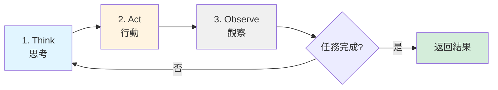

# 第1章：建構你的第一個 Claude Agent - 智慧客服助理

## 本章導覽

想像一下，你是一家快速成長的電商平台的技術主管。每天，客服團隊要處理上千個重複性的問題：「我的訂單什麼時候會到？」、「如何退貨？」、「有沒有折扣碼？」。你的客服團隊已經疲於應付，而且回應時間越來越長。

你想過使用傳統的聊天機器人，但它們太僵硬了——只能處理預設的關鍵字，一遇到稍微複雜的問題就「聽不懂」，最後還是要轉接給人工客服。你需要的是一個**真正理解自然語言、能夠推理、可以整合現有系統**的智慧助理。

**這就是 AI Agent 的用武之地。**

在本章結束時，你將建立一個能夠：
- ✅ 理解客戶的自然語言問題（不需要精確的關鍵字匹配）
- ✅ 從知識庫中搜尋相關的 FAQ 答案
- ✅ 查詢真實的訂單狀態（整合後端 API）
- ✅ 以友善、專業的語氣回覆客戶
- ✅ 記住對話歷史，處理多輪對話

**而這一切，只需要不到 200 行的 Python 程式碼。**

讓我們開始吧！

---

## 1.1 理解 Agent：不只是「呼叫 API」

在動手寫程式碼之前，我們需要先理解**什麼是 Agent**，以及**它與傳統的 AI 應用有什麼不同**。

### 1.1.1 傳統 LLM 應用 vs. Agent

**傳統方式：單次呼叫**

```python
# 傳統方式：直接呼叫 LLM API
response = client.messages.create(
    model="claude-sonnet-4-20250514",
    max_tokens=1024,
    messages=[{"role": "user", "content": "我的訂單什麼時候會到？"}]
)

print(response.content)
# 輸出：「我無法查詢您的訂單資訊，因為我沒有訪問您系統的權限...」
```

**問題在哪裡？**

Claude 很聰明，它能理解問題，但它**無法採取行動**。它不知道：
- 如何查詢你的訂單資料庫
- 如何讀取你的 FAQ 文件
- 如何取得最新的物流資訊

它只是一個「純語言模型」，只能根據訓練資料生成文字。

**Agent 方式：行動循環**

```python
# Agent 方式：賦予 LLM 工具
agent = Agent(
    model="claude-sonnet-4-20250514",
    tools=[
        search_faq,         # 搜尋 FAQ 的工具
        query_order_status, # 查詢訂單的工具
        get_shipping_info   # 取得物流資訊的工具
    ],
    system_prompt="你是專業的客服助理..."
)

response = agent.run("我的訂單什麼時候會到？訂單號 #12345")

# Agent 會自動：
# 1. 理解問題（需要查詢訂單）
# 2. 呼叫 query_order_status("#12345")
# 3. 取得結果（例如：「預計 2025-11-10 送達」）
# 4. 生成友善的回覆
```

**輸出：**
```
您好！我已經查詢了您的訂單 #12345。
目前訂單狀態是「配送中」，預計會在 2025 年 11 月 10 日送達。
配送公司是黑貓宅急便，您可以使用追蹤碼 ABC123 查詢即時位置。
如果有任何問題，請隨時告訴我！😊
```

**關鍵差異：**

| 特性 | 傳統 LLM 應用 | Agent |
|------|--------------|-------|
| **能力** | 只能生成文字 | 可以採取行動 |
| **互動** | 單次問答 | 循環式推理 |
| **整合** | 需要手動編排 | 自動決策並呼叫工具 |
| **彈性** | 固定流程 | 動態適應 |

### 1.1.2 Agent 的核心循環：Think → Act → Observe

每個 Agent 都遵循一個基本的循環：



**實際運作範例：**

```
使用者問題：「我的訂單什麼時候會到？訂單號 #12345」

循環 1:
  🧠 Think: 使用者想查詢訂單狀態，我需要使用 query_order_status 工具
  🔧 Act: 呼叫 query_order_status("#12345")
  👀 Observe: 回傳 {"status": "配送中", "estimated_delivery": "2025-11-10"}

循環 2:
  🧠 Think: 我已經取得訂單資訊，現在可以生成回覆了
  🔧 Act: 生成友善的回覆文字
  👀 Observe: 回覆已生成
  ✅ 任務完成！
```

**為什麼這很重要？**

這種循環式的架構讓 Agent 能夠：
1. **處理複雜任務**：一步步分解問題
2. **動態適應**：根據每次觀察調整策略
3. **自我修正**：發現錯誤時可以重試或改變方法

---

## 1.2 環境設定：5 分鐘快速開始

### 1.2.1 前置需求

**系統需求：**
- Python 3.9 或更新版本
- pip（Python 套件管理工具）
- 文字編輯器（推薦 VS Code）

**確認你的 Python 版本：**
```bash
python --version
# 應該顯示：Python 3.9.x 或更高
```

如果版本過舊，請從 [python.org](https://www.python.org/) 下載最新版本。

### 1.2.2 建立專案目錄

```bash
# 建立專案資料夾
mkdir customer-service-agent
cd customer-service-agent

# 建立虛擬環境（隔離依賴）
python -m venv venv

# 啟動虛擬環境
# macOS/Linux:
source venv/bin/activate
# Windows:
venv\Scripts\activate

# 你應該會看到命令列前面出現 (venv) 標記
```

**為什麼要使用虛擬環境？**

虛擬環境就像是為你的專案建立一個「乾淨的房間」，所有套件都安裝在這個房間裡，不會影響你系統的其他 Python 專案。這是 Python 開發的最佳實踐。

### 1.2.3 安裝 Claude Agent SDK

```bash
# 安裝 Anthropic SDK
pip install anthropic

# 驗證安裝
python -c "import anthropic; print(anthropic.__version__)"
# 應該顯示版本號，例如：0.25.0
```

### 1.2.4 取得 API 金鑰

**步驟 1：註冊 Anthropic 帳號**
1. 前往 [console.anthropic.com](https://console.anthropic.com)
2. 使用 Google 帳號或 Email 註冊
3. 完成 Email 驗證

**步驟 2：建立 API 金鑰**
1. 登入後，點選左側選單的「API Keys」
2. 點選「Create Key」
3. 給金鑰一個有意義的名稱（例如：「customer-service-dev」）
4. **立即複製並妥善保存金鑰**（只會顯示一次！）

**步驟 3：設定環境變數**

建立一個 `.env` 檔案來儲存金鑰（這是業界標準做法）：

```bash
# 在專案根目錄建立 .env 檔案
cat > .env << EOF
ANTHROPIC_API_KEY=your-api-key-here
EOF

# ‹1› 安裝 python-dotenv 來讀取 .env 檔案
pip install python-dotenv
```

**為什麼不直接寫在程式碼裡？**

❌ **永遠不要這樣做：**
```python
# 不要這樣！
api_key = "sk-ant-abc123..."  # 金鑰會被 commit 到 Git！
```

✅ **正確做法：**
```python
import os
from dotenv import load_dotenv

load_dotenv()  # 從 .env 載入
api_key = os.getenv("ANTHROPIC_API_KEY")
```

**安全提醒：**
- 將 `.env` 加入 `.gitignore`（避免上傳到 GitHub）
- 不要分享你的 API 金鑰
- 如果不小心洩漏，立即在 Console 撤銷並重新建立

### 1.2.5 建立專案結構

```bash
# 建立目錄結構
mkdir -p {tools,memory,data,outputs}

# 建立必要的檔案
touch customer_service_agent.py
touch tools/__init__.py
touch tools/faq_search.py
touch tools/order_query.py
touch memory/CLAUDE.md
touch .gitignore

# 專案結構應該如下：
# customer-service-agent/
# ├── venv/                    # 虛擬環境（自動生成）
# ├── .env                     # API 金鑰（不要 commit！）
# ├── .gitignore              # Git 忽略清單
# ├── customer_service_agent.py  # ‹2› 主程式
# ├── tools/                  # ‹3› 工具函數目錄
# │   ├── __init__.py
# │   ├── faq_search.py
# │   └── order_query.py
# ├── memory/                 # ‹4› Agent 記憶體
# │   └── CLAUDE.md
# ├── data/                   # ‹5› 測試資料
# └── outputs/                # ‹6› 輸出結果
```

**目錄說明：**
- **‹2› customer_service_agent.py**：主程式，定義 Agent 的核心邏輯
- **‹3› tools/**：工具函數，Agent 可以呼叫的「能力」
- **‹4› memory/**：Agent 的長期記憶與指引
- **‹5› data/**：測試資料（FAQ、訂單等）
- **‹6› outputs/**：執行結果與日誌

**設定 .gitignore：**

```bash
# 在 .gitignore 中加入以下內容
cat > .gitignore << EOF
# 環境變數（包含敏感資訊）
.env

# 虛擬環境
venv/
*.pyc
__pycache__/

# IDE 設定
.vscode/
.idea/

# 輸出檔案
outputs/
*.log
EOF
```

---

## 1.3 你的第一個 Agent：最簡版本

讓我們從最簡單的版本開始，然後逐步添加功能。這樣你可以清楚看到每個部分的作用。

### 1.3.1 Hello World：基礎 Agent

**檔案：`customer_service_agent.py`**

```python
# ‹1› 導入必要的套件
import os
from dotenv import load_dotenv
from anthropic import Anthropic

# ‹2› 載入環境變數
load_dotenv()
api_key = os.getenv("ANTHROPIC_API_KEY")

if not api_key:
    raise ValueError("找不到 ANTHROPIC_API_KEY！請檢查 .env 檔案。")

# ‹3› 初始化 Anthropic 客戶端
client = Anthropic(api_key=api_key)

# ‹4› 建立一個最簡單的 Agent
def simple_agent(user_message: str) -> str:
    """
    最基礎的 Agent：只會回覆訊息，還不會使用工具

    Args:
        user_message: 使用者的問題

    Returns:
        Agent 的回覆
    """
    # ‹5› 呼叫 Claude API
    response = client.messages.create(
        model="claude-sonnet-4-20250514",  # ‹6› 使用 Sonnet 4 模型
        max_tokens=1024,                    # ‹7› 限制回覆長度
        system="你是一位專業且友善的客服助理。",  # ‹8› 系統提示
        messages=[
            {"role": "user", "content": user_message}
        ]
    )

    # ‹9› 提取回覆內容
    return response.content[0].text


# ====================================================================
# 測試我們的 Agent
# ====================================================================

if __name__ == "__main__":
    print("🤖 客服助理已啟動！（輸入 'quit' 結束）\n")

    while True:
        # 讀取使用者輸入
        user_input = input("👤 您: ")

        if user_input.lower() in ['quit', 'exit', '結束']:
            print("👋 感謝使用，再見！")
            break

        if not user_input.strip():
            continue

        # 取得 Agent 回覆
        print("🤖 助理: ", end="", flush=True)
        reply = simple_agent(user_input)
        print(reply)
        print()  # 空行分隔
```

**程式碼解析：**

- **‹1›-‹2› 環境設定**：載入 API 金鑰，這是所有 Agent 的第一步
- **‹3› 初始化客戶端**：建立與 Anthropic API 的連線
- **‹4› Agent 函數**：封裝 Agent 邏輯，方便重用
- **‹5› API 呼叫**：實際向 Claude 發送請求
- **‹6› 模型選擇**：
  - `claude-sonnet-4-20250514`：平衡速度與品質（推薦）
  - `claude-opus-4-20250514`：最強大，但較慢且昂貴
  - `claude-haiku-4-20250408`：最快速且便宜，適合簡單任務
- **‹7› max_tokens**：控制回覆長度（避免成本失控）
- **‹8› system prompt**：定義 Agent 的角色與行為
- **‹9› 提取回覆**：從回應物件中取出文字

**執行測試：**

```bash
python customer_service_agent.py
```

**範例對話：**

```
🤖 客服助理已啟動！（輸入 'quit' 結束）

👤 您: 你好！
🤖 助理: 您好！很高興為您服務。請問有什麼我可以幫助您的嗎？

👤 您: 我想知道退貨政策
🤖 助理: 關於退貨政策，我們提供以下服務：
1. 收到商品後 7 天內可申請退貨
2. 商品需保持全新未使用狀態
3. 退貨運費由顧客負擔（商品瑕疵除外）
...

👤 您: quit
👋 感謝使用，再見！
```

**恭喜！你已經建立了第一個 AI Agent！** 🎉

但它還很基礎——它不能查詢訂單、不能搜尋知識庫。讓我們賦予它更多能力。

---

## 1.4 賦予 Agent 第一個工具：搜尋 FAQ

現在，我們要讓 Agent 能夠**自主決定何時使用工具**，而不是僵硬地執行固定流程。

### 1.4.1 準備 FAQ 資料

首先，建立一些測試用的 FAQ 資料。

**檔案：`data/faq.json`**

```json
{
  "faqs": [
    {
      "id": 1,
      "question": "如何退貨？",
      "answer": "我們提供 7 天鑑賞期。請確保商品未使用且包裝完整，透過「我的訂單」頁面申請退貨。審核通過後，請將商品寄回指定地址。退貨運費由顧客負擔（商品瑕疵除外）。",
      "category": "退換貨",
      "keywords": ["退貨", "退款", "不滿意", "七天"]
    },
    {
      "id": 2,
      "question": "運費怎麼計算？",
      "answer": "台灣本島訂單滿 NT$500 免運費，未滿 NT$500 酌收 NT$60 運費。離島地區另計，請在結帳頁面查看實際運費。",
      "category": "運送",
      "keywords": ["運費", "免運", "配送費用"]
    },
    {
      "id": 3,
      "question": "有哪些付款方式？",
      "answer": "我們接受以下付款方式：\n1. 信用卡（Visa、MasterCard、JCB）\n2. ATM 轉帳\n3. 超商代碼繳費\n4. LINE Pay\n5. 貨到付款（訂單金額 NT$3000 以下）",
      "category": "付款",
      "keywords": ["付款", "付費", "信用卡", "轉帳"]
    },
    {
      "id": 4,
      "question": "訂單多久會到貨？",
      "answer": "一般商品在確認付款後 2-3 個工作天出貨，透過黑貓宅急便配送。偏遠地區可能需要額外 1-2 天。預購商品的到貨時間請參考商品頁面說明。",
      "category": "運送",
      "keywords": ["到貨", "出貨", "配送時間", "多久"]
    },
    {
      "id": 5,
      "question": "如何修改訂單？",
      "answer": "訂單成立後 30 分鐘內可以在「我的訂單」中修改收件地址或聯絡資訊。若要更改商品或取消訂單，請聯繫客服。訂單已出貨則無法修改。",
      "category": "訂單",
      "keywords": ["修改", "更改", "取消訂單"]
    }
  ]
}
```

### 1.4.2 實作 FAQ 搜尋工具

**檔案：`tools/faq_search.py`**

```python
import json
from pathlib import Path
from typing import List, Dict

class FAQSearcher:
    """
    ‹1› FAQ 搜尋工具

    提供語義搜尋功能，找出與使用者問題最相關的 FAQ
    """

    def __init__(self, faq_file: str = "data/faq.json"):
        """載入 FAQ 資料"""
        self.faq_file = Path(faq_file)
        self.faqs = self._load_faqs()

    def _load_faqs(self) -> List[Dict]:
        """‹2› 從 JSON 檔案載入 FAQ"""
        if not self.faq_file.exists():
            print(f"⚠️  找不到 FAQ 檔案：{self.faq_file}")
            return []

        with open(self.faq_file, 'r', encoding='utf-8') as f:
            data = json.load(f)
            return data.get('faqs', [])

    def search(self, query: str, max_results: int = 3) -> str:
        """
        ‹3› 搜尋與查詢最相關的 FAQ

        Args:
            query: 使用者的問題
            max_results: 返回最多幾個結果

        Returns:
            格式化的 FAQ 搜尋結果（Markdown 格式）
        """
        if not self.faqs:
            return "❌ 目前沒有可用的 FAQ 資料。"

        # ‹4› 簡單的關鍵字匹配（實際應用可使用向量搜尋）
        query_lower = query.lower()
        scored_faqs = []

        for faq in self.faqs:
            score = 0

            # 檢查關鍵字匹配
            for keyword in faq.get('keywords', []):
                if keyword in query_lower:
                    score += 10

            # 檢查問題文字匹配
            if any(word in faq['question'].lower() for word in query_lower.split()):
                score += 5

            if score > 0:
                scored_faqs.append((score, faq))

        # 排序並取前 N 個結果
        scored_faqs.sort(key=lambda x: x[0], reverse=True)
        top_faqs = [faq for _, faq in scored_faqs[:max_results]]

        if not top_faqs:
            return "❌ 找不到相關的 FAQ。請嘗試用不同的關鍵字搜尋。"

        # ‹5› 格式化結果
        result = f"✅ 找到 {len(top_faqs)} 個相關 FAQ：\n\n"

        for i, faq in enumerate(top_faqs, 1):
            result += f"**{i}. {faq['question']}**\n"
            result += f"{faq['answer']}\n"
            result += f"_（分類：{faq['category']}）_\n\n"

        return result


# ====================================================================
# 測試工具
# ====================================================================

if __name__ == "__main__":
    # 建立測試資料目錄
    Path("data").mkdir(exist_ok=True)

    # 測試搜尋
    searcher = FAQSearcher()

    test_queries = [
        "如何退貨？",
        "運費多少錢？",
        "我的訂單什麼時候會到？"
    ]

    for query in test_queries:
        print(f"🔍 查詢：{query}")
        print(searcher.search(query))
        print("-" * 60)
```

**程式碼解析：**

- **‹1› 工具類別**：封裝 FAQ 搜尋邏輯
- **‹2› 載入資料**：從 JSON 讀取 FAQ
- **‹3› 搜尋函數**：這是 Agent 會呼叫的核心函數
- **‹4› 簡單匹配**：使用關鍵字評分（實際應用可用向量嵌入）
- **‹5› 格式化輸出**：Agent 會讀取這個結果並改寫為自然語言

**測試工具：**

```bash
python tools/faq_search.py
```

**預期輸出：**

```
🔍 查詢：如何退貨？
✅ 找到 1 個相關 FAQ：

**1. 如何退貨？**
我們提供 7 天鑑賞期。請確保商品未使用且包裝完整...
_（分類：退換貨）_

------------------------------------------------------------
```

### 1.4.3 整合工具到 Agent

現在，讓我們修改 Agent，讓它能使用這個工具。Claude Agent SDK 使用 **Tool Use** (也稱為 Function Calling) 機制。

**更新 `customer_service_agent.py`：**

```python
import os
from dotenv import load_dotenv
from anthropic import Anthropic
from tools.faq_search import FAQSearcher

# 載入環境變數
load_dotenv()
client = Anthropic(api_key=os.getenv("ANTHROPIC_API_KEY"))

# ‹1› 初始化工具
faq_searcher = FAQSearcher()


def agent_with_tools(user_message: str) -> str:
    """
    ‹2› 具備工具使用能力的 Agent

    這個 Agent 可以自主決定是否需要搜尋 FAQ
    """

    # ‹3› 定義工具描述（告訴 Claude 有哪些工具可用）
    tools = [
        {
            "name": "search_faq",
            "description": "搜尋常見問題（FAQ）知識庫。當使用者詢問關於退貨、運費、付款方式、配送時間等常見問題時使用。",
            "input_schema": {
                "type": "object",
                "properties": {
                    "query": {
                        "type": "string",
                        "description": "使用者的問題或關鍵字"
                    }
                },
                "required": ["query"]
            }
        }
    ]

    # ‹4› 系統提示（定義 Agent 的行為）
    system_prompt = """
你是一位專業且友善的客服助理。

## 你的能力
- 你可以使用 search_faq 工具搜尋常見問題的答案
- 你應該根據搜尋結果，用自然、友善的語氣回覆客戶

## 使用原則
1. 當使用者詢問常見問題時，先使用 search_faq 搜尋
2. 根據搜尋結果改寫回覆（不要直接複製貼上）
3. 如果找不到相關資訊，誠實告知並建議聯繫人工客服
4. 保持友善、專業的語氣

## 回覆風格
- 使用繁體中文
- 語氣親切但專業
- 適當使用表情符號（但不要過度）
- 提供具體、可行的資訊
"""

    # ‹5› 初始化對話歷史
    messages = [{"role": "user", "content": user_message}]

    # ‹6› Agent 循環（Think → Act → Observe）
    while True:
        # 呼叫 Claude API
        response = client.messages.create(
            model="claude-sonnet-4-20250514",
            max_tokens=2048,
            system=system_prompt,
            tools=tools,  # ‹7› 告訴 Claude 可用的工具
            messages=messages
        )

        # ‹8› 檢查 Claude 是否要停止（已完成回覆）
        if response.stop_reason == "end_turn":
            # 提取最終回覆
            final_response = next(
                (block.text for block in response.content if hasattr(block, "text")),
                "抱歉，我無法處理您的請求。"
            )
            return final_response

        # ‹9› 檢查 Claude 是否想使用工具
        if response.stop_reason == "tool_use":
            # 將 Claude 的回應加入對話歷史
            messages.append({"role": "assistant", "content": response.content})

            # ‹10› 執行工具呼叫
            tool_results = []

            for content_block in response.content:
                if content_block.type == "tool_use":
                    tool_name = content_block.name
                    tool_input = content_block.input

                    print(f"🔧 Agent 使用工具：{tool_name}")
                    print(f"   參數：{tool_input}")

                    # ‹11› 實際執行工具
                    if tool_name == "search_faq":
                        result = faq_searcher.search(tool_input["query"])
                    else:
                        result = f"錯誤：未知的工具 {tool_name}"

                    # ‹12› 收集工具結果
                    tool_results.append({
                        "type": "tool_result",
                        "tool_use_id": content_block.id,
                        "content": result
                    })

            # ‹13› 將工具結果傳回給 Claude（繼續循環）
            messages.append({"role": "user", "content": tool_results})

            # 繼續循環，讓 Claude 根據工具結果生成最終回覆
            continue

        # 其他停止原因（不應該發生）
        return "發生未預期的錯誤。"


# ====================================================================
# 測試 Agent
# ====================================================================

if __name__ == "__main__":
    print("🤖 智慧客服助理已啟動！（輸入 'quit' 結束）\n")
    print("💡 提示：試試問我「如何退貨？」或「運費怎麼算？」\n")

    while True:
        user_input = input("👤 您: ")

        if user_input.lower() in ['quit', 'exit', '結束']:
            print("👋 感謝使用，再見！")
            break

        if not user_input.strip():
            continue

        print("🤖 助理: ", end="", flush=True)
        reply = agent_with_tools(user_input)
        print(reply)
        print()
```

**程式碼重點解析：**

- **‹1› 初始化工具**：在 Agent 啟動時建立工具實例
- **‹2› 新的 Agent 函數**：支援工具使用
- **‹3› 工具描述**：這是關鍵！告訴 Claude：
  - 工具的名稱
  - 什麼時候應該使用它
  - 需要什麼參數
- **‹4› 系統提示**：明確告訴 Agent 如何使用工具
- **‹5› 對話歷史**：Agent 需要追蹤對話
- **‹6› Agent 循環**：這是 Think → Act → Observe 的實際實作
- **‹7› 傳遞工具**：讓 Claude 知道可用的工具
- **‹8› 檢查停止原因**：
  - `end_turn`：Claude 已完成回覆
  - `tool_use`：Claude 想使用工具
- **‹9›-‹11› 工具執行**：實際呼叫 Python 函數
- **‹12›-‹13› 回傳結果**：將工具輸出傳回 Claude，讓它繼續思考

**實際對話範例：**

```
🤖 智慧客服助理已啟動！（輸入 'quit' 結束）
💡 提示：試試問我「如何退貨？」或「運費怎麼算？」

👤 您: 如何退貨？

🔧 Agent 使用工具：search_faq
   參數：{'query': '如何退貨'}

🤖 助理: 關於退貨，我們提供以下服務：

📦 **7 天鑑賞期**
收到商品後 7 天內，如果不滿意可以申請退貨。

✅ **退貨條件**
- 商品需保持未使用狀態
- 包裝需完整
- 透過「我的訂單」頁面申請

💰 **運費說明**
退貨運費由顧客負擔。但如果商品有瑕疵，運費由我們承擔。

如果您需要退貨，請登入會員後到「我的訂單」頁面申請，我們會盡快為您處理！有其他問題嗎？😊

👤 您: 運費怎麼算？

🔧 Agent 使用工具：search_faq
   參數：{'query': '運費怎麼算'}

🤖 助理: 運費計算方式如下：

🚚 **台灣本島**
- 訂單滿 NT$500：免運費 🎉
- 未滿 NT$500：運費 NT$60

🏝️ **離島地區**
運費需另外計算，您可以在結帳頁面看到實際金額。

所以如果您想免運，只要湊滿 NT$500 就可以囉！還有什麼想了解的嗎？
```

**神奇的地方：**

注意看，你**沒有寫任何 if-else 判斷**！Agent 自己決定：
1. 是否需要搜尋 FAQ（而不是每次都搜尋）
2. 搜尋什麼關鍵字
3. 如何改寫搜尋結果為自然語言

這就是 AI Agent 的威力！

---

## 1.5 添加第二個工具：查詢訂單狀態

現在讓我們再加一個工具，讓 Agent 能查詢訂單。

### 1.5.1 準備訂單資料

**檔案：`data/orders.json`**

```json
{
  "orders": [
    {
      "order_id": "ORD-20251101-001",
      "customer_name": "王小明",
      "status": "已出貨",
      "items": [
        {"name": "無線滑鼠", "quantity": 1, "price": 590}
      ],
      "total": 590,
      "order_date": "2025-11-01",
      "shipping": {
        "estimated_delivery": "2025-11-10",
        "carrier": "黑貓宅急便",
        "tracking_number": "CAT123456789"
      }
    },
    {
      "order_id": "ORD-20251102-002",
      "customer_name": "李小華",
      "status": "處理中",
      "items": [
        {"name": "機械鍵盤", "quantity": 1, "price": 2990},
        {"name": "滑鼠墊", "quantity": 2, "price": 190}
      ],
      "total": 3370,
      "order_date": "2025-11-02",
      "shipping": {
        "estimated_delivery": "2025-11-12",
        "carrier": "黑貓宅急便",
        "tracking_number": null
      }
    },
    {
      "order_id": "ORD-20251103-003",
      "customer_name": "陳小美",
      "status": "已送達",
      "items": [
        {"name": "電競椅", "quantity": 1, "price": 8900}
      ],
      "total": 8900,
      "order_date": "2025-11-03",
      "shipping": {
        "estimated_delivery": "2025-11-08",
        "carrier": "新竹貨運",
        "tracking_number": "HCT987654321",
        "delivered_date": "2025-11-08"
      }
    }
  ]
}
```

### 1.5.2 實作訂單查詢工具

**檔案：`tools/order_query.py`**

```python
import json
from pathlib import Path
from typing import Optional, Dict

class OrderQuery:
    """
    訂單查詢工具

    在真實場景中，這會連接到資料庫或 API
    """

    def __init__(self, orders_file: str = "data/orders.json"):
        self.orders_file = Path(orders_file)
        self.orders = self._load_orders()

    def _load_orders(self) -> Dict:
        """載入訂單資料"""
        if not self.orders_file.exists():
            print(f"⚠️  找不到訂單檔案：{self.orders_file}")
            return {"orders": []}

        with open(self.orders_file, 'r', encoding='utf-8') as f:
            return json.load(f)

    def query(self, order_id: str) -> str:
        """
        查詢訂單狀態

        Args:
            order_id: 訂單編號（例如：ORD-20251101-001）

        Returns:
            格式化的訂單資訊
        """
        # 尋找訂單
        order = self._find_order(order_id)

        if not order:
            return f"❌ 找不到訂單編號：{order_id}\n請確認訂單編號是否正確。"

        # 格式化訂單資訊
        result = f"✅ 訂單資訊\n\n"
        result += f"**訂單編號**: {order['order_id']}\n"
        result += f"**訂購日期**: {order['order_date']}\n"
        result += f"**訂單狀態**: {order['status']}\n\n"

        result += f"**訂購商品**:\n"
        for item in order['items']:
            result += f"- {item['name']} x {item['quantity']} (NT${item['price']})\n"

        result += f"\n**訂單金額**: NT${order['total']}\n\n"

        # 物流資訊
        shipping = order['shipping']
        result += f"**物流資訊**:\n"
        result += f"- 配送公司: {shipping['carrier']}\n"

        if shipping['tracking_number']:
            result += f"- 追蹤碼: {shipping['tracking_number']}\n"

        if order['status'] == '已送達':
            result += f"- 送達日期: {shipping.get('delivered_date', '未知')}\n"
        else:
            result += f"- 預計送達: {shipping['estimated_delivery']}\n"

        return result

    def _find_order(self, order_id: str) -> Optional[Dict]:
        """尋找訂單"""
        for order in self.orders.get('orders', []):
            if order['order_id'] == order_id:
                return order
        return None


# ====================================================================
# 測試工具
# ====================================================================

if __name__ == "__main__":
    query_tool = OrderQuery()

    # 測試查詢
    test_ids = [
        "ORD-20251101-001",
        "ORD-20251102-002",
        "ORD-99999-999"  # 不存在的訂單
    ]

    for order_id in test_ids:
        print(f"🔍 查詢訂單：{order_id}")
        print(query_tool.query(order_id))
        print("-" * 60)
```

### 1.5.3 整合到 Agent

**更新 `customer_service_agent.py`：**

```python
import os
from dotenv import load_dotenv
from anthropic import Anthropic
from tools.faq_search import FAQSearcher
from tools.order_query import OrderQuery  # ‹1› 新增

# 載入環境變數
load_dotenv()
client = Anthropic(api_key=os.getenv("ANTHROPIC_API_KEY"))

# 初始化工具
faq_searcher = FAQSearcher()
order_query = OrderQuery()  # ‹2› 新增


def agent_with_multiple_tools(user_message: str) -> str:
    """
    具備多個工具的 Agent

    可以搜尋 FAQ 和查詢訂單
    """

    # ‹3› 定義兩個工具
    tools = [
        {
            "name": "search_faq",
            "description": "搜尋常見問題（FAQ）知識庫。當使用者詢問關於退貨、運費、付款方式、配送時間等常見問題時使用。",
            "input_schema": {
                "type": "object",
                "properties": {
                    "query": {
                        "type": "string",
                        "description": "使用者的問題或關鍵字"
                    }
                },
                "required": ["query"]
            }
        },
        {
            "name": "query_order",  # ‹4› 新增訂單查詢工具
            "description": "查詢訂單狀態與物流資訊。當使用者提供訂單編號並想知道訂單狀態、配送進度時使用。",
            "input_schema": {
                "type": "object",
                "properties": {
                    "order_id": {
                        "type": "string",
                        "description": "訂單編號（格式：ORD-YYYYMMDD-XXX）"
                    }
                },
                "required": ["order_id"]
            }
        }
    ]

    # 系統提示
    system_prompt = """
你是一位專業且友善的客服助理。

## 你的能力
1. 使用 search_faq 工具搜尋常見問題的答案
2. 使用 query_order 工具查詢訂單狀態與物流資訊

## 使用原則
- 根據使用者的問題類型，選擇適當的工具
- 如果使用者提供訂單編號，使用 query_order 查詢
- 如果使用者詢問一般性問題，使用 search_faq 搜尋
- 根據工具結果，用自然、友善的語氣回覆
- 如果找不到相關資訊，誠實告知並建議聯繫人工客服

## 回覆風格
- 使用繁體中文
- 語氣親切但專業
- 適當使用表情符號（但不要過度）
- 提供具體、可行的資訊
"""

    # 初始化對話
    messages = [{"role": "user", "content": user_message}]

    # Agent 循環
    while True:
        response = client.messages.create(
            model="claude-sonnet-4-20250514",
            max_tokens=2048,
            system=system_prompt,
            tools=tools,
            messages=messages
        )

        # 檢查是否完成
        if response.stop_reason == "end_turn":
            final_response = next(
                (block.text for block in response.content if hasattr(block, "text")),
                "抱歉，我無法處理您的請求。"
            )
            return final_response

        # 處理工具呼叫
        if response.stop_reason == "tool_use":
            messages.append({"role": "assistant", "content": response.content})

            tool_results = []

            for content_block in response.content:
                if content_block.type == "tool_use":
                    tool_name = content_block.name
                    tool_input = content_block.input

                    print(f"🔧 Agent 使用工具：{tool_name}")
                    print(f"   參數：{tool_input}")

                    # ‹5› 根據工具名稱執行對應函數
                    if tool_name == "search_faq":
                        result = faq_searcher.search(tool_input["query"])
                    elif tool_name == "query_order":
                        result = order_query.query(tool_input["order_id"])
                    else:
                        result = f"錯誤：未知的工具 {tool_name}"

                    tool_results.append({
                        "type": "tool_result",
                        "tool_use_id": content_block.id,
                        "content": result
                    })

            messages.append({"role": "user", "content": tool_results})
            continue

        return "發生未預期的錯誤。"


# ====================================================================
# 測試 Agent
# ====================================================================

if __name__ == "__main__":
    print("🤖 智慧客服助理已啟動！（輸入 'quit' 結束）\n")
    print("💡 提示：")
    print("   - 問我常見問題：「如何退貨？」")
    print("   - 查詢訂單：「我的訂單 ORD-20251101-001 到哪了？」\n")

    while True:
        user_input = input("👤 您: ")

        if user_input.lower() in ['quit', 'exit', '結束']:
            print("👋 感謝使用，再見！")
            break

        if not user_input.strip():
            continue

        print("🤖 助理: ", end="", flush=True)
        reply = agent_with_multiple_tools(user_input)
        print(reply)
        print()
```

**測試對話：**

```
🤖 智慧客服助理已啟動！（輸入 'quit' 結束）

👤 您: 我的訂單 ORD-20251101-001 到哪了？

🔧 Agent 使用工具：query_order
   參數：{'order_id': 'ORD-20251101-001'}

🤖 助理: 我已經查到您的訂單資訊了！📦

**訂單編號**: ORD-20251101-001
**訂購日期**: 2025-11-01
**訂單狀態**: 已出貨 ✅

您訂購的商品：
- 無線滑鼠 x 1 (NT$590)

**訂單金額**: NT$590

**物流資訊**:
- 配送公司: 黑貓宅急便 🚚
- 追蹤碼: CAT123456789
- 預計送達: 2025-11-10

您的訂單已經出貨了！預計會在 11 月 10 日送達。您可以使用追蹤碼 CAT123456789 在黑貓宅急便的網站查詢即時配送進度。

還有什麼需要幫忙的嗎？😊
```

**注意 Agent 的智慧行為：**

1. **自動提取訂單編號**：使用者說「我的訂單 ORD-20251101-001」，Agent 自動識別並提取訂單號
2. **選擇正確的工具**：沒有被要求使用 `query_order`，但 Agent 自己判斷這是查詢訂單的問題
3. **改寫結果**：將結構化資料轉換為友善的自然語言

這就是 AI Agent 的魔力！

---

## 1.6 加入對話記憶：多輪對話

目前的 Agent 有個問題：它會**忘記之前的對話**。讓我們加入對話記憶。

### 1.6.1 實作對話管理器

**檔案：`conversation_manager.py`**

```python
from typing import List, Dict
from datetime import datetime

class ConversationManager:
    """
    ‹1› 對話管理器

    負責維護對話歷史，支援多輪對話
    """

    def __init__(self, max_history: int = 10):
        """
        Args:
            max_history: 保留最多幾輪對話（避免情境過長）
        """
        self.max_history = max_history
        self.history: List[Dict] = []

    def add_user_message(self, content: str):
        """‹2› 添加使用者訊息"""
        self.history.append({
            "role": "user",
            "content": content,
            "timestamp": datetime.now().isoformat()
        })
        self._trim_history()

    def add_assistant_message(self, content: str):
        """‹3› 添加助理回覆"""
        self.history.append({
            "role": "assistant",
            "content": content,
            "timestamp": datetime.now().isoformat()
        })
        self._trim_history()

    def get_messages_for_api(self) -> List[Dict]:
        """
        ‹4› 取得適合 API 的訊息格式

        移除 timestamp，只保留 role 和 content
        """
        return [
            {"role": msg["role"], "content": msg["content"]}
            for msg in self.history
        ]

    def _trim_history(self):
        """‹5› 修剪歷史記錄（保持在限制內）"""
        if len(self.history) > self.max_history * 2:  # 每輪包含使用者+助理
            # 保留最近的對話
            self.history = self.history[-(self.max_history * 2):]

    def clear(self):
        """清空對話歷史"""
        self.history = []

    def get_summary(self) -> str:
        """‹6› 取得對話摘要（用於除錯）"""
        summary = f"對話輪數：{len(self.history) // 2}\n"
        summary += f"總訊息數：{len(self.history)}\n\n"

        for msg in self.history[-6:]:  # 顯示最近 3 輪
            role = "👤 使用者" if msg["role"] == "user" else "🤖 助理"
            content = msg["content"][:100] + "..." if len(msg["content"]) > 100 else msg["content"]
            summary += f"{role}: {content}\n"

        return summary


# ====================================================================
# 測試
# ====================================================================

if __name__ == "__main__":
    manager = ConversationManager(max_history=5)

    # 模擬對話
    manager.add_user_message("你好！")
    manager.add_assistant_message("您好！很高興為您服務。")

    manager.add_user_message("如何退貨？")
    manager.add_assistant_message("我們提供 7 天鑑賞期...")

    manager.add_user_message("那運費呢？")
    manager.add_assistant_message("退貨運費由顧客負擔...")

    print(manager.get_summary())
    print("\nAPI 格式:")
    print(manager.get_messages_for_api())
```

### 1.6.2 整合對話記憶

**最終版本的 `customer_service_agent.py`：**

```python
import os
from dotenv import load_dotenv
from anthropic import Anthropic
from tools.faq_search import FAQSearcher
from tools.order_query import OrderQuery
from conversation_manager import ConversationManager

# 載入環境變數
load_dotenv()
client = Anthropic(api_key=os.getenv("ANTHROPIC_API_KEY"))

# 初始化工具
faq_searcher = FAQSearcher()
order_query = OrderQuery()

# ‹1› 初始化對話管理器（全局，讓整個會話共用）
conversation = ConversationManager(max_history=10)


def agent_with_memory(user_message: str) -> str:
    """
    ‹2› 具備對話記憶的 Agent

    能記住之前的對話，處理多輪對話
    """

    # 工具定義
    tools = [
        {
            "name": "search_faq",
            "description": "搜尋常見問題（FAQ）知識庫。",
            "input_schema": {
                "type": "object",
                "properties": {
                    "query": {"type": "string", "description": "使用者的問題"}
                },
                "required": ["query"]
            }
        },
        {
            "name": "query_order",
            "description": "查詢訂單狀態與物流資訊。",
            "input_schema": {
                "type": "object",
                "properties": {
                    "order_id": {"type": "string", "description": "訂單編號"}
                },
                "required": ["order_id"]
            }
        }
    ]

    system_prompt = """
你是一位專業且友善的客服助理。

## 你的能力
1. 使用 search_faq 搜尋常見問題
2. 使用 query_order 查詢訂單狀態
3. 記住之前的對話內容，提供連貫的服務

## 使用原則
- 根據對話歷史理解上下文（例如使用者說「那運費呢？」時，理解這是延續之前的話題）
- 選擇適當的工具處理請求
- 用自然、友善的語氣回覆
- 如果不確定，主動詢問澄清

## 回覆風格
- 繁體中文
- 親切但專業
- 適當使用表情符號
"""

    # ‹3› 將新訊息加入對話歷史
    conversation.add_user_message(user_message)

    # ‹4› 取得完整的對話歷史
    messages = conversation.get_messages_for_api()

    # Agent 循環
    while True:
        response = client.messages.create(
            model="claude-sonnet-4-20250514",
            max_tokens=2048,
            system=system_prompt,
            tools=tools,
            messages=messages  # ‹5› 傳入完整對話歷史
        )

        # 檢查是否完成
        if response.stop_reason == "end_turn":
            final_response = next(
                (block.text for block in response.content if hasattr(block, "text")),
                "抱歉，我無法處理您的請求。"
            )

            # ‹6› 將助理回覆加入歷史
            conversation.add_assistant_message(final_response)

            return final_response

        # 處理工具呼叫
        if response.stop_reason == "tool_use":
            messages.append({"role": "assistant", "content": response.content})

            tool_results = []

            for content_block in response.content:
                if content_block.type == "tool_use":
                    tool_name = content_block.name
                    tool_input = content_block.input

                    print(f"🔧 Agent 使用工具：{tool_name}")

                    # 執行工具
                    if tool_name == "search_faq":
                        result = faq_searcher.search(tool_input["query"])
                    elif tool_name == "query_order":
                        result = order_query.query(tool_input["order_id"])
                    else:
                        result = f"錯誤：未知的工具 {tool_name}"

                    tool_results.append({
                        "type": "tool_result",
                        "tool_use_id": content_block.id,
                        "content": result
                    })

            messages.append({"role": "user", "content": tool_results})
            continue

        return "發生未預期的錯誤。"


# ====================================================================
# 主程式
# ====================================================================

def main():
    """主程式：提供互動式命令列介面"""

    print("=" * 60)
    print("🤖 智慧客服助理 v1.0")
    print("=" * 60)
    print("\n💡 提示：")
    print("   - 問我常見問題：「如何退貨？」")
    print("   - 查詢訂單：「我的訂單 ORD-20251101-001 到哪了？」")
    print("   - 多輪對話：「那運費呢？」（延續之前的話題）")
    print("\n📝 指令：")
    print("   - 'quit' 或 'exit'：結束程式")
    print("   - 'clear'：清除對話歷史")
    print("   - 'history'：查看對話摘要")
    print("\n" + "=" * 60 + "\n")

    while True:
        try:
            user_input = input("👤 您: ").strip()

            # 處理特殊指令
            if user_input.lower() in ['quit', 'exit', '結束']:
                print("\n👋 感謝使用，再見！")
                break

            if user_input.lower() == 'clear':
                conversation.clear()
                print("✅ 對話歷史已清除\n")
                continue

            if user_input.lower() == 'history':
                print("\n" + conversation.get_summary() + "\n")
                continue

            if not user_input:
                continue

            # 取得回覆
            print("🤖 助理: ", end="", flush=True)
            reply = agent_with_memory(user_input)
            print(reply)
            print()

        except KeyboardInterrupt:
            print("\n\n👋 使用者中斷，再見！")
            break
        except Exception as e:
            print(f"\n❌ 發生錯誤：{str(e)}")
            print("請重新嘗試或輸入 'quit' 結束\n")


if __name__ == "__main__":
    main()
```

**測試多輪對話：**

```
🤖 智慧客服助理 v1.0

👤 您: 你好！
🤖 助理: 您好！很高興為您服務。請問有什麼我可以幫助您的嗎？😊

👤 您: 如何退貨？
🔧 Agent 使用工具：search_faq
🤖 助理: 關於退貨，我們提供 7 天鑑賞期...

👤 您: 那運費呢？
🔧 Agent 使用工具：search_faq
🤖 助理: 關於退貨運費...
（Agent 理解「那運費」是指「退貨運費」，因為記得前一輪對話！）

👤 您: 那如果商品有瑕疵呢？
🤖 助理: 如果商品有瑕疵，退貨運費由我們承擔！
（又一次展示對話記憶的威力！）
```

---

## 1.7 章節總結與檢查清單

恭喜！你已經從零開始建立了一個功能完整的 AI Agent。讓我們回顧一下你學到的核心概念：

### 核心概念回顧

**1. Agent vs. 傳統 LLM 應用**
- ✅ Agent 能夠採取行動（呼叫工具）
- ✅ Agent 是循環式的（Think → Act → Observe）
- ✅ Agent 能動態適應不同情況

**2. Agent 的三個核心組件**
- ✅ **LLM（大腦）**：Claude Sonnet 4
- ✅ **Tools（手腳）**：search_faq, query_order
- ✅ **Memory（記憶）**：ConversationManager

**3. 工具使用機制**
- ✅ 定義工具描述（name, description, input_schema）
- ✅ Agent 自主決定何時使用哪個工具
- ✅ 將工具結果回傳給 Agent 繼續推理

**4. 對話記憶**
- ✅ 維護對話歷史（使用者 + 助理訊息）
- ✅ 修剪歷史避免情境過長
- ✅ 支援多輪對話與上下文理解

### 你建立的系統

```
專案結構：
customer-service-agent/
├── customer_service_agent.py     ✅ 200 行核心 Agent
├── conversation_manager.py       ✅ 對話管理
├── tools/
│   ├── faq_search.py            ✅ FAQ 搜尋工具
│   └── order_query.py           ✅ 訂單查詢工具
├── data/
│   ├── faq.json                 ✅ 測試資料
│   └── orders.json              ✅ 測試資料
└── .env                         ✅ API 金鑰

功能清單：
✅ 理解自然語言問題
✅ 搜尋 FAQ 知識庫
✅ 查詢訂單狀態
✅ 多輪對話記憶
✅ 友善的語氣回覆
✅ 互動式命令列介面
```

### 檢查清單：你準備好進入下一章了嗎？

在繼續之前，確保你能回答以下問題：

- [ ] 我理解 Agent 與傳統 LLM 應用的差異
- [ ] 我知道如何設定 Claude Agent SDK 環境
- [ ] 我能解釋 Think → Act → Observe 循環
- [ ] 我會定義工具描述（name, description, input_schema）
- [ ] 我理解 Agent 如何自主選擇工具
- [ ] 我能實作對話記憶管理
- [ ] 我知道如何處理多輪對話

### 實戰練習建議

**練習 1：添加新工具**
為 Agent 添加一個「檢查庫存」的工具，讓客戶可以詢問商品是否有貨。

**練習 2：改進 FAQ 搜尋**
使用向量嵌入（embeddings）改進 FAQ 搜尋的準確性。

**練習 3：添加情緒偵測**
讓 Agent 偵測客戶情緒，對不滿的客戶使用更安撫的語氣。

---

## 1.8 故障排除指南

### 問題 1：無法連接 API

**症狀：**
```
anthropic.APIConnectionError: Connection error
```

**解決方案：**
1. 檢查網路連線
2. 確認 API 金鑰正確設定在 `.env`
3. 檢查防火牆設定

### 問題 2：工具未被呼叫

**症狀：**
Agent 總是直接回覆，不使用工具。

**解決方案：**
1. 檢查工具描述是否清晰
2. 改進 `description`，明確說明使用時機
3. 在 system_prompt 中強調應該使用工具

### 問題 3：對話記憶過長

**症狀：**
```
anthropic.BadRequestError: messages: text is too long
```

**解決方案：**
```python
# 在 ConversationManager 中調整 max_history
conversation = ConversationManager(max_history=5)  # 減少保留輪數
```

---

## 1.9 下一章預告

你已經建立了一個功能完整的客服 Agent，但它還只能**被動回應**使用者的問題。如果我們想讓 Agent：

- 自動讀取檔案
- 執行系統命令
- 生成報表
- 操作資料庫

...該怎麼辦？

**第 2 章：賦予 Agent 執行能力 - 自動化報表生成系統** 將教你如何讓 Agent 突破「只能說話」的限制，真正成為你的**數位員工**。我們會建構一個能：

1. 讀取 CSV 銷售數據
2. 執行 Python 分析腳本
3. 生成視覺化圖表
4. 輸出 PDF 報表

...的完全自動化系統。準備好了嗎？讓我們繼續前進！🚀

---

## 補充資源

### 完整程式碼倉庫
本章的所有程式碼都可以在以下位置取得：
```
https://github.com/your-repo/chapter-01-customer-service-agent
```

### 延伸閱讀
- Claude API 官方文件：Tool Use (Function Calling)
- Anthropic Cookbook：Customer Service Examples
- 部落格：Building Your First AI Agent

### 社群討論
如果你在實作過程中遇到問題，歡迎在以下平台討論：
- Discord: #getting-started
- GitHub Discussions: Chapter 1 Q&A

---

*本章完*
