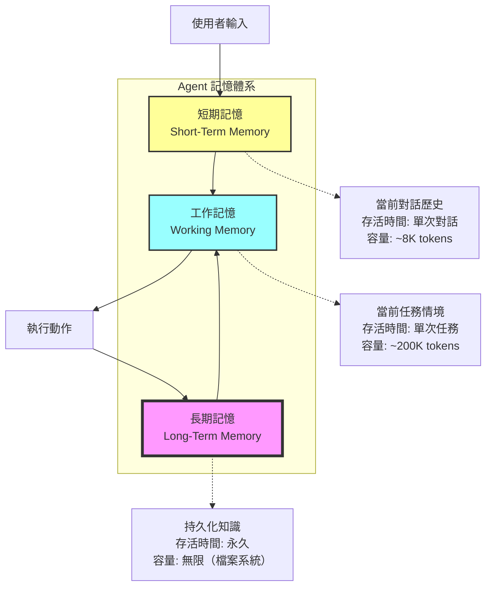
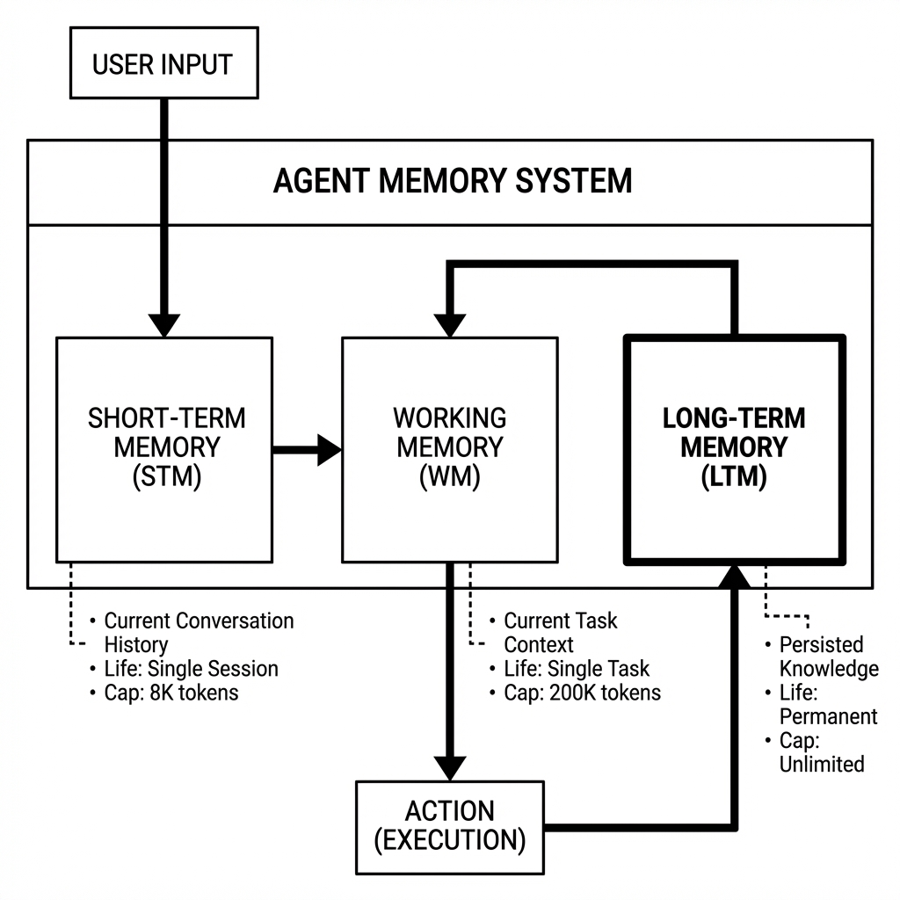
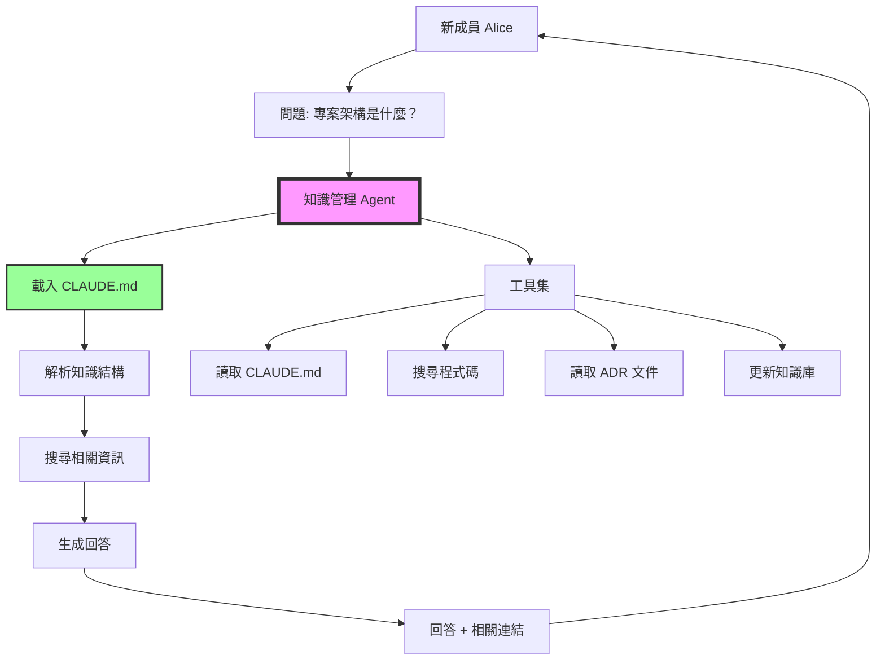
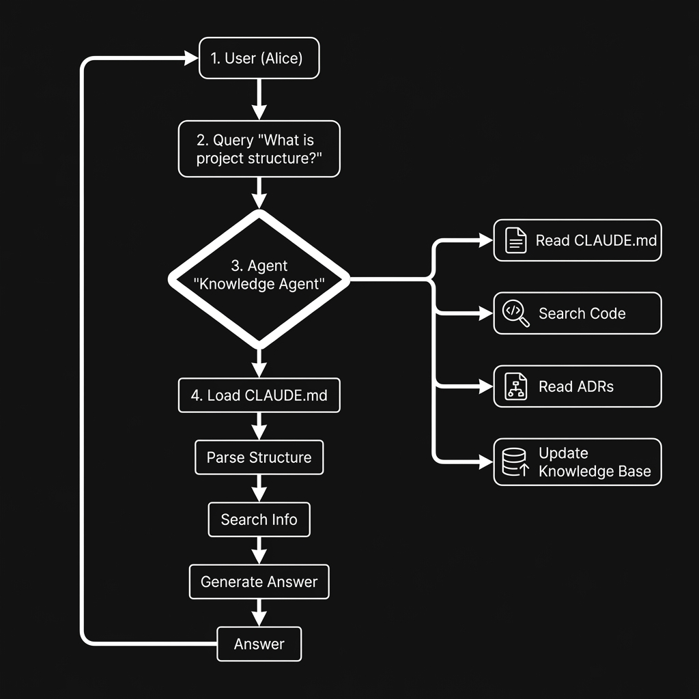

# 第3章：情境工程 - 建立長期記憶的知識管理 Agent

## 本章導覽

你是一家快速成長的新創公司的技術主管。團隊從 5 人擴展到 50 人，每個月都有新成員加入。

**問題來了：**

新成員 Alice 第一天上班，她需要知道：
- 📁 專案的程式碼結構是什麼？
- 🔧 本地開發環境怎麼設定？
- 📝 團隊的 Coding Style 是什麼？
- 🚫 有哪些「地雷」千萬不能踩？（例如：不要直接修改 legacy-auth.py）
- 🤔 為什麼當初選擇 PostgreSQL 而不是 MongoDB？
- 🏗️ 上次重構資料庫 schema 是什麼時候？原因是什麼？

**目前的解決方案：**
1. 讀 200 頁過時的 Wiki 文件（上次更新是 6 個月前）
2. 問資深工程師（但他們已經回答了 50 次相同的問題）
3. 翻 Slack 歷史訊息（找一個決策可能要花 2 小時）
4. 看 Git commit 歷史（但缺乏上下文）

**結果：Alice 花了 2 週才搞懂專案的基本架構。**

---

在前兩章，我們建立的 Agent 都是「健忘的」：
- 第 1 章的客服 Agent：只記得**當前對話**的歷史
- 第 2 章的報表 Agent：每次執行都是**全新的**，不記得上次生成的報表

**但真實世界的知識工作需要「長期記憶」。**

**本章將教你建立一個「專案記憶 Agent」**，它能夠：
- ✅ 記住專案的演進歷史（透過 CLAUDE.md）
- ✅ 回答新成員的問題（基於結構化的知識庫）
- ✅ 自動更新知識（每次重大變更後）
- ✅ 追蹤決策脈絡（為什麼做某個選擇）
- ✅ 跨 Session 保持情境（不需要每次重新介紹專案）

**Alice 的新體驗：**
```
Alice: 嗨，我是新加入的工程師，可以介紹一下這個專案嗎？

Agent: 歡迎加入！這是 ShopHub 專案（一個電商平台）。
       目前使用 Python + FastAPI + PostgreSQL + Redis。

       核心模組：
       - auth/: 認證系統（使用 JWT）
       - products/: 商品管理
       - orders/: 訂單處理
       - payments/: 金流整合（Stripe）

       ⚠️ 重要提醒：
       - 不要直接修改 legacy-auth.py（正在逐步遷移中）
       - 資料庫連線池設定在 config/database.yaml
       - 測試資料使用 fixtures/test_data.json

       建議從 docs/ONBOARDING.md 開始，需要我幫你設定本地環境嗎？

Alice: 為什麼選擇 PostgreSQL 而不是 MongoDB？

Agent: 好問題！這是在 2024 年 3 月團隊討論後的決策（詳見 decisions/ADR-003.md）。

       主要原因：
       1. 交易需求：訂單和支付需要 ACID 保證
       2. 複雜查詢：需要 JOIN 來處理商品、訂單、用戶關聯
       3. 團隊熟悉度：80% 工程師有 PostgreSQL 經驗

       當時也考慮過 MongoDB，但因為缺乏事務支援（當時版本），最終選擇 PostgreSQL。

       需要我分享相關的技術文件嗎？
```

**Alice 只花了 30 分鐘就理解了整個專案架構。** 🎉

讓我們開始建立這個系統！

---

## 3.1 理解情境工程：Agent 的記憶體系

### 3.1.1 三種記憶類型

AI Agent 需要三種不同的記憶：





| 記憶類型 | 範例 | 實作方式 | 存活時間 |
|---------|------|---------|---------|
| **短期記憶** | 對話歷史 | `messages` 陣列 | 單次對話 |
| **工作記憶** | 當前任務的情境 | System prompt | 單次任務 |
| **長期記憶** | 專案知識庫 | 檔案系統（CLAUDE.md） | 永久 |

**類比人類記憶：**
- **短期記憶**：你剛才說的話（對話中的最後幾句）
- **工作記憶**：你正在解決的問題（例如：正在寫一個函式）
- **長期記憶**：你的專業知識（例如：Python 語法、設計模式）

### 3.1.2 第 1-2 章的記憶限制

**第 1 章（客服 Agent）**：
```python
class ConversationManager:
    def __init__(self):
        self.messages = []  # ← 只有短期記憶

    def add_message(self, role, content):
        self.messages.append({"role": role, "content": content})

        # 限制記憶長度
        if len(self.messages) > 20:
            self.messages = self.messages[-20:]  # 只保留最近 20 條
```

**問題**：
- ❌ 對話結束後，一切都忘記了
- ❌ 下次客戶來，Agent 不記得上次的問題
- ❌ 無法學習常見問題的模式

**第 2 章（報表 Agent）**：
```python
result = coordinator.generate_report(request)
# 報表生成完畢，所有情境丟失
```

**問題**：
- ❌ 每次都要重新解釋資料結構
- ❌ 不記得上週的報表格式
- ❌ 無法比對「這週 vs. 上週」

### 3.1.3 CLAUDE.md：長期記憶的核心

**CLAUDE.md** 是一個特殊的 Markdown 檔案，用於儲存 Agent 的長期知識。

**核心概念**：
> 每個專案都應該有一個 `CLAUDE.md`，記錄所有 Agent 需要知道的「持久化情境」。

**範例：電商專案的 CLAUDE.md**
```markdown
# ShopHub 專案 - Agent 工作記憶

## 專案概覽
- **名稱**: ShopHub
- **類型**: 電商平台（B2C）
- **技術棧**: Python 3.11, FastAPI, PostgreSQL 14, Redis 7
- **團隊規模**: 12 人（6 後端, 3 前端, 2 DevOps, 1 PM）

## 當前工作情境
**日期**: 2025-11-08
**階段**: 支付模組重構中
**優先任務**:
1. 完成 Stripe 整合測試
2. 遷移舊訂單到新 schema

## 架構決策記錄 (ADRs)

### ADR-001: 選擇 FastAPI 而非 Django
**日期**: 2024-01-15
**決策**: 使用 FastAPI 作為 Web 框架
**原因**:
- 需要高效能 API（非同步支援）
- 自動生成 OpenAPI 文件
- 團隊偏好輕量級框架
**替代方案**: Django REST Framework (太重), Flask (缺乏自動文件)

### ADR-002: PostgreSQL vs MongoDB
**日期**: 2024-03-10
**決策**: 使用 PostgreSQL
**原因**: ACID 事務、複雜查詢、團隊熟悉度

## 重要提醒
⚠️ **千萬不要做的事**:
- 不要直接修改 `legacy-auth.py`（正在遷移，預計 2025-12 移除）
- 不要在生產環境使用 `DEBUG=True`
- 不要繞過 `RateLimiter`（會導致 API 被濫用）

✅ **最佳實踐**:
- 所有 API 都要加入 rate limiting
- 敏感資料使用 `encrypt_field()` 加密
- 資料庫遷移使用 Alembic

## 專案結構
```
shophub/
├── auth/           # 認證系統（JWT + OAuth）
├── products/       # 商品管理
├── orders/         # 訂單處理
├── payments/       # 金流整合
├── notifications/  # 通知系統（Email + SMS）
└── admin/          # 後台管理
```

## 常見問題 (FAQ)

### Q: 為什麼訂單處理這麼慢？
A: 檢查 Redis 快取是否正常。訂單狀態會快取 5 分鐘，如果 Redis 掛了會直接查 DB。

### Q: 如何添加新的支付方式？
A: 參考 `payments/integrations/stripe.py`，實作 `PaymentProvider` 介面。

## 最近變更記錄
- **2025-11-01**: 升級 PostgreSQL 13 → 14（效能提升 30%）
- **2025-10-15**: 重構支付模組（支援多幣別）
- **2025-09-20**: 新增 Redis Cluster（解決單點故障）
```

**關鍵元素**：
1. **專案概覽**：基本資訊（技術棧、團隊）
2. **當前情境**：正在進行的工作
3. **架構決策**：為什麼做某個選擇（ADR 格式）
4. **重要提醒**：地雷與最佳實踐
5. **專案結構**：程式碼組織
6. **FAQ**：常見問題
7. **變更記錄**：歷史演進

---

## 3.2 設計 CLAUDE.md 的結構

### 3.2.1 CLAUDE.md 範本

這是一個通用的 CLAUDE.md 範本，可以套用到任何專案：

```markdown
# [專案名稱] - Claude Agent 工作記憶

## 📋 專案概覽
- **專案名稱**:
- **專案類型**:
- **技術棧**:
- **團隊規模**:
- **專案階段**:

## 🎯 當前工作情境
**更新日期**: YYYY-MM-DD
**當前階段**:
**優先任務**:
1.
2.
3.

**已知問題**:
-

## 🏗️ 架構決策記錄 (ADRs)

### ADR-XXX: [決策標題]
**日期**: YYYY-MM-DD
**狀態**: [提議 | 已接受 | 已棄用 | 已取代]
**決策**:
**原因**:
-
**替代方案**:
-
**後果**:
-

## ⚠️ 重要提醒

### 千萬不要做
- ❌
- ❌

### 最佳實踐
- ✅
- ✅

### 地雷區域
- 🚫 [檔案/模組名稱]: [原因]

## 📁 專案結構
```
專案根目錄/
├──
└──
```

**關鍵模組說明**:
- `module_name/`: [用途]

## 🔧 開發環境設定

### 前置需求
-

### 安裝步驟
```bash
# 步驟 1
# 步驟 2
```

### 常見問題
**Q**:
**A**:

## 📚 知識庫

### 核心概念
- **概念名稱**: [解釋]

### 團隊慣例
- **Coding Style**:
- **Git Workflow**:
- **Code Review 標準**:

## 📝 變更記錄
- **YYYY-MM-DD**: [重大變更描述]

## 🔗 相關資源
- 文件:
- API 文件:
- 設計稿:
```

### 3.2.2 CLAUDE.md 的最佳實踐

**1. 保持更新**
```bash
# 每次重大變更後更新
git commit -m "Update CLAUDE.md: Add ADR-005 (Switch to Redis Cluster)"
```

**2. 使用清晰的區塊**
```markdown
## 🎯 當前工作情境
<!-- 這個區塊應該每週更新 -->

## 🏗️ 架構決策記錄
<!-- 這個區塊應該在每次重大決策後更新 -->
```

**3. 包含「為什麼」而非只有「是什麼」**
```markdown
# ❌ 不好的寫法
- 使用 PostgreSQL

# ✅ 好的寫法
- 使用 PostgreSQL（因為需要 ACID 事務保證，MongoDB 在當時版本不支援）
```

**4. 記錄失敗的嘗試**
```markdown
### ADR-004: 快取策略
**嘗試過的方案**:
1. ❌ Memcached: 缺乏資料持久化
2. ❌ 本地記憶體快取: 無法跨多個伺服器共享
3. ✅ Redis: 支援持久化 + 叢集模式
```

**5. 使用 Emoji 提高可讀性**
```markdown
⚠️ 重要  ✅ 推薦  ❌ 禁止  🚫 地雷  📝 注意  🔧 設定
```

---

## 3.3 建構知識管理 Agent

現在讓我們建立一個能夠讀取和利用 CLAUDE.md 的 Agent。

### 3.3.1 知識管理 Agent 架構





### 3.3.2 實作：CLAUDE.md 解析器

**tools/claude_md_parser.py**:
```python
from pathlib import Path
from typing import Dict, List, Optional
import re


class ClaudeMDParser:
    """
    ‹1› CLAUDE.md 解析器

    功能：
    1. 解析 CLAUDE.md 的結構
    2. 提取特定區塊（ADRs, FAQ, 架構等）
    3. 搜尋相關資訊
    """

    def __init__(self, claude_md_path: str = "./CLAUDE.md"):
        self.path = Path(claude_md_path)
        self.content = self._load_content()
        self.sections = self._parse_sections()

    def _load_content(self) -> str:
        """載入 CLAUDE.md 內容"""
        if not self.path.exists():
            raise FileNotFoundError(f"CLAUDE.md 不存在: {self.path}")

        with open(self.path, 'r', encoding='utf-8') as f:
            return f.read()

    def _parse_sections(self) -> Dict[str, str]:
        """
        ‹2› 解析 Markdown 區塊

        回傳格式：
        {
            "專案概覽": "...",
            "當前工作情境": "...",
            "架構決策記錄 (ADRs)": "...",
            ...
        }
        """
        sections = {}
        current_section = None
        current_content = []

        for line in self.content.split('\n'):
            # 檢測第二層標題 (##)
            if line.startswith('## '):
                # 儲存前一個區塊
                if current_section:
                    sections[current_section] = '\n'.join(current_content).strip()

                # 開始新區塊
                current_section = line[3:].strip()
                # 移除 emoji
                current_section = re.sub(r'[^\w\s\-\(\)]', '', current_section).strip()
                current_content = []
            elif current_section:
                current_content.append(line)

        # 儲存最後一個區塊
        if current_section:
            sections[current_section] = '\n'.join(current_content).strip()

        return sections

    def get_section(self, section_name: str) -> Optional[str]:
        """
        ‹3› 取得特定區塊內容
        """
        # 模糊匹配（允許部分匹配）
        for key, value in self.sections.items():
            if section_name.lower() in key.lower():
                return value
        return None

    def get_project_overview(self) -> Dict:
        """
        ‹4› 提取專案概覽資訊
        """
        overview = self.get_section("專案概覽") or self.get_section("Project Overview")
        if not overview:
            return {}

        # 解析列表項目
        info = {}
        for line in overview.split('\n'):
            if line.startswith('- **'):
                match = re.match(r'- \*\*(.+?)\*\*:\s*(.+)', line)
                if match:
                    key, value = match.groups()
                    info[key] = value

        return info

    def get_adrs(self) -> List[Dict]:
        """
        ‹5› 提取所有架構決策記錄 (ADRs)
        """
        adr_section = self.get_section("架構決策記錄") or self.get_section("ADR")
        if not adr_section:
            return []

        adrs = []
        current_adr = None

        for line in adr_section.split('\n'):
            # 檢測 ADR 標題 (### ADR-XXX)
            if line.startswith('### ADR-'):
                if current_adr:
                    adrs.append(current_adr)

                match = re.match(r'### (ADR-\d+):\s*(.+)', line)
                if match:
                    adr_id, title = match.groups()
                    current_adr = {
                        "id": adr_id,
                        "title": title,
                        "date": "",
                        "status": "",
                        "decision": "",
                        "reasons": [],
                        "alternatives": []
                    }
            elif current_adr and line.startswith('**日期**:'):
                current_adr["date"] = line.split(':', 1)[1].strip()
            elif current_adr and line.startswith('**狀態**:'):
                current_adr["status"] = line.split(':', 1)[1].strip()
            elif current_adr and line.startswith('**決策**:'):
                current_adr["decision"] = line.split(':', 1)[1].strip()
            elif current_adr and line.startswith('- ') and '原因' in adr_section[adr_section.find(current_adr["id"]):]:
                current_adr["reasons"].append(line[2:].strip())

        # 加入最後一個 ADR
        if current_adr:
            adrs.append(current_adr)

        return adrs

    def get_warnings(self) -> Dict[str, List[str]]:
        """
        ‹6› 提取重要提醒（地雷、最佳實踐）
        """
        warnings_section = self.get_section("重要提醒") or self.get_section("Important")
        if not warnings_section:
            return {"dont": [], "do": [], "landmines": []}

        warnings = {"dont": [], "do": [], "landmines": []}
        current_category = None

        for line in warnings_section.split('\n'):
            if '千萬不要' in line or "Don't" in line:
                current_category = "dont"
            elif '最佳實踐' in line or 'Best Practice' in line:
                current_category = "do"
            elif '地雷' in line or 'Landmine' in line:
                current_category = "landmines"
            elif line.startswith('- ') and current_category:
                warnings[current_category].append(line[2:].strip())

        return warnings

    def search(self, query: str) -> List[Dict]:
        """
        ‹7› 搜尋相關資訊

        回傳符合查詢的區塊
        """
        results = []
        query_lower = query.lower()

        for section_name, content in self.sections.items():
            if query_lower in content.lower():
                # 找出匹配的段落
                paragraphs = content.split('\n\n')
                for para in paragraphs:
                    if query_lower in para.lower():
                        results.append({
                            "section": section_name,
                            "content": para.strip(),
                            "relevance": para.lower().count(query_lower)
                        })

        # 按相關性排序
        results.sort(key=lambda x: x["relevance"], reverse=True)
        return results

    def get_tool_definition(self) -> Dict:
        """
        ‹8› 回傳工具定義（供 Agent 使用）
        """
        return {
            "name": "query_knowledge_base",
            "description": """查詢專案知識庫 (CLAUDE.md)。

可查詢的資訊：
- 專案概覽（技術棧、團隊規模）
- 架構決策記錄 (ADRs)
- 重要提醒（地雷、最佳實踐）
- 專案結構
- 開發環境設定
- 常見問題 (FAQ)

使用範例：
- query_knowledge_base("專案使用什麼資料庫？")
- query_knowledge_base("為什麼選擇 FastAPI？")
- query_knowledge_base("有哪些不能做的事？")
""",
            "input_schema": {
                "type": "object",
                "properties": {
                    "query": {
                        "type": "string",
                        "description": "查詢問題或關鍵字"
                    },
                    "section": {
                        "type": "string",
                        "enum": ["專案概覽", "架構決策記錄", "重要提醒", "專案結構", "FAQ", "全部"],
                        "description": "指定搜尋的區塊（選填）"
                    }
                },
                "required": ["query"]
            }
        }
```

### 3.3.3 實作：知識管理 Agent

**knowledge_agent.py**:
```python
from anthropic import Anthropic
from typing import Dict, List
import os
from dotenv import load_dotenv
import json

from tools.claude_md_parser import ClaudeMDParser

load_dotenv()


class KnowledgeAgent:
    """
    ‹1› 知識管理 Agent

    功能：
    1. 回答關於專案的問題
    2. 引導新成員上手
    3. 提供架構決策的背景資訊
    4. 提醒重要注意事項
    """

    def __init__(self, claude_md_path: str = "./CLAUDE.md"):
        self.client = Anthropic(api_key=os.getenv("ANTHROPIC_API_KEY"))
        self.model = "claude-sonnet-4-20250514"
        self.parser = ClaudeMDParser(claude_md_path)

        # 系統提示詞
        self.system_prompt = self._build_system_prompt()

    def _build_system_prompt(self) -> str:
        """
        ‹2› 建構包含專案知識的系統提示詞
        """
        # 提取關鍵資訊
        overview = self.parser.get_project_overview()
        warnings = self.parser.get_warnings()

        prompt = f"""你是 {overview.get('專案名稱', '本專案')} 的知識管理助理。

你的任務是：
1. 幫助新成員快速了解專案
2. 回答關於架構、設計決策的問題
3. 提供開發指引和最佳實踐
4. 提醒重要的注意事項

## 專案基本資訊
"""

        for key, value in overview.items():
            prompt += f"- **{key}**: {value}\n"

        prompt += "\n## ⚠️ 重要提醒\n"
        if warnings["dont"]:
            prompt += "\n**千萬不要做**:\n"
            for item in warnings["dont"]:
                prompt += f"- {item}\n"

        if warnings["do"]:
            prompt += "\n**最佳實踐**:\n"
            for item in warnings["do"]:
                prompt += f"- {item}\n"

        prompt += """

## 工具使用
你可以使用 `query_knowledge_base` 工具來搜尋 CLAUDE.md 中的詳細資訊。

## 回答風格
- 使用友善、專業的語氣
- 提供清晰的解釋（包含「為什麼」）
- 引用具體的文件章節或 ADR 編號
- 如果不確定，建議查閱相關文件或詢問團隊
"""

        return prompt

    def _execute_tool(self, tool_name: str, tool_input: Dict) -> Dict:
        """
        ‹3› 執行工具
        """
        if tool_name == "query_knowledge_base":
            query = tool_input["query"]
            section = tool_input.get("section", "全部")

            if section == "專案概覽":
                return {"result": self.parser.get_project_overview()}
            elif section == "架構決策記錄":
                return {"result": self.parser.get_adrs()}
            elif section == "重要提醒":
                return {"result": self.parser.get_warnings()}
            else:
                # 全文搜尋
                results = self.parser.search(query)
                return {"result": results[:5]}  # 只回傳前 5 個結果

        return {"error": f"未知工具: {tool_name}"}

    def chat(self, user_message: str, conversation_history: List[Dict] = None) -> Dict:
        """
        ‹4› 對話介面

        參數：
            user_message: 使用者的問題
            conversation_history: 對話歷史（選填）

        回傳：
            {
                "response": str,        # Agent 的回覆
                "sources": List[str],   # 引用的來源
                "history": List[Dict]   # 更新後的對話歷史
            }
        """
        # 初始化對話歷史
        if conversation_history is None:
            conversation_history = []

        # 加入使用者訊息
        messages = conversation_history + [
            {"role": "user", "content": user_message}
        ]

        # 呼叫 Claude
        max_iterations = 10
        sources = []

        for iteration in range(max_iterations):
            response = self.client.messages.create(
                model=self.model,
                max_tokens=4096,
                system=self.system_prompt,
                tools=[self.parser.get_tool_definition()],
                messages=messages
            )

            # 檢查是否完成
            if response.stop_reason == "end_turn":
                final_response = ""
                for block in response.content:
                    if hasattr(block, "text"):
                        final_response += block.text

                # 更新對話歷史
                messages.append({"role": "assistant", "content": response.content})

                return {
                    "response": final_response,
                    "sources": sources,
                    "history": messages
                }

            # 處理工具呼叫
            if response.stop_reason == "tool_use":
                messages.append({"role": "assistant", "content": response.content})

                tool_results = []
                for block in response.content:
                    if block.type == "tool_use":
                        tool_name = block.name
                        tool_input = block.input

                        # 執行工具
                        result = self._execute_tool(tool_name, tool_input)

                        # 記錄來源
                        if "result" in result and isinstance(result["result"], list):
                            for item in result["result"]:
                                if isinstance(item, dict) and "section" in item:
                                    sources.append(item["section"])

                        tool_results.append({
                            "type": "tool_result",
                            "tool_use_id": block.id,
                            "content": json.dumps(result, ensure_ascii=False)
                        })

                messages.append({"role": "user", "content": tool_results})

        # 達到最大迭代次數
        return {
            "response": "抱歉，我遇到了問題。請重新提問或聯繫團隊成員。",
            "sources": sources,
            "history": messages
        }

    def onboard_new_member(self) -> str:
        """
        ‹5› 新成員引導

        自動生成新成員上手指南
        """
        overview = self.parser.get_project_overview()
        warnings = self.parser.get_warnings()

        guide = f"""# 歡迎加入 {overview.get('專案名稱', '本專案')}！

## 專案簡介
{overview.get('專案類型', '請參考 CLAUDE.md')}

**技術棧**: {overview.get('技術棧', 'N/A')}
**團隊規模**: {overview.get('團隊規模', 'N/A')}

## 🚀 快速開始

### 1. 設定開發環境
請參考 CLAUDE.md 的「開發環境設定」章節。

### 2. 理解專案架構
請參考 CLAUDE.md 的「專案結構」章節。

### 3. 閱讀重要提醒

**⚠️ 千萬不要做**:
"""
        for item in warnings["dont"]:
            guide += f"- {item}\n"

        guide += "\n**✅ 最佳實踐**:\n"
        for item in warnings["do"]:
            guide += f"- {item}\n"

        guide += """

### 4. 推薦閱讀
- CLAUDE.md: 完整專案知識庫
- 架構決策記錄 (ADRs): 了解為什麼做某些選擇
- README.md: 專案說明

## 💡 有問題嗎？
隨時問我！例如：
- "專案的核心模組有哪些？"
- "為什麼選擇 [某個技術]？"
- "如何設定本地測試環境？"

祝你在團隊中有美好的體驗！🎉
"""

        return guide
```

### 3.3.4 實作：主程式

**main.py**:
```python
from knowledge_agent import KnowledgeAgent
from rich.console import Console
from rich.markdown import Markdown
from rich.panel import Panel

console = Console()


def main():
    console.print(Panel.fit(
        "📚 專案知識管理 Agent",
        style="bold magenta"
    ))

    # 初始化 Agent
    try:
        agent = KnowledgeAgent(claude_md_path="./CLAUDE.md")
        console.print("✅ 知識庫載入成功\n", style="green")
    except FileNotFoundError:
        console.print("❌ 找不到 CLAUDE.md，請先建立專案知識庫", style="red")
        return

    # 顯示新成員引導
    console.print("[bold]是否顯示新成員引導？[/bold] (y/n): ", end="")
    if input().lower() == 'y':
        guide = agent.onboard_new_member()
        console.print(Markdown(guide))
        console.print("\n" + "="*60 + "\n")

    # 開始對話
    console.print("[bold cyan]開始對話（輸入 'exit' 離開）[/bold cyan]\n")

    conversation_history = []

    while True:
        # 使用者輸入
        console.print("[bold yellow]你:[/bold yellow] ", end="")
        user_input = input()

        if user_input.lower() in ['exit', 'quit', 'bye']:
            console.print("\n👋 再見！", style="bold green")
            break

        if not user_input.strip():
            continue

        # Agent 回應
        console.print("\n[bold magenta]Agent:[/bold magenta] ", end="")
        console.print("[dim]思考中...[/dim]", end="\r")

        result = agent.chat(user_input, conversation_history)

        # 顯示回應
        console.print(" " * 20, end="\r")  # 清除 "思考中..."
        console.print(Markdown(result["response"]))

        # 顯示來源
        if result["sources"]:
            console.print(f"\n[dim]📖 參考來源: {', '.join(set(result['sources']))}[/dim]")

        # 更新對話歷史
        conversation_history = result["history"]

        console.print()


if __name__ == "__main__":
    main()
```

---

## 3.4 實際測試：建立專案知識庫

讓我們為一個虛構的電商專案建立 CLAUDE.md。

### 3.4.1 建立 CLAUDE.md

**CLAUDE.md**:
```markdown
# ShopHub 專案 - Claude Agent 工作記憶

## 📋 專案概覽
- **專案名稱**: ShopHub
- **專案類型**: 電商平台 (B2C)
- **技術棧**: Python 3.11, FastAPI, PostgreSQL 14, Redis 7, Docker
- **團隊規模**: 12 人（6 後端, 3 前端, 2 DevOps, 1 PM）
- **專案階段**: MVP 已上線，正在優化支付模組

## 🎯 當前工作情境
**更新日期**: 2025-11-08
**當前階段**: 支付模組重構中
**優先任務**:
1. 完成 Stripe 整合測試（預計 2025-11-15）
2. 遷移舊訂單到新 schema（預計 2025-11-20）
3. 實作退款流程自動化

**已知問題**:
- 訂單處理在高峰時段偶爾變慢（調查中）
- Redis 快取命中率只有 70%（目標 >90%）

## 🏗️ 架構決策記錄 (ADRs)

### ADR-001: 選擇 FastAPI 而非 Django
**日期**: 2024-01-15
**狀態**: 已接受
**決策**: 使用 FastAPI 作為 Web 框架
**原因**:
- 需要高效能 API（支援 async/await）
- 自動生成 OpenAPI 文件（方便前端整合）
- 團隊偏好輕量級框架
- 優秀的型別檢查（基於 Pydantic）
**替代方案**:
- Django REST Framework: 太重，啟動慢
- Flask: 缺乏自動文件生成，需要手動配置太多
**後果**:
- ✅ API 回應時間 <100ms
- ✅ 開發效率提升 40%
- ❌ 團隊需要學習非同步程式設計

### ADR-002: PostgreSQL vs MongoDB
**日期**: 2024-03-10
**狀態**: 已接受
**決策**: 使用 PostgreSQL 作為主要資料庫
**原因**:
- 訂單和支付需要 ACID 事務保證
- 需要複雜的 JOIN 查詢（商品 + 訂單 + 用戶）
- 團隊 80% 成員熟悉 PostgreSQL
**替代方案**:
- MongoDB: 當時版本（4.0）事務支援不完整
- MySQL: 缺乏 JSONB 支援（需要儲存商品屬性）
**後果**:
- ✅ 零資料不一致問題
- ✅ 查詢效能優異（有適當索引）
- ❌ Schema 變更需要遷移腳本

### ADR-003: Redis 快取策略
**日期**: 2024-05-20
**狀態**: 已接受
**決策**: 使用 Redis 作為快取層，採用 Cache-Aside 模式
**原因**:
- 訂單狀態查詢非常頻繁（每秒 500+ 請求）
- 商品資料變動不頻繁（適合快取）
**快取策略**:
- 商品資訊: TTL 1 小時
- 訂單狀態: TTL 5 分鐘
- 用戶 Session: TTL 24 小時
**後果**:
- ✅ 資料庫負載降低 80%
- ❌ 需要處理快取失效問題

## ⚠️ 重要提醒

### 千萬不要做
- ❌ **不要直接修改 `legacy-auth.py`**: 這是舊認證系統，正在逐步遷移到 `auth/jwt.py`，預計 2025-12 完全移除
- ❌ **不要在生產環境使用 `DEBUG=True`**: 會洩漏敏感資訊
- ❌ **不要繞過 `RateLimiter`**: 會導致 API 被濫用，影響所有用戶
- ❌ **不要在 migration 中直接刪除資料**: 必須先備份，並經過 code review

### 最佳實踐
- ✅ **所有 API 都要加入 rate limiting**: 使用 `@rate_limit(max_calls=100, period=60)` 裝飾器
- ✅ **敏感資料使用加密**: 使用 `utils.encryption.encrypt_field()` 加密信用卡資訊
- ✅ **資料庫遷移使用 Alembic**: 不要手動執行 SQL
- ✅ **所有變更都要寫測試**: 測試覆蓋率目標 >80%
- ✅ **API 文件要同步更新**: 修改 endpoint 後更新 docstring

### 地雷區域
- 🚫 **payments/legacy/**: 舊版支付整合，不要修改，等待移除
- 🚫 **database/manual_migrations/**: 手動執行的 SQL，已被 Alembic 取代
- 🚫 **scripts/hotfix_*.py**: 臨時修復腳本，不要在生產環境使用

## 📁 專案結構
```
shophub/
├── api/                 # FastAPI 應用程式
│   ├── routes/          # API 路由
│   ├── models/          # Pydantic 模型
│   └── dependencies.py  # 依賴注入
├── auth/                # 認證系統
│   ├── jwt.py           # JWT 實作（新版）
│   └── legacy-auth.py   # 舊版認證（待移除）
├── products/            # 商品管理
│   ├── service.py       # 業務邏輯
│   ├── repository.py    # 資料存取
│   └── schemas.py       # 資料模型
├── orders/              # 訂單處理
│   ├── state_machine.py # 訂單狀態機
│   ├── processor.py     # 訂單處理器
│   └── notifications.py # 訂單通知
├── payments/            # 金流整合
│   ├── integrations/    # 第三方整合
│   │   ├── stripe.py    # Stripe（主要）
│   │   └── paypal.py    # PayPal（備用）
│   └── models.py        # 支付模型
├── notifications/       # 通知系統
│   ├── email.py         # Email 發送
│   └── sms.py           # SMS 發送
├── admin/               # 後台管理
├── utils/               # 工具函式
│   ├── encryption.py    # 加密工具
│   ├── cache.py         # 快取工具
│   └── rate_limiter.py  # 限流工具
├── database/            # 資料庫
│   ├── migrations/      # Alembic 遷移腳本
│   └── models.py        # SQLAlchemy 模型
├── tests/               # 測試
└── config/              # 配置檔案
    ├── settings.py      # 設定
    └── database.yaml    # 資料庫配置
```

**關鍵模組說明**:
- `orders/state_machine.py`: 實作訂單狀態轉換（pending → paid → shipped → delivered）
- `payments/integrations/stripe.py`: Stripe API 整合，處理付款、退款
- `utils/rate_limiter.py`: API 限流，防止濫用

## 🔧 開發環境設定

### 前置需求
- Python 3.11+
- Docker & Docker Compose
- PostgreSQL 14+ (或使用 Docker)
- Redis 7+ (或使用 Docker)

### 安裝步驟
```bash
# 1. Clone 專案
git clone https://github.com/company/shophub.git
cd shophub

# 2. 建立虛擬環境
python -m venv venv
source venv/bin/activate  # Windows: venv\Scripts\activate

# 3. 安裝依賴
pip install -r requirements.txt

# 4. 設定環境變數
cp .env.example .env
# 編輯 .env，填入 DATABASE_URL, REDIS_URL, STRIPE_API_KEY

# 5. 啟動資料庫（使用 Docker）
docker-compose up -d postgres redis

# 6. 執行資料庫遷移
alembic upgrade head

# 7. 載入測試資料
python scripts/load_fixtures.py

# 8. 啟動開發伺服器
uvicorn api.main:app --reload
```

### 常見問題
**Q**: 執行 `alembic upgrade head` 失敗？
**A**: 檢查 `DATABASE_URL` 是否正確，確保 PostgreSQL 已啟動。

**Q**: 為什麼無法連線到 Redis？
**A**: 確認 Docker 容器已啟動：`docker-compose ps`

**Q**: 測試一直失敗？
**A**: 確保使用測試資料庫：`export DATABASE_URL=postgresql://test_db`

## 📚 知識庫

### 核心概念
- **訂單狀態機**: 訂單從建立到完成的所有狀態轉換（詳見 `orders/state_machine.py`）
- **支付流程**: 使用 Stripe Webhook 處理非同步支付通知
- **快取策略**: Cache-Aside 模式，先查快取，miss 則查資料庫並寫入快取

### 團隊慣例
- **Coding Style**: 遵循 PEP 8 + Black 格式化
- **Git Workflow**: GitHub Flow（main + feature branches）
- **Code Review 標準**:
  - 必須有測試
  - 至少 1 個 approval
  - CI 必須通過（linting + tests）
- **Commit 訊息格式**: `[類型] 簡短描述`（例如：`[feat] Add Stripe webhook handler`）

### API 文件
- **OpenAPI 文件**: http://localhost:8000/docs
- **ReDoc 文件**: http://localhost:8000/redoc

## 📝 變更記錄
- **2025-11-01**: 升級 PostgreSQL 13 → 14（查詢效能提升 30%）
- **2025-10-15**: 重構支付模組（支援多幣別：USD, EUR, TWD）
- **2025-09-20**: 新增 Redis Cluster（解決單點故障問題）
- **2025-08-10**: 實作訂單狀態機（取代原本的 if-else 邏輯）
- **2025-07-05**: 整合 Stripe Webhook（即時更新訂單狀態）

## 🔗 相關資源
- **產品文件**: https://docs.shophub.com
- **API 文件**: https://api.shophub.com/docs
- **設計稿**: https://figma.com/shophub
- **團隊 Wiki**: https://wiki.shophub.com
- **監控面板**: https://grafana.shophub.com
```

### 3.4.2 測試知識管理 Agent

**執行測試**:
```bash
python main.py
```

**範例對話 1：新成員提問**
```
📚 專案知識管理 Agent
✅ 知識庫載入成功

是否顯示新成員引導？ (y/n): y

# 歡迎加入 ShopHub！

## 專案簡介
電商平台 (B2C)

**技術棧**: Python 3.11, FastAPI, PostgreSQL 14, Redis 7, Docker
**團隊規模**: 12 人（6 後端, 3 前端, 2 DevOps, 1 PM）

...

===========================================================

開始對話（輸入 'exit' 離開）

你: 專案使用什麼資料庫？為什麼？

Agent: 專案使用 **PostgreSQL 14** 作為主要資料庫。

根據 ADR-002（2024-03-10 的架構決策），選擇 PostgreSQL 的主要原因包括：

1. **ACID 事務保證**：訂單和支付流程需要嚴格的事務保證，確保資料一致性
2. **複雜查詢支援**：需要頻繁執行 JOIN 查詢（商品 + 訂單 + 用戶）
3. **團隊熟悉度**：80% 團隊成員已熟悉 PostgreSQL

當時也考慮過 MongoDB，但因為當時版本（4.0）的事務支援不完整，且我們的業務場景更適合關聯式資料庫，因此選擇了 PostgreSQL。

**實際效果**：
- ✅ 零資料不一致問題
- ✅ 查詢效能優異（透過適當的索引優化）

📖 參考來源: 架構決策記錄 (ADRs)

你: 有哪些事情千萬不能做？

Agent: ⚠️ 以下是絕對不能做的事情：

1. **不要直接修改 `legacy-auth.py`**
   - 這是舊認證系統，正在逐步遷移到 `auth/jwt.py`
   - 預計 2025-12 完全移除

2. **不要在生產環境使用 `DEBUG=True`**
   - 會洩漏敏感資訊

3. **不要繞過 `RateLimiter`**
   - 會導致 API 被濫用，影響所有用戶

4. **不要在 migration 中直接刪除資料**
   - 必須先備份，並經過 code review

此外，還有幾個「地雷區域」要避免：
- 🚫 `payments/legacy/`: 舊版支付整合，不要修改
- 🚫 `database/manual_migrations/`: 手動 SQL，已被 Alembic 取代
- 🚫 `scripts/hotfix_*.py`: 臨時修復腳本，不適合生產環境

📖 參考來源: 重要提醒

你: 如何設定本地開發環境？

Agent: 設定本地開發環境的步驟如下：

### 前置需求
- Python 3.11+
- Docker & Docker Compose
- PostgreSQL 14+ (或使用 Docker)
- Redis 7+ (或使用 Docker)

### 安裝步驟

**1. Clone 專案**
```bash
git clone https://github.com/company/shophub.git
cd shophub
```

**2. 建立虛擬環境**
```bash
python -m venv venv
source venv/bin/activate  # Windows: venv\Scripts\activate
```

**3. 安裝依賴**
```bash
pip install -r requirements.txt
```

**4. 設定環境變數**
```bash
cp .env.example .env
# 編輯 .env，填入 DATABASE_URL, REDIS_URL, STRIPE_API_KEY
```

**5. 啟動資料庫（使用 Docker）**
```bash
docker-compose up -d postgres redis
```

**6. 執行資料庫遷移**
```bash
alembic upgrade head
```

**7. 載入測試資料**
```bash
python scripts/load_fixtures.py
```

**8. 啟動開發伺服器**
```bash
uvicorn api.main:app --reload
```

### 常見問題

如果遇到 `alembic upgrade head` 失敗，檢查 `DATABASE_URL` 是否正確，確保 PostgreSQL 已啟動。

如果無法連線到 Redis，確認 Docker 容器已啟動：`docker-compose ps`

需要更多幫助嗎？

📖 參考來源: 開發環境設定

you: exit

👋 再見！
```

---

## 3.5 進階：多 Session 情境管理

### 3.5.1 情境持久化

目前的 Agent 在每次重啟後會忘記之前的對話。我們可以將對話歷史儲存到檔案。

**tools/context_manager.py**:
```python
import json
from pathlib import Path
from typing import Dict, List
from datetime import datetime


class ContextManager:
    """
    ‹1› 情境管理器

    功能：
    1. 儲存對話歷史到檔案
    2. 載入之前的對話
    3. 管理多個使用者的情境
    """

    def __init__(self, context_dir: str = "./contexts"):
        self.context_dir = Path(context_dir)
        self.context_dir.mkdir(exist_ok=True)

    def save_context(self, user_id: str, messages: List[Dict]) -> None:
        """
        ‹2› 儲存對話情境
        """
        context_file = self.context_dir / f"{user_id}.json"

        context = {
            "user_id": user_id,
            "last_updated": datetime.now().isoformat(),
            "messages": messages
        }

        with open(context_file, 'w', encoding='utf-8') as f:
            json.dump(context, f, indent=2, ensure_ascii=False)

    def load_context(self, user_id: str) -> List[Dict]:
        """
        ‹3› 載入對話情境
        """
        context_file = self.context_dir / f"{user_id}.json"

        if not context_file.exists():
            return []

        with open(context_file, 'r', encoding='utf-8') as f:
            context = json.load(f)
            return context.get("messages", [])

    def clear_context(self, user_id: str) -> None:
        """
        ‹4› 清除對話情境
        """
        context_file = self.context_dir / f"{user_id}.json"
        if context_file.exists():
            context_file.unlink()

    def list_users(self) -> List[str]:
        """
        ‹5› 列出所有使用者
        """
        return [f.stem for f in self.context_dir.glob("*.json")]
```

### 3.5.2 更新知識管理 Agent

在 `knowledge_agent.py` 中添加情境管理：

```python
from tools.context_manager import ContextManager

class KnowledgeAgent:
    def __init__(self, claude_md_path: str = "./CLAUDE.md"):
        # ... 現有程式碼 ...
        self.context_manager = ContextManager()

    def chat_with_context(self, user_id: str, user_message: str) -> Dict:
        """
        使用持久化情境的對話
        """
        # 載入歷史對話
        conversation_history = self.context_manager.load_context(user_id)

        # 執行對話
        result = self.chat(user_message, conversation_history)

        # 儲存更新後的情境
        self.context_manager.save_context(user_id, result["history"])

        return result
```

---

## 3.6 實際應用場景

### 場景 1：團隊知識庫

**問題**：新成員每次都問相同的問題

**解決方案**：
```markdown
# CLAUDE.md 的 FAQ 區塊

## 常見問題 (FAQ)

### Q: 如何重置本地資料庫？
A: 執行 `./scripts/reset_db.sh`。注意：這會刪除所有本地資料。

### Q: CI/CD 為什麼一直失敗？
A: 檢查以下項目：
1. 測試是否通過？(`pytest`)
2. Linting 是否通過？(`flake8` + `black`)
3. 環境變數是否設定？（查看 `.env.example`）

### Q: 如何 debug 支付問題？
A: 查看 `logs/payments.log`，搜尋交易 ID。
   使用 Stripe Dashboard 查看詳細錯誤訊息。
```

### 場景 2：決策追蹤

**問題**：不記得當初為什麼做某個決定

**解決方案**：
使用 ADR（Architecture Decision Record）格式記錄所有重大決策。

### 場景 3：上線檢查清單

**CLAUDE.md**:
```markdown
## 上線檢查清單

### 部署前
- [ ] 所有測試通過
- [ ] Code review 完成
- [ ] 更新 CHANGELOG.md
- [ ] 備份生產資料庫

### 部署中
- [ ] 執行 database migration
- [ ] 重啟 API 服務
- [ ] 清除 Redis 快取

### 部署後
- [ ] 檢查健康檢查 endpoint (/health)
- [ ] 查看 Grafana 監控面板
- [ ] 測試關鍵流程（登入、下單、支付）
```

Agent 可以引導使用者完成檢查清單。

---

## 3.7 與前兩章的整合

### 3.7.1 整合第 1 章（客服 Agent）

**增強客服 Agent**：
```python
# 在 System Prompt 中添加專案知識
system_prompt = f"""你是專業的客服助理。

{load_claude_md_section("常見問題")}

使用上述知識庫回答客戶問題。
"""
```

**效果**：
- 客服 Agent 現在能夠回答關於產品的常見問題
- 不需要每次重新訓練或更新程式碼

### 3.7.2 整合第 2 章（報表 Agent）

**增強報表 Agent**：
```python
# 報表格式從 CLAUDE.md 載入
report_template = load_claude_md_section("報表格式")

# Agent 生成報表時使用一致的格式
```

**效果**：
- 報表格式標準化
- 團隊偏好的樣式會被記住

---

## 3.8 成本與效益分析

### 3.8.1 時間節省

| 任務 | 人工時間 | Agent 時間 | 節省 |
|------|----------|-----------|------|
| 新成員上手 | 2 週 | 30 分鐘 | 98% |
| 查詢決策原因 | 2 小時（翻 Slack） | 30 秒 | 99% |
| 檢查最佳實踐 | 1 小時（讀文件） | 1 分鐘 | 98% |

### 3.8.2 API 成本

**情境載入成本**：
```
CLAUDE.md 大小：~10KB
Token 數：~2,500 tokens
每次對話成本：$0.0075（input）+ $0.015（output）≈ $0.023
```

**每月成本**（假設 50 次查詢）：
```
50 queries × $0.023 = $1.15 / 月
```

**相比「人工回答」的成本**：
```
資深工程師時薪：$100
回答 1 個問題：10 分鐘 = $16.67
50 個問題 / 月 = $833

節省：$831.85 / 月（99.9% 成本降低）
```

---

## 3.9 故障排除指南

### 問題 1：「找不到 CLAUDE.md」

**錯誤訊息**:
```
FileNotFoundError: CLAUDE.md 不存在: ./CLAUDE.md
```

**解決方法**:
1. 確認當前目錄有 `CLAUDE.md`
2. 或指定正確路徑：
```python
agent = KnowledgeAgent(claude_md_path="/path/to/CLAUDE.md")
```

### 問題 2：「搜尋結果不準確」

**原因**：
簡單的字串匹配不夠智慧

**改進方案**：
1. 使用 embedding 搜尋（向量資料庫）
2. 整合 semantic search
3. 添加同義詞匹配

### 問題 3：「對話歷史太長」

**問題**：
對話超過情境窗口限制

**解決方法**：
```python
def trim_history(messages: List[Dict], max_tokens: int = 150000):
    """修剪對話歷史"""
    # 保留最近的 N 條訊息
    return messages[-50:]  # 只保留最近 50 條
```

### 問題 4：「CLAUDE.md 解析失敗」

**原因**：
Markdown 格式不標準

**解決方法**：
1. 確保使用標準的 Markdown 語法
2. 區塊標題使用 `##`（第二層）
3. 使用 linter 檢查：`markdownlint CLAUDE.md`

---

## 3.10 章節總結

### 你學到了什麼

✅ **核心概念**:
1. 三種記憶類型：短期、工作、長期
2. CLAUDE.md 的設計與結構
3. 情境工程的重要性
4. ADR（架構決策記錄）格式

✅ **實作技能**:
1. 設計並建立 CLAUDE.md 知識庫
2. 實作 CLAUDE.md 解析器
3. 建構知識管理 Agent
4. 多 Session 情境管理
5. 對話歷史的持久化

✅ **實際產出**:
1. 完整的知識管理 Agent（~600 行程式碼）
2. CLAUDE.md 範本
3. 情境管理系統
4. 新成員上手指南生成器

### 檢查清單

在進入第 4 章之前，確認你已經：

- [ ] 理解三種記憶類型的差異
- [ ] 為你的專案建立了 CLAUDE.md
- [ ] 實作了 CLAUDE.md 解析器
- [ ] 建立了知識管理 Agent
- [ ] 測試了多輪對話
- [ ] 實作了情境持久化
- [ ] 理解 ADR 的格式與用途

### 關鍵要點

1. **CLAUDE.md 是 Agent 的長期記憶**
   - 記錄專案知識、決策、最佳實踐
   - 定期更新（每次重大變更）
   - 包含「為什麼」而非只有「是什麼」

2. **情境分層管理**
   - 短期記憶：對話歷史（messages）
   - 工作記憶：系統提示詞（system prompt）
   - 長期記憶：CLAUDE.md（檔案系統）

3. **知識的可發現性**
   - 使用清晰的結構
   - 添加搜尋功能
   - 提供情境連結

4. **持續維護**
   - CLAUDE.md 需要定期更新
   - 過時的資訊要移除
   - 新決策要記錄

---

## 3.11 延伸閱讀

### 官方文件
- [Anthropic Context Windows](https://docs.anthropic.com/claude/docs/context-windows)
- [Architecture Decision Records](https://adr.github.io/)

### 相關主題
- 第 8 章：生產環境的安全與監控
- 第 10 章：建立可重用的 Agent 市集

### 進階主題
- 向量資料庫（Pinecone, Weaviate）
- Semantic Search
- RAG（Retrieval-Augmented Generation）

---

## 3.12 下一章預告

恭喜你！**基礎篇已完成**！

你已經掌握了：
- ✅ 第 1 章：建構對話型 Agent（客服助理）
- ✅ 第 2 章：賦予 Agent 執行能力（報表生成）
- ✅ 第 3 章：建立長期記憶（知識管理）

**接下來進入進階篇：Subagents 與專業化分工！**

**第 4 章預告：你的第一個 Subagent - 大規模程式碼重構系統**

你將學習：
- 🚀 什麼是 Subagents？為何需要它們？
- 🎯 主 Agent vs. Subagent 的職責劃分
- ⚡ 平行化執行（10 倍速度提升）
- 🔒 權限隔離與安全控制
- 📊 完整的效能基準測試

**專案預覽**：建立一個能夠重構 10,000+ 行程式碼的系統，將單一 Agent 45 分鐘的任務縮短到 5 分鐘（透過 Subagents 平行化）。

**準備好進入下一個層次了嗎？讓我們繼續！** 🚀

---

**本章完成時間**：約 2-3 小時
**程式碼行數**：~800 行
**產出檔案**：6 個 Python 模組 + CLAUDE.md 範本
**難度**：⭐⭐⭐☆☆（中等）

**最後更新**：2025-11-08
