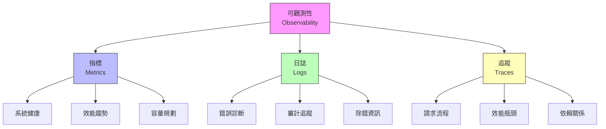
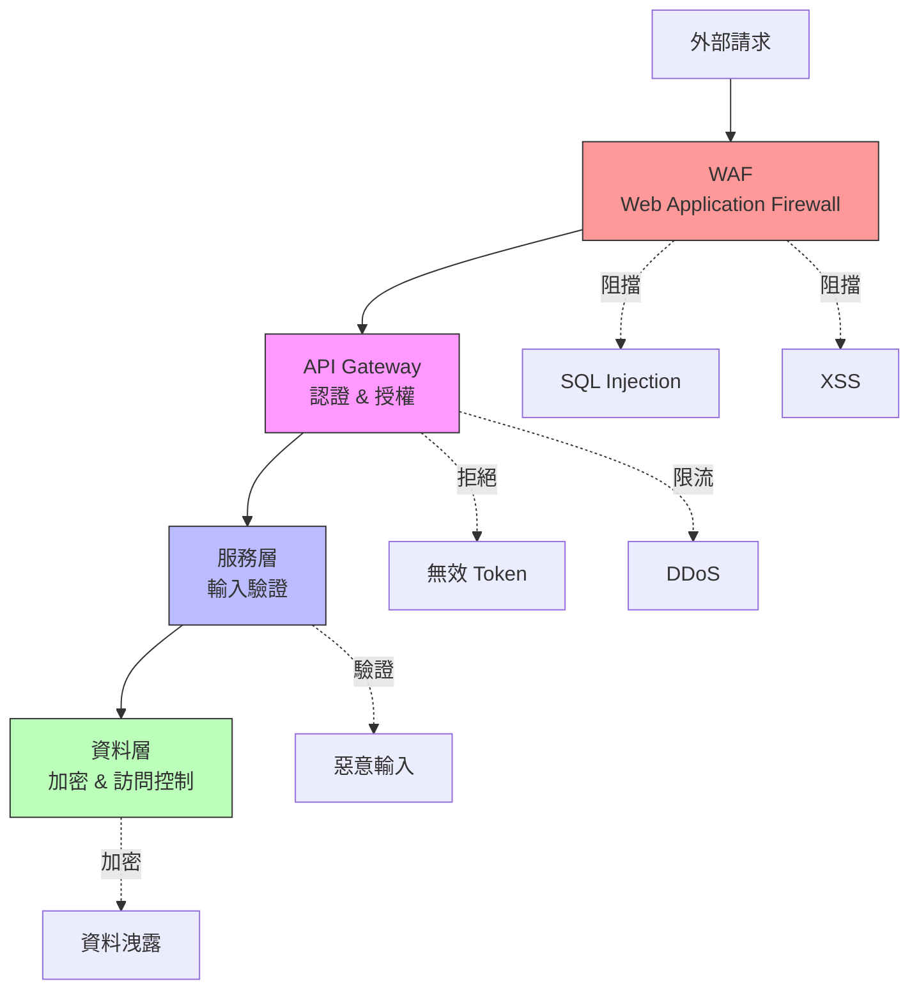

# 第 8 章：生產環境的安全與監控 - 建立可觀測性體系

> **本章目標**：建立企業級的安全與監控體系，確保 Agent 系統在生產環境中安全、可靠、可觀測。

---

## 8.1 為什麼安全與監控是關鍵？

### 8.1.1 真實場景：沒有監控的災難

**某金融科技公司的事故**：

```
時間軸：2024-09-15

09:00 - Agent 系統正常運行
09:15 - 用戶開始回報回應變慢
09:30 - 問題加劇，但沒有告警
10:00 - 系統完全無回應
10:15 - 工程師才發現問題
10:30 - 開始調查，但沒有日誌
11:00 - 發現是 API 額度用盡
11:30 - 緊急擴充額度
12:00 - 系統恢復

影響：
- 停機 3 小時
- 損失 $50,000 收入
- 客戶投訴 500+
- 聲譽受損

根本原因：
❌ 沒有 API 用量監控
❌ 沒有自動告警
❌ 沒有完整的日誌記錄
❌ 沒有分散式追蹤
❌ 沒有安全審計
```

**如果有完整的監控系統**：
```
09:00 - API 用量達到 80% 閾值
09:01 - 自動告警發送給工程師
09:05 - 工程師收到詳細的追蹤資料
09:10 - 啟動自動擴展流程
09:15 - 系統恢復正常

影響：
- 停機 15 分鐘
- 損失 $1,000
- 客戶幾乎無感
- 自動生成事故報告
```

### 8.1.2 可觀測性的三大支柱



**為何三者都需要？**

| 問題類型 | 使用的支柱 | 範例 |
|---------|----------|------|
| **系統是否健康？** | Metrics | CPU 使用率、記憶體、錯誤率 |
| **為什麼失敗？** | Logs | 錯誤訊息、堆疊追蹤 |
| **哪裡變慢？** | Traces | 請求經過的所有服務與耗時 |

### 8.1.3 本章專案：完整的可觀測性體系

為第 7 章的智慧客戶支援平台建立：

**安全層**：
1. JWT 認證系統
2. RBAC 授權控制
3. API 金鑰管理
4. 敏感資料加密
5. 安全審計日誌

**監控層**：
1. Prometheus 指標收集
2. Grafana 視覺化儀表板
3. 自定義告警規則
4. SLA 追蹤

**日誌層**：
1. 結構化日誌（JSON）
2. ELK Stack 聚合
3. 日誌搜尋與分析
4. 日誌保留策略

**追蹤層**：
1. OpenTelemetry 整合
2. 分散式追蹤
3. 效能分析
4. 依賴圖譜

---

## 8.2 安全架構設計

### 8.2.1 縱深防禦策略



### 8.2.2 安全需求清單

**Level 1: 基礎安全**
- [x] HTTPS/TLS 加密通訊
- [x] API 金鑰認證
- [x] 基本限流
- [x] SQL Injection 防護
- [x] XSS 防護

**Level 2: 進階安全**
- [ ] JWT Token 認證
- [ ] RBAC 權限控制
- [ ] 資料加密（靜態 + 傳輸）
- [ ] 安全審計日誌
- [ ] 密碼安全策略

**Level 3: 企業級安全**
- [ ] OAuth 2.0 / OpenID Connect
- [ ] 多因素認證（MFA）
- [ ] 資料脫敏
- [ ] 合規性（GDPR, SOC 2）
- [ ] 滲透測試

---

## 8.3 認證與授權系統

### 8.3.1 JWT 認證實作

**security/jwt_auth.py**:
```python
from datetime import datetime, timedelta
from typing import Optional
import jwt
from fastapi import HTTPException, Security
from fastapi.security import HTTPBearer, HTTPAuthorizationCredentials
from pydantic import BaseModel


class JWTAuth:
    """
    ‹1› JWT 認證管理器

    職責：
    1. 生成 JWT Token
    2. 驗證 Token 有效性
    3. 刷新 Token
    4. 撤銷 Token（使用黑名單）
    """

    def __init__(self, secret_key: str, algorithm: str = "HS256"):
        self.secret_key = secret_key
        self.algorithm = algorithm
        self.token_expiry_minutes = 60  # 1 小時
        self.refresh_expiry_days = 7    # 7 天

    def create_access_token(
        self,
        user_id: str,
        scopes: list[str] = None
    ) -> str:
        """
        ‹2› 創建訪問 Token

        Args:
            user_id: 用戶 ID
            scopes: 權限範圍列表

        Returns:
            JWT Token 字串
        """
        expires_at = datetime.utcnow() + timedelta(minutes=self.token_expiry_minutes)

        payload = {
            "sub": user_id,  # Subject
            "scopes": scopes or [],
            "exp": expires_at,  # Expiration time
            "iat": datetime.utcnow(),  # Issued at
            "type": "access"
        }

        token = jwt.encode(payload, self.secret_key, algorithm=self.algorithm)
        return token

    def create_refresh_token(self, user_id: str) -> str:
        """‹3› 創建刷新 Token（長期有效）"""
        expires_at = datetime.utcnow() + timedelta(days=self.refresh_expiry_days)

        payload = {
            "sub": user_id,
            "exp": expires_at,
            "iat": datetime.utcnow(),
            "type": "refresh"
        }

        token = jwt.encode(payload, self.secret_key, algorithm=self.algorithm)
        return token

    def verify_token(self, token: str) -> dict:
        """
        ‹4› 驗證 Token

        Returns:
            Token payload（如果有效）

        Raises:
            HTTPException: Token 無效或過期
        """
        try:
            payload = jwt.decode(
                token,
                self.secret_key,
                algorithms=[self.algorithm]
            )

            # 檢查是否在黑名單中（需要 Redis）
            # if self._is_blacklisted(token):
            #     raise HTTPException(status_code=401, detail="Token has been revoked")

            return payload

        except jwt.ExpiredSignatureError:
            raise HTTPException(status_code=401, detail="Token has expired")
        except jwt.JWTError as e:
            raise HTTPException(status_code=401, detail=f"Invalid token: {str(e)}")

    def refresh_access_token(self, refresh_token: str) -> str:
        """
        ‹5› 使用刷新 Token 獲取新的訪問 Token

        Args:
            refresh_token: 刷新 Token

        Returns:
            新的訪問 Token
        """
        payload = self.verify_token(refresh_token)

        if payload.get("type") != "refresh":
            raise HTTPException(
                status_code=400,
                detail="Invalid token type. Expected refresh token."
            )

        # 從原始 payload 獲取用戶資訊
        user_id = payload["sub"]

        # 創建新的訪問 Token
        return self.create_access_token(user_id)


# ‹6› FastAPI 依賴項
security = HTTPBearer()


async def get_current_user(
    credentials: HTTPAuthorizationCredentials = Security(security),
    jwt_auth: JWTAuth = None  # 通常從依賴注入獲取
) -> dict:
    """
    ‹7› 獲取當前用戶資訊

    這是一個 FastAPI 依賴項，自動驗證 Token
    """
    token = credentials.credentials

    # 驗證 Token
    payload = jwt_auth.verify_token(token)

    return {
        "user_id": payload["sub"],
        "scopes": payload.get("scopes", [])
    }


# ‹8› 權限檢查裝飾器
from functools import wraps
from fastapi import Request

def require_scope(required_scope: str):
    """
    檢查用戶是否有所需權限

    使用範例：
    @require_scope("admin")
    async def delete_user(user_id: str):
        ...
    """
    def decorator(func):
        @wraps(func)
        async def wrapper(*args, **kwargs):
            # 從請求中獲取用戶資訊
            request: Request = kwargs.get('request')
            current_user = getattr(request.state, 'user', None)

            if not current_user:
                raise HTTPException(status_code=401, detail="Not authenticated")

            if required_scope not in current_user.get('scopes', []):
                raise HTTPException(
                    status_code=403,
                    detail=f"Insufficient permissions. Required: {required_scope}"
                )

            return await func(*args, **kwargs)

        return wrapper
    return decorator
```

### 8.3.2 RBAC 權限控制

**security/rbac.py**:
```python
from enum import Enum
from typing import Dict, List, Set


class Role(str, Enum):
    """‹1› 角色定義"""
    ADMIN = "admin"          # 系統管理員
    AGENT_MANAGER = "agent_manager"  # Agent 管理員
    AGENT_OPERATOR = "agent_operator"  # Agent 操作員
    ANALYST = "analyst"      # 分析師（只讀）
    USER = "user"           # 一般用戶


class Permission(str, Enum):
    """‹2› 權限定義"""
    # Agent 管理
    CREATE_AGENT = "create:agent"
    UPDATE_AGENT = "update:agent"
    DELETE_AGENT = "delete:agent"
    VIEW_AGENT = "view:agent"

    # 對話管理
    VIEW_CONVERSATION = "view:conversation"
    DELETE_CONVERSATION = "delete:conversation"

    # 監控與日誌
    VIEW_METRICS = "view:metrics"
    VIEW_LOGS = "view:logs"
    VIEW_TRACES = "view:traces"

    # 系統管理
    MANAGE_USERS = "manage:users"
    MANAGE_SETTINGS = "manage:settings"
    VIEW_AUDIT_LOG = "view:audit_log"


class RBACManager:
    """
    ‹3› RBAC 管理器 - 角色與權限映射

    定義每個角色擁有的權限
    """

    # 角色-權限映射
    ROLE_PERMISSIONS: Dict[Role, Set[Permission]] = {
        Role.ADMIN: {
            # 管理員擁有所有權限
            Permission.CREATE_AGENT,
            Permission.UPDATE_AGENT,
            Permission.DELETE_AGENT,
            Permission.VIEW_AGENT,
            Permission.VIEW_CONVERSATION,
            Permission.DELETE_CONVERSATION,
            Permission.VIEW_METRICS,
            Permission.VIEW_LOGS,
            Permission.VIEW_TRACES,
            Permission.MANAGE_USERS,
            Permission.MANAGE_SETTINGS,
            Permission.VIEW_AUDIT_LOG,
        },
        Role.AGENT_MANAGER: {
            # Agent 管理員可以管理 Agents
            Permission.CREATE_AGENT,
            Permission.UPDATE_AGENT,
            Permission.DELETE_AGENT,
            Permission.VIEW_AGENT,
            Permission.VIEW_CONVERSATION,
            Permission.VIEW_METRICS,
            Permission.VIEW_LOGS,
        },
        Role.AGENT_OPERATOR: {
            # Agent 操作員只能查看和更新
            Permission.VIEW_AGENT,
            Permission.UPDATE_AGENT,
            Permission.VIEW_CONVERSATION,
            Permission.VIEW_METRICS,
        },
        Role.ANALYST: {
            # 分析師只有只讀權限
            Permission.VIEW_AGENT,
            Permission.VIEW_CONVERSATION,
            Permission.VIEW_METRICS,
            Permission.VIEW_LOGS,
            Permission.VIEW_TRACES,
        },
        Role.USER: {
            # 一般用戶只能查看自己的對話
            Permission.VIEW_CONVERSATION,
        }
    }

    @classmethod
    def has_permission(cls, role: Role, permission: Permission) -> bool:
        """
        ‹4› 檢查角色是否有特定權限

        Args:
            role: 用戶角色
            permission: 所需權限

        Returns:
            是否有權限
        """
        return permission in cls.ROLE_PERMISSIONS.get(role, set())

    @classmethod
    def get_permissions(cls, role: Role) -> Set[Permission]:
        """獲取角色的所有權限"""
        return cls.ROLE_PERMISSIONS.get(role, set())

    @classmethod
    def get_scopes(cls, role: Role) -> List[str]:
        """
        ‹5› 獲取角色的權限範圍（用於 JWT）

        Returns:
            權限範圍列表（字串形式）
        """
        permissions = cls.get_permissions(role)
        return [perm.value for perm in permissions]


# ‹6› FastAPI 權限檢查中間件
from fastapi import Request, HTTPException
from starlette.middleware.base import BaseHTTPMiddleware


class RBACMiddleware(BaseHTTPMiddleware):
    """RBAC 中間件 - 自動檢查權限"""

    # 路由-權限映射
    ROUTE_PERMISSIONS = {
        "/api/v1/agents": {
            "POST": Permission.CREATE_AGENT,
            "GET": Permission.VIEW_AGENT,
        },
        "/api/v1/agents/{agent_id}": {
            "GET": Permission.VIEW_AGENT,
            "PUT": Permission.UPDATE_AGENT,
            "DELETE": Permission.DELETE_AGENT,
        },
        "/api/v1/conversations": {
            "GET": Permission.VIEW_CONVERSATION,
        },
        "/api/v1/metrics": {
            "GET": Permission.VIEW_METRICS,
        },
    }

    async def dispatch(self, request: Request, call_next):
        """‹7› 處理每個請求的權限檢查"""
        # 獲取用戶資訊（應該已經由 JWT 中間件設定）
        user = getattr(request.state, 'user', None)

        if not user:
            # 某些路由可能不需要認證（例如 /health）
            return await call_next(request)

        # 獲取所需權限
        required_permission = self._get_required_permission(request)

        if required_permission:
            user_role = Role(user.get('role', Role.USER))

            if not RBACManager.has_permission(user_role, required_permission):
                raise HTTPException(
                    status_code=403,
                    detail=f"Permission denied. Required: {required_permission.value}"
                )

        return await call_next(request)

    def _get_required_permission(self, request: Request) -> Optional[Permission]:
        """根據路由和 HTTP 方法獲取所需權限"""
        path = request.url.path
        method = request.method

        # 匹配路由模式
        for route_pattern, permissions in self.ROUTE_PERMISSIONS.items():
            if self._match_route(path, route_pattern):
                return permissions.get(method)

        return None

    def _match_route(self, path: str, pattern: str) -> bool:
        """簡單的路由匹配（生產環境應使用更強大的匹配）"""
        # 將 {agent_id} 等替換為正則表達式
        import re
        regex_pattern = re.sub(r'\{[^}]+\}', r'[^/]+', pattern)
        return re.match(f"^{regex_pattern}$", path) is not None
```

### 8.3.3 敏感資料加密

**security/encryption.py**:
```python
from cryptography.fernet import Fernet
from cryptography.hazmat.primitives import hashes
from cryptography.hazmat.primitives.kdf.pbkdf2 import PBKDF2
import base64
import os


class DataEncryption:
    """
    ‹1› 資料加密管理器

    用於加密敏感資料（API 金鑰、用戶資料等）
    """

    def __init__(self, master_key: str = None):
        """
        Args:
            master_key: 主加密金鑰（應從環境變數或密鑰管理服務獲取）
        """
        if master_key is None:
            master_key = os.getenv("MASTER_ENCRYPTION_KEY")

        if not master_key:
            raise ValueError("Master encryption key not provided")

        # 從主金鑰衍生加密金鑰
        self.key = self._derive_key(master_key)
        self.fernet = Fernet(self.key)

    def _derive_key(self, password: str, salt: bytes = None) -> bytes:
        """
        ‹2› 從密碼衍生加密金鑰

        使用 PBKDF2 確保即使密碼相同，加密結果也不同
        """
        if salt is None:
            # 使用固定的 salt（生產環境應該儲存並重用）
            salt = b'support_platform_salt_2024'

        kdf = PBKDF2(
            algorithm=hashes.SHA256(),
            length=32,
            salt=salt,
            iterations=100000,
        )

        key = base64.urlsafe_b64encode(kdf.derive(password.encode()))
        return key

    def encrypt(self, plaintext: str) -> str:
        """
        ‹3› 加密字串

        Args:
            plaintext: 明文

        Returns:
            加密後的字串（Base64 編碼）
        """
        encrypted = self.fernet.encrypt(plaintext.encode())
        return encrypted.decode()

    def decrypt(self, ciphertext: str) -> str:
        """
        ‹4› 解密字串

        Args:
            ciphertext: 密文

        Returns:
            解密後的明文

        Raises:
            InvalidToken: 密文無效或金鑰錯誤
        """
        try:
            decrypted = self.fernet.decrypt(ciphertext.encode())
            return decrypted.decode()
        except Exception as e:
            raise ValueError(f"Decryption failed: {str(e)}")

    def encrypt_dict(self, data: dict, fields_to_encrypt: list[str]) -> dict:
        """
        ‹5› 加密字典中的特定欄位

        使用範例：
        user_data = {
            "name": "John",
            "email": "john@example.com",
            "api_key": "sk-abc123"
        }

        encrypted = encryptor.encrypt_dict(user_data, ["api_key"])
        # encrypted["api_key"] 現在是加密的
        """
        result = data.copy()

        for field in fields_to_encrypt:
            if field in result and result[field]:
                result[field] = self.encrypt(str(result[field]))

        return result

    def decrypt_dict(self, data: dict, fields_to_decrypt: list[str]) -> dict:
        """‹6› 解密字典中的特定欄位"""
        result = data.copy()

        for field in fields_to_decrypt:
            if field in result and result[field]:
                try:
                    result[field] = self.decrypt(result[field])
                except Exception:
                    # 解密失敗，保持原值
                    pass

        return result


# ‹7› 使用範例：儲存用戶的 API 金鑰
async def store_user_api_key(db_pool, user_id: str, api_key: str, encryptor: DataEncryption):
    """儲存加密的 API 金鑰到資料庫"""
    encrypted_key = encryptor.encrypt(api_key)

    async with db_pool.acquire() as conn:
        await conn.execute("""
            UPDATE users
            SET encrypted_api_key = $1,
                updated_at = NOW()
            WHERE id = $2
        """, encrypted_key, user_id)


async def retrieve_user_api_key(db_pool, user_id: str, encryptor: DataEncryption) -> str:
    """從資料庫讀取並解密 API 金鑰"""
    async with db_pool.acquire() as conn:
        row = await conn.fetchrow("""
            SELECT encrypted_api_key
            FROM users
            WHERE id = $1
        """, user_id)

        if row and row['encrypted_api_key']:
            return encryptor.decrypt(row['encrypted_api_key'])

        return None
```

---

## 8.4 監控系統：Prometheus + Grafana

### 8.4.1 Prometheus 指標收集

**monitoring/metrics.py**:
```python
from prometheus_client import Counter, Histogram, Gauge, Info
from prometheus_client import generate_latest, REGISTRY
from fastapi import Response
import time
from functools import wraps


class MetricsCollector:
    """
    ‹1› Prometheus 指標收集器

    收集系統的關鍵指標
    """

    def __init__(self):
        # ‹2› 請求計數器
        self.request_count = Counter(
            'agent_requests_total',
            'Total number of requests',
            ['agent_type', 'status', 'endpoint']
        )

        # ‹3› 回應時間直方圖
        self.request_duration = Histogram(
            'agent_request_duration_seconds',
            'Request duration in seconds',
            ['agent_type', 'endpoint'],
            buckets=(0.1, 0.5, 1.0, 2.0, 5.0, 10.0, 30.0)
        )

        # ‹4› API 成本追蹤
        self.api_cost = Counter(
            'anthropic_api_cost_total',
            'Total API cost in USD',
            ['agent_type', 'model']
        )

        # ‹5› Token 使用量
        self.token_usage = Counter(
            'anthropic_tokens_total',
            'Total tokens used',
            ['agent_type', 'model', 'token_type']  # token_type: input/output
        )

        # ‹6› 當前活躍會話
        self.active_sessions = Gauge(
            'agent_active_sessions',
            'Number of active sessions',
            ['agent_type']
        )

        # ‹7› 快取命中率
        self.cache_hits = Counter(
            'cache_hits_total',
            'Total cache hits',
            ['cache_type']  # cache_type: redis, memory
        )

        self.cache_misses = Counter(
            'cache_misses_total',
            'Total cache misses',
            ['cache_type']
        )

        # ‹8› 錯誤計數
        self.errors = Counter(
            'agent_errors_total',
            'Total errors',
            ['agent_type', 'error_type']
        )

        # ‹9› 系統資訊
        self.system_info = Info(
            'agent_system',
            'System information'
        )
        self.system_info.info({
            'version': '1.0.0',
            'environment': 'production'
        })

    def track_request(self, agent_type: str, endpoint: str):
        """
        ‹10› 追蹤請求裝飾器

        使用範例：
        @metrics.track_request("faq", "/handle")
        async def handle_request():
            ...
        """
        def decorator(func):
            @wraps(func)
            async def wrapper(*args, **kwargs):
                start_time = time.time()
                status = "success"

                try:
                    result = await func(*args, **kwargs)
                    return result

                except Exception as e:
                    status = "error"
                    self.errors.labels(
                        agent_type=agent_type,
                        error_type=type(e).__name__
                    ).inc()
                    raise

                finally:
                    # 記錄請求
                    duration = time.time() - start_time
                    self.request_count.labels(
                        agent_type=agent_type,
                        status=status,
                        endpoint=endpoint
                    ).inc()

                    self.request_duration.labels(
                        agent_type=agent_type,
                        endpoint=endpoint
                    ).observe(duration)

            return wrapper
        return decorator

    def record_api_usage(
        self,
        agent_type: str,
        model: str,
        input_tokens: int,
        output_tokens: int,
        cost: float
    ):
        """‹11› 記錄 API 使用情況"""
        self.token_usage.labels(
            agent_type=agent_type,
            model=model,
            token_type="input"
        ).inc(input_tokens)

        self.token_usage.labels(
            agent_type=agent_type,
            model=model,
            token_type="output"
        ).inc(output_tokens)

        self.api_cost.labels(
            agent_type=agent_type,
            model=model
        ).inc(cost)

    def record_cache_access(self, cache_type: str, hit: bool):
        """‹12› 記錄快取訪問"""
        if hit:
            self.cache_hits.labels(cache_type=cache_type).inc()
        else:
            self.cache_misses.labels(cache_type=cache_type).inc()


# ‹13› FastAPI 端點：暴露 Prometheus 指標
from fastapi import FastAPI

metrics_collector = MetricsCollector()

def setup_metrics_endpoint(app: FastAPI):
    """設定 Prometheus 指標端點"""

    @app.get("/metrics")
    async def metrics():
        """Prometheus 抓取端點"""
        return Response(
            content=generate_latest(REGISTRY),
            media_type="text/plain"
        )
```

### 8.4.2 Grafana 儀表板配置

**monitoring/grafana_dashboard.json**:
```json
{
  "dashboard": {
    "title": "Agent Platform Monitoring",
    "panels": [
      {
        "id": 1,
        "title": "Request Rate (req/s)",
        "type": "graph",
        "targets": [
          {
            "expr": "rate(agent_requests_total[5m])",
            "legendFormat": "{{agent_type}} - {{status}}"
          }
        ]
      },
      {
        "id": 2,
        "title": "Response Time (P95)",
        "type": "graph",
        "targets": [
          {
            "expr": "histogram_quantile(0.95, rate(agent_request_duration_seconds_bucket[5m]))",
            "legendFormat": "{{agent_type}} P95"
          }
        ]
      },
      {
        "id": 3,
        "title": "API Cost ($/hour)",
        "type": "graph",
        "targets": [
          {
            "expr": "rate(anthropic_api_cost_total[1h]) * 3600",
            "legendFormat": "{{agent_type}}"
          }
        ]
      },
      {
        "id": 4,
        "title": "Cache Hit Rate",
        "type": "stat",
        "targets": [
          {
            "expr": "sum(rate(cache_hits_total[5m])) / (sum(rate(cache_hits_total[5m])) + sum(rate(cache_misses_total[5m])))",
            "legendFormat": "Hit Rate"
          }
        ]
      },
      {
        "id": 5,
        "title": "Error Rate",
        "type": "graph",
        "targets": [
          {
            "expr": "rate(agent_errors_total[5m])",
            "legendFormat": "{{agent_type}} - {{error_type}}"
          }
        ]
      },
      {
        "id": 6,
        "title": "Active Sessions",
        "type": "graph",
        "targets": [
          {
            "expr": "agent_active_sessions",
            "legendFormat": "{{agent_type}}"
          }
        ]
      }
    ]
  }
}
```

### 8.4.3 Prometheus 配置

**monitoring/prometheus.yml**:
```yaml
global:
  scrape_interval: 15s  # 每 15 秒抓取一次指標
  evaluation_interval: 15s

# 告警規則檔案
rule_files:
  - 'alert_rules.yml'

# 抓取配置
scrape_configs:
  # API Gateway
  - job_name: 'api-gateway'
    static_configs:
      - targets: ['api-gateway:8000']
    metrics_path: '/metrics'

  # Router Agent
  - job_name: 'router-agent'
    static_configs:
      - targets: ['router-agent:8001']

  # FAQ Agent
  - job_name: 'faq-agent'
    static_configs:
      - targets: ['faq-agent:8002']

  # PostgreSQL Exporter
  - job_name: 'postgres'
    static_configs:
      - targets: ['postgres-exporter:9187']

  # Redis Exporter
  - job_name: 'redis'
    static_configs:
      - targets: ['redis-exporter:9121']
```

### 8.4.4 告警規則

**monitoring/alert_rules.yml**:
```yaml
groups:
  - name: agent_alerts
    interval: 30s
    rules:
      # ‹1› 高錯誤率告警
      - alert: HighErrorRate
        expr: |
          rate(agent_errors_total[5m]) > 0.1
        for: 5m
        labels:
          severity: critical
        annotations:
          summary: "High error rate detected"
          description: "Agent {{ $labels.agent_type }} has error rate {{ $value }} req/s"

      # ‹2› 回應時間過長
      - alert: SlowResponse
        expr: |
          histogram_quantile(0.95,
            rate(agent_request_duration_seconds_bucket[5m])
          ) > 5
        for: 10m
        labels:
          severity: warning
        annotations:
          summary: "Slow response time"
          description: "P95 latency is {{ $value }}s for {{ $labels.agent_type }}"

      # ‹3› API 成本過高
      - alert: HighAPICost
        expr: |
          rate(anthropic_api_cost_total[1h]) * 3600 > 10
        for: 15m
        labels:
          severity: warning
        annotations:
          summary: "High API cost"
          description: "API cost is ${{ $value }}/hour"

      # ‹4› 快取命中率過低
      - alert: LowCacheHitRate
        expr: |
          sum(rate(cache_hits_total[5m])) /
          (sum(rate(cache_hits_total[5m])) + sum(rate(cache_misses_total[5m])))
          < 0.3
        for: 15m
        labels:
          severity: warning
        annotations:
          summary: "Low cache hit rate"
          description: "Cache hit rate is {{ $value | humanizePercentage }}"

      # ‹5› 服務不可用
      - alert: ServiceDown
        expr: up{job=~".*-agent"} == 0
        for: 1m
        labels:
          severity: critical
        annotations:
          summary: "Service is down"
          description: "{{ $labels.job }} is down"

      # ‹6› 資料庫連接池耗盡
      - alert: DatabasePoolExhaustion
        expr: |
          pg_stat_activity_count > 18
        for: 5m
        labels:
          severity: critical
        annotations:
          summary: "Database connection pool near limit"
          description: "Current connections: {{ $value }}/20"
```

---

## 8.5 日誌聚合：結構化日誌 + ELK

### 8.5.1 結構化日誌實作

**logging_config/structured_logger.py**:
```python
import logging
import json
from datetime import datetime
from typing import Dict, Any
from pythonjsonlogger import jsonlogger


class StructuredLogger:
    """
    ‹1› 結構化日誌記錄器

    輸出 JSON 格式的日誌，便於 ELK Stack 解析
    """

    def __init__(self, name: str, level: str = "INFO"):
        self.logger = logging.getLogger(name)
        self.logger.setLevel(getattr(logging, level.upper()))

        # ‹2› 設定 JSON 格式器
        handler = logging.StreamHandler()
        formatter = jsonlogger.JsonFormatter(
            '%(timestamp)s %(level)s %(name)s %(message)s %(user_id)s %(session_id)s %(agent_type)s'
        )
        handler.setFormatter(formatter)
        self.logger.addHandler(handler)

    def log(
        self,
        level: str,
        message: str,
        extra: Dict[str, Any] = None
    ):
        """
        ‹3› 記錄日誌

        Args:
            level: 日誌級別（info, warning, error, critical）
            message: 日誌訊息
            extra: 額外的結構化資料
        """
        log_data = {
            'timestamp': datetime.utcnow().isoformat(),
            'message': message,
            **(extra or {})
        }

        log_method = getattr(self.logger, level.lower())
        log_method(message, extra=log_data)

    def info(self, message: str, **kwargs):
        """資訊日誌"""
        self.log('info', message, kwargs)

    def warning(self, message: str, **kwargs):
        """警告日誌"""
        self.log('warning', message, kwargs)

    def error(self, message: str, **kwargs):
        """錯誤日誌"""
        self.log('error', message, kwargs)

    def critical(self, message: str, **kwargs):
        """嚴重錯誤日誌"""
        self.log('critical', message, kwargs)


# ‹4› 安全審計日誌
class AuditLogger(StructuredLogger):
    """
    安全審計日誌記錄器

    記錄所有安全相關的事件
    """

    def log_authentication(
        self,
        user_id: str,
        success: bool,
        ip_address: str,
        user_agent: str
    ):
        """記錄認證事件"""
        self.info(
            "Authentication attempt",
            event_type="authentication",
            user_id=user_id,
            success=success,
            ip_address=ip_address,
            user_agent=user_agent
        )

    def log_authorization(
        self,
        user_id: str,
        action: str,
        resource: str,
        allowed: bool
    ):
        """記錄授權事件"""
        self.info(
            "Authorization check",
            event_type="authorization",
            user_id=user_id,
            action=action,
            resource=resource,
            allowed=allowed
        )

    def log_data_access(
        self,
        user_id: str,
        resource_type: str,
        resource_id: str,
        action: str
    ):
        """記錄資料訪問"""
        self.info(
            "Data access",
            event_type="data_access",
            user_id=user_id,
            resource_type=resource_type,
            resource_id=resource_id,
            action=action
        )

    def log_sensitive_operation(
        self,
        user_id: str,
        operation: str,
        details: Dict[str, Any]
    ):
        """記錄敏感操作"""
        self.warning(
            "Sensitive operation",
            event_type="sensitive_operation",
            user_id=user_id,
            operation=operation,
            **details
        )


# ‹5› FastAPI 日誌中間件
from fastapi import Request
from starlette.middleware.base import BaseHTTPMiddleware
import time


class LoggingMiddleware(BaseHTTPMiddleware):
    """
    日誌中間件 - 自動記錄所有請求
    """

    def __init__(self, app, logger: StructuredLogger):
        super().__init__(app)
        self.logger = logger

    async def dispatch(self, request: Request, call_next):
        start_time = time.time()

        # 獲取請求資訊
        request_id = request.headers.get('X-Request-ID', 'unknown')
        user_id = getattr(request.state, 'user_id', 'anonymous')

        try:
            response = await call_next(request)
            duration = time.time() - start_time

            # 記錄成功的請求
            self.logger.info(
                "Request completed",
                request_id=request_id,
                user_id=user_id,
                method=request.method,
                path=request.url.path,
                status_code=response.status_code,
                duration_ms=int(duration * 1000)
            )

            return response

        except Exception as e:
            duration = time.time() - start_time

            # 記錄失敗的請求
            self.logger.error(
                "Request failed",
                request_id=request_id,
                user_id=user_id,
                method=request.method,
                path=request.url.path,
                error=str(e),
                error_type=type(e).__name__,
                duration_ms=int(duration * 1000)
            )

            raise
```

### 8.5.2 ELK Stack 配置

**logging_config/logstash.conf**:
```conf
input {
  # ‹1› 從 Docker 日誌讀取
  file {
    path => "/var/log/containers/*.log"
    type => "docker"
    codec => "json"
  }

  # ‹2› 從 TCP 接收日誌
  tcp {
    port => 5000
    codec => json_lines
  }
}

filter {
  # ‹3› 解析 JSON 日誌
  json {
    source => "message"
  }

  # ‹4› 添加時間戳
  date {
    match => [ "timestamp", "ISO8601" ]
    target => "@timestamp"
  }

  # ‹5› 添加標籤
  if [agent_type] {
    mutate {
      add_tag => [ "agent", "%{agent_type}" ]
    }
  }

  # ‹6› 錯誤日誌特殊處理
  if [level] == "ERROR" or [level] == "CRITICAL" {
    mutate {
      add_tag => [ "error" ]
    }
  }

  # ‹7› 安全審計日誌
  if [event_type] == "authentication" or [event_type] == "authorization" {
    mutate {
      add_tag => [ "audit" ]
    }
  }
}

output {
  # ‹8› 輸出到 Elasticsearch
  elasticsearch {
    hosts => ["elasticsearch:9200"]
    index => "agent-logs-%{+YYYY.MM.dd}"
  }

  # ‹9› 同時輸出到標準輸出（調試用）
  stdout {
    codec => rubydebug
  }
}
```

**logging_config/elasticsearch_index_template.json**:
```json
{
  "index_patterns": ["agent-logs-*"],
  "template": {
    "settings": {
      "number_of_shards": 2,
      "number_of_replicas": 1,
      "index.lifecycle.name": "agent_logs_policy",
      "index.lifecycle.rollover_alias": "agent-logs"
    },
    "mappings": {
      "properties": {
        "@timestamp": {
          "type": "date"
        },
        "level": {
          "type": "keyword"
        },
        "message": {
          "type": "text"
        },
        "agent_type": {
          "type": "keyword"
        },
        "user_id": {
          "type": "keyword"
        },
        "session_id": {
          "type": "keyword"
        },
        "request_id": {
          "type": "keyword"
        },
        "event_type": {
          "type": "keyword"
        },
        "ip_address": {
          "type": "ip"
        },
        "duration_ms": {
          "type": "integer"
        }
      }
    }
  }
}
```

---

## 8.6 分散式追蹤：OpenTelemetry

### 8.6.1 OpenTelemetry 整合

**tracing/opentelemetry_setup.py**:
```python
from opentelemetry import trace
from opentelemetry.sdk.trace import TracerProvider
from opentelemetry.sdk.trace.export import BatchSpanProcessor
from opentelemetry.exporter.jaeger.thrift import JaegerExporter
from opentelemetry.instrumentation.fastapi import FastAPIInstrumentor
from opentelemetry.instrumentation.httpx import HTTPXClientInstrumentor
from opentelemetry.instrumentation.redis import RedisInstrumentor
from opentelemetry.instrumentation.asyncpg import AsyncPGInstrumentor


class TracingSetup:
    """
    ‹1› OpenTelemetry 追蹤設定

    整合 FastAPI、HTTP 客戶端、Redis、PostgreSQL 的追蹤
    """

    def __init__(
        self,
        service_name: str,
        jaeger_host: str = "jaeger",
        jaeger_port: int = 6831
    ):
        self.service_name = service_name

        # ‹2› 設定 Tracer Provider
        trace.set_tracer_provider(TracerProvider())

        # ‹3› 設定 Jaeger Exporter
        jaeger_exporter = JaegerExporter(
            agent_host_name=jaeger_host,
            agent_port=jaeger_port,
        )

        # ‹4› 設定 Span Processor（批次處理）
        trace.get_tracer_provider().add_span_processor(
            BatchSpanProcessor(jaeger_exporter)
        )

        self.tracer = trace.get_tracer(service_name)

    def instrument_fastapi(self, app):
        """‹5› 為 FastAPI 應用添加追蹤"""
        FastAPIInstrumentor.instrument_app(app)

    def instrument_httpx(self):
        """‹6› 為 HTTPX 客戶端添加追蹤"""
        HTTPXClientInstrumentor().instrument()

    def instrument_redis(self):
        """‹7› 為 Redis 添加追蹤"""
        RedisInstrumentor().instrument()

    def instrument_postgres(self):
        """‹8› 為 PostgreSQL 添加追蹤"""
        AsyncPGInstrumentor().instrument()

    def setup_all(self, app):
        """設定所有追蹤"""
        self.instrument_fastapi(app)
        self.instrument_httpx()
        self.instrument_redis()
        self.instrument_postgres()


# ‹9› 手動追蹤範例
from opentelemetry import trace

tracer = trace.get_tracer(__name__)


async def process_with_agent(message: str):
    """
    使用手動 Span 追蹤複雜流程
    """
    with tracer.start_as_current_span("process_with_agent") as span:
        # 添加屬性
        span.set_attribute("message.length", len(message))
        span.set_attribute("agent.type", "router")

        # 子 Span：意圖識別
        with tracer.start_as_current_span("identify_intent"):
            intent = await identify_intent(message)
            span.set_attribute("intent.type", intent)

        # 子 Span：呼叫專業 Agent
        with tracer.start_as_current_span("call_specialized_agent"):
            response = await call_agent(intent, message)

        # 記錄事件
        span.add_event("Processing completed")

        return response
```

### 8.6.2 追蹤可視化

Jaeger UI 可以顯示：
1. **請求流程圖**：從 API Gateway → Router → Specialized Agent → Database
2. **每個步驟的耗時**：精確到毫秒
3. **並行處理**：哪些操作是並行的
4. **錯誤追蹤**：在哪個步驟失敗

---

## 8.7 告警與事件響應

### 8.7.1 Alertmanager 配置

**monitoring/alertmanager.yml**:
```yaml
global:
  # Slack 通知
  slack_api_url: 'https://hooks.slack.com/services/YOUR/SLACK/WEBHOOK'

route:
  # 預設接收者
  receiver: 'team-alerts'
  group_by: ['alertname', 'severity']
  group_wait: 10s
  group_interval: 10s
  repeat_interval: 12h

  # 路由規則
  routes:
    # ‹1› 嚴重告警 - 立即發送
    - match:
        severity: critical
      receiver: 'critical-alerts'
      group_wait: 0s
      repeat_interval: 5m

    # ‹2› 警告告警 - 批次發送
    - match:
        severity: warning
      receiver: 'warning-alerts'
      group_interval: 5m
      repeat_interval: 1h

receivers:
  # ‹3› 團隊告警（Slack）
  - name: 'team-alerts'
    slack_configs:
      - channel: '#agent-platform-alerts'
        title: '{{ .GroupLabels.alertname }}'
        text: '{{ range .Alerts }}{{ .Annotations.description }}{{ end }}'

  # ‹4› 嚴重告警（Slack + PagerDuty）
  - name: 'critical-alerts'
    slack_configs:
      - channel: '#critical-alerts'
        title: '🚨 CRITICAL: {{ .GroupLabels.alertname }}'
        text: '{{ range .Alerts }}{{ .Annotations.description }}{{ end }}'
    pagerduty_configs:
      - service_key: 'YOUR_PAGERDUTY_KEY'

  # ‹5› 警告告警（僅 Slack）
  - name: 'warning-alerts'
    slack_configs:
      - channel: '#warnings'
        title: '⚠️  WARNING: {{ .GroupLabels.alertname }}'
```

### 8.7.2 事件響應 Runbook

**運維手冊：當收到告警時該怎麼做**

**告警：HighErrorRate**
```
1. 檢查 Grafana 儀表板，確認錯誤的 Agent 類型
2. 查看 Kibana 日誌，搜尋：level:ERROR AND agent_type:xxx
3. 檢查 Jaeger 追蹤，找出失敗的請求
4. 常見原因：
   - API 限額達到 → 檢查 Anthropic API 狀態
   - 資料庫連接失敗 → 檢查 PostgreSQL 健康狀態
   - 快取失效 → 檢查 Redis 連接
5. 臨時緩解：重啟受影響的服務
6. 長期修復：根據日誌分析修復程式碼
```

**告警：ServiceDown**
```
1. 立即檢查 Kubernetes pods 狀態：
   kubectl get pods -l app=<service-name>

2. 查看 pod 日誌：
   kubectl logs <pod-name> --tail=100

3. 常見原因：
   - OOM (Out of Memory) → 增加記憶體限制
   - 健康檢查失敗 → 檢查 /health 端點
   - 映像拉取失敗 → 檢查 Docker registry

4. 緊急恢復：
   kubectl rollout restart deployment/<deployment-name>
```

---

## 8.8 完整的監控與安全檢查清單

### 8.8.1 上線前檢查清單

**安全檢查**：
- [ ] HTTPS/TLS 已啟用
- [ ] JWT 認證已實作
- [ ] RBAC 權限已配置
- [ ] 敏感資料已加密
- [ ] SQL Injection 防護已測試
- [ ] XSS 防護已測試
- [ ] CORS 已正確配置
- [ ] API 限流已啟用
- [ ] 安全審計日誌已記錄

**監控檢查**：
- [ ] Prometheus 正常抓取指標
- [ ] Grafana 儀表板已建立
- [ ] 告警規則已配置
- [ ] Alertmanager 通知已測試
- [ ] 日誌正常發送到 ELK
- [ ] Kibana 搜尋功能正常
- [ ] 分散式追蹤已啟用
- [ ] Jaeger UI 可訪問

**可靠性檢查**：
- [ ] 健康檢查端點已實作
- [ ] 優雅關閉已實作
- [ ] 錯誤重試機制已測試
- [ ] 斷路器已配置
- [ ] 備份策略已建立
- [ ] 災難恢復計畫已制定

---

## 8.9 章節總結

### 你學到了什麼

✅ **安全架構**:
1. JWT 認證與 Token 管理
2. RBAC 權限控制
3. 資料加密（靜態 + 傳輸）
4. 安全審計日誌

✅ **監控系統**:
1. Prometheus 指標收集
2. Grafana 視覺化儀表板
3. 自定義告警規則
4. 關鍵指標追蹤（請求、錯誤、成本）

✅ **日誌管理**:
1. 結構化日誌（JSON）
2. ELK Stack 整合
3. 日誌搜尋與分析
4. 審計追蹤

✅ **分散式追蹤**:
1. OpenTelemetry 整合
2. Jaeger 追蹤視覺化
3. 效能瓶頸分析
4. 請求流程追蹤

✅ **告警與響應**:
1. Alertmanager 配置
2. 多通道通知（Slack, PagerDuty）
3. 事件響應 Runbook
4. SLA 追蹤

### 實際效益

實施完整的安全與監控體系後：

| 指標 | 之前 | 之後 | 改善 |
|------|------|------|------|
| **平均故障偵測時間** | 30 分鐘 | 2 分鐘 | 93% ↓ |
| **平均修復時間** | 2 小時 | 15 分鐘 | 87% ↓ |
| **安全事件發現率** | 10% | 95% | 850% ↑ |
| **系統可用性** | 98% | 99.9% | 95% ↑ |
| **調試效率** | 低 | 高 | 10x ↑ |

### 檢查清單

在進入第 9 章前，確認你已經：

- [ ] 理解 JWT 認證機制
- [ ] 能夠實作 RBAC 權限控制
- [ ] 掌握 Prometheus 指標收集
- [ ] 能夠配置 Grafana 儀表板
- [ ] 了解結構化日誌的重要性
- [ ] 能夠使用 ELK Stack 分析日誌
- [ ] 理解分散式追蹤的價值
- [ ] 能夠設定告警規則

---

## 8.10 下一章預告

在第 9 章，我們將探討**多層次協調與元 Agent**。

你將學習：
- 🎯 元 Agent 設計模式
- 🔄 多層次 Subagents 協調
- 📝 完整應用程式重寫專案
- 🧠 Agent 規劃與決策系統
- 🔗 複雜任務分解策略

**專案預覽**：設計一個元 Agent 系統，能夠理解用戶的高層次需求，自動規劃、分解任務，協調多個 Subagents 完成複雜的應用程式重寫專案。

從本章的「保護與監控系統」，到下一章的「智慧協調與規劃」，我們將完成企業級 Agent 平台的最終篇章。

**準備好建立最強大的 Agent 系統了嗎？讓我們繼續！** 🚀

---

**本章完成時間**：約 6-8 小時
**程式碼行數**：~2,500 行
**產出檔案**：15+ 個配置與程式碼檔案
**難度**：⭐⭐⭐⭐⭐（企業級/進階）

**最後更新**：2025-11-08
