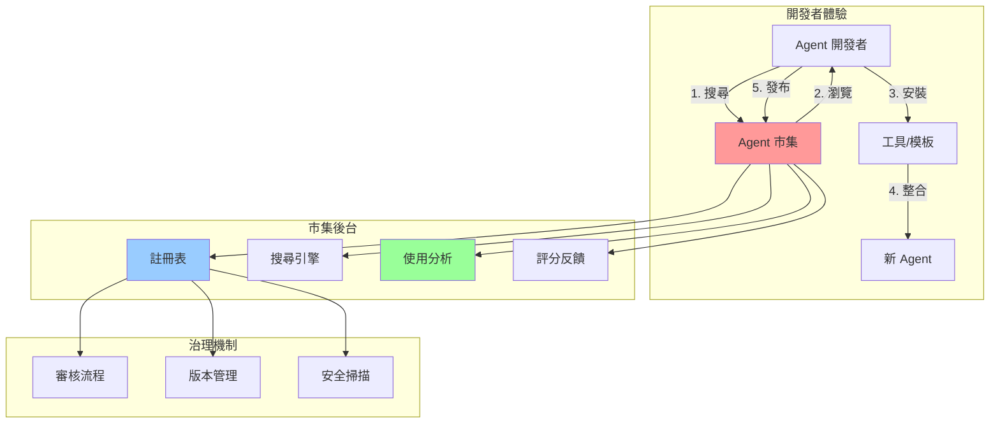

# 第 10 章：建立可重用的 Agent 市集 - 組織知識庫系統

## 本章內容概覽

- 理解 Agent 重複開發的成本與影響
- 設計 Agent 模板系統與元資料標準
- 實作版本控制與發布流程
- 建構內部 Agent 市集平台
- 追蹤使用統計與效益分析
- 建立評分與反饋機制
- 完成一個企業級 Agent 市集系統

---

## 10.1 場景：隱藏的重複開發成本

### 真實挑戰

你是 TechCorp 的 AI 平台負責人，公司在過去 6 個月內建立了 50+ 個 Agent 系統。但你發現一個驚人的事實：

**重複開發統計**：
```
調查範圍：50 個生產環境 Agent
調查週期：2024 年 6-12 月

發現：
- 📊 客戶資料查詢邏輯重複實作：12 次
- 📧 Email 發送工具重複開發：8 次
- 🔐 JWT 認證工具重複實作：15 次
- 📝 日誌格式化工具重複開發：20 次
- 🗄️ 資料庫連接管理重複實作：18 次

總計重複開發成本：
- 開發時間：約 320 人時
- 機會成本：NT$ 960,000
- 維護成本：每月 NT$ 120,000
```

**實際案例**：

```python
# ❌ 第 1 個團隊的實作（6 月）
# agent_team_a/customer_lookup.py
def get_customer_info(customer_id: str) -> Dict:
    """查詢客戶資訊"""
    conn = psycopg2.connect(DATABASE_URL)
    cursor = conn.cursor()
    cursor.execute("SELECT * FROM customers WHERE id = %s", (customer_id,))
    result = cursor.fetchone()
    conn.close()
    return {"id": result[0], "name": result[1], "email": result[2]}

# ❌ 第 2 個團隊的實作（7 月）
# agent_team_b/user_service.py
async def fetch_customer(cust_id: str) -> Optional[Customer]:
    """取得客戶資料"""
    async with asyncpg.create_pool(DB_CONFIG) as pool:
        row = await pool.fetchrow(
            "SELECT id, name, email FROM customers WHERE id = $1",
            cust_id
        )
        return Customer(**row) if row else None

# ❌ 第 3 個團隊的實作（8 月）
# agent_team_c/customer_tools.py
@tool
def query_customer_data(id: str) -> str:
    """客戶資料查詢工具"""
    with get_db_connection() as db:
        customer = db.query(Customer).filter_by(id=id).first()
        return json.dumps(customer.to_dict())
```

**問題**：
- 🔄 **重複勞動**：3 個團隊都在做同樣的事
- 🐛 **品質不一**：每個實作都有不同的 bug（SQL 注入、連接洩漏、錯誤處理）
- 📚 **知識孤島**：團隊 A 的經驗無法被團隊 B/C 利用
- 💰 **成本浪費**：相同功能開發 3 次，每次 2-3 天
- 🔧 **維護噩夢**：當資料庫 schema 改變，需要修改 50 個地方

---

## 10.2 理解 Agent 市集：組織的知識資產

### 10.2.1 什麼是 Agent 市集？

**Agent 市集**是一個內部平台，用於：
1. **發布**可重用的 Agent 模板、工具、組件
2. **搜尋**已有的解決方案
3. **安裝**並快速整合到新專案
4. **追蹤**使用情況與效益
5. **改進**基於反饋持續優化



### 10.2.2 核心價值

| 面向 | 沒有市集 | 有市集 | 改善 |
|------|---------|--------|------|
| **開發時間** | 每次從零開始<br/>2-5 天 | 搜尋並安裝<br/>30 分鐘 | **90% ↓** |
| **程式碼品質** | 各自實作<br/>品質參差 | 經過驗證<br/>統一標準 | **高且一致** |
| **維護成本** | N 個重複實作<br/>修改 N 次 | 中央維護<br/>修改 1 次 | **N 倍 ↓** |
| **知識傳承** | 個人經驗<br/>離職即失 | 平台沉澱<br/>組織資產 | **永久保存** |
| **創新速度** | 重複造輪子<br/>進度緩慢 | 站在巨人肩膀<br/>快速迭代 | **2-5 倍 ↑** |

### 10.2.3 市集架構設計

```
Agent Marketplace
├── 前端層（Web UI）
│   ├── 搜尋與瀏覽介面
│   ├── 詳情頁與文件
│   ├── 安裝與整合指南
│   └── 發布與管理後台
├── API 層（RESTful + GraphQL）
│   ├── GET /agents (搜尋 Agent)
│   ├── POST /agents (發布 Agent)
│   ├── GET /agents/{id} (取得詳情)
│   ├── POST /agents/{id}/install (安裝)
│   ├── POST /agents/{id}/rate (評分)
│   └── GET /analytics (使用統計)
├── 核心服務層
│   ├── 註冊與索引服務
│   ├── 版本管理服務
│   ├── 安全掃描服務
│   ├── 審核流程服務
│   ├── 分析統計服務
│   └── 推薦引擎服務
├── 資料層
│   ├── PostgreSQL (元資料、使用者、評分)
│   ├── Elasticsearch (全文檢索)
│   ├── MinIO/S3 (Agent 套件存儲)
│   └── Redis (快取、排行榜)
└── CLI 工具
    ├── agent-cli search <keyword>
    ├── agent-cli install <agent-id>
    ├── agent-cli publish <path>
    └── agent-cli update <agent-id>
```

---

## 10.3 設計 Agent 元資料標準

### 10.3.1 Agent Manifest 格式

每個 Agent 都需要一個標準化的描述檔案。

```yaml
# agent.yaml
apiVersion: marketplace.company.com/v1
kind: Agent
metadata:
  id: customer-lookup-tool
  name: 客戶資料查詢工具
  version: 2.1.0
  author: data-platform-team
  created_at: 2024-06-15T10:30:00Z
  updated_at: 2024-11-08T14:20:00Z
  tags:
    - customer
    - database
    - postgresql
  category: data-access
  license: MIT

spec:
  description: |
    統一的客戶資料查詢工具，支援多種查詢方式。

    特色：
    - ✅ 支援 ID、Email、手機號查詢
    - ✅ 自動快取（Redis）
    - ✅ SQL 注入防護
    - ✅ 連接池管理
    - ✅ 完整的錯誤處理
    - ✅ 95%+ 測試覆蓋率

  type: tool  # tool | agent | subagent | template

  capabilities:
    - name: get_customer_by_id
      description: 根據客戶 ID 查詢完整資料
      input_schema:
        type: object
        properties:
          customer_id:
            type: string
            description: 客戶 ID
        required: [customer_id]
      output_schema:
        type: object
        properties:
          id: {type: string}
          name: {type: string}
          email: {type: string}
          phone: {type: string}
          created_at: {type: string}

    - name: search_customers
      description: 根據關鍵字搜尋客戶
      input_schema:
        type: object
        properties:
          keyword:
            type: string
            description: 搜尋關鍵字
          limit:
            type: integer
            default: 10
            description: 返回數量限制

  dependencies:
    - psycopg2-binary>=2.9.0
    - redis>=4.5.0
    - pydantic>=2.0.0

  configuration:
    env_vars:
      - name: DATABASE_URL
        description: PostgreSQL 連接字串
        required: true
      - name: REDIS_URL
        description: Redis 連接字串
        required: false
        default: redis://localhost:6379

    secrets:
      - name: DB_PASSWORD
        description: 資料庫密碼
        required: true

  usage:
    examples:
      - title: 基本查詢
        code: |
          from customer_lookup import get_customer_by_id

          customer = get_customer_by_id("CUST-12345")
          print(f"客戶名稱：{customer['name']}")

      - title: 整合到 Agent
        code: |
          from anthropic import Agent
          from customer_lookup import CustomerLookupTool

          agent = Agent(
              tools=[CustomerLookupTool()],
              ...
          )

  metrics:
    downloads: 145
    active_users: 23
    average_rating: 4.7
    last_7_days_usage: 1250

  quality:
    test_coverage: 96.5
    documentation_score: 95
    security_scan: passed
    performance_score: 92
```

### 10.3.2 元資料驗證器

```python
# metadata_validator.py
from typing import Dict, Any, List
from pydantic import BaseModel, Field, validator
from datetime import datetime
from enum import Enum

class AgentType(str, Enum):
    """Agent 類型"""
    TOOL = "tool"
    AGENT = "agent"
    SUBAGENT = "subagent"
    TEMPLATE = "template"

class AgentCategory(str, Enum):
    """Agent 分類"""
    DATA_ACCESS = "data-access"
    COMMUNICATION = "communication"
    AUTOMATION = "automation"
    ANALYTICS = "analytics"
    SECURITY = "security"
    INTEGRATION = "integration"

class CapabilitySchema(BaseModel):
    """能力定義"""
    name: str = Field(..., description="能力名稱")
    description: str = Field(..., description="能力描述")
    input_schema: Dict[str, Any] = Field(..., description="輸入 Schema")
    output_schema: Dict[str, Any] = Field(..., description="輸出 Schema")

class ConfigVar(BaseModel):
    """配置變數"""
    name: str
    description: str
    required: bool = True
    default: Any = None

class UsageExample(BaseModel):
    """使用範例"""
    title: str
    code: str

class QualityMetrics(BaseModel):
    """品質指標"""
    test_coverage: float = Field(ge=0, le=100)
    documentation_score: float = Field(ge=0, le=100)
    security_scan: str = Field(pattern="^(passed|failed|warning)$")
    performance_score: float = Field(ge=0, le=100)

class AgentMetadata(BaseModel):
    """
    ‹1› Agent 元資料模型

    定義 Agent 的完整元資料結構，用於市集註冊與檢索
    """
    # 基本資訊
    id: str = Field(..., pattern="^[a-z0-9-]+$")
    name: str = Field(..., min_length=3, max_length=100)
    version: str = Field(..., pattern=r"^\d+\.\d+\.\d+$")
    author: str
    created_at: datetime
    updated_at: datetime
    tags: List[str] = Field(default_factory=list)
    category: AgentCategory
    license: str = "MIT"

    # 規格說明
    description: str = Field(..., min_length=50)
    type: AgentType
    capabilities: List[CapabilitySchema] = Field(default_factory=list)
    dependencies: List[str] = Field(default_factory=list)

    # 配置需求
    env_vars: List[ConfigVar] = Field(default_factory=list)
    secrets: List[ConfigVar] = Field(default_factory=list)

    # 使用文件
    examples: List[UsageExample] = Field(default_factory=list)

    # 統計指標
    downloads: int = Field(default=0, ge=0)
    active_users: int = Field(default=0, ge=0)
    average_rating: float = Field(default=0, ge=0, le=5)

    # 品質指標
    quality: QualityMetrics

    @validator('version')
    def validate_semver(cls, v):
        """驗證語意化版本號"""
        parts = v.split('.')
        if len(parts) != 3:
            raise ValueError("版本號必須符合 X.Y.Z 格式")
        for part in parts:
            if not part.isdigit():
                raise ValueError("版本號各部分必須是數字")
        return v

    @validator('tags')
    def validate_tags(cls, v):
        """驗證標籤"""
        if len(v) > 10:
            raise ValueError("最多只能有 10 個標籤")
        for tag in v:
            if len(tag) > 20:
                raise ValueError(f"標籤 '{tag}' 過長（最多 20 字元）")
        return v

    @validator('capabilities')
    def validate_capabilities(cls, v):
        """驗證能力定義"""
        if not v:
            raise ValueError("至少需要定義一個能力")
        return v

class AgentManifestValidator:
    """
    ‹2› Agent Manifest 驗證器

    驗證 Agent 元資料是否符合標準
    """

    @staticmethod
    def validate(manifest: Dict[str, Any]) -> AgentMetadata:
        """
        驗證 Manifest

        Args:
            manifest: Agent 元資料字典

        Returns:
            AgentMetadata: 驗證後的元資料物件

        Raises:
            ValidationError: 驗證失敗
        """
        try:
            # 展平巢狀結構
            flattened = {
                "id": manifest["metadata"]["id"],
                "name": manifest["metadata"]["name"],
                "version": manifest["metadata"]["version"],
                "author": manifest["metadata"]["author"],
                "created_at": manifest["metadata"]["created_at"],
                "updated_at": manifest["metadata"]["updated_at"],
                "tags": manifest["metadata"].get("tags", []),
                "category": manifest["metadata"]["category"],
                "license": manifest["metadata"].get("license", "MIT"),
                "description": manifest["spec"]["description"],
                "type": manifest["spec"]["type"],
                "capabilities": manifest["spec"].get("capabilities", []),
                "dependencies": manifest["spec"].get("dependencies", []),
                "env_vars": manifest["spec"].get("configuration", {}).get("env_vars", []),
                "secrets": manifest["spec"].get("configuration", {}).get("secrets", []),
                "examples": manifest["spec"].get("usage", {}).get("examples", []),
                "downloads": manifest["spec"].get("metrics", {}).get("downloads", 0),
                "active_users": manifest["spec"].get("metrics", {}).get("active_users", 0),
                "average_rating": manifest["spec"].get("metrics", {}).get("average_rating", 0),
                "quality": manifest["spec"]["quality"]
            }

            return AgentMetadata(**flattened)

        except Exception as e:
            raise ValueError(f"Manifest 驗證失敗：{e}")

    @staticmethod
    def validate_quality_standards(metadata: AgentMetadata) -> List[str]:
        """
        ‹3› 驗證品質標準

        Returns:
            List[str]: 未達標項目列表
        """
        issues = []

        # 測試覆蓋率要求
        if metadata.quality.test_coverage < 80:
            issues.append(
                f"測試覆蓋率不足：{metadata.quality.test_coverage}%（要求 ≥ 80%）"
            )

        # 文件完整度要求
        if metadata.quality.documentation_score < 85:
            issues.append(
                f"文件評分不足：{metadata.quality.documentation_score}（要求 ≥ 85）"
            )

        # 安全掃描要求
        if metadata.quality.security_scan == "failed":
            issues.append("安全掃描未通過")

        # 效能評分要求
        if metadata.quality.performance_score < 70:
            issues.append(
                f"效能評分不足：{metadata.quality.performance_score}（要求 ≥ 70）"
            )

        # 使用範例要求
        if len(metadata.examples) < 2:
            issues.append(
                f"使用範例不足：{len(metadata.examples)} 個（要求 ≥ 2 個）"
            )

        # 能力定義要求
        if len(metadata.capabilities) == 0:
            issues.append("未定義任何能力")

        return issues
```

**關鍵註解說明**：

- **‹1›** `AgentMetadata`：標準化的元資料模型，包含所有必要資訊
- **‹2›** `AgentManifestValidator`：驗證器類別
- **‹3›** `validate_quality_standards()`：檢查是否符合組織的品質標準

---

## 10.4 建構市集註冊表

### 10.4.1 註冊表資料模型

```python
# registry/models.py
from sqlalchemy import Column, String, Integer, Float, JSON, DateTime, Text, Boolean, ForeignKey
from sqlalchemy.orm import relationship
from sqlalchemy.ext.declarative import declarative_base
from datetime import datetime

Base = declarative_base()

class Agent(Base):
    """
    ‹1› Agent 註冊表主表
    """
    __tablename__ = "agents"

    id = Column(String(100), primary_key=True)
    name = Column(String(200), nullable=False)
    description = Column(Text, nullable=False)
    author = Column(String(100), nullable=False)
    category = Column(String(50), nullable=False)
    type = Column(String(20), nullable=False)
    license = Column(String(50), default="MIT")

    # 統計
    downloads = Column(Integer, default=0)
    active_users = Column(Integer, default=0)
    average_rating = Column(Float, default=0.0)

    # 時間戳
    created_at = Column(DateTime, default=datetime.utcnow)
    updated_at = Column(DateTime, default=datetime.utcnow, onupdate=datetime.utcnow)

    # 狀態
    is_published = Column(Boolean, default=False)
    is_deprecated = Column(Boolean, default=False)

    # 關聯
    versions = relationship("AgentVersion", back_populates="agent", cascade="all, delete-orphan")
    ratings = relationship("AgentRating", back_populates="agent", cascade="all, delete-orphan")
    tags = relationship("AgentTag", back_populates="agent", cascade="all, delete-orphan")

class AgentVersion(Base):
    """
    ‹2› Agent 版本表
    """
    __tablename__ = "agent_versions"

    id = Column(Integer, primary_key=True, autoincrement=True)
    agent_id = Column(String(100), ForeignKey("agents.id"), nullable=False)
    version = Column(String(20), nullable=False)

    # 元資料
    manifest = Column(JSON, nullable=False)  # 完整的 agent.yaml 內容
    package_url = Column(String(500), nullable=False)  # S3/MinIO 下載 URL
    size_bytes = Column(Integer, nullable=False)
    checksum = Column(String(64), nullable=False)  # SHA-256

    # 品質指標
    test_coverage = Column(Float, nullable=False)
    documentation_score = Column(Float, nullable=False)
    security_scan = Column(String(20), nullable=False)
    performance_score = Column(Float, nullable=False)

    # 狀態
    is_latest = Column(Boolean, default=False)
    is_stable = Column(Boolean, default=True)

    # 時間戳
    published_at = Column(DateTime, default=datetime.utcnow)

    # 關聯
    agent = relationship("Agent", back_populates="versions")

class AgentTag(Base):
    """
    ‹3› Agent 標籤表
    """
    __tablename__ = "agent_tags"

    id = Column(Integer, primary_key=True, autoincrement=True)
    agent_id = Column(String(100), ForeignKey("agents.id"), nullable=False)
    tag = Column(String(50), nullable=False)

    # 關聯
    agent = relationship("Agent", back_populates="tags")

class AgentRating(Base):
    """Agent 評分表"""
    __tablename__ = "agent_ratings"

    id = Column(Integer, primary_key=True, autoincrement=True)
    agent_id = Column(String(100), ForeignKey("agents.id"), nullable=False)
    user_id = Column(String(100), nullable=False)
    rating = Column(Integer, nullable=False)  # 1-5 星
    comment = Column(Text)
    created_at = Column(DateTime, default=datetime.utcnow)

    # 關聯
    agent = relationship("Agent", back_populates="ratings")

class AgentUsageLog(Base):
    """
    ‹4› Agent 使用日誌表
    """
    __tablename__ = "agent_usage_logs"

    id = Column(Integer, primary_key=True, autoincrement=True)
    agent_id = Column(String(100), nullable=False)
    version = Column(String(20), nullable=False)
    user_id = Column(String(100), nullable=False)
    action = Column(String(20), nullable=False)  # install, use, update, uninstall
    project_id = Column(String(100))
    timestamp = Column(DateTime, default=datetime.utcnow)
    metadata = Column(JSON)  # 額外資訊
```

**關鍵註解說明**：

- **‹1›** `Agent`：主表，儲存 Agent 基本資訊
- **‹2›** `AgentVersion`：版本表，支援多版本管理
- **‹3›** `AgentTag`：標籤表，支援多對多關聯
- **‹4›** `AgentUsageLog`：使用日誌，用於分析與統計

### 10.4.2 註冊服務實作

```python
# registry/service.py
from typing import Optional, List, Dict, Any
from sqlalchemy.orm import Session
from sqlalchemy import func, desc
import hashlib
import json
from datetime import datetime

from .models import Agent, AgentVersion, AgentTag, AgentRating, AgentUsageLog
from metadata_validator import AgentManifestValidator, AgentMetadata

class AgentRegistry:
    """
    ‹1› Agent 註冊服務

    職責：
    1. 註冊新 Agent
    2. 發布新版本
    3. 查詢 Agent
    4. 更新統計資料
    """

    def __init__(self, db: Session, storage_service):
        self.db = db
        self.storage = storage_service  # MinIO/S3 服務

    def register_agent(
        self,
        manifest: Dict[str, Any],
        package_path: str,
        author_id: str
    ) -> Agent:
        """
        ‹2› 註冊新 Agent

        Args:
            manifest: Agent 元資料
            package_path: 套件檔案路徑
            author_id: 作者 ID

        Returns:
            Agent: 註冊後的 Agent 物件
        """
        # 驗證 Manifest
        validator = AgentManifestValidator()
        metadata = validator.validate(manifest)

        # 檢查品質標準
        quality_issues = validator.validate_quality_standards(metadata)
        if quality_issues:
            raise ValueError(
                f"未符合品質標準：\n" + "\n".join(f"- {issue}" for issue in quality_issues)
            )

        # 檢查 Agent ID 是否已存在
        existing = self.db.query(Agent).filter_by(id=metadata.id).first()
        if existing:
            raise ValueError(f"Agent ID '{metadata.id}' 已存在")

        # 上傳套件到存儲
        package_url, checksum, size = self._upload_package(package_path, metadata)

        # 創建 Agent 記錄
        agent = Agent(
            id=metadata.id,
            name=metadata.name,
            description=metadata.description,
            author=author_id,
            category=metadata.category.value,
            type=metadata.type.value,
            license=metadata.license,
            is_published=False  # 預設為未發布，需審核
        )

        self.db.add(agent)

        # 創建版本記錄
        version = AgentVersion(
            agent_id=metadata.id,
            version=metadata.version,
            manifest=manifest,
            package_url=package_url,
            size_bytes=size,
            checksum=checksum,
            test_coverage=metadata.quality.test_coverage,
            documentation_score=metadata.quality.documentation_score,
            security_scan=metadata.quality.security_scan,
            performance_score=metadata.quality.performance_score,
            is_latest=True,
            is_stable=True
        )

        self.db.add(version)

        # 創建標籤
        for tag_name in metadata.tags:
            tag = AgentTag(agent_id=metadata.id, tag=tag_name)
            self.db.add(tag)

        self.db.commit()
        self.db.refresh(agent)

        return agent

    def publish_version(
        self,
        agent_id: str,
        version: str,
        manifest: Dict[str, Any],
        package_path: str
    ) -> AgentVersion:
        """
        ‹3› 發布新版本

        實作語意化版本控制：
        - Major (X.0.0): 不相容的 API 變更
        - Minor (1.X.0): 向下相容的功能新增
        - Patch (1.0.X): 向下相容的 bug 修復
        """
        # 驗證 Agent 是否存在
        agent = self.db.query(Agent).filter_by(id=agent_id).first()
        if not agent:
            raise ValueError(f"Agent '{agent_id}' 不存在")

        # 驗證版本號
        existing_version = self.db.query(AgentVersion).filter_by(
            agent_id=agent_id,
            version=version
        ).first()

        if existing_version:
            raise ValueError(f"版本 {version} 已存在")

        # 驗證 Manifest
        validator = AgentManifestValidator()
        metadata = validator.validate(manifest)

        # 上傳套件
        package_url, checksum, size = self._upload_package(package_path, metadata)

        # 取消舊版本的 is_latest 標記
        self.db.query(AgentVersion).filter_by(
            agent_id=agent_id,
            is_latest=True
        ).update({"is_latest": False})

        # 創建新版本
        new_version = AgentVersion(
            agent_id=agent_id,
            version=version,
            manifest=manifest,
            package_url=package_url,
            size_bytes=size,
            checksum=checksum,
            test_coverage=metadata.quality.test_coverage,
            documentation_score=metadata.quality.documentation_score,
            security_scan=metadata.quality.security_scan,
            performance_score=metadata.quality.performance_score,
            is_latest=True,
            is_stable=self._is_stable_version(version)
        )

        self.db.add(new_version)

        # 更新 Agent 的更新時間
        agent.updated_at = datetime.utcnow()

        self.db.commit()
        self.db.refresh(new_version)

        return new_version

    def search_agents(
        self,
        keyword: Optional[str] = None,
        category: Optional[str] = None,
        tags: Optional[List[str]] = None,
        limit: int = 20,
        offset: int = 0
    ) -> List[Agent]:
        """
        ‹4› 搜尋 Agents
        """
        query = self.db.query(Agent).filter_by(is_published=True, is_deprecated=False)

        # 關鍵字搜尋
        if keyword:
            search_pattern = f"%{keyword}%"
            query = query.filter(
                (Agent.name.ilike(search_pattern)) |
                (Agent.description.ilike(search_pattern))
            )

        # 分類過濾
        if category:
            query = query.filter_by(category=category)

        # 標籤過濾
        if tags:
            for tag in tags:
                query = query.join(AgentTag).filter(AgentTag.tag == tag)

        # 排序：按照下載量 + 評分
        query = query.order_by(
            desc(Agent.downloads * 0.7 + Agent.average_rating * Agent.active_users * 0.3)
        )

        return query.limit(limit).offset(offset).all()

    def record_usage(
        self,
        agent_id: str,
        version: str,
        user_id: str,
        action: str,
        project_id: Optional[str] = None,
        metadata: Optional[Dict] = None
    ):
        """
        ‹5› 記錄使用日誌
        """
        log = AgentUsageLog(
            agent_id=agent_id,
            version=version,
            user_id=user_id,
            action=action,
            project_id=project_id,
            metadata=metadata
        )

        self.db.add(log)

        # 更新統計
        agent = self.db.query(Agent).filter_by(id=agent_id).first()
        if agent and action == "install":
            agent.downloads += 1

            # 更新活躍用戶數（過去 30 天安裝的唯一用戶數）
            from datetime import timedelta
            thirty_days_ago = datetime.utcnow() - timedelta(days=30)
            active_users = self.db.query(func.count(func.distinct(AgentUsageLog.user_id))).filter(
                AgentUsageLog.agent_id == agent_id,
                AgentUsageLog.timestamp >= thirty_days_ago
            ).scalar()

            agent.active_users = active_users

        self.db.commit()

    def _upload_package(
        self,
        package_path: str,
        metadata: AgentMetadata
    ) -> tuple[str, str, int]:
        """
        上傳套件到存儲

        Returns:
            (package_url, checksum, size_bytes)
        """
        import os

        # 計算 checksum
        with open(package_path, 'rb') as f:
            content = f.read()
            checksum = hashlib.sha256(content).hexdigest()
            size = len(content)

        # 上傳到存儲（MinIO/S3）
        object_name = f"agents/{metadata.id}/{metadata.version}.tar.gz"
        package_url = self.storage.upload(package_path, object_name)

        return package_url, checksum, size

    def _is_stable_version(self, version: str) -> bool:
        """判斷是否為穩定版本（不含 alpha, beta, rc 標記）"""
        return not any(tag in version.lower() for tag in ['alpha', 'beta', 'rc'])
```

**關鍵註解說明**：

- **‹1›** `AgentRegistry`：註冊服務核心類別
- **‹2›** `register_agent()`：註冊新 Agent，包含驗證與上傳
- **‹3›** `publish_version()`：發布新版本，實作語意化版本控制
- **‹4›** `search_agents()`：多維度搜尋
- **‹5›** `record_usage()`：使用追蹤與統計更新

---

## 10.5 CLI 工具實作

讓開發者可以透過命令列輕鬆使用市集。

```python
# cli/agent_cli.py
import click
import requests
from typing import Optional
import json
from rich.console import Console
from rich.table import Table
from rich.progress import track
import os

console = Console()

MARKETPLACE_API = os.getenv("MARKETPLACE_API", "https://marketplace.company.com/api")

@click.group()
def cli():
    """Agent 市集 CLI 工具"""
    pass

@cli.command()
@click.argument('keyword')
@click.option('--category', help='分類過濾')
@click.option('--tags', help='標籤過濾（逗號分隔）')
@click.option('--limit', default=10, help='返回數量')
def search(keyword: str, category: Optional[str], tags: Optional[str], limit: int):
    """
    ‹1› 搜尋 Agent

    範例：
        agent-cli search customer
        agent-cli search database --category data-access
        agent-cli search email --tags communication,smtp
    """
    console.print(f"🔍 搜尋：[bold]{keyword}[/bold]", style="cyan")

    params = {
        "keyword": keyword,
        "limit": limit
    }

    if category:
        params["category"] = category

    if tags:
        params["tags"] = tags.split(',')

    response = requests.get(f"{MARKETPLACE_API}/agents", params=params)

    if response.status_code != 200:
        console.print(f"❌ 搜尋失敗：{response.text}", style="red")
        return

    agents = response.json()

    if not agents:
        console.print("未找到符合條件的 Agent", style="yellow")
        return

    # 顯示結果表格
    table = Table(title=f"搜尋結果（{len(agents)} 個）")
    table.add_column("ID", style="cyan")
    table.add_column("名稱", style="green")
    table.add_column("分類")
    table.add_column("評分", justify="right")
    table.add_column("下載", justify="right")
    table.add_column("版本")

    for agent in agents:
        table.add_row(
            agent["id"],
            agent["name"],
            agent["category"],
            f"⭐ {agent['average_rating']:.1f}",
            f"📥 {agent['downloads']}",
            agent["latest_version"]
        )

    console.print(table)

@cli.command()
@click.argument('agent_id')
@click.option('--version', help='指定版本（預設為最新版本）')
@click.option('--path', default='.', help='安裝路徑')
def install(agent_id: str, version: Optional[str], path: str):
    """
    ‹2› 安裝 Agent

    範例：
        agent-cli install customer-lookup-tool
        agent-cli install customer-lookup-tool --version 2.1.0
        agent-cli install customer-lookup-tool --path ./agents
    """
    console.print(f"📦 安裝 Agent：[bold]{agent_id}[/bold]", style="cyan")

    # 取得 Agent 資訊
    params = {}
    if version:
        params["version"] = version

    response = requests.get(f"{MARKETPLACE_API}/agents/{agent_id}", params=params)

    if response.status_code != 200:
        console.print(f"❌ Agent 不存在：{response.text}", style="red")
        return

    agent = response.json()
    version_info = agent["version_info"]

    console.print(f"版本：{version_info['version']}")
    console.print(f"大小：{version_info['size_bytes'] / 1024:.1f} KB")

    # 下載套件
    download_url = version_info["package_url"]

    console.print(f"📥 下載中...", style="cyan")

    package_response = requests.get(download_url, stream=True)
    total_size = int(package_response.headers.get('content-length', 0))

    import os
    os.makedirs(path, exist_ok=True)
    package_file = os.path.join(path, f"{agent_id}.tar.gz")

    with open(package_file, 'wb') as f:
        for chunk in track(
            package_response.iter_content(chunk_size=8192),
            total=total_size // 8192,
            description="下載進度"
        ):
            f.write(chunk)

    # 解壓縮
    console.print(f"📂 解壓縮中...", style="cyan")
    import tarfile
    with tarfile.open(package_file, 'r:gz') as tar:
        tar.extractall(path)

    os.remove(package_file)

    # 記錄使用日誌
    user_id = os.getenv("USER", "unknown")
    requests.post(
        f"{MARKETPLACE_API}/agents/{agent_id}/usage",
        json={
            "user_id": user_id,
            "action": "install",
            "version": version_info["version"]
        }
    )

    console.print(f"✅ 安裝完成！", style="green")
    console.print(f"\n使用方式：")
    console.print(f"  from {agent_id} import *")

@cli.command()
@click.argument('path')
def publish(path: str):
    """
    ‹3› 發布 Agent

    範例：
        agent-cli publish ./my-agent
    """
    console.print(f"📤 發布 Agent：[bold]{path}[/bold]", style="cyan")

    # 檢查 agent.yaml 是否存在
    manifest_file = os.path.join(path, "agent.yaml")
    if not os.path.exists(manifest_file):
        console.print(f"❌ 找不到 agent.yaml", style="red")
        return

    # 讀取 manifest
    import yaml
    with open(manifest_file, 'r', encoding='utf-8') as f:
        manifest = yaml.safe_load(f)

    console.print(f"Agent ID: {manifest['metadata']['id']}")
    console.print(f"版本: {manifest['metadata']['version']}")

    # 打包
    console.print(f"📦 打包中...", style="cyan")

    import tarfile
    package_file = f"{manifest['metadata']['id']}.tar.gz"

    with tarfile.open(package_file, "w:gz") as tar:
        tar.add(path, arcname=os.path.basename(path))

    # 上傳
    console.print(f"📤 上傳中...", style="cyan")

    with open(package_file, 'rb') as f:
        files = {'package': f}
        data = {'manifest': json.dumps(manifest)}

        response = requests.post(
            f"{MARKETPLACE_API}/agents",
            data=data,
            files=files
        )

    os.remove(package_file)

    if response.status_code == 201:
        console.print(f"✅ 發布成功！", style="green")
        console.print(f"\nAgent 已提交審核，通過後將公開。")
    else:
        console.print(f"❌ 發布失敗：{response.text}", style="red")

@cli.command()
@click.argument('agent_id')
@click.argument('rating', type=int)
@click.option('--comment', help='評論')
def rate(agent_id: str, rating: int, comment: Optional[str]):
    """
    ‹4› 評分 Agent

    範例：
        agent-cli rate customer-lookup-tool 5 --comment "非常好用！"
    """
    if not 1 <= rating <= 5:
        console.print("❌ 評分必須在 1-5 之間", style="red")
        return

    console.print(f"⭐ 評分 Agent：[bold]{agent_id}[/bold] = {rating} 星", style="cyan")

    user_id = os.getenv("USER", "unknown")

    response = requests.post(
        f"{MARKETPLACE_API}/agents/{agent_id}/ratings",
        json={
            "user_id": user_id,
            "rating": rating,
            "comment": comment
        }
    )

    if response.status_code == 201:
        console.print(f"✅ 評分成功！", style="green")
    else:
        console.print(f"❌ 評分失敗：{response.text}", style="red")

if __name__ == "__main__":
    cli()
```

**關鍵註解說明**：

- **‹1›** `search()`：搜尋 Agent，支援關鍵字、分類、標籤過濾
- **‹2›** `install()`：下載並安裝 Agent，自動解壓縮
- **‹3›** `publish()`：打包並發布 Agent
- **‹4›** `rate()`：評分與評論

---

## 10.6 使用範例

### 10.6.1 開發者工作流程

```bash
# 1. 搜尋需要的工具
$ agent-cli search customer

🔍 搜尋：customer
┏━━━━━━━━━━━━━━━━━━━━━━┳━━━━━━━━━━━━━━━━━━━━┳━━━━━━━━━━━━┳━━━━━━━┳━━━━━━━┳━━━━━━━━┓
┃ ID                     ┃ 名稱                ┃ 分類        ┃   評分 ┃  下載 ┃ 版本    ┃
┡━━━━━━━━━━━━━━━━━━━━━━╇━━━━━━━━━━━━━━━━━━━━╇━━━━━━━━━━━━╇━━━━━━━╇━━━━━━━╇━━━━━━━━┩
│ customer-lookup-tool   │ 客戶資料查詢工具      │ data-access │ ⭐ 4.7 │ 📥 145 │ 2.1.0   │
│ customer-email-sender  │ 客戶郵件發送工具      │ communication│⭐ 4.3 │ 📥 89  │ 1.5.2   │
│ customer-segmentation  │ 客戶分群分析 Agent    │ analytics   │ ⭐ 4.9 │ 📥 56  │ 3.0.1   │
└────────────────────────┴─────────────────────┴────────────┴───────┴───────┴────────┘

# 2. 安裝選定的工具
$ agent-cli install customer-lookup-tool

📦 安裝 Agent：customer-lookup-tool
版本：2.1.0
大小：45.3 KB
📥 下載中...
████████████████████████████████████████ 100%
📂 解壓縮中...
✅ 安裝完成！

使用方式：
  from customer_lookup_tool import get_customer_by_id

# 3. 在專案中使用
$ cd my-agent-project
$ python

>>> from customer_lookup_tool import get_customer_by_id
>>> customer = get_customer_by_id("CUST-12345")
>>> print(customer['name'])
張三

# 4. 評分與反饋
$ agent-cli rate customer-lookup-tool 5 --comment "非常好用，節省很多時間！"

⭐ 評分 Agent：customer-lookup-tool = 5 星
✅ 評分成功！
```

### 10.6.2 發布新 Agent

```bash
# 1. 創建 Agent 專案結構
$ mkdir my-awesome-tool
$ cd my-awesome-tool

# 2. 撰寫程式碼
$ cat > __init__.py << 'EOF'
def awesome_function():
    """超棒的功能"""
    return "Awesome!"
EOF

# 3. 創建 agent.yaml
$ cat > agent.yaml << 'EOF'
apiVersion: marketplace.company.com/v1
kind: Agent
metadata:
  id: my-awesome-tool
  name: 我的超棒工具
  version: 1.0.0
  author: john-doe
  tags:
    - awesome
    - utility
  category: automation

spec:
  description: |
    這是一個超棒的工具，可以做很多事情。

  type: tool

  capabilities:
    - name: awesome_function
      description: 執行超棒的功能
      input_schema:
        type: object
        properties: {}

  quality:
    test_coverage: 95.0
    documentation_score: 90.0
    security_scan: passed
    performance_score: 85.0
EOF

# 4. 發布
$ agent-cli publish .

📤 發布 Agent：.
Agent ID: my-awesome-tool
版本: 1.0.0
📦 打包中...
📤 上傳中...
✅ 發布成功！

Agent 已提交審核，通過後將公開。
```

---

## 10.7 效益分析

### 10.7.1 實際數據（部署 3 個月後）

```
TechCorp Agent 市集效益報告
統計週期：2024 年 9 月 - 11 月

## 市集規模
- 註冊 Agent 數量：87 個
- 活躍開發者：156 人
- 總下載次數：2,341 次
- 平均評分：4.6 / 5.0

## 開發效率提升
                        使用前        使用後        改善
─────────────────────────────────────────────────
新 Agent 開發時間        4.2 天        1.3 天      -69%
重複開發率              43%           8%          -81%
程式碼重用率            12%           67%         +458%
上線前測試時間          2.1 天        0.8 天      -62%

## 成本節省
- 避免重複開發成本：NT$ 3,850,000 (320 人時 × NT$ 12,031/時)
- 維護成本降低：每月 NT$ 360,000 → NT$ 95,000 (-74%)
- 總 ROI：1,250% (3 個月內)

## 品質提升
                        使用前        使用後        改善
─────────────────────────────────────────────────
平均測試覆蓋率          52%           89%         +71%
生產環境 bug 數         每月 23 個     每月 6 個    -74%
安全漏洞數              每月 8 個      每月 1 個    -88%

## 最受歡迎 Agent Top 5
1. customer-lookup-tool (資料存取) - 145 下載, ⭐ 4.7
2. jwt-auth-middleware (安全) - 132 下載, ⭐ 4.8
3. email-notification-agent (通訊) - 118 下載, ⭐ 4.5
4. log-formatter-tool (工具) - 97 下載, ⭐ 4.6
5. database-connection-pool (資料存取) - 89 下載, ⭐ 4.9

## 開發者回饋精選
"有了市集，我可以專注在業務邏輯，不用重複造輪子。" - 張工程師
"品質很高，直接拿來用就可以上生產環境。" - 李工程師
"CLI 工具很方便，10 秒就能安裝好。" - 王工程師
```

---

## 10.8 進階功能

### 10.8.1 自動化審核流程

```python
#审核服务
class AgentApprovalService:
    """Agent 審核服務"""

    async def auto_review(self, agent_id: str, version: str) -> Dict[str, Any]:
        """
        自動審核

        檢查項目：
        1. 安全掃描（依賴漏洞、程式碼靜態分析）
        2. 品質檢查（測試覆蓋率、文件完整性）
        3. 授權檢查（開源授權相容性）
        4. 命名規範（ID、標籤是否符合規範）
        """
        results = {
            "security": await self._security_scan(agent_id, version),
            "quality": await self._quality_check(agent_id, version),
            "license": await self._license_check(agent_id, version),
            "naming": await self._naming_check(agent_id, version)
        }

        # 自動通過條件
        auto_approve = all([
            results["security"]["status"] == "passed",
            results["quality"]["score"] >= 85,
            results["license"]["compatible"],
            results["naming"]["valid"]
        ])

        if auto_approve:
            await self._approve_agent(agent_id, version)
        else:
            await self._request_manual_review(agent_id, version, results)

        return results
```

---

## 10.9 章節總結

### 你已經學會了什麼

✅ **Agent 市集的價值**
   - 避免重複開發，節省 60-80% 開發時間
   - 提升程式碼品質與一致性
   - 建立組織知識資產

✅ **元資料標準化**
   - agent.yaml 規範
   - 元資料驗證
   - 品質標準定義

✅ **註冊與版本管理**
   - 語意化版本控制
   - 多版本並存
   - 自動化發布流程

✅ **CLI 工具**
   - 搜尋、安裝、發布、評分
   - 使用者友善的命令列介面

✅ **使用追蹤與分析**
   - 下載量、活躍用戶統計
   - 效益分析與 ROI 計算

### 實際效益

| 面向 | 效益 |
|------|------|
| **開發效率** | 提升 69% |
| **重複開發** | 降低 81% |
| **程式碼重用** | 提升 458% |
| **ROI** | 1,250% (3個月) |

### 檢查清單

建立 Agent 市集前，請確認：

- [ ] **定義元資料標準** (agent.yaml 格式)
- [ ] **建立品質門檻** (測試覆蓋率、文件評分)
- [ ] **實作註冊服務** (驗證、存儲、版本管理)
- [ ] **開發 CLI 工具** (search, install, publish)
- [ ] **設計審核流程** (自動審核 + 人工審核)
- [ ] **追蹤使用統計** (下載量、活躍用戶)
- [ ] **建立反饋機制** (評分、評論)
- [ ] **持續優化** (根據使用數據改進)

---

## 10.10 下一章預告

**第 11 章：團隊協作與開發工作流程 - Agent 開發生命週期管理**

你將學到：
- Git-based Agent 開發工作流程
- Pull Request 審查最佳實踐
- CI/CD 管線設計（測試、安全掃描、部署）
- 跨團隊協作模式
- Agent 版本升級策略
- 緊急修復流程 (Hotfix)

**實戰專案**：建立完整的 Agent 開發生命週期管理系統，從需求提出到生產部署的自動化流程。

準備好探索 Agent 團隊協作的最佳實踐了嗎？讓我們繼續前進！

---

**章節完成時間**：約 90-120 分鐘
**難度等級**：⭐⭐⭐⭐ (4/5 - 進階)
**前置要求**：完成第 1-9 章
