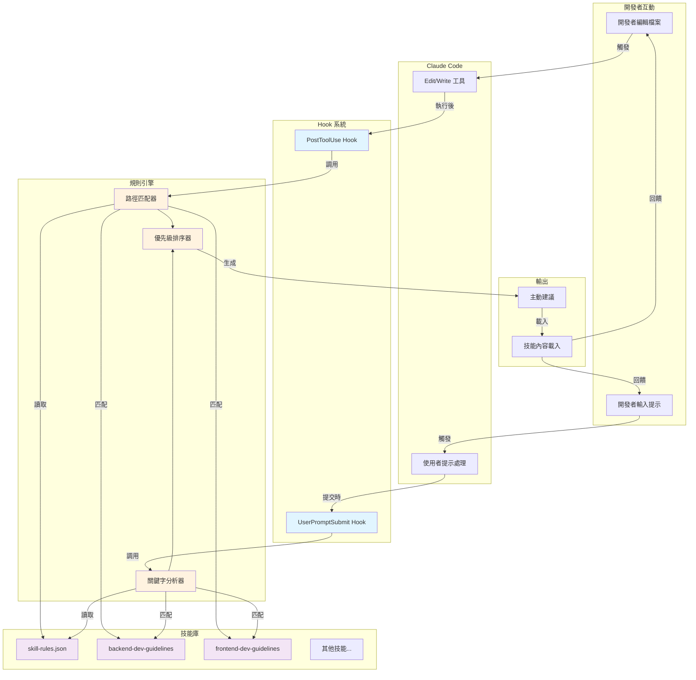
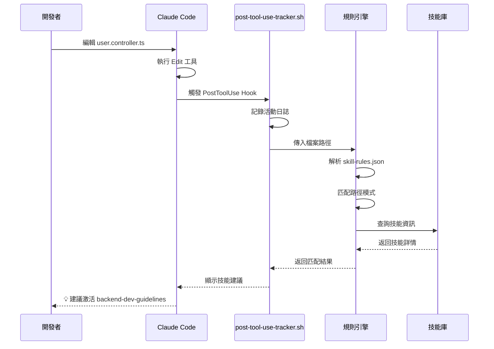
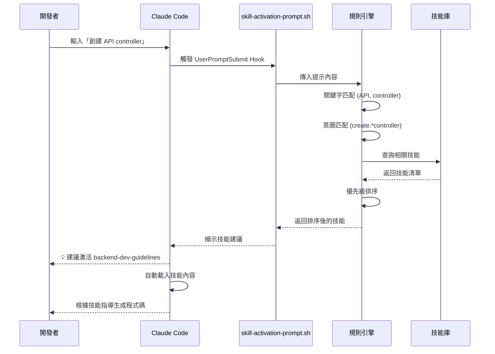
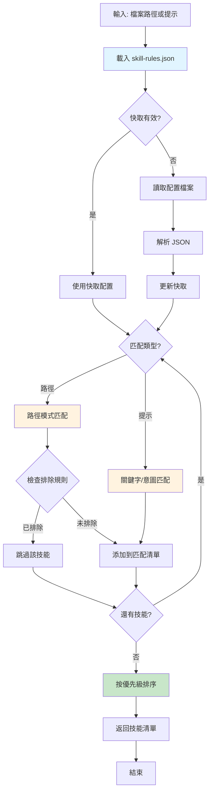
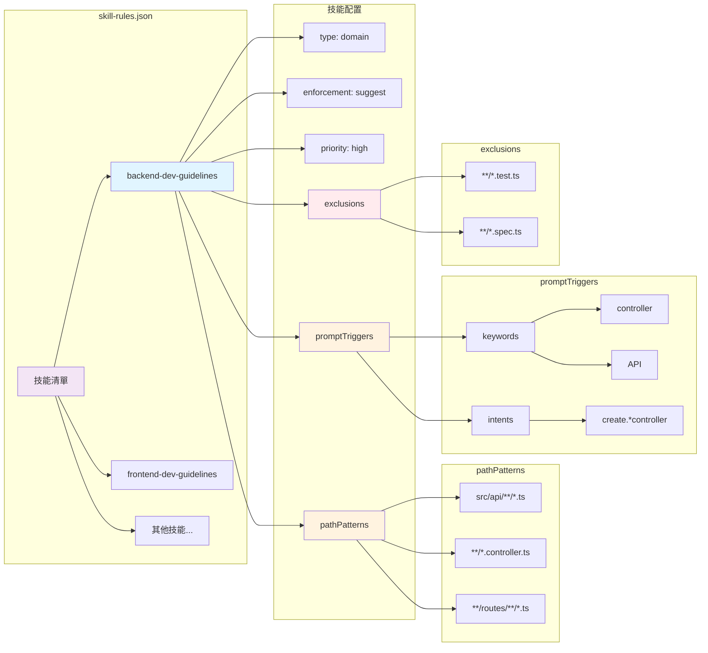
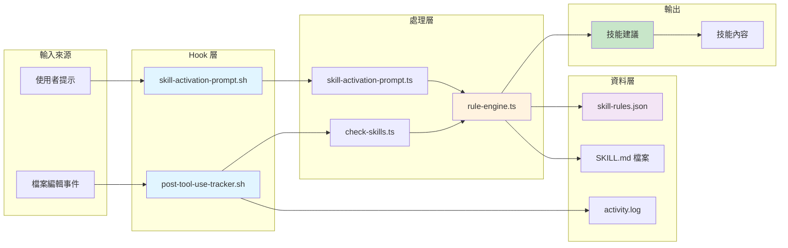
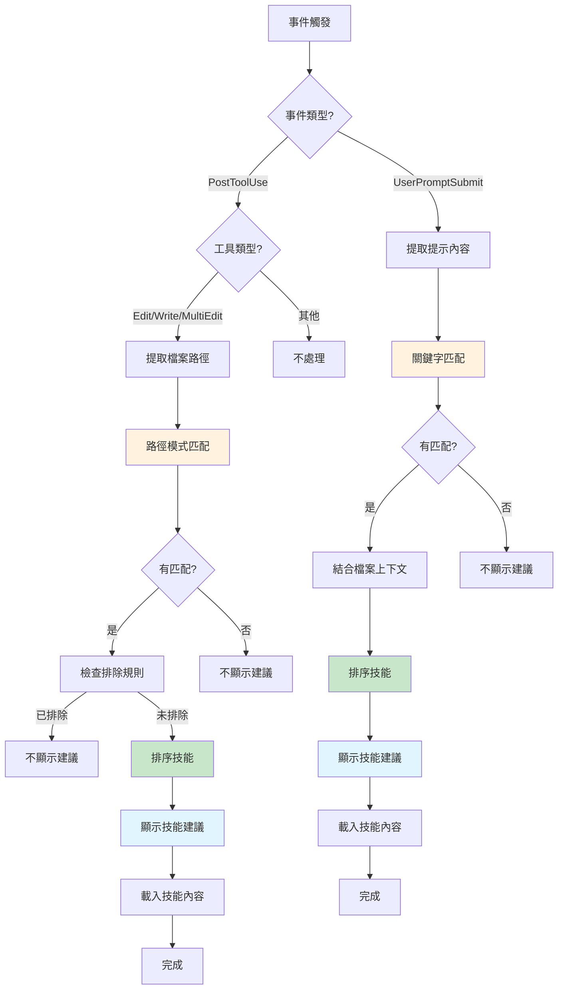
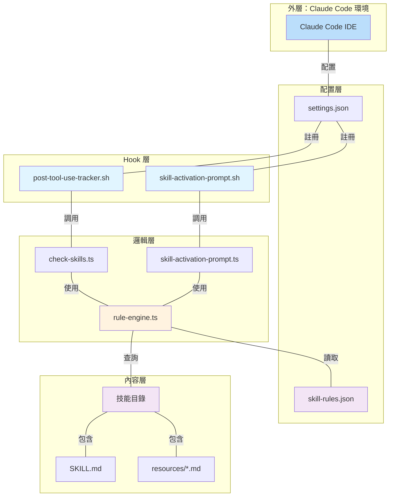

# Chapter 1 系統架構圖

## 1. 整體系統架構

## 2. PostToolUse Hook 工作流程

## 3. UserPromptSubmit Hook 工作流程

## 4. 規則引擎內部邏輯

## 5. 技能規則配置結構

## 6. 資料流程圖

## 7. 決策樹：技能激活邏輯

## 8. 系統組件關係圖

## 圖表說明

### 圖 1: 整體系統架構
展示從開發者互動到技能激活的完整流程，包含所有主要組件及其關係。

### 圖 2-3: Hook 工作流程
詳細說明兩個 Hook 的序列圖，展示時序和資料流動。

### 圖 4: 規則引擎內部邏輯
展示規則引擎的決策流程，包含快取機制、匹配邏輯和優先級排序。

### 圖 5: 技能規則配置結構
展示 `skill-rules.json` 的資料結構和各個欄位的關係。

### 圖 6: 資料流程圖
從輸入到輸出的資料流動，突顯關鍵處理步驟。

### 圖 7: 決策樹
展示系統如何決定是否激活技能以及激活哪些技能。

### 圖 8: 系統組件關係圖
展示所有組件的層次關係和依賴關係。
