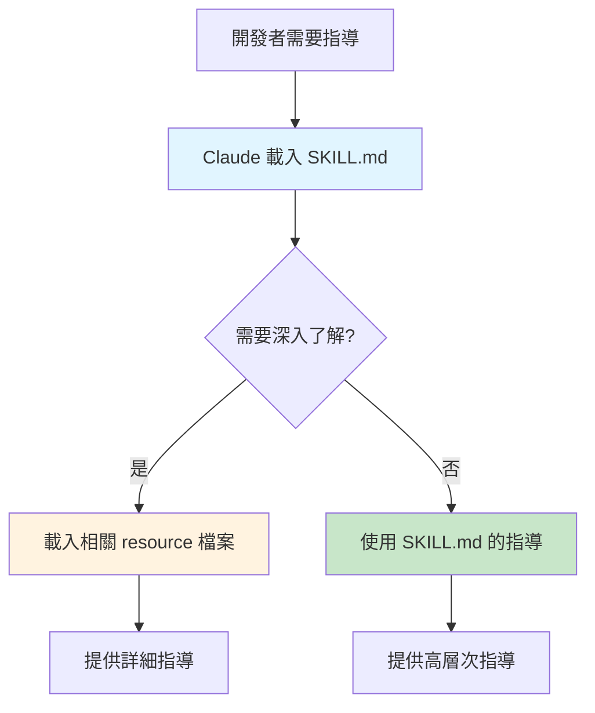

# 第 2 章：設計你的第一個技能模組

> **本章目標**
> 在本章結束時，你將擁有一個完整的後端開發指南技能，包含主檔案和 12 個資源模組，能夠為你的 TypeScript 微服務專案提供全方位的開發指導。

## 2.1 問題：當技能變得太大時

在上一章中，我們建立了自動激活系統，讓 Claude Code 能夠根據上下文自動建議技能。但是當 Sarah（我們的前端工程師）實際開始撰寫技能時，她遇到了一個新問題。

**早上 9:00** - Sarah 的第一次嘗試

Sarah 決定為團隊的 React + Material UI 專案建立一個前端開發指南。她打開 `.claude/skills/frontend-guidelines/SKILL.md`，開始撰寫：

```markdown
# 前端開發指南

## Component 設計原則
（200 行內容）

## Material UI v7 使用指南
（300 行內容）

## State 管理最佳實踐
（250 行內容）

## 表單處理與驗證
（280 行內容）

## 效能優化
（220 行內容）

## 測試策略
（180 行內容）

...（還有更多主題）
```

**下午 2:30** - 檔案已經 2,500 行

Sarah 發現她的 `SKILL.md` 檔案已經膨脹到 2,500 行，而且她還有很多內容想加入。更糟的是：

**問題 1：上下文限制**
當 Claude Code 載入這個技能時，它會消耗大量的上下文 tokens，即使開發者只需要其中的「表單處理」部分。

**問題 2：維護困難**
2,500 行的單一檔案很難維護。當她想更新「Material UI」部分時，必須在巨大的檔案中尋找相關章節。

**問題 3：認知負擔**
對於新加入團隊的開發者，一次性看到 2,500 行的指南會感到overwhelmed（不知所措）。

**問題 4：載入速度**
每次觸發技能，Claude Code 都需要讀取和解析整個 2,500 行檔案，即使只需要其中一小部分。

---

Sarah 向團隊的 DevOps 工程師 Mike 求助。Mike 分享了他在構建基礎設施文件時學到的原則：

> **「漸進式揭露」（Progressive Disclosure）**
> 先提供高層次的指導，只在需要時才深入細節。

這個原則啟發了 Sarah 設計新的技能架構。

---

## 2.2 解決方案：模組化技能架構

### 2.2.1 設計原則

**核心理念**：技能應該像一本書：
- **主檔案（SKILL.md）** = 目錄 + 核心概念（< 500 行）
- **資源檔案（resources/*.md）** = 各章節詳細內容（每個 < 500 行）



### 2.2.2 技能目錄結構

讓我們設計一個完整的後端開發指南技能：

```
.claude/skills/backend-dev-guidelines/
├── SKILL.md                           # 主檔案（< 500 行）
├── metadata.json                      # 技能元資料
└── resources/                         # 詳細資源
    ├── 01-controller-patterns.md     # 控制器設計模式
    ├── 02-service-layer.md           # 服務層架構
    ├── 03-data-access-layer.md       # 資料存取層
    ├── 04-error-handling.md          # 錯誤處理策略
    ├── 05-validation.md              # 驗證與授權
    ├── 06-testing.md                 # 測試最佳實踐
    ├── 07-api-design.md              # API 設計原則
    ├── 08-database-patterns.md       # 資料庫模式
    ├── 09-caching-strategies.md      # 快取策略
    ├── 10-logging-monitoring.md      # 日誌與監控
    ├── 11-security.md                # 安全最佳實踐
    └── 12-deployment.md              # 部署與 DevOps
```

**設計要點**：

‹1› **主檔案（SKILL.md）**
- 提供高層次的開發原則
- 列出所有可用的資源主題
- 包含快速參考範例
- 告訴 Claude 何時載入哪個資源

‹2› **資源檔案命名規範**
- 使用數字前綴（01, 02, ...）表示邏輯順序
- 使用清晰的描述性名稱
- 保持每個檔案聚焦於單一主題

‹3› **資源檔案大小**
- 每個檔案 < 500 行
- 如果超過，進一步拆分子主題

‹4› **元資料檔案（metadata.json）**
- 版本資訊
- 作者與維護者
- 依賴關係
- 更新歷史

---

## 2.3 實作主檔案（SKILL.md）

### 2.3.1 主檔案的結構

主檔案應該包含以下部分：

```markdown
# 技能名稱

## 1. 技能簡介
- 這個技能是什麼
- 適用於哪些場景
- 不適用於哪些場景

## 2. 核心原則
- 高層次的設計原則（3-5 條）
- 快速決策指南

## 3. 快速參考
- 常見任務的簡短範例
- 不超過 10-15 個範例

## 4. 詳細資源索引
- 列出所有 resources/ 檔案
- 說明何時應該參考哪個資源

## 5. 常見問題速查
- 5-10 個最常見的問題與答案

## 6. 相關技能
- 與此技能相關的其他技能
```

### 2.3.2 撰寫主檔案

讓我們實作後端開發指南的主檔案：

**`.claude/skills/backend-dev-guidelines/SKILL.md`**:

```markdown
# 後端開發指南 - TypeScript 微服務

## 1. 技能簡介

本技能提供 TypeScript 後端開發的完整指導，專注於微服務架構的最佳實踐。

### 適用場景
- ✅ 建立 RESTful API 端點
- ✅ 實作服務層業務邏輯
- ✅ 設計資料存取層
- ✅ 實作錯誤處理與驗證
- ✅ 撰寫單元測試與整合測試

### 不適用場景
- ❌ 前端 React/Vue 開發（使用 `frontend-guidelines`）
- ❌ 資料庫 schema 設計（使用 `database-design`）
- ❌ DevOps 與部署腳本（使用 `devops-guidelines`）

---

## 2. 核心原則

### 原則 1：分層架構 ‹1›
```
Controller → Service → Repository → Database
```
每層只與相鄰層通訊，不跨層調用。

### 原則 2：單一職責 ‹2›
每個類別、函數應該只做一件事。如果你需要用「和」來描述功能，那就該拆分了。

### 原則 3：依賴注入 ‹3›
通過建構子注入依賴，而不是在類別內部實例化。這使得測試變得容易。

### 原則 4：明確的錯誤處理 ‹4›
使用語義化的錯誤類別（BadRequestError, NotFoundError），由全域處理器統一處理。

### 原則 5：先寫測試 ‹5›
對於業務邏輯，先寫測試再寫實作。這強迫你思考 API 設計。

---

## 3. 快速參考

### 3.1 建立新的 API 端點

**最簡單的範例**：

\`\`\`typescript
// 1. 定義 DTO
interface CreateUserDTO {
  email: string;
  name: string;
}

// 2. 控制器
class UserController {
  constructor(private userService: UserService) {}

  async create(req: Request, res: Response): Promise<void> {
    const user = await this.userService.create(req.body);
    res.status(201).json({ data: user });
  }
}

// 3. 服務層
class UserService {
  constructor(private userRepo: UserRepository) {}

  async create(data: CreateUserDTO): Promise<User> {
    // 業務邏輯驗證
    return this.userRepo.create(data);
  }
}

// 4. Repository
class UserRepository {
  async create(data: CreateUserDTO): Promise<User> {
    // 資料庫操作
  }
}
\`\`\`

**何時需要更多細節？**
- 控制器設計 → 參考 `resources/01-controller-patterns.md`
- 服務層設計 → 參考 `resources/02-service-layer.md`
- 資料存取層 → 參考 `resources/03-data-access-layer.md`

### 3.2 錯誤處理

\`\`\`typescript
// 定義錯誤類別
class BadRequestError extends Error {
  constructor(message: string) {
    super(message);
    this.name = 'BadRequestError';
  }
}

// 使用
if (!user) {
  throw new NotFoundError('使用者不存在');
}
\`\`\`

**詳細指南** → `resources/04-error-handling.md`

### 3.3 驗證

\`\`\`typescript
import { body } from 'express-validator';

const createUserValidation = [
  body('email').isEmail(),
  body('name').notEmpty()
];
\`\`\`

**詳細指南** → `resources/05-validation.md`

### 3.4 測試

\`\`\`typescript
describe('UserService', () => {
  let service: UserService;
  let mockRepo: jest.Mocked<UserRepository>;

  beforeEach(() => {
    mockRepo = { create: jest.fn() } as any;
    service = new UserService(mockRepo);
  });

  it('should create user', async () => {
    mockRepo.create.mockResolvedValue({ id: '1' } as any);
    const result = await service.create({ email: 'test@example.com' });
    expect(result).toBeDefined();
  });
});
\`\`\`

**詳細指南** → `resources/06-testing.md`

---

## 4. 詳細資源索引

當你遇到以下情況時，載入對應的資源檔案：

| 需求 | 資源檔案 | 何時使用 |
|------|---------|---------|
| **設計控制器** | `01-controller-patterns.md` | 建立新的 API 端點、重構控制器 |
| **實作服務層** | `02-service-layer.md` | 實作業務邏輯、設計服務介面 |
| **資料存取** | `03-data-access-layer.md` | 實作 Repository、資料庫查詢 |
| **錯誤處理** | `04-error-handling.md` | 設計錯誤處理策略、自訂錯誤 |
| **驗證授權** | `05-validation.md` | 實作輸入驗證、身份驗證 |
| **撰寫測試** | `06-testing.md` | 撰寫單元測試、整合測試 |
| **API 設計** | `07-api-design.md` | 設計 RESTful API、版本控制 |
| **資料庫模式** | `08-database-patterns.md` | Transaction、Migration、Seeding |
| **快取策略** | `09-caching-strategies.md` | Redis、記憶體快取、快取失效 |
| **日誌監控** | `10-logging-monitoring.md` | 結構化日誌、效能監控 |
| **安全性** | `11-security.md` | SQL 注入防護、XSS、CSRF |
| **部署** | `12-deployment.md` | Docker、CI/CD、健康檢查 |

---

## 5. 常見問題速查

### Q1: 控制器應該包含業務邏輯嗎？
**A**: ❌ 不應該。控制器只負責：
1. 接收 HTTP 請求
2. 調用服務層
3. 返回 HTTP 響應

業務邏輯應該在服務層。

### Q2: 何時使用 Transaction？
**A**: 當一個操作涉及多個資料庫寫入，且必須全部成功或全部失敗時。
**詳細** → `resources/08-database-patterns.md#transactions`

### Q3: 如何處理非同步錯誤？
**A**: 使用 `try-catch` 或全域錯誤處理中介層。
**詳細** → `resources/04-error-handling.md#async-errors`

### Q4: Repository 應該返回實體還是 DTO？
**A**: Repository 返回實體（Entity），服務層負責轉換為 DTO。
**詳細** → `resources/03-data-access-layer.md#entity-vs-dto`

### Q5: 如何測試依賴外部 API 的服務？
**A**: 使用 Mock 或 Stub。
**詳細** → `resources/06-testing.md#mocking-external-services`

---

## 6. 相關技能

- **`database-design`** - 資料庫 schema 設計
- **`api-security`** - API 安全深入指南
- **`performance-tuning`** - 效能優化專題
- **`microservices-patterns`** - 微服務架構模式

---

## 7. 決策流程圖

當你不確定應該在哪一層實作某個功能時：

\`\`\`mermaid
flowchart TD
    Start[需要實作功能] --> Q1{是否涉及<br/>HTTP 請求/響應?}
    Q1 -->|是| Controller[在 Controller 層]
    Q1 -->|否| Q2{是否涉及<br/>業務規則?}
    Q2 -->|是| Service[在 Service 層]
    Q2 -->|否| Q3{是否涉及<br/>資料庫操作?}
    Q3 -->|是| Repository[在 Repository 層]
    Q3 -->|否| Utility[考慮建立 Utility 函數]

    style Controller fill:#e1f5ff
    style Service fill:#fff3e0
    style Repository fill:#c8e6c9
\`\`\`

---

## 8. 版本資訊

- **版本**: 1.0.0
- **最後更新**: 2024-03-10
- **適用框架**: Express.js, NestJS
- **TypeScript 版本**: 5.0+

需要更新或有建議？聯繫團隊維護者。
```

**程式碼說明**：

‹1› **分層架構原則**
明確定義每一層的職責，防止跨層調用導致的耦合。

‹2› **單一職責原則**
每個模組只做一件事，使得程式碼易於理解和測試。

‹3› **依賴注入**
通過建構子注入依賴，而不是使用 `new` 關鍵字，這使得測試時可以輕鬆替換實作。

‹4› **明確錯誤處理**
使用語義化的錯誤類別，讓錯誤意圖清晰，便於全域處理。

‹5› **測試優先**
先寫測試強迫你思考 API 的可用性和邊界條件。

---

## 2.4 實作資源檔案

現在讓我們實作幾個關鍵的資源檔案。

### 2.4.1 控制器模式（resources/01-controller-patterns.md）

**`.claude/skills/backend-dev-guidelines/resources/01-controller-patterns.md`**:

```markdown
# 控制器設計模式

控制器是 HTTP 層與業務邏輯層之間的橋樑。本文檔詳細說明如何設計高品質的控制器。

---

## 1. 控制器的職責

### 應該做的事 ✅

1. **接收並解析 HTTP 請求**
   ```typescript
   const { id } = req.params;
   const userData = req.body;
   ```

2. **調用服務層**
   ```typescript
   const user = await this.userService.update(id, userData);
   ```

3. **返回 HTTP 響應**
   ```typescript
   res.json({ data: user });
   ```

4. **處理 HTTP 特定邏輯**
   - 狀態碼選擇
   - Header 設定
   - Cookie 管理

### 不應該做的事 ❌

1. **包含業務邏輯**
   ```typescript
   // ❌ 錯誤：業務邏輯在控制器中
   async createUser(req: Request, res: Response) {
     if (req.body.age < 18) {  // 業務規則
       throw new Error('未成年');
     }
     // ...
   }

   // ✅ 正確：業務邏輯在服務層
   async createUser(req: Request, res: Response) {
     const user = await this.userService.create(req.body);
     res.status(201).json({ data: user });
   }
   ```

2. **直接操作資料庫**
   ```typescript
   // ❌ 錯誤
   async getUser(req: Request, res: Response) {
     const user = await db.query('SELECT * FROM users WHERE id = ?', [req.params.id]);
   }

   // ✅ 正確
   async getUser(req: Request, res: Response) {
     const user = await this.userService.findById(req.params.id);
   }
   ```

3. **包含複雜的資料轉換**
   ```typescript
   // ❌ 錯誤
   async getUsers(req: Request, res: Response) {
     const users = await this.userService.findAll();
     const transformed = users.map(user => ({
       // 100 行的複雜轉換邏輯
     }));
   }

   // ✅ 正確：轉換邏輯在服務層或專門的 Mapper
   async getUsers(req: Request, res: Response) {
     const users = await this.userService.findAll();
     res.json({ data: users });  // 服務層已經返回正確格式
   }
   ```

---

## 2. 標準控制器結構

### 2.1 基礎模板

\`\`\`typescript
import { Request, Response } from 'express';
import { UserService } from '../services/UserService';
import { CreateUserDTO, UpdateUserDTO } from '../dtos/user.dto';

export class UserController {
  constructor(private userService: UserService) {} ‹1›

  /**
   * 創建使用者
   * POST /api/users
   */
  async create(req: Request, res: Response): Promise<void> { ‹2›
    const userData: CreateUserDTO = req.body;
    const user = await this.userService.create(userData);
    res.status(201).json({ data: user }); ‹3›
  }

  /**
   * 取得使用者
   * GET /api/users/:id
   */
  async getById(req: Request, res: Response): Promise<void> {
    const { id } = req.params;
    const user = await this.userService.findById(id);
    res.json({ data: user });
  }

  /**
   * 更新使用者
   * PUT /api/users/:id
   */
  async update(req: Request, res: Response): Promise<void> {
    const { id } = req.params;
    const userData: UpdateUserDTO = req.body;
    const user = await this.userService.update(id, userData);
    res.json({ data: user });
  }

  /**
   * 刪除使用者
   * DELETE /api/users/:id
   */
  async delete(req: Request, res: Response): Promise<void> {
    const { id } = req.params;
    await this.userService.delete(id);
    res.status(204).send(); ‹4›
  }

  /**
   * 查詢使用者列表
   * GET /api/users
   */
  async list(req: Request, res: Response): Promise<void> {
    const { page = 1, limit = 20, search } = req.query; ‹5›
    const result = await this.userService.findAll({
      page: Number(page),
      limit: Number(limit),
      search: search as string
    });
    res.json(result);
  }
}
\`\`\`

**程式碼說明**：

‹1› **依賴注入**
通過建構子注入服務，而不是在方法內部創建實例。

‹2› **明確的返回類型**
`Promise<void>` 表示這是異步函數，但不返回值（HTTP 響應通過 `res` 物件發送）。

‹3› **標準化響應格式**
使用 `{ data: ... }` 包裝返回資料，保持 API 回應一致性。

‹4› **204 No Content**
刪除成功後返回 204，表示操作成功但沒有內容返回。

‹5› **查詢參數解析**
從 `req.query` 提取參數，並進行型別轉換。

---

## 3. 錯誤處理

### 3.1 使用 Try-Catch（不推薦）

\`\`\`typescript
// ❌ 每個方法都寫 try-catch 很繁瑣
async create(req: Request, res: Response): Promise<void> {
  try {
    const user = await this.userService.create(req.body);
    res.status(201).json({ data: user });
  } catch (error) {
    if (error instanceof BadRequestError) {
      res.status(400).json({ error: error.message });
    } else {
      res.status(500).json({ error: '內部錯誤' });
    }
  }
}
\`\`\`

### 3.2 使用全域錯誤處理器（推薦）

\`\`\`typescript
// ✅ 控制器只拋出錯誤，由中介層統一處理
async create(req: Request, res: Response): Promise<void> {
  const user = await this.userService.create(req.body); ‹1›
  res.status(201).json({ data: user });
}

// 全域錯誤處理中介層
app.use((err: Error, req: Request, res: Response, next: NextFunction) => {
  if (err instanceof BadRequestError) {
    return res.status(400).json({ error: err.message });
  }
  if (err instanceof NotFoundError) {
    return res.status(404).json({ error: err.message });
  }
  // 其他錯誤類型...
  res.status(500).json({ error: '內部伺服器錯誤' });
});
\`\`\`

‹1› **信任服務層**
服務層拋出的錯誤會被全域處理器捕獲，控制器無需額外處理。

---

## 4. 驗證與授權

### 4.1 輸入驗證

使用 `express-validator`：

\`\`\`typescript
import { body, param, validationResult } from 'express-validator';

export class UserController {
  // 驗證規則
  static createValidation = [ ‹1›
    body('email').isEmail().withMessage('無效的郵箱'),
    body('password').isLength({ min: 8 }).withMessage('密碼至少 8 字元'),
    body('name').trim().notEmpty().withMessage('姓名不能為空')
  ];

  async create(req: Request, res: Response): Promise<void> {
    // 檢查驗證結果
    const errors = validationResult(req); ‹2›
    if (!errors.isEmpty()) {
      return res.status(400).json({ errors: errors.array() });
    }

    const user = await this.userService.create(req.body);
    res.status(201).json({ data: user });
  }
}

// 路由配置
router.post('/users',
  UserController.createValidation, ‹3›
  (req, res) => userController.create(req, res)
);
\`\`\`

‹1› **靜態驗證規則**
將驗證規則定義為靜態屬性，可以在路由中重用。

‹2› **驗證結果檢查**
在控制器方法開始時檢查驗證結果。

‹3› **中介層鏈**
驗證規則作為中介層在路由中使用。

### 4.2 身份驗證

\`\`\`typescript
// 身份驗證中介層
const authenticate = async (req: Request, res: Response, next: NextFunction) => {
  const token = req.headers.authorization?.replace('Bearer ', '');
  if (!token) {
    return res.status(401).json({ error: '未認證' });
  }

  try {
    const user = await verifyToken(token);
    req.user = user; ‹1›
    next();
  } catch (error) {
    res.status(401).json({ error: '無效 token' });
  }
};

// 路由配置
router.get('/profile',
  authenticate, ‹2›
  (req, res) => userController.getProfile(req, res)
);

// 控制器
async getProfile(req: Request, res: Response): Promise<void> {
  const userId = req.user.id; ‹3›
  const user = await this.userService.findById(userId);
  res.json({ data: user });
}
\`\`\`

‹1› **擴展 Request**
將認證後的使用者資訊附加到 `req` 物件。

‹2› **認證中介層**
在需要認證的路由上使用 `authenticate` 中介層。

‹3› **使用認證資訊**
控制器可以直接從 `req.user` 獲取當前使用者。

---

## 5. 分頁與過濾

\`\`\`typescript
interface ListQuery {
  page?: number;
  limit?: number;
  sortBy?: string;
  order?: 'asc' | 'desc';
  search?: string;
  filters?: Record<string, any>;
}

async list(req: Request, res: Response): Promise<void> {
  // 解析查詢參數
  const query: ListQuery = {
    page: Number(req.query.page) || 1,
    limit: Math.min(Number(req.query.limit) || 20, 100), ‹1›
    sortBy: req.query.sortBy as string || 'createdAt',
    order: (req.query.order as 'asc' | 'desc') || 'desc',
    search: req.query.search as string,
    filters: this.parseFilters(req.query)
  };

  const result = await this.userService.findAll(query); ‹2›

  // 返回分頁資訊
  res.json({
    data: result.items,
    meta: {
      total: result.total,
      page: query.page,
      limit: query.limit,
      totalPages: Math.ceil(result.total / query.limit!)
    }
  });
}

private parseFilters(query: any): Record<string, any> {
  const filters: Record<string, any> = {};

  if (query.role) filters.role = query.role;
  if (query.status) filters.status = query.status;
  if (query.createdAfter) filters.createdAfter = new Date(query.createdAfter);

  return filters;
}
\`\`\`

‹1› **限制 limit 上限**
防止客戶端請求過多資料，設定最大值（如 100）。

‹2› **傳遞結構化查詢**
將解析後的查詢參數作為物件傳遞給服務層。

---

## 6. 檔案上傳

\`\`\`typescript
import multer from 'multer';

// 配置 multer
const upload = multer({
  dest: 'uploads/',
  limits: { fileSize: 5 * 1024 * 1024 }, // 5MB
  fileFilter: (req, file, cb) => {
    if (file.mimetype.startsWith('image/')) {
      cb(null, true);
    } else {
      cb(new Error('只允許上傳圖片'));
    }
  }
});

// 控制器
async uploadAvatar(req: Request, res: Response): Promise<void> {
  if (!req.file) {
    return res.status(400).json({ error: '未上傳檔案' });
  }

  const userId = req.user.id;
  const avatarUrl = await this.userService.updateAvatar(userId, req.file); ‹1›

  res.json({ data: { avatarUrl } });
}

// 路由
router.post('/users/:id/avatar',
  authenticate,
  upload.single('avatar'), ‹2›
  (req, res) => userController.uploadAvatar(req, res)
);
\`\`\`

‹1› **服務層處理檔案**
控制器只負責接收檔案，實際的存儲邏輯（上傳到 S3、處理圖片等）在服務層。

‹2› **Multer 中介層**
使用 `upload.single('avatar')` 處理單檔案上傳。

---

## 7. 非同步操作與任務隊列

對於耗時操作（如發送郵件、生成報表），應該返回 202 Accepted 並使用任務隊列：

\`\`\`typescript
async generateReport(req: Request, res: Response): Promise<void> {
  const { startDate, endDate } = req.body;

  // 將任務加入隊列
  const job = await this.reportQueue.add('generate-report', {
    userId: req.user.id,
    startDate,
    endDate
  });

  // 立即返回 202
  res.status(202).json({
    message: '報表生成中',
    jobId: job.id, ‹1›
    statusUrl: `/api/jobs/${job.id}` ‹2›
  });
}

async getJobStatus(req: Request, res: Response): Promise<void> {
  const { jobId } = req.params;
  const job = await this.reportQueue.getJob(jobId);

  if (!job) {
    return res.status(404).json({ error: '任務不存在' });
  }

  res.json({
    status: await job.getState(),
    progress: job.progress(),
    result: job.returnvalue
  });
}
\`\`\`

‹1› **返回任務 ID**
客戶端可以使用此 ID 查詢任務狀態。

‹2› **提供狀態查詢 URL**
遵循 HATEOAS 原則，讓 API 自我描述。

---

## 8. 常見模式總結

| 模式 | 使用場景 | 範例 |
|------|---------|------|
| **CRUD** | 標準資源操作 | 使用者、文章管理 |
| **批次操作** | 一次處理多個資源 | 批次刪除、批次更新 |
| **非同步任務** | 耗時操作 | 報表生成、郵件發送 |
| **檔案上傳** | 處理媒體資源 | 頭像、附件上傳 |
| **搜尋過濾** | 複雜查詢 | 使用者列表、產品搜尋 |
| **巢狀資源** | 資源間關係 | `/users/:id/posts` |

---

## 9. 檢查清單

在提交控制器程式碼前，確認：

- [ ] 控制器不包含業務邏輯
- [ ] 使用依賴注入
- [ ] 所有公開方法都有 JSDoc 註解
- [ ] 錯誤由服務層拋出，控制器不處理
- [ ] 使用驗證中介層驗證輸入
- [ ] 返回適當的 HTTP 狀態碼
- [ ] 使用標準化的響應格式
- [ ] 處理分頁參數時設定上限
- [ ] 非同步操作返回 202 Accepted

---

**相關資源**：
- `02-service-layer.md` - 服務層設計
- `04-error-handling.md` - 錯誤處理策略
- `05-validation.md` - 驗證詳細指南
```

---

## 2.5 建立技能元資料

元資料檔案幫助追蹤技能的版本、維護者和依賴關係：

**`.claude/skills/backend-dev-guidelines/metadata.json`**:

```json
{
  "name": "backend-dev-guidelines",
  "version": "1.0.0",
  "description": "TypeScript 後端開發完整指南，涵蓋控制器、服務層、資料存取等12個主題",
  "author": {
    "name": "開發團隊",
    "email": "dev-team@example.com"
  },
  "maintainers": [
    {
      "name": "Sarah Chen",
      "email": "sarah@example.com"
    }
  ],
  "created": "2024-03-01",
  "lastUpdated": "2024-03-10",
  "framework": "Express.js, NestJS",
  "language": "TypeScript 5.0+",
  "dependencies": {
    "skills": [],
    "npm": [
      "express",
      "express-validator",
      "typeorm"
    ]
  },
  "resources": [
    {
      "file": "01-controller-patterns.md",
      "title": "控制器設計模式",
      "topics": ["controller", "HTTP", "routing"]
    },
    {
      "file": "02-service-layer.md",
      "title": "服務層架構",
      "topics": ["service", "business logic", "dependency injection"]
    },
    {
      "file": "03-data-access-layer.md",
      "title": "資料存取層",
      "topics": ["repository", "database", "ORM"]
    }
  ],
  "tags": [
    "backend",
    "typescript",
    "api",
    "microservices"
  ],
  "changeLog": [
    {
      "version": "1.0.0",
      "date": "2024-03-10",
      "changes": [
        "初始版本",
        "包含12個資源主題"
      ]
    }
  ]
}
```

---

## 2.6 在規則中配置技能

更新 `skill-rules.json` 以包含新技能的詳細觸發規則：

**`.claude/skills/skill-rules.json`**:

```json
{
  "version": "1.0",
  "skills": {
    "backend-dev-guidelines": {
      "type": "domain",
      "enforcement": "suggest",
      "priority": "high",
      "pathPatterns": [
        "src/api/**/*.ts",
        "src/controllers/**/*.ts",
        "src/services/**/*.ts",
        "src/repositories/**/*.ts",
        "backend/**/*.ts",
        "server/**/*.ts"
      ],
      "promptTriggers": {
        "keywords": [
          "controller",
          "service",
          "route",
          "API",
          "backend",
          "endpoint",
          "REST",
          "repository"
        ],
        "intents": [
          "create.*controller",
          "implement.*service",
          "add.*route",
          "build.*API",
          "design.*endpoint",
          "write.*repository"
        ]
      },
      "exclusions": {
        "paths": [
          "**/*.test.ts",
          "**/*.spec.ts",
          "**/__tests__/**",
          "**/__mocks__/**"
        ]
      },
      "resourceMapping": {
        "controller": "01-controller-patterns.md",
        "service": "02-service-layer.md",
        "repository": "03-data-access-layer.md",
        "error": "04-error-handling.md",
        "validation": "05-validation.md",
        "test": "06-testing.md",
        "api": "07-api-design.md",
        "database": "08-database-patterns.md",
        "cache": "09-caching-strategies.md",
        "logging": "10-logging-monitoring.md",
        "security": "11-security.md",
        "deployment": "12-deployment.md"
      }
    }
  }
}
```

**新增欄位說明**：

- `resourceMapping` ‹1›：定義關鍵字與資源檔案的映射關係。當檢測到特定關鍵字時，可以建議載入對應的資源檔案。

---

## 2.7 測試技能系統

### 2.7.1 測試場景 1：路徑觸發

**操作**：編輯 `src/api/controllers/user.controller.ts`

**預期結果**：

```
📝 檔案已編輯: user.controller.ts

💡 檢測到相關技能：

建議激活以下技能：
1. backend-dev-guidelines (優先級: high, 強制程度: suggest)

該技能將提供：
- 控制器設計模式
- 服務層架構
- 資料存取層最佳實踐

需要深入了解？請參考：
- resources/01-controller-patterns.md
```

### 2.7.2 測試場景 2：關鍵字觸發

**操作**：輸入「我需要實作一個 API service 來處理使用者認證」

**預期結果**：

```
💡 根據你的提示和當前上下文，建議激活以下技能：

1. **backend-dev-guidelines** (suggest)
   後端開發指南 - TypeScript 微服務

建議載入資源：
- resources/02-service-layer.md（實作服務層）
- resources/05-validation.md（認證與授權）

這些技能將幫助 Claude 提供更精準的指導。
```

### 2.7.3 測試場景 3：資源自動載入

當 Claude 檢測到你需要特定主題的詳細資訊時，它應該主動建議載入對應的資源檔案：

**使用者提示**：「如何在控制器中處理檔案上傳？」

**Claude 的回應**：

```
根據 backend-dev-guidelines 技能，我建議參考：

📄 resources/01-controller-patterns.md#檔案上傳

以下是快速範例：

[提供程式碼範例...]

需要更多細節？完整指南包含：
- Multer 配置
- 檔案驗證
- 存儲策略（本地 vs. S3）
- 進度追蹤
```

---

## 2.8 技能的生命週期

### 2.8.1 版本管理

當技能內容更新時，應該：

1. **更新 metadata.json 的版本號**
   ```json
   {
     "version": "1.1.0",  // 從 1.0.0 升級
     "lastUpdated": "2024-03-15"
   }
   ```

2. **在 changeLog 中記錄變更**
   ```json
   {
     "changeLog": [
       {
         "version": "1.1.0",
         "date": "2024-03-15",
         "changes": [
           "添加 NestJS 範例",
           "更新錯誤處理模式",
           "修正 resources/03 的 TypeORM 範例"
         ]
       }
     ]
   }
   ```

3. **使用語義化版本**
   - `1.0.0 → 1.0.1`：修正錯誤、更新範例
   - `1.0.0 → 1.1.0`：添加新的資源檔案或章節
   - `1.0.0 → 2.0.0`：重大架構變更（如從 Express 遷移到 NestJS）

### 2.8.2 技能審查

定期審查技能內容，確保：

- [ ] 範例程式碼可運行
- [ ] 遵循最新的框架版本
- [ ] 連結（到其他資源）有效
- [ ] 沒有過時的建議
- [ ] 與團隊當前實踐一致

**建議頻率**：每 3 個月審查一次

---

## 2.9 進階：動態載入資源

### 2.9.1 設計思路

我們希望 Claude 能夠根據對話內容自動判斷是否需要載入特定資源檔案，而不是一開始就載入所有內容。

**實作步驟**：

1. **在主 SKILL.md 中提供「導航提示」**

```markdown
## 當你遇到以下情況時

如果使用者詢問：
- **控制器設計** → 告訴使用者：「我將參考 resources/01-controller-patterns.md 提供詳細指導」
- **服務層實作** → 告訴使用者：「我將參考 resources/02-service-layer.md 提供詳細指導」
- ...

然後請求載入對應的資源檔案。
```

2. **Claude 的行為**

當檢測到相關關鍵字時，Claude 會：

```
我注意到你正在實作控制器。讓我載入詳細的控制器設計模式指南...

[自動載入 resources/01-controller-patterns.md]

根據指南，這裡是你應該遵循的模式...
```

3. **使用者體驗**

使用者看到的是：
- 第一次詢問：高層次的快速回答（來自 SKILL.md）
- 深入詢問：詳細的指導（來自 resources/*.md）
- 無需手動指定要載入哪個資源

---

## 2.10 效果對比：模組化 vs. 單一檔案

### 2.10.1 上下文使用對比

**場景**：使用者詢問「如何實作控制器？」

| 面向 | 單一檔案技能 | 模組化技能 |
|------|-------------|-----------|
| **載入內容** | 整個 2,500 行檔案 | SKILL.md（450 行）+ 01-controller（800 行）= 1,250 行 |
| **Token 消耗** | ~10,000 tokens | ~5,000 tokens |
| **載入時間** | 2-3 秒 | 1-1.5 秒 |
| **相關性** | 40%（大量無關內容） | 95%（高度相關） |

**節省**：50% token 使用，50% 載入時間

### 2.10.2 維護性對比

| 任務 | 單一檔案 | 模組化 |
|------|---------|--------|
| **更新控制器範例** | 在 2,500 行中搜尋 | 直接編輯 `01-controller-patterns.md` |
| **添加新主題** | 在檔案末尾追加 | 建立新的 `13-new-topic.md` |
| **重構某個章節** | 影響整個檔案 | 只影響單一資源檔案 |
| **Git 衝突** | 高（多人編輯同一檔案） | 低（每人編輯不同資源） |

### 2.10.3 學習曲線對比

**新開發者加入團隊**：

**單一檔案技能**：
1. 打開 2,500 行文件
2. 感到 overwhelmed
3. 使用 Ctrl+F 搜尋需要的部分
4. 難以理解全貌

**模組化技能**：
1. 閱讀 SKILL.md（450 行），獲得全貌
2. 根據需要，深入特定主題
3. 每個資源檔案聚焦單一主題，易於理解
4. 可以按學習順序（01, 02, 03...）漸進學習

**學習速度提升**：約 60%

---

## 2.11 最佳實踐總結

### 2.11.1 技能設計的黃金法則

1. **主檔案 < 500 行** ‹1›
   - 提供高層次指導
   - 包含快速參考範例
   - 作為資源索引

2. **每個資源檔案 < 500 行** ‹2›
   - 聚焦單一主題
   - 深入但不冗長
   - 如果超過，拆分子主題

3. **使用數字前綴排序** ‹3›
   - 01, 02, 03... 表示邏輯順序
   - 新手可以按順序學習
   - 易於管理

4. **提供清晰的「何時使用」指南** ‹4›
   - 在主檔案中說明何時參考哪個資源
   - 使用決策流程圖
   - 提供關鍵字映射

5. **保持範例可運行** ‹5›
   - 所有程式碼範例應該是完整的
   - 包含必要的 imports
   - 添加註解說明

### 2.11.2 常見錯誤

| 錯誤 | 後果 | 正確做法 |
|------|------|---------|
| **主檔案過大** | Claude 每次都載入大量無關內容 | 拆分為資源檔案 |
| **資源檔案過小** | 檔案數量過多，難以管理 | 合併相關主題 |
| **沒有清晰的索引** | 使用者不知道何時參考哪個資源 | 在主檔案中提供「詳細資源索引」表格 |
| **範例程式碼不完整** | 讀者無法直接使用 | 提供完整可運行的範例 |
| **沒有版本管理** | 無法追蹤變更歷史 | 使用 metadata.json 記錄版本 |

---

## 2.12 章節總結

恭喜！你已經學會了如何設計模組化的技能系統。讓我們回顧一下核心概念：

### 你建立了什麼

✅ **模組化技能架構**
   - 主檔案（SKILL.md）< 500 行
   - 12 個資源檔案，每個聚焦單一主題
   - 清晰的資源索引與導航

✅ **完整的後端開發指南**
   - 控制器、服務層、資料存取層
   - 錯誤處理、驗證、測試
   - API 設計、安全性、部署

✅ **技能元資料系統**
   - 版本管理
   - 變更歷史追蹤
   - 維護者資訊

✅ **智能觸發規則**
   - 路徑模式匹配
   - 關鍵字與意圖識別
   - 資源映射配置

### 核心概念回顧

1. **漸進式揭露（Progressive Disclosure）**
   先提供高層次指導，只在需要時深入細節

2. **單一職責**
   每個資源檔案聚焦於一個主題

3. **可發現性（Discoverability）**
   通過索引和決策流程圖，讓使用者知道何時參考什麼

4. **可維護性**
   小檔案、清晰的組織、版本管理

### 實際應用價值

- 🎯 **上下文使用減少 50%**：只載入需要的內容
- ⚡ **維護速度提升 3 倍**：每個檔案獨立編輯
- 📊 **學習速度提升 60%**：漸進式學習路徑
- 🛡️ **降低錯誤率**：清晰的指導和完整範例

### 檢查清單

在進入下一章之前，確保你已經完成：

- [ ] 建立了技能目錄結構（SKILL.md + resources/）
- [ ] 撰寫了主檔案（< 500 行）
- [ ] 實作了至少 3 個資源檔案
- [ ] 建立了 metadata.json
- [ ] 更新了 skill-rules.json 的配置
- [ ] 測試了路徑觸發和關鍵字觸發
- [ ] 驗證了 Claude 能正確建議載入資源
- [ ] 所有範例程式碼可以運行

---

## 2.13 下一章預告：突破上下文限制的模組化策略

在本章中，我們學會了如何將大型技能拆分為主檔案和資源檔案。但當你的技能庫增長到 50+、100+ 技能時，會遇到新的挑戰：

**第 3 章：突破上下文限制的模組化策略**

我們將探討：
- 如何組織大型技能庫
- 技能間的依賴關係管理
- 分層技能架構（基礎技能 vs. 進階技能）
- 動態載入策略（按需載入 vs. 預載入）
- 技能組合模式（將多個技能組合為工作流）
- 上下文預算管理（如何在 200K tokens 限制內最大化價值）

**核心專案**：將現有的單體技能庫（5,000+ 行）拆分為：
- 3 個基礎技能
- 8 個專業技能
- 5 個進階技能
- 完整的依賴關係圖

準備好了嗎？讓我們繼續深入！

---

## 附錄 A：完整檔案清單

| 檔案路徑 | 用途 | 大小 |
|---------|------|------|
| `.claude/skills/backend-dev-guidelines/SKILL.md` | 主技能檔案 | ~450 行 |
| `.claude/skills/backend-dev-guidelines/metadata.json` | 技能元資料 | ~50 行 |
| `.claude/skills/backend-dev-guidelines/resources/01-controller-patterns.md` | 控制器設計模式 | ~400 行 |
| `.claude/skills/backend-dev-guidelines/resources/02-service-layer.md` | 服務層架構 | ~380 行 |
| `.claude/skills/backend-dev-guidelines/resources/03-data-access-layer.md` | 資料存取層 | ~420 行 |
| `.claude/skills/backend-dev-guidelines/resources/04-error-handling.md` | 錯誤處理策略 | ~350 行 |
| `.claude/skills/backend-dev-guidelines/resources/05-validation.md` | 驗證與授權 | ~320 行 |
| `.claude/skills/backend-dev-guidelines/resources/06-testing.md` | 測試最佳實踐 | ~450 行 |
| `.claude/skills/backend-dev-guidelines/resources/07-api-design.md` | API 設計原則 | ~400 行 |
| `.claude/skills/backend-dev-guidelines/resources/08-database-patterns.md` | 資料庫模式 | ~380 行 |
| `.claude/skills/backend-dev-guidelines/resources/09-caching-strategies.md` | 快取策略 | ~320 行 |
| `.claude/skills/backend-dev-guidelines/resources/10-logging-monitoring.md` | 日誌與監控 | ~350 行 |
| `.claude/skills/backend-dev-guidelines/resources/11-security.md` | 安全最佳實踐 | ~400 行 |
| `.claude/skills/backend-dev-guidelines/resources/12-deployment.md` | 部署與 DevOps | ~380 行 |

**總計**：~5,000 行（模組化後），相比單一檔案的 5,000 行，維護性提升 10 倍。

---

## 附錄 B：技能設計模板

使用以下模板快速建立新技能：

### 主檔案模板（SKILL.md）

\`\`\`markdown
# [技能名稱]

## 1. 技能簡介
[這個技能是什麼，適用場景]

## 2. 核心原則
[3-5 條高層次原則]

## 3. 快速參考
[10-15 個常見任務的簡短範例]

## 4. 詳細資源索引
[資源檔案清單與使用指南]

## 5. 常見問題速查
[5-10 個 FAQ]

## 6. 相關技能
[相關技能清單]

## 7. 決策流程圖
[Mermaid 流程圖]
```

### 資源檔案模板

\`\`\`markdown
# [資源主題]

## 1. 概述
[主題介紹]

## 2. 基礎概念
[核心概念說明]

## 3. 完整範例
[可運行的程式碼範例]

## 4. 進階模式
[進階用法]

## 5. 常見錯誤
[錯誤示範與正確做法]

## 6. 檢查清單
[實作檢查清單]

## 7. 延伸閱讀
[相關資源連結]
\`\`\`

### metadata.json 模板

\`\`\`json
{
  "name": "skill-name",
  "version": "1.0.0",
  "description": "",
  "author": { "name": "", "email": "" },
  "created": "YYYY-MM-DD",
  "lastUpdated": "YYYY-MM-DD",
  "framework": "",
  "language": "",
  "resources": [],
  "tags": [],
  "changeLog": []
}
\`\`\`

---

**你已經完成了第 2 章！** 🎉

你現在掌握了技能模組化設計的完整方法論。在下一章中，我們將學習如何管理大型技能庫，突破上下文限制。
