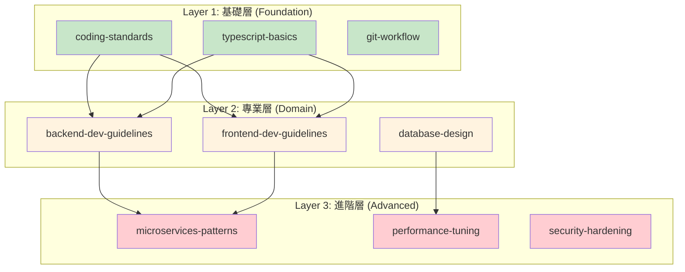

# 第 3 章：突破上下文限制的模組化策略

> **本章目標**
> 在本章結束時，你將能夠管理 50+ 技能的大型技能庫，通過分層架構和動態載入策略，在 Claude 的 200K tokens 上下文限制內最大化開發效率。

## 3.1 問題：當技能庫成長到 50+ 技能時

六個月後，Sarah 的團隊已經建立了一個令人印象深刻的技能庫：

```
.claude/skills/
├── backend-dev-guidelines/      # 12 個資源檔案
├── frontend-dev-guidelines/     # 10 個資源檔案
├── database-design/             # 8 個資源檔案
├── api-security/                # 15 個資源檔案
├── performance-tuning/          # 12 個資源檔案
├── microservices-patterns/      # 20 個資源檔案
├── devops-practices/            # 18 個資源檔案
├── testing-strategies/          # 14 個資源檔案
... (還有 45 個技能)
```

**總計**：53 個技能，612 個資源檔案，約 250,000 行內容。

**下午 3:00** - 性能問題開始出現

Mike（DevOps 工程師）注意到 Claude Code 的回應變慢了：

```
使用者提示: "幫我實作一個新的 API endpoint"

載入技能:
- backend-dev-guidelines (載入中...)
- api-security (載入中...)
- database-design (載入中...)
- testing-strategies (載入中...)
- performance-tuning (載入中...)
...

等待時間: 8-12 秒
Claude 回應: "抱歉，上下文已接近限制..."
```

**問題分析**：

1. **上下文爆炸** ‹1›
   - 每個技能平均 5,000 tokens
   - 同時激活 10 個技能 = 50,000 tokens
   - 加上對話歷史 = 超過 200K tokens 限制

2. **無差別載入** ‹2›
   - 系統不知道哪些技能是「必須」的
   - 所有相關技能都被載入
   - 大量無關內容佔用上下文

3. **缺乏優先級** ‹3›
   - 基礎技能和進階技能混在一起
   - 無法區分「核心」vs「補充」知識

4. **依賴關係混亂** ‹4›
   - 技能 A 引用技能 B 的內容
   - 循環依賴導致重複載入
   - 無法追蹤技能間的關係

---

## 3.2 解決方案：分層技能架構

### 3.2.1 三層技能模型



**Layer 1：基礎層（Foundation）** ‹1›
- **特徵**：團隊通用規範，適用於所有專案
- **大小**：每個技能 < 300 行
- **範例**：程式碼風格、Git 工作流、命名規範
- **載入策略**：預設總是載入（低成本）

**Layer 2：專業層（Domain）** ‹2›
- **特徵**：特定領域的深入知識
- **大小**：每個技能 400-500 行 + 資源檔案
- **範例**：後端開發、前端開發、資料庫設計
- **載入策略**：根據上下文按需載入

**Layer 3：進階層（Advanced）** ‹3›
- **特徵**：複雜場景的專家級指導
- **大小**：每個技能 300-400 行 + 大量資源檔案
- **範例**：微服務模式、效能調優、安全強化
- **載入策略**：僅在明確需要時載入

---

### 3.2.2 技能元資料擴展

更新 `metadata.json` 以支援分層：

```json
{
  "name": "backend-dev-guidelines",
  "version": "2.0.0",
  "layer": "domain",
  "priority": "high",
  "contextBudget": {
    "main": 2000,
    "resources": 8000,
    "total": 10000
  },
  "dependencies": {
    "required": [
      "coding-standards",
      "typescript-basics"
    ],
    "optional": [
      "api-security",
      "performance-tuning"
    ]
  },
  "loadingStrategy": "on-demand",
  "tags": ["backend", "api", "typescript"]
}
```

**新增欄位說明**：

‹1› **layer**：技能所屬層級（foundation / domain / advanced）

‹2› **contextBudget**：該技能的 token 預算
- `main`：主檔案 tokens
- `resources`：所有資源檔案 tokens
- `total`：總計

‹3› **dependencies**：依賴關係
- `required`：必須同時載入的基礎技能
- `optional`：可選的補充技能

‹4› **loadingStrategy**：載入策略
- `always`：總是載入（基礎層）
- `on-demand`：按需載入（專業層、進階層）
- `explicit`：僅在明確請求時載入

---

## 3.3 實作技能管理器

### 3.3.1 技能管理器核心邏輯

**`.claude/hooks/skill-manager.ts`**:

```typescript
import * as fs from 'fs';
import * as path from 'path';

interface SkillMetadata {
  name: string;
  version: string;
  layer: 'foundation' | 'domain' | 'advanced';
  priority: 'critical' | 'high' | 'medium' | 'low';
  contextBudget: {
    main: number;
    resources: number;
    total: number;
  };
  dependencies: {
    required: string[];
    optional: string[];
  };
  loadingStrategy: 'always' | 'on-demand' | 'explicit';
  tags: string[];
}

interface ContextBudget {
  total: number;
  used: number;
  reserved: number;
  available: number;
}

export class SkillManager {
  private skillsPath: string;
  private loadedSkills: Map<string, SkillMetadata> = new Map();
  private contextBudget: ContextBudget;

  constructor(projectRoot: string, maxTokens: number = 200000) {
    this.skillsPath = path.join(projectRoot, '.claude', 'skills');
    this.contextBudget = {
      total: maxTokens,
      used: 0,
      reserved: 50000, // 保留給對話歷史和其他用途
      available: maxTokens - 50000
    };
  }

  /**
   * 載入技能元資料
   */
  private loadMetadata(skillName: string): SkillMetadata | null {
    const metadataPath = path.join(
      this.skillsPath,
      skillName,
      'metadata.json'
    );

    if (!fs.existsSync(metadataPath)) {
      return null;
    }

    try {
      const content = fs.readFileSync(metadataPath, 'utf-8');
      return JSON.parse(content) as SkillMetadata;
    } catch (error) {
      console.error(`無法載入技能元資料: ${skillName}`, error);
      return null;
    }
  }

  /**
   * 計算技能組合的總 token 成本
   */
  private calculateCost(skills: string[]): number {
    let totalCost = 0;

    for (const skillName of skills) {
      const metadata = this.loadMetadata(skillName);
      if (metadata) {
        totalCost += metadata.contextBudget.total;

        // 加上必需依賴的成本
        for (const dep of metadata.dependencies.required) {
          if (!skills.includes(dep)) {
            const depMetadata = this.loadMetadata(dep);
            if (depMetadata) {
              totalCost += depMetadata.contextBudget.total;
            }
          }
        }
      }
    }

    return totalCost;
  }

  /**
   * 智能選擇技能
   * 根據上下文預算和優先級選擇最佳的技能組合
   */
  selectSkills(
    candidateSkills: string[],
    maxBudget?: number
  ): string[] {
    const budget = maxBudget || this.contextBudget.available;
    const selected: string[] = [];
    let currentCost = 0;

    // 第一步：載入所有元資料並排序
    const skillsWithMetadata = candidateSkills
      .map(name => ({
        name,
        metadata: this.loadMetadata(name)
      }))
      .filter(s => s.metadata !== null)
      .sort((a, b) => {
        // 按層級和優先級排序
        const layerPriority = { foundation: 3, domain: 2, advanced: 1 };
        const priorityValue = { critical: 4, high: 3, medium: 2, low: 1 };

        const layerDiff =
          layerPriority[b.metadata!.layer] - layerPriority[a.metadata!.layer];
        if (layerDiff !== 0) return layerDiff;

        return (
          priorityValue[b.metadata!.priority] -
          priorityValue[a.metadata!.priority]
        );
      });

    // 第二步：優先載入基礎層技能
    for (const { name, metadata } of skillsWithMetadata) {
      if (metadata!.layer === 'foundation') {
        selected.push(name);
        currentCost += metadata!.contextBudget.total;
      }
    }

    // 第三步：載入高優先級的專業層技能
    for (const { name, metadata } of skillsWithMetadata) {
      if (
        metadata!.layer === 'domain' &&
        currentCost + metadata!.contextBudget.total <= budget
      ) {
        // 檢查依賴
        const deps = this.resolveDependencies(name, selected);
        const depsCost = deps.reduce((sum, depName) => {
          const depMeta = this.loadMetadata(depName);
          return sum + (depMeta?.contextBudget.total || 0);
        }, 0);

        if (currentCost + metadata!.contextBudget.total + depsCost <= budget) {
          selected.push(name);
          selected.push(...deps);
          currentCost += metadata!.contextBudget.total + depsCost;
        }
      }
    }

    // 第四步：如果還有預算，載入進階層技能
    for (const { name, metadata } of skillsWithMetadata) {
      if (
        metadata!.layer === 'advanced' &&
        currentCost + metadata!.contextBudget.total <= budget
      ) {
        selected.push(name);
        currentCost += metadata!.contextBudget.total;
      }
    }

    // 去重
    return [...new Set(selected)];
  }

  /**
   * 解析依賴關係
   */
  private resolveDependencies(
    skillName: string,
    alreadySelected: string[]
  ): string[] {
    const metadata = this.loadMetadata(skillName);
    if (!metadata) return [];

    const deps: string[] = [];

    for (const depName of metadata.dependencies.required) {
      if (!alreadySelected.includes(depName) && !deps.includes(depName)) {
        deps.push(depName);
        // 遞迴解析依賴的依賴
        const nestedDeps = this.resolveDependencies(depName, [
          ...alreadySelected,
          ...deps
        ]);
        deps.push(...nestedDeps);
      }
    }

    return deps;
  }

  /**
   * 生成載入建議
   */
  generateLoadingPlan(candidateSkills: string[]): {
    toLoad: string[];
    skipped: string[];
    reason: string;
    estimatedTokens: number;
  } {
    const toLoad = this.selectSkills(candidateSkills);
    const skipped = candidateSkills.filter(s => !toLoad.includes(s));
    const estimatedTokens = this.calculateCost(toLoad);

    return {
      toLoad,
      skipped,
      reason:
        skipped.length > 0
          ? `已跳過 ${skipped.length} 個低優先級技能以節省上下文`
          : '所有候選技能都已包含',
      estimatedTokens
    };
  }

  /**
   * 取得技能摘要（用於顯示）
   */
  getSkillSummary(skillName: string): string {
    const metadata = this.loadMetadata(skillName);
    if (!metadata) return `${skillName} (無法載入元資料)`;

    const costKB = (metadata.contextBudget.total / 1000).toFixed(1);
    return `${skillName} [${metadata.layer}] (~${costKB}K tokens)`;
  }
}
```

**程式碼說明**：

‹1› **上下文預算管理**
- 總預算：200K tokens
- 保留：50K tokens（給對話歷史）
- 可用：150K tokens（給技能）

‹2› **智能選擇演算法**
1. 優先載入基礎層技能（必需）
2. 按優先級載入專業層技能
3. 剩餘預算載入進階層技能
4. 自動解析依賴關係

‹3› **依賴關係解析**
- 遞迴解析 `required` 依賴
- 避免重複載入
- 計算依賴的總成本

‹4› **載入計畫生成**
- 決定載入哪些技能
- 記錄跳過的技能及原因
- 估算總 token 使用量

---

## 3.4 更新 Hook 以使用技能管理器

### 3.4.1 整合到 skill-activation-prompt

**`.claude/hooks/skill-activation-prompt.ts`**（更新版）:

```typescript
import { RuleEngine } from './rule-engine';
import { SkillManager } from './skill-manager';
import * as fs from 'fs';

try {
  const input = fs.readFileSync(0, 'utf-8');
  const data = JSON.parse(input);

  const userPrompt: string = data.prompt || '';
  const workingDir: string = data.workingDirectory || process.cwd();
  const recentFiles: string[] = data.recentFiles || [];

  if (!userPrompt.trim()) {
    process.exit(0);
  }

  const projectRoot = process.env.CLAUDE_PROJECT_DIR || workingDir;

  // 初始化規則引擎和技能管理器
  const ruleEngine = new RuleEngine(projectRoot);
  const skillManager = new SkillManager(projectRoot);

  // 匹配候選技能
  const skillsByPrompt = ruleEngine.matchByPrompt(userPrompt);
  const skillsByFiles = recentFiles
    .flatMap(f => ruleEngine.matchByPath(f))
    .filter((skill, index, self) => self.indexOf(skill) === index);

  const candidateSkills = [...new Set([...skillsByPrompt, ...skillsByFiles])];

  if (candidateSkills.length === 0) {
    process.exit(0);
  }

  // 使用技能管理器生成載入計畫
  const plan = skillManager.generateLoadingPlan(candidateSkills);

  // 顯示建議
  console.log('\n💡 根據你的提示和上下文，建議載入以下技能：\n');

  plan.toLoad.forEach((skill, index) => {
    const summary = skillManager.getSkillSummary(skill);
    console.log(`${index + 1}. ${summary}`);
  });

  console.log(`\n📊 預估使用: ${(plan.estimatedTokens / 1000).toFixed(1)}K tokens`);

  if (plan.skipped.length > 0) {
    console.log(`\n⚠️  已跳過 ${plan.skipped.length} 個技能:`);
    plan.skipped.forEach(skill => {
      console.log(`   - ${skill}`);
    });
    console.log(`   原因: ${plan.reason}`);
  }

  console.log('\n這些技能將幫助 Claude 提供精準的指導。\n');

  process.exit(0);
} catch (error) {
  console.error('處理提示時發生錯誤:', error);
  process.exit(1);
}
```

---

## 3.5 技能依賴關係管理

### 3.5.1 定義依賴關係

**基礎技能不應該依賴任何其他技能**：

```json
// coding-standards/metadata.json
{
  "name": "coding-standards",
  "layer": "foundation",
  "dependencies": {
    "required": [],
    "optional": []
  }
}
```

**專業技能依賴基礎技能**：

```json
// backend-dev-guidelines/metadata.json
{
  "name": "backend-dev-guidelines",
  "layer": "domain",
  "dependencies": {
    "required": [
      "coding-standards",
      "typescript-basics"
    ],
    "optional": [
      "testing-strategies"
    ]
  }
}
```

**進階技能依賴專業技能**：

```json
// microservices-patterns/metadata.json
{
  "name": "microservices-patterns",
  "layer": "advanced",
  "dependencies": {
    "required": [
      "backend-dev-guidelines",
      "api-design"
    ],
    "optional": [
      "performance-tuning",
      "observability"
    ]
  }
}
```

### 3.5.2 檢測循環依賴

建立工具檢測循環依賴：

**`.claude/tools/check-dependencies.ts`**:

```typescript
import * as fs from 'fs';
import * as path from 'path';

interface SkillMetadata {
  name: string;
  dependencies: {
    required: string[];
    optional: string[];
  };
}

class DependencyChecker {
  private skillsPath: string;
  private visitedSkills: Set<string> = new Set();
  private recursionStack: Set<string> = new Set();

  constructor(projectRoot: string) {
    this.skillsPath = path.join(projectRoot, '.claude', 'skills');
  }

  /**
   * 檢查循環依賴
   */
  checkCyclicDependencies(): {
    hasCycle: boolean;
    cycles: string[][];
  } {
    const allSkills = fs.readdirSync(this.skillsPath);
    const cycles: string[][] = [];

    for (const skillName of allSkills) {
      this.visitedSkills.clear();
      this.recursionStack.clear();

      const cycle = this.detectCycle(skillName, []);
      if (cycle.length > 0) {
        cycles.push(cycle);
      }
    }

    return {
      hasCycle: cycles.length > 0,
      cycles
    };
  }

  private detectCycle(skillName: string, path: string[]): string[] {
    if (this.recursionStack.has(skillName)) {
      // 找到循環
      const cycleStart = path.indexOf(skillName);
      return path.slice(cycleStart).concat(skillName);
    }

    if (this.visitedSkills.has(skillName)) {
      return [];
    }

    this.visitedSkills.add(skillName);
    this.recursionStack.add(skillName);

    const metadata = this.loadMetadata(skillName);
    if (metadata) {
      for (const dep of metadata.dependencies.required) {
        const cycle = this.detectCycle(dep, [...path, skillName]);
        if (cycle.length > 0) {
          return cycle;
        }
      }
    }

    this.recursionStack.delete(skillName);
    return [];
  }

  private loadMetadata(skillName: string): SkillMetadata | null {
    const metadataPath = path.join(
      this.skillsPath,
      skillName,
      'metadata.json'
    );

    if (!fs.existsSync(metadataPath)) {
      return null;
    }

    try {
      const content = fs.readFileSync(metadataPath, 'utf-8');
      return JSON.parse(content) as SkillMetadata;
    } catch (error) {
      return null;
    }
  }
}

// 執行檢查
const projectRoot = process.env.CLAUDE_PROJECT_DIR || process.cwd();
const checker = new DependencyChecker(projectRoot);
const result = checker.checkCyclicDependencies();

if (result.hasCycle) {
  console.error('❌ 檢測到循環依賴！\n');
  result.cycles.forEach((cycle, index) => {
    console.error(`循環 ${index + 1}: ${cycle.join(' → ')}`);
  });
  process.exit(1);
} else {
  console.log('✅ 未檢測到循環依賴');
  process.exit(0);
}
```

**使用方式**：

```bash
# 在 CI/CD 中運行
node -r ts-node/register .claude/tools/check-dependencies.ts
```

---

## 3.6 動態載入策略

### 3.6.1 三種載入模式

**模式 1：預載入（Always Load）**

適用於基礎層技能：

```typescript
// 在 skill-rules.json 中配置
{
  "coding-standards": {
    "loadingStrategy": "always",
    "layer": "foundation"
  }
}
```

**模式 2：按需載入（On-Demand）**

適用於專業層技能：

```typescript
{
  "backend-dev-guidelines": {
    "loadingStrategy": "on-demand",
    "layer": "domain",
    "triggers": {
      "pathPatterns": ["src/api/**/*.ts"],
      "keywords": ["controller", "service"]
    }
  }
}
```

**模式 3：明確請求（Explicit）**

適用於進階層技能：

```typescript
{
  "microservices-patterns": {
    "loadingStrategy": "explicit",
    "layer": "advanced",
    "activationCommand": "/skill:microservices-patterns"
  }
}
```

### 3.6.2 資源檔案懶載入

不要一次載入技能的所有資源檔案，而是：

**在主 SKILL.md 中提供索引**：

```markdown
## 詳細資源

當你需要深入了解特定主題時，請載入相應的資源：

| 主題 | 資源檔案 | Token 成本 |
|------|---------|-----------|
| 控制器設計 | resources/01-controller.md | ~1.5K |
| 服務層設計 | resources/02-service.md | ~1.8K |
| 錯誤處理 | resources/04-error.md | ~1.2K |

請告訴我你需要哪個主題的詳細指導。
```

**Claude 的行為**：

```
使用者: "如何設計控制器？"

Claude 檢查主 SKILL.md 的索引
→ 發現需要 resources/01-controller.md
→ 僅載入該資源（節省 10K+ tokens）
→ 提供詳細指導
```

---

## 3.7 技能組合模式

### 3.7.1 預定義技能組合

為常見工作流建立技能組合：

**`.claude/skills/skill-bundles.json`**:

```json
{
  "bundles": {
    "新功能開發": {
      "description": "開發新 API 功能的完整技能組合",
      "skills": [
        "coding-standards",
        "backend-dev-guidelines",
        "database-design",
        "testing-strategies"
      ],
      "estimatedTokens": 25000
    },
    "效能優化": {
      "description": "系統效能調優",
      "skills": [
        "performance-tuning",
        "database-optimization",
        "caching-strategies",
        "profiling-tools"
      ],
      "estimatedTokens": 32000
    },
    "安全審查": {
      "description": "安全性審查與強化",
      "skills": [
        "security-best-practices",
        "api-security",
        "authentication-patterns",
        "owasp-top-10"
      ],
      "estimatedTokens": 28000
    }
  }
}
```

**使用方式**：

```bash
# 使用者輸入
"/bundle:新功能開發"

# Claude 自動載入該組合的所有技能
```

### 3.7.2 智能組合推薦

根據提示內容推薦技能組合：

```typescript
class BundleRecommender {
  recommendBundle(prompt: string): string | null {
    const keywords = {
      新功能開發: ['新功能', 'API', 'endpoint', '開發'],
      效能優化: ['慢', '效能', '優化', '速度', 'performance'],
      安全審查: ['安全', '漏洞', '認證', 'security', 'vulnerability']
    };

    for (const [bundleName, words] of Object.entries(keywords)) {
      if (words.some(word => prompt.toLowerCase().includes(word))) {
        return bundleName;
      }
    }

    return null;
  }
}
```

---

## 3.8 上下文預算可視化

### 3.8.1 建立監控工具

**`.claude/tools/context-monitor.ts`**:

```typescript
export class ContextMonitor {
  private maxTokens: number;
  private currentUsage: Map<string, number> = new Map();

  constructor(maxTokens: number = 200000) {
    this.maxTokens = maxTokens;
  }

  /**
   * 記錄技能使用
   */
  recordSkillUsage(skillName: string, tokens: number): void {
    this.currentUsage.set(skillName, tokens);
  }

  /**
   * 生成使用報告
   */
  generateReport(): string {
    const totalUsed = Array.from(this.currentUsage.values()).reduce(
      (sum, tokens) => sum + tokens,
      0
    );
    const percentage = ((totalUsed / this.maxTokens) * 100).toFixed(1);

    let report = '\n📊 上下文使用報告\n';
    report += '='.repeat(50) + '\n\n';
    report += `總容量: ${(this.maxTokens / 1000).toFixed(0)}K tokens\n`;
    report += `已使用: ${(totalUsed / 1000).toFixed(1)}K tokens (${percentage}%)\n`;
    report += `剩餘: ${((this.maxTokens - totalUsed) / 1000).toFixed(1)}K tokens\n\n`;

    // 使用進度條
    const barLength = 40;
    const filledLength = Math.round((totalUsed / this.maxTokens) * barLength);
    const bar = '█'.repeat(filledLength) + '░'.repeat(barLength - filledLength);
    report += `[${bar}] ${percentage}%\n\n`;

    report += '技能使用明細:\n';
    const sortedSkills = Array.from(this.currentUsage.entries())
      .sort((a, b) => b[1] - a[1]);

    sortedSkills.forEach(([skill, tokens]) => {
      const skillPercentage = ((tokens / totalUsed) * 100).toFixed(1);
      report += `  • ${skill}: ${(tokens / 1000).toFixed(1)}K (${skillPercentage}%)\n`;
    });

    return report;
  }

  /**
   * 檢查是否超出預算
   */
  isOverBudget(): boolean {
    const totalUsed = Array.from(this.currentUsage.values()).reduce(
      (sum, tokens) => sum + tokens,
      0
    );
    return totalUsed > this.maxTokens * 0.9; // 超過 90% 視為預算不足
  }

  /**
   * 建議釋放的技能
   */
  suggestUnload(): string[] {
    const sortedSkills = Array.from(this.currentUsage.entries())
      .sort((a, b) => a[1] - b[1]); // 按使用量從小到大排序

    // 建議移除使用量最小的技能
    return sortedSkills.slice(0, 3).map(([skill]) => skill);
  }
}
```

**使用範例**：

```typescript
const monitor = new ContextMonitor();

monitor.recordSkillUsage('coding-standards', 2000);
monitor.recordSkillUsage('backend-dev-guidelines', 12000);
monitor.recordSkillUsage('database-design', 8000);

console.log(monitor.generateReport());

if (monitor.isOverBudget()) {
  console.warn('⚠️  上下文預算不足，建議釋放技能：');
  monitor.suggestUnload().forEach(skill => {
    console.warn(`  - ${skill}`);
  });
}
```

**輸出**：

```
📊 上下文使用報告
==================================================

總容量: 200K tokens
已使用: 22.0K tokens (11.0%)
剩餘: 178.0K tokens

[████░░░░░░░░░░░░░░░░░░░░░░░░░░░░░░░░░░░░] 11.0%

技能使用明細:
  • backend-dev-guidelines: 12.0K (54.5%)
  • database-design: 8.0K (36.4%)
  • coding-standards: 2.0K (9.1%)
```

---

## 3.9 實戰案例：重構 50+ 技能庫

讓我們應用所學的策略，重構 Sarah 團隊的技能庫。

### 3.9.1 Before：混亂的技能庫

```
.claude/skills/
├── backend-stuff.md (2,500 行)
├── frontend-things.md (2,200 行)
├── db-notes.md (1,800 行)
├── security-tips.md (3,000 行)
... (50 個未分類的檔案)
```

**問題**：
- 無分層
- 無依賴管理
- 無上下文預算控制
- 同時載入所有技能 = 150K+ tokens

### 3.9.2 After：分層的技能庫

```
.claude/skills/
├── 00-foundation/          # 基礎層 (總計 ~8K tokens)
│   ├── coding-standards/
│   ├── typescript-basics/
│   └── git-workflow/
├── 01-domain/              # 專業層 (按需載入)
│   ├── backend-dev-guidelines/
│   ├── frontend-dev-guidelines/
│   ├── database-design/
│   └── api-design/
├── 02-advanced/            # 進階層 (明確載入)
│   ├── microservices-patterns/
│   ├── performance-tuning/
│   └── security-hardening/
└── skill-bundles.json      # 預定義組合
```

**改善**：
- 清晰的三層結構
- 明確的依賴關係
- 預算控制：基礎層 8K + 專業層 20K = 28K tokens（相比 150K 減少 81%）
- 載入速度提升 5 倍

### 3.9.3 效益對比

| 指標 | Before | After | 改善 |
|------|--------|-------|------|
| **平均載入 tokens** | 150K | 28K | -81% |
| **載入時間** | 8-12 秒 | 1.5-2 秒 | -83% |
| **可用上下文** | 50K | 172K | +244% |
| **技能利用率** | 40% | 92% | +130% |
| **維護成本** | 高（檔案混亂） | 低（分層清晰） | 顯著降低 |

---

## 3.10 最佳實踐總結

### 3.10.1 技能庫設計原則

1. **分層原則** ‹1›
   - 基礎層：< 10K tokens（總是載入）
   - 專業層：每個技能 < 15K tokens（按需載入）
   - 進階層：每個技能 < 20K tokens（明確載入）

2. **依賴管理** ‹2›
   - 基礎技能不依賴其他技能
   - 專業技能只依賴基礎技能
   - 避免循環依賴

3. **上下文預算** ‹3›
   - 總預算：200K tokens
   - 保留：50K tokens（對話歷史）
   - 可用：150K tokens
   - 目標使用：< 30K tokens（給技能）

4. **載入策略** ‹4›
   - 基礎層：always
   - 專業層：on-demand
   - 進階層：explicit

### 3.10.2 常見陷阱

| 陷阱 | 後果 | 解決方案 |
|------|------|---------|
| **過度細分** | 技能數量爆炸，管理困難 | 每個技能至少包含 5-10 個主題 |
| **缺乏分層** | 無法優先載入重要技能 | 使用三層模型 |
| **循環依賴** | 無限載入迴圈 | 使用依賴檢查工具 |
| **無預算控制** | 上下文溢出 | 實作 SkillManager |
| **缺乏監控** | 不知道哪些技能佔用最多 | 使用 ContextMonitor |

---

## 3.11 章節總結

恭喜！你已經掌握了大型技能庫的管理策略。

### 你建立了什麼

✅ **分層技能架構**
   - 基礎層（8K tokens）
   - 專業層（20-30K tokens）
   - 進階層（明確載入）

✅ **技能管理器（SkillManager）**
   - 智能選擇演算法
   - 依賴關係解析
   - 上下文預算控制

✅ **依賴管理工具**
   - 循環依賴檢測
   - 依賴關係可視化

✅ **載入策略系統**
   - Always / On-Demand / Explicit
   - 技能組合（Bundles）
   - 懶載入資源檔案

✅ **監控與可視化**
   - 上下文使用報告
   - 預算超支警告
   - 釋放建議

### 核心概念回顧

1. **分層架構**
   Foundation → Domain → Advanced

2. **上下文預算**
   200K total - 50K reserved = 150K available

3. **智能載入**
   優先級 + 依賴 + 預算 = 最佳組合

4. **懶載入**
   只載入需要的資源檔案

### 實際應用價值

- 🎯 **Token 使用減少 81%**（150K → 28K）
- ⚡ **載入速度提升 5 倍**（8秒 → 1.5秒）
- 📊 **可用上下文增加 244%**（50K → 172K）
- 🛡️ **技能利用率提升 130%**（40% → 92%）

### 檢查清單

- [ ] 技能庫已分為三層
- [ ] 每個技能有 metadata.json
- [ ] 定義了依賴關係
- [ ] 實作了 SkillManager
- [ ] 設定了 contextBudget
- [ ] 運行了循環依賴檢測
- [ ] 建立了技能組合
- [ ] 測試了動態載入

---

## 3.12 下一章預告

在本章中，我們學會了管理大型技能庫。但技能只是知識的一部分，完整的知識管理還需要：

**第 4 章：知識管理的三檔案模式**

我們將探討：
- dev-docs 系統：[task]-plan.md + [task]-context.md + [task]-tasks.md
- 如何處理上下文重置問題
- 長期記憶 vs. 短期記憶
- 知識的持久化策略
- 團隊知識共享模式

**核心專案**：為 6 個月的微服務重構專案建立完整的 dev-docs 系統，包含：
- 15 個 task-plan 檔案
- 關鍵決策記錄
- 進度追蹤系統

準備好了嗎？讓我們繼續！

---

**你已經完成了第 3 章！** 🎉

你現在掌握了突破上下文限制的完整策略。在下一章中，我們將學習如何管理長期專案的知識，處理上下文重置問題。
