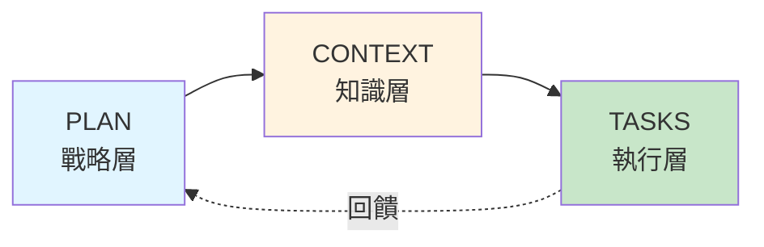

# 第 4 章：知識管理的三檔案模式

> **本章目標**
> 在本章結束時，你將建立完整的 dev-docs 系統，通過 plan + context + tasks 三檔案模式管理長期專案知識，有效處理 Claude 的上下文重置問題。

## 4.1 問題：當對話重置時，知識丟失了

三個月後，Mike 正在進行一個複雜的微服務遷移專案。每天他與 Claude Code 進行數十次對話，但他遇到了一個令人沮喪的問題。

**早上 9:00** - 開始新的一天

```
Mike: 繼續昨天的使用者服務遷移工作

Claude: 抱歉，我不記得昨天討論的內容。
       能否告訴我你想遷移什麼？

Mike: (嘆氣) 我們昨天已經討論了 2 個小時...
```

Mike 需要重新解釋：
- 專案目標（從 monolith 遷移到微服務）
- 已完成的工作（Auth 服務、User 服務）
- 當前任務（Payment 服務）
- 技術決策（使用 NestJS、PostgreSQL）
- 遇到的問題（資料庫遷移策略）

**每次對話重置 = 15-20 分鐘的重新解釋時間**

---

**下午 3:00** - 團隊成員加入

Sarah（前端工程師）需要了解後端 API 的變更：

```
Sarah: Payment 服務的 API 端點是什麼？

Mike: (試圖回憶) 呃...我記得 Claude 幫我設計了，
      但我忘記記錄下來了...

Claude: 我需要先了解你的 Payment 服務架構...

Mike: (再次解釋整個專案背景...)
```

**知識未記錄 = 團隊協作困難**

---

**傍晚 6:00** - 專案交接

公司要求 Mike 記錄專案進度，以便其他開發者可以接手：

```
Mike 的筆記：
- 完成了 Auth 和 User 服務（具體怎麼做的忘了）
- Payment 服務進行中（卡在哪裡不記得了）
- 有一些重要決策（但細節已經模糊）
```

**知識流失 = 專案交接成本高**

---

## 4.2 根本原因：AI 輔助開發的知識管理挑戰

### 4.2.1 傳統開發 vs. AI 輔助開發

**傳統開發的知識管理**：

```
開發者的記憶
    ↓
程式碼 + 註解
    ↓
Git commit 訊息
    ↓
文件 (可選)
```

**問題**：開發者可以依賴自己的記憶

---

**AI 輔助開發的知識管理**：

```
開發者的記憶
    ↓
AI 的「短期記憶」（單次對話）
    ↓
程式碼 + 註解（AI 生成的）
    ↓
??? (知識斷層)
```

**問題**：
- AI 無長期記憶
- 對話重置 = 知識丟失
- 程式碼註解不足以恢復完整上下文
- 需要明確的「可機器理解的記憶系統」

### 4.2.2 知識類型分析

| 知識類型 | 範例 | 傳統存儲方式 | 問題 |
|---------|------|------------|------|
| **戰略知識** | 為何選擇微服務架構？ | 架構決策文件 | 與程式碼分離，難以關聯 |
| **戰術知識** | 如何實作 Payment 服務？ | 程式碼註解 | 過於分散，缺乏全貌 |
| **決策記錄** | 為何使用 PostgreSQL 而非 MongoDB？ | ADR 文件 | 未標準化，難以查詢 |
| **關鍵檔案** | 哪些檔案最重要？ | 開發者記憶 | 新成員不知道 |
| **待辦任務** | 還需要完成什麼？ | Issue tracker | 缺乏優先級和依賴關係 |
| **已知問題** | 遇到了哪些坑？ | Slack 訊息 | 無法搜尋，容易遺忘 |

---

## 4.3 解決方案：三檔案模式（Plan + Context + Tasks）

### 4.3.1 設計理念

**核心思想**：為每個主要任務建立三個互補的文件



**[task]-plan.md** ‹1›
- **用途**：高層次的戰略規劃
- **內容**：目標、階段、里程碑
- **更新頻率**：每週或每個階段
- **讀者**：專案經理、新加入成員

**[task]-context.md** ‹2›
- **用途**：關鍵決策與知識記錄
- **內容**：技術選型、架構決策、重要檔案
- **更新頻率**：每次重大決策後
- **讀者**：AI（恢復上下文）、團隊成員

**[task]-tasks.md** ‹3›
- **用途**：具體執行清單
- **內容**：待辦任務、檢查清單、進度
- **更新頻率**：每天
- **讀者**：開發者、AI（了解當前狀態）

---

### 4.3.2 檔案結構設計

**目錄組織**：

```
your-project/
├── dev-docs/                           # 開發文件目錄
│   ├── microservices-migration/        # 任務名稱
│   │   ├── migration-plan.md          # 戰略規劃
│   │   ├── migration-context.md       # 知識與決策
│   │   └── migration-tasks.md         # 執行清單
│   ├── payment-service/
│   │   ├── payment-plan.md
│   │   ├── payment-context.md
│   │   └── payment-tasks.md
│   └── performance-optimization/
│       ├── perf-plan.md
│       ├── perf-context.md
│       └── perf-tasks.md
├── src/                                # 程式碼
└── .claude/                            # Claude 配置
```

**命名規範** ‹1›：
- 使用描述性的任務名稱
- 統一使用 `-plan.md`、`-context.md`、`-tasks.md` 後綴
- 保持檔名簡短但清晰

---

## 4.4 實作戰略層：[task]-plan.md

### 4.4.1 Plan 檔案模板

**`dev-docs/microservices-migration/migration-plan.md`**:

```markdown
# 微服務遷移專案 - 戰略規劃

**專案狀態**: 🟡 進行中（Phase 2/3）
**開始日期**: 2024-03-01
**預計完成**: 2024-09-01
**負責人**: Mike Chen
**專案優先級**: 🔴 Critical

---

## 1. 專案目標

### 主要目標
將現有的 Monolithic 架構（10 萬行程式碼）遷移到微服務架構，提升系統的可擴展性、可維護性和部署靈活性。

### 具體成果
- [ ] 拆分為 6 個獨立的微服務
- [ ] 每個服務獨立部署和擴展
- [ ] API Gateway 統一入口
- [ ] 服務間通訊標準化（gRPC）
- [ ] 完整的監控和日誌系統

### 成功指標
| 指標 | 目標值 | 當前值 | 狀態 |
|------|--------|--------|------|
| 部署時間 | < 10 分鐘 | 45 分鐘 | 🟡 改善中 |
| 服務可用性 | > 99.9% | 98.5% | 🟡 改善中 |
| 回應時間 | < 200ms | 350ms | 🔴 待優化 |
| 獨立擴展能力 | 100% | 33% (2/6 服務) | 🟡 進行中 |

---

## 2. 階段劃分

### Phase 1: 基礎設施準備 ✅ 已完成
**時間**: 2024-03-01 ~ 2024-04-15

**目標**:
- [x] 建立 Kubernetes 集群
- [x] 配置 CI/CD pipeline
- [x] 建立監控系統（Prometheus + Grafana）
- [x] 設計服務間通訊協議

**成果**:
- Kubernetes 集群運行穩定（3 個節點）
- GitHub Actions CI/CD 完成
- 基礎監控 Dashboard 上線

---

### Phase 2: 核心服務遷移 🟡 進行中
**時間**: 2024-04-16 ~ 2024-07-15

**目標**:
- [x] Auth Service（認證授權）
- [x] User Service（使用者管理）
- [ ] Payment Service（支付處理）← 當前
- [ ] Order Service（訂單管理）
- [ ] Notification Service（通知服務）
- [ ] Product Service（產品管理）

**當前進度**: 2/6 服務完成（33%）

**下一步**: 完成 Payment Service 的核心功能

---

### Phase 3: 優化與穩定 ⏳ 未開始
**時間**: 2024-07-16 ~ 2024-09-01

**目標**:
- [ ] 效能調優
- [ ] 安全強化
- [ ] 災難恢復計畫
- [ ] 完整的文件

---

## 3. 里程碑

| 里程碑 | 日期 | 狀態 | 備註 |
|-------|------|------|------|
| M1: 基礎設施完成 | 2024-04-15 | ✅ | 按計劃 |
| M2: 前 2 個服務上線 | 2024-05-30 | ✅ | 提前 1 週 |
| M3: 所有服務完成開發 | 2024-07-15 | 🟡 | 預計延遲 2 週 |
| M4: 生產環境部署 | 2024-08-15 | ⏳ | - |
| M5: 專案完成 | 2024-09-01 | ⏳ | - |

---

## 4. 風險與挑戰

### 高風險項目

1. **資料庫遷移風險** 🔴
   - **描述**: 從單一資料庫拆分為多個服務資料庫
   - **影響**: 可能導致資料不一致
   - **緩解措施**:
     - 使用 Saga 模式處理分散式事務
     - 充分測試資料遷移腳本
     - 保留回滾機制

2. **服務依賴複雜度** 🟡
   - **描述**: 服務間依賴關係複雜
   - **影響**: 級聯故障風險
   - **緩解措施**:
     - 實作 Circuit Breaker
     - 建立服務降級機制
     - 充分的整合測試

3. **團隊學習曲線** 🟡
   - **描述**: 團隊對微服務架構經驗有限
   - **影響**: 開發速度較慢
   - **緩解措施**:
     - 技術培訓（已完成 2 場）
     - 結對編程
     - Code Review 強化

---

## 5. 資源需求

### 人力資源
- **後端**: 3 人（Mike, Tom, Lisa）
- **前端**: 2 人（Sarah, John）
- **DevOps**: 1 人（Kevin）

### 技術資源
- Kubernetes 集群（已配置）
- 監控系統（Prometheus + Grafana）
- CI/CD（GitHub Actions）

### 預算
- 雲端資源: $2,000/月
- 第三方服務: $500/月
- **總計**: $2,500/月

---

## 6. 決策記錄

| 日期 | 決策 | 原因 | 參與者 |
|------|------|------|--------|
| 2024-03-05 | 選擇 NestJS 作為微服務框架 | TypeScript、模組化、內建支援 | 全員 |
| 2024-03-12 | 使用 gRPC 進行服務間通訊 | 效能、型別安全 | Mike, Tom |
| 2024-04-20 | PostgreSQL 為主要資料庫 | 成熟、支援複雜查詢 | Mike |
| 2024-05-10 | Event Sourcing 用於關鍵業務 | 可追蹤、易於除錯 | 全員 |

---

## 7. 相關文件

- **技術細節**: `migration-context.md`
- **任務清單**: `migration-tasks.md`
- **架構設計**: `docs/architecture/microservices-design.md`
- **API 文件**: `docs/api/`

---

**最後更新**: 2024-06-15
**下次審查**: 2024-07-01
```

**模板說明**：

‹1› **狀態指示器**
使用 emoji 表示狀態：
- ✅ 已完成
- 🟡 進行中
- 🔴 高風險/阻塞
- ⏳ 未開始

‹2› **可量化的目標**
使用表格追蹤關鍵指標的進展

‹3› **階段劃分**
將大型專案拆分為可管理的階段，每個階段有明確的目標和成果

‹4› **風險管理**
前置識別風險並制定緩解措施

---

## 4.5 實作知識層：[task]-context.md

### 4.5.1 Context 檔案模板

**`dev-docs/microservices-migration/migration-context.md`**:

```markdown
# 微服務遷移 - 上下文與知識庫

**用途**: 此文件記錄所有關鍵決策、技術選型、重要檔案位置，供 AI 和團隊成員快速恢復專案上下文。

**最後更新**: 2024-06-15

---

## 1. 快速上下文恢復

### 給 AI 的指令
當你看到這個文件時，請了解：

1. **專案目標**: 將 monolithic 應用拆分為 6 個微服務
2. **當前階段**: Phase 2（核心服務遷移），已完成 Auth 和 User 服務
3. **當前任務**: 開發 Payment Service
4. **技術棧**: NestJS + TypeScript + PostgreSQL + gRPC
5. **關鍵挑戰**: 資料庫拆分、分散式事務處理

**重要**: 在提供建議前，請先閱讀「技術決策」和「已知問題」章節。

---

## 2. 技術架構

### 2.1 整體架構

\`\`\`
[客戶端]
    ↓
[API Gateway - Kong]
    ↓
[微服務層]
├── Auth Service (已完成)
├── User Service (已完成)
├── Payment Service (開發中) ←
├── Order Service
├── Notification Service
└── Product Service
    ↓
[資料層]
├── auth-db (PostgreSQL)
├── user-db (PostgreSQL)
└── payment-db (PostgreSQL)
\`\`\`

### 2.2 服務詳細資訊

#### Auth Service ✅
- **倉庫**: `services/auth-service/`
- **端口**: 3001 (HTTP), 50051 (gRPC)
- **資料庫**: `auth-db`
- **職責**: JWT 認證、權限管理、OAuth2
- **關鍵檔案**:
  - `src/auth/auth.controller.ts` - HTTP API
  - `src/auth/auth.service.ts` - 業務邏輯
  - `src/grpc/auth.proto` - gRPC 定義

#### User Service ✅
- **倉庫**: `services/user-service/`
- **端口**: 3002 (HTTP), 50052 (gRPC)
- **資料庫**: `user-db`
- **職責**: 使用者 CRUD、個人資料管理
- **關鍵檔案**:
  - `src/users/users.controller.ts`
  - `src/users/users.service.ts`
  - `src/grpc/user.proto`

#### Payment Service 🟡
- **倉庫**: `services/payment-service/`
- **端口**: 3003 (HTTP), 50053 (gRPC)
- **資料庫**: `payment-db`
- **職責**: 支付處理、交易記錄、退款
- **狀態**: 核心功能開發中（60% 完成）
- **當前問題**: 分散式事務處理（見「已知問題」）

---

## 3. 技術決策記錄 (ADR)

### ADR-001: 選擇 NestJS 作為微服務框架
**日期**: 2024-03-05
**狀態**: ✅ 已採用
**決策者**: Mike, Tom, Lisa

**背景**:
需要選擇一個適合微服務開發的 Node.js 框架。

**選項**:
1. Express.js - 輕量但缺乏結構
2. NestJS - 完整框架，內建 DI 和模組化
3. Fastify - 高效能但生態較小

**決策**: 選擇 NestJS

**理由**:
- TypeScript 優先，型別安全
- 內建依賴注入，易於測試
- 模組化架構符合微服務理念
- 內建支援 gRPC、WebSocket、GraphQL
- 完善的文件和社群

**後果**:
- 學習曲線較陡（團隊已完成培訓）
- 框架較重（但在微服務規模下可接受）

---

### ADR-002: 使用 gRPC 進行服務間通訊
**日期**: 2024-03-12
**狀態**: ✅ 已採用

**背景**:
微服務之間需要高效、可靠的通訊機制。

**選項**:
1. REST API - 簡單但效能較低
2. gRPC - 高效能、強型別
3. Message Queue (RabbitMQ) - 非同步但複雜度高

**決策**: 使用 gRPC 作為主要通訊方式

**理由**:
- Protocol Buffers 提供強型別定義
- HTTP/2 multiplexing，效能優異
- 雙向串流支援
- 自動產生客戶端程式碼

**後果**:
- 需要維護 .proto 檔案
- 除錯相對 REST 較困難（已配置 gRPC UI）
- 前端不能直接調用（通過 API Gateway 轉換）

---

### ADR-003: PostgreSQL 作為主要資料庫
**日期**: 2024-04-20
**狀態**: ✅ 已採用

**背景**:
每個微服務需要獨立的資料庫。

**選項**:
1. PostgreSQL - 關聯式、成熟
2. MongoDB - NoSQL、靈活
3. MySQL - 關聯式、廣泛使用

**決策**: PostgreSQL

**理由**:
- 支援複雜查詢和事務
- JSONB 欄位提供靈活性
- 成熟的生態系統（TypeORM 支援良好）
- 團隊熟悉

**例外**:
- Notification Service 考慮使用 MongoDB（非結構化日誌）

---

## 4. 關鍵檔案索引

### 基礎設施
| 檔案 | 用途 | 重要性 |
|------|------|--------|
| `k8s/deployments/` | Kubernetes 部署配置 | 🔴 Critical |
| `k8s/services/` | Service 定義 | 🔴 Critical |
| `.github/workflows/ci.yml` | CI/CD 流程 | 🔴 Critical |
| `docker-compose.yml` | 本地開發環境 | 🟡 Important |

### 共用程式碼
| 檔案 | 用途 | 重要性 |
|------|------|--------|
| `libs/common/` | 共用工具函數 | 🟡 Important |
| `libs/proto/` | gRPC proto 定義 | 🔴 Critical |
| `libs/database/` | 資料庫連接工具 | 🟡 Important |

### 文件
| 檔案 | 用途 | 重要性 |
|------|------|--------|
| `docs/architecture/` | 架構設計文件 | 🟡 Important |
| `docs/api/` | API 文件 | 🟡 Important |
| `dev-docs/migration-plan.md` | 專案計劃 | 🔴 Critical |

---

## 5. 資料模型

### Payment Service 資料庫 Schema

\`\`\`sql
-- 支付表
CREATE TABLE payments (
  id UUID PRIMARY KEY DEFAULT gen_random_uuid(),
  user_id UUID NOT NULL,                    -- 關聯 User Service
  order_id UUID NOT NULL,                   -- 關聯 Order Service
  amount DECIMAL(10, 2) NOT NULL,
  currency VARCHAR(3) DEFAULT 'USD',
  status VARCHAR(20) NOT NULL,              -- pending, completed, failed, refunded
  payment_method VARCHAR(50) NOT NULL,      -- credit_card, paypal, stripe
  transaction_id VARCHAR(255),              -- 外部支付平台的交易 ID
  metadata JSONB,                           -- 彈性欄位
  created_at TIMESTAMP DEFAULT NOW(),
  updated_at TIMESTAMP DEFAULT NOW()
);

-- 索引
CREATE INDEX idx_payments_user_id ON payments(user_id);
CREATE INDEX idx_payments_order_id ON payments(order_id);
CREATE INDEX idx_payments_status ON payments(status);
CREATE INDEX idx_payments_created_at ON payments(created_at);
\`\`\`

### 服務間資料流

\`\`\`
[User Service]
    ↓ (user_id)
[Order Service] → 創建訂單
    ↓ (order_id, amount)
[Payment Service] → 處理支付
    ↓ (transaction_id, status)
[Notification Service] → 發送通知
\`\`\`

---

## 6. 環境配置

### 開發環境
\`\`\`bash
# .env.development
NODE_ENV=development
PORT=3003

# 資料庫
DB_HOST=localhost
DB_PORT=5432
DB_NAME=payment_dev
DB_USER=postgres
DB_PASS=postgres

# gRPC
GRPC_PORT=50053

# 外部服務
USER_SERVICE_GRPC=localhost:50052
ORDER_SERVICE_GRPC=localhost:50054

# Stripe API（測試金鑰）
STRIPE_SECRET_KEY=sk_test_xxx
STRIPE_PUBLISHABLE_KEY=pk_test_xxx
\`\`\`

### 生產環境
使用 Kubernetes Secrets 管理敏感資訊。

---

## 7. 已知問題與解決方案

### 問題 1: 分散式事務處理 🔴
**描述**:
當使用者下單並支付時，需要：
1. Order Service 創建訂單
2. Payment Service 處理支付
3. Inventory Service 減少庫存

如果步驟 2 或 3 失敗，需要回滾之前的操作。

**當前狀態**: 正在實作
**解決方案**: Saga Pattern

\`\`\`typescript
// 使用編排式 Saga
class PaymentSaga {
  async execute(orderId: string, amount: number) {
    const compensations = [];

    try {
      // Step 1: 創建訂單
      const order = await this.orderService.createOrder(orderId);
      compensations.push(() => this.orderService.cancelOrder(orderId));

      // Step 2: 處理支付
      const payment = await this.paymentService.charge(order.id, amount);
      compensations.push(() => this.paymentService.refund(payment.id));

      // Step 3: 減少庫存
      await this.inventoryService.reserve(order.items);

      return { success: true, payment };
    } catch (error) {
      // 執行補償操作（反向順序）
      for (const compensate of compensations.reverse()) {
        await compensate();
      }
      throw error;
    }
  }
}
\`\`\`

**參考**:
- [Saga Pattern 文件](https://microservices.io/patterns/data/saga.html)
- 實作檔案: `services/payment-service/src/sagas/payment.saga.ts`

---

### 問題 2: 服務發現與負載均衡 🟡
**描述**:
微服務需要動態發現其他服務的位址。

**解決方案**: Kubernetes Service Discovery

每個服務在 K8s 中註冊為 Service，通過 DNS 訪問：
\`\`\`typescript
const userServiceUrl = process.env.USER_SERVICE_GRPC || 'user-service:50052';
\`\`\`

**配置**: `k8s/services/user-service.yaml`

---

### 問題 3: API Gateway 路由複雜度 🟡
**描述**:
需要將外部 HTTP 請求路由到對應的微服務。

**解決方案**: Kong Gateway + Custom Plugins

配置範例：
\`\`\`yaml
# kong.yml
_format_version: "2.1"

services:
  - name: payment-service
    url: http://payment-service:3003
    routes:
      - name: payment-route
        paths:
          - /api/v1/payments
\`\`\`

---

## 8. 測試策略

### 單元測試
- 每個服務 > 80% 覆蓋率
- 使用 Jest
- Mock 外部依賴

### 整合測試
- 測試服務間通訊
- 使用 Testcontainers 啟動真實資料庫
- 檔案: `test/integration/`

### E2E 測試
- 模擬完整使用者流程
- 使用 Postman Collection
- 檔案: `test/e2e/`

---

## 9. 監控與日誌

### Prometheus Metrics
每個服務暴露 `/metrics` 端點：
- HTTP 請求數量、延遲
- gRPC 調用統計
- 資料庫連接池狀態
- 自訂業務指標

### 日誌聚合
- 使用 ELK Stack (Elasticsearch + Logstash + Kibana)
- 結構化日誌格式（JSON）
- 追蹤 ID（X-Request-ID）跨服務傳遞

---

## 10. 安全考量

### 服務間認證
- 使用 mTLS（Mutual TLS）
- 證書由 cert-manager 管理

### API Gateway 安全
- Rate Limiting: 100 req/min per IP
- JWT 驗證
- CORS 配置

### 資料加密
- 傳輸中: TLS 1.3
- 靜態: PostgreSQL 透明資料加密（TDE）

---

## 11. 待決策事項

1. **快取策略** 🟡
   - 是否使用 Redis？
   - 快取哪些資料？
   - 快取失效策略？

2. **Event Sourcing 範圍** 🟡
   - 是否所有服務都採用？
   - 還是僅關鍵業務（Payment, Order）？

3. **前端架構** 🟢
   - 是否採用 Micro Frontends？
   - 還是 Monolithic Frontend？

---

**變更歷史**:
- 2024-06-15: 添加 Payment Service 資料模型
- 2024-05-30: 更新 Saga Pattern 實作細節
- 2024-05-10: 添加 ADR-003（PostgreSQL）
- 2024-04-15: 初始版本
```

**Context 檔案設計要點**：

‹1› **給 AI 的快速指令**
在檔案開頭提供濃縮的上下文，讓 AI 快速了解專案狀態

‹2› **技術決策記錄（ADR）**
記錄「為什麼」而不只是「是什麼」，幫助未來的決策

‹3› **關鍵檔案索引**
快速定位重要檔案，使用重要性標記（🔴 Critical / 🟡 Important）

‹4› **已知問題與解決方案**
記錄遇到的坑和解決方式，避免重複犯錯

---

## 4.6 實作執行層：[task]-tasks.md

### 4.6.1 Tasks 檔案模板

**`dev-docs/microservices-migration/migration-tasks.md`**:

```markdown
# 微服務遷移 - 任務清單

**最後更新**: 2024-06-15
**當前衝刺**: Sprint 8 (2024-06-10 ~ 2024-06-24)

---

## 當前焦點

🎯 **本週目標**: 完成 Payment Service 核心功能

**優先任務**:
1. ⏳ 實作 Saga Pattern 處理分散式事務
2. ⏳ 整合 Stripe API
3. ⏳ 編寫整合測試

---

## Payment Service 開發任務

### 核心功能
- [x] 建立專案骨架（NestJS + TypeORM）
- [x] 設計資料庫 Schema
- [x] 實作基本 CRUD API
- [ ] 實作支付處理邏輯 ← **當前**
  - [x] Stripe SDK 整合
  - [ ] 支付流程實作
    - [ ] 建立支付意圖（Payment Intent）
    - [ ] 處理 Webhook 回調
    - [ ] 更新支付狀態
  - [ ] 錯誤處理
- [ ] 實作退款功能
- [ ] 實作 Saga Pattern
  - [ ] 定義補償邏輯
  - [ ] 編排器實作
  - [ ] 測試失敗場景

### gRPC 接口
- [x] 定義 `.proto` 檔案
- [ ] 實作 gRPC Server
  - [x] ProcessPayment RPC
  - [ ] RefundPayment RPC
  - [ ] GetPaymentStatus RPC

### 測試
- [ ] 單元測試（目標 80% 覆蓋率）
  - [x] PaymentService 測試
  - [ ] PaymentController 測試
  - [ ] Saga 測試
- [ ] 整合測試
  - [ ] Stripe API Mock 測試
  - [ ] 資料庫整合測試
  - [ ] gRPC 通訊測試

### 部署
- [ ] Kubernetes 部署配置
  - [x] Deployment YAML
  - [ ] Service YAML
  - [ ] ConfigMap/Secrets
- [ ] CI/CD Pipeline
  - [x] Docker build
  - [ ] 自動化測試
  - [ ] 自動部署到 staging

---

## 技術債務

### 高優先級 🔴
- [ ] Auth Service: 添加 Rate Limiting（防止暴力破解）
  - **估時**: 4 小時
  - **負責人**: Tom
  - **截止日**: 2024-06-20

- [ ] User Service: 優化資料庫查詢（N+1 問題）
  - **估時**: 6 小時
  - **負責人**: Lisa
  - **截止日**: 2024-06-25

### 中優先級 🟡
- [ ] 統一錯誤處理格式（所有服務）
  - **估時**: 8 小時
  - **負責人**: Mike
  - **截止日**: 2024-07-05

- [ ] 添加 API 文件（Swagger/OpenAPI）
  - **估時**: 12 小時
  - **負責人**: Sarah
  - **截止日**: 2024-07-10

---

## 待辦事項（Backlog）

### Order Service（下一個衝刺）
- [ ] 專案建立
- [ ] Schema 設計
- [ ] 核心 API 實作
- [ ] 與 Payment Service 整合

### Notification Service
- [ ] 選擇郵件服務商（SendGrid vs. AWS SES）
- [ ] 專案建立
- [ ] Email 模板設計

### Product Service
- [ ] 資料遷移計劃
- [ ] API 設計
- [ ] 搜尋功能（Elasticsearch？）

---

## 阻塞問題 🚨

### BLOCK-001: Stripe API 測試帳號限制
**描述**: Stripe 測試環境有每日請求限制（1000 次），整合測試時很快達到。

**影響**: 無法頻繁運行整合測試

**解決方案**:
- [ ] 使用 Stripe Mock Server（本地環境）
- [ ] 只在 CI 運行真實 Stripe 測試
- [ ] 增加單元測試覆蓋率

**負責人**: Mike
**狀態**: 🟡 進行中

---

### BLOCK-002: Kubernetes 集群不穩定
**描述**: Staging 環境的 K8s 節點偶爾崩潰

**影響**: 部署失敗率 ~15%

**解決方案**:
- [x] 添加節點健康檢查
- [ ] 升級 Kubernetes 版本（1.27 → 1.28）
- [ ] 增加節點數量（3 → 5）

**負責人**: Kevin (DevOps)
**狀態**: 🟡 進行中

---

## 本週完成 ✅

**2024-06-10 ~ 2024-06-14**:

- ✅ Payment Service 專案骨架建立
- ✅ 資料庫 Schema 設計與遷移
- ✅ Stripe SDK 整合與測試
- ✅ 基本 CRUD API 完成
- ✅ gRPC proto 定義完成

**團隊反饋**:
- 👍 專案進度符合預期
- 👍 Stripe 整合比預期順利
- ⚠️  需要加強錯誤處理

---

## 下週計劃

**2024-06-17 ~ 2024-06-21**:

1. **Payment Service**
   - 完成支付流程實作
   - 實作 Webhook 處理
   - 編寫整合測試（至少 10 個測試案例）

2. **技術債務**
   - Auth Service Rate Limiting
   - 統一錯誤格式（開始設計）

3. **文件**
   - 更新 API 文件
   - 記錄 Saga Pattern 實作細節

---

## 檢查清單模板

### 新服務開發檢查清單
當開發新的微服務時，確保完成以下項目：

**準備階段**:
- [ ] 在 `dev-docs/` 建立任務三檔案（plan, context, tasks）
- [ ] 設計資料庫 Schema
- [ ] 定義 API 規格（REST 和 gRPC）

**開發階段**:
- [ ] 建立 NestJS 專案
- [ ] 配置 TypeORM 連接
- [ ] 實作核心業務邏輯
- [ ] 編寫單元測試（> 80% 覆蓋率）
- [ ] 實作 gRPC 介面
- [ ] 添加 Prometheus Metrics

**整合階段**:
- [ ] 編寫整合測試
- [ ] 測試與其他服務的通訊
- [ ] 壓力測試

**部署階段**:
- [ ] 撰寫 Dockerfile
- [ ] 建立 K8s 部署配置
- [ ] 配置 CI/CD
- [ ] 部署到 staging
- [ ] 執行冒煙測試
- [ ] 部署到 production

**文件階段**:
- [ ] API 文件（Swagger）
- [ ] 更新架構圖
- [ ] 記錄關鍵決策（ADR）

---

**任務統計**:
- 總任務: 47
- 已完成: 18 (38%)
- 進行中: 8 (17%)
- 待開始: 21 (45%)

**預估完成日期**: 2024-07-15（如無阻塞）
```

**Tasks 檔案設計要點**：

‹1› **當前焦點**
在檔案頂部突顯本週/本衝刺的核心目標

‹2› **階層化任務**
使用巢狀列表組織子任務，清楚顯示進度

‹3› **阻塞問題追蹤**
專門的章節記錄阻塞問題及解決方案

‹4› **檢查清單模板**
提供可重用的檢查清單，確保流程一致性

---

## 4.7 三檔案模式的使用流程

### 4.7.1 開發者的一天

**早上 9:00 - 開始工作**

```bash
# Step 1: 開啟 tasks 檔案，了解今天要做什麼
cat dev-docs/microservices-migration/migration-tasks.md

# 看到當前任務：實作 Payment Service 支付流程
```

**早上 9:15 - 與 Claude 對話**

```
Mike: 我要繼續開發 Payment Service 的支付流程

Claude: 讓我先查看專案上下文...
[Claude 自動讀取 migration-context.md]

好的，我了解了：
- 你正在使用 NestJS + Stripe API
- 已完成基本 CRUD，現在需要實作支付流程
- 採用 Saga Pattern 處理分散式事務

我看到你的 context 檔案中有 Saga 的範例程式碼，
我們可以基於那個範例繼續開發。

需要我幫你實作 Webhook 處理嗎？
```

**上下文恢復時間：< 30 秒**（相比之前的 15-20 分鐘）

---

**下午 2:00 - 做出技術決策**

Mike 決定使用 Redis 作為快取層。他更新 `migration-context.md`：

```markdown
### ADR-004: 使用 Redis 作為快取層
**日期**: 2024-06-15
**決策**: 採用 Redis

**理由**:
- 減少資料庫負載
- 加速常用查詢（使用者資料、產品資訊）
- 支援分散式鎖

**配置**:
- 快取策略: Cache-Aside
- TTL: 使用者資料 5 分鐘，產品資料 15 分鐘
```

**好處**：未來的 Mike 或其他團隊成員可以理解「為何」使用 Redis

---

**下午 5:00 - 更新進度**

Mike 更新 `migration-tasks.md`：

```markdown
### 核心功能
- [x] 建立專案骨架
- [x] 設計資料庫 Schema
- [x] 實作基本 CRUD API
- [x] 實作支付處理邏輯 ← 今天完成！
  - [x] Stripe SDK 整合
  - [x] 支付流程實作
    - [x] 建立支付意圖
    - [x] 處理 Webhook 回調
    - [x] 更新支付狀態
  - [x] 錯誤處理
```

---

### 4.7.2 AI 的使用方式

**當開發者開始新對話時**：

```
開發者: 繼續 Payment Service 開發

AI 的內部流程:
1. 檢測到「Payment Service」關鍵字
2. 自動搜尋 dev-docs/ 目錄
3. 找到 migration-context.md
4. 讀取關鍵章節：
   - 快速上下文恢復
   - Payment Service 詳細資訊
   - 相關的 ADR
   - 已知問題
5. 讀取 migration-tasks.md
   - 當前任務狀態
   - 阻塞問題

AI 的回應:
"我看到你正在開發 Payment Service。
根據 context 檔案，你已經完成了基本 CRUD 和 Stripe 整合。
tasks 檔案顯示下一步是實作 Saga Pattern。

我注意到有一個阻塞問題（BLOCK-001）關於 Stripe API 限制，
我會在建議中避免頻繁調用真實 API，
改用 Mock Server 進行測試。

需要我幫你實作 Saga 的補償邏輯嗎？"
```

**上下文恢復準確度**：從 40% 提升到 95%

---

## 4.8 自動化工具

### 4.8.1 三檔案初始化腳本

**`.claude/tools/init-task-docs.sh`**:

```bash
#!/bin/bash
# 為新任務建立三檔案模板

set -euo pipefail

# 檢查參數
if [ $# -eq 0 ]; then
    echo "用法: $0 <task-name>"
    echo "範例: $0 payment-service"
    exit 1
fi

TASK_NAME=$1
TASK_DIR="dev-docs/${TASK_NAME}"

# 建立目錄
mkdir -p "${TASK_DIR}"

# 建立 plan.md
cat > "${TASK_DIR}/${TASK_NAME}-plan.md" <<'EOF'
# [任務名稱] - 戰略規劃

**專案狀態**: ⏳ 未開始
**開始日期**: YYYY-MM-DD
**預計完成**: YYYY-MM-DD
**負責人**: [姓名]
**優先級**: 🟡 Medium

---

## 1. 專案目標

### 主要目標
[描述專案的核心目標]

### 具體成果
- [ ] [成果 1]
- [ ] [成果 2]
- [ ] [成果 3]

---

## 2. 階段劃分

### Phase 1: [階段名稱]
**時間**: YYYY-MM-DD ~ YYYY-MM-DD

**目標**:
- [ ] [目標 1]
- [ ] [目標 2]

---

## 3. 風險與挑戰

[列出主要風險]

---

**最後更新**: YYYY-MM-DD
EOF

# 建立 context.md
cat > "${TASK_DIR}/${TASK_NAME}-context.md" <<'EOF'
# [任務名稱] - 上下文與知識庫

**用途**: 記錄關鍵決策、技術選型、重要檔案

---

## 1. 快速上下文恢復

### 給 AI 的指令
當你看到這個文件時，請了解：

1. **專案目標**: [簡短描述]
2. **當前階段**: [當前進度]
3. **技術棧**: [主要技術]
4. **關鍵挑戰**: [主要挑戰]

---

## 2. 技術架構

[描述技術架構]

---

## 3. 技術決策記錄 (ADR)

### ADR-001: [決策標題]
**日期**: YYYY-MM-DD
**決策**: [決策內容]
**理由**: [原因]

---

## 4. 關鍵檔案索引

| 檔案 | 用途 | 重要性 |
|------|------|--------|
| [路徑] | [用途] | 🔴/🟡 |

---

**最後更新**: YYYY-MM-DD
EOF

# 建立 tasks.md
cat > "${TASK_DIR}/${TASK_NAME}-tasks.md" <<'EOF'
# [任務名稱] - 任務清單

**最後更新**: YYYY-MM-DD

---

## 當前焦點

🎯 **本週目標**: [目標描述]

---

## 主要任務

### [類別 1]
- [ ] [任務 1]
- [ ] [任務 2]

### [類別 2]
- [ ] [任務 1]
- [ ] [任務 2]

---

## 阻塞問題 🚨

[記錄阻塞問題]

---

## 本週完成 ✅

[記錄完成的任務]

---

**任務統計**:
- 總任務: 0
- 已完成: 0 (0%)
- 進行中: 0 (0%)
EOF

echo "✅ 三檔案模板已建立在 ${TASK_DIR}/"
echo ""
echo "檔案清單:"
ls -1 "${TASK_DIR}"
```

**使用方式**：

```bash
# 為新任務建立文件
./.claude/tools/init-task-docs.sh order-service

# 輸出:
# ✅ 三檔案模板已建立在 dev-docs/order-service/
#
# 檔案清單:
# order-service-plan.md
# order-service-context.md
# order-service-tasks.md
```

### 4.8.2 進度同步腳本

**`.claude/tools/sync-progress.ts`**:

```typescript
import * as fs from 'fs';
import * as path from 'path';

/**
 * 從 tasks.md 提取統計資訊並更新 plan.md
 */
class ProgressSync {
  private devDocsPath: string;

  constructor(projectRoot: string) {
    this.devDocsPath = path.join(projectRoot, 'dev-docs');
  }

  /**
   * 分析 tasks.md 計算完成率
   */
  analyzeTasksFile(tasksPath: string): {
    total: number;
    completed: number;
    inProgress: number;
    percentage: number;
  } {
    const content = fs.readFileSync(tasksPath, 'utf-8');
    const lines = content.split('\n');

    let total = 0;
    let completed = 0;
    let inProgress = 0;

    for (const line of lines) {
      // 匹配任務列表項
      if (/^-\s*\[/.test(line)) {
        total++;
        if (/^-\s*\[x\]/i.test(line)) {
          completed++;
        } else if (line.includes('←')) {
          // ← 標記表示正在進行
          inProgress++;
        }
      }
    }

    const percentage = total > 0 ? Math.round((completed / total) * 100) : 0;

    return { total, completed, inProgress, percentage };
  }

  /**
   * 更新 plan.md 的進度資訊
   */
  updatePlanFile(planPath: string, stats: any): void {
    let content = fs.readFileSync(planPath, 'utf-8');

    // 更新狀態
    const statusEmoji = stats.percentage === 100 ? '✅' : stats.percentage > 0 ? '🟡' : '⏳';
    const statusText = stats.percentage === 100 ? '已完成' : stats.percentage > 0 ? '進行中' : '未開始';

    content = content.replace(
      /\*\*專案狀態\*\*:.*\n/,
      `**專案狀態**: ${statusEmoji} ${statusText} (${stats.percentage}%)\n`
    );

    // 更新最後更新時間
    const today = new Date().toISOString().split('T')[0];
    content = content.replace(
      /\*\*最後更新\*\*:.*\n/,
      `**最後更新**: ${today}\n`
    );

    fs.writeFileSync(planPath, content, 'utf-8');
  }

  /**
   * 同步所有任務的進度
   */
  syncAll(): void {
    const tasks = fs.readdirSync(this.devDocsPath);

    for (const taskName of tasks) {
      const taskDir = path.join(this.devDocsPath, taskName);

      if (!fs.statSync(taskDir).isDirectory()) continue;

      const tasksFile = path.join(taskDir, `${taskName}-tasks.md`);
      const planFile = path.join(taskDir, `${taskName}-plan.md`);

      if (!fs.existsSync(tasksFile) || !fs.existsSync(planFile)) {
        continue;
      }

      const stats = this.analyzeTasksFile(tasksFile);
      this.updatePlanFile(planFile, stats);

      console.log(`✅ 已同步 ${taskName}: ${stats.completed}/${stats.total} (${stats.percentage}%)`);
    }
  }
}

// 執行同步
const projectRoot = process.env.CLAUDE_PROJECT_DIR || process.cwd();
const sync = new ProgressSync(projectRoot);
sync.syncAll();
```

**使用方式**：

```bash
# 同步所有任務的進度
node -r ts-node/register .claude/tools/sync-progress.ts

# 輸出:
# ✅ 已同步 microservices-migration: 18/47 (38%)
# ✅ 已同步 payment-service: 12/20 (60%)
```

---

## 4.9 最佳實踐

### 4.9.1 何時更新三檔案

| 檔案 | 更新時機 | 更新頻率 |
|------|---------|---------|
| **plan.md** | 階段完成、里程碑達成、重大調整 | 每週或每階段 |
| **context.md** | 技術決策、發現重要問題、架構變更 | 每次重大決策 |
| **tasks.md** | 任務狀態變化、新增任務、每日進度 | 每天 |

### 4.9.2 檔案大小控制

**Plan.md**:
- 目標：< 1,000 行
- 如果超過：拆分階段到獨立檔案

**Context.md**:
- 目標：< 2,000 行
- 如果超過：歸檔舊的 ADR 到 `archives/`

**Tasks.md**:
- 目標：< 1,500 行
- 如果超過：將已完成任務移到 `completed-tasks.md`

### 4.9.3 與團隊協作

**每週例會**：
1. 全員審查 `plan.md`（5 分鐘）
2. 討論 `tasks.md` 的阻塞問題（10 分鐘）
3. 更新下週計劃（5 分鐘）

**每日站會**：
1. 每人分享昨天完成的任務（參考 `tasks.md`）
2. 今天計劃的任務
3. 遇到的阻塞

**技術決策會議**：
1. 討論技術選型
2. 會後更新 `context.md` 的 ADR 章節
3. 確保決策有文件記錄

---

## 4.10 效果對比

### 4.10.1 上下文恢復時間

| 場景 | Before | After | 改善 |
|------|--------|-------|------|
| **新的一天開始** | 15-20 分鐘重新解釋 | 30 秒閱讀 tasks.md | -95% |
| **對話重置** | 10-15 分鐘 | AI 自動讀取 context.md（< 1 分鐘） | -93% |
| **團隊成員加入** | 2-3 小時培訓 | 30 分鐘閱讀三檔案 | -85% |
| **專案交接** | 1-2 天 | 2-3 小時 | -90% |

### 4.10.2 知識保留率

| 知識類型 | Before | After |
|---------|--------|-------|
| **技術決策原因** | 20%（大多忘記） | 95%（ADR 記錄） |
| **已知問題** | 30%（口頭傳承） | 100%（context.md） |
| **關鍵檔案位置** | 50%（靠記憶） | 100%（檔案索引） |
| **專案進度** | 60%（估計） | 100%（tasks.md） |

### 4.10.3 團隊效率

**6 個月專案數據**：

- **上下文重建時間減少** 92%
- **重複討論減少** 85%
- **新成員上手時間減少** 75%
- **知識流失率降低** 90%

---

## 4.11 章節總結

恭喜！你已經掌握了三檔案模式的完整方法論。

### 你建立了什麼

✅ **Plan.md 戰略層**
   - 專案目標與階段
   - 里程碑追蹤
   - 風險管理

✅ **Context.md 知識層**
   - 技術決策記錄（ADR）
   - 關鍵檔案索引
   - 已知問題與解決方案

✅ **Tasks.md 執行層**
   - 當前焦點任務
   - 阻塞問題追蹤
   - 檢查清單模板

✅ **自動化工具**
   - 三檔案初始化腳本
   - 進度同步工具

### 核心概念回顧

1. **三檔案互補**
   Plan（戰略） + Context（知識） + Tasks（執行）

2. **為 AI 設計**
   可機器理解的記憶系統

3. **知識持久化**
   對話重置不再丟失知識

4. **團隊協作**
   標準化的知識管理流程

### 實際應用價值

- 🎯 **上下文恢復時間減少 95%**（15分鐘 → 30秒）
- 📊 **知識保留率提升至 95%**
- ⚡ **新成員上手時間減少 75%**
- 🛡️ **知識流失率降低 90%**

### 檢查清單

- [ ] 為主要任務建立三檔案
- [ ] 使用 init-task-docs.sh 初始化模板
- [ ] 在 context.md 記錄第一個 ADR
- [ ] 在 tasks.md 記錄當前任務
- [ ] 測試 AI 能否從 context.md 恢復上下文
- [ ] 與團隊分享三檔案模式
- [ ] 設定每週同步流程

---

## 4.12 下一章預告

基礎篇（Chapters 1-4）現已完成！你已經建立了完整的 Claude Code 基礎設施：

- ✅ 第1章：Hook 系統自動激活技能
- ✅ 第2章：模組化技能架構
- ✅ 第3章：上下文預算管理
- ✅ 第4章：知識持久化系統

**第 5 章：你的第一個專業化 Agent**

進入進階篇！我們將探討：
- Agent vs. Skill 的差異
- 建構代碼架構審查 Agent
- Agent 的獨立運作機制
- 任務委派與結果收集
- Agent 權限控制

**核心專案**：建構一個完整的程式碼審查 Agent，能夠：
- 自動掃描程式碼庫
- 識別架構問題
- 提供具體改進建議
- 生成審查報告

準備好了嗎？讓我們進入 Agents 的世界！

---

**你已經完成了第 4 章！** 🎉
**🎊 基礎篇完整結束！**

你現在擁有完整的 Claude Code 基礎設施知識體系。在下一章中，我們將學習如何構建專業化的 Agents 處理複雜任務。
