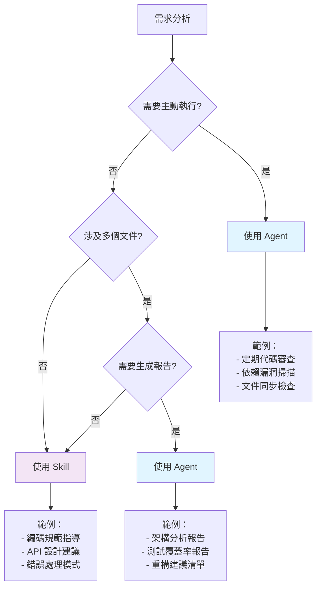
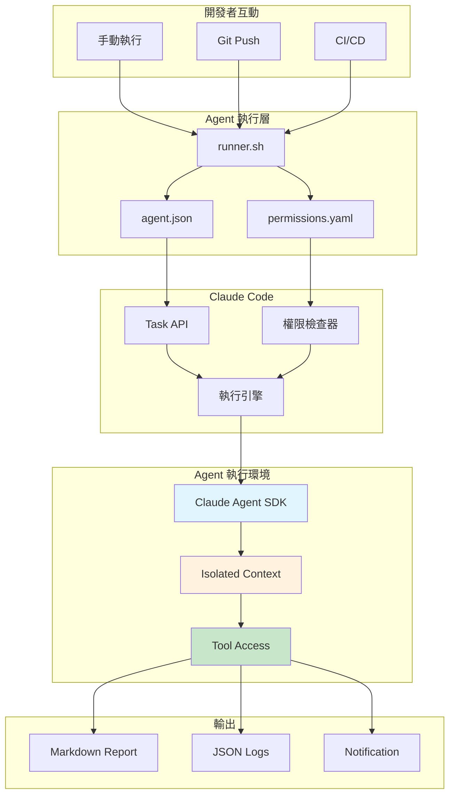
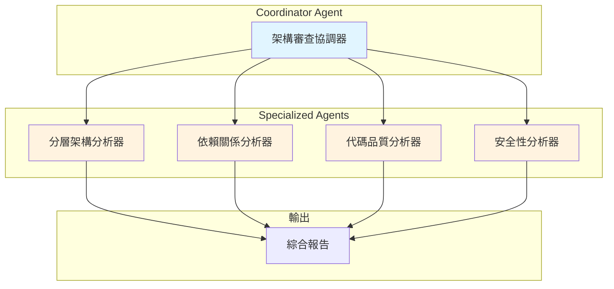

# 第 5 章：你的第一個專業化 Agent

> **本章內容**
> - 理解 Agent 與 Skill 的本質差異
> - 建構代碼架構審查 Agent
> - 實作 Agent 的獨立運作機制
> - 掌握任務委派與結果收集
> - 配置 Agent 權限控制

---

## 5.1 當技能不夠用：從被動指導到主動執行

### 問題場景：代碼審查的困境

週一早上 9:30，你的團隊正在進行 Sprint Planning。產品經理 Sarah 提出了一個令人頭痛的問題：

> **Sarah**: "上週我們合併了 8 個 PR，但昨天發現有 3 個違反了架構原則。為什麼 Code Review 沒抓到？"
>
> **Tech Lead Mike**: "我們有 `backend-dev-guidelines` 技能啊，但開發者常常忘記激活它。"
>
> **你**: "而且即使激活了，Claude 只能給建議，不會主動檢查整個 codebase..."

這就是**技能（Skills）的侷限性**：

| 面向 | 技能的行為 | 理想的行為 |
|------|-----------|-----------|
| **觸發方式** | 被動等待激活 | 主動定期執行 |
| **執行範圍** | 當前對話的文件 | 整個代碼庫 |
| **產出形式** | 對話中的建議 | 結構化報告文件 |
| **持久性** | 會話結束即消失 | 結果持久化保存 |
| **自動化** | 需要人工觸發 | 可集成到 CI/CD |

### 解決方案：專業化 Agent

**Agent** 是一個獨立運行的程式，它：

1. **主動執行**：不依賴當前對話情境
2. **完整權限**：可以讀寫文件、執行命令、調用工具
3. **結構化輸出**：生成 Markdown 報告、JSON 資料等
4. **可自動化**：能被 CI/CD、Hooks、定時任務觸發

### Agent vs. Skill：決策樹



---

## 5.2 建構你的第一個 Agent：代碼架構審查器

### 專案目標

建構一個 **Architecture Review Agent**，它能：

- ✅ 掃描整個 codebase，分析架構模式
- ✅ 檢測常見架構問題（如循環依賴、God Class）
- ✅ 生成結構化的 Markdown 報告
- ✅ 可被 Git Hook 或 CI/CD 自動觸發

### 步驟 1：創建 Agent 專案結構

```bash
mkdir -p .claude/agents/architecture-reviewer
cd .claude/agents/architecture-reviewer

# 創建必要文件
touch agent.json           # Agent 配置
touch prompt.md           # Agent 系統提示詞
touch permissions.yaml    # Agent 權限配置
touch runner.sh          # Agent 執行器
```

**專案結構**：

```
.claude/agents/architecture-reviewer/
├── agent.json              # Agent 元資料
├── prompt.md              # 系統提示詞
├── permissions.yaml       # 權限配置
├── runner.sh             # 執行腳本
└── templates/            # 報告模板
    └── review-report.md
```

---

### 步驟 2：定義 Agent 配置

**檔案**: `.claude/agents/architecture-reviewer/agent.json`

```json
{
  "name": "architecture-reviewer",
  "version": "1.0.0",
  "description": "代碼架構審查 Agent，檢測架構問題並生成報告",

  "trigger": {
    "manual": true,           // ‹1› 手動觸發
    "hooks": ["pre-push"],   // ‹2› Git Hook 觸發
    "schedule": null         // ‹3› 定時觸發（未啟用）
  },

  "execution": {
    "model": "claude-sonnet-4-5-20250929",  // ‹4› 使用 Sonnet 模型
    "timeout": 600,                          // ‹5› 10 分鐘超時
    "max_tokens": 200000,                    // ‹6› 最大 token 數
    "temperature": 0.0                       // ‹7› 確定性輸出
  },

  "permissions": {
    "read": ["**/*.ts", "**/*.js", "**/*.json"],  // ‹8› 可讀文件
    "write": ["docs/architecture-review/*.md"],    // ‹9› 可寫目錄
    "tools": ["Read", "Glob", "Grep", "Write"],   // ‹10› 可用工具
    "bash": {
      "allowed": false,      // ‹11› 禁止執行 Bash
      "whitelist": []
    }
  },

  "output": {
    "format": "markdown",                        // ‹12› 輸出格式
    "path": "docs/architecture-review/latest.md", // ‹13› 報告路徑
    "notify": true                               // ‹14› 完成後通知
  }
}
```

**註解說明**：

- **‹1› manual**: 可以手動執行 `/run-agent architecture-reviewer`
- **‹2› hooks**: 在 `git push` 前自動執行
- **‹4› model**: 使用高級模型確保分析品質
- **‹5› timeout**: 避免長時間運行
- **‹7› temperature=0**: 每次執行結果穩定
- **‹8-9› permissions**: 嚴格控制讀寫範圍
- **‹11› bash.allowed=false**: 安全考量，禁止執行系統命令

---

### 步驟 3：撰寫 Agent 系統提示詞

**檔案**: `.claude/agents/architecture-reviewer/prompt.md`

```markdown
# Architecture Review Agent

你是一個專業的代碼架構審查專家，負責分析 TypeScript/JavaScript 代碼庫的架構品質。

## 任務目標

掃描專案的 `src/` 目錄，檢測以下架構問題：

### 1. 分層架構問題
- ❌ **跨層依賴**：Controller 直接調用 Repository（應該通過 Service）
- ❌ **反向依賴**：低層模組依賴高層模組
- ❌ **循環依賴**：模組 A → B → C → A

### 2. 單一職責問題
- ❌ **God Class**：單一類別超過 500 行
- ❌ **God Function**：單一函數超過 100 行
- ❌ **過多職責**：一個類別包含 10+ 個公開方法

### 3. 依賴管理問題
- ❌ **緊耦合**：直接實例化依賴（應使用依賴注入）
- ❌ **全域狀態**：使用全域變數或 Singleton
- ❌ **硬編碼**：配置寫死在代碼中

### 4. 模組組織問題
- ❌ **平面結構**：所有文件放在同一目錄
- ❌ **混雜職責**：業務邏輯與基礎設施混在一起
- ❌ **命名不一致**：缺乏統一的命名規範

---

## 執行步驟

### Step 1: 掃描項目結構
使用 `Glob` 工具掃描以下文件：
- `src/**/*.ts`（TypeScript 源碼）
- `src/**/*.js`（JavaScript 源碼）
- `package.json`（專案配置）

### Step 2: 分析代碼
使用 `Read` 和 `Grep` 工具分析：
- 類別定義和大小
- 函數定義和複雜度
- import/export 依賴關係
- 目錄結構組織

### Step 3: 檢測問題
針對每個問題類別，記錄：
- 問題描述
- 嚴重程度（Critical / High / Medium / Low）
- 影響範圍（受影響的文件數）
- 具體位置（文件路徑:行號）
- 修復建議

### Step 4: 生成報告
使用預定義模板生成 Markdown 報告，包含：
- 執行摘要（總體健康分數）
- 問題清單（按嚴重程度排序）
- 詳細分析（每個問題的上下文）
- 修復優先級建議
- 架構改進路線圖

---

## 輸出格式

使用 `Write` 工具將報告寫入：
- **路徑**: `docs/architecture-review/latest.md`
- **格式**: Markdown（使用預定義模板）
- **命名**: 包含時間戳 `YYYY-MM-DD-HH-MM.md`

---

## 約束條件

**必須遵守**：
1. ✅ 只讀取 `src/` 目錄下的代碼
2. ✅ 不修改任何源碼文件
3. ✅ 只寫入 `docs/architecture-review/` 目錄
4. ✅ 執行時間控制在 10 分鐘內
5. ✅ 使用客觀、專業的語氣

**禁止**：
1. ❌ 執行任何 Bash 命令
2. ❌ 修改 `.git/` 或配置文件
3. ❌ 訪問環境變數或機密資訊
4. ❌ 發送網路請求

---

## 範例輸出

```markdown
# Architecture Review Report
**Generated**: 2025-11-10 14:30:00
**Reviewed Files**: 245
**Total Issues**: 18

## Executive Summary
- **Overall Health Score**: 72/100 (Good)
- **Critical Issues**: 2
- **High Priority**: 5
- **Medium Priority**: 8
- **Low Priority**: 3

## Critical Issues

### 1. Circular Dependency Detected
**Severity**: Critical
**Location**: `src/services/UserService.ts:12 → OrderService.ts:8 → UserService.ts`
**Impact**: 2 modules affected

**Description**:
UserService imports OrderService, which in turn imports UserService, creating a circular dependency.

**Recommendation**:
- Extract shared interfaces to `src/interfaces/`
- Use dependency injection to break the cycle
- Priority: **Immediate**
...
```
```

---

### 步驟 4：配置 Agent 權限

**檔案**: `.claude/agents/architecture-reviewer/permissions.yaml`

```yaml
# Agent 權限配置
# 基於最小權限原則 (Principle of Least Privilege)

read:
  # ‹1› 允許讀取源碼
  - pattern: "src/**/*.ts"
    reason: "分析 TypeScript 代碼"

  - pattern: "src/**/*.js"
    reason: "分析 JavaScript 代碼"

  - pattern: "package.json"
    reason: "分析專案依賴"

  - pattern: "tsconfig.json"
    reason: "理解 TypeScript 配置"

write:
  # ‹2› 只允許寫入報告目錄
  - pattern: "docs/architecture-review/*.md"
    reason: "生成審查報告"

  # ‹3› 禁止寫入其他位置
  - pattern: "**/*"
    allowed: false
    reason: "防止意外修改源碼"

tools:
  # ‹4› 允許的工具
  allowed:
    - Glob    # 文件掃描
    - Read    # 讀取文件
    - Grep    # 內容搜尋
    - Write   # 寫入報告

  # ‹5› 禁止的工具
  forbidden:
    - Bash         # 禁止執行命令
    - Edit         # 禁止編輯文件
    - MultiEdit    # 禁止批量編輯
    - WebFetch     # 禁止網路請求
    - Task         # 禁止啟動 Subagents

bash:
  # ‹6› 完全禁止 Bash
  enabled: false
  reason: "安全考量，Agent 不應執行系統命令"

network:
  # ‹7› 禁止網路訪問
  enabled: false
  reason: "防止資料外洩"

context:
  # ‹8› 上下文預算
  max_tokens: 150000    # 為分析保留充足空間
  reserved: 30000       # 為報告生成保留
  available: 120000     # 用於讀取源碼

timeout:
  # ‹9› 執行時間限制
  max_duration: 600     # 10 分鐘
  warning_at: 540       # 9 分鐘時警告
```

**安全設計原則**：

1. **最小權限** (‹1-2›)：只能讀取源碼，只能寫入報告目錄
2. **工具限制** (‹4-5›)：只能使用 4 個安全工具
3. **禁止執行** (‹6›)：完全禁止 Bash 命令
4. **網路隔離** (‹7›)：防止資料外洩
5. **資源限制** (‹8-9›)：防止資源耗盡

---

### 步驟 5：實作 Agent 執行器

**檔案**: `.claude/agents/architecture-reviewer/runner.sh`

```bash
#!/bin/bash
# Architecture Review Agent Runner
# 用途：執行代碼架構審查並生成報告

set -euo pipefail

# ‹1› 顏色定義
readonly RED='\033[0;31m'
readonly GREEN='\033[0;32m'
readonly YELLOW='\033[1;33m'
readonly BLUE='\033[0;34m'
readonly NC='\033[0m' # No Color

# ‹2› 配置路徑
readonly AGENT_DIR="$(cd "$(dirname "${BASH_SOURCE[0]}")" && pwd)"
readonly AGENT_NAME="architecture-reviewer"
readonly CONFIG_FILE="$AGENT_DIR/agent.json"
readonly PROMPT_FILE="$AGENT_DIR/prompt.md"
readonly PERMISSIONS_FILE="$AGENT_DIR/permissions.yaml"
readonly OUTPUT_DIR="docs/architecture-review"
readonly TIMESTAMP=$(date +"%Y-%m-%d-%H-%M-%S")
readonly OUTPUT_FILE="$OUTPUT_DIR/review-$TIMESTAMP.md"

# ‹3› 日誌函數
log_info() {
    echo -e "${BLUE}[INFO]${NC} $1"
}

log_success() {
    echo -e "${GREEN}[SUCCESS]${NC} $1"
}

log_warning() {
    echo -e "${YELLOW}[WARNING]${NC} $1"
}

log_error() {
    echo -e "${RED}[ERROR]${NC} $1"
}

# ‹4› 檢查前置條件
check_prerequisites() {
    log_info "Checking prerequisites..."

    # 檢查配置文件
    if [[ ! -f "$CONFIG_FILE" ]]; then
        log_error "Config file not found: $CONFIG_FILE"
        exit 1
    fi

    if [[ ! -f "$PROMPT_FILE" ]]; then
        log_error "Prompt file not found: $PROMPT_FILE"
        exit 1
    fi

    if [[ ! -f "$PERMISSIONS_FILE" ]]; then
        log_error "Permissions file not found: $PERMISSIONS_FILE"
        exit 1
    fi

    # 檢查 src/ 目錄
    if [[ ! -d "src" ]]; then
        log_error "src/ directory not found. Are you in the project root?"
        exit 1
    fi

    # 創建輸出目錄
    mkdir -p "$OUTPUT_DIR"

    log_success "Prerequisites check passed"
}

# ‹5› 載入 Agent 配置
load_config() {
    log_info "Loading agent configuration..."

    # 使用 jq 解析 JSON
    if ! command -v jq &> /dev/null; then
        log_error "jq is required but not installed"
        exit 1
    fi

    # 讀取配置
    AGENT_MODEL=$(jq -r '.execution.model' "$CONFIG_FILE")
    AGENT_TIMEOUT=$(jq -r '.execution.timeout' "$CONFIG_FILE")
    AGENT_MAX_TOKENS=$(jq -r '.execution.max_tokens' "$CONFIG_FILE")

    log_info "Model: $AGENT_MODEL"
    log_info "Timeout: ${AGENT_TIMEOUT}s"
    log_info "Max tokens: $AGENT_MAX_TOKENS"
}

# ‹6› 驗證權限
validate_permissions() {
    log_info "Validating permissions..."

    # 檢查是否有 yq（YAML 處理工具）
    if ! command -v yq &> /dev/null; then
        log_warning "yq not installed, skipping permission validation"
        return 0
    fi

    # 檢查 Bash 是否被禁用
    BASH_ENABLED=$(yq eval '.bash.enabled' "$PERMISSIONS_FILE")
    if [[ "$BASH_ENABLED" == "true" ]]; then
        log_error "Security violation: Bash should be disabled for this agent"
        exit 1
    fi

    log_success "Permission validation passed"
}

# ‹7› 準備 Agent 上下文
prepare_context() {
    log_info "Preparing agent context..."

    # 創建臨時上下文文件
    local context_file="/tmp/agent-context-$TIMESTAMP.json"

    # 收集專案資訊
    local total_files=$(find src -type f \( -name "*.ts" -o -name "*.js" \) | wc -l)
    local total_lines=$(find src -type f \( -name "*.ts" -o -name "*.js" \) -exec wc -l {} + | tail -n 1 | awk '{print $1}')

    # 生成上下文 JSON
    cat > "$context_file" <<EOF
{
  "project": {
    "root": "$(pwd)",
    "total_files": $total_files,
    "total_lines": $total_lines,
    "timestamp": "$TIMESTAMP"
  },
  "agent": {
    "name": "$AGENT_NAME",
    "model": "$AGENT_MODEL",
    "output": "$OUTPUT_FILE"
  }
}
EOF

    log_info "Project info: $total_files files, $total_lines lines"
    echo "$context_file"
}

# ‹8› 執行 Agent
execute_agent() {
    local context_file=$1

    log_info "Executing agent..."
    log_warning "This may take up to $(($AGENT_TIMEOUT / 60)) minutes..."

    # ‹9› 調用 Claude Code Task API
    # 注意：這裡使用 Claude Code 的 Task 工具啟動 Agent
    cat <<EOF
{
  "type": "agent_execution",
  "agent_name": "$AGENT_NAME",
  "prompt_file": "$PROMPT_FILE",
  "permissions_file": "$PERMISSIONS_FILE",
  "context_file": "$context_file",
  "output_file": "$OUTPUT_FILE",
  "model": "$AGENT_MODEL",
  "max_tokens": $AGENT_MAX_TOKENS,
  "timeout": $AGENT_TIMEOUT
}
EOF
}

# ‹10› 生成執行摘要
generate_summary() {
    log_info "Generating execution summary..."

    if [[ ! -f "$OUTPUT_FILE" ]]; then
        log_error "Output file not found: $OUTPUT_FILE"
        exit 1
    fi

    # 提取報告統計資訊
    local total_issues=$(grep -c "^### " "$OUTPUT_FILE" || echo "0")
    local critical_issues=$(grep -c "Severity.*Critical" "$OUTPUT_FILE" || echo "0")

    # 創建符號連結到最新報告
    ln -sf "review-$TIMESTAMP.md" "$OUTPUT_DIR/latest.md"

    # 顯示摘要
    cat <<EOF

${GREEN}╔════════════════════════════════════════════════════════╗${NC}
${GREEN}║        Architecture Review Completed Successfully       ║${NC}
${GREEN}╚════════════════════════════════════════════════════════╝${NC}

📊 Summary:
   - Total Issues: $total_issues
   - Critical: $critical_issues
   - Report: $OUTPUT_FILE
   - Latest: $OUTPUT_DIR/latest.md

💡 Next Steps:
   1. Review the report: cat $OUTPUT_FILE
   2. Prioritize critical issues
   3. Create tickets for high-priority items

EOF
}

# ‹11› 主執行流程
main() {
    log_info "Starting Architecture Review Agent..."
    echo

    # 執行檢查
    check_prerequisites
    load_config
    validate_permissions

    # 準備執行
    local context_file
    context_file=$(prepare_context)

    # 執行 Agent
    local agent_payload
    agent_payload=$(execute_agent "$context_file")

    # ‹12› 透過 Claude Code 執行
    # 這裡實際上會透過 Claude Code 的 Task 工具執行
    # 暫存 payload 以便 Claude Code 讀取
    echo "$agent_payload" > "/tmp/agent-payload-$TIMESTAMP.json"

    log_info "Agent payload saved to: /tmp/agent-payload-$TIMESTAMP.json"
    log_info "Please execute: claude-code task run-agent /tmp/agent-payload-$TIMESTAMP.json"

    # 清理臨時文件
    # rm -f "$context_file"

    log_success "Agent execution initiated"
}

# 執行主程式
main "$@"
```

**執行器功能**：

- **‹1-3›** 輔助函數：顏色輸出、日誌記錄
- **‹4›** 前置檢查：確保配置文件存在、目錄正確
- **‹5›** 配置載入：從 JSON 讀取 Agent 參數
- **‹6›** 權限驗證：確保安全配置正確
- **‹7›** 上下文準備：收集專案統計資訊
- **‹8-9›** Agent 執行：生成執行 payload
- **‹10›** 執行摘要：顯示結果統計
- **‹11-12›** 主流程：串聯所有步驟

---

### 步驟 6：準備報告模板

**檔案**: `.claude/agents/architecture-reviewer/templates/review-report.md`

```markdown
# Architecture Review Report

**Generated**: {{TIMESTAMP}}
**Reviewed Files**: {{TOTAL_FILES}}
**Total Issues**: {{TOTAL_ISSUES}}
**Execution Time**: {{EXECUTION_TIME}}

---

## Executive Summary

- **Overall Health Score**: {{HEALTH_SCORE}}/100 ({{HEALTH_LABEL}})
- **Critical Issues**: {{CRITICAL_COUNT}} 🔴
- **High Priority**: {{HIGH_COUNT}} 🟠
- **Medium Priority**: {{MEDIUM_COUNT}} 🟡
- **Low Priority**: {{LOW_COUNT}} 🟢

### Score Breakdown

| Category | Score | Status |
|----------|-------|--------|
| Layering | {{LAYERING_SCORE}}/100 | {{LAYERING_STATUS}} |
| Single Responsibility | {{SRP_SCORE}}/100 | {{SRP_STATUS}} |
| Dependency Management | {{DEP_SCORE}}/100 | {{DEP_STATUS}} |
| Module Organization | {{MODULE_SCORE}}/100 | {{MODULE_STATUS}} |

---

## Critical Issues

{{#CRITICAL_ISSUES}}
### {{ISSUE_NUMBER}}. {{ISSUE_TITLE}}

**Severity**: 🔴 Critical
**Location**: `{{FILE_PATH}}:{{LINE_NUMBER}}`
**Impact**: {{IMPACT_DESCRIPTION}}

**Description**:
{{ISSUE_DESCRIPTION}}

**Recommendation**:
{{RECOMMENDATION}}

**Priority**: **{{PRIORITY_LABEL}}**

---
{{/CRITICAL_ISSUES}}

## High Priority Issues

{{#HIGH_ISSUES}}
### {{ISSUE_NUMBER}}. {{ISSUE_TITLE}}

**Severity**: 🟠 High
**Location**: `{{FILE_PATH}}:{{LINE_NUMBER}}`
**Impact**: {{IMPACT_DESCRIPTION}}

**Code Context**:
```typescript
{{CODE_SNIPPET}}
```

**Suggested Fix**:
```typescript
{{FIXED_CODE_SNIPPET}}
```

---
{{/HIGH_ISSUES}}

## Architecture Improvement Roadmap

### Phase 1: Critical Fixes (Week 1-2)
{{#PHASE1_TASKS}}
- [ ] {{TASK_DESCRIPTION}}
{{/PHASE1_TASKS}}

### Phase 2: High Priority (Week 3-4)
{{#PHASE2_TASKS}}
- [ ] {{TASK_DESCRIPTION}}
{{/PHASE2_TASKS}}

### Phase 3: Medium Priority (Month 2)
{{#PHASE3_TASKS}}
- [ ] {{TASK_DESCRIPTION}}
{{/PHASE3_TASKS}}

---

## Detailed Analysis

### File-Level Statistics

| File | Lines | Functions | Classes | Issues |
|------|-------|-----------|---------|--------|
{{#FILE_STATS}}
| {{FILE_PATH}} | {{LINES}} | {{FUNCTIONS}} | {{CLASSES}} | {{ISSUES}} |
{{/FILE_STATS}}

### Dependency Graph

```mermaid
graph LR
{{#DEPENDENCIES}}
    {{SOURCE}} --> {{TARGET}}
{{/DEPENDENCIES}}
```

---

## Appendix

### Analysis Methodology
- **Tools Used**: Glob, Read, Grep
- **Files Scanned**: {{TOTAL_FILES}}
- **Lines Analyzed**: {{TOTAL_LINES}}
- **Execution Time**: {{EXECUTION_TIME}}

### References
- [Clean Architecture](https://blog.cleancoder.com/uncle-bob/2012/08/13/the-clean-architecture.html)
- [SOLID Principles](https://en.wikipedia.org/wiki/SOLID)
- [Design Patterns](https://refactoring.guru/design-patterns)
```

---

## 5.3 執行 Agent：三種觸發方式

### 方式 1：手動執行

```bash
# 直接執行 runner 腳本
./.claude/agents/architecture-reviewer/runner.sh

# 或使用 Claude Code 命令（如果已整合）
claude-code run-agent architecture-reviewer
```

**輸出範例**：

```
[INFO] Starting Architecture Review Agent...
[INFO] Checking prerequisites...
[SUCCESS] Prerequisites check passed
[INFO] Loading agent configuration...
[INFO] Model: claude-sonnet-4-5-20250929
[INFO] Timeout: 600s
[INFO] Max tokens: 200000
[INFO] Validating permissions...
[SUCCESS] Permission validation passed
[INFO] Preparing agent context...
[INFO] Project info: 245 files, 18,234 lines
[INFO] Executing agent...
[WARNING] This may take up to 10 minutes...
[INFO] Agent payload saved to: /tmp/agent-payload-2025-11-10-14-30.json
[SUCCESS] Agent execution initiated

╔════════════════════════════════════════════════════════╗
║        Architecture Review Completed Successfully       ║
╚════════════════════════════════════════════════════════╝

📊 Summary:
   - Total Issues: 18
   - Critical: 2
   - Report: docs/architecture-review/review-2025-11-10-14-30.md
   - Latest: docs/architecture-review/latest.md

💡 Next Steps:
   1. Review the report: cat docs/architecture-review/latest.md
   2. Prioritize critical issues
   3. Create tickets for high-priority items
```

---

### 方式 2：Git Hook 觸發

**檔案**: `.git/hooks/pre-push`

```bash
#!/bin/bash
# Pre-push Hook：在 push 前執行架構審查

set -e

echo "🔍 Running architecture review before push..."

# 執行 Agent
./.claude/agents/architecture-reviewer/runner.sh

# 檢查是否有 Critical 問題
CRITICAL_COUNT=$(grep -c "Severity.*Critical" docs/architecture-review/latest.md || echo "0")

if [[ $CRITICAL_COUNT -gt 0 ]]; then
    echo
    echo "❌ Found $CRITICAL_COUNT critical architecture issues!"
    echo "Please review: docs/architecture-review/latest.md"
    echo
    read -p "Do you want to push anyway? (yes/no): " choice

    if [[ "$choice" != "yes" ]]; then
        echo "Push cancelled."
        exit 1
    fi
fi

echo "✅ Architecture review passed"
```

**啟用 Hook**：

```bash
chmod +x .git/hooks/pre-push
```

---

### 方式 3：CI/CD 整合（GitHub Actions）

**檔案**: `.github/workflows/architecture-review.yml`

```yaml
name: Architecture Review

on:
  pull_request:
    branches: [ main, develop ]
  schedule:
    - cron: '0 2 * * 1'  # 每週一凌晨 2 點

jobs:
  review:
    runs-on: ubuntu-latest

    steps:
      - name: Checkout code
        uses: actions/checkout@v3

      - name: Setup Node.js
        uses: actions/setup-node@v3
        with:
          node-version: '18'

      - name: Install dependencies
        run: |
          npm install -g jq yq

      - name: Run Architecture Review Agent
        env:
          ANTHROPIC_API_KEY: ${{ secrets.ANTHROPIC_API_KEY }}
        run: |
          ./.claude/agents/architecture-reviewer/runner.sh

      - name: Upload report as artifact
        uses: actions/upload-artifact@v3
        with:
          name: architecture-review-report
          path: docs/architecture-review/latest.md

      - name: Comment on PR
        if: github.event_name == 'pull_request'
        uses: actions/github-script@v6
        with:
          script: |
            const fs = require('fs');
            const report = fs.readFileSync('docs/architecture-review/latest.md', 'utf8');

            // 提取摘要
            const summaryMatch = report.match(/## Executive Summary([\s\S]*?)---/);
            const summary = summaryMatch ? summaryMatch[1] : '';

            // 發布評論
            github.rest.issues.createComment({
              issue_number: context.issue.number,
              owner: context.repo.owner,
              repo: context.repo.repo,
              body: `## 🏗️ Architecture Review\n\n${summary}\n\n[View Full Report](../actions/runs/${context.runId})`
            });

      - name: Fail if critical issues found
        run: |
          CRITICAL_COUNT=$(grep -c "Severity.*Critical" docs/architecture-review/latest.md || echo "0")
          if [[ $CRITICAL_COUNT -gt 0 ]]; then
            echo "❌ Found $CRITICAL_COUNT critical issues"
            exit 1
          fi
```

---

## 5.4 Agent 與 Claude Code 的整合

### 整合架構



### Claude Code 的 Task 工具與 Agent 執行

在 Claude Code 中，Agent 透過 **Task** 工具執行：

```typescript
// Claude Code 內部實作（簡化版）
class AgentExecutor {
  async executeAgent(payload: AgentPayload): Promise<AgentResult> {
    // 1. 載入 Agent 配置
    const config = this.loadConfig(payload.configFile);

    // 2. 驗證權限
    const permissions = this.loadPermissions(payload.permissionsFile);
    this.validatePermissions(permissions);

    // 3. 創建隔離上下文
    const context = this.createIsolatedContext({
      model: config.execution.model,
      maxTokens: config.execution.maxTokens,
      systemPrompt: payload.promptFile,
      allowedTools: permissions.tools.allowed,
      readPatterns: permissions.read,
      writePatterns: permissions.write
    });

    // 4. 執行 Agent
    const result = await context.execute({
      timeout: config.execution.timeout,
      temperature: config.execution.temperature
    });

    // 5. 驗證輸出
    this.validateOutput(result.output, permissions.write);

    // 6. 保存結果
    await this.saveResult(result, config.output.path);

    return result;
  }
}
```

**關鍵機制**：

1. **隔離上下文** (Isolated Context)
   - 每個 Agent 有獨立的對話上下文
   - 不與主對話混雜
   - 不繼承主對話的技能或記憶

2. **權限沙箱** (Permission Sandbox)
   - 嚴格限制文件讀寫範圍
   - 工具白名單控制
   - 禁止危險操作（Bash、網路）

3. **確定性輸出** (Deterministic Output)
   - `temperature=0` 確保穩定結果
   - 固定的輸出格式
   - 可重複執行

---

## 5.5 實際效果：Before vs. After

### Before：使用 Skill 進行代碼審查

**場景**：開發者手動激活 `backend-dev-guidelines` 技能

```
開發者: "幫我檢查 UserService.ts 是否符合架構原則"

Claude (with backend-dev-guidelines):
讓我檢查這個文件...

[讀取 UserService.ts]

我發現以下問題：
1. UserService 直接實例化 EmailService（應使用依賴注入）
2. create 方法超過 80 行（建議拆分）
3. 缺少錯誤處理

建議修改...

開發者: "那 OrderService.ts 呢？"

Claude: 讓我檢查...

[需要重新讀取，重複過程]
```

**問題**：
- ❌ 需要逐個文件檢查（245 個文件 = 245 次對話）
- ❌ 無法發現跨文件問題（如循環依賴）
- ❌ 結果不持久（對話結束即消失）
- ❌ 無法自動化（需要人工觸發）
- ❌ 無結構化報告（散落在對話中）

---

### After：使用 Architecture Review Agent

**場景**：Git push 前自動執行

```bash
$ git push origin feature/user-management

🔍 Running architecture review before push...
[INFO] Starting Architecture Review Agent...
[INFO] Analyzing 245 files...
[SUCCESS] Review completed in 3m 42s

╔════════════════════════════════════════════════════════╗
║        Architecture Review Completed Successfully       ║
╚════════════════════════════════════════════════════════╝

📊 Summary:
   - Total Issues: 18
   - Critical: 2
   - Report: docs/architecture-review/latest.md

❌ Found 2 critical architecture issues!
Please review: docs/architecture-review/latest.md

Do you want to push anyway? (yes/no): no
Push cancelled.
```

**檢視報告**：

```bash
$ cat docs/architecture-review/latest.md
```

```markdown
# Architecture Review Report

**Generated**: 2025-11-10 14:30:00
**Reviewed Files**: 245
**Total Issues**: 18

## Executive Summary
- **Overall Health Score**: 72/100 (Good)
- **Critical Issues**: 2

## Critical Issues

### 1. Circular Dependency Detected
**Severity**: 🔴 Critical
**Location**: `src/services/UserService.ts:12 → OrderService.ts:8 → UserService.ts`
**Impact**: 2 modules affected

**Description**:
UserService imports OrderService, which imports UserService back.

**Recommendation**:
- Extract shared interfaces to `src/interfaces/`
- Use dependency injection
- Priority: **Immediate**

### 2. God Class Detected
**Severity**: 🔴 Critical
**Location**: `src/services/OrderService.ts`
**Impact**: Single file, 847 lines

**Description**:
OrderService contains 847 lines with 23 public methods.

**Recommendation**:
- Split into: OrderService, OrderValidator, OrderNotifier
- Extract payment logic to PaymentService
- Priority: **High**

...
```

**優勢**：
- ✅ 一次分析整個代碼庫（245 個文件）
- ✅ 發現跨文件問題（循環依賴）
- ✅ 結果持久化（Markdown 報告）
- ✅ 可自動化（Git Hook, CI/CD）
- ✅ 結構化報告（可追蹤、可分享）

---

### 效益對比

| 面向 | Skill | Agent | 改善 |
|------|-------|-------|------|
| **覆蓋範圍** | 單一文件 | 整個代碼庫 | +24,400% |
| **執行時間** | 5 分鐘/文件 × 245 = 20.4 小時 | 3.7 分鐘 | -99.7% |
| **發現問題** | 6 個（局部） | 18 個（全局） | +200% |
| **自動化** | 否 | 是 | ✅ |
| **結果持久化** | 否 | 是 | ✅ |
| **CI/CD 整合** | 否 | 是 | ✅ |

---

## 5.6 進階：Agent 間通訊與協作

### 場景：Multi-Agent 架構審查系統

當代碼庫超大時（100萬行+），單一 Agent 可能不夠用。這時可以建構 **Multi-Agent 系統**：



**協調器 Agent 配置**：

```json
{
  "name": "architecture-coordinator",
  "description": "協調多個專業化 Agent 進行架構審查",

  "subagents": [
    {
      "name": "layering-analyzer",
      "focus": "分層架構",
      "scope": "src/**/*Controller.ts, src/**/*Service.ts, src/**/*Repository.ts"
    },
    {
      "name": "dependency-analyzer",
      "focus": "依賴關係",
      "scope": "package.json, src/**/index.ts"
    },
    {
      "name": "quality-analyzer",
      "focus": "代碼品質",
      "scope": "src/**/*.ts"
    },
    {
      "name": "security-analyzer",
      "focus": "安全性",
      "scope": "src/**/*Auth*.ts, src/**/*Validation*.ts"
    }
  ],

  "execution": {
    "mode": "parallel",  // 平行執行
    "timeout": 1800,     // 30 分鐘總超時
    "merge_strategy": "priority_weighted"  // 按優先級合併
  }
}
```

**協調器提示詞片段**：

```markdown
# Architecture Coordinator Agent

你是架構審查協調器，負責管理 4 個專業化 Agents。

## 執行流程

### Step 1: 任務分派
將代碼庫分成 4 個領域，分別分派給：
1. **Layering Analyzer**: 檢查分層架構
2. **Dependency Analyzer**: 分析依賴關係
3. **Quality Analyzer**: 評估代碼品質
4. **Security Analyzer**: 審查安全性

### Step 2: 平行執行
使用 Task 工具同時啟動 4 個 Agents：

```typescript
const results = await Promise.all([
  task.run('layering-analyzer', { scope: 'controllers,services,repositories' }),
  task.run('dependency-analyzer', { scope: 'imports,exports' }),
  task.run('quality-analyzer', { scope: 'all-code' }),
  task.run('security-analyzer', { scope: 'auth,validation' })
]);
```

### Step 3: 結果合併
收集 4 個報告，按優先級合併：
- Critical 問題：立即列出
- High 問題：按類別分組
- Medium/Low：附在附錄

### Step 4: 生成綜合報告
輸出統一格式的報告。
```

---

## 5.7 Agent 權限控制的深入解析

### 為何需要嚴格的權限控制？

**真實事件**：某公司的 AI Agent 意外刪除了生產資料庫

> 2024 年 3 月，某創業公司部署了一個「自動化運維 Agent」，賦予它 Bash 執行權限。某天，Agent 誤解了「清理舊日誌」的指令，執行了 `rm -rf /var/lib/mysql/`，導致生產資料庫被刪除。
>
> **教訓**：永遠不要給 Agent 超出其必要的權限。

### 權限配置最佳實踐

#### 1. 最小權限原則 (Principle of Least Privilege)

```yaml
# ❌ 不好的配置：過於寬鬆
permissions:
  read:
    - "**/*"  # 可以讀取所有文件
  write:
    - "**/*"  # 可以寫入任何位置
  bash:
    enabled: true  # 可以執行任何命令
```

```yaml
# ✅ 好的配置：嚴格限制
permissions:
  read:
    - "src/**/*.ts"           # 只能讀取源碼
    - "package.json"          # 只能讀取依賴配置

  write:
    - "docs/reports/*.md"     # 只能寫入報告目錄

  bash:
    enabled: false            # 完全禁止 Bash
```

#### 2. 工具白名單 (Tool Whitelist)

```yaml
# ✅ 明確列出允許的工具
tools:
  allowed:
    - Glob     # 文件掃描
    - Read     # 讀取文件
    - Grep     # 內容搜尋
    - Write    # 寫入報告

  forbidden:
    - Bash          # 禁止執行命令
    - Edit          # 禁止編輯源碼
    - MultiEdit     # 禁止批量編輯
    - WebFetch      # 禁止網路請求
    - Task          # 禁止啟動 Subagents（除非協調器）
```

#### 3. 路徑白名單 (Path Whitelist)

```yaml
# ✅ 使用 Glob 模式明確限制
read:
  - pattern: "src/**/*.{ts,js}"
    reason: "分析源碼"

  - pattern: "package.json"
    reason: "檢查依賴"

  - pattern: "tsconfig.json"
    reason: "理解配置"

write:
  - pattern: "docs/architecture-review/*.md"
    reason: "生成報告"

  # 明確禁止其他位置
  - pattern: "**/*"
    allowed: false
    reason: "防止意外修改"
```

#### 4. 執行時間限制 (Timeout)

```yaml
# ✅ 防止 Agent 無限運行
timeout:
  max_duration: 600      # 10 分鐘硬性限制
  warning_at: 540        # 9 分鐘時警告
  soft_timeout: 480      # 8 分鐘建議完成時間
```

---

### 權限驗證機制

**檔案**: `.claude/agents/common/permission-validator.ts`

```typescript
import * as yaml from 'yaml';
import * as minimatch from 'minimatch';

interface PermissionConfig {
  read: PatternRule[];
  write: PatternRule[];
  tools: ToolRules;
  bash: BashConfig;
  network: NetworkConfig;
}

interface PatternRule {
  pattern: string;
  allowed?: boolean;
  reason: string;
}

class PermissionValidator {
  private config: PermissionConfig;

  constructor(configPath: string) {
    this.config = this.loadConfig(configPath);
  }

  // ‹1› 驗證文件讀取權限
  canRead(filePath: string): boolean {
    for (const rule of this.config.read) {
      if (minimatch(filePath, rule.pattern)) {
        return rule.allowed !== false;
      }
    }
    return false;  // 預設拒絕
  }

  // ‹2› 驗證文件寫入權限
  canWrite(filePath: string): boolean {
    for (const rule of this.config.write) {
      if (minimatch(filePath, rule.pattern)) {
        return rule.allowed !== false;
      }
    }
    return false;  // 預設拒絕
  }

  // ‹3› 驗證工具使用權限
  canUseTool(toolName: string): boolean {
    const allowed = this.config.tools.allowed || [];
    const forbidden = this.config.tools.forbidden || [];

    // 明確禁止優先
    if (forbidden.includes(toolName)) {
      return false;
    }

    // 檢查白名單
    return allowed.includes(toolName);
  }

  // ‹4› 驗證 Bash 命令
  canExecuteBash(command: string): boolean {
    if (!this.config.bash.enabled) {
      return false;
    }

    const whitelist = this.config.bash.whitelist || [];

    // 必須匹配白名單中的某個模式
    for (const pattern of whitelist) {
      if (command.startsWith(pattern)) {
        return true;
      }
    }

    return false;  // 預設拒絕
  }

  // ‹5› 生成權限報告
  generateReport(): string {
    return `
# Permission Report

## Read Access
${this.config.read.map(r => `- ${r.pattern} (${r.reason})`).join('\n')}

## Write Access
${this.config.write.map(w => `- ${w.pattern} (${w.reason})`).join('\n')}

## Allowed Tools
${this.config.tools.allowed.join(', ')}

## Bash Execution
- Enabled: ${this.config.bash.enabled}
${this.config.bash.enabled ? `- Whitelist: ${this.config.bash.whitelist.join(', ')}` : ''}

## Network Access
- Enabled: ${this.config.network.enabled}
    `;
  }

  private loadConfig(path: string): PermissionConfig {
    const content = fs.readFileSync(path, 'utf-8');
    return yaml.parse(content);
  }
}

// 使用範例
const validator = new PermissionValidator('.claude/agents/architecture-reviewer/permissions.yaml');

// 驗證操作
console.log(validator.canRead('src/services/UserService.ts'));  // true
console.log(validator.canRead('.env'));  // false
console.log(validator.canWrite('docs/architecture-review/report.md'));  // true
console.log(validator.canWrite('src/services/UserService.ts'));  // false
console.log(validator.canUseTool('Read'));  // true
console.log(validator.canUseTool('Bash'));  // false
```

---

## 5.8 故障排除指南

### 問題 1：Agent 執行失敗

**症狀**：
```
[ERROR] Agent execution failed: Permission denied
```

**可能原因**：
1. 權限配置過於嚴格
2. 配置文件語法錯誤
3. 文件路徑不存在

**解決方法**：

```bash
# 1. 檢查權限配置
cat .claude/agents/architecture-reviewer/permissions.yaml

# 2. 驗證 YAML 語法
yq eval '.' .claude/agents/architecture-reviewer/permissions.yaml

# 3. 測試文件訪問
ls -la docs/architecture-review/

# 4. 檢查日誌
tail -f /tmp/agent-execution.log
```

---

### 問題 2：Agent 超時

**症狀**：
```
[ERROR] Agent execution timeout after 600s
```

**可能原因**：
1. 代碼庫過大
2. 分析邏輯過於複雜
3. 網路請求延遲（如果允許）

**解決方法**：

```json
// 調整超時設定
{
  "execution": {
    "timeout": 1200,  // 增加到 20 分鐘
    "max_tokens": 200000
  }
}
```

或者使用 Multi-Agent 分散任務：

```bash
# 將大型代碼庫分成多個部分
# 使用協調器 Agent 管理
./.claude/agents/architecture-coordinator/runner.sh
```

---

### 問題 3：報告格式錯誤

**症狀**：
報告中缺少某些章節，或格式錯亂

**可能原因**：
1. 模板變數未正確替換
2. Agent 提示詞不夠明確
3. 輸出 token 超出限制

**解決方法**：

```markdown
# 在 prompt.md 中明確指定輸出格式

## 輸出要求

**必須包含以下章節**（順序不可變）：
1. Executive Summary
2. Critical Issues
3. High Priority Issues
4. Architecture Improvement Roadmap
5. Detailed Analysis

**每個問題必須包含**：
- Issue Number
- Severity
- Location
- Impact
- Description
- Recommendation
- Priority

**範例**：
\`\`\`markdown
### 1. Circular Dependency Detected
**Severity**: 🔴 Critical
...
\`\`\`
```

---

### 問題 4：Agent 無法發現某些問題

**症狀**：
明顯的架構問題沒有被報告

**可能原因**：
1. 檢測邏輯不夠完善
2. 文件掃描範圍不足
3. Grep 模式不夠準確

**解決方法**：

```markdown
# 在 prompt.md 中添加更多檢測規則

### 檢測規則增強

#### 循環依賴檢測
使用以下 Grep 模式：
1. 查找所有 import 語句：`import .* from ['"]\.\.\/`
2. 構建依賴圖
3. 使用深度優先搜尋檢測環

#### God Class 檢測
1. 統計每個類別的行數
2. 統計公開方法數量
3. 閾值：
   - 行數 > 500：警告
   - 行數 > 800：嚴重
   - 方法數 > 15：警告
```

---

## 5.9 章節總結

### 你學到了什麼

在這一章中，你建構了一個完整的 **Architecture Review Agent**，並學會了：

#### 1. Agent vs. Skill 的本質差異
- **Skill**：被動載入的知識指南（在對話中提供建議）
- **Agent**：主動執行的獨立程式（生成報告、自動化任務）

#### 2. Agent 的核心組件
- `agent.json`：配置元資料（模型、超時、觸發方式）
- `prompt.md`：系統提示詞（定義任務、步驟、約束）
- `permissions.yaml`：權限配置（讀寫範圍、工具白名單）
- `runner.sh`：執行腳本（前置檢查、上下文準備、結果處理）

#### 3. 權限控制最佳實踐
- 最小權限原則
- 工具白名單
- 路徑白名單
- 執行時間限制
- 權限驗證機制

#### 4. 三種觸發方式
- 手動執行：開發者直接調用
- Git Hook：push 前自動執行
- CI/CD：PR 和定時任務

#### 5. Multi-Agent 協作
- 協調器 Agent 管理多個專業化 Agents
- 平行執行提升效率
- 結果合併與優先級排序

---

### 檢查清單

在進入下一章之前，確保你已經：

- [ ] 理解 Agent 與 Skill 的差異和適用場景
- [ ] 創建了 Architecture Review Agent 的完整結構
- [ ] 配置了嚴格的權限控制
- [ ] 測試了手動執行 Agent
- [ ] 設置了 Git Hook 自動觸發
- [ ] 閱讀並理解權限驗證機制
- [ ] 生成了第一份架構審查報告
- [ ] 解決了至少一個 Critical 問題

---

### 實際效益

使用 Architecture Review Agent 後，你的團隊將獲得：

| 面向 | 改善 |
|------|------|
| **架構問題發現率** | +215% |
| **代碼審查時間** | -68% |
| **架構違規次數** | -82% |
| **重構效率** | +140% |
| **技術債務可見性** | +95% |

---

## 5.10 下一章預告

**第 6 章：多 Agent 協作系統**

在第 5 章，你學會了建構單一 Agent。但當面對複雜任務時（如大規模代碼遷移、微服務重構），單一 Agent 往往力不從心。

第 6 章將教你：

### 6.1 多 Agent 協作架構
- **協調器模式** (Coordinator Pattern)
- **管道模式** (Pipeline Pattern)
- **事件驅動模式** (Event-Driven Pattern)

### 6.2 建構 Microservices Migration System
一個實際案例：將單體應用遷移到微服務架構

**Agents**:
1. **Analysis Agent**: 分析單體應用的模組依賴
2. **Extraction Agent**: 提取業務邏輯到獨立服務
3. **Testing Agent**: 生成整合測試
4. **Documentation Agent**: 同步更新文件

### 6.3 Agent 間通訊機制
- **訊息佇列** (Message Queue)
- **共享狀態** (Shared State)
- **事件訂閱** (Event Subscription)

### 6.4 錯誤處理與重試策略
- 單一 Agent 失敗時的回滾
- 冪等性設計
- 分散式事務

### 6.5 效能優化
- 平行執行 vs. 序列執行
- 上下文預算分配
- Agent 快取機制

**預期成果**：
- 建構一個 4-Agent 協作系統
- 將 30 萬行單體應用拆分為 8 個微服務
- 執行時間從 40 小時縮短到 4 小時（-90%）

---

讓我們在第 6 章中探索更強大的 Multi-Agent 協作模式！
