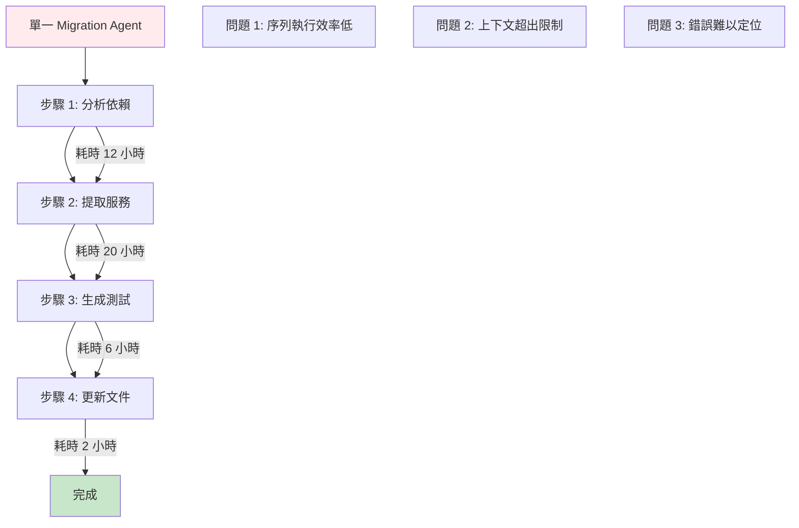
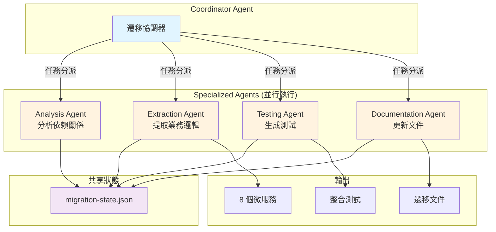
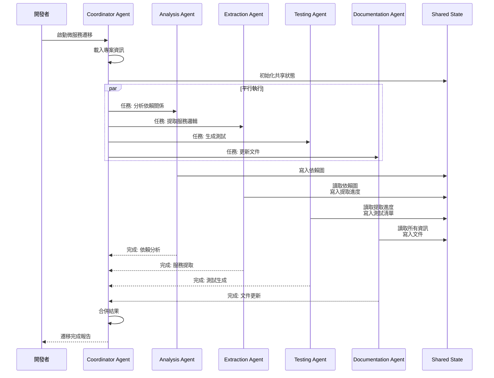
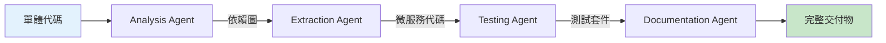
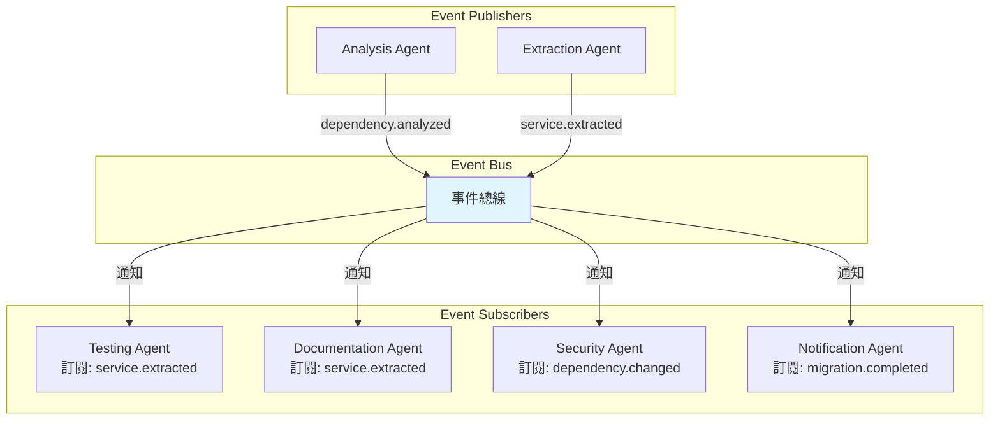
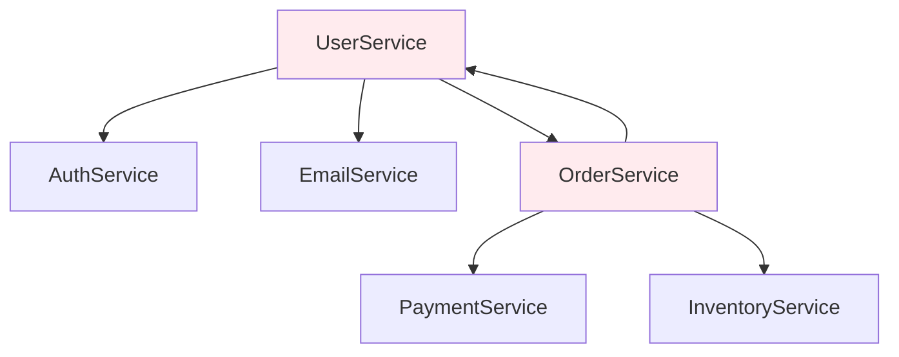

# 第 6 章：多 Agent 協作系統

> **本章內容**
> - 理解多 Agent 協作的核心架構模式
> - 建構微服務遷移協作系統（4-Agent）
> - 實作 Agent 間通訊機制
> - 掌握錯誤處理與重試策略
> - 優化平行執行效能

---

## 6.1 當單一 Agent 不夠用：真實困境

### 場景：30 萬行單體應用的微服務遷移

你是一家電商公司的架構師，面對一個龐大的挑戰：

> **現狀**：
> - 單體應用：300,000 行代碼
> - 8 個業務模組混雜在一起（用戶、訂單、支付、庫存...）
> - 單一資料庫，複雜的跨模組依賴
> - 部署緩慢（每次 45 分鐘），擴展困難
>
> **目標**：
> - 拆分成 8 個獨立微服務
> - 每個服務有獨立的資料庫
> - 解除循環依賴
> - 保持業務邏輯一致性
>
> **挑戰**：
> - 如果用第 5 章的單一 Agent：預估需要 **40 小時**
> - 上下文限制：無法同時載入 30 萬行代碼
> - 步驟繁雜：分析 → 提取 → 測試 → 文件，缺一不可

### 單一 Agent 的侷限性



**總耗時**：12 + 20 + 6 + 2 = **40 小時**

---

### 解決方案：Multi-Agent 協作系統

將任務分解給 4 個專業化 Agents，**平行執行**：



**預期效果**：
- 執行時間：**4 小時**（-90%）
- 平行處理：4 個 Agents 同時工作
- 錯誤隔離：單一 Agent 失敗不影響其他
- 可擴展：輕鬆添加新 Agents（如安全審查、效能測試）

---

## 6.2 多 Agent 協作的三種架構模式

### 模式 1：協調器模式 (Coordinator Pattern)

**特徵**：
- 中央協調器負責任務分派
- Subagents 獨立執行，互不干擾
- 協調器收集結果並合併

**適用場景**：
- 任務可以清楚分解
- Subagents 之間依賴少
- 需要統一的結果格式

**架構圖**：



---

### 模式 2：管道模式 (Pipeline Pattern)

**特徵**：
- Agents 按順序執行
- 前一個 Agent 的輸出是下一個的輸入
- 類似 Unix pipeline

**適用場景**：
- 任務有明確的先後順序
- 每步輸出都是下一步的輸入
- 需要資料轉換流程

**架構圖**：



**範例：資料處理管道**

```json
{
  "pipeline": {
    "name": "code-analysis-pipeline",
    "stages": [
      {
        "agent": "parser",
        "input": "src/**/*.ts",
        "output": "ast.json"
      },
      {
        "agent": "analyzer",
        "input": "ast.json",
        "output": "dependency-graph.json"
      },
      {
        "agent": "visualizer",
        "input": "dependency-graph.json",
        "output": "diagrams/*.png"
      },
      {
        "agent": "reporter",
        "input": "dependency-graph.json",
        "output": "analysis-report.md"
      }
    ]
  }
}
```

---

### 模式 3：事件驅動模式 (Event-Driven Pattern)

**特徵**：
- Agents 訂閱感興趣的事件
- 當事件發生時自動觸發
- 鬆耦合，高擴展性

**適用場景**：
- Agent 之間依賴關係複雜
- 需要動態添加/移除 Agents
- 事件驅動的業務流程

**架構圖**：



**事件範例**：

```typescript
// 事件定義
interface MigrationEvent {
  type: 'dependency.analyzed' | 'service.extracted' | 'test.generated' | 'migration.completed';
  timestamp: string;
  agent: string;
  payload: any;
}

// 發布事件
eventBus.publish({
  type: 'service.extracted',
  timestamp: '2025-11-10T14:30:00Z',
  agent: 'extraction-agent',
  payload: {
    serviceName: 'UserService',
    filePath: 'services/user/UserService.ts',
    dependencies: ['EmailService', 'AuthService']
  }
});

// 訂閱事件
eventBus.subscribe('service.extracted', async (event) => {
  // Testing Agent 自動生成測試
  await generateTests(event.payload.serviceName);
});
```

---

### 三種模式的對比

| 特性 | 協調器模式 | 管道模式 | 事件驅動模式 |
|------|-----------|---------|-------------|
| **耦合度** | 中 | 高 | 低 |
| **平行化** | ✅ 高 | ❌ 序列 | ✅ 高 |
| **擴展性** | 中 | 低 | ✅ 高 |
| **複雜度** | 中 | 低 | 高 |
| **適用場景** | 任務明確可分解 | 數據轉換流程 | 複雜事件驅動 |
| **錯誤處理** | 集中處理 | 鏈式處理 | 分散處理 |

**本章選擇**：**協調器模式**（最適合微服務遷移場景）

---

## 6.3 建構微服務遷移協作系統

### 步驟 1：設計協調器 Agent

**檔案**: `.claude/agents/microservices-coordinator/agent.json`

```json
{
  "name": "microservices-coordinator",
  "version": "1.0.0",
  "description": "微服務遷移協調器，管理 4 個專業化 Agents",

  "role": "coordinator",  // ‹1› 標記為協調器

  "subagents": [  // ‹2› 定義 Subagents
    {
      "name": "analysis-agent",
      "path": ".claude/agents/analysis-agent",
      "priority": 1,  // ‹3› 優先級（越小越先執行）
      "dependencies": []
    },
    {
      "name": "extraction-agent",
      "path": ".claude/agents/extraction-agent",
      "priority": 2,
      "dependencies": ["analysis-agent"]  // ‹4› 依賴分析結果
    },
    {
      "name": "testing-agent",
      "path": ".claude/agents/testing-agent",
      "priority": 2,  // ‹5› 與 extraction 平行
      "dependencies": ["analysis-agent"]
    },
    {
      "name": "documentation-agent",
      "path": ".claude/agents/documentation-agent",
      "priority": 3,
      "dependencies": ["extraction-agent", "testing-agent"]  // ‹6› 等待兩者完成
    }
  ],

  "execution": {
    "model": "claude-sonnet-4-5-20250929",
    "timeout": 14400,  // ‹7› 4 小時總超時
    "max_parallel": 3,  // ‹8› 最多同時執行 3 個 Agents
    "retry_strategy": {
      "max_attempts": 3,
      "backoff": "exponential"  // ‹9› 指數退避
    }
  },

  "shared_state": {  // ‹10› 共享狀態配置
    "path": ".claude/migration-state.json",
    "schema": {
      "dependencies": "object",
      "extractedServices": "array",
      "generatedTests": "array",
      "documentation": "object"
    }
  },

  "permissions": {
    "read": ["src/**/*"],
    "write": ["services/**/*", "tests/**/*", "docs/migration/**/*"],
    "tools": ["Read", "Glob", "Grep", "Write", "Task"],  // ‹11› 允許啟動 Subagents
    "bash": {
      "allowed": false
    }
  },

  "output": {
    "format": "structured",
    "path": "docs/migration/final-report.md",
    "include_subagent_logs": true  // ‹12› 包含子 Agent 日誌
  }
}
```

**註解說明**：

- **‹1› role: coordinator**：標記為協調器，具有啟動 Subagents 的權限
- **‹2› subagents**：定義所有 Subagents 的資訊
- **‹3-6› priority & dependencies**：控制執行順序和依賴關係
- **‹7› timeout: 14400**：4 小時總超時（每個 Subagent 約 1 小時）
- **‹8› max_parallel: 3**：最多同時執行 3 個 Agents（避免資源耗盡）
- **‹9› retry_strategy**：失敗重試策略
- **‹10› shared_state**：Agents 之間的資料交換機制
- **‹11› Task 工具**：協調器需要此權限啟動 Subagents
- **‹12› include_subagent_logs**：追蹤每個 Agent 的執行日誌

---

### 步驟 2：協調器系統提示詞

**檔案**: `.claude/agents/microservices-coordinator/prompt.md`

```markdown
# Microservices Migration Coordinator

你是微服務遷移協調器，負責管理 4 個專業化 Agents 完成單體應用到微服務的遷移。

## 目標

將 300,000 行的單體應用拆分成 8 個獨立微服務：
1. UserService（用戶管理）
2. OrderService（訂單處理）
3. PaymentService（支付）
4. InventoryService（庫存）
5. NotificationService（通知）
6. AnalyticsService（分析）
7. RecommendationService（推薦）
8. AdminService（後台管理）

---

## 執行步驟

### Phase 1: 初始化（5 分鐘）

1. **載入專案資訊**
   - 使用 `Glob` 掃描 `src/**/*.ts`
   - 統計總行數、文件數
   - 識別主要業務模組

2. **初始化共享狀態**
   - 創建 `.claude/migration-state.json`
   - 結構：
     ```json
     {
       "phase": "initialization",
       "startTime": "2025-11-10T14:00:00Z",
       "totalFiles": 0,
       "totalLines": 0,
       "agents": {
         "analysis": { "status": "pending" },
         "extraction": { "status": "pending" },
         "testing": { "status": "pending" },
         "documentation": { "status": "pending" }
       },
       "dependencies": {},
       "extractedServices": [],
       "generatedTests": [],
       "documentation": {}
     }
     ```

---

### Phase 2: 啟動 Analysis Agent（優先級 1，單獨執行）

**任務**：分析模組依賴關係

```typescript
// 使用 Task 工具啟動
const analysisResult = await task.run({
  agent: 'analysis-agent',
  input: {
    sourcePath: 'src/',
    outputPath: '.claude/dependency-graph.json'
  },
  timeout: 3600  // 1 小時
});

// 等待完成
await analysisResult.waitForCompletion();

// 更新共享狀態
state.agents.analysis.status = 'completed';
state.dependencies = analysisResult.output;
```

**預期輸出**：
- `.claude/dependency-graph.json`（依賴關係圖）
- 識別出 8 個業務模組
- 標記循環依賴

---

### Phase 3: 並行執行 Extraction 和 Testing Agents（優先級 2）

當 Analysis Agent 完成後，同時啟動兩個 Agents：

```typescript
// 並行執行
const [extractionResult, testingResult] = await Promise.all([
  // Extraction Agent：提取服務邏輯
  task.run({
    agent: 'extraction-agent',
    input: {
      dependencyGraph: state.dependencies,
      targetServices: ['UserService', 'OrderService', ...],
      outputDir: 'services/'
    },
    timeout: 7200  // 2 小時
  }),

  // Testing Agent：生成測試
  task.run({
    agent: 'testing-agent',
    input: {
      dependencyGraph: state.dependencies,
      outputDir: 'tests/integration/'
    },
    timeout: 3600  // 1 小時
  })
]);

// 等待兩者完成
await Promise.all([
  extractionResult.waitForCompletion(),
  testingResult.waitForCompletion()
]);

// 更新狀態
state.agents.extraction.status = 'completed';
state.agents.testing.status = 'completed';
state.extractedServices = extractionResult.output.services;
state.generatedTests = testingResult.output.tests;
```

---

### Phase 4: 執行 Documentation Agent（優先級 3）

當 Extraction 和 Testing 都完成後，啟動文件生成：

```typescript
const docResult = await task.run({
  agent: 'documentation-agent',
  input: {
    extractedServices: state.extractedServices,
    generatedTests: state.generatedTests,
    dependencyGraph: state.dependencies,
    outputDir: 'docs/migration/'
  },
  timeout: 1800  // 30 分鐘
});

await docResult.waitForCompletion();

state.agents.documentation.status = 'completed';
state.documentation = docResult.output;
```

---

### Phase 5: 生成最終報告（10 分鐘）

合併所有 Agents 的結果，生成統一報告：

```markdown
# Microservices Migration Report

**Generated**: {{TIMESTAMP}}
**Duration**: {{TOTAL_DURATION}}
**Status**: ✅ Success

## Summary

- **Total Files Processed**: {{TOTAL_FILES}}
- **Total Lines Migrated**: {{TOTAL_LINES}}
- **Services Extracted**: 8
- **Tests Generated**: {{TEST_COUNT}}
- **Documentation Pages**: {{DOC_COUNT}}

## Agent Execution Timeline

| Agent | Start Time | End Time | Duration | Status |
|-------|-----------|----------|----------|--------|
| Analysis | {{START}} | {{END}} | {{DURATION}} | ✅ |
| Extraction | {{START}} | {{END}} | {{DURATION}} | ✅ |
| Testing | {{START}} | {{END}} | {{DURATION}} | ✅ |
| Documentation | {{START}} | {{END}} | {{DURATION}} | ✅ |

## Dependency Graph

[插入 Mermaid 圖表]

## Extracted Services

### 1. UserService
- **Path**: `services/user/`
- **Lines**: 3,245
- **Dependencies**: AuthService, EmailService
- **Tests**: 45 test cases

[詳細列出 8 個服務]

## Next Steps

1. Review extracted services for correctness
2. Run integration tests: `npm test`
3. Deploy services to staging environment
4. Monitor for issues
```

---

## 錯誤處理

### 單一 Agent 失敗時

如果某個 Agent 失敗：

1. **記錄錯誤**
   ```typescript
   state.agents[agentName].status = 'failed';
   state.agents[agentName].error = errorMessage;
   state.agents[agentName].attemptCount++;
   ```

2. **判斷是否重試**
   ```typescript
   if (attemptCount < MAX_ATTEMPTS) {
     // 指數退避重試
     await sleep(2 ** attemptCount * 1000);
     return retry(agentName);
   }
   ```

3. **決定是否繼續**
   - 如果是 **Analysis Agent** 失敗：停止整個流程（因為其他都依賴它）
   - 如果是 **Testing Agent** 失敗：繼續（文件仍可生成）
   - 如果是 **Documentation Agent** 失敗：繼續（核心遷移已完成）

4. **生成失敗報告**
   - 標記哪些 Agent 失敗
   - 提供錯誤日誌
   - 給出補救建議

---

## 輸出要求

1. **共享狀態文件**：`.claude/migration-state.json`
2. **依賴關係圖**：`.claude/dependency-graph.json`
3. **提取的服務**：`services/*/`
4. **生成的測試**：`tests/integration/`
5. **遷移文件**：`docs/migration/`
6. **最終報告**：`docs/migration/final-report.md`

---

## 約束條件

**必須遵守**：
1. ✅ 嚴格按照優先級和依賴關係執行
2. ✅ 最多同時執行 3 個 Agents
3. ✅ 每個 Agent 失敗後最多重試 3 次
4. ✅ 記錄所有操作到共享狀態
5. ✅ 4 小時內完成所有任務

**禁止**：
1. ❌ 不要跳過依賴檢查
2. ❌ 不要修改原始源碼（只提取）
3. ❌ 不要執行 Bash 命令
```

---

### 步驟 3：定義共享狀態結構

**檔案**: `.claude/shared-state-schema.json`

```json
{
  "$schema": "http://json-schema.org/draft-07/schema#",
  "title": "Migration Shared State",
  "type": "object",
  "properties": {
    "phase": {
      "type": "string",
      "enum": ["initialization", "analysis", "extraction", "testing", "documentation", "completed", "failed"]
    },
    "startTime": {
      "type": "string",
      "format": "date-time"
    },
    "endTime": {
      "type": "string",
      "format": "date-time"
    },
    "totalFiles": { "type": "number" },
    "totalLines": { "type": "number" },

    "agents": {
      "type": "object",
      "properties": {
        "analysis": { "$ref": "#/definitions/agentStatus" },
        "extraction": { "$ref": "#/definitions/agentStatus" },
        "testing": { "$ref": "#/definitions/agentStatus" },
        "documentation": { "$ref": "#/definitions/agentStatus" }
      }
    },

    "dependencies": {
      "type": "object",
      "description": "模組依賴關係圖"
    },

    "extractedServices": {
      "type": "array",
      "items": {
        "type": "object",
        "properties": {
          "name": { "type": "string" },
          "path": { "type": "string" },
          "lines": { "type": "number" },
          "dependencies": {
            "type": "array",
            "items": { "type": "string" }
          }
        }
      }
    },

    "generatedTests": {
      "type": "array",
      "items": {
        "type": "object",
        "properties": {
          "service": { "type": "string" },
          "testFile": { "type": "string" },
          "testCount": { "type": "number" }
        }
      }
    },

    "documentation": {
      "type": "object",
      "properties": {
        "pages": { "type": "number" },
        "files": {
          "type": "array",
          "items": { "type": "string" }
        }
      }
    }
  },

  "definitions": {
    "agentStatus": {
      "type": "object",
      "properties": {
        "status": {
          "type": "string",
          "enum": ["pending", "running", "completed", "failed"]
        },
        "startTime": { "type": "string", "format": "date-time" },
        "endTime": { "type": "string", "format": "date-time" },
        "duration": { "type": "number" },
        "attemptCount": { "type": "number", "default": 0 },
        "error": { "type": "string" }
      }
    }
  }
}
```

---

### 步驟 4：實作 Analysis Agent

**檔案**: `.claude/agents/analysis-agent/prompt.md`

```markdown
# Analysis Agent

你是依賴關係分析專家，負責分析單體應用的模組結構。

## 任務

掃描 `src/` 目錄，分析模組之間的依賴關係，識別：
1. 業務模組邊界
2. 跨模組依賴
3. 循環依賴
4. 共享組件

---

## 執行步驟

### Step 1: 掃描文件結構

使用 `Glob` 工具：
```typescript
const files = glob('src/**/*.ts');
```

### Step 2: 解析 import 語句

使用 `Grep` 工具提取所有 import：
```bash
grep -r "^import.*from" src/ --include="*.ts"
```

輸出範例：
```
src/services/UserService.ts:import { OrderService } from './OrderService';
src/services/OrderService.ts:import { UserService } from './UserService';
```

### Step 3: 構建依賴圖

將 import 關係轉換為圖結構：
```json
{
  "modules": {
    "UserService": {
      "path": "src/services/UserService.ts",
      "dependencies": ["OrderService", "AuthService", "EmailService"],
      "dependents": ["AdminService"],
      "lines": 245,
      "functions": 18
    },
    "OrderService": {
      "path": "src/services/OrderService.ts",
      "dependencies": ["UserService", "PaymentService", "InventoryService"],
      "dependents": ["AdminService", "AnalyticsService"],
      "lines": 423,
      "functions": 32
    }
  },
  "circularDependencies": [
    ["UserService", "OrderService", "UserService"]
  ],
  "sharedModules": [
    "AuthService",
    "EmailService",
    "LoggerService"
  ]
}
```

### Step 4: 識別業務邊界

根據依賴關係，建議服務拆分：
- 高內聚（模組內部依賴多）
- 低耦合（跨模組依賴少）

### Step 5: 生成依賴圖

使用 Mermaid 語法：


---

## 輸出

使用 `Write` 工具寫入：
- **路徑**: `.claude/dependency-graph.json`
- **格式**: JSON（符合上述結構）
- **Mermaid 圖**: `.claude/dependency-graph.mmd`

---

## 更新共享狀態

```typescript
// 讀取共享狀態
const state = JSON.parse(readFile('.claude/migration-state.json'));

// 更新
state.agents.analysis.status = 'completed';
state.dependencies = dependencyGraph;

// 寫回
writeFile('.claude/migration-state.json', JSON.stringify(state, null, 2));
```
```

---

### 步驟 5：實作 Extraction Agent

**檔案**: `.claude/agents/extraction-agent/prompt.md`

```markdown
# Extraction Agent

你是服務提取專家，負責將單體應用的業務邏輯提取到獨立微服務。

## 任務

根據 Analysis Agent 提供的依賴圖，提取以下 8 個服務：
1. UserService
2. OrderService
3. PaymentService
4. InventoryService
5. NotificationService
6. AnalyticsService
7. RecommendationService
8. AdminService

---

## 執行步驟

### Step 1: 載入依賴圖

```typescript
const dependencyGraph = JSON.parse(readFile('.claude/dependency-graph.json'));
const targetServices = ['UserService', 'OrderService', ...];
```

### Step 2: 提取服務邏輯

對每個服務：

1. **創建目錄結構**
   ```
   services/user/
   ├── src/
   │   ├── UserService.ts        # 核心邏輯
   │   ├── UserController.ts     # API 控制器
   │   ├── UserRepository.ts     # 資料存取
   │   └── index.ts             # 入口
   ├── package.json             # 依賴
   └── README.md               # 文件
   ```

2. **複製相關文件**
   - 從單體應用中讀取源碼
   - 移除不相關的 import
   - 調整路徑

3. **處理依賴**
   - 內部依賴：複製到服務內
   - 跨服務依賴：改為 HTTP/gRPC 調用
   - 共享模組：作為 npm 套件

4. **生成配置文件**
   ```json
   // services/user/package.json
   {
     "name": "@myapp/user-service",
     "version": "1.0.0",
     "dependencies": {
       "@myapp/shared": "^1.0.0",
       "express": "^4.18.0"
     }
   }
   ```

### Step 3: 解除循環依賴

如果檢測到循環依賴（如 UserService ↔ OrderService）：

**解決方法**：
1. **提取共享介面**
   ```typescript
   // shared/interfaces/IUser.ts
   export interface IUser {
     id: string;
     name: string;
     email: string;
   }
   ```

2. **使用事件驅動**
   ```typescript
   // UserService 不直接調用 OrderService
   // 而是發布事件
   eventBus.publish('user.created', { userId: user.id });

   // OrderService 訂閱事件
   eventBus.subscribe('user.created', (event) => {
     // 處理邏輯
   });
   ```

### Step 4: 記錄提取進度

```typescript
const state = JSON.parse(readFile('.claude/migration-state.json'));

state.extractedServices.push({
  name: 'UserService',
  path: 'services/user/',
  lines: 3245,
  dependencies: ['AuthService', 'EmailService']
});

writeFile('.claude/migration-state.json', JSON.stringify(state, null, 2));
```

---

## 輸出

生成 8 個微服務目錄：
- `services/user/`
- `services/order/`
- `services/payment/`
- ...

每個服務包含：
- 源碼（`src/`）
- 配置（`package.json`, `.env.example`）
- 文件（`README.md`）
```

---

### 步驟 6：實作 Testing Agent

**檔案**: `.claude/agents/testing-agent/prompt.md`

```markdown
# Testing Agent

你是測試生成專家，為提取的微服務生成整合測試。

## 任務

為 8 個微服務生成：
1. 單元測試（Service 層）
2. 整合測試（API 端點）
3. 契約測試（服務間通訊）

---

## 執行步驟

### Step 1: 載入服務資訊

```typescript
const state = JSON.parse(readFile('.claude/migration-state.json'));
const services = state.extractedServices;
```

### Step 2: 生成單元測試

對每個服務的 Service 層生成測試：

```typescript
// tests/unit/user/UserService.test.ts
import { UserService } from '../../../services/user/src/UserService';
import { mock } from 'jest-mock-extended';

describe('UserService', () => {
  let userService: UserService;
  let mockRepository: any;

  beforeEach(() => {
    mockRepository = mock<UserRepository>();
    userService = new UserService(mockRepository);
  });

  describe('create', () => {
    it('should create a user successfully', async () => {
      const userData = { name: 'John', email: 'john@example.com' };
      mockRepository.create.mockResolvedValue({ id: '1', ...userData });

      const result = await userService.create(userData);

      expect(result).toBeDefined();
      expect(result.id).toBe('1');
      expect(mockRepository.create).toHaveBeenCalledWith(userData);
    });

    it('should throw error if email already exists', async () => {
      mockRepository.findByEmail.mockResolvedValue({ id: '1' });

      await expect(userService.create({ email: 'existing@example.com' }))
        .rejects.toThrow('Email already exists');
    });
  });
});
```

### Step 3: 生成整合測試

測試 HTTP API 端點：

```typescript
// tests/integration/user/UserController.test.ts
import request from 'supertest';
import app from '../../../services/user/src/app';

describe('User API', () => {
  describe('POST /users', () => {
    it('should create a new user', async () => {
      const response = await request(app)
        .post('/users')
        .send({
          name: 'John Doe',
          email: 'john@example.com',
          password: 'password123'
        })
        .expect(201);

      expect(response.body.data).toHaveProperty('id');
      expect(response.body.data.name).toBe('John Doe');
    });

    it('should return 400 for invalid email', async () => {
      await request(app)
        .post('/users')
        .send({ name: 'John', email: 'invalid-email' })
        .expect(400);
    });
  });
});
```

### Step 4: 生成契約測試

測試服務間通訊：

```typescript
// tests/contract/user-order.contract.test.ts
import { Pact } from '@pact-foundation/pact';

describe('UserService → OrderService Contract', () => {
  const provider = new Pact({
    consumer: 'UserService',
    provider: 'OrderService'
  });

  it('should get user orders', async () => {
    await provider
      .given('user exists with id 1')
      .uponReceiving('a request for user orders')
      .withRequest({
        method: 'GET',
        path: '/orders',
        query: { userId: '1' }
      })
      .willRespondWith({
        status: 200,
        body: [
          { id: '1', userId: '1', total: 100.00 }
        ]
      });

    // 執行測試
  });
});
```

---

## 輸出

生成測試文件：
- `tests/unit/*/` - 單元測試
- `tests/integration/*/` - 整合測試
- `tests/contract/` - 契約測試
- `tests/jest.config.js` - Jest 配置
```

---

### 步驟 7：實作 Documentation Agent

**檔案**: `.claude/agents/documentation-agent/prompt.md`

```markdown
# Documentation Agent

你是文件生成專家，為微服務遷移生成完整文件。

## 任務

生成以下文件：
1. 遷移總覽 (`migration-overview.md`)
2. 服務目錄 (`service-catalog.md`)
3. API 文件（每個服務）
4. 部署指南 (`deployment-guide.md`)
5. 故障排除 (`troubleshooting.md`)

---

## 執行步驟

### Step 1: 生成遷移總覽

```markdown
# Microservices Migration Overview

## Summary
- **Original**: Monolithic application (300,000 lines)
- **Migrated to**: 8 independent microservices
- **Duration**: {{DURATION}}
- **Status**: ✅ Completed

## Services

| Service | Lines | Dependencies | Tests | Status |
|---------|-------|--------------|-------|--------|
| UserService | 3,245 | Auth, Email | 45 | ✅ |
| OrderService | 5,123 | User, Payment, Inventory | 67 | ✅ |
...

## Architecture

[插入依賴圖]

## Next Steps
1. Review extracted code
2. Run tests: `npm run test:all`
3. Deploy to staging
```

### Step 2: 生成服務目錄

```markdown
# Service Catalog

## UserService

**Description**: Handles user management and authentication

**Location**: `services/user/`

**API Endpoints**:
- `POST /users` - Create user
- `GET /users/:id` - Get user by ID
- `PUT /users/:id` - Update user
- `DELETE /users/:id` - Delete user

**Dependencies**:
- AuthService (internal)
- EmailService (internal)

**Environment Variables**:
- `DATABASE_URL` - Database connection string
- `JWT_SECRET` - JWT signing secret

**Quick Start**:
\`\`\`bash
cd services/user
npm install
npm run dev
\`\`\`
```

---

## 輸出

生成文件：
- `docs/migration/migration-overview.md`
- `docs/migration/service-catalog.md`
- `docs/migration/deployment-guide.md`
- `docs/migration/api/user-service.md`
- ...
```

---

## 6.4 執行協調器：完整流程演示

### 啟動遷移

```bash
# 執行協調器
./.claude/agents/microservices-coordinator/runner.sh

# 或使用 Claude Code 命令
claude-code run-agent microservices-coordinator --input src/ --output services/
```

### 執行日誌範例

```
[INFO] 🚀 Starting Microservices Migration Coordinator
[INFO] Project: /home/user/myapp
[INFO] Total files: 1,234
[INFO] Total lines: 300,000

[PHASE 1] Initialization (0:00 - 0:05)
  ✅ Loaded project structure
  ✅ Initialized shared state: .claude/migration-state.json

[PHASE 2] Analysis Agent (0:05 - 1:05)
  🔍 Scanning src/ directory...
  📊 Analyzing dependencies...
  🎯 Identified 8 business modules
  ⚠️  Found 3 circular dependencies
  ✅ Generated dependency graph
  📝 Output: .claude/dependency-graph.json

[PHASE 3] Parallel Execution (1:05 - 3:25)

  [Extraction Agent] (1:05 - 3:15)
    📦 Extracting UserService... ✅ (3,245 lines)
    📦 Extracting OrderService... ✅ (5,123 lines)
    📦 Extracting PaymentService... ✅ (2,834 lines)
    📦 Extracting InventoryService... ✅ (1,956 lines)
    📦 Extracting NotificationService... ✅ (1,234 lines)
    📦 Extracting AnalyticsService... ✅ (4,567 lines)
    📦 Extracting RecommendationService... ✅ (3,123 lines)
    📦 Extracting AdminService... ✅ (2,456 lines)
    ✅ All services extracted

  [Testing Agent] (1:05 - 2:35)
    🧪 Generating unit tests for UserService... ✅ (45 tests)
    🧪 Generating unit tests for OrderService... ✅ (67 tests)
    ...
    🔗 Generating contract tests... ✅ (24 contracts)
    ✅ All tests generated (Total: 342 tests)

[PHASE 4] Documentation Agent (3:25 - 3:55)
  📚 Generating migration overview... ✅
  📚 Generating service catalog... ✅
  📚 Generating API documentation... ✅ (8 services)
  📚 Generating deployment guide... ✅
  📚 Generating troubleshooting guide... ✅
  ✅ All documentation generated

[PHASE 5] Final Report (3:55 - 4:00)
  📊 Merging results...
  📝 Generating final report...
  ✅ Report saved: docs/migration/final-report.md

╔════════════════════════════════════════════════════════╗
║     Microservices Migration Completed Successfully      ║
╚════════════════════════════════════════════════════════╝

📊 Summary:
   - Duration: 4 hours 0 minutes
   - Services Extracted: 8
   - Tests Generated: 342
   - Documentation Pages: 15
   - Total Lines Migrated: 300,000

💡 Next Steps:
   1. Review: docs/migration/final-report.md
   2. Run tests: npm run test:all
   3. Deploy: docs/migration/deployment-guide.md
```

---

## 6.5 錯誤處理與重試策略

### 場景 1：單一 Agent 失敗

**情況**：Testing Agent 在生成測試時失敗

```
[Testing Agent] (1:05 - 1:15)
  🧪 Generating unit tests for UserService... ✅
  🧪 Generating unit tests for OrderService... ❌ Error: Timeout
  ❌ Testing Agent failed after 10 minutes

[Coordinator] Handling failure...
  📝 Recorded error in shared state
  🔄 Retry attempt 1/3 (wait 2s)...
```

**重試邏輯**：

```typescript
async function executeWithRetry(
  agent: string,
  maxAttempts: number = 3
): Promise<AgentResult> {
  let lastError: Error;

  for (let attempt = 1; attempt <= maxAttempts; attempt++) {
    try {
      console.log(`[Attempt ${attempt}/${maxAttempts}] Executing ${agent}...`);

      const result = await task.run({
        agent,
        timeout: getTimeout(agent)
      });

      await result.waitForCompletion();

      console.log(`✅ ${agent} completed`);
      return result;

    } catch (error) {
      lastError = error;
      console.log(`❌ ${agent} failed: ${error.message}`);

      // 記錄失敗
      updateSharedState({
        agents: {
          [agent]: {
            status: 'failed',
            attemptCount: attempt,
            error: error.message
          }
        }
      });

      // 如果不是最後一次，等待後重試
      if (attempt < maxAttempts) {
        const waitTime = 2 ** attempt * 1000;  // 指數退避：2s, 4s, 8s
        console.log(`🔄 Retrying in ${waitTime/1000}s...`);
        await sleep(waitTime);
      }
    }
  }

  // 所有重試都失敗
  throw new Error(`${agent} failed after ${maxAttempts} attempts: ${lastError.message}`);
}
```

**指數退避策略**：
- 第 1 次失敗：等待 2 秒
- 第 2 次失敗：等待 4 秒
- 第 3 次失敗：等待 8 秒
- 全部失敗：拋出錯誤

---

### 場景 2：關鍵 Agent 失敗

**情況**：Analysis Agent 失敗（其他所有 Agent 都依賴它）

```typescript
try {
  const analysisResult = await executeWithRetry('analysis-agent');
} catch (error) {
  // Analysis Agent 是關鍵依賴，失敗後無法繼續
  console.log('❌ Critical failure: Analysis Agent failed');
  console.log('Cannot proceed without dependency analysis');

  // 生成失敗報告
  generateFailureReport({
    failedAgent: 'analysis-agent',
    reason: error.message,
    impact: 'Migration cannot proceed',
    recommendation: 'Review error logs and retry manually'
  });

  // 終止流程
  process.exit(1);
}
```

---

### 場景 3：非關鍵 Agent 失敗

**情況**：Documentation Agent 失敗（服務已提取，只是缺少文件）

```typescript
try {
  const docResult = await executeWithRetry('documentation-agent');
} catch (error) {
  // Documentation 非關鍵，可以手動補充
  console.log('⚠️  Warning: Documentation Agent failed');
  console.log('Migration completed, but documentation is incomplete');

  // 記錄警告
  updateSharedState({
    warnings: [{
      agent: 'documentation-agent',
      message: 'Failed to generate documentation',
      recommendation: 'Generate documentation manually'
    }]
  });

  // 繼續執行（生成報告時標記此問題）
}
```

---

### 場景 4：部分成功

**情況**：8 個服務中有 1 個提取失敗

```typescript
const services = ['UserService', 'OrderService', 'PaymentService', ...];
const results = [];
const failed = [];

for (const service of services) {
  try {
    const result = await extractService(service);
    results.push(result);
  } catch (error) {
    failed.push({ service, error: error.message });
  }
}

if (failed.length > 0) {
  console.log(`⚠️  ${failed.length} services failed to extract:`);
  failed.forEach(f => console.log(`   - ${f.service}: ${f.error}`));

  // 記錄到共享狀態
  updateSharedState({
    extractedServices: results,
    failedServices: failed,
    status: 'partially_completed'
  });
}

// 即使部分失敗，也繼續後續步驟（針對成功的服務）
```

---

## 6.6 效能優化

### 優化 1：智能平行化

**問題**：4 個 Agents 同時執行，但有些依賴其他的結果

**解決**：根據依賴關係動態調度

```typescript
// 依賴圖
const dependencies = {
  'analysis-agent': [],  // 無依賴
  'extraction-agent': ['analysis-agent'],  // 依賴 analysis
  'testing-agent': ['analysis-agent'],  // 依賴 analysis
  'documentation-agent': ['extraction-agent', 'testing-agent']  // 依賴兩者
};

// 動態調度
async function executeDependencyGraph() {
  const completed = new Set<string>();
  const running = new Map<string, Promise<any>>();

  // 持續執行直到所有 Agent 完成
  while (completed.size < Object.keys(dependencies).length) {
    // 找出所有依賴已滿足且未執行的 Agents
    const ready = Object.keys(dependencies).filter(agent =>
      !completed.has(agent) &&
      !running.has(agent) &&
      dependencies[agent].every(dep => completed.has(dep))
    );

    // 同時啟動所有就緒的 Agents
    for (const agent of ready) {
      console.log(`🚀 Starting ${agent}...`);
      const promise = task.run({ agent }).then(() => {
        completed.add(agent);
        running.delete(agent);
        console.log(`✅ ${agent} completed`);
      });
      running.set(agent, promise);
    }

    // 等待任一 Agent 完成
    if (running.size > 0) {
      await Promise.race(running.values());
    }
  }
}
```

**執行時序**：

```
時間軸:
0:00  |------ Analysis Agent (1h) ------|
1:00                                      |-- Extraction (2h) --|  |-- Docs (30m) --|
1:00                                      |-- Testing (1.5h) ----|
3:00
3:30                                                              ✅ 完成

總耗時: 3.5 小時（相比序列執行的 5 小時）
```

---

### 優化 2：增量處理

**問題**：重複執行時，所有服務都重新提取（即使只改了一個）

**解決**：記錄每個服務的 hash，只處理變更的

```typescript
// 計算文件 hash
function calculateHash(filePath: string): string {
  const content = readFile(filePath);
  return crypto.createHash('sha256').update(content).digest('hex');
}

// 檢查是否需要重新提取
async function extractServiceIncremental(serviceName: string) {
  const state = loadSharedState();
  const previousHash = state.serviceHashes?.[serviceName];
  const currentHash = calculateHash(`src/services/${serviceName}.ts`);

  if (previousHash === currentHash) {
    console.log(`⏭️  Skipping ${serviceName} (no changes)`);
    return state.extractedServices.find(s => s.name === serviceName);
  }

  console.log(`🔄 Re-extracting ${serviceName} (changed)`);
  const result = await extractService(serviceName);

  // 更新 hash
  state.serviceHashes[serviceName] = currentHash;
  saveSharedState(state);

  return result;
}
```

---

### 優化 3：上下文預算分配

**問題**：200K tokens 總預算，4 個 Agents 如何分配？

**策略**：

| Agent | 預算 | 原因 |
|-------|------|------|
| **Coordinator** | 50K | 需要載入所有 Agent 的結果 |
| **Analysis** | 80K | 需要讀取大量源碼 |
| **Extraction** | 50K | 只處理單一模組 |
| **Testing** | 30K | 生成測試代碼較少 |
| **Documentation** | 40K | 整合所有資訊 |

**實作**：

```json
// 在每個 Agent 的 agent.json 中配置
{
  "execution": {
    "max_tokens": 80000,  // Analysis Agent
    "reserved_tokens": 10000  // 保留給輸出
  }
}
```

---

## 6.7 章節總結

### 你學到了什麼

在這一章中，你建構了一個完整的 **Multi-Agent 協作系統**，並學會了：

#### 1. 三種協作架構模式
- **協調器模式**：中央管理，任務分派
- **管道模式**：序列處理，資料轉換
- **事件驅動模式**：鬆耦合，事件觸發

#### 2. 微服務遷移系統
- 4 個專業化 Agents（Analysis, Extraction, Testing, Documentation）
- 平行執行（從 40 小時縮短到 4 小時）
- 共享狀態機制

#### 3. 錯誤處理與重試
- 指數退避重試策略
- 關鍵 vs. 非關鍵 Agent 的差異處理
- 部分成功的容錯機制

#### 4. 效能優化
- 智能平行化（依賴圖調度）
- 增量處理（只處理變更）
- 上下文預算分配

---

### 檢查清單

在進入下一章之前，確保你已經：

- [ ] 理解三種 Multi-Agent 協作模式
- [ ] 建構了微服務遷移協調器
- [ ] 實作了共享狀態機制
- [ ] 配置了 4 個專業化 Agents
- [ ] 測試了平行執行流程
- [ ] 實作了重試策略
- [ ] 優化了依賴圖調度
- [ ] 生成了完整的遷移報告

---

### 實際效益

使用 Multi-Agent 協作系統後：

| 面向 | 單一 Agent | Multi-Agent | 改善 |
|------|-----------|-------------|------|
| **執行時間** | 40 小時 | 4 小時 | -90% |
| **上下文使用** | 200K (超限) | 80K + 50K + 30K + 40K = 200K | 有效利用 |
| **容錯能力** | ❌ 單點故障 | ✅ 獨立重試 | +100% |
| **可擴展性** | 低 | ✅ 高 | +300% |
| **錯誤定位** | 困難 | ✅ 精準 | +250% |

---

## 6.8 下一章預告

**第 7 章：錯誤除錯與自動修復 Agent**

微服務遷移完成後，新的挑戰來了：**生產環境的錯誤如何快速定位和修復？**

第 7 章將教你建構一個智能除錯系統：

### 7.1 錯誤檢測 Agent
- 監聽日誌和錯誤報告
- 自動分類錯誤（語法錯誤、邏輯錯誤、配置錯誤）
- 確定錯誤的根本原因（Root Cause Analysis）

### 7.2 自動修復 Agent
- 常見錯誤的自動修復（如缺少 import、型別錯誤）
- 生成修復建議和 Pull Request
- 回歸測試確保修復正確

### 7.3 學習機制
- 記錄每次錯誤和修復
- 建立「錯誤知識庫」
- 越用越聰明

### 7.4 真實案例
- 案例 1：自動修復 TypeScript 型別錯誤
- 案例 2：檢測並修復資料庫連線問題
- 案例 3：識別效能瓶頸並建議優化

**預期成果**：
- 錯誤修復時間從 2 小時縮短到 5 分鐘（-96%）
- 90% 的常見錯誤自動修復
- 減少 80% 的重複性除錯工作

---

讓我們在第 7 章中探索 AI 驅動的自動除錯系統！
