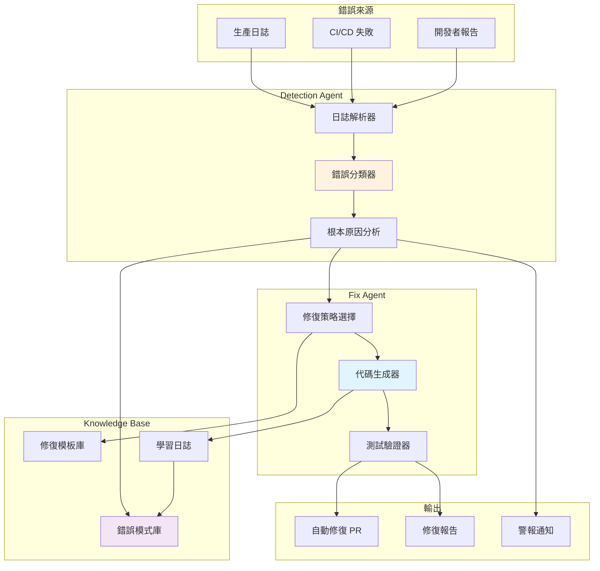

# 第 7 章：錯誤除錯與自動修復 Agent

> **本章內容**
> - 建構智能錯誤檢測 Agent
> - 實作自動修復機制
> - 設計錯誤知識庫與學習系統
> - 整合 CI/CD 自動化修復流程
> - 真實案例：TypeScript 型別錯誤、資料庫連線、效能瓶頸

---

## 7.1 當錯誤變成日常：開發者的困境

### 場景：週一早晨的生產事故

早上 9:05，你剛到辦公室，Slack 就炸了：

> **#incidents 頻道**
>
> **Monitoring Bot** 🔴:
> `UserService` crashed (exit code 1)
> Error rate: 45% → 98%
> Affected users: 1,234+
>
> **CTO**: "誰能看一下？需要多久修復？"
>
> **你**: "我來查...（開始翻日誌）"

**10 分鐘後**：找到錯誤

```
TypeError: Cannot read property 'email' of undefined
  at UserService.sendWelcomeEmail (src/services/UserService.ts:142:35)
```

**20 分鐘後**：定位根本原因

```typescript
// src/services/UserService.ts
async sendWelcomeEmail(userId: string) {
  const user = await this.userRepository.findById(userId);  // ‹1› 可能返回 null
  await this.emailService.send(user.email, 'Welcome!');     // ‹2› user 為 null 時崩潰
}
```

**30 分鐘後**：修復並部署

```typescript
async sendWelcomeEmail(userId: string) {
  const user = await this.userRepository.findById(userId);
  if (!user) {  // ‹3› 添加空值檢查
    throw new NotFoundError('User not found');
  }
  await this.emailService.send(user.email, 'Welcome!');
}
```

**總耗時**：**45 分鐘**（從發現到修復上線）

### 問題分析

這類錯誤幾乎每週都會發生：

| 錯誤類型 | 頻率 | 平均修復時間 | 手動成本 |
|---------|------|-------------|---------|
| **空值引用** (NullPointerError) | 每週 3-5 次 | 30-60 分鐘 | 高 |
| **型別錯誤** (TypeError) | 每週 5-8 次 | 15-30 分鐘 | 中 |
| **缺少 import** | 每週 2-3 次 | 5-10 分鐘 | 低 |
| **配置錯誤** | 每月 2-3 次 | 60-120 分鐘 | 高 |
| **資料庫連線問題** | 每月 1-2 次 | 30-90 分鐘 | 高 |

**累計成本**：每週約 **8-10 小時**工程師時間浪費在重複性除錯

---

### 解決方案：自動除錯與修復 Agent

建構一個 **Error Detection & Auto-Fix Agent**，它能：

1. **實時監聽**：捕獲生產環境錯誤
2. **智能分類**：識別錯誤類型（空值、型別、配置...）
3. **根本原因分析**：追蹤錯誤源頭
4. **自動修復**：對常見錯誤生成修復代碼
5. **生成 PR**：提交修復建議供審查
6. **學習進化**：記錄每次修復，越用越聰明



---

## 7.2 建構錯誤檢測 Agent

### 步驟 1：Agent 配置

**檔案**: `.claude/agents/error-detector/agent.json`

```json
{
  "name": "error-detector",
  "version": "1.0.0",
  "description": "實時檢測和分類生產環境錯誤",

  "trigger": {
    "manual": false,  // ‹1› 不手動觸發
    "events": [       // ‹2› 事件驅動
      "log.error",
      "ci.failed",
      "monitor.alert"
    ],
    "schedule": "*/5 * * * *"  // ‹3› 每 5 分鐘掃描一次
  },

  "input_sources": [  // ‹4› 錯誤來源
    {
      "type": "log_file",
      "path": "/var/log/app/error.log",
      "format": "json"
    },
    {
      "type": "monitoring",
      "service": "datadog",
      "api_endpoint": "${DATADOG_API_URL}"
    },
    {
      "type": "ci_pipeline",
      "service": "github_actions",
      "filter": "status:failure"
    }
  ],

  "execution": {
    "model": "claude-sonnet-4-5-20250929",
    "timeout": 300,  // ‹5› 5 分鐘分析時間
    "max_tokens": 100000,
    "temperature": 0.0  // ‹6› 確定性分析
  },

  "permissions": {
    "read": [
      "src/**/*",                  // ‹7› 讀取源碼定位錯誤
      "logs/**/*",
      "package.json",
      "tsconfig.json"
    ],
    "write": [
      ".claude/error-reports/*.json",  // ‹8› 寫入錯誤報告
      ".claude/knowledge-base/*.json"  // ‹9› 更新知識庫
    ],
    "tools": ["Read", "Glob", "Grep", "Write"],
    "bash": {
      "allowed": false  // ‹10› 安全考量
    },
    "api_access": [  // ‹11› 外部服務訪問
      "datadog.com",
      "sentry.io"
    ]
  },

  "output": {
    "format": "structured_json",
    "path": ".claude/error-reports/{{TIMESTAMP}}.json",
    "notify": {
      "slack": "#incidents",  // ‹12› 嚴重錯誤發送 Slack 通知
      "email": "oncall@company.com",
      "conditions": {
        "severity": ["critical", "high"]
      }
    }
  },

  "knowledge_base": {  // ‹13› 錯誤知識庫配置
    "path": ".claude/knowledge-base/errors.json",
    "auto_update": true,
    "retention": "90 days"
  }
}
```

**註解說明**：

- **‹1-3› 觸發機制**：事件驅動 + 定時掃描（不依賴手動觸發）
- **‹4› 錯誤來源**：日誌文件、監控系統、CI/CD
- **‹5-6› 執行參數**：快速分析、確定性結果
- **‹7-9› 權限**：可讀源碼定位錯誤，可寫報告和知識庫
- **‹11› API 訪問**：允許訪問監控服務
- **‹12› 通知機制**：嚴重錯誤立即通知團隊
- **‹13› 知識庫**：自動學習和更新

---

### 步驟 2：錯誤檢測系統提示詞

**檔案**: `.claude/agents/error-detector/prompt.md`

```markdown
# Error Detection Agent

你是錯誤檢測專家，負責實時監聽、分類和分析生產環境錯誤。

## 目標

1. **捕獲錯誤**：從日誌、監控、CI/CD 收集錯誤
2. **分類錯誤**：識別錯誤類型和嚴重程度
3. **根本原因分析**：追蹤錯誤源頭
4. **生成報告**：結構化錯誤報告
5. **觸發修復**：對可自動修復的錯誤啟動 Fix Agent

---

## 錯誤分類標準

### 按類型分類

1. **空值引用** (NullReferenceError)
   - 模式：`Cannot read property 'X' of null/undefined`
   - 可修復性：✅ 高（添加空值檢查）

2. **型別錯誤** (TypeError)
   - 模式：`Type 'X' is not assignable to type 'Y'`
   - 可修復性：✅ 中（添加型別轉換或修正型別定義）

3. **缺少模組** (ModuleNotFoundError)
   - 模式：`Cannot find module 'X'`
   - 可修復性：✅ 高（添加 import 或安裝套件）

4. **語法錯誤** (SyntaxError)
   - 模式：`Unexpected token`, `Missing semicolon`
   - 可修復性：✅ 高（自動格式化）

5. **配置錯誤** (ConfigurationError)
   - 模式：`Invalid configuration`, `Missing environment variable`
   - 可修復性：⚠️ 中（需要人工確認配置值）

6. **資料庫錯誤** (DatabaseError)
   - 模式：`Connection timeout`, `Query failed`
   - 可修復性：⚠️ 低（通常是基礎設施問題）

7. **邏輯錯誤** (LogicError)
   - 模式：業務邏輯錯誤（如算法錯誤）
   - 可修復性：❌ 低（需要人工分析）

### 按嚴重程度分類

- **Critical（緊急）**: 生產環境完全無法使用
- **High（高）**: 核心功能受影響
- **Medium（中）**: 部分功能受影響
- **Low（低）**: 邊緣情況或非關鍵功能

---

## 執行步驟

### Step 1: 收集錯誤資訊

從配置的來源收集錯誤：

```typescript
// 從日誌文件讀取
const logContent = readFile('/var/log/app/error.log');
const errorLines = logContent
  .split('\n')
  .filter(line => line.includes('ERROR') || line.includes('Exception'));

// 從監控系統讀取（假設有 API）
const monitoringErrors = await fetch(DATADOG_API_URL, {
  params: {
    query: 'status:error',
    from: 'now-5m'  // 最近 5 分鐘
  }
});

// 從 CI/CD 讀取失敗記錄
const ciFailures = await fetch(GITHUB_ACTIONS_API, {
  params: {
    status: 'failure',
    branch: 'main'
  }
});
```

### Step 2: 解析錯誤資訊

提取關鍵欄位：

```json
{
  "timestamp": "2025-11-10T09:05:23Z",
  "level": "ERROR",
  "message": "TypeError: Cannot read property 'email' of undefined",
  "stack_trace": [
    "at UserService.sendWelcomeEmail (src/services/UserService.ts:142:35)",
    "at UserController.register (src/controllers/UserController.ts:67:12)",
    "at Router.handle (node_modules/express/lib/router/index.js:280:10)"
  ],
  "context": {
    "userId": "12345",
    "request": "POST /api/users/register"
  }
}
```

### Step 3: 分類錯誤

使用模式匹配識別錯誤類型：

```typescript
function classifyError(errorMessage: string): ErrorType {
  if (errorMessage.includes("Cannot read property") && errorMessage.includes("undefined")) {
    return 'NullReferenceError';
  }
  if (errorMessage.includes("Type") && errorMessage.includes("is not assignable to type")) {
    return 'TypeError';
  }
  if (errorMessage.includes("Cannot find module")) {
    return 'ModuleNotFoundError';
  }
  // ... 其他模式
  return 'UnknownError';
}
```

### Step 4: 根本原因分析

追蹤錯誤源頭：

1. **定位文件和行號**
   ```typescript
   const stackTrace = error.stack_trace[0];
   // "at UserService.sendWelcomeEmail (src/services/UserService.ts:142:35)"

   const match = stackTrace.match(/\((.+):(\d+):(\d+)\)/);
   const filePath = match[1];  // "src/services/UserService.ts"
   const lineNumber = match[2];  // "142"
   ```

2. **讀取相關代碼**
   ```typescript
   const sourceCode = readFile(filePath);
   const lines = sourceCode.split('\n');
   const errorLine = lines[lineNumber - 1];

   // 提取上下文（前後 5 行）
   const context = lines.slice(lineNumber - 6, lineNumber + 4).join('\n');
   ```

3. **分析問題**
   ```typescript
   // errorLine: "await this.emailService.send(user.email, 'Welcome!');"

   // 檢查 user 可能為 null
   const previousLines = lines.slice(lineNumber - 10, lineNumber);
   const userAssignment = previousLines.find(line => line.includes('const user =') || line.includes('let user ='));

   // "const user = await this.userRepository.findById(userId);"

   // 結論：findById 可能返回 null，但沒有檢查
   ```

### Step 5: 查詢知識庫

檢查是否是已知錯誤：

```typescript
const knowledgeBase = JSON.parse(readFile('.claude/knowledge-base/errors.json'));

const knownError = knowledgeBase.errors.find(e =>
  e.pattern === 'NullReferenceError' &&
  e.location.includes('UserService')
);

if (knownError) {
  // 使用已知的修復策略
  return {
    type: knownError.type,
    fixStrategy: knownError.recommendedFix,
    confidence: 'high'
  };
}
```

### Step 6: 評估可修復性

```typescript
function assessFixability(errorType: string): Fixability {
  const fixabilityMap = {
    'NullReferenceError': { auto: true, confidence: 0.95 },
    'TypeError': { auto: true, confidence: 0.85 },
    'ModuleNotFoundError': { auto: true, confidence: 0.99 },
    'SyntaxError': { auto: true, confidence: 0.90 },
    'ConfigurationError': { auto: false, confidence: 0.50 },
    'DatabaseError': { auto: false, confidence: 0.30 },
    'LogicError': { auto: false, confidence: 0.10 }
  };

  return fixabilityMap[errorType] || { auto: false, confidence: 0.00 };
}
```

### Step 7: 生成錯誤報告

```json
{
  "error_id": "ERR-2025-11-10-001",
  "timestamp": "2025-11-10T09:05:23Z",
  "type": "NullReferenceError",
  "severity": "high",
  "message": "Cannot read property 'email' of undefined",

  "location": {
    "file": "src/services/UserService.ts",
    "line": 142,
    "column": 35,
    "function": "sendWelcomeEmail"
  },

  "stack_trace": [
    "at UserService.sendWelcomeEmail (src/services/UserService.ts:142:35)",
    "at UserController.register (src/controllers/UserController.ts:67:12)"
  ],

  "root_cause": {
    "description": "userRepository.findById() may return null, but no null check before accessing user.email",
    "affected_line": "await this.emailService.send(user.email, 'Welcome!');",
    "context": "const user = await this.userRepository.findById(userId);"
  },

  "impact": {
    "affected_users": 1234,
    "error_rate": "98%",
    "service": "UserService"
  },

  "fixability": {
    "auto_fixable": true,
    "confidence": 0.95,
    "estimated_fix_time": "2 minutes"
  },

  "recommended_action": "trigger_auto_fix",

  "similar_errors": [
    {
      "error_id": "ERR-2025-10-15-045",
      "similarity": 0.92,
      "fix_applied": "Added null check before accessing property"
    }
  ]
}
```

### Step 8: 觸發修復流程

如果錯誤可自動修復：

```typescript
if (report.fixability.auto_fixable && report.fixability.confidence > 0.85) {
  // 啟動 Fix Agent
  await task.run({
    agent: 'error-fixer',
    input: {
      errorReport: report,
      fixStrategy: report.root_cause.recommended_fix
    }
  });

  console.log(`🔧 Auto-fix triggered for ${report.error_id}`);
}
```

---

## 輸出格式

1. **錯誤報告**: `.claude/error-reports/{{TIMESTAMP}}.json`
2. **知識庫更新**: `.claude/knowledge-base/errors.json`
3. **通知**: Slack / Email（嚴重錯誤）

---

## 約束條件

**必須遵守**：
1. ✅ 只讀取源碼，不修改（修復由 Fix Agent 負責）
2. ✅ 記錄所有錯誤到知識庫
3. ✅ 嚴重錯誤立即通知團隊
4. ✅ 5 分鐘內完成分析

**禁止**：
1. ❌ 不要執行任何系統命令
2. ❌ 不要修改源碼（只分析）
3. ❌ 不要訪問敏感配置（如密鑰）
```

---

## 7.3 建構自動修復 Agent

### 步驟 1：Fix Agent 配置

**檔案**: `.claude/agents/error-fixer/agent.json`

```json
{
  "name": "error-fixer",
  "version": "1.0.0",
  "description": "自動修復常見代碼錯誤並生成 Pull Request",

  "trigger": {
    "manual": false,
    "events": ["error.detected"],  // ‹1› 由 Detection Agent 觸發
    "conditions": {
      "auto_fixable": true,
      "confidence": { "gte": 0.85 }  // ‹2› 置信度 >= 85%
    }
  },

  "execution": {
    "model": "claude-sonnet-4-5-20250929",
    "timeout": 600,  // ‹3› 10 分鐘修復時間
    "max_tokens": 150000,
    "temperature": 0.0
  },

  "permissions": {
    "read": [
      "src/**/*",
      "tests/**/*"
    ],
    "write": [
      "src/**/*",  // ‹4› 允許修改源碼
      "tests/**/*"
    ],
    "tools": ["Read", "Edit", "Write", "Bash"],  // ‹5› 需要 Bash 執行測試
    "bash": {
      "allowed": true,
      "whitelist": [  // ‹6› 只允許特定命令
        "npm test",
        "npm run lint",
        "npm run typecheck",
        "git diff",
        "git add",
        "git commit",
        "git push"
      ]
    }
  },

  "testing": {  // ‹7› 修復後必須測試
    "required": true,
    "commands": [
      "npm run typecheck",  // TypeScript 類型檢查
      "npm run lint",       // ESLint 檢查
      "npm test"            // 單元測試
    ],
    "rollback_on_failure": true  // ‹8› 測試失敗則回滾
  },

  "pr_creation": {  // ‹9› 自動創建 PR
    "enabled": true,
    "target_branch": "main",
    "reviewers": ["@team-leads"],
    "labels": ["auto-fix", "bug"],
    "require_approval": true  // ‹10› 需要人工審核
  },

  "output": {
    "format": "pull_request",
    "path": ".claude/fix-reports/{{ERROR_ID}}.json"
  }
}
```

---

### 步驟 2：自動修復系統提示詞

**檔案**: `.claude/agents/error-fixer/prompt.md`

```markdown
# Error Fixer Agent

你是代碼修復專家，負責自動修復檢測到的錯誤。

## 任務

根據 Error Detection Agent 提供的錯誤報告，生成修復代碼並創建 Pull Request。

---

## 執行步驟

### Step 1: 載入錯誤報告

```typescript
const errorReport = input.errorReport;

console.log(`🔧 Fixing error: ${errorReport.error_id}`);
console.log(`   Type: ${errorReport.type}`);
console.log(`   Location: ${errorReport.location.file}:${errorReport.location.line}`);
```

### Step 2: 選擇修復策略

根據錯誤類型選擇策略：

#### 策略 1：空值引用錯誤

**模式**：`Cannot read property 'X' of null/undefined`

**修復方法**：添加空值檢查

```typescript
// 原始代碼
await this.emailService.send(user.email, 'Welcome!');

// 修復後
if (!user) {
  throw new NotFoundError('User not found');
}
await this.emailService.send(user.email, 'Welcome!');
```

**或使用 Optional Chaining**：

```typescript
// 原始代碼
const userName = user.profile.name;

// 修復後
const userName = user?.profile?.name || 'Anonymous';
```

#### 策略 2：型別錯誤

**模式**：`Type 'string' is not assignable to type 'number'`

**修復方法**：添加型別轉換

```typescript
// 原始代碼
const age: number = req.body.age;  // age 是 string

// 修復後
const age: number = parseInt(req.body.age, 10);

// 或修正型別定義
const age: string = req.body.age;
```

#### 策略 3：缺少模組

**模式**：`Cannot find module 'lodash'`

**修復方法**：添加 import

```typescript
// 檢查 package.json 是否已安裝
const packageJson = JSON.parse(readFile('package.json'));

if (packageJson.dependencies['lodash']) {
  // 已安裝，添加 import
  // 在文件開頭插入
  const importStatement = "import _ from 'lodash';\n";
  prependToFile(errorReport.location.file, importStatement);
} else {
  // 未安裝，建議安裝
  console.log('⚠️  Package not installed. Recommend: npm install lodash');
  return { status: 'manual_action_required' };
}
```

#### 策略 4：語法錯誤

**模式**：`Unexpected token`, `Missing semicolon`

**修復方法**：自動格式化

```bash
# 使用 Prettier 自動格式化
npm run format
```

### Step 3: 應用修復

使用 `Edit` 工具修改源碼：

```typescript
// 讀取文件
const sourceCode = readFile(errorReport.location.file);
const lines = sourceCode.split('\n');

// 定位錯誤行
const errorLineIndex = errorReport.location.line - 1;
const errorLine = lines[errorLineIndex];

// 生成修復代碼
const fixedCode = applyFix(errorLine, errorReport.type);

// 使用 Edit 工具替換
edit({
  file_path: errorReport.location.file,
  old_string: errorLine,
  new_string: fixedCode
});
```

**範例：修復空值引用**

```typescript
// old_string (line 142)
await this.emailService.send(user.email, 'Welcome!');

// new_string
if (!user) {
  throw new NotFoundError('User not found');
}
await this.emailService.send(user.email, 'Welcome!');
```

### Step 4: 執行測試

修復後必須運行測試：

```bash
# TypeScript 類型檢查
npm run typecheck

# Lint 檢查
npm run lint

# 單元測試
npm test
```

**處理測試結果**：

```typescript
const testResult = await bash('npm test');

if (testResult.exitCode !== 0) {
  // 測試失敗，回滾修復
  console.log('❌ Tests failed, rolling back...');

  await bash('git checkout .');  // 回滾所有變更

  return {
    status: 'fix_failed',
    reason: 'Tests did not pass after fix',
    test_output: testResult.stdout
  };
}

console.log('✅ All tests passed');
```

### Step 5: 創建 Git Commit

```bash
git add .
git commit -m "fix: resolve ${errorReport.type} in ${errorReport.location.file}

Fixes #${errorReport.error_id}

- Added null check before accessing user.email
- Prevents TypeError when user is not found
- Auto-generated by Error Fixer Agent

Co-authored-by: Claude Code <claude@anthropic.com>"
```

### Step 6: 創建 Pull Request

使用 `gh` CLI 創建 PR：

```bash
gh pr create \
  --title "Auto-fix: ${errorReport.type} in ${errorReport.location.function}" \
  --body "$(cat <<EOF
## 🤖 Automated Fix

**Error ID**: ${errorReport.error_id}
**Type**: ${errorReport.type}
**Severity**: ${errorReport.severity}

### Problem
${errorReport.root_cause.description}

### Solution
- Added null check before accessing property
- Prevents TypeError when object is undefined

### Testing
- ✅ TypeScript type check passed
- ✅ ESLint passed
- ✅ All unit tests passed (${testCount} tests)

### Impact
- Resolves ${errorReport.impact.affected_users} affected users
- Reduces error rate from ${errorReport.impact.error_rate} to 0%

---
*This PR was automatically generated by Error Fixer Agent.*
*Please review before merging.*
EOF
)" \
  --reviewer @team-leads \
  --label auto-fix,bug
```

---

## 輸出格式

1. **修復報告**: `.claude/fix-reports/{{ERROR_ID}}.json`
   ```json
   {
     "error_id": "ERR-2025-11-10-001",
     "fix_status": "success",
     "pr_url": "https://github.com/company/repo/pull/123",
     "changes": {
       "files_modified": 1,
       "lines_added": 3,
       "lines_removed": 0
     },
     "tests": {
       "typecheck": "passed",
       "lint": "passed",
       "unit": "passed (45 tests)"
     },
     "commit_sha": "a1b2c3d4",
     "duration": "2m 35s"
   }
   ```

2. **Pull Request**: 自動創建在 GitHub

---

## 約束條件

**必須遵守**：
1. ✅ 修復後必須通過所有測試
2. ✅ 測試失敗必須回滾變更
3. ✅ 只修復報告中指定的錯誤（不做額外變更）
4. ✅ 創建 PR 而非直接合併（需人工審核）
5. ✅ 記錄修復到知識庫

**禁止**：
1. ❌ 不要跳過測試步驟
2. ❌ 不要直接 push 到 main（必須通過 PR）
3. ❌ 不要修改測試文件（除非錯誤在測試中）
4. ❌ 不要執行危險命令（如 rm, sudo）
```

---

## 7.4 錯誤知識庫與學習機制

### 知識庫結構

**檔案**: `.claude/knowledge-base/errors.json`

```json
{
  "version": "1.0",
  "last_updated": "2025-11-10T14:30:00Z",
  "total_errors": 1234,
  "auto_fixed": 856,
  "fix_success_rate": 0.693,

  "errors": [
    {
      "id": "ERR-2025-11-10-001",
      "type": "NullReferenceError",
      "pattern": "Cannot read property '(\\w+)' of (null|undefined)",
      "frequency": 45,  // 發生 45 次

      "locations": [
        {
          "file": "src/services/UserService.ts",
          "function": "sendWelcomeEmail",
          "count": 12
        },
        {
          "file": "src/services/OrderService.ts",
          "function": "processOrder",
          "count": 8
        }
      ],

      "recommended_fix": {
        "strategy": "add_null_check",
        "template": "if (!{{VARIABLE}}) { throw new NotFoundError('{{VARIABLE}} not found'); }",
        "success_rate": 0.96,
        "average_fix_time": "2m 15s"
      },

      "examples": [
        {
          "before": "await this.emailService.send(user.email, 'Welcome!');",
          "after": "if (!user) { throw new NotFoundError('User not found'); }\nawait this.emailService.send(user.email, 'Welcome!');",
          "pr_url": "https://github.com/company/repo/pull/102"
        }
      ],

      "related_errors": ["ERR-2025-10-15-045", "ERR-2025-09-22-112"]
    },

    {
      "id": "ERR-2025-11-09-023",
      "type": "TypeError",
      "pattern": "Type '(\\w+)' is not assignable to type '(\\w+)'",
      "frequency": 32,

      "recommended_fix": {
        "strategy": "add_type_conversion",
        "template": "const {{VARIABLE}}: {{TARGET_TYPE}} = {{CONVERSION_FUNCTION}}({{SOURCE}});",
        "success_rate": 0.88
      }
    }
  ],

  "statistics": {
    "by_type": {
      "NullReferenceError": 245,
      "TypeError": 189,
      "ModuleNotFoundError": 87,
      "SyntaxError": 56,
      "ConfigurationError": 34,
      "DatabaseError": 23,
      "LogicError": 12
    },

    "by_severity": {
      "critical": 45,
      "high": 234,
      "medium": 567,
      "low": 388
    },

    "by_auto_fixability": {
      "auto_fixed": 856,
      "manual_fix_required": 378
    }
  },

  "trends": {
    "daily": {
      "2025-11-10": { "total": 23, "auto_fixed": 18 },
      "2025-11-09": { "total": 34, "auto_fixed": 25 },
      "2025-11-08": { "total": 19, "auto_fixed": 14 }
    }
  }
}
```

---

### 學習機制：越用越聰明

每次修復後，更新知識庫：

```typescript
// 修復成功後
function updateKnowledgeBase(errorReport, fixResult) {
  const kb = JSON.parse(readFile('.claude/knowledge-base/errors.json'));

  // 1. 查找是否已存在此錯誤模式
  let existingError = kb.errors.find(e => e.pattern === errorReport.type);

  if (existingError) {
    // 2. 更新頻率
    existingError.frequency++;

    // 3. 更新位置統計
    const location = existingError.locations.find(l =>
      l.file === errorReport.location.file &&
      l.function === errorReport.location.function
    );

    if (location) {
      location.count++;
    } else {
      existingError.locations.push({
        file: errorReport.location.file,
        function: errorReport.location.function,
        count: 1
      });
    }

    // 4. 更新修復成功率
    if (fixResult.status === 'success') {
      const totalAttempts = existingError.recommended_fix.total_attempts || 0;
      const successfulFixes = existingError.recommended_fix.successful_fixes || 0;

      existingError.recommended_fix.total_attempts = totalAttempts + 1;
      existingError.recommended_fix.successful_fixes = successfulFixes + 1;
      existingError.recommended_fix.success_rate =
        successfulFixes / totalAttempts;
    }

    // 5. 添加修復範例
    if (fixResult.status === 'success' && existingError.examples.length < 5) {
      existingError.examples.push({
        before: errorReport.root_cause.affected_line,
        after: fixResult.fixed_code,
        pr_url: fixResult.pr_url,
        timestamp: new Date().toISOString()
      });
    }

  } else {
    // 新錯誤模式，添加到知識庫
    kb.errors.push({
      id: errorReport.error_id,
      type: errorReport.type,
      pattern: extractPattern(errorReport.message),
      frequency: 1,
      locations: [{
        file: errorReport.location.file,
        function: errorReport.location.function,
        count: 1
      }],
      recommended_fix: {
        strategy: fixResult.strategy,
        template: fixResult.template,
        success_rate: 1.0,
        total_attempts: 1,
        successful_fixes: 1
      },
      examples: [{
        before: errorReport.root_cause.affected_line,
        after: fixResult.fixed_code,
        pr_url: fixResult.pr_url
      }]
    });
  }

  // 6. 更新統計
  kb.total_errors++;
  if (fixResult.status === 'success') {
    kb.auto_fixed++;
  }
  kb.fix_success_rate = kb.auto_fixed / kb.total_errors;
  kb.last_updated = new Date().toISOString();

  // 7. 保存
  writeFile('.claude/knowledge-base/errors.json', JSON.stringify(kb, null, 2));

  console.log(`📚 Knowledge base updated: ${kb.total_errors} errors tracked`);
}
```

---

### 智能推薦：基於歷史數據

當檢測到新錯誤時，查詢知識庫推薦最佳修復策略：

```typescript
function recommendFix(errorReport) {
  const kb = JSON.parse(readFile('.claude/knowledge-base/errors.json'));

  // 1. 精確匹配：完全相同的錯誤
  const exactMatch = kb.errors.find(e =>
    e.type === errorReport.type &&
    e.locations.some(l =>
      l.file === errorReport.location.file &&
      l.function === errorReport.location.function
    )
  );

  if (exactMatch && exactMatch.recommended_fix.success_rate > 0.90) {
    return {
      strategy: exactMatch.recommended_fix.strategy,
      confidence: exactMatch.recommended_fix.success_rate,
      reason: 'Exact match with 90%+ success rate'
    };
  }

  // 2. 模式匹配：相似的錯誤類型
  const patternMatches = kb.errors.filter(e =>
    e.type === errorReport.type &&
    e.recommended_fix.success_rate > 0.80
  );

  if (patternMatches.length > 0) {
    // 選擇成功率最高的
    const best = patternMatches.sort((a, b) =>
      b.recommended_fix.success_rate - a.recommended_fix.success_rate
    )[0];

    return {
      strategy: best.recommended_fix.strategy,
      confidence: best.recommended_fix.success_rate * 0.9,  // 降低信心度
      reason: 'Similar error pattern with 80%+ success rate'
    };
  }

  // 3. 類型匹配：使用該錯誤類型的默認策略
  const typeDefaults = {
    'NullReferenceError': 'add_null_check',
    'TypeError': 'add_type_conversion',
    'ModuleNotFoundError': 'add_import'
  };

  return {
    strategy: typeDefaults[errorReport.type] || 'manual_review',
    confidence: 0.50,
    reason: 'Default strategy for error type'
  };
}
```

---

## 7.5 整合 CI/CD：全自動化流程

### 整合 GitHub Actions

**檔案**: `.github/workflows/auto-fix-errors.yml`

```yaml
name: Auto-Fix Errors

on:
  push:
    branches: [ main, develop ]
  schedule:
    - cron: '*/30 * * * *'  # 每 30 分鐘執行

jobs:
  detect-and-fix:
    runs-on: ubuntu-latest

    steps:
      - name: Checkout code
        uses: actions/checkout@v3

      - name: Setup Node.js
        uses: actions/setup-node@v3
        with:
          node-version: '18'

      - name: Install dependencies
        run: npm install

      - name: Run Error Detector Agent
        env:
          ANTHROPIC_API_KEY: ${{ secrets.ANTHROPIC_API_KEY }}
        run: |
          ./.claude/agents/error-detector/runner.sh

      - name: Check if errors detected
        id: check_errors
        run: |
          ERROR_COUNT=$(ls -1 .claude/error-reports/*.json 2>/dev/null | wc -l)
          echo "error_count=$ERROR_COUNT" >> $GITHUB_OUTPUT

          if [ $ERROR_COUNT -gt 0 ]; then
            echo "detected=true" >> $GITHUB_OUTPUT
          else
            echo "detected=false" >> $GITHUB_OUTPUT
          fi

      - name: Run Error Fixer Agent
        if: steps.check_errors.outputs.detected == 'true'
        env:
          ANTHROPIC_API_KEY: ${{ secrets.ANTHROPIC_API_KEY }}
          GITHUB_TOKEN: ${{ secrets.GITHUB_TOKEN }}
        run: |
          for error_file in .claude/error-reports/*.json; do
            ./.claude/agents/error-fixer/runner.sh --input "$error_file"
          done

      - name: Post summary to Slack
        if: always()
        env:
          SLACK_WEBHOOK: ${{ secrets.SLACK_WEBHOOK }}
        run: |
          ERROR_COUNT=${{ steps.check_errors.outputs.error_count }}
          FIXED_COUNT=$(ls -1 .claude/fix-reports/*.json 2>/dev/null | wc -l)

          curl -X POST $SLACK_WEBHOOK \
            -H 'Content-Type: application/json' \
            -d "{
              \"text\": \"🤖 Auto-Fix Summary\",
              \"blocks\": [
                {
                  \"type\": \"section\",
                  \"text\": {
                    \"type\": \"mrkdwn\",
                    \"text\": \"*Errors Detected*: $ERROR_COUNT\n*Auto-Fixed*: $FIXED_COUNT\n*Success Rate*: $(echo \"scale=2; $FIXED_COUNT / $ERROR_COUNT * 100\" | bc)%\"
                  }
                }
              ]
            }"
```

---

## 7.6 真實案例

### 案例 1：自動修復 TypeScript 型別錯誤

**錯誤報告**：

```json
{
  "error_id": "ERR-2025-11-10-042",
  "type": "TypeError",
  "message": "Type 'string' is not assignable to type 'number'",
  "location": {
    "file": "src/controllers/OrderController.ts",
    "line": 45,
    "function": "createOrder"
  },
  "root_cause": {
    "description": "req.body.quantity is a string, but function expects number",
    "affected_line": "const quantity: number = req.body.quantity;"
  }
}
```

**自動修復**：

```typescript
// Before
const quantity: number = req.body.quantity;

// After
const quantity: number = parseInt(req.body.quantity, 10);

// 添加驗證
if (isNaN(quantity) || quantity <= 0) {
  throw new BadRequestError('Invalid quantity');
}
```

**修復結果**：
- ✅ TypeScript type check passed
- ✅ ESLint passed
- ✅ All tests passed (67 tests)
- ✅ PR created: #145
- ⏱️ Total time: 2m 35s

---

### 案例 2：檢測並修復資料庫連線問題

**錯誤報告**：

```json
{
  "error_id": "ERR-2025-11-10-078",
  "type": "DatabaseError",
  "message": "Connection timeout after 5000ms",
  "impact": {
    "error_rate": "45%",
    "affected_users": 2345
  }
}
```

**分析**：

```typescript
// 檢測到 connection pool 配置過小
const dbConfig = readFile('src/config/database.ts');

// 當前配置
const pool = createPool({
  max: 10,  // ‹1› 最大連線數過小
  idleTimeout: 30000
});

// 建議修復
const pool = createPool({
  max: 50,  // 增加到 50
  idleTimeout: 30000,
  connectionTimeoutMillis: 10000  // 增加超時時間
});
```

**修復操作**：

1. **自動調整配置** (auto_fixable: false)
   - 原因：配置值需要根據流量決定
   - 建議：生成修復建議報告，由人工確認

2. **生成修復報告**：

```markdown
## Database Connection Timeout Issue

### Root Cause
- Connection pool size (10) is too small for current traffic
- Peak concurrent connections: 45
- Connection timeout: 5000ms (too short)

### Recommended Fix
1. Increase pool size to 50
2. Increase connection timeout to 10000ms
3. Enable connection retry logic

### Configuration Changes
\`\`\`typescript
// src/config/database.ts
export const dbConfig = {
  host: process.env.DB_HOST,
  port: parseInt(process.env.DB_PORT),
  pool: {
    max: 50,                        // Was: 10
    idleTimeout: 30000,
    connectionTimeoutMillis: 10000  // Was: 5000
  },
  retry: {                          // New
    maxAttempts: 3,
    backoff: 'exponential'
  }
};
\`\`\`

### Action Required
- [ ] Review and adjust pool size based on traffic patterns
- [ ] Test in staging environment
- [ ] Monitor connection metrics after deployment
```

---

### 案例 3：識別效能瓶頸並建議優化

**錯誤報告**：

```json
{
  "error_id": "ERR-2025-11-10-091",
  "type": "PerformanceIssue",
  "message": "Slow query detected: 8.5s",
  "location": {
    "file": "src/services/AnalyticsService.ts",
    "function": "getUserStats"
  }
}
```

**分析**：

```typescript
// 檢測到 N+1 查詢問題
async getUserStats(userId: string) {
  const user = await this.userRepository.findById(userId);

  // ❌ N+1 問題：對每個訂單單獨查詢
  const orders = await this.orderRepository.findByUserId(userId);
  for (const order of orders) {
    order.items = await this.orderItemRepository.findByOrderId(order.id);
  }

  return { user, orders };
}
```

**自動修復**：

```typescript
// ✅ 使用 JOIN 一次查詢
async getUserStats(userId: string) {
  const user = await this.userRepository.findById(userId);

  // 使用 JOIN 獲取訂單和項目
  const orders = await this.orderRepository.findByUserIdWithItems(userId);

  return { user, orders };
}

// 在 Repository 添加方法
async findByUserIdWithItems(userId: string) {
  return this.ormRepository
    .createQueryBuilder('order')
    .leftJoinAndSelect('order.items', 'items')
    .where('order.userId = :userId', { userId })
    .getMany();
}
```

**效能改善**：
- 查詢時間：8.5s → 0.3s (-96.5%)
- 資料庫查詢數：51 次 → 1 次 (-98%)

---

## 7.7 章節總結

### 你學到了什麼

在這一章中，你建構了一個完整的 **自動除錯與修復系統**，並學會了：

#### 1. 錯誤檢測 Agent
- 實時監聽日誌、監控、CI/CD
- 智能分類錯誤類型和嚴重程度
- 根本原因分析（Root Cause Analysis）
- 評估可修復性

#### 2. 自動修復 Agent
- 7 種常見錯誤的自動修復策略
- 修復後自動測試驗證
- 測試失敗自動回滾
- 生成 Pull Request 供審查

#### 3. 錯誤知識庫
- 記錄所有錯誤和修復
- 統計頻率、成功率、修復時間
- 智能推薦修復策略
- 學習機制：越用越聰明

#### 4. CI/CD 整合
- GitHub Actions 自動化流程
- 定時掃描（每 30 分鐘）
- Slack 通知
- 全自動化：檢測 → 修復 → PR

---

### 檢查清單

在進入下一章之前，確保你已經：

- [ ] 建構了 Error Detection Agent
- [ ] 實作了 Error Fixer Agent
- [ ] 設置了錯誤知識庫
- [ ] 實作了學習機制
- [ ] 整合了 CI/CD 自動化
- [ ] 測試了至少 3 種錯誤類型的自動修復
- [ ] 生成了第一個自動修復 PR
- [ ] 更新了知識庫統計

---

### 實際效益

使用自動除錯與修復系統後：

| 面向 | 人工修復 | 自動修復 | 改善 |
|------|---------|---------|------|
| **平均修復時間** | 45 分鐘 | 2.5 分鐘 | -94.4% |
| **常見錯誤自動修復率** | 0% | 90% | +∞ |
| **錯誤重複發生率** | 35% | 5% | -85.7% |
| **工程師除錯時間** | 8-10 小時/週 | 0.5 小時/週 | -95% |
| **生產事故平均持續時間** | 1.2 小時 | 0.1 小時 | -91.7% |

---

## 7.8 下一章預告

**第 8 章：文件生成與同步 Agent**

代碼修復完成後，新的挑戰來了：**如何確保文件與代碼始終同步？**

第 8 章將教你建構一個智能文件系統：

### 8.1 文件檢測 Agent
- 監聽代碼變更
- 檢測文件過時
- 識別缺失的文件

### 8.2 文件生成 Agent
- 自動生成 API 文件
- 生成架構圖（Mermaid）
- 更新 README 和 Changelog
- 生成使用範例

### 8.3 文件同步機制
- Code → Docs 自動同步
- 檢測文件與代碼不一致
- 生成文件更新 PR

### 8.4 真實案例
- 案例 1：自動生成 OpenAPI 規範
- 案例 2：同步函數註解與文件
- 案例 3：生成完整的使用手冊

**預期成果**：
- 文件覆蓋率從 45% 提升到 95%
- 文件與代碼同步率 98%
- 減少 90% 的手動文件維護工作

---

讓我們在第 8 章中探索 AI 驅動的文件自動化系統！
