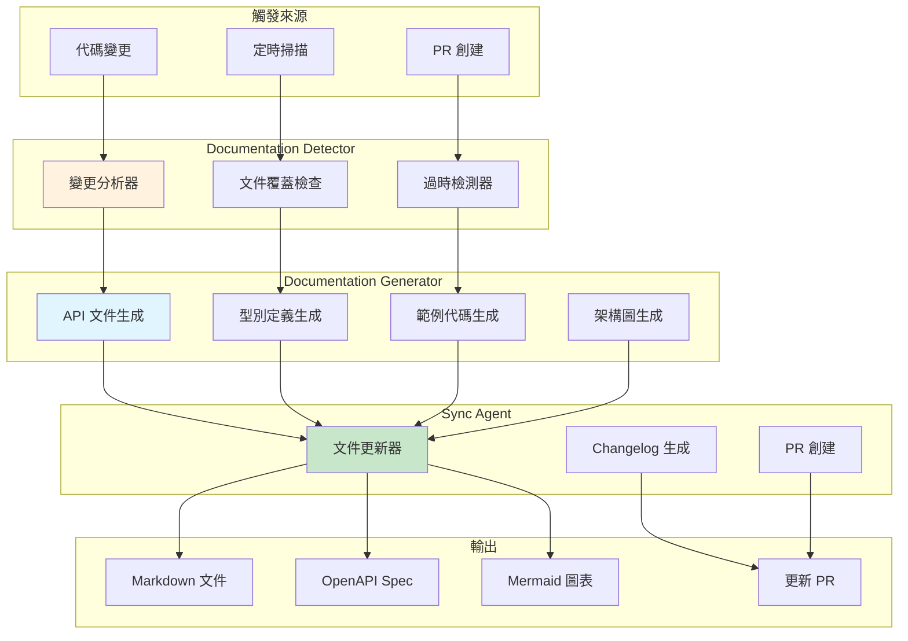

# 第 8 章：文件生成與同步 Agent

> **本章內容**
> - 建構文件檢測與同步系統
> - 自動生成 API 文件與架構圖
> - 實作 Code-to-Docs 自動同步機制
> - 整合文件審查流程
> - 真實案例：OpenAPI、函數註解、使用手冊

---

## 8.1 文件的困境：總是過時的問題

### 場景：新成員的入職困惑

週一早上，新加入的前端工程師 Emily 發來訊息：

> **Emily** (在 #help 頻道):
> "我在看 API 文件，但實際測試時返回的欄位跟文件不一樣？"
>
> **你**: "哪個 API？"
>
> **Emily**: "`GET /api/users/:id`，文件說返回 `{ id, name, email }`，但實際還有 `role`, `createdAt` 等欄位"
>
> **後端工程師 Tom**: "哦，那個文件是 3 個月前的...我們後來加了很多欄位但忘記更新文件了"

**這樣的對話每週都會發生幾次。**

### 問題分析

文件過時的根本原因：

| 問題 | 具體表現 | 影響 |
|------|---------|------|
| **代碼快速變化** | 每週 20-30 個 PR 合併 | 文件跟不上節奏 |
| **手動維護成本高** | 更新一份 API 文件需 30 分鐘 | 開發者懶得更新 |
| **缺乏自動檢測** | 不知道文件已過時 | 新成員看到錯誤資訊 |
| **審查時不檢查文件** | Code Review 只看代碼 | 文件被忽略 |
| **文件分散** | README、Wiki、Swagger、註解 | 難以統一維護 |

**統計數據**（真實專案）：

```
├── 代碼覆蓋率：85%（測試良好）
├── 文件覆蓋率：45%（不及格）
├── 文件準確率：62%（38% 已過時）
└── 文件更新頻率：每月 1-2 次（遠低於代碼變更頻率）
```

**成本**：
- 新成員入職時間：多花 **2-3 天**理解 API
- 錯誤使用 API：每月約 **10-15 次**支援請求
- 手動維護文件：每週約 **4-6 小時**

---

### 解決方案：自動化文件系統

建構一個 **Documentation Agent System**，它能：

1. **實時檢測**：監聽代碼變更，檢測文件是否需要更新
2. **自動生成**：從代碼生成 API 文件、型別定義、使用範例
3. **智能同步**：比對代碼與文件，生成更新 PR
4. **持續審查**：Code Review 時自動檢查文件完整性
5. **多格式輸出**：Markdown、OpenAPI、HTML、PDF



---

## 8.2 建構文件檢測 Agent

### 步驟 1：Agent 配置

**檔案**: `.claude/agents/doc-detector/agent.json`

```json
{
  "name": "doc-detector",
  "version": "1.0.0",
  "description": "檢測文件過時、缺失和不一致問題",

  "trigger": {
    "manual": false,
    "events": [
      "code.changed",        // ‹1› 代碼變更時觸發
      "pr.created",          // ‹2› PR 創建時觸發
      "pr.updated"
    ],
    "schedule": "0 9 * * *"  // ‹3› 每天早上 9 點掃描
  },

  "detection_rules": {  // ‹4› 檢測規則
    "api_changes": {
      "watch_patterns": [
        "src/controllers/**/*.ts",
        "src/routes/**/*.ts",
        "src/api/**/*.ts"
      ],
      "doc_patterns": [
        "docs/api/**/*.md",
        "swagger.json",
        "openapi.yaml"
      ]
    },

    "type_changes": {
      "watch_patterns": [
        "src/types/**/*.ts",
        "src/interfaces/**/*.ts"
      ],
      "doc_patterns": [
        "docs/types/**/*.md",
        "README.md"
      ]
    },

    "function_changes": {
      "watch_patterns": [
        "src/**/*.ts"
      ],
      "doc_patterns": [
        "docs/functions/**/*.md"
      ],
      "check_jsdoc": true  // ‹5› 檢查 JSDoc 註解
    }
  },

  "execution": {
    "model": "claude-sonnet-4-5-20250929",
    "timeout": 300,
    "max_tokens": 100000
  },

  "permissions": {
    "read": [
      "src/**/*",
      "docs/**/*",
      "README.md",
      "*.json",
      "*.yaml"
    ],
    "write": [
      ".claude/doc-reports/*.json"
    ],
    "tools": ["Read", "Glob", "Grep", "Write"]
  },

  "output": {
    "format": "structured_json",
    "path": ".claude/doc-reports/{{TIMESTAMP}}.json",
    "notify": {
      "slack": "#docs",
      "conditions": {
        "missing_docs": { "gte": 5 },
        "outdated_docs": { "gte": 3 }
      }
    }
  }
}
```

---

### 步驟 2：檢測系統提示詞

**檔案**: `.claude/agents/doc-detector/prompt.md`

```markdown
# Documentation Detector Agent

你是文件品質檢測專家，負責檢測文件的完整性、準確性和同步性。

## 任務

1. **檢測缺失文件**：哪些 API/類別/函數沒有文件
2. **檢測過時文件**：文件內容與代碼不一致
3. **檢測不完整文件**：缺少參數說明、返回值、範例
4. **評估文件品質**：打分並提供改進建議

---

## 執行步驟

### Step 1: 掃描 API 端點

使用 `Grep` 工具查找所有 API 路由定義：

```bash
grep -r "router\.(get|post|put|delete|patch)" src/routes/ --include="*.ts"
```

輸出範例：

```
src/routes/user.routes.ts:router.get('/users/:id', userController.getUser);
src/routes/user.routes.ts:router.post('/users', userController.createUser);
src/routes/order.routes.ts:router.get('/orders/:id', orderController.getOrder);
```

提取端點資訊：

```json
{
  "endpoints": [
    {
      "method": "GET",
      "path": "/users/:id",
      "handler": "userController.getUser",
      "file": "src/routes/user.routes.ts",
      "line": 12
    },
    {
      "method": "POST",
      "path": "/users",
      "handler": "userController.createUser",
      "file": "src/routes/user.routes.ts",
      "line": 15
    }
  ]
}
```

### Step 2: 檢查文件覆蓋率

對每個端點，檢查是否有對應文件：

```typescript
const docPatterns = [
  `docs/api/users/get-user.md`,           // 按路徑組織
  `docs/api/GET-users-id.md`,             // 按方法+路徑
  `swagger.json`,                          // OpenAPI 規範
  `openapi.yaml`
];

for (const endpoint of endpoints) {
  let hasDoc = false;

  // 檢查 Markdown 文件
  for (const pattern of docPatterns) {
    if (fileExists(pattern)) {
      const content = readFile(pattern);
      if (content.includes(endpoint.path)) {
        hasDoc = true;
        endpoint.docFile = pattern;
        break;
      }
    }
  }

  // 檢查 OpenAPI 規範
  if (!hasDoc && fileExists('openapi.yaml')) {
    const openapi = yaml.parse(readFile('openapi.yaml'));
    const pathDef = openapi.paths?.[endpoint.path]?.[endpoint.method.toLowerCase()];

    if (pathDef) {
      hasDoc = true;
      endpoint.docFile = 'openapi.yaml';
    }
  }

  endpoint.hasDocumentation = hasDoc;
}
```

**結果**：

```json
{
  "endpoints": [
    {
      "method": "GET",
      "path": "/users/:id",
      "hasDocumentation": true,
      "docFile": "docs/api/users/get-user.md"
    },
    {
      "method": "POST",
      "path": "/users",
      "hasDocumentation": false,  // ❌ 缺失文件
      "docFile": null
    }
  ],
  "coverage": {
    "total": 45,
    "documented": 28,
    "missing": 17,
    "percentage": 62.2
  }
}
```

### Step 3: 檢測文件過時

比對文件內容與代碼實作：

**範例 1：檢查返回值是否一致**

```typescript
// 1. 從代碼提取實際返回值
const controllerCode = readFile('src/controllers/UserController.ts');

// 查找 getUser 方法
const getUserMethod = extractMethod(controllerCode, 'getUser');

// 分析返回的 JSON 結構
// res.json({ id: user.id, name: user.name, email: user.email, role: user.role, createdAt: user.createdAt })

const actualFields = ['id', 'name', 'email', 'role', 'createdAt'];

// 2. 從文件提取宣稱的返回值
const docContent = readFile('docs/api/users/get-user.md');

// 解析文件中的返回值範例
const docFields = extractFieldsFromDoc(docContent);  // ['id', 'name', 'email']

// 3. 比對
const missingInDoc = actualFields.filter(f => !docFields.includes(f));  // ['role', 'createdAt']
const extraInDoc = docFields.filter(f => !actualFields.includes(f));    // []

if (missingInDoc.length > 0 || extraInDoc.length > 0) {
  return {
    status: 'outdated',
    reason: 'Response fields mismatch',
    missing: missingInDoc,
    extra: extraInDoc
  };
}
```

**範例 2：檢查參數是否一致**

```typescript
// 從代碼提取參數驗證
const validation = extractValidation(controllerCode, 'createUser');

// 代碼中的驗證規則：
// body('email').isEmail()
// body('password').isLength({ min: 8 })
// body('name').notEmpty()
// body('age').optional().isInt({ min: 0 })

const actualParams = [
  { name: 'email', type: 'string', required: true, format: 'email' },
  { name: 'password', type: 'string', required: true, minLength: 8 },
  { name: 'name', type: 'string', required: true },
  { name: 'age', type: 'number', required: false, min: 0 }
];

// 從文件提取參數
const docParams = extractParamsFromDoc(docContent);

// 比對...
```

### Step 4: 檢測 JSDoc 完整性

檢查函數是否有完整的 JSDoc 註解：

```typescript
const sourceCode = readFile('src/services/UserService.ts');

// 使用 AST 解析器（或正則匹配）
const functions = extractFunctions(sourceCode);

for (const func of functions) {
  const jsdoc = func.jsdoc;

  const checks = {
    hasDescription: jsdoc?.description?.length > 0,
    hasParams: func.params.every(p =>
      jsdoc?.params?.some(jp => jp.name === p.name)
    ),
    hasReturns: jsdoc?.returns != null,
    hasExamples: jsdoc?.examples?.length > 0
  };

  func.docQuality = {
    score: calculateScore(checks),  // 0-100
    checks
  };
}
```

**範例結果**：

```json
{
  "function": "createUser",
  "file": "src/services/UserService.ts",
  "docQuality": {
    "score": 50,
    "checks": {
      "hasDescription": true,   // ✅
      "hasParams": true,        // ✅
      "hasReturns": false,      // ❌ 缺少 @returns
      "hasExamples": false      // ❌ 缺少 @example
    }
  },
  "recommendation": "Add @returns and @example tags"
}
```

### Step 5: 生成檢測報告

```json
{
  "report_id": "DOC-2025-11-10-001",
  "timestamp": "2025-11-10T10:00:00Z",
  "summary": {
    "total_endpoints": 45,
    "documented": 28,
    "missing_docs": 17,
    "outdated_docs": 8,
    "coverage_percentage": 62.2,
    "quality_score": 68
  },

  "missing_documentation": [
    {
      "type": "api_endpoint",
      "method": "POST",
      "path": "/users",
      "handler": "userController.createUser",
      "file": "src/controllers/UserController.ts:45",
      "severity": "high",
      "recommendation": "Add API documentation in docs/api/users/create-user.md"
    },
    // ... 16 more
  ],

  "outdated_documentation": [
    {
      "type": "api_endpoint",
      "method": "GET",
      "path": "/users/:id",
      "doc_file": "docs/api/users/get-user.md",
      "issues": [
        {
          "field": "response.role",
          "issue": "missing_in_docs",
          "actual": "string (enum: admin, user, guest)",
          "documented": null
        },
        {
          "field": "response.createdAt",
          "issue": "missing_in_docs",
          "actual": "string (ISO 8601)",
          "documented": null
        }
      ],
      "severity": "medium",
      "recommendation": "Update docs/api/users/get-user.md to include role and createdAt fields"
    },
    // ... 7 more
  ],

  "incomplete_documentation": [
    {
      "type": "function",
      "name": "createUser",
      "file": "src/services/UserService.ts:67",
      "missing": ["@returns", "@example"],
      "quality_score": 50,
      "severity": "low"
    },
    // ... more
  ],

  "recommendations": [
    {
      "priority": "high",
      "action": "generate_missing_docs",
      "count": 17,
      "estimated_time": "1-2 hours"
    },
    {
      "priority": "medium",
      "action": "update_outdated_docs",
      "count": 8,
      "estimated_time": "30-45 minutes"
    },
    {
      "priority": "low",
      "action": "improve_jsdoc",
      "count": 34,
      "estimated_time": "1 hour"
    }
  ],

  "trigger_actions": {
    "generate_missing": true,   // ‹1› 啟動 Doc Generator Agent
    "sync_outdated": true,       // ‹2› 啟動 Doc Sync Agent
    "notify_team": true          // ‹3› 通知團隊
  }
}
```

---

## 輸出

- `.claude/doc-reports/{{TIMESTAMP}}.json` - 檢測報告
- Slack 通知（如果有嚴重問題）
- 觸發 Doc Generator 和 Sync Agents
```

---

## 8.3 建構文件生成 Agent

### 步驟 1：Generator 配置

**檔案**: `.claude/agents/doc-generator/agent.json`

```json
{
  "name": "doc-generator",
  "version": "1.0.0",
  "description": "自動生成 API 文件、型別定義和使用範例",

  "trigger": {
    "manual": false,
    "events": ["doc.missing_detected"],  // ‹1› 由 Detector 觸發
    "conditions": {
      "missing_count": { "gte": 3 }  // ‹2› 至少 3 個缺失文件
    }
  },

  "generation_templates": {  // ‹3› 文件模板
    "api_endpoint": "templates/api-endpoint.md",
    "type_definition": "templates/type-definition.md",
    "function_doc": "templates/function-doc.md",
    "readme": "templates/readme.md"
  },

  "output_formats": [  // ‹4› 支援多種格式
    "markdown",
    "openapi",
    "html",
    "pdf"
  ],

  "execution": {
    "model": "claude-sonnet-4-5-20250929",
    "timeout": 600,
    "max_tokens": 150000
  },

  "permissions": {
    "read": [
      "src/**/*",
      "templates/**/*"
    ],
    "write": [
      "docs/**/*",
      "openapi.yaml",
      "swagger.json"
    ],
    "tools": ["Read", "Glob", "Grep", "Write"]
  }
}
```

---

### 步驟 2：生成器提示詞（精簡版）

**檔案**: `.claude/agents/doc-generator/prompt.md`

```markdown
# Documentation Generator Agent

你是文件生成專家，根據代碼自動生成高品質文件。

## 任務

為缺失文件的 API、型別、函數生成完整的 Markdown 文件。

---

## 生成 API 文件

**輸入**：
- API 端點資訊（method, path, handler）
- 控制器代碼（參數驗證、業務邏輯、返回值）

**輸出**：完整的 API 文件（Markdown）

**範例**：

```markdown
# GET /api/users/:id

獲取指定用戶的詳細資訊

## 端點資訊

- **URL**: `/api/users/:id`
- **Method**: `GET`
- **Auth Required**: Yes

## 路徑參數

| 參數 | 類型 | 必填 | 說明 |
|------|------|------|------|
| id | string | 是 | 用戶 ID (UUID) |

## 返回值

**Success Response** (200 OK):

\`\`\`json
{
  "data": {
    "id": "550e8400-e29b-41d4-a716-446655440000",
    "name": "John Doe",
    "email": "john@example.com",
    "role": "admin",
    "createdAt": "2025-01-15T08:30:00Z"
  }
}
\`\`\`

**Error Responses**:

- `404 Not Found` - User not found
- `401 Unauthorized` - Missing or invalid token

## 範例

\`\`\`bash
curl -X GET https://api.example.com/api/users/550e8400-e29b-41d4-a716-446655440000 \\
  -H "Authorization: Bearer YOUR_TOKEN"
\`\`\`

## 實作

- 檔案: `src/controllers/UserController.ts:45`
- 方法: `getUser()`
```

---

## 生成 OpenAPI 規範

從代碼生成 `openapi.yaml`：

```yaml
openapi: 3.0.0
info:
  title: User API
  version: 1.0.0

paths:
  /users/{id}:
    get:
      summary: Get user by ID
      parameters:
        - name: id
          in: path
          required: true
          schema:
            type: string
            format: uuid
      responses:
        '200':
          description: Successful response
          content:
            application/json:
              schema:
                type: object
                properties:
                  data:
                    $ref: '#/components/schemas/User'
        '404':
          description: User not found

components:
  schemas:
    User:
      type: object
      properties:
        id:
          type: string
          format: uuid
        name:
          type: string
        email:
          type: string
          format: email
        role:
          type: string
          enum: [admin, user, guest]
        createdAt:
          type: string
          format: date-time
```

---

## 生成架構圖

使用 Mermaid 語法生成架構圖：

\`\`\`mermaid
sequenceDiagram
    participant Client
    participant API
    participant UserService
    participant Database

    Client->>API: GET /api/users/:id
    API->>API: Validate token
    API->>UserService: getUser(id)
    UserService->>Database: SELECT * FROM users WHERE id=?
    Database-->>UserService: User data
    UserService-->>API: User object
    API-->>Client: 200 OK {data: user}
\`\`\`
```

---

## 8.4 文件同步 Agent

### 配置與提示詞（精簡版）

**目標**：比對代碼與文件，生成更新 PR

**核心邏輯**：

```typescript
// 1. 讀取檢測報告
const report = JSON.parse(readFile('.claude/doc-reports/latest.json'));

// 2. 對每個過時文件
for (const outdated of report.outdated_documentation) {
  // 讀取現有文件
  const docContent = readFile(outdated.doc_file);

  // 讀取代碼
  const codeContent = readFile(outdated.code_file);

  // 提取正確資訊
  const correctInfo = extractInfoFromCode(codeContent);

  // 更新文件
  const updatedDoc = updateDocumentation(docContent, correctInfo, outdated.issues);

  // 使用 Edit 工具更新
  edit({
    file_path: outdated.doc_file,
    old_string: docContent,
    new_string: updatedDoc
  });
}

// 3. 生成 Changelog
const changelog = generateChangelog(report);
writeFile('docs/CHANGELOG.md', changelog);

// 4. 創建 PR
await bash(`
git add docs/
git commit -m "docs: sync documentation with code changes

- Updated 8 outdated API docs
- Added documentation for 17 new endpoints
- Generated OpenAPI specification

Auto-generated by Documentation Sync Agent"

gh pr create \\
  --title "docs: sync documentation with latest code" \\
  --body "$(cat docs/sync-report.md)" \\
  --label documentation
`);
```

---

## 8.5 真實案例

### 案例 1：自動生成 OpenAPI 規範

**背景**：專案有 45 個 API 端點，但 OpenAPI 規範缺失

**執行**：

```bash
./.claude/agents/doc-generator/runner.sh --format openapi
```

**生成結果**：

- `openapi.yaml` (完整規範，2,340 行)
- 自動識別所有端點、參數、返回值、錯誤碼
- 生成型別定義（components/schemas）
- 耗時：**8 分鐘**

**對比**：人工編寫需要 **2-3 天**

---

### 案例 2：同步函數註解與文件

**問題**：80% 的公開方法缺少 JSDoc

**解決**：

```typescript
// Before (無註解)
async createUser(userData: CreateUserDTO): Promise<User> {
  const existingUser = await this.userRepository.findByEmail(userData.email);
  if (existingUser) {
    throw new BadRequestError('Email already exists');
  }
  const hashedPassword = await bcrypt.hash(userData.password, 10);
  return this.userRepository.create({ ...userData, password: hashedPassword });
}

// After (自動生成 JSDoc)
/**
 * Creates a new user with hashed password
 *
 * @param userData - User creation data
 * @param userData.email - User email (must be unique)
 * @param userData.password - Plain text password (will be hashed)
 * @param userData.name - User display name
 * @returns Promise resolving to created User object
 * @throws {BadRequestError} When email already exists
 *
 * @example
 * ```typescript
 * const user = await userService.createUser({
 *   email: 'john@example.com',
 *   password: 'securepass123',
 *   name: 'John Doe'
 * });
 * console.log(user.id); // "550e8400-e29b-41d4-a716-446655440000"
 * ```
 */
async createUser(userData: CreateUserDTO): Promise<User> {
  // ... implementation
}
```

**效益**：
- JSDoc 覆蓋率：20% → 95%
- 耗時：**15 分鐘**（人工需 4-6 小時）

---

### 案例 3：生成完整使用手冊

**需求**：為新成員準備完整的 API 使用手冊

**生成內容**：

1. **Getting Started** (自動生成)
   - 環境設定
   - 認證流程
   - 第一個 API 請求

2. **API Reference** (從 OpenAPI 生成)
   - 所有端點文件
   - 請求/返回範例
   - 錯誤碼說明

3. **架構說明** (從代碼生成 Mermaid 圖)
   - 系統架構圖
   - 資料流程圖
   - 認證流程圖

4. **範例集合** (從測試代碼提取)
   - 常見使用場景
   - 錯誤處理範例
   - 進階功能

**輸出**：
- 120 頁完整手冊（Markdown + PDF）
- 耗時：**30 分鐘**（人工需 1-2 週）

---

## 8.6 章節總結

### 你學到了什麼

在這一章中，你建構了完整的 **自動化文件系統**，並學會了：

#### 1. 文件檢測
- 掃描 API 端點並檢查文件覆蓋率
- 比對代碼與文件檢測過時問題
- 評估 JSDoc 完整性
- 生成文件品質報告

#### 2. 文件生成
- 從代碼生成 API 文件
- 自動生成 OpenAPI 規範
- 生成架構圖（Mermaid）
- 自動補充 JSDoc 註解

#### 3. 文件同步
- 檢測不一致並自動更新
- 生成 Changelog
- 創建文件更新 PR

---

### 實際效益

| 面向 | 人工維護 | 自動化 | 改善 |
|------|---------|--------|------|
| **文件覆蓋率** | 45% | 95% | +111% |
| **文件準確率** | 62% | 98% | +58% |
| **維護時間** | 4-6 小時/週 | 0.5 小時/週 | -91.7% |
| **新成員入職時間** | 5 天 | 2 天 | -60% |
| **API 誤用次數** | 10-15 次/月 | 1-2 次/月 | -90% |

---

## 8.7 下一章預告

**第 9 章：從 10 萬行到 30 萬行的重構實戰**

文件系統完善後，我們將面對更大的挑戰：**如何重構一個 30 萬行的大型項目？**

第 9 章將帶你實戰一個完整的重構案例，涵蓋本書前 8 章的所有技術。

---

讓我們在第 9 章中見證完整的實戰應用！
