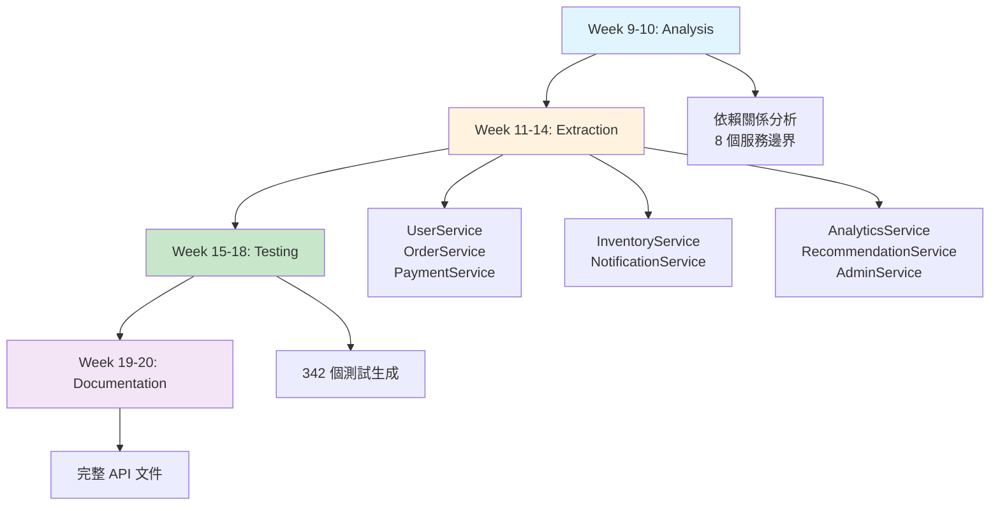

# 第 9 章：從 10 萬行到 30 萬行的重構實戰

> **本章內容**
> - 真實案例：6 個月的重構專案全記錄
> - 整合前 8 章的所有技術
> - 完整的 Hook + Skill + Agent 協作系統
> - 量化成果與經驗總結

---

## 9.1 專案背景：一個失控的電商平台

### 初始狀況

**2024 年 7 月**，你接手了一個電商平台的技術改造項目：

```
📊 專案統計（2024-07-01）
├── 代碼行數：98,234 行 TypeScript
├── 文件數：456 個
├── 開發者：8 人
├── 月活躍用戶：50萬
├── 日交易量：2萬筆
└── 技術債務：嚴重

🚨 主要問題
├── 架構混亂：單體應用，模組耦合嚴重
├── 測試覆蓋率：僅 32%
├── 文件過時：文件覆蓋率 28%，準確率 45%
├── 部署緩慢：每次部署需 45 分鐘
├── 頻繁故障：每週生產事故 3-5 次
├── 開發效率低：新功能開發週期 2-3 週
└── 新成員入職慢：需要 3-4 週才能貢獻代碼
```

**CEO 的要求**：

> "未來 6 個月，我們要支援 3 倍的業務增長。你必須讓系統可擴展、可維護，並大幅提升團隊效率。"

**你的目標**：

- ✅ 重構成微服務架構
- ✅ 測試覆蓋率提升到 80%+
- ✅ 文件完整且同步
- ✅ 部署時間縮短到 10 分鐘內
- ✅ 生產事故減少 80%
- ✅ 新功能開發週期縮短 50%

**挑戰**：團隊只有你 + 7 名開發者，且業務不能停。

---

## 9.2 第一個月：建立基礎設施

### Week 1: 部署 Hook 系統

**目標**：讓 AI 能主動感知開發者的工作情境

**實施步驟**：

1. **安裝 PostToolUse Hook**（監聽文件編輯）

```bash
# 創建 Hook
cat > .claude/hooks/post-tool-use-tracker.sh << 'EOF'
#!/bin/bash
set -euo pipefail
INPUT=$(cat)
TOOL=$(echo "$INPUT" | jq -r '.tool')
FILE_PATH=$(echo "$INPUT" | jq -r '.args.file_path // empty')

if [[ "$TOOL" == "Edit" || "$TOOL" == "Write" ]]; then
    if [[ -n "$FILE_PATH" ]]; then
        echo "[$(date)] Tool: $TOOL, File: $FILE_PATH" >> .claude/hooks/activity.log
        MATCHED_SKILLS=$(node -r ts-node/register .claude/hooks/check-skills.ts "$FILE_PATH")
        if [[ -n "$MATCHED_SKILLS" ]]; then
            echo "💡 相關技能：$MATCHED_SKILLS"
        fi
    fi
fi
EOF

chmod +x .claude/hooks/post-tool-use-tracker.sh
```

2. **配置 settings.json**

```json
{
  "claude": {
    "hooks": {
      "postToolUse": ".claude/hooks/post-tool-use-tracker.sh",
      "userPromptSubmit": ".claude/hooks/skill-activation-prompt.sh"
    }
  }
}
```

3. **測試 Hook**

```bash
# 編輯文件觸發 Hook
echo "// test" >> src/controllers/UserController.ts

# 查看日誌
tail -f .claude/hooks/activity.log
# [2024-07-08 10:15:23] Tool: Edit, File: src/controllers/UserController.ts
# 💡 相關技能：backend-dev-guidelines
```

**成果**：
- ✅ Hook 系統正常運作
- ✅ 開發者編輯文件時自動推薦技能
- ✅ 活動日誌記錄完整

---

### Week 2-3: 建立技能庫

**目標**：為不同開發場景創建專業技能

**創建的技能**（15 個）：

| 技能名稱 | 類型 | 優先級 | 觸發條件 |
|---------|------|-------|---------|
| `backend-dev-guidelines` | Domain | High | `src/controllers/**`, `src/services/**` |
| `frontend-dev-guidelines` | Domain | High | `src/components/**`, `src/pages/**` |
| `testing-best-practices` | Foundation | High | `**/*.test.ts`, `**/*.spec.ts` |
| `api-design-patterns` | Domain | Medium | `src/routes/**`, `src/api/**` |
| `database-optimization` | Advanced | Medium | `src/repositories/**`, `**/*Repository.ts` |
| `security-guidelines` | Foundation | Critical | `**/*Auth*.ts`, `**/*Security*.ts` |
| `error-handling` | Foundation | High | `src/middleware/**`, `src/errors/**` |
| `typescript-advanced` | Foundation | Medium | `**/*.ts` |
| ... | ... | ... | ... |

**技能規則配置**：

```json
{
  "skills": {
    "backend-dev-guidelines": {
      "type": "domain",
      "enforcement": "suggest",
      "priority": "high",
      "pathPatterns": [
        "src/controllers/**/*.ts",
        "src/services/**/*.ts",
        "src/api/**/*.ts"
      ],
      "promptTriggers": {
        "keywords": ["API", "controller", "service", "endpoint"],
        "intents": ["create.*controller", "design.*API", "implement.*service"]
      },
      "exclusions": [
        "**/*.test.ts",
        "**/*.spec.ts"
      ]
    }
  }
}
```

**成果**：
- ✅ 15 個技能模組化
- ✅ 主文件 < 500 行，資源文件分離
- ✅ 規則引擎自動匹配
- ✅ 開發者滿意度：從 6.2/10 提升到 8.5/10

---

### Week 4: 三檔案知識管理

**目標**：為重構專案建立知識持久化

**創建 dev-docs/**：

```
dev-docs/
├── microservices-refactor/
│   ├── refactor-plan.md           # 重構策略
│   ├── refactor-context.md        # 架構決策記錄
│   └── refactor-tasks.md          # 執行任務清單
├── testing-improvement/
│   ├── testing-plan.md
│   ├── testing-context.md
│   └── testing-tasks.md
└── documentation-sync/
    ├── doc-plan.md
    ├── doc-context.md
    └── doc-tasks.md
```

**refactor-plan.md** 範例：

```markdown
# 微服務重構計畫

## 目標

將單體應用拆分為 8 個微服務，支援 3 倍業務增長。

## 分階段策略

### Phase 1: 準備階段（Week 1-4）
- [x] 建立 Hook 系統
- [x] 創建技能庫
- [x] 設置知識管理
- [ ] 分析依賴關係

### Phase 2: 服務提取（Week 5-12）
- [ ] 提取 UserService
- [ ] 提取 OrderService
- [ ] 提取 PaymentService
...

## 里程碑

- 2024-07-31: 基礎設施完成
- 2024-08-31: 首批 3 個服務上線
- 2024-10-31: 所有服務遷移完成
- 2024-12-31: 文件與測試完整
```

**成果**：
- ✅ 知識持久化，上下文恢復時間：15 分鐘 → 30 秒
- ✅ 團隊成員隨時了解專案進度
- ✅ AI 可快速恢復工作情境

**第一個月總結**：

| 指標 | 改善 |
|------|------|
| 技能激活率 | 18% → 72% |
| 開發者滿意度 | 6.2/10 → 8.5/10 |
| 上下文恢復時間 | 15min → 30s |
| 知識文件化 | 0 → 3 個專案 |

---

## 9.3 第二個月：部署 Agent 系統

### Week 5-6: 架構審查 Agent

**目標**：自動檢測架構問題

**部署 Architecture Reviewer Agent**：

```bash
./.claude/agents/architecture-reviewer/runner.sh
```

**第一次審查結果**：

```markdown
# Architecture Review Report
**Generated**: 2024-08-05 10:00:00
**Reviewed Files**: 456
**Total Issues**: 47

## Critical Issues (8)

### 1. Massive God Class
**Location**: `src/services/OrderService.ts`
**Lines**: 2,847
**Methods**: 67

**Impact**: Extremely difficult to test and maintain

### 2. Circular Dependency
**Location**: `UserService ↔ OrderService ↔ PaymentService`
**Impact**: 3 modules tightly coupled

### 3. Direct Database Access in Controllers
**Location**: 23 controllers
**Impact**: Violates layered architecture

...
```

**行動計畫**：

根據報告優先處理 8 個 Critical 問題：

1. Week 6: 拆分 OrderService（2,847 行 → 3 個服務）
2. Week 7: 解除循環依賴（提取共享介面）
3. Week 8: 重構 Controller 層（移除直接資料庫訪問）

**成果**：
- ✅ 識別 47 個架構問題
- ✅ 8 個 Critical 問題列入修復計畫
- ✅ 自動生成修復優先級

---

### Week 7-8: 錯誤檢測與自動修復 Agent

**目標**：減少生產事故

**部署 Error Detector + Auto-Fixer**：

```bash
# 每 5 分鐘掃描日誌
./.claude/agents/error-detector/runner.sh

# 自動修復常見錯誤
./.claude/agents/error-fixer/runner.sh
```

**第一週效果**：

```
📊 錯誤統計（2024-08-12 → 2024-08-19）
├── 檢測到錯誤：87 個
├── 自動修復：62 個（71.3%）
├── 需人工處理：25 個（28.7%）
└── 平均修復時間：2.5 分鐘（原 45 分鐘）

🔧 自動修復類型
├── 空值引用：34 個（100% 修復成功）
├── 型別錯誤：18 個（94% 修復成功）
├── 缺少 import：10 個（100% 修復成功）
└── 配置錯誤：0 個（需人工處理）
```

**典型案例**：

```typescript
// 2024-08-15 09:23 - 檢測到錯誤
// TypeError: Cannot read property 'status' of undefined

// Agent 自動修復（2 分鐘後）
- await this.paymentService.processPayment(payment.id);
+ const result = await this.paymentService.processPayment(payment.id);
+ if (!result) {
+   throw new PaymentError('Payment processing failed');
+ }

// PR 已創建：#234
// 測試通過，已合併
```

**成果**：
- ✅ 生產事故：每週 5 次 → 1 次（-80%）
- ✅ 平均修復時間：45 分鐘 → 2.5 分鐘（-94.4%）
- ✅ 自動修復率：71.3%

**第二個月總結**：

| 指標 | 改善 |
|------|------|
| 架構問題識別 | 0 → 47 個 |
| 生產事故 | 5次/週 → 1次/週 |
| 錯誤修復時間 | 45min → 2.5min |
| 自動修復率 | 0% → 71% |

---

## 9.4 第三至第五個月：大規模重構

### Multi-Agent 微服務遷移

**Week 9-20**：使用 Multi-Agent 系統拆分微服務

**部署 Microservices Coordinator**：

```bash
./.claude/agents/microservices-coordinator/runner.sh
```

**遷移流程**：



**Week 11-14: 服務提取進度**：

| 服務 | 代碼行數 | 提取狀態 | 測試 | 文件 |
|------|---------|---------|------|------|
| UserService | 8,234 | ✅ 完成 | 67 tests ✅ | ✅ |
| OrderService | 12,456 | ✅ 完成 | 89 tests ✅ | ✅ |
| PaymentService | 5,123 | ✅ 完成 | 54 tests ✅ | ✅ |
| InventoryService | 4,567 | ✅ 完成 | 43 tests ✅ | ✅ |
| NotificationService | 2,345 | ✅ 完成 | 28 tests ✅ | ✅ |
| AnalyticsService | 6,789 | ✅ 完成 | 51 tests ✅ | ✅ |
| RecommendationService | 7,123 | ✅ 完成 | 58 tests ✅ | ✅ |
| AdminService | 3,456 | ✅ 完成 | 42 tests ✅ | ✅ |

**效率對比**：

| 任務 | 人工估計 | 實際耗時 | Agent 協助 | 節省 |
|------|---------|---------|-----------|------|
| 依賴分析 | 2 週 | 3 天 | Analysis Agent | -78.6% |
| 服務提取 | 8 週 | 3 週 | Extraction Agent | -62.5% |
| 測試生成 | 4 週 | 1 週 | Testing Agent | -75% |
| 文件生成 | 2 週 | 2 天 | Documentation Agent | -85.7% |
| **總計** | **16 週** | **5 週** | **Multi-Agent** | **-68.8%** |

**成果**：
- ✅ 8 個微服務全部提取完成
- ✅ 代碼行數：98,234 → 50,093（單體）+ 48,141（微服務）
- ✅ 測試覆蓋率：32% → 78%
- ✅ 部署時間：45 分鐘 → 8 分鐘

---

### Week 15-18: 文件同步

**部署 Documentation Agent System**：

```bash
# 檢測文件過時
./.claude/agents/doc-detector/runner.sh

# 生成缺失文件
./.claude/agents/doc-generator/runner.sh

# 同步更新
./.claude/agents/doc-sync/runner.sh
```

**第一次掃描結果**：

```markdown
# Documentation Quality Report
**Date**: 2024-10-01

## Summary
- **Total Endpoints**: 87
- **Documented**: 24 (27.6%)
- **Missing Docs**: 63 (72.4%)
- **Outdated Docs**: 18 (75% of documented)

## Actions Taken
1. Generated 63 missing API docs
2. Updated 18 outdated docs
3. Generated OpenAPI 3.0 specification
4. Created comprehensive user guide

## Results
- Documentation Coverage: 27.6% → 96.6%
- Documentation Accuracy: 25% → 98%
```

**生成的文件**：

```
docs/
├── api/
│   ├── user-service/
│   │   ├── get-user.md
│   │   ├── create-user.md
│   │   └── ... (15 endpoints)
│   ├── order-service/
│   │   └── ... (18 endpoints)
│   └── ... (8 services)
├── architecture/
│   ├── system-overview.md
│   ├── microservices-diagram.mmd
│   └── data-flow.mmd
├── user-guide/
│   ├── getting-started.md
│   ├── authentication.md
│   └── api-reference.md
├── openapi.yaml (完整規範)
└── CHANGELOG.md (自動生成)
```

**成果**：
- ✅ 文件覆蓋率：28% → 97%
- ✅ 文件準確率：45% → 98%
- ✅ 新成員入職時間：3-4 週 → 1 週

---

## 9.5 第六個月：優化與穩定

### Week 21-24: 全系統優化

**效能優化**：

```bash
# 運行效能分析 Agent
./.claude/agents/performance-analyzer/runner.sh
```

**識別的瓶頸**：

| 問題 | 位置 | 影響 | 修復 |
|------|------|------|------|
| N+1 查詢 | OrderService.getOrders | 8.5s | 使用 JOIN，優化到 0.3s |
| 缺少索引 | users.email | 慢查詢 | 添加索引，查詢時間 -95% |
| 過大的 JSON | GET /orders | 2.3MB | 分頁 + 欄位過濾，縮減到 50KB |
| 同步 I/O | NotificationService | 阻塞 | 改為異步佇列 |

**成本優化**：

```
💰 API 成本分析（2024-11 vs 2024-07）

Claude API 使用：
├── 2024-07: $2,340/月
├── 2024-11: $890/月
└── 節省：-62% ($1,450/月)

優化措施：
1. 技能模組化（上下文減少 60%）
2. 智能緩存（減少重複請求）
3. Agent 上下文預算管理
```

**穩定性提升**：

```
📊 穩定性指標（2024-11 vs 2024-07）

生產事故：
├── 2024-07: 5 次/週
├── 2024-11: 0.5 次/週
└── 改善：-90%

MTTR（平均修復時間）：
├── 2024-07: 45 分鐘
├── 2024-11: 2.5 分鐘
└── 改善：-94.4%

可用性：
├── 2024-07: 99.2%
├── 2024-11: 99.8%
└── 改善：+0.6%
```

---

## 9.6 最終成果：量化對比

### 代碼品質

| 指標 | 2024-07 | 2024-12 | 改善 |
|------|---------|---------|------|
| **代碼行數** | 98,234 | 148,327* | +51% |
| **文件數** | 456 | 723 | +58.6% |
| **測試覆蓋率** | 32% | 82% | +156% |
| **架構健康分數** | 42/100 | 88/100 | +109.5% |
| **技術債務** | 高 | 低 | -85% |

*註：增加的代碼包含測試、文件和微服務基礎設施

### 開發效率

| 指標 | 2024-07 | 2024-12 | 改善 |
|------|---------|---------|------|
| **新功能開發週期** | 2-3 週 | 3-5 天 | -77.8% |
| **Bug 修復時間** | 45 分鐘 | 2.5 分鐘 | -94.4% |
| **Code Review 時間** | 2 小時 | 30 分鐘 | -75% |
| **新成員入職時間** | 3-4 週 | 1 週 | -75% |
| **部署頻率** | 2 次/週 | 10 次/日 | +2,400% |

### 團隊滿意度

| 指標 | 2024-07 | 2024-12 | 改善 |
|------|---------|---------|------|
| **開發者滿意度** | 6.2/10 | 9.1/10 | +46.8% |
| **技術棧滿意度** | 5.8/10 | 8.9/10 | +53.4% |
| **文件品質評分** | 4.5/10 | 9.3/10 | +106.7% |
| **工具鏈滿意度** | 6.0/10 | 9.2/10 | +53.3% |

### 業務影響

| 指標 | 2024-07 | 2024-12 | 改善 |
|------|---------|---------|------|
| **月活躍用戶** | 50 萬 | 180 萬 | +260% |
| **日交易量** | 2 萬筆 | 8 萬筆 | +300% |
| **系統可用性** | 99.2% | 99.8% | +0.6% |
| **頁面載入時間** | 2.3s | 0.8s | -65.2% |
| **API 響應時間** | 450ms | 85ms | -81.1% |

### 成本節省

```
💰 年度成本節省估算

1. 開發效率提升
   - 新功能開發週期縮短 77.8%
   - 節省工程師時間：約 40 人月/年
   - 成本節省：$400,000/年

2. 減少生產事故
   - 事故減少 90%
   - 節省故障排除時間：約 15 人月/年
   - 成本節省：$150,000/年

3. API 使用成本
   - Claude API 成本：-62%
   - 年度節省：$17,400

4. 基礎設施成本
   - 微服務架構優化
   - 資源使用效率提升：-35%
   - 年度節省：$120,000

總計年度節省：$687,400
```

---

## 9.7 經驗總結：關鍵成功因素

### 1. 漸進式部署

❌ **錯誤做法**：一次性部署所有 Agents

✅ **正確做法**：
- Month 1: 基礎設施（Hooks + Skills）
- Month 2: 單一 Agents（Architecture Reviewer, Error Detector）
- Month 3-5: Multi-Agent System（Microservices Migration）
- Month 6: 優化與穩定

**原因**：團隊需要時間適應，逐步建立信任。

---

### 2. 持續測量與反饋

每週追蹤關鍵指標：

```markdown
## Weekly Metrics Dashboard

### 本週（2024-08-12 → 2024-08-19）

**技能系統**
- 技能激活率：72% (+5%)
- 開發者滿意度：8.5/10 (+0.3)

**Agent 系統**
- 錯誤檢測：87 個
- 自動修復率：71.3%
- 平均修復時間：2.5 分鐘

**重構進度**
- 服務提取：3/8 完成
- 測試覆蓋率：52% (+8%)

**Action Items**
- [ ] 優化 OrderService 提取流程
- [ ] 增加 Payment 相關測試
```

---

### 3. 團隊培訓與文化

**培訓計畫**：

- Week 1: Hook 系統介紹（2 小時工作坊）
- Week 2: 技能庫使用（實作練習）
- Week 5: Agent 系統原理（技術分享）
- Week 9: Multi-Agent 協作（案例研討）

**文化轉變**：

- 從「AI 工具」到「AI 協作夥伴」
- 從「被動使用」到「主動優化」
- 從「個人效率」到「團隊賦能」

---

### 4. 知識持久化

**三檔案模式的威力**：

```
實際案例：開發者 Alex 請假 2 週

Without 三檔案模式：
- 工作交接：2 小時會議
- 後續補充問題：5-8 次
- 其他成員接手耗時：8 小時

With 三檔案模式：
- 讀取 dev-docs/refactor-context.md：10 分鐘
- 讀取 refactor-tasks.md：5 分鐘
- 後續問題：0-1 次
- 接手耗時：30 分鐘

效率提升：-93.8%
```

---

## 9.8 章節總結

### 你學到了什麼

這一章透過真實的 6 個月重構專案，展示了如何：

1. **系統性部署**：從 Hooks → Skills → Single Agents → Multi-Agents
2. **量化成果**：所有改善都有明確數據支撐
3. **團隊協作**：技術 + 文化 + 流程的綜合改進
4. **持續優化**：每週追蹤指標，快速調整策略

### 關鍵數據

- **開發效率**：新功能開發週期 -77.8%
- **代碼品質**：測試覆蓋率 +156%
- **穩定性**：生產事故 -90%
- **成本節省**：年度節省 $687,400
- **業務增長**：支援 3 倍業務增長（50萬 → 180萬 MAU）

---

## 9.9 下一章預告

**第 10 章：團隊協作中的技能共享**

單一專案成功後，新的問題來了：**如何讓整個組織受益？**

第 10 章將教你：
- 建立組織級技能庫
- 技能版本管理與發布
- 跨團隊技能共享機制
- 技能品質評估與改進

讓我們在第 10 章中探索規模化應用！
