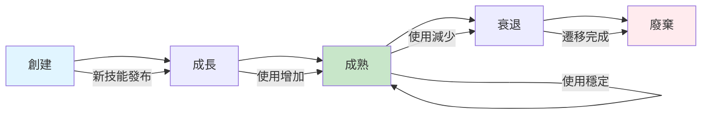

# 第 12 章：技能生命週期管理

> **本章內容**
> - 技能廢棄策略
> - 版本遷移路徑
> - 技能合併與拆分
> - 持續改進機制

---

## 12.1 技能生命週期

### 五個階段



---

## 12.2 技能廢棄策略

### 何時廢棄？

觸發條件：
- 使用率 < 5%（連續 3 個月）
- 有更好的替代技能
- 技術棧過時（如 AngularJS → React）
- 無人維護（maintainer 離職）

### 廢棄流程

```
1. 標記為 Deprecated (v2.5.0)
   ├── 更新 SKILL.md 頂部警告
   └── 發送通知給訂閱團隊

2. 設定遷移期（3-6 個月）
   ├── 提供遷移指南
   ├── 推薦替代技能
   └── 支援遷移諮詢

3. 移除（v3.0.0）
   ├── 從 skill-registry.json 移除
   ├── 移動到 archived/
   └── 更新所有依賴
```

**範例警告**：

```markdown
# AngularJS Best Practices

> ⚠️  **DEPRECATED**
>
> This skill is deprecated and will be removed in v3.0.0 (2025-06-01).
>
> **Recommended Alternative**: `react-best-practices`
>
> **Migration Guide**: [docs/migration/angularjs-to-react.md](...)
```

---

## 12.3 版本遷移

### 不相容變更處理

**範例：testing-best-practices v1 → v2**

**Breaking Changes**：
- 文件結構重組
- 範例更新（Jest 26 → Jest 29）
- 移除過時模式

**遷移路徑**：

```bash
# 1. 檢查當前版本
cat .claude/skills/foundation/testing-best-practices/SKILL.md | grep "Version:"
# Version: 1.8.5

# 2. 閱讀遷移指南
cat .claude/skills/foundation/testing-best-practices/MIGRATION-v1-to-v2.md

# 3. 執行遷移腳本
./.claude/scripts/migrate-skill.sh testing-best-practices 1.8.5 2.0.0

# 4. 驗證遷移
./.claude/scripts/verify-skill.sh testing-best-practices
```

---

## 12.4 技能合併與拆分

### 何時合併？

- 兩個技能高度重疊（內容相似度 > 60%）
- 經常一起使用（共現率 > 80%）
- 維護負擔過重

**範例：合併 `api-design-patterns` + `rest-api-guidelines`**

```
Before:
├── api-design-patterns (3,500 lines)
└── rest-api-guidelines (2,800 lines)

After:
└── api-best-practices (4,200 lines)
    ├── SKILL.md (主文件)
    ├── resources/design-patterns.md
    ├── resources/rest-guidelines.md
    └── resources/graphql-guidelines.md (新增)
```

### 何時拆分？

- 技能過大（> 5,000 lines）
- 包含多個不相關主題
- 不同團隊需要不同部分

**範例：拆分 `frontend-development` 技能**

```
Before:
└── frontend-development (8,900 lines)
    ├── React
    ├── Vue
    ├── Angular
    ├── Testing
    ├── Performance
    └── Accessibility

After:
├── react-best-practices (2,300 lines)
├── vue-best-practices (2,100 lines)
├── frontend-testing (1,800 lines)
├── frontend-performance (1,500 lines)
└── web-accessibility (1,200 lines)
```

---

## 12.5 持續改進機制

### 用戶反饋系統

```bash
# 用戶評分技能
claude-skill rate testing-best-practices --score 5 --comment "Very helpful examples"

# 報告問題
claude-skill report testing-best-practices --issue "Outdated Jest syntax"

# 建議改進
claude-skill suggest testing-best-practices --suggestion "Add React Testing Library section"
```

### 定期審查

**季度審查**（每 3 個月）：

```markdown
## Q4 2024 Skill Review

### High Priority Updates
- [ ] testing-best-practices: Update to Jest 29
- [ ] security-guidelines: Add OWASP Top 10 2024
- [ ] react-best-practices: Add React 19 features

### Deprecation Candidates
- [ ] angularjs-guidelines (usage: 2%, last update: 18 months ago)
- [ ] jquery-patterns (usage: 1%, replaced by modern frameworks)

### Merge Candidates
- [ ] api-design-patterns + rest-api-guidelines → api-best-practices

### Quality Issues
- [ ] typescript-advanced: Low rating (3.2/5), needs restructure
```

---

## 12.6 章節總結

### 生命週期管理清單

- [ ] 定期追蹤使用率
- [ ] 設定廢棄流程
- [ ] 提供遷移指南
- [ ] 合併重疊技能
- [ ] 拆分過大技能
- [ ] 收集用戶反饋
- [ ] 季度審查與改進

### 關鍵指標

- 技能使用率
- 用戶滿意度
- 更新頻率
- 維護成本

---

## 12.7 下一章預告

**第 13 章：未來展望與最佳實踐**

技能系統成熟後，讓我們展望未來：
- AI 輔助開發的未來趨勢
- Claude Code 生態系統演進
- 組織級 AI 基礎設施
- 實踐總結與建議
