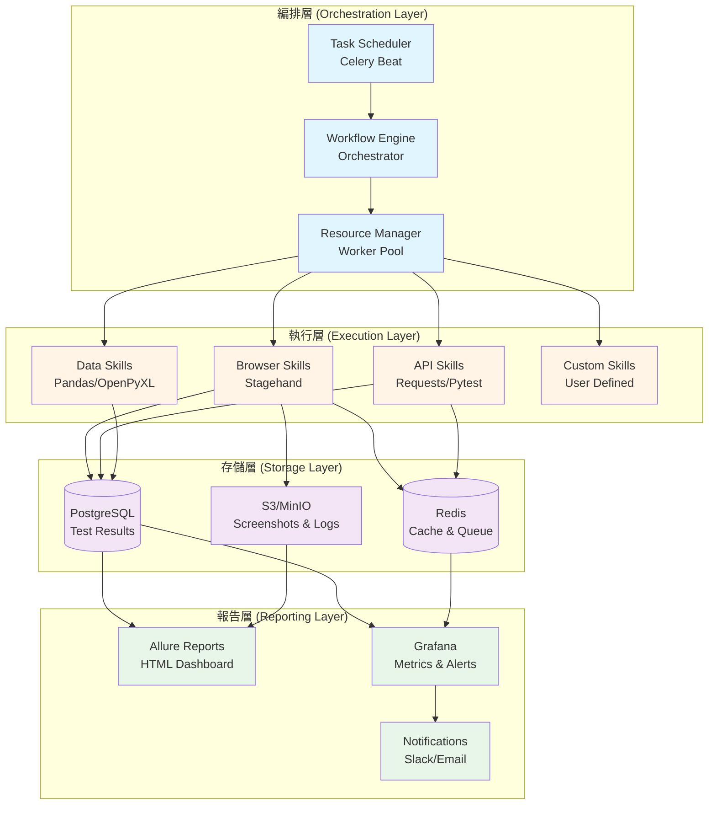
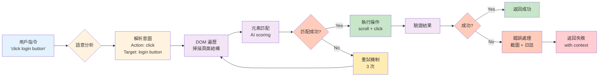
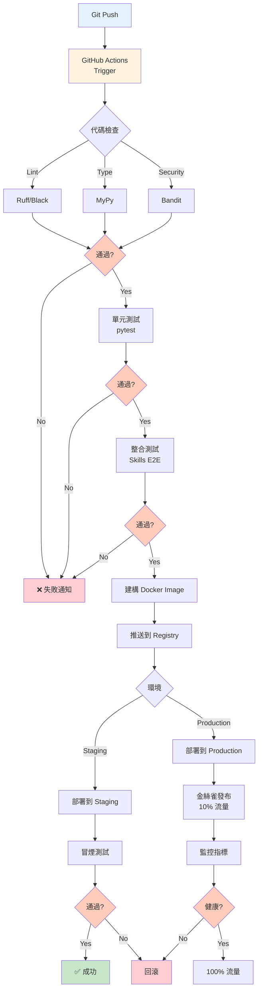
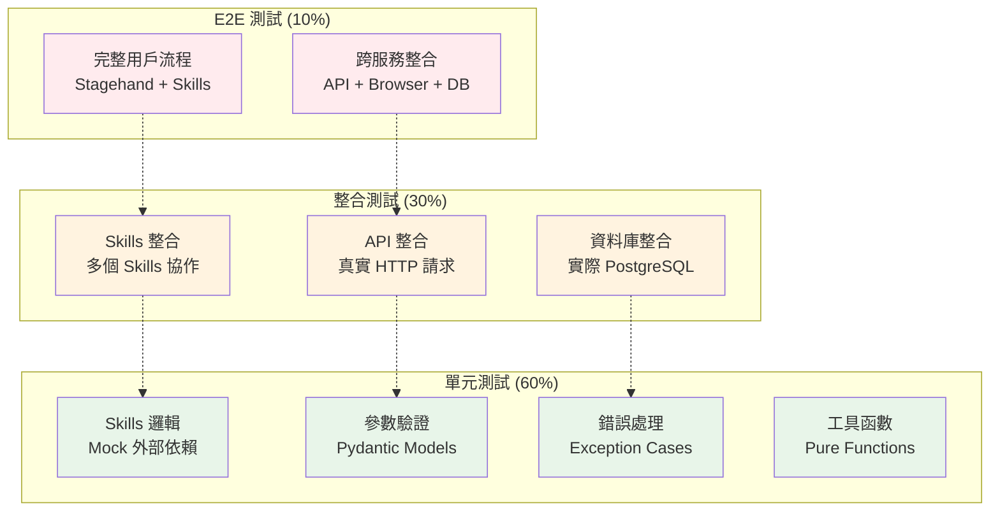
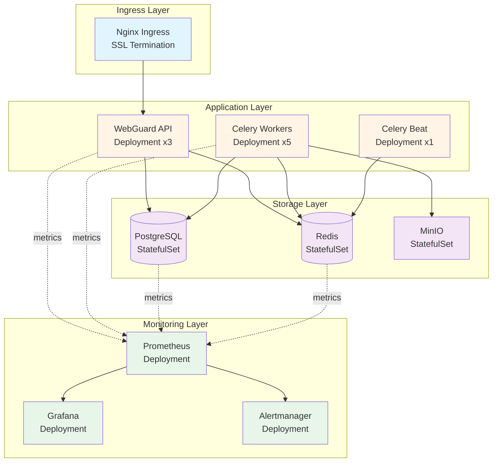
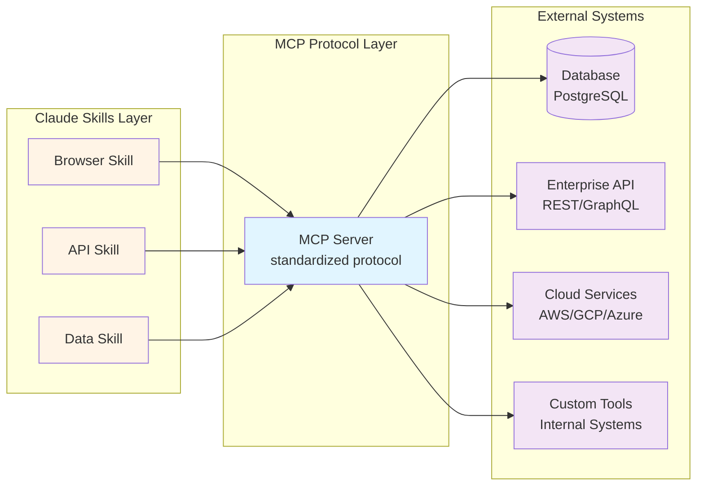

# Claude Code Skills 技術書 - 架構圖集

本文件包含書中所有關鍵系統架構圖，使用 Mermaid 語法繪製，可在 GitHub、VS Code 等環境中直接渲染。

## 目錄

1. [WebGuard 四層架構](#1-webguard-四層架構)
2. [Skills 生命週期與數據流](#2-skills-生命週期與數據流)
3. [Stagehand 工作流程](#3-stagehand-工作流程)
4. [CI/CD 流程](#4-cicd-流程)
5. [測試金字塔](#5-測試金字塔)
6. [Kubernetes 部署架構](#6-kubernetes-部署架構)
7. [MCP 整合架構](#7-mcp-整合架構)

---

## 1. WebGuard 四層架構

**引用章節**: Chapter 1.3.3, Chapter 9.1-9.2



**說明**：
- **編排層**：負責任務調度、工作流編排、資源管理
- **執行層**：各類 Skills 的執行環境
- **存儲層**：數據持久化、快取、日誌存儲
- **報告層**：測試報告、監控儀表板、告警通知

---

## 2. Skills 生命週期與數據流

**引用章節**: Chapter 3.3, Chapter 7.2

```mermaid
sequenceDiagram
    participant User as 用戶/CI
    participant Claude as Claude AI
    participant Skill as Skill System
    participant Executor as Executor
    participant External as 外部服務

    User->>Claude: 1. 提出需求<br/>"測試登入功能"

    Note over Claude,Skill: 發現階段 (Discovery)
    Claude->>Skill: 2. 掃描可用 Skills
    Skill-->>Claude: 3. 返回匹配的 Skills<br/>└─ browser_login_test

    Note over Claude,Skill: 準備階段 (Preparation)
    Claude->>Skill: 4. 載入 SKILL.md 詳細資訊
    Skill-->>Claude: 5. 返回參數定義與約束
    Claude->>Skill: 6. 準備參數<br/>{url, username, password}
    Skill-->>Claude: 7. 驗證參數格式

    Note over Claude,Executor: 執行階段 (Execution)
    Claude->>Executor: 8. 調用 Skill 執行函數
    Executor->>External: 9. 實際操作<br/>└─ Stagehand/API/等
    External-->>Executor: 10. 返回結果
    Executor->>Executor: 11. 錯誤處理與重試
    Executor-->>Claude: 12. 返回結構化結果

    Note over Claude,User: 報告階段 (Reporting)
    Claude->>User: 13. 生成測試報告
    Claude->>User: 14. 提供建議與洞察

    style User fill:#e3f2fd
    style Claude fill:#fff3e0
    style Skill fill:#f3e5f5
    style Executor fill:#e8f5e9
    style External fill:#fce4ec
```

**數據流說明**：
1. **用戶意圖** → Claude 解析
2. **Skills 發現** → 三層漸進式揭露
3. **參數準備** → Pydantic 驗證
4. **執行調用** → 具體實作
5. **結果返回** → 結構化輸出

---

## 3. Stagehand 工作流程

**引用章節**: Chapter 4.1.3, Chapter 4.2



**核心特性**：
- ✅ 語意理解（不依賴選擇器）
- ✅ 自動重試（Circuit Breaker）
- ✅ 上下文感知（AI scoring）
- ✅ 自愈能力（適應 UI 變化）

---

## 4. CI/CD 流程

**引用章節**: Chapter 8.1-8.3



**階段說明**：
1. **代碼檢查**: Linting, Type checking, Security scan
2. **測試**: Unit → Integration → E2E
3. **建構**: Docker image + versioning
4. **部署**: Staging → Production (金絲雀)
5. **驗證**: 冒煙測試 + 監控

---

## 5. 測試金字塔

**引用章節**: Chapter 8.2, Chapter 8.5



**測試比例**：
- **60% 單元測試**: 快速、隔離、大量
- **30% 整合測試**: 中速、真實依賴、適量
- **10% E2E 測試**: 慢速、完整流程、少量

**效益**：
- ⚡ 快速反饋（單元測試 < 1分鐘）
- 🎯 精準定位（層層驗證）
- 💰 成本優化（避免過多 E2E）

---

## 6. Kubernetes 部署架構

**引用章節**: Chapter 10.1-10.2



**組件說明**：

| 組件 | 副本數 | 資源需求 | 用途 |
|------|--------|----------|------|
| **Nginx Ingress** | 2 | 500m CPU, 512Mi RAM | SSL 終止、路由 |
| **WebGuard API** | 3 | 1 CPU, 2Gi RAM | RESTful API 服務 |
| **Celery Workers** | 5 | 2 CPU, 4Gi RAM | 執行 Skills 任務 |
| **Celery Beat** | 1 | 500m CPU, 512Mi RAM | 任務調度 |
| **PostgreSQL** | 3 (HA) | 2 CPU, 4Gi RAM | 持久化存儲 |
| **Redis** | 3 (Cluster) | 1 CPU, 2Gi RAM | 快取與消息隊列 |
| **MinIO** | 4 | 1 CPU, 2Gi RAM | 對象存儲 (S3兼容) |
| **Prometheus** | 2 | 2 CPU, 4Gi RAM | 指標收集 |
| **Grafana** | 2 | 500m CPU, 1Gi RAM | 可視化儀表板 |

**高可用特性**：
- ✅ 多副本部署（API、Workers）
- ✅ StatefulSet（資料庫、快取）
- ✅ Pod Anti-Affinity（跨節點分散）
- ✅ HPA（Horizontal Pod Autoscaling）
- ✅ PVC（Persistent Volume Claims）

---

## 7. MCP 整合架構

**引用章節**: Chapter 1.2.3, Chapter 10.5, 附錄 A



**MCP 優勢**：
1. **標準化協定**: 統一的 Skills ↔ 外部系統通訊
2. **安全性**: 內建認證與授權機制
3. **可擴展性**: 輕鬆添加新的外部服務
4. **版本控制**: 協定版本管理與向後兼容

**實作範例**：
```python
# MCP Server 定義
class DatabaseMCP:
    protocol_version = "1.0"

    async def query(self, sql: str) -> List[Dict]:
        """執行 SQL 查詢"""
        ...

    async def insert(self, table: str, data: Dict) -> int:
        """插入數據"""
        ...
```

---

## 使用指南

### 如何在章節中引用圖表

使用以下格式引用本文件中的圖表：

```markdown
詳細的架構設計請參考 [WebGuard 四層架構圖](../ARCHITECTURE_DIAGRAMS.md#1-webguard-四層架構)。
```

### Mermaid 圖表渲染

本文件中的 Mermaid 圖表可在以下環境自動渲染：
- ✅ GitHub (自動渲染)
- ✅ VS Code (需安裝 Mermaid 擴展)
- ✅ GitLab (內建支持)
- ✅ Notion (需匯入)
- ✅ Obsidian (內建支持)

### 導出為圖片

如需將圖表導出為 PNG/SVG：

```bash
# 使用 mermaid-cli
npm install -g @mermaid-js/mermaid-cli
mmdc -i ARCHITECTURE_DIAGRAMS.md -o diagrams/
```

---

## 圖表維護日誌

| 日期 | 版本 | 更新內容 | 更新者 |
|------|------|----------|--------|
| 2025-11-08 | 1.0.0 | 初始版本，包含 7 個核心架構圖 | Claude (總編輯) |

---

## 相關資源

- 📖 [CROSS_REFERENCES.md](./CROSS_REFERENCES.md) - 章節交叉引用指南
- 📖 [TERMINOLOGY_STANDARDS.md](./TERMINOLOGY_STANDARDS.md) - 術語標準
- 🔗 [Mermaid 官方文檔](https://mermaid.js.org/)
- 🔗 [WebGuard GitHub Repo](https://github.com/example/webguard) (待更新)

---

*圖表最後更新: 2025-11-08*
*文件版本: 1.0.0*
