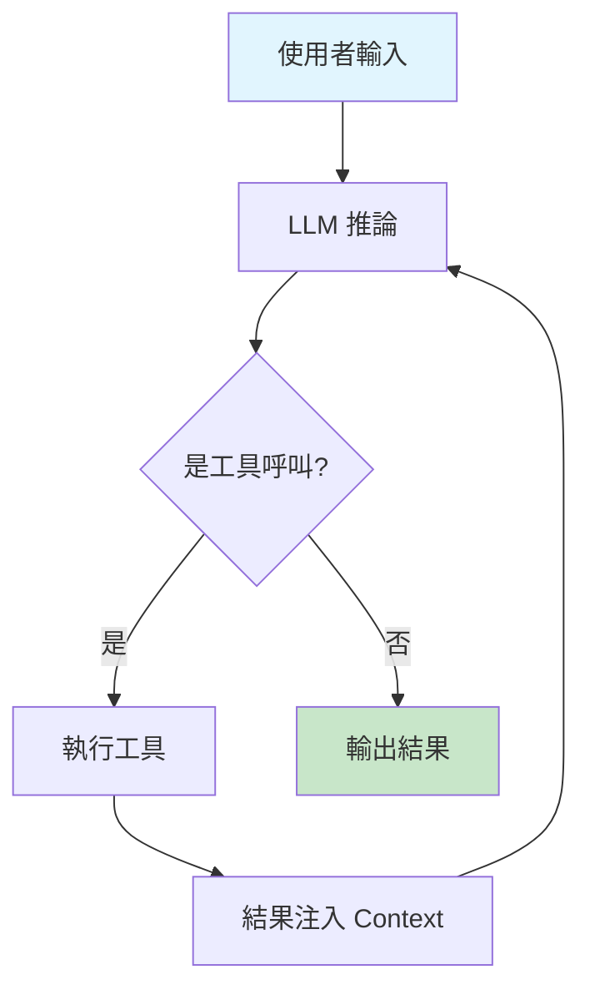

# 圖表目錄

本目錄存放書籍中使用的架構圖與流程圖。

## 使用規範

所有圖表使用 **Mermaid** 語法，以確保：
- 版本控制友好（純文字格式）
- 易於修改與維護
- 可直接在 Markdown 中渲染

## 圖表清單

### 第一部分：認知革命

| 檔案 | 章節 | 說明 |
|------|------|------|
| `ch01-agent-architecture.md` | 第 1 章 | Coding Agent 基本架構 |
| `ch02-context-memory.md` | 第 2 章 | Context Window 記憶體模型 |
| `ch03-llm-taxonomy.md` | 第 3 章 | LLM 分類學：Oracle vs Agentic |

### 第二部分：核心技能

| 檔案 | 章節 | 說明 |
|------|------|------|
| `ch04-inference-loop.md` | 第 4 章 | 推論迴圈五階段 |
| `ch05-five-tools.md` | 第 5 章 | 五大核心工具關係圖 |
| `ch06-mcp-overhead.md` | 第 6 章 | MCP 工具的 Context 成本 |

### 第三部分：進階模式

| 檔案 | 章節 | 說明 |
|------|------|------|
| `ch07-ralph-loop.md` | 第 7 章 | Ralph Wiggum Loop 流程圖 |
| `ch08-plugin-comparison.md` | 第 8 章 | 官方 Plugin vs 原始實現 |
| `ch09-prompt-structure.md` | 第 9 章 | PROMPT.md 結構圖 |

### 第四部分：實戰應用

| 檔案 | 章節 | 說明 |
|------|------|------|
| `ch10-cost-model.md` | 第 10 章 | 成本效益分析模型 |
| `ch11-night-factory.md` | 第 11 章 | 夜間工廠架構圖 |
| `ch12-subagents.md` | 第 12 章 | Subagents 架構圖 |

## Mermaid 範例

## 樣式指南

- 使用淺色背景提高可讀性
- 重要節點使用強調色
- 流程方向：從上到下（TB）或從左到右（LR）
- 保持圖表簡潔，避免過度複雜
