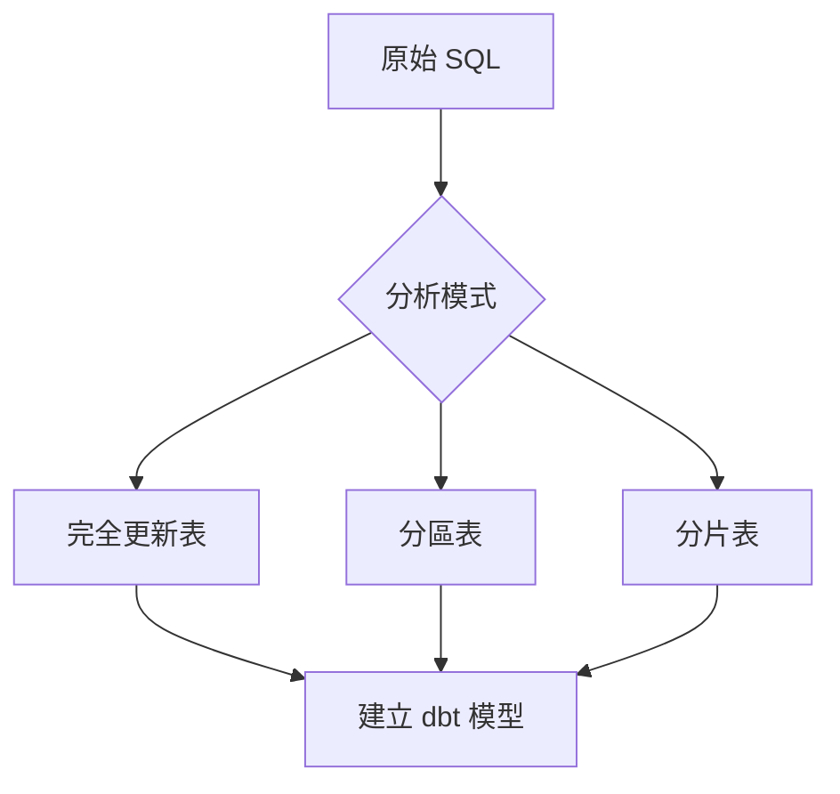

# CLAUDE.md - AI 協作指南

## 文件目的

本文件是專門為 AI 協作撰寫本書而設計的指南。如果你是 Claude Code 或其他 AI 助手，正在協助撰寫、修訂或擴展本書內容，請仔細閱讀本文件的完整內容。

## ⚠️ 重要提醒

**請務必完整閱讀本文件**。不要只閱讀前半部分就開始工作。完整的上下文對於產出高品質內容至關重要。

---

## 書籍核心資訊

### 書籍定位

**書名**: dbt Migration in Action: AI-Powered Database Transformation with Claude Code

**中文副標題**: 用 Claude Code 打造智慧化資料庫轉型 - 50 個 SQL 遷移的實戰故事

**出版社**: Manning Publications
**系列**: "in Action" Series
**目標讀者**: 數據工程師、資料庫管理員、DevOps 工程師
**難度**: 中級到進階

### 核心價值主張

本書的獨特性在於：

1. **真實案例驅動**: 基於 M3 公司實際的 50 個 SQL 遷移專案
2. **完整的失敗與成功**: 不隱藏第一次嘗試的失敗，展示完整的學習過程
3. **知識演進模式**: 展示 Migration Playbook 從 v1.0 到 v3.0 的演化
4. **可複用框架**: 提供可直接應用的 Playbook 範本和代碼範例
5. **AI 協作新範式**: 展示如何與 AI 建立有效的協作關係

---

## Manning "in Action" 寫作風格要求

### 核心原則

Manning "in Action" 系列有明確的風格要求，**必須嚴格遵守**：

#### 1. 專案/案例驅動開頭 (Project/Case-Driven Opening)

**要求**:
- 每章必須以具體的專案、案例或最終目標開頭
- 明確說明讀者在本章結束時將完成什麼、產出什麼、學到什麼
- 避免抽象的理論開場

**範例**:

✅ **好的開頭**:
```markdown
在本章中，我們將建立第一版的 Migration Playbook，
這是一份專門寫給 AI 閱讀的遷移手冊。到本章結束時，
你將擁有一個包含 6 個核心章節的 Playbook，並且能夠
用它指導 Claude Code 完成第二個 SQL 檔案的遷移。
```

❌ **不好的開頭**:
```markdown
Migration Playbook 是一種知識管理工具，用於系統化
地組織遷移知識。它有許多優點...
```

#### 2. 從基礎到進階的演進 (Progressive Evolution)

**要求**:
- 內容必須循序漸進
- 從最簡單的場景開始，逐步增加複雜性
- 每個小節完成一個清晰、獨立的知識點或任務

**範例結構**:
```markdown
4.1 Migration Playbook 的設計原則  ← 基礎概念
4.2 建立第一版手冊（6 個章節）   ← 簡單版本
4.3 測試手冊：第二個 SQL 檔案    ← 驗證
4.4 迭代改進機制                ← 進階應用
```

#### 3. 實體產出為核心 (Artifact-Centric Narrative)

**這是最重要的調整！**

文章的核心不是抽象理論，而是讀者可以看到、模仿、創建的**具體產出物**。

**產出物類型**（根據章節內容選擇）:

- **程式碼或偽代碼**: 完整、可執行的 SQL、Python、YAML
- **配置檔案**: dbt_project.yml、profiles.yml、sources.yml
- **圖表**: Mermaid 流程圖、架構圖、對比表
- **手冊/清單**: Migration Playbook、檢查清單、疑難排解指南
- **腳本**: 驗證腳本、部署腳本、回填腳本

**每章必須包含至少 2-3 個核心產出物**。

**範例**:

```markdown
### 4.2 建立第一版手冊

讓我們開始建立 Migration Playbook v1.0。這個初版將包含 6 個核心章節：

```markdown
# dbt 模型遷移手冊 v1.0

## 1. 確認遷移來源的 SQL 檔案  ‹1›
在開始遷移前，先確認原始 SQL 檔案的結構：
- 檔案位置
- CREATE TABLE 語法
- SELECT 邏輯
- 是否使用 UDF

## 2. 建立參照外部 schema 資料表的 sources 定義  ‹2›
...
```

**‹1›** 第一步總是分析原始檔案。這確保我們理解遷移的來源和目標。
**‹2›** sources 定義是 dbt 的基礎，讓我們用 source() 函數參照外部表。
```

#### 4. 註解與分解說明 (Annotated & Decomposed Explanations)

**要求**:
- 對關鍵產出物使用 ‹1› ‹2› ‹3› 編號標記
- 在產出物下方提供詳細解釋
- 解釋設計目的、內部邏輯、操作原因

**範例**:

```markdown
```sql
-- models/staging/stg_orders.sql
SELECT  ‹1›
    order_id,
    user_id,
    DATE(order_timestamp) as order_date,  ‹2›
    amount
FROM {{ source('raw', 'orders') }}  ‹3›
WHERE order_date >= '2023-01-01'  ‹4›
```

**說明**:
- **‹1›** SELECT 清晰列出所有需要的欄位，避免使用 SELECT *
- **‹2›** 將 timestamp 轉換為 date，適用於日報表
- **‹3›** 使用 source() 函數參照原始表，而不是硬編碼表名
- **‹4›** 過濾條件限制數據範圍，提升查詢性能
```

#### 5. 強調「為何」而非僅「如何」 (Explaining the "Why")

**要求**:
- 除了展示代碼，必須解釋設計決策
- 討論替代方案和權衡
- 說明最佳實踐的依據

**範例**:

```markdown
### 為何使用 source() 而不是直接寫表名？

你可能會問，為何不直接寫：
```sql
FROM `project.dataset.orders`
```

而要使用：
```sql
FROM {{ source('raw', 'orders') }}
```

原因有三：

1. **可維護性**: 當表名改變時，只需更新 sources.yml，不用修改所有模型
2. **數據血緣**: dbt 能追蹤數據來源，生成完整的血緣圖
3. **新鮮度檢查**: 可以為 sources 配置新鮮度測試
```

#### 6. 親切的第二人稱語氣 (Conversational & Second-Person Tone)

**要求**:
- 使用「你」、「我們」
- 對話式風格，像導師在旁邊指導
- 避免過於正式或學術化的語言

**範例**:

✅ **好的語氣**:
```markdown
現在讓我們處理第一個真正的挑戰：Claude Code 生成的代碼刪除了
所有註解。你可能會想，「註解真的那麼重要嗎？」答案是肯定的，
特別是在團隊協作環境中。
```

❌ **不好的語氣**:
```markdown
本節將討論註解保留的重要性。研究表明，適當的代碼文檔能夠
提升可維護性。因此，應該在遷移過程中保留註解。
```

#### 7. 章節總結與後續步驟 (Summary & What's Next)

**要求**:
- 每章結尾提供清晰總結
- 回顧本章完成的核心任務與學習成果
- 預告下一章內容，保持學習連貫性

**範例**:

```markdown
## 本章總結

在本章中，我們完成了以下任務：

✅ **建立了 Migration Playbook v1.0**，包含 6 個核心章節
✅ **測試了手冊**，用它指導 Claude Code 完成第二個 SQL 的遷移
✅ **發現了改進點**，記錄了仍然存在的小問題
✅ **建立了迭代機制**，從錯誤到手冊更新的流程

### 核心收穫

- Migration Playbook 是給 AI 的「教科書」
- 初版不需要完美，重點是建立迭代機制
- 從實際錯誤中提煉知識是最有效的方法

### 下一章預告

在第 5 章，我們將深入第一種遷移模式：**每日完全更新資料表**。
這是最常見的模式，涵蓋了約 60% 的遷移案例。我們將建立可重用
的範本，並讓 Claude Code 獨立處理 3-5 個類似檔案。
```

---

## 寫作格式規範

### Markdown 格式

**必須使用繁體中文**，除了：
- 程式碼
- 技術術語（如 dbt、BigQuery、SQL）
- 專有名詞（如 Claude Code、M3）

**標題層級**:
```markdown
# 章節標題 (H1 - 僅用於章節開頭)
## 主要小節 (H2)
### 次要小節 (H3)
#### 細節說明 (H4)
```

**代碼區塊**:

必須指定語言：

```markdown
```sql
SELECT * FROM table
```

```python
def validate():
    pass
```

```yaml
version: 2
```

```bash
$ dbt run
```
```

**特殊標記**:

- 💡 **提示和最佳實踐**
- ⚠️ **警告和常見陷阱**
- 🔍 **深入技術細節**
- ✅ **檢查點**
- 📝 **實戰練習**

### 產出物呈現格式

**完整的產出物**（如完整檔案）:

```markdown
### 4.2.1 完整的 Migration Playbook v1.0

以下是我們的第一版手冊：

```markdown
# dbt 模型遷移手冊 v1.0

## 1. 確認遷移來源的 SQL 檔案
...

## 2. 建立參照外部 schema 資料表的 sources 定義
...
```

這個初版涵蓋了...
```

**部分產出物**（片段或重點）:

```markdown
關鍵的配置是 `materialized` 設定：

```yaml
models:
  - name: daily_sales
    config:
      materialized: table  ‹1›
      partition_by:
        field: date  ‹2›
        data_type: date
```

- **‹1›** 使用 table 物化策略，每次運行都完全重建
- **‹2›** 按日期分區，提升查詢性能
```

### 圖表格式

**使用 Mermaid.js** 繪製流程圖、架構圖：

```markdown

```

或**詳細文字描述**（當圖表過於複雜時）：

```markdown
**知識迭代循環**:

1. Claude Code 執行遷移 →
2. 發現錯誤 →
3. 分析錯誤根因 →
4. 提煉可重用知識 →
5. 更新 Migration Playbook →
6. 回到步驟 1（下一個檔案）
```

---

## 章節撰寫檢查清單

在完成每章前，請檢查以下項目：

### 結構檢查

- [ ] 章節以專案/案例開頭，明確說明將完成什麼？
- [ ] 內容是否循序漸進（從簡單到複雜）？
- [ ] 每個小節是否完成一個清晰的任務/知識點？
- [ ] 章節結尾是否有總結與下章預告？

### 產出物檢查

- [ ] 本章至少有 2-3 個核心產出物？
- [ ] 產出物是否完整、可用（代碼可執行、範本可複製）？
- [ ] 關鍵產出物是否使用 ‹1› ‹2› ‹3› 標記並詳細解釋？

### 內容品質檢查

- [ ] 是否解釋了「為何」而非只有「如何」？
- [ ] 是否討論了替代方案和權衡？
- [ ] 語氣是否親切、對話式（使用「你」、「我們」）？
- [ ] 是否避免了過於學術或正式的語言？

### 技術準確性檢查

- [ ] 所有 SQL 語法是否正確（BigQuery 語法）？
- [ ] 所有 dbt 配置是否符合最佳實踐？
- [ ] 代碼是否包含完整註解？
- [ ] 是否標註了檔案路徑（如 `models/staging/stg_orders.sql`）？

### Manning 標準檢查

- [ ] 是否使用繁體中文（除了代碼和術語）？
- [ ] 代碼區塊是否指定語言？
- [ ] 是否使用了特殊標記（💡 ⚠️ 🔍 ✅ 📝）？
- [ ] 字數是否符合預估（參考 BOOK_STRUCTURE.md）？

---

## 核心案例背景

### M3 公司的 50 個 SQL 遷移專案

**背景**:
- **公司**: M3 公司數據基盤團隊
- **任務**: 將 50 個 SQL 檔案遷移到 dbt
- **平台**: Google BigQuery
- **時間**: 2023 年

**遷移對象的複雜性**:

1. **多種模式**:
   - 每日完全更新資料表（約 30 個）
   - 分區資料表（約 10 個）
   - 分片資料表（約 10 個）

2. **每個 SQL 的特點**:
   - 欄位都有 description
   - 部分欄位有 not null 限制
   - 部分使用 UDF (User-Defined Functions)
   - 邏輯複雜度不一

**遷移挑戰**:
- 手動處理耗時（每個檔案 20-30 分鐘）
- 容易出錯（註解遺失、邏輯改變、約束遺漏）
- 重複性高（許多相似模式）
- 肌腱炎風險（開發者自嘲）

### 關鍵時間線

**第一階段：初次嘗試（失敗）**
- 簡單請求：「請將 xxx.sql 轉換為 dbt」
- 快速生成，但問題多
- 逐一修正，效率低

**第二階段：建立手冊（轉折點）**
- 請求 Claude Code 製作手冊
- 生成初版手冊（6 個章節）
- 開始系統化協作

**第三階段：迭代改進（成長）**
- 從第二個檔案開始使用手冊
- 遇到錯誤就更新手冊
- 手冊從 6 節成長到 13 節

**第四階段：獨立作業（成功）**
- Claude Code 能一次產出正確代碼
- 遷移時間從 20-30 分鐘降到幾分鐘
- 超過半數檔案由 Claude Code 處理

**第五階段：擴展驗證（進階）**
- 將驗證流程加入手冊
- Claude Code 能自主部署到 QA 並驗證
- 實現高度自動化

### Migration Playbook 演進

**v1.0（初版 - 6 節）**:
```markdown
1. 確認遷移來源的 SQL 檔案
2. 建立參照外部 schema 資料表的 sources 定義
3. 建立 dbt 模型的 SQL 檔案（每日完全更新資料表版）
4. 建立模型檔案時的注意事項
5. 建立 dbt 模型的 schema 檔案
6. 整體共通注意事項
```

**v3.0（最終版 - 13 節）**:
```markdown
1. 確認遷移來源的 SQL 檔案
2. 建立參照外部 schema 資料表的 sources 定義
3. sources 定義遺漏檢查  ← 新增
4. 新增 sources 定義時的注意事項・疑難排解方法  ← 新增
5-a. 建立 dbt 模型的 SQL 檔案（每日完全更新資料表版）
5-b. 建立 dbt 模型的 SQL 檔案（分區資料表版）  ← 新增
5-c. 建立 dbt 模型的 SQL 檔案（分片資料表版）  ← 新增
6. 建立模型檔案時的注意事項
7. 建立 dbt 模型的 schema 檔案
8. 更新 dbt 執行環境（必要時）  ← 新增
9. 自我審查  ← 新增
10. 部署到 QA 環境  ← 新增
11. 進行動作驗證  ← 新增
12. 動作驗證時的注意事項・疑難排解方法  ← 新增
13. 整體共通注意事項
```

### 關鍵學習

**從失敗中學到的教訓**:

1. **註解被刪除** → 手冊加入「必須保留所有原始註解」
2. **邏輯被改寫** → 手冊加入「不要改變 SQL 邏輯，只做格式轉換」
3. **OUTER JOIN 變 INNER JOIN** → 手冊加入「JOIN 類型檢查」
4. **ref() vs source() 混用** → 手冊加入明確使用規則
5. **sources 定義遺漏** → 手冊加入檢查清單和疑難排解

**自我審查的重要性**:
- Claude Code 有時會「疏忽」手冊中的注意事項
- 加入自我審查章節後，能在完成前發現並修正錯誤
- 顯著提升一次成功率

**未解決的挑戰**:
- 當驗證發現差異時，原因分析還不夠穩定
- 這部分仍需人工介入

---

## 特定章節指引

### 第 1 章注意事項

- 必須吸引讀者，讓他們了解這本書的獨特價值
- 使用 M3 案例作為引子
- 強調「知識演進」的概念
- 避免過度技術細節（留到後面章節）

### 第 3 章注意事項

- 這章要詳細記錄「第一次失敗」
- 不要美化結果，要真實呈現問題
- 詳細說明每個發現的問題
- 這是後續建立手冊的動機

### 第 4 章注意事項

- 這是核心章節之一
- 必須完整呈現 Migration Playbook v1.0
- 解釋手冊設計的思路
- 展示測試結果與改進方向

### 第 9 章注意事項

- 展示具體的錯誤案例（至少 10 個）
- 量化 AI 成長（錯誤率曲線、時間縮短）
- 對比 v1.0 和 v3.0 的內容變化
- 這章展示「知識演進」的核心價值

### 第 12 章注意事項

- 提供完整可執行的驗證腳本
- 解釋為何需要多層次驗證（語法、結構、數據）
- 展示 Claude Code 如何自主執行驗證

### 附錄 A 注意事項

- 提供最終版 Playbook 的完整內容（v3.0）
- 可以直接複製使用的格式
- 加入詳細註解說明每個章節的目的

---

## 代碼範例要求

### 原則

1. **所有代碼必須可執行**
2. **包含完整註解**
3. **遵循最佳實踐**
4. **提供檔案路徑**

### SQL 代碼

```sql
-- models/staging/stg_orders.sql
-- 訂單資料暫存表
-- 從原始訂單表提取並清理數據

SELECT
    order_id,
    user_id,
    DATE(order_timestamp) as order_date,
    amount,
    status
FROM {{ source('raw', 'orders') }}
WHERE
    order_timestamp >= '2023-01-01'
    AND status IS NOT NULL
```

### dbt Schema YAML

```yaml
# models/staging/schema.yml
version: 2

sources:
  - name: raw
    description: 原始數據來源
    database: project-id
    schema: raw_data
    tables:
      - name: orders
        description: 原始訂單表

models:
  - name: stg_orders
    description: 訂單資料暫存表
    columns:
      - name: order_id
        description: 訂單唯一識別碼
        tests:
          - unique
          - not_null
      - name: user_id
        description: 用戶ID
        tests:
          - not_null
      - name: order_date
        description: 訂單日期
      - name: amount
        description: 訂單金額
      - name: status
        description: 訂單狀態
```

### Python 驗證腳本

```python
# validation/schema_validator.py
"""
Schema 一致性驗證工具
比對原始表和 dbt 模型的 schema 是否一致
"""

from google.cloud import bigquery

def validate_schema(original_table, dbt_model):
    """
    驗證兩個表的 schema 是否一致

    Args:
        original_table: 原始表全名 (project.dataset.table)
        dbt_model: dbt 模型全名

    Returns:
        bool: schema 是否一致
    """
    client = bigquery.Client()

    # 取得兩個表的 schema
    original_schema = client.get_table(original_table).schema
    model_schema = client.get_table(dbt_model).schema

    # 比對欄位
    original_fields = {field.name: field.field_type for field in original_schema}
    model_fields = {field.name: field.field_type for field in model_schema}

    # 檢查差異
    if original_fields != model_fields:
        print("Schema 不一致！")
        print(f"原始表獨有: {set(original_fields) - set(model_fields)}")
        print(f"模型獨有: {set(model_fields) - set(original_fields)}")
        return False

    print("✅ Schema 一致")
    return True
```

---

## 當前任務上下文

### 已完成
- ✅ 書籍架構設計
- ✅ README.md
- ✅ BOOK_STRUCTURE.md
- ✅ ACTION_PLAN.md
- ✅ front-matter.md
- ✅ CLAUDE.md（本文件）

### 進行中
- 🔄 撰寫章節內容

### 下一步
根據 ACTION_PLAN.md 中的時程，按順序撰寫第 1-14 章及附錄。

---

## 與作者協作

### 提問機制

如果遇到以下情況，請詢問作者：

1. **技術細節不確定**: 如 BigQuery 特定功能的細節
2. **案例細節不足**: 需要更多 M3 案例的具體信息
3. **風格判斷**: 不確定某種呈現方式是否符合 Manning 標準
4. **範圍調整**: 某章內容過多或過少

### 不需要詢問的情況

以下情況可以自主判斷：

1. **格式調整**: 根據本文件的格式規範
2. **語氣優化**: 改為更對話式的語言
3. **結構重組**: 調整小節順序以更符合漸進式學習
4. **補充範例**: 增加代碼範例或圖表

---

## 最後提醒

### 品質第一

寧願花更多時間產出高品質內容，也不要為了速度犧牲品質。

### 讀者視角

始終從讀者角度思考：
- 這個概念第一次接觸的人能理解嗎？
- 這個代碼範例能直接運行嗎？
- 這個步驟是否漏掉了什麼？

### Manning 標準

嚴格遵守 Manning "in Action" 的風格要求。這是本書的核心價值之一。

---

**準備好了嗎？讓我們開始撰寫這本書吧！**

---

*最後更新: 2025-01*
*版本: 1.0*
