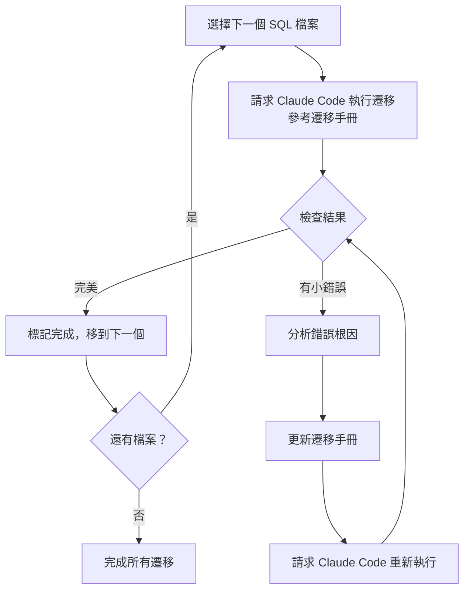

# 第 1 章：大規模遷移的挑戰與 AI 協作新範式

想像一下，你的團隊剛剛決定將現有的數據管道遷移到 dbt。你打開專案目錄，看到 50 個 SQL 檔案靜靜地躺在那裡，等待你的處理。每個檔案都有不同的模式：有些每天完全重建資料表，有些使用時間分區，還有些採用舊式的分片表設計。每個欄位都有精心撰寫的描述，部分還設定了 not null 約束。

這不是虛構的場景。這正是 2023 年末，M3 公司數據基盤團隊工程師坂元面臨的真實挑戰。

在本章中，我們將一起探索大規模遷移專案的真實挑戰，理解為何傳統方法不夠用，以及 AI 協作如何開啟新的可能性。到本章結束時，你將清楚了解：

- **大規模遷移的核心痛點**以及為何它們難以解決
- **傳統遷移方法的局限**與隱藏成本
- **AI 協作新範式**如何改變遊戲規則
- **本書的完整學習旅程**與你將獲得的成果

讓我們從坂元的辦公桌開始這段旅程。

---

## 1.1 遷移專案的痛點

### 50 個檔案的重量

「50 個 SQL 檔案需要遷移到 dbt。」當坂元第一次聽到這個任務時，心裡默默計算了一下：如果每個檔案手動處理需要 20-30 分鐘，那就是 16 到 25 小時的純執行時間。加上測試、驗證、文檔更新，整個專案可能需要好幾週。

但真正的挑戰不只是時間。

讓我們看看其中一個 SQL 檔案的複雜性：

```sql
-- daily_sales_summary.sql
-- 每日銷售彙總表
-- 更新頻率：每天凌晨 2:00
-- 負責人：數據團隊
-- 最後更新：2023-10-15

CREATE OR REPLACE TABLE `project.analytics.daily_sales_summary`
PARTITION BY DATE(sale_date)
OPTIONS(
  description="每日銷售彙總，包含產品類別、地區等維度",
  partition_expiration_days=730
)
AS
SELECT
  DATE(s.order_timestamp) as sale_date,  -- ‹1›
  p.product_category,
  p.product_subcategory,
  r.region_name,
  r.country_code,
  COUNT(DISTINCT s.order_id) as order_count,  -- ‹2›
  COUNT(DISTINCT s.customer_id) as customer_count,
  SUM(s.amount) as total_amount,  -- ‹3›
  AVG(s.amount) as avg_order_amount,
  SUM(s.quantity) as total_quantity
FROM `project.raw.sales` s
LEFT JOIN `project.raw.products` p  -- ‹4›
  ON s.product_id = p.product_id
LEFT JOIN `project.raw.regions` r
  ON s.region_id = r.region_id
WHERE
  s.order_timestamp >= TIMESTAMP_SUB(CURRENT_TIMESTAMP(), INTERVAL 90 DAY)  -- ‹5›
  AND s.status = 'completed'
  AND s.is_deleted = FALSE
GROUP BY
  sale_date,
  product_category,
  product_subcategory,
  region_name,
  country_code;
```

看起來很標準的 SQL，對吧？但魔鬼藏在細節中：

- **‹1›** 分區欄位定義：需要轉換為 dbt 的 `partition_by` 配置
- **‹2›** 業務邏輯：訂單數和客戶數的計算邏輯不能改變
- **‹3›** 聚合函數：必須保持原始的精確度
- **‹4›** JOIN 類型：LEFT JOIN 不能變成 INNER JOIN（這會改變結果）
- **‹5›** 過濾條件：90 天的滑動窗口必須完整保留

現在，想像你要將這樣的邏輯轉換為 dbt 模型，同時：
- 建立對應的 `sources.yml` 定義
- 撰寫 `schema.yml` 包含所有欄位描述
- 保留所有註解和文檔
- 配置正確的物化策略和分區設定
- 加入適當的測試

然後，**再重複 49 次**。

### 複雜性的三個維度

在 M3 的 50 個 SQL 檔案中，坂元發現了三種主要的複雜性來源：

#### 1. 模式多樣性

這 50 個檔案並非都相同。它們分為幾種不同的模式：

**完全更新表（Full Refresh Tables）** - 約 30 個檔案
```sql
CREATE OR REPLACE TABLE `project.dataset.table_name`
AS SELECT ...
```

每天完全重建整個表。這是最簡單的模式，但在 dbt 中需要正確配置 `materialized='table'`。

**分區表（Partitioned Tables）** - 約 10 個檔案
```sql
CREATE OR REPLACE TABLE `project.dataset.table_name`
PARTITION BY DATE(date_column)
OPTIONS(partition_expiration_days=365)
AS SELECT ...
```

使用時間或整數分區來提升查詢性能和降低成本。需要在 dbt 中配置 `partition_by`。

**分片表（Sharded Tables）** - 約 10 個檔案
```sql
CREATE OR REPLACE TABLE `project.dataset.table_20231101`
AS SELECT ...
```

每天建立新的表（如 `table_20231101`、`table_20231102`）。這是 BigQuery 早期的模式，現在需要遷移為分區表。

每種模式都需要不同的處理方式，不同的 dbt 配置，不同的測試策略。

#### 2. Schema 完整性要求

在 M3，每個資料表都有完整的 Schema 定義。以 `daily_sales_summary` 為例：

```sql
-- 欄位定義（來自 BigQuery Information Schema）
sale_date         DATE        NOT NULL    "銷售日期"
product_category  STRING                  "產品類別（家電、服飾、食品等）"
product_subcategory STRING               "產品子類別"
region_name       STRING      NOT NULL    "地區名稱"
country_code      STRING      NOT NULL    "國家代碼（ISO 3166-1 alpha-2）"
order_count       INT64       NOT NULL    "訂單數量"
customer_count    INT64       NOT NULL    "獨立客戶數"
total_amount      NUMERIC     NOT NULL    "總銷售金額（含稅）"
avg_order_amount  NUMERIC                 "平均訂單金額"
total_quantity    INT64       NOT NULL    "總銷售數量"
```

這些 Schema 資訊必須完整遷移到 dbt 的 `schema.yml`：

```yaml
models:
  - name: daily_sales_summary
    description: 每日銷售彙總，包含產品類別、地區等維度
    columns:
      - name: sale_date
        description: 銷售日期
        tests:
          - not_null
      - name: product_category
        description: 產品類別（家電、服飾、食品等）
      - name: total_amount
        description: 總銷售金額（含稅）
        tests:
          - not_null
      # ... 其他 7 個欄位
```

對於 50 個檔案，這意味著數百個欄位的描述需要遷移，數十個 not null 約束需要轉換為 dbt tests。

#### 3. 業務邏輯的精確性

最棘手的是業務邏輯的精確性。考慮這個看似簡單的計算：

```sql
-- 原始 SQL
SELECT
  user_id,
  COUNT(DISTINCT order_id) as order_count,
  SUM(amount) as total_spent
FROM orders
WHERE order_date >= '2023-01-01'
GROUP BY user_id
```

如果在遷移過程中，你不小心：
- 將 `COUNT(DISTINCT order_id)` 改成 `COUNT(order_id)`
- 改變了 WHERE 條件的日期
- 遺漏了某個 JOIN 條件

結果數據就會出錯，而這些錯誤可能不會立即被發現，直到某個業務報表出現異常，追查起來更加費時費力。

### 人工處理的隱藏成本

讓我們做個現實的計算。假設坂元決定手動處理這 50 個檔案：

**時間成本**：
- 分析原始 SQL：5-10 分鐘/檔案
- 建立 dbt 模型：10-15 分鐘/檔案
- 撰寫 sources 定義：5 分鐘/檔案
- 撰寫 schema.yml：10-15 分鐘/檔案（取決於欄位數量）
- 測試與驗證：5-10 分鐘/檔案

**平均每個檔案：35-55 分鐘**
**50 個檔案總計：29-46 小時**

這還沒包括：
- 遇到問題時的調試時間
- 文檔查閱時間
- 休息時間（連續做重複性工作的疲勞）
- Code review 與修正時間

現實中，這樣的專案可能需要 **2-3 週的全職工作**。

**錯誤成本**：

更嚴重的是錯誤。人類在處理重複性任務時容易疏忽：

- 第 15 個檔案：開始走神，遺漏一個 JOIN 條件
- 第 28 個檔案：複製貼上錯誤，source name 寫錯
- 第 42 個檔案：疲憊了，忘記加 not null test

每個錯誤可能需要額外的 30 分鐘到數小時來發現和修正。

**心理成本**：

坂元在部落格中半開玩笑地提到「肌腱炎風險」。這不只是笑話。長時間的重複性工作會導致：
- 注意力下降
- 動機降低
- 職業倦怠感

這才是大規模遷移真正的挑戰。

### 為什麼這個問題如此普遍？

M3 的情況並非特例。在數據工程領域，大規模遷移是常態：

- **技術演進**：從 Hadoop 到 Spark，從 ETL 工具到 dbt
- **雲端遷移**：從地端數據倉儲到 BigQuery、Snowflake、Redshift
- **架構重構**：從單體數據管道到模組化的 dbt 專案
- **合併與收購**：整合不同公司的數據基礎設施

每次技術棧的重大變更，都可能涉及數十甚至數百個檔案的遷移。

💡 **關鍵洞察**

大規模遷移的核心挑戰不是單個檔案有多複雜，而是**規模 × 複雜性 × 精確性**的三重困境。你需要在保證精確性的前提下，以可承受的時間和心理成本，處理大規模的複雜任務。

---

## 1.2 傳統遷移方法的局限

面對 50 個 SQL 檔案的遷移任務，大多數團隊會採用幾種「傳統」方法。讓我們看看每種方法的實際效果。

### 方法 1：純手動處理

這是最直觀的方法：坐下來，一個檔案一個檔案地處理。

**做法**：
1. 打開原始 SQL 檔案
2. 手動建立對應的 dbt 模型
3. 撰寫 sources.yml 和 schema.yml
4. 測試與驗證
5. 重複步驟 1-4，共 50 次

**優點**：
- ✅ 完全掌控每個細節
- ✅ 不需要額外工具或學習成本
- ✅ 適合非常小的專案（< 5 個檔案）

**缺點**：
- ❌ 時間成本高（2-3 週全職工作）
- ❌ 容易出錯（特別是第 20+ 個檔案後）
- ❌ 心理壓力大（重複性工作帶來的倦怠）
- ❌ 知識難以傳承（下次遷移又從頭開始）

**真實案例**：

某電商公司的數據團隊嘗試手動遷移 35 個 SQL 到 dbt。三週後：
- 完成了 28 個檔案
- 發現 12 個邏輯錯誤
- 團隊士氣低落
- 最終決定暫停專案

### 方法 2：腳本半自動化

聰明的工程師會想：「我可以寫個腳本來自動化部分工作！」

**做法**：
```python
# migrate.py - 簡單的遷移腳本
import re

def convert_sql_to_dbt(sql_file):
    # 讀取原始 SQL
    with open(sql_file) as f:
        content = f.read()

    # 提取 CREATE TABLE 之後的 SELECT
    match = re.search(r'CREATE.*?AS\s+(SELECT.*)', content, re.DOTALL)
    if match:
        select_query = match.group(1)

    # 簡單替換：project.raw.table -> {{ source('raw', 'table') }}
    dbt_query = re.sub(
        r'`project\.raw\.(\w+)`',
        r"{{ source('raw', '\1') }}",
        select_query
    )

    # 寫入 dbt 模型
    with open(f'models/{sql_file}', 'w') as f:
        f.write(dbt_query)
```

看起來不錯！但現實中：

**問題 1：正則表達式的脆弱性**
```sql
-- 這樣的 SQL 會讓正則表達式失效：
CREATE OR REPLACE TABLE `project.dataset.table`
PARTITION BY date  -- 包含 PARTITION 子句
OPTIONS(...)       -- 包含 OPTIONS 子句
AS
WITH cte AS (      -- 包含 CTE
  SELECT ...
)
SELECT * FROM cte;
```

**問題 2：無法處理複雜邏輯**
- 如何識別哪些表應該用 `source()`，哪些應該用 `ref()`？
- 如何提取欄位描述？
- 如何判斷需要哪些 tests？
- 如何處理 UDF？

**問題 3：一次性解決方案**
- 腳本通常針對特定模式設計
- 遇到新模式需要修改腳本
- 難以處理邊緣案例

**真實結果**：

腳本可以處理 60-70% 的「標準」檔案，但剩下的 30-40% 仍需手動處理。更糟的是，腳本生成的代碼需要仔細審查，因為錯誤可能悄悄潛入。

### 方法 3：外包或分散給團隊

「何不分散工作負擔？」有些團隊會將任務分配給多人。

**做法**：
- 將 50 個檔案分給 5 個工程師
- 每人處理 10 個檔案
- 並行執行，加速完成

**理論上的優點**：
- ✅ 時間縮短（從 3 週到 1 週）
- ✅ 分散工作負擔

**實際上的問題**：

**問題 1：一致性難以保證**
- 工程師 A 偏好這樣寫 sources.yml：
```yaml
sources:
  - name: raw_data
```
- 工程師 B 偏好：
```yaml
sources:
  - name: raw
```

**問題 2：協調成本**
- 需要定義標準（花費時間）
- Code review 負擔重
- 合併時可能衝突

**問題 3：知識分散**
- 每個人只了解自己負責的部分
- 整體架構理解不足

### 方法 4：「簡單」使用 AI

「那用 ChatGPT 或 Claude 不就好了？」這是 2023-2024 年最常聽到的反應。

很多人會這樣嘗試：

**初次嘗試**：
```
提示詞: 請將以下 SQL 轉換為 dbt 模型：

[貼上 SQL]
```

**AI 的回應**：
```sql
-- models/daily_sales_summary.sql
SELECT
  DATE(order_timestamp) as sale_date,
  product_category,
  COUNT(DISTINCT order_id) as order_count
FROM {{ source('raw', 'sales') }}
...
```

看起來完美！但仔細檢查後：

❌ **問題清單**：
1. 註解被刪除了（原始 SQL 的文檔全部遺失）
2. LEFT JOIN 被改成 INNER JOIN（結果數據會改變！）
3. 沒有生成 sources.yml
4. 沒有生成 schema.yml
5. 欄位描述遺失
6. not null 約束沒有轉換為 tests
7. 分區配置遺失

這正是坂元第一次嘗試時遇到的情況（我們在開頭提到的）。

**為什麼簡單使用 AI 不夠？**

AI（如 Claude、ChatGPT）非常聰明，但它們：
- **缺乏上下文**：不知道你的專案結構、命名慣例
- **過度「聰明」**：可能「優化」你不想改的邏輯
- **不一致**：每次生成的結果可能略有不同
- **缺乏記憶**：無法從之前的錯誤中學習

### 真正的痛點：知識傳遞的困難

所有傳統方法的共同問題是：**知識無法有效傳遞**。

想像這個場景：

你花了 3 週手動遷移 50 個檔案。過程中，你學到了：
- 哪些地方容易出錯
- 如何正確配置分區
- 如何處理特殊的 UDF

三個月後，團隊決定遷移另外 40 個檔案。但這次是另一位同事負責。他必須：
- 從頭開始摸索
- 重複你犯過的錯誤
- 再次花費 2-3 週

你的知識無法有效傳承。每次遷移都是重新開始。

### 我們需要更好的方法

傳統方法的核心問題是：

1. **不可擴展**：手動處理無法應對大規模任務
2. **容易出錯**：重複性工作導致疏忽
3. **知識流失**：經驗難以積累和傳承
4. **缺乏一致性**：不同人、不同時間的處理方式不同

我們需要一種方法，能夠：
- ✅ 處理大規模任務
- ✅ 保證精確性和一致性
- ✅ 累積和傳承知識
- ✅ 從錯誤中學習和改進

這就是 AI 協作新範式的價值所在。

---

## 1.3 AI 協作新範式

2023 年末，當坂元面對 50 個 SQL 檔案時，他做了一個不同的決定。他沒有選擇純手動處理，也沒有滿足於簡單地「丟給 AI」。相反，他探索了一種全新的協作模式。

### 第一次失敗的啟示

讓我們回到坂元的第一次嘗試。當他請求 Claude Code「將 xxx.sql 轉換為 dbt」時，結果雖然快速但充滿問題。

大多數人會在這時得出結論：「AI 還不夠成熟」，然後回到手動處理。

但坂元注意到一個關鍵點：**問題不是 AI 的能力不足，而是協作方式不對**。

想像你雇用了一位剛畢業的工程師。如果你只是說「把這個 SQL 轉成 dbt」，不提供任何背景、標準、或注意事項，新人的第一次嘗試也會有很多問題。

但如果你提供：
- 詳細的標準作業流程（SOP）
- 常見錯誤清單
- 實際範例
- 檢查清單

新人的表現會大幅改善。更重要的是，當他犯錯時，你可以更新 SOP，下次他就不會重複同樣的錯誤。

**這就是「遷移手冊（遷移手冊）」的概念誕生的時刻**。

### 遷移手冊：給 AI 的「教科書」

坂元意識到，他需要的不是更聰明的 AI，而是**更好的知識傳遞方式**。

於是他請求 Claude Code：

> 「請活用這次作業所獲得的知識，製作對未來作業有幫助的手冊」

Claude Code 生成了第一版手冊，結構如下：

```markdown
# dbt 模型遷移手冊 v1.0

## 1. 確認遷移來源的 SQL 檔案
[詳細步驟...]

## 2. 建立參照外部 schema 資料表的 sources 定義
[詳細步驟...]

## 3. 建立 dbt 模型的 SQL 檔案（每日完全更新資料表版）
[詳細步驟...]

## 4. 建立模型檔案時的注意事項
[注意事項清單...]

## 5. 建立 dbt 模型的 schema 檔案
[詳細步驟...]

## 6. 整體共通注意事項
[共通規則...]
```

這份手冊成為坂元與 Claude Code 之間的**知識橋樑**。

### 知識演進式協作循環

從第二個檔案開始，坂元採用了新的工作流程：



**關鍵的轉變**：

1. **從「使用 AI」到「與 AI 協作」**
   - 不是把任務丟給 AI 然後期待完美結果
   - 而是建立一個可以持續改進的協作系統

2. **從「一次性」到「累積性」**
   - 每個錯誤都轉化為知識
   - 知識累積在 Playbook 中
   - 下一個檔案就能受益

3. **從「人工審查」到「自我審查」**
   - Playbook 中加入「自我審查」章節
   - Claude Code 在完成後自動檢查常見錯誤
   - 提前發現和修正問題

### 實際成果：從失敗到成功

讓我們用數據說話。坂元記錄了整個遷移過程的指標：

**時間效率**：

| 階段 | 處理方式 | 平均時間/檔案 | Playbook 版本 |
|------|---------|--------------|--------------|
| 第 1-5 個檔案 | 手動 + 簡單 AI | 30-40 分鐘 | v1.0 |
| 第 6-15 個檔案 | AI + Playbook v1.0 | 15-20 分鐘 | v1.0 → v2.0 |
| 第 16-30 個檔案 | AI + Playbook v2.0 | 8-12 分鐘 | v2.0 → v2.5 |
| 第 31-50 個檔案 | AI + Playbook v3.0 | **3-5 分鐘** | v3.0（穩定）|

從第一個檔案的 40 分鐘，到最後階段的 5 分鐘，**效率提升了 8 倍**。

**錯誤率**：

| 階段 | 一次成功率 | 常見錯誤 |
|------|-----------|---------|
| 第 1-10 個檔案 | 20% | 註解遺失、JOIN 類型改變、sources 遺漏 |
| 第 11-30 個檔案 | 60% | sources 定義不完整、特殊 UDF 處理 |
| 第 31-50 個檔案 | **85%+** | 偶爾的邊緣案例 |

到專案後期，Claude Code 能夠一次就產出正確的代碼，只有 15% 的檔案需要微調。

**知識累積**：

遷移手冊從初版的 6 個章節，成長到最終版的 13 個章節：

```markdown
# dbt 模型遷移手冊 v3.0（最終版）

## 1. 確認遷移來源的 SQL 檔案
## 2. 建立參照外部 schema 資料表的 sources 定義
## 3. sources 定義遺漏檢查  ← 新增
## 4. 新增 sources 定義時的注意事項・疑難排解方法  ← 新增
## 5-a. 建立 dbt 模型的 SQL 檔案（每日完全更新資料表版）
## 5-b. 建立 dbt 模型的 SQL 檔案（分區資料表版）  ← 新增
## 5-c. 建立 dbt 模型的 SQL 檔案（分片資料表版）  ← 新增
## 6. 建立模型檔案時的注意事項
## 7. 建立 dbt 模型的 schema 檔案
## 8. 更新 dbt 執行環境（必要時）  ← 新增
## 9. 自我審查  ← 新增
## 10. 部署到 QA 環境  ← 新增
## 11. 進行動作驗證  ← 新增
## 12. 動作驗證時的注意事項・疑難排解方法  ← 新增
## 13. 整體共通注意事項
```

每個新增的章節都代表一個真實遇到的問題和解決方案。這些知識現在成為**團隊資產**，可以複用到未來的遷移專案。

### AI 協作新範式的三大支柱

基於 M3 的經驗，我們可以總結出有效 AI 協作的三大支柱：

#### 支柱 1：結構化知識傳遞

**關鍵**：不是臨時的提示詞，而是系統化的知識文檔。

遷移手冊不只是一份「README」，它是：
- **完整的工作流程**：從分析原始 SQL 到部署驗證
- **明確的標準**：什麼該做、什麼不該做
- **實際範例**：每個步驟都有具體例子
- **疑難排解**：常見問題的解決方案

這種結構化的知識，AI 能夠有效理解和應用。

#### 支柱 2：迭代式學習循環

**關鍵**：把每個錯誤轉化為知識。

傳統流程：
```
遇到錯誤 → 人工修正 → 繼續下一個 → 可能重複同樣錯誤
```

AI 協作流程：
```
遇到錯誤 → 分析根因 → 更新 Playbook → AI 學會避免 → 不再重複
```

這個循環的威力在於：AI 的「能力」隨著時間**持續成長**。

#### 支柱 3：自動化驗證機制

**關鍵**：讓 AI 自己檢查自己的工作。

在 Playbook 中加入「自我審查」章節後，Claude Code 會在完成遷移後：

1. 檢查 SQL 邏輯是否保留
2. 確認 sources 定義完整
3. 驗證 schema.yml 包含所有欄位
4. 檢查 JOIN 類型未改變
5. 確認註解已保留

這就像是給 AI 一份檢查清單，讓它在交付前自我審查。結果是錯誤率大幅下降。

### 超越技術：思維模式的轉變

AI 協作新範式不只是技術層面的改進，更是**思維模式的轉變**：

**舊思維**：
- AI 是工具，我使用它
- 期待一次就得到完美結果
- 失敗表示 AI 不夠好

**新思維**：
- AI 是協作夥伴，我們一起成長
- 接受初期會有錯誤，重點是建立改進機制
- 失敗是知識累積的機會

這種思維轉變，開啟了全新的可能性。

### 可複用性：不只是這一次

M3 的遷移手冊不只用於這 50 個檔案。在專案完成後：

1. **其他遷移專案**：團隊用同樣的遷移手冊遷移了另外 30 個數據管道
2. **新成員培訓**：新加入的工程師可以參考遷移手冊學習 dbt
3. **知識分享**：遷移手冊被其他團隊借鑑和改編

這就是**知識資產化**的價值。一次投入，多次受益。

💡 **核心洞察**

AI 協作的關鍵不是 AI 有多聰明，而是你如何與 AI 建立有效的知識傳遞和學習機制。遷移手冊就是這個機制的具體實現。

---

## 1.4 本書的實戰旅程預覽

現在你了解了 AI 協作的價值，讓我告訴你這本書將帶你走過怎樣的旅程。

### 從失敗到成功的完整路徑

這本書不會隱藏失敗。相反，我們會從坂元的第一次失敗開始，帶你走過完整的學習曲線：

```
第 1 次嘗試（失敗）→ 反思 → 建立手冊 →
第 2 次嘗試（改善）→ 發現新問題 → 更新手冊 →
第 10 次嘗試（良好）→ 持續優化 →
第 50 次嘗試（卓越）
```

你將看到：
- **真實的錯誤**：註解遺失、邏輯改變、約束遺漏
- **真實的挫折**：第 15 個檔案的疲憊、第 28 個檔案的困惑
- **真實的突破**：第一次一次成功的喜悅、Playbook 成型的成就感
- **真實的成果**：50 個檔案順利遷移、團隊知識累積

### 你將建立的核心產出物

本書是實作導向的。到最後，你將擁有以下可重用的產出物：

#### 1. 遷移手冊（完整版）

一份完整的遷移手冊，包含：
- 13 個核心章節
- 涵蓋 3 種主要遷移模式（完全更新、分區、分片）
- 50+ 條注意事項
- 10+ 個常見問題的疑難排解方案

這份 Playbook 可以直接用於你的 dbt 遷移專案，或改編為其他遷移場景（如 Spark to dbt、Redshift to BigQuery 等）。

#### 2. dbt 模型範例庫

60+ 個生產就緒的 dbt 模型範例，涵蓋：
- 完全更新表（Full Refresh）
- 時間分區表（Time-Partitioned）
- 整數分區表（Integer-Partitioned）
- 分片表轉分區表（Sharded to Partitioned）
- 複雜 UDF 處理
- Schema 遷移

每個範例都包含：
- 原始 SQL
- 對應的 dbt 模型
- sources.yml 定義
- schema.yml 定義
- 詳細註解說明

#### 3. 驗證腳本庫

完整的自動化驗證工具集：
- Schema 一致性驗證
- 數據一致性驗證（Row count、Checksum、Sample 比對）
- 驗證報告生成器
- QA 部署腳本

這些腳本用 Python 編寫，可直接整合到你的 CI/CD 流程。

#### 4. 自我審查清單

一份可複製的檢查清單，確保每次遷移的品質：
- SQL 邏輯檢查（15 項）
- Schema 完整性檢查（10 項）
- Sources 定義檢查（8 項）
- dbt 配置檢查（12 項）

### 學習路徑：四個部分

本書分為四個部分，每個部分都有明確的學習目標：

#### Part 1：基礎篇（第 1-3 章）

**目標**：理解挑戰，掌握基礎，完成第一次嘗試

- **第 1 章**（本章）：理解大規模遷移的挑戰與 AI 協作的價值
- **第 2 章**：認識 dbt 核心概念與 BigQuery 遷移目標
- **第 3 章**：環境設置，第一次嘗試（失敗），從失敗中學習

**你將完成**：
- 開發環境設置
- 第一個 SQL 到 dbt 的轉換
- 識別並記錄問題

#### Part 2：核心技術篇（第 4-8 章）

**目標**：建立 遷移手冊，掌握三種遷移模式

- **第 4 章**：建立 遷移手冊 v1.0
- **第 5 章**：完全更新表遷移模式
- **第 6 章**：分區表遷移
- **第 7 章**：分片表遷移
- **第 8 章**：Schema、約束、UDF 處理

**你將完成**：
- 完整的 遷移手冊 v2.0
- 三種主要模式的遷移範本
- 10-20 個實際檔案的遷移

#### Part 3：知識演進篇（第 9-11 章）

**目標**：系統化錯誤學習，建立自我審查機制

- **第 9 章**：知識迭代循環 - 從錯誤中學習
- **第 10 章**：自我審查機制設計
- **第 11 章**：疑難排解模式庫

**你將完成**：
- 遷移手冊 v3.0（最終版）
- 錯誤分類表與解決方案庫
- 自我審查檢查清單

#### Part 4：自動化與部署篇（第 12-14 章）

**目標**：自動化驗證，生產部署，團隊擴展

- **第 12 章**：自動化驗證流程
- **第 13 章**：QA 與生產環境部署
- **第 14 章**：團隊協作與知識資產化

**你將完成**：
- 完整的驗證腳本庫
- 多環境部署配置
- 團隊協作流程

### 附錄：快速參考資源

四個附錄提供快速查詢的參考資料：

- **附錄 A**：遷移手冊 v3.0 完整範本（可直接複製使用）
- **附錄 B**：dbt 與 SQL 語法對照表
- **附錄 C**：50+ 常見錯誤與解決方案
- **附錄 D**：Claude Code 提示詞最佳實踐

### 預期學習成果

完成本書後，你將能夠：

✅ **技術能力**：
- 獨立處理大規模 SQL 到 dbt 遷移
- 正確配置分區、約束、測試
- 建立完整的數據血緣和文檔

✅ **AI 協作能力**：
- 設計有效的 AI 協作工作流
- 建立和維護 遷移手冊
- 從錯誤中提煉可重用知識

✅ **系統思維**：
- 理解遷移的完整生命週期
- 設計自動化驗證策略
- 建立可擴展的團隊流程

✅ **可交付成果**：
- 可重用的 遷移手冊
- 生產就緒的代碼範例
- 自動化驗證工具

### 與其他書籍的區別

市面上有很多 dbt 書籍，但本書的獨特之處在於：

| 方面 | 其他 dbt 書籍 | 本書 |
|------|-------------|------|
| **焦點** | dbt 功能介紹 | 大規模遷移實戰 |
| **案例** | 簡化的範例 | 真實的 50 個 SQL 專案 |
| **AI 協作** | 不涉及 | 核心主題 |
| **知識傳承** | 個人學習 | 團隊知識資產化 |
| **產出物** | 概念性 | 生產就緒代碼 |
| **失敗經驗** | 較少提及 | 完整記錄並學習 |

### 誰應該讀這本書？

**最適合**：
- 正在規劃或執行 dbt 遷移的數據工程師
- 需要處理大規模數據管道遷移的團隊
- 想學習 AI 協作最佳實踐的技術人員
- 負責建立團隊知識資產的技術主管

**你將獲得最大收益如果**：
- 你熟悉 SQL 和關聯式資料庫
- 你的組織有 10+ 個需要遷移的 SQL/數據管道
- 你想建立可重用的遷移流程
- 你對 AI 協作感興趣但不知道如何開始

---

## 1.5 準備開始

讀到這裡，你已經了解了大規模遷移的挑戰、傳統方法的局限，以及 AI 協作新範式的價值。現在，讓我們為旅程做好準備。

### 你需要的基礎知識

本書假設你已經具備：

#### 必備知識 ✅
- **SQL 基礎**：SELECT、JOIN、GROUP BY、聚合函數
- **關聯式資料庫概念**：表、欄位、索引、約束
- **基本命令列操作**：cd、ls、執行腳本
- **Git 基礎**：clone、commit、push

#### 加分但非必需 ➕
- **dbt 基礎**：了解 models、sources、tests 概念
- **BigQuery 經驗**：熟悉分區、分片表
- **Python 基礎**：能讀懂和修改簡單腳本
- **數據管道經驗**：曾經維護過 ETL/ELT 流程

#### 不需要 ❌
- **AI/ML 專業知識**：我們關注應用，不涉及模型訓練
- **dbt 專家級知識**：我們會從基礎講起
- **深厚的程式設計背景**：會提供完整代碼範例

### 環境準備清單

在開始第 3 章的實作前，你需要準備以下環境：

#### 1. BigQuery 沙箱（免費）

```bash
# 步驟：
1. 訪問 https://console.cloud.google.com/
2. 創建新專案或使用現有專案
3. 啟用 BigQuery API
4. 創建沙箱數據集（免費，有每月 1TB 查詢限額）
```

💡 如果你沒有 BigQuery 環境，可以使用其他數據倉儲（Snowflake、Redshift），但範例代碼需要調整。

#### 2. dbt-bigquery 安裝

```bash
# 使用 pip 安裝（Python 3.7+）
pip install dbt-bigquery

# 驗證安裝
dbt --version
# 應該看到：installed version: 1.7.x 或更高
```

#### 3. Claude Code 或 Claude API

兩種選擇：

**選項 A：Claude Code（推薦）**
- 下載：https://claude.ai/code
- 優點：整合開發環境，更方便
- 缺點：需要訂閱

**選項 B：Claude API**
- 註冊：https://console.anthropic.com/
- 優點：靈活，可腳本化
- 缺點：需要編寫額外代碼

💡 本書範例基於 Claude Code，但概念適用於任何 LLM（如 ChatGPT、Gemini）。

#### 4. 代碼編輯器

推薦：
- **VS Code**（免費，有 dbt 擴充功能）
- **DataGrip**（付費，強大的數據庫工具）
- 任何你習慣的編輯器

#### 5. Git 與 GitHub

```bash
# 驗證 Git 安裝
git --version

# Clone 本書範例儲存庫
git clone https://github.com/manning/dbt-migration-in-action
cd dbt-migration-in-action
```

### 本書的使用方式

#### 建議閱讀路徑

**路徑 1：完整學習（推薦初學者）**
```
第 1 章 → 第 2 章 → 第 3 章 → ... → 第 14 章
```
按順序閱讀，完成所有練習。預計時間：6-8 週（每週 5-10 小時）。

**路徑 2：快速實戰（有 dbt 經驗者）**
```
第 1 章 → 第 3 章 → 第 4 章 → 第 9 章 → 第 12 章
```
重點關注 AI 協作方法和自動化。預計時間：2-3 週。

**路徑 3：特定模式參考（邊做邊查）**

直接跳到相關章節：
- 完全更新表 → 第 5 章
- 分區表 → 第 6 章
- 分片表 → 第 7 章
- 驗證與部署 → 第 12-13 章

#### 實作建議

1. **先讀再做**：每章先完整閱讀，理解概念後再動手
2. **實際操作**：不要只看代碼，親自執行並驗證
3. **建立自己的 Playbook**：根據你的專案需求調整
4. **記錄問題**：建立自己的錯誤與解決方案清單

#### 線上資源

**GitHub 儲存庫**：
```
github.com/manning/dbt-migration-in-action
├── code-examples/        # 所有章節的代碼範例
├── migration-playbook/   # Playbook 各版本
├── sql-examples/         # 原始 SQL 範例
└── validation-scripts/   # 驗證工具
```

**Manning 論壇**：
- 提問與討論：forums.manning.com
- 與作者和讀者交流
- 分享你的成功故事

**勘誤表**：
- 持續更新：manning.com/books/dbt-migration-in-action
- 提交你發現的錯誤

### 設定學習目標

在開始前，建議你設定清晰的目標：

#### 短期目標（完成 Part 1 後）
- [ ] 成功設置 dbt 開發環境
- [ ] 完成第一個 SQL 到 dbt 的轉換
- [ ] 理解 AI 協作的基本原則

#### 中期目標（完成 Part 2 後）
- [ ] 建立自己的 遷移手冊
- [ ] 成功遷移 10+ 個 SQL 檔案
- [ ] 掌握三種主要遷移模式

#### 長期目標（完成全書後）
- [ ] 完成實際專案的大規模遷移
- [ ] 建立團隊共享的知識資產
- [ ] 將 AI 協作方法應用到其他任務

### 心態準備

最後，也是最重要的：**心態準備**。

**接受失敗**：
- 你的第一次嘗試不會完美（坂元的也不是）
- 失敗是學習的一部分
- 關鍵是從失敗中提煉知識

**保持耐心**：
- 遷移手冊 的威力需要時間顯現
- 前 10 個檔案可能感覺緩慢
- 但第 30、40、50 個檔案你會看到成果

**積極實驗**：
- 不要只照抄範例
- 嘗試調整 Playbook 以適應你的需求
- 分享你的發現和改進

**團隊協作**：
- 如果可能，和同事一起學習
- 分享 Playbook 和經驗
- 建立團隊知識庫

### ✅ 準備檢查清單

在翻到第 2 章前，確認你：

- [ ] 理解了大規模遷移的核心挑戰
- [ ] 認同 AI 協作新範式的價值
- [ ] 清楚本書的結構和學習路徑
- [ ] 準備好開發環境（或計劃在第 3 章前完成）
- [ ] 設定了清晰的學習目標
- [ ] 調整好心態，準備從失敗中學習

如果你對以上都點頭，那麼恭喜，你已經準備好了！

---

## 本章總結

讓我們回顧本章的核心要點：

### 核心收穫

✅ **大規模遷移的三重困境**
- 規模：50+ 個檔案
- 複雜性：多種模式、完整 Schema、精確邏輯
- 精確性要求：任何錯誤都可能影響業務

✅ **傳統方法的四大局限**
- 純手動：時間成本高、容易出錯
- 腳本半自動化：難以處理複雜性
- 團隊分散處理：一致性難保證
- 簡單使用 AI：缺乏上下文，結果不可靠

✅ **AI 協作新範式的三大支柱**
- 結構化知識傳遞（遷移手冊）
- 迭代式學習循環（從錯誤中成長）
- 自動化驗證機制（自我審查）

✅ **實際成果**
- 效率提升 8 倍（從 40 分鐘/檔案 → 5 分鐘/檔案）
- 一次成功率達 85%+
- 知識累積為團隊資產

### 關鍵洞察

💡 **遷移挑戰的本質**

大規模遷移的困難不在於單個任務的複雜度，而在於**規模 × 複雜性 × 精確性**的三重挑戰。人工處理的極限不是能力，而是注意力和一致性。

💡 **AI 協作的關鍵**

AI 協作的價值不在於 AI 有多聰明，而在於你如何建立有效的**知識傳遞和學習機制**。遷移手冊 就是這個機制的具體實現。

💡 **知識演進的威力**

當你建立了從「錯誤 → 分析 → 知識 → Playbook → 改進」的循環，AI 的能力會隨時間**持續成長**。這不是一次性的工具使用，而是可持續的協作關係。

### 你的 AI 協作旅程開始了

這不是一本純理論書籍。從下一章開始，你將親手：
- 建立開發環境
- 完成第一次遷移嘗試
- 經歷失敗與挫折
- 建立你的 遷移手冊
- 看著 AI 從「新手」成長為「專家」
- 最終完成大規模遷移專案

M3 的坂元證明了這是可行的。現在，輪到你了。

---

## 下一章預告

在第 2 章，我們將深入了解 dbt 和 BigQuery 的核心概念。你將學習：

- **dbt 是什麼**，為何它成為現代數據轉換的標準
- **dbt 核心概念**：models、sources、tests、documentation
- **BigQuery 關鍵特性**：分區、分片、UDF
- **從 SQL 到 dbt 的思維轉換**：不只是語法，更是架構哲學
- **遷移成功標準**：如何定義「成功」？

這些基礎知識將為第 3 章的實際操作做好準備。

準備好了嗎？讓我們開始！

---

**下一章：第 2 章 - 認識 dbt 與 BigQuery 遷移目標** →
