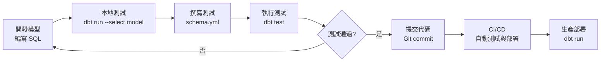

# 第 2 章：認識 dbt 與 BigQuery 遷移目標

在上一章，我們看到了 M3 團隊面臨的 50 個 SQL 檔案遷移挑戰。但在開始實際遷移前，我們需要先理解**遷移的目標**：dbt 是什麼？為何它值得遷移？以及 BigQuery 中有哪些關鍵特性需要特別處理？

在本章中，我們將為實際遷移工作打下堅實的理論基礎。到本章結束時，你將：

- **理解 dbt 核心概念**：models、sources、tests、documentation
- **掌握 BigQuery 關鍵特性**：分區、分片、UDF 的工作原理
- **建立 SQL 到 dbt 的思維轉換**：不只是語法，更是架構哲學
- **定義遷移成功標準**：如何判斷遷移是否成功

讓我們從一個簡單的問題開始：dbt 到底是什麼？

---

## 2.1 dbt 核心概念

### dbt 是什麼？

**dbt (data build tool)** 是一個開源的數據轉換工具，讓你能用 SQL 來轉換數據倉儲中的數據。

這個定義很簡潔，但可能不夠直觀。讓我們用一個具體的場景來理解。

### 傳統方式 vs dbt 方式

想像你需要建立一個「每日銷售彙總」報表。

**傳統 SQL 方式**：

```sql
-- daily_sales_summary.sql
-- 手動執行或用 cron job 排程

CREATE OR REPLACE TABLE `project.analytics.daily_sales_summary`
AS
SELECT
  DATE(order_timestamp) as sale_date,
  product_category,
  COUNT(*) as order_count,
  SUM(amount) as total_amount
FROM `project.raw.orders`
WHERE order_timestamp >= CURRENT_DATE() - 7
GROUP BY sale_date, product_category;
```

這段 SQL 能工作，但有幾個問題：

1. **依賴管理混亂**：如果這個查詢依賴其他表，你需要手動確保執行順序
2. **測試困難**：如何確保 `order_count` 總是 > 0？
3. **文檔分散**：註解寫在 SQL 裡，但查詢引擎看不到
4. **環境切換困難**：開發、測試、生產環境的表名如何管理？

**dbt 方式**：

同樣的邏輯，在 dbt 中被組織成三個檔案：

**1. 模型檔案**（`models/marts/daily_sales_summary.sql`）

```sql
-- dbt 模型 - 只包含 SELECT 邏輯
{{ config(
    materialized='table',
    partition_by={
      "field": "sale_date",
      "data_type": "date"
    }
) }}  -- ‹1›

SELECT
  DATE(order_timestamp) as sale_date,
  product_category,
  COUNT(*) as order_count,
  SUM(amount) as total_amount
FROM {{ source('raw', 'orders') }}  -- ‹2›
WHERE order_timestamp >= CURRENT_DATE() - 7
GROUP BY sale_date, product_category
```

**2. Sources 定義**（`models/staging/sources.yml`）

```yaml
version: 2

sources:
  - name: raw  -- ‹3›
    database: my-project
    schema: raw_data
    tables:
      - name: orders
        description: 原始訂單資料
        columns:
          - name: order_id
            description: 訂單唯一識別碼
          - name: order_timestamp
            description: 訂單時間戳
```

**3. Schema 定義**（`models/marts/schema.yml`）

```yaml
version: 2

models:
  - name: daily_sales_summary  -- ‹4›
    description: 每日銷售彙總表
    columns:
      - name: sale_date
        description: 銷售日期
        tests:
          - not_null  -- ‹5›
      - name: order_count
        description: 訂單數量
        tests:
          - not_null
          - dbt_utils.expression_is_true:
              expression: ">= 0"  -- ‹6›
```

**說明**：
- **‹1›** config 區塊定義物化策略和分區設定，與 SQL 邏輯分離
- **‹2›** source() 函數參照外部資料來源，不直接寫表名
- **‹3›** sources 定義讓 dbt 知道如何連接原始資料
- **‹4›** 每個模型都有詳細的文檔說明
- **‹5›** 自動化測試確保資料品質
- **‹6›** 自定義測試邏輯（訂單數不能為負）

看起來更複雜了？沒錯，但你獲得了：

✅ **自動依賴管理**：dbt 自動分析 source() 和 ref()，建立執行順序
✅ **內建測試**：not_null、unique、relationships 等開箱即用
✅ **完整文檔**：自動生成可視化的數據血緣圖
✅ **環境隔離**：透過 profiles.yml 輕鬆切換開發/生產環境

### dbt 的核心概念

讓我們逐一理解 dbt 的核心概念。

#### 1. Models（模型）

**Models 是 dbt 的核心**。一個 model 就是一個 SELECT 查詢，dbt 會將它物化（materialized）為資料倉儲中的表或視圖。

**模型檔案結構**：

```
models/
├── staging/           # 第一層：清理和標準化
│   ├── stg_orders.sql
│   └── stg_products.sql
├── intermediate/      # 第二層：業務邏輯
│   └── int_orders_with_products.sql
└── marts/            # 第三層：最終產出
    └── daily_sales_summary.sql
```

每個 `.sql` 檔案只包含 SELECT 邏輯：

```sql
-- models/staging/stg_orders.sql
SELECT
    order_id,
    customer_id,
    DATE(order_timestamp) as order_date,
    amount
FROM {{ source('raw', 'orders') }}
WHERE is_deleted = FALSE
```

當你執行 `dbt run`，dbt 會：
1. 分析所有模型的依賴關係
2. 按正確順序執行
3. 將每個 SELECT 物化為表或視圖

**物化策略**（materialization）：

| 策略 | 說明 | 使用場景 | BigQuery 實現 |
|------|------|---------|--------------|
| `table` | 每次重建整個表 | 數據量適中，每次全量更新 | `CREATE OR REPLACE TABLE` |
| `view` | 建立視圖 | 數據量小，或需要即時數據 | `CREATE OR REPLACE VIEW` |
| `incremental` | 只插入/更新新數據 | 大數據量，增量更新 | `INSERT INTO` + `MERGE` |
| `ephemeral` | 不物化，用 CTE | 中間邏輯，不需要持久化 | CTE（WITH 子句）|

在 M3 的 50 個 SQL 中，大部分使用 `table` 策略。

#### 2. Sources（資料來源）

**Sources 定義外部資料表**，通常是由其他系統（如 ETL 工具、應用程式）建立的原始資料。

**為何需要 sources？**

比較這兩種寫法：

**❌ 直接寫表名**：
```sql
FROM `my-project.raw_data.orders`
```

**✅ 使用 source()**：
```sql
FROM {{ source('raw', 'orders') }}
```

使用 source() 的好處：

1. **集中管理**：所有外部表定義在 `sources.yml` 中
2. **環境切換**：開發/生產環境只需改 profiles.yml
3. **數據血緣**：dbt 能追蹤數據來源
4. **新鮮度檢查**：可以設定資料更新頻率要求

```yaml
sources:
  - name: raw
    tables:
      - name: orders
        freshness:  # ‹1›
          warn_after: {count: 12, period: hour}
          error_after: {count: 24, period: hour}
        loaded_at_field: _loaded_at  # ‹2›
```

- **‹1›** 如果資料超過 12 小時未更新，發出警告；超過 24 小時則報錯
- **‹2›** 用 `_loaded_at` 欄位判斷資料新鮮度

#### 3. Tests（測試）

**Tests 確保數據品質**。dbt 提供兩種測試：

**Schema Tests（在 YAML 中定義）**：

```yaml
models:
  - name: daily_sales_summary
    columns:
      - name: sale_date
        tests:
          - not_null  # ‹1›
          - unique    # ‹2›
      - name: order_count
        tests:
          - not_null
          - dbt_expectations.expect_column_values_to_be_between:  # ‹3›
              min_value: 0
              max_value: 1000000
```

- **‹1›** 確保欄位不為 NULL
- **‹2›** 確保欄位值唯一
- **‹3›** 使用套件擴展測試（訂單數在合理範圍內）

**Data Tests（在 SQL 中定義）**：

```sql
-- tests/total_amount_matches_sum.sql
-- 驗證彙總金額等於明細金額總和

SELECT
  sale_date,
  SUM(amount) as detail_total,
  MAX(total_amount) as summary_total
FROM {{ ref('orders') }}
LEFT JOIN {{ ref('daily_sales_summary') }} USING (sale_date)
GROUP BY sale_date
HAVING detail_total != summary_total  -- ‹1›
```

- **‹1›** 如果查詢返回任何行，測試失敗

執行測試：
```bash
$ dbt test
# 執行所有測試

$ dbt test --select daily_sales_summary
# 只測試特定模型
```

#### 4. Documentation（文檔）

**Documentation 讓數據可發現**。dbt 自動生成互動式文檔網站。

**在 YAML 中撰寫文檔**：

```yaml
models:
  - name: daily_sales_summary
    description: |  # ‹1›
      每日銷售彙總表

      **更新頻率**: 每天凌晨 2:00
      **負責人**: 數據團隊
      **SLA**: T+1

      ## 業務邏輯
      - 銷售日期基於訂單時間戳（UTC）
      - 只包含已完成且未刪除的訂單

    columns:
      - name: sale_date
        description: 銷售日期（基於訂單時間戳）
```

- **‹1›** 支持 Markdown 格式的多行文檔

**生成文檔網站**：

```bash
$ dbt docs generate  # 生成文檔
$ dbt docs serve     # 啟動文檔伺服器
# 在瀏覽器訪問 http://localhost:8080
```

文檔網站包含：
- 所有模型、sources、tests 的說明
- 互動式數據血緣圖（Lineage Graph）
- 每個欄位的詳細說明
- 測試結果

### dbt 的工作流程

一個典型的 dbt 工作流程：



**開發循環**：

1. **編寫模型**：在 `models/` 目錄建立 `.sql` 檔案
2. **本地測試**：`dbt run --select my_model`
3. **加入測試**：在 `schema.yml` 定義測試
4. **執行測試**：`dbt test --select my_model`
5. **提交代碼**：Git commit & push
6. **CI/CD**：自動化測試與部署

### 為何選擇 dbt？

回到原點：為何 M3 決定遷移到 dbt？

**傳統 SQL 腳本的痛點**：

```
pain_points/
├── sql/
│   ├── 01_clean_data.sql        # 手動排序執行順序？
│   ├── 02_transform_data.sql
│   ├── 03_aggregate_data.sql
│   └── 99_final_report.sql
├── cron/
│   └── run_all.sh               # Shell 腳本管理依賴？
├── tests/
│   └── manual_checks.sql        # 手動測試？
└── docs/
    └── README.md                # 文檔與代碼分離？
```

**dbt 的解決方案**：

```
dbt_project/
├── models/
│   ├── staging/                 # ✅ 清晰的分層架構
│   ├── intermediate/
│   └── marts/
├── tests/                       # ✅ 自動化測試
├── docs/                        # ✅ 文檔與代碼同步
└── dbt_project.yml             # ✅ 集中配置
```

**核心優勢**：

| 特性 | 傳統 SQL | dbt |
|------|---------|-----|
| **依賴管理** | 手動排序 | 自動分析 `ref()` 和 `source()` |
| **測試** | 手動 SQL | 內建測試框架 |
| **文檔** | 分散在註解/Wiki | 與代碼同步的自動文檔 |
| **版本控制** | 困難（SQL + 外部腳本） | Git 友好（純文本檔案）|
| **環境管理** | 複雜（多套配置）| profiles.yml 統一管理 |
| **數據品質** | 人工審查 | 自動化測試 |
| **團隊協作** | 知識分散 | 集中的知識庫 |

💡 **關鍵洞察**

dbt 不只是一個工具，更是一種**數據轉換的最佳實踐**。它將軟體工程的概念（版本控制、測試、文檔、CI/CD）帶入數據工程領域。

---

## 2.2 BigQuery 關鍵特性

在遷移到 dbt 時，我們還需要理解 BigQuery 的關鍵特性，因為這些特性會影響我們的遷移策略。

### BigQuery 簡介

**BigQuery** 是 Google 的全管理、無伺服器的企業級數據倉儲。它的核心優勢：

- **極致性能**：秒級查詢 TB 甚至 PB 級數據
- **無需管理**：不用擔心伺服器、索引、分片
- **按需付費**：只為實際查詢的數據量付費
- **標準 SQL**：使用標準 SQL 語法

但在遷移時，有幾個 BigQuery 特有的概念需要特別注意。

### 表格類型

BigQuery 支持三種主要的表格類型，每種都有不同的使用場景和遷移策略。

#### 1. 標準表（Standard Tables）

最基本的表格類型，數據存儲在單一表中。

**原始 SQL**：
```sql
CREATE OR REPLACE TABLE `project.dataset.users`
AS
SELECT
  user_id,
  username,
  email,
  created_at
FROM `project.raw.user_registrations`;
```

**dbt 遷移**：

```sql
-- models/marts/users.sql
{{ config(materialized='table') }}  -- ‹1›

SELECT
  user_id,
  username,
  email,
  created_at
FROM {{ source('raw', 'user_registrations') }}
```

- **‹1›** 使用 `table` 物化策略，對應 BigQuery 的標準表

**適用場景**：
- 數據量小到中等（< 100 GB）
- 完全更新頻率（每次重建）
- 查詢模式多樣（沒有明確的分區鍵）

#### 2. 分區表（Partitioned Tables）

**分區表將數據按日期或整數範圍分割存儲**，查詢時只掃描相關分區，大幅降低成本和提升性能。

**時間分區表範例**：

**原始 SQL**：
```sql
CREATE OR REPLACE TABLE `project.dataset.daily_events`
PARTITION BY DATE(event_timestamp)  -- ‹1›
OPTIONS(
  partition_expiration_days=365,     -- ‹2›
  require_partition_filter=true      -- ‹3›
)
AS
SELECT
  event_id,
  user_id,
  event_type,
  event_timestamp,
  event_data
FROM `project.raw.events`;
```

**說明**：
- **‹1›** 按 `event_timestamp` 的日期部分分區
- **‹2›** 分區數據保留 365 天後自動刪除
- **‹3›** 要求查詢必須包含分區過濾條件（強制成本優化）

**dbt 遷移**：

```sql
-- models/marts/daily_events.sql
{{ config(
    materialized='table',
    partition_by={
      "field": "event_timestamp",
      "data_type": "timestamp",
      "granularity": "day"  -- ‹1›
    },
    cluster_by=["user_id", "event_type"],  -- ‹2›
    require_partition_filter=true
) }}

SELECT
  event_id,
  user_id,
  event_type,
  event_timestamp,
  event_data
FROM {{ source('raw', 'events') }}
```

- **‹1›** 分區粒度：day（每天一個分區）、hour、month、year
- **‹2›** clustering 進一步優化查詢（在分區內按欄位排序）

**整數範圍分區範例**：

```sql
-- models/marts/users_by_id.sql
{{ config(
    materialized='table',
    partition_by={
      "field": "user_id",
      "data_type": "int64",
      "range": {
        "start": 0,
        "end": 100000000,
        "interval": 100000  -- ‹1›
      }
    }
) }}

SELECT *
FROM {{ source('raw', 'users') }}
```

- **‹1›** 每 100,000 個 user_id 一個分區（0-99999, 100000-199999, ...）

**分區表的成本效益**：

假設你有一個 1 TB 的事件表，包含 3 年的數據。

**不使用分區**：
```sql
SELECT COUNT(*)
FROM events
WHERE event_date = '2024-01-01';

-- 掃描數據量：1 TB
-- 成本：$5 USD（按 $5/TB 計算）
```

**使用分區**：
```sql
SELECT COUNT(*)
FROM events
WHERE event_date = '2024-01-01';

-- 掃描數據量：~900 MB（1/365 天的數據）
-- 成本：$0.0045 USD
```

**成本降低 1000 倍以上！**

#### 3. 分片表（Sharded Tables）

**分片表是 BigQuery 早期的模式**，現在已不推薦使用，但在舊系統中很常見。

**什麼是分片表？**

不是一個表，而是多個表，每個表名帶有日期後綴：

```
dataset.events_20240101
dataset.events_20240102
dataset.events_20240103
...
dataset.events_20241231
```

**原始 SQL（生成分片表）**：

```sql
-- 每天執行一次，建立新的分片表
DECLARE target_date DATE DEFAULT CURRENT_DATE();

EXECUTE IMMEDIATE FORMAT("""
  CREATE OR REPLACE TABLE `project.dataset.events_%s`
  AS
  SELECT *
  FROM `project.raw.events`
  WHERE DATE(event_timestamp) = '%s'
""", FORMAT_DATE('%Y%m%d', target_date), target_date);
```

**分片表的問題**：

❌ **查詢複雜**：需要用通配符（wildcard）查詢
```sql
SELECT *
FROM `project.dataset.events_*`
WHERE _TABLE_SUFFIX >= '20240101'
  AND _TABLE_SUFFIX <= '20240131';
```

❌ **管理困難**：數百個表，難以維護

❌ **元數據開銷**：每個表都有元數據，拖慢查詢規劃

❌ **無法自動過期**：需要手動刪除舊表

**遷移策略：分片表 → 分區表**

這是 M3 遷移中的一個重要任務（約 10 個檔案）。我們會在第 7 章詳細討論。

**簡要預覽**：

```sql
-- models/marts/events.sql
-- 從分片表遷移到分區表

{{ config(
    materialized='incremental',  -- ‹1›
    partition_by={
      "field": "event_date",
      "data_type": "date"
    },
    unique_key='event_id'
) }}

SELECT
  event_id,
  user_id,
  event_type,
  DATE(event_timestamp) as event_date,
  event_timestamp
FROM {{ source('raw', 'events_*') }}  -- ‹2›

  -- ‹3›
WHERE DATE(event_timestamp) > (SELECT MAX(event_date) FROM {{ this }})

```

- **‹1›** 使用增量物化，不是每次重建整個表
- **‹2›** 用通配符查詢所有分片表
- **‹3›** 只處理新數據（增量更新）

### Schema 與約束

BigQuery 的 Schema 管理與傳統關聯式資料庫有所不同。

#### Schema 定義

**BigQuery 中查看 Schema**：

```sql
SELECT
  column_name,
  data_type,
  is_nullable,
  description
FROM `project.dataset.INFORMATION_SCHEMA.COLUMNS`
WHERE table_name = 'daily_sales_summary';
```

結果：
```
column_name       data_type   is_nullable   description
sale_date         DATE        NO            銷售日期
product_category  STRING      YES           產品類別（家電、服飾、食品等）
order_count       INT64       NO            訂單數量
total_amount      NUMERIC     NO            總銷售金額（含稅）
```

**在 dbt 中對應**：

```yaml
# models/marts/schema.yml
models:
  - name: daily_sales_summary
    columns:
      - name: sale_date
        description: 銷售日期
        data_type: date  # ‹1›
        tests:
          - not_null     # ‹2›
      - name: product_category
        description: 產品類別（家電、服飾、食品等）
        data_type: string
        # 沒有 not_null test = nullable  ‹3›
      - name: order_count
        description: 訂單數量
        data_type: int64
        tests:
          - not_null
```

- **‹1›** 明確標記數據類型（可選，但推薦）
- **‹2›** not_null test 對應 BigQuery 的 NOT NULL 約束
- **‹3›** 沒有測試表示該欄位可為 NULL

#### 約束支持

BigQuery 的約束支持有限：

| 約束類型 | BigQuery 支持 | dbt 對應 |
|---------|--------------|---------|
| NOT NULL | ✅ 支持 | `tests: [not_null]` |
| PRIMARY KEY | ⚠️ 不強制執行（僅元數據）| `tests: [unique, not_null]` |
| FOREIGN KEY | ⚠️ 不強制執行（僅元數據）| `tests: [relationships]` |
| UNIQUE | ❌ 不支持 | `tests: [unique]` |
| CHECK | ❌ 不支持 | Custom data tests |

**重點**：BigQuery 不強制執行約束，所以**測試非常重要**。

**範例：用 dbt tests 替代約束**：

```yaml
models:
  - name: orders
    columns:
      - name: order_id
        tests:
          - unique              # 替代 PRIMARY KEY
          - not_null
      - name: customer_id
        tests:
          - not_null
          - relationships:      # 替代 FOREIGN KEY
              to: ref('customers')
              field: customer_id
      - name: amount
        tests:
          - not_null
          - dbt_utils.expression_is_true:  # 替代 CHECK
              expression: "> 0"
```

### UDF（User-Defined Functions）

BigQuery 支持兩種 UDF：

#### 1. SQL UDF

**定義**：
```sql
CREATE OR REPLACE FUNCTION `project.dataset.calculate_discount`(
  amount FLOAT64,
  customer_tier STRING
)
RETURNS FLOAT64
AS (
  CASE customer_tier
    WHEN 'gold' THEN amount * 0.2
    WHEN 'silver' THEN amount * 0.1
    ELSE 0
  END
);
```

**使用**：
```sql
SELECT
  order_id,
  amount,
  `project.dataset.calculate_discount`(amount, customer_tier) as discount
FROM orders;
```

**dbt 遷移策略**：

選項 1：保留 UDF，用 dbt macro 呼叫

```sql
-- macros/call_udf.sql

  `{{ target.project }}.{{ target.schema }}.calculate_discount`({{ amount }}, {{ customer_tier }})

```

```sql
-- models/orders_with_discount.sql
SELECT
  order_id,
  amount,
  {{ calculate_discount('amount', 'customer_tier') }} as discount
FROM {{ ref('orders') }}
```

選項 2：轉換為 dbt macro（純 SQL）

```sql
-- macros/calculate_discount.sql

  CASE {{ customer_tier }}
    WHEN 'gold' THEN {{ amount }} * 0.2
    WHEN 'silver' THEN {{ amount }} * 0.1
    ELSE 0
  END

```

**何時選擇哪種？**

- **保留 UDF**：複雜邏輯、多個專案共用、性能關鍵
- **轉為 macro**：簡單邏輯、團隊偏好純 dbt、便於測試

#### 2. JavaScript UDF

BigQuery 也支持 JavaScript UDF，但更複雜：

```sql
CREATE TEMP FUNCTION parseJson(json STRING)
RETURNS STRUCT<name STRING, age INT64>
LANGUAGE js AS """
  return JSON.parse(json);
""";

SELECT parseJson('{"name": "Alice", "age": 30}') as parsed;
```

**dbt 遷移**：通常保留為 UDF，用 macro 包裝。

---

## 2.3 從原始 SQL 到 dbt 的轉變

現在我們理解了 dbt 和 BigQuery 的核心概念，讓我們看看實際的轉換過程。這不只是語法變化，更是**思維模式的轉換**。

### 思維模式轉換

**傳統 SQL 思維**：
```
我要建立一個表 → 我要寫一個 CREATE TABLE 語句 →
我要填入數據 → 我要寫一個 SELECT 查詢 →
完成！
```

**dbt 思維**：
```
我要建立一個數據模型 → 這個模型依賴哪些來源？ →
如何分層組織（staging/intermediate/marts）？ →
需要什麼測試來保證品質？→
如何撰寫文檔讓團隊理解？→
完成！
```

關鍵差異：**從「建表」到「建模」**。

### 範例 1：簡單的 SQL 轉換

讓我們從最簡單的例子開始。

**原始 SQL**：

```sql
-- simple_user_summary.sql
-- 用戶基本統計

CREATE OR REPLACE TABLE `my-project.analytics.user_summary`
AS
SELECT
  user_id,
  username,
  COUNT(order_id) as order_count,
  SUM(amount) as total_spent,
  MAX(order_date) as last_order_date
FROM `my-project.raw_data.orders`
GROUP BY user_id, username;
```

**dbt 版本**：

**步驟 1：建立 sources 定義**

```yaml
# models/staging/sources.yml
version: 2

sources:
  - name: raw_data
    database: my-project
    schema: raw_data
    tables:
      - name: orders
        description: 原始訂單資料
```

**步驟 2：建立 dbt 模型**

```sql
-- models/marts/user_summary.sql
{{ config(materialized='table') }}

SELECT
  user_id,
  username,
  COUNT(order_id) as order_count,
  SUM(amount) as total_spent,
  MAX(order_date) as last_order_date
FROM {{ source('raw_data', 'orders') }}  -- ‹1›
GROUP BY user_id, username
```

- **‹1›** 唯一的變化：表名 → source()

**步驟 3：加入 schema 定義**

```yaml
# models/marts/schema.yml
version: 2

models:
  - name: user_summary
    description: 用戶基本統計彙總
    columns:
      - name: user_id
        description: 用戶 ID
        tests:
          - unique
          - not_null
      - name: order_count
        description: 總訂單數
        tests:
          - not_null
      - name: total_spent
        description: 總消費金額
```

**執行**：
```bash
$ dbt run --select user_summary
# 建立表

$ dbt test --select user_summary
# 執行測試
```

### 範例 2：帶分區的複雜 SQL

現在來看一個更複雜的例子，包含分區、JOIN、CTE。

**原始 SQL**：

```sql
-- daily_sales_summary.sql
-- 每日銷售彙總（帶產品資訊）

CREATE OR REPLACE TABLE `my-project.analytics.daily_sales_summary`
PARTITION BY sale_date
OPTIONS(
  description="每日銷售彙總，包含產品類別資訊",
  partition_expiration_days=730
)
AS
WITH daily_orders AS (  -- ‹1›
  SELECT
    DATE(order_timestamp) as sale_date,
    product_id,
    amount,
    quantity
  FROM `my-project.raw_data.orders`
  WHERE status = 'completed'
    AND is_deleted = FALSE
)
SELECT
  d.sale_date,
  p.product_category,
  p.product_subcategory,
  COUNT(DISTINCT d.product_id) as unique_products,
  COUNT(*) as order_count,
  SUM(d.amount) as total_amount,
  SUM(d.quantity) as total_quantity
FROM daily_orders d
LEFT JOIN `my-project.raw_data.products` p  -- ‹2›
  ON d.product_id = p.product_id
GROUP BY
  sale_date,
  product_category,
  product_subcategory;
```

**說明**：
- **‹1›** 使用 CTE 組織複雜邏輯
- **‹2›** LEFT JOIN 保留所有訂單（即使產品資訊缺失）

**dbt 版本（推薦的分層方式）**：

**步驟 1：Staging 層 - 清理原始數據**

```sql
-- models/staging/stg_orders.sql
-- 清理和標準化訂單數據

SELECT
  order_id,
  product_id,
  DATE(order_timestamp) as order_date,
  amount,
  quantity,
  status,
  is_deleted
FROM {{ source('raw_data', 'orders') }}
```

```sql
-- models/staging/stg_products.sql
-- 清理和標準化產品數據

SELECT
  product_id,
  product_name,
  product_category,
  product_subcategory
FROM {{ source('raw_data', 'products') }}
```

**步驟 2：Intermediate 層 - 業務邏輯**

```sql
-- models/intermediate/int_orders_with_products.sql
-- 訂單與產品資訊結合

SELECT
  o.order_date,
  o.product_id,
  p.product_category,
  p.product_subcategory,
  o.amount,
  o.quantity
FROM {{ ref('stg_orders') }} o  -- ‹1›
LEFT JOIN {{ ref('stg_products') }} p
  ON o.product_id = p.product_id
WHERE o.status = 'completed'
  AND o.is_deleted = FALSE
```

- **‹1›** 使用 ref() 參照其他 dbt 模型

**步驟 3：Marts 層 - 最終彙總**

```sql
-- models/marts/daily_sales_summary.sql
-- 每日銷售彙總

{{ config(
    materialized='table',
    partition_by={
      "field": "sale_date",
      "data_type": "date"
    },
    partition_expiration_days=730
) }}

SELECT
  order_date as sale_date,  -- ‹1›
  product_category,
  product_subcategory,
  COUNT(DISTINCT product_id) as unique_products,
  COUNT(*) as order_count,
  SUM(amount) as total_amount,
  SUM(quantity) as total_quantity
FROM {{ ref('int_orders_with_products') }}
GROUP BY
  sale_date,
  product_category,
  product_subcategory
```

- **‹1›** 最終模型邏輯變得非常簡潔

**依賴關係**：

```
sources
  ├─ raw_data.orders
  └─ raw_data.products
       ↓
staging
  ├─ stg_orders
  └─ stg_products
       ↓
intermediate
  └─ int_orders_with_products
       ↓
marts
  └─ daily_sales_summary
```

dbt 自動分析這些依賴，按正確順序執行。

### 關鍵差異對照表

| 方面 | 原始 SQL | dbt |
|------|---------|-----|
| **表名引用** | `` `project.dataset.table` `` | `{{ source('dataset', 'table') }}` 或 `{{ ref('model') }}` |
| **CREATE TABLE** | 明確寫出 CREATE OR REPLACE TABLE | 透過 config() 配置 |
| **分區** | OPTIONS 子句 | config 中的 partition_by |
| **CTE** | 寫在同一個 SQL 內 | 分離為獨立的 intermediate 模型 |
| **文檔** | 註解 | schema.yml |
| **測試** | 手動 SQL | 自動化 tests |

### 範例 3：複雜的邏輯分解

讓我們看一個真實的複雜 SQL，以及如何在 dbt 中優雅地分解它。

**原始 SQL（200+ 行）**：

```sql
-- complex_customer_metrics.sql
-- 客戶綜合指標（包含 RFM 分析、生命週期價值等）

CREATE OR REPLACE TABLE `project.analytics.customer_metrics`
AS
WITH customer_orders AS (
  SELECT
    customer_id,
    DATE(order_timestamp) as order_date,
    amount,
    ROW_NUMBER() OVER (PARTITION BY customer_id ORDER BY order_timestamp) as order_number
  FROM orders
  WHERE status = 'completed'
),
customer_rfm AS (
  SELECT
    customer_id,
    MAX(order_date) as last_order_date,
    COUNT(*) as frequency,
    SUM(amount) as monetary
  FROM customer_orders
  GROUP BY customer_id
),
customer_cohorts AS (
  SELECT
    customer_id,
    MIN(order_date) as first_order_date,
    DATE_TRUNC(MIN(order_date), MONTH) as cohort_month
  FROM customer_orders
  GROUP BY customer_id
),
customer_lifetime_value AS (
  SELECT
    customer_id,
    AVG(amount) as avg_order_value,
    COUNT(DISTINCT DATE_TRUNC(order_date, MONTH)) as active_months
  FROM customer_orders
  GROUP BY customer_id
)
SELECT
  c.customer_id,
  c.customer_name,
  -- RFM metrics
  rfm.last_order_date,
  DATE_DIFF(CURRENT_DATE(), rfm.last_order_date, DAY) as recency_days,
  rfm.frequency,
  rfm.monetary,
  -- Cohort
  coh.first_order_date,
  coh.cohort_month,
  -- LTV
  ltv.avg_order_value,
  ltv.active_months,
  ltv.avg_order_value * ltv.frequency as estimated_ltv
FROM customers c
LEFT JOIN customer_rfm rfm ON c.customer_id = rfm.customer_id
LEFT JOIN customer_cohorts coh ON c.customer_id = coh.customer_id
LEFT JOIN customer_lifetime_value ltv ON c.customer_id = ltv.customer_id;
```

這個 SQL 有 200+ 行，包含多個 CTE，邏輯複雜。

**dbt 分解方式**：

```
models/
├── staging/
│   ├── stg_orders.sql          # 清理訂單數據
│   └── stg_customers.sql       # 清理客戶數據
├── intermediate/
│   ├── int_customer_orders.sql # 客戶訂單基礎（帶 order_number）
│   ├── int_customer_rfm.sql    # RFM 指標
│   ├── int_customer_cohorts.sql # 客戶分群
│   └── int_customer_ltv.sql    # 生命週期價值
└── marts/
    └── customer_metrics.sql    # 最終彙總（非常簡潔！）
```

**最終的 marts 模型**：

```sql
-- models/marts/customer_metrics.sql
-- 客戶綜合指標彙總

{{ config(materialized='table') }}

SELECT
  c.customer_id,
  c.customer_name,
  -- RFM
  rfm.last_order_date,
  rfm.recency_days,
  rfm.frequency,
  rfm.monetary,
  -- Cohort
  coh.first_order_date,
  coh.cohort_month,
  -- LTV
  ltv.avg_order_value,
  ltv.active_months,
  ltv.estimated_ltv
FROM {{ ref('stg_customers') }} c
LEFT JOIN {{ ref('int_customer_rfm') }} rfm USING (customer_id)
LEFT JOIN {{ ref('int_customer_cohorts') }} coh USING (customer_id)
LEFT JOIN {{ ref('int_customer_ltv') }} ltv USING (customer_id)
```

只有 ~20 行！所有複雜邏輯都被分解到 intermediate 層。

**好處**：

1. **可讀性**：每個模型只做一件事
2. **可重用**：`int_customer_rfm` 可以被其他模型使用
3. **可測試**：每個中間步驟都可以單獨測試
4. **可維護**：修改 RFM 邏輯只需改一個檔案

💡 **關鍵洞察**

dbt 的核心哲學是**模組化**。不要把所有邏輯塞在一個巨大的 SQL 中，而是分解為小的、可重用的模型。這不只是為了美觀，更是為了長期的可維護性。

---

## 2.4 遷移成功標準

在開始遷移前，我們需要定義：什麼叫做「成功的遷移」？

### 功能等價性

**核心原則**：遷移後的數據必須與原始 SQL 產生的數據**完全一致**。

**驗證方法**：

```sql
-- 驗證腳本範例
-- 比對原始表和 dbt 模型的數據

WITH original AS (
  SELECT * FROM `project.analytics.daily_sales_summary_original`
),
dbt_result AS (
  SELECT * FROM `project.analytics.daily_sales_summary`
),
diff AS (
  SELECT 'original_only' as source, * FROM original
  EXCEPT DISTINCT
  SELECT 'original_only' as source, * FROM dbt_result

  UNION ALL

  SELECT 'dbt_only' as source, * FROM dbt_result
  EXCEPT DISTINCT
  SELECT 'dbt_only' as source, * FROM original
)
SELECT
  source,
  COUNT(*) as row_count
FROM diff
GROUP BY source;

-- 如果返回 0 行，表示數據完全一致
```

**常見的「功能不等價」錯誤**：

❌ **JOIN 類型改變**
```sql
-- 原始：LEFT JOIN（保留所有左表記錄）
-- 錯誤遷移：INNER JOIN（只保留匹配的記錄）
-- 結果：數據筆數減少
```

❌ **聚合邏輯改變**
```sql
-- 原始：COUNT(DISTINCT order_id)
-- 錯誤遷移：COUNT(order_id)
-- 結果：數字不同
```

❌ **過濾條件遺漏**
```sql
-- 原始：WHERE status = 'completed' AND is_deleted = FALSE
-- 錯誤遷移：WHERE status = 'completed'
-- 結果：包含已刪除記錄
```

### Schema 完整性

**要求**：所有欄位、描述、約束都必須完整遷移。

**檢查清單**：

✅ **欄位數量和名稱一致**
```bash
# 使用 BigQuery INFORMATION_SCHEMA
SELECT column_name
FROM `project.dataset.INFORMATION_SCHEMA.COLUMNS`
WHERE table_name = 'original_table'
ORDER BY ordinal_position;

# 對比 dbt schema.yml
```

✅ **欄位類型一致**
```yaml
# schema.yml 應該反映實際的數據類型
columns:
  - name: amount
    data_type: numeric  # 不是 float64
```

✅ **描述完整遷移**
```yaml
# 原始 BigQuery 表的 description 應該遷移到 dbt
columns:
  - name: product_category
    description: 產品類別（家電、服飾、食品等）  # ← 必須保留
```

✅ **約束轉換為測試**
```yaml
# NOT NULL 約束 → not_null test
# UNIQUE 約束 → unique test
# FK 約束 → relationships test
```

### 性能基準

遷移後的查詢性能應該**相當或更好**。

**性能指標**：

1. **查詢時間**
```sql
-- 測試查詢
SELECT COUNT(*)
FROM daily_sales_summary
WHERE sale_date BETWEEN '2024-01-01' AND '2024-01-31';

-- 原始表：2.3 秒
-- dbt 模型：1.8 秒 ✅（相當或更快）
```

2. **掃描數據量**（影響成本）
```bash
# BigQuery 查詢計畫中的 "Bytes Processed"
# 原始表：15.2 GB
# dbt 模型：15.1 GB ✅（相當）
```

3. **建表時間**
```bash
# dbt run 時間
# 原始 SQL：45 分鐘
# dbt 模型：42 分鐘 ✅（相當或更快）
```

**性能優化技巧**（在 dbt 中）：

```sql
-- 使用分區
{{ config(
    partition_by={"field": "date", "data_type": "date"}
) }}

-- 使用 clustering
{{ config(
    cluster_by=["category", "region"]
) }}

-- 使用 incremental 物化（大表）
{{ config(
    materialized='incremental',
    unique_key='id'
) }}
```

### 可維護性提升

這是 dbt 的核心價值，也是遷移成功的重要指標。

**評估標準**：

✅ **依賴關係清晰**
```bash
# 執行 dbt docs generate 後，能看到清晰的血緣圖
# 而不是「不知道這個表從哪來」
```

✅ **測試覆蓋率**
```bash
$ dbt test
# 目標：至少 80% 的欄位有測試
# 所有關鍵欄位（ID、金額、日期）都有 not_null
```

✅ **文檔完整性**
```yaml
# 每個模型都有 description
# 每個重要欄位都有 description
# 業務邏輯在文檔中清楚說明
```

✅ **代碼可讀性**
```sql
# 原始 SQL：500 行的巨大查詢
# dbt：分解為 5 個模型，每個 < 100 行
# 任何人都能快速理解邏輯
```

### 團隊採用度

最終，遷移是否成功還要看**團隊是否願意使用**。

**採用指標**：

1. **開發效率**
   - 新增一個類似模型的時間：減少 50%+
   - 修改邏輯的時間：減少 30%+

2. **知識分享**
   - 新成員上手時間：從 2 週 → 3 天
   - 文檔查閱頻率：提升 10 倍

3. **錯誤率**
   - 上線後發現的數據錯誤：減少 70%+
   - Code review 發現的問題：減少 50%+

### 遷移成功檢查清單

在宣布遷移完成前，確認以下項目：

**功能驗證**：
- [ ] 數據完全一致（row count、checksum）
- [ ] 所有欄位存在且類型正確
- [ ] JOIN 類型未改變
- [ ] 聚合邏輯正確
- [ ] 過濾條件完整

**Schema 驗證**：
- [ ] 所有欄位描述已遷移
- [ ] NOT NULL 約束轉為 tests
- [ ] 其他約束轉為 tests
- [ ] 分區配置正確

**性能驗證**：
- [ ] 查詢時間相當或更快
- [ ] 掃描數據量相當
- [ ] 建表時間可接受

**品質驗證**：
- [ ] 所有測試通過
- [ ] 文檔完整
- [ ] 血緣圖正確
- [ ] Code review 通過

**部署驗證**：
- [ ] QA 環境測試通過
- [ ] 生產環境部署成功
- [ ] 監控告警正常

---

## 本章總結

讓我們回顧本章的核心要點：

### 核心收穫

✅ **dbt 核心概念**
- **Models**：SELECT 查詢，自動管理依賴
- **Sources**：外部資料定義，集中管理
- **Tests**：自動化數據品質檢查
- **Documentation**：與代碼同步的文檔系統

✅ **BigQuery 關鍵特性**
- **標準表**：基本表格，適合中小數據
- **分區表**：按日期/整數分區，大幅降低成本
- **分片表**：舊模式，需遷移為分區表
- **UDF**：保留或轉為 macro，視情況決定

✅ **SQL 到 dbt 的轉換**
- 表名 → `source()` 或 `ref()`
- CREATE TABLE → `config(materialized='...')`
- 複雜 CTE → 分層模型（staging/intermediate/marts）
- 註解 → schema.yml
- 手動測試 → 自動化 tests

✅ **遷移成功標準**
- 功能等價性：數據完全一致
- Schema 完整性：描述、約束都遷移
- 性能基準：相當或更好
- 可維護性：清晰、可測試、有文檔

### 關鍵洞察

💡 **dbt 的本質**

dbt 不只是「SQL 的另一種寫法」，而是將**軟體工程最佳實踐**帶入數據工程：版本控制、測試、文檔、模組化。這是思維模式的轉變。

💡 **分層架構的價值**

將巨大的 SQL 分解為 staging → intermediate → marts 三層，不只是為了美觀。這是為了：
- **可重用性**：intermediate 層可以被多個 marts 使用
- **可測試性**：每層都可以獨立測試
- **可維護性**：修改邏輯只影響局部

💡 **測試的重要性**

BigQuery 不強制執行約束，所以 dbt tests 不是「可選」，而是**必需**。它們是保證數據品質的唯一屏障。

### 你現在擁有的知識

完成本章後，你已經：
- ✅ 理解 dbt 的核心概念和工作原理
- ✅ 掌握 BigQuery 的關鍵特性
- ✅ 知道如何將 SQL 轉換為 dbt 模型
- ✅ 能夠定義遷移的成功標準

### 準備實戰

理論基礎已經打好。在下一章，我們將：
- 建立完整的開發環境
- 完成第一個真實的 SQL 到 dbt 遷移
- 經歷失敗、分析問題、學習教訓
- 為建立 Migration Playbook 打下基礎

這將是你的第一次實戰！

---

## 下一章預告

在第 3 章《環境設置與第一次嘗試》中，我們將：

- **建立 dbt 開發環境**：安裝 dbt-bigquery、配置 profiles.yml、初始化專案
- **選擇第一個遷移目標**：分析 M3 的第一個 SQL 檔案 `xxx.sql`
- **第一次嘗試**：直接請求 Claude Code「將 xxx.sql 轉換為 dbt」
- **發現問題**：註解遺失、邏輯改變、Schema 不完整...
- **反思與學習**：為什麼簡單的提示詞不夠？我們需要什麼？

這將是一個誠實的失敗記錄，也是 Migration Playbook 誕生的契機。

準備好了嗎？讓我們開始實戰！

---

**下一章：第 3 章 - 環境設置與第一次嘗試** →
