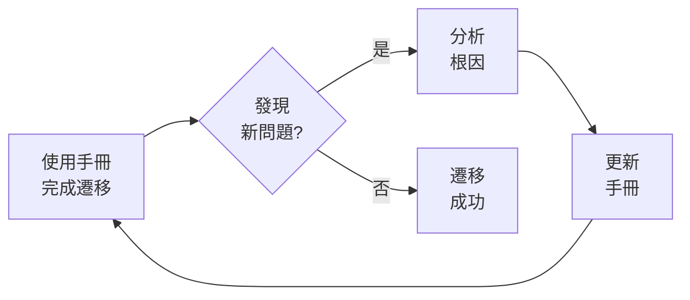
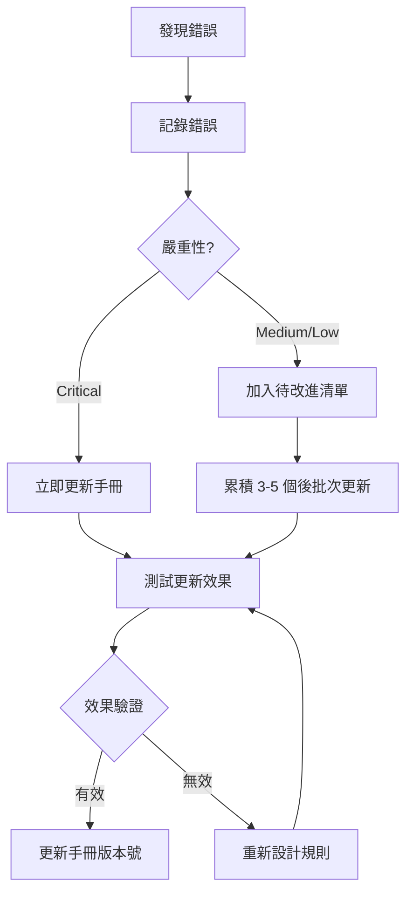

# 第 4 章：建立遷移手冊（Migration Playbook）

> 在本章中，我們將建立一份專門寫給 AI 閱讀的遷移手冊——Migration Playbook。這是整個專案的轉折點。到本章結束時，你將擁有一個包含 6 個核心章節的 Playbook v1.0，並且能夠用它指導 Claude Code 完成第二個 SQL 檔案的遷移，效率和準確性都將大幅提升。

在上一章中，我們完成了第一次遷移嘗試，但結果並不理想。Claude Code 生成的代碼雖然能運行，但存在許多問題：註解被刪除、邏輯被不必要地改寫、not null 限制遺失、Schema 描述不完整。最令人沮喪的是，我們花了 40-50 分鐘手動修正這些問題，這與我們期待的「AI 協作提升效率」相去甚遠。

但正是這次失敗，讓我們有了一個關鍵洞察：**簡單的提示詞不足以傳遞複雜的知識**。我們需要一種系統化的方式，將遷移的知識、經驗、注意事項組織起來，讓 AI 能夠理解和遵循。

這就是 Migration Playbook 誕生的背景。

## 4.1 Migration Playbook 的設計原則

### 4.1.1 為何需要手冊？

讓我們先回顧一下第一次嘗試時的提示詞：

```
請將 xxx.sql 轉換為 dbt 模型
```

這個提示詞有什麼問題？它太簡單了。它假設 Claude Code 已經知道：

- dbt 模型應該保留原始 SQL 的所有註解
- 不應該改變 SQL 的邏輯結構
- 需要保留 not null 等約束條件
- Schema 描述必須完整遷移
- 應該建立 sources 定義而不是硬編碼表名
- 還有許多其他的最佳實踐和注意事項

但實際上，Claude Code 並不知道這些。它只能根據一般的 dbt 知識來完成任務，而這些「我們的特定需求」並不包含在一般知識中。

💡 **關鍵洞察**：AI 不是讀心術。它需要明確的指引來理解你的特定需求和標準。

### 4.1.2 手冊的目標讀者：AI 助手

這是一個重要的思維轉換：**Migration Playbook 不是寫給人類的文檔，而是寫給 AI 的操作手冊**。

這意味著：

1. **結構化組織**：內容需要有清晰的章節和步驟
2. **明確的指令**：使用「必須」、「不可」、「檢查」等明確語言
3. **檢查清單形式**：便於 AI 逐項確認
4. **範例與反例**：展示什麼是正確的，什麼是錯誤的
5. **完整性**：涵蓋所有可能的情況和邊緣案例

讓我們看一個對比：

❌ **人類文檔的寫法**（不適合）：
```markdown
在遷移過程中，開發者應該注意保持代碼的可讀性，
包括註解和適當的格式化。同時，確保業務邏輯的
一致性也是很重要的。
```

✅ **AI 手冊的寫法**（適合）：
```markdown
## 建立模型檔案時的注意事項

### 保留註解
- [ ] 必須保留原始 SQL 中的所有註解
- [ ] 註解位置應與原始 SQL 一致
- [ ] 如果原始 SQL 有欄位級註解，也要保留

### 保持邏輯一致性
- [ ] 不可改變 SELECT 欄位的順序
- [ ] 不可改變 JOIN 的類型（INNER/LEFT/RIGHT/OUTER）
- [ ] 不可簡化或重寫 WHERE 條件
```

看到差異了嗎？第二種寫法提供了明確的檢查項目，AI 可以逐一確認。

### 4.1.3 關鍵設計原則

基於第一次嘗試的經驗，我們總結出 Migration Playbook 的五個核心設計原則：

**原則 1：結構化知識 vs 零散提示**

不要在每次提示時都重複所有注意事項，而是建立一份完整的手冊，每次只需要引用它。

對比：

❌ **零散提示**（每次都要重複）：
```
請將 xxx.sql 轉換為 dbt，記得保留註解、不要改變邏輯、
保留 not null 約束、建立 sources 定義、欄位描述要完整...
```

✅ **結構化手冊**（一次建立，重複使用）：
```
請參考 Migration Playbook v1.0 將 xxx.sql 轉換為 dbt 模型
```

**原則 2：從實際錯誤中提煉**

手冊的每一條規則都應該來自實際遇到的問題，而不是憑空想像。

例如，我們在第一次遷移中發現：
- 錯誤：註解被刪除 → 手冊規則：「必須保留所有原始註解」
- 錯誤：OUTER JOIN 變成 INNER JOIN → 手冊規則：「不可改變 JOIN 類型」
- 錯誤：not null 約束遺失 → 手冊規則：「檢查並保留所有約束」

**原則 3：可迭代、可演進**

初版手冊不需要完美。重要的是建立一個迭代改進的機制：



**原則 4：分層組織**

手冊內容應該按照實際工作流程分層組織：

1. **步驟層**：大的工作步驟（如「建立 sources 定義」）
2. **檢查層**：每個步驟的檢查清單
3. **疑難排解層**：遇到問題時的解決方案（後續版本加入）

**原則 5：具體而非抽象**

避免模糊的描述，使用具體的範例和明確的指令。

❌ **抽象**：「適當使用 dbt 函數」
✅ **具體**：「使用 {{ source('schema_name', 'table_name') }} 參照外部表，使用 {{ ref('model_name') }} 參照其他 dbt 模型」

### 4.1.4 手冊與提示詞的關係

你可能會問：「有了手冊，我還需要寫提示詞嗎？」

答案是：**手冊是知識庫，提示詞是任務指令**。

典型的工作流程是：

```markdown
【提示詞】
請參考 Migration Playbook v1.0 將 daily_sales.sql 轉換為 dbt 模型。

原始檔案位置：/path/to/daily_sales.sql
目標輸出：
1. models/staging/stg_daily_sales.sql
2. models/staging/schema.yml（包含此模型的定義）
3. models/sources.yml（如需要新的 sources）
```

在這個提示詞中：
- **「Migration Playbook v1.0」** 提供了所有的知識和規則
- **「daily_sales.sql」** 指定了具體的任務對象
- **輸出要求** 明確了預期的產出物

🔍 **深入理解**：把 Migration Playbook 想像成「教科書」，提示詞想像成「作業題目」。教科書提供知識和方法，作業題目指定具體要做什麼。

## 4.2 建立第一版手冊

現在讓我們開始建立 Migration Playbook v1.0。這個初版將專注於最基本的遷移場景：**每日完全更新資料表**。

### 4.2.1 初版手冊的範圍

在開始撰寫前，我們需要明確初版手冊的範圍：

**涵蓋的場景**：
- ✅ 每日完全更新資料表（CREATE OR REPLACE TABLE）
- ✅ 基本的 SELECT 邏輯
- ✅ Sources 定義
- ✅ Schema 檔案建立

**暫不涵蓋的場景**（後續版本加入）：
- ❌ 分區資料表
- ❌ 分片資料表
- ❌ 複雜的 UDF
- ❌ 增量更新模型

這種「先簡單、後複雜」的策略符合我們的演進原則。

### 4.2.2 手冊結構設計

基於第一次遷移的經驗，我們設計了以下 6 個核心章節：

```markdown
# dbt 模型遷移手冊 v1.0

## 1. 確認遷移來源的 SQL 檔案
## 2. 建立參照外部 schema 資料表的 sources 定義
## 3. 建立 dbt 模型的 SQL 檔案（每日完全更新資料表版）
## 4. 建立模型檔案時的注意事項
## 5. 建立 dbt 模型的 schema 檔案
## 6. 整體共通注意事項
```

這個結構遵循了實際的工作流程：分析原始檔案 → 建立 sources → 建立模型 → 建立 schema → 最終檢查。

### 4.2.3 完整的 Migration Playbook v1.0

讓我們逐章撰寫這份手冊。以下是完整內容：

```markdown
# dbt 模型遷移手冊 v1.0

本手冊用於指導將 BigQuery SQL 檔案遷移到 dbt 模型。
適用範圍：每日完全更新資料表（CREATE OR REPLACE TABLE）

---

## 1. 確認遷移來源的 SQL 檔案  ‹1›

在開始遷移前，請先確認原始 SQL 檔案的以下資訊：

### 檔案結構檢查
- [ ] 檔案是否包含 CREATE OR REPLACE TABLE 語法？
- [ ] 表格名稱是什麼？
- [ ] SELECT 查詢的邏輯是什麼？
- [ ] 是否使用了 UDF (User-Defined Functions)？
- [ ] 是否有特殊的資料處理邏輯？

### 依賴關係檢查
- [ ] 列出所有被參照的外部表格（FROM、JOIN 中的表）
- [ ] 這些外部表來自哪個 dataset/schema？
- [ ] 是否有參照其他 dbt 模型？（通常在初期遷移時沒有）

### 註解與文檔
- [ ] 原始 SQL 中是否有註解？（必須保留）
- [ ] 是否有欄位級的註解或說明？

**為何這一步很重要**：完整分析原始檔案可以避免遺漏重要資訊，
特別是依賴關係和註解。

---

## 2. 建立參照外部 schema 資料表的 sources 定義  ‹2›

對於所有在原始 SQL 中參照的外部表格，必須在 dbt 中建立 sources 定義。

### Sources 檔案位置
- 檔案路徑：`models/sources.yml` 或 `models/staging/sources.yml`
- 如果已存在 sources.yml，則在現有檔案中新增

### Sources 定義格式

```yaml
version: 2

sources:
  - name: source_schema_name  # 來源 schema 名稱
    description: "來源 schema 的描述"
    database: your-gcp-project-id  # GCP 專案 ID
    schema: actual_schema_name  # 實際的 schema 名稱
    tables:
      - name: table_name_1
        description: "表格描述"
      - name: table_name_2
        description: "表格描述"
```

### 關鍵注意事項
- [ ] `database` 必須是正確的 GCP 專案 ID
- [ ] `schema` 必須是實際的 BigQuery dataset 名稱
- [ ] `name`（source 名稱）可以是簡化的名稱，用於在模型中參照
- [ ] 每個被參照的表都要定義

### 範例

假設原始 SQL 參照了：
- `project-123.raw_data.orders`
- `project-123.raw_data.users`

則 sources 定義為：

```yaml
version: 2

sources:
  - name: raw  # 簡化名稱，方便使用
    description: "原始數據來源"
    database: project-123
    schema: raw_data
    tables:
      - name: orders
        description: "原始訂單資料表"
      - name: users
        description: "原始用戶資料表"
```

在 dbt 模型中使用時：
```sql
FROM {{ source('raw', 'orders') }}
```

---

## 3. 建立 dbt 模型的 SQL 檔案（每日完全更新資料表版）  ‹3›

### 檔案位置與命名
- 路徑：`models/staging/` 或適當的資料夾
- 命名：通常使用 `stg_` 前綴（staging 的縮寫）
- 範例：`models/staging/stg_daily_sales.sql`

### 基本轉換規則

**原始 SQL 格式**：
```sql
CREATE OR REPLACE TABLE `project.dataset.table_name` AS
SELECT
    field1,
    field2,
    field3
FROM `project.dataset.source_table`
WHERE condition
```

**dbt 模型格式**：
```sql
-- models/staging/stg_table_name.sql
-- [保留原始 SQL 的註解]

SELECT
    field1,
    field2,
    field3
FROM {{ source('source_name', 'source_table') }}
WHERE condition
```

### 關鍵轉換規則
- [ ] **移除 CREATE OR REPLACE TABLE** 語句（dbt 會自動處理）
- [ ] **保留整個 SELECT 查詢**（不要修改邏輯）
- [ ] **替換表格參照**：
  - 外部表：使用 `{{ source('name', 'table') }}`
  - dbt 模型：使用 `{{ ref('model_name') }}`（如有）
- [ ] **保留所有 WHERE、JOIN、GROUP BY 等邏輯**

### 範例轉換

**原始 SQL**：
```sql
-- 每日銷售彙總表
-- 用於分析每日銷售績效
CREATE OR REPLACE TABLE `my-project.analytics.daily_sales_summary` AS
SELECT
    DATE(order_timestamp) as sale_date,  -- 銷售日期
    product_id,  -- 產品 ID
    SUM(amount) as total_amount,  -- 總銷售額
    COUNT(*) as order_count  -- 訂單數量
FROM `my-project.raw_data.orders`
WHERE order_timestamp >= '2023-01-01'
GROUP BY 1, 2
```

**dbt 模型**：
```sql
-- models/staging/stg_daily_sales_summary.sql
-- 每日銷售彙總表
-- 用於分析每日銷售績效

SELECT
    DATE(order_timestamp) as sale_date,  -- 銷售日期
    product_id,  -- 產品 ID
    SUM(amount) as total_amount,  -- 總銷售額
    COUNT(*) as order_count  -- 訂單數量
FROM {{ source('raw', 'orders') }}
WHERE order_timestamp >= '2023-01-01'
GROUP BY 1, 2
```

---

## 4. 建立模型檔案時的注意事項  ‹4›

這是最容易出錯的部分，請務必仔細檢查。

### 註解保留（極為重要！）
- [ ] **必須保留原始 SQL 中的所有註解**
- [ ] 檔案開頭的註解（說明表格用途的）
- [ ] 欄位級註解（在欄位後面的 `-- 註解`）
- [ ] 邏輯區塊的註解（說明某段邏輯的）

⚠️ **常見錯誤**：AI 傾向於刪除註解以「簡化」代碼。
這是**絕對不可以**的！註解是重要的文檔。

### SQL 邏輯保持一致（絕對不可改變！）
- [ ] **不可改變 SELECT 欄位的順序**
- [ ] **不可改變欄位的計算邏輯**
- [ ] **不可改變 JOIN 的類型**
  - 如果原始是 LEFT JOIN，不可改為 INNER JOIN
  - 如果原始是 OUTER JOIN，不可改為 LEFT JOIN
- [ ] **不可簡化或重寫 WHERE 條件**
  - 即使邏輯上等價，也不要改
- [ ] **不可改變 GROUP BY 的欄位**

💡 **原則**：我們的目標是「遷移」而非「重構」。即使你發現
原始 SQL 有可以優化的地方，也不要在遷移階段修改。保持
100% 邏輯一致性是最高優先級。

### 表格參照的正確使用
- [ ] 外部表（不是 dbt 管理的）：使用 `{{ source('name', 'table') }}`
- [ ] 其他 dbt 模型：使用 `{{ ref('model_name') }}`
- [ ] 不要硬編碼完整表名（如 `` `project.dataset.table` ``）

### BigQuery 特定語法保留
- [ ] 保留 BigQuery 特有的函數（如 `DATE()`, `TIMESTAMP()` 等）
- [ ] 保留 backtick 引用（如果欄位名有特殊字元）
- [ ] 保留 STRUCT、ARRAY 等 BigQuery 資料型別

---

## 5. 建立 dbt 模型的 schema 檔案  ‹5›

每個 dbt 模型都需要在 schema.yml 中定義元數據。

### Schema 檔案位置
- 與模型檔案在同一資料夾
- 檔案名：`schema.yml`
- 範例：如果模型在 `models/staging/`，則 schema 檔案也在 `models/staging/schema.yml`

### Schema 檔案格式

```yaml
version: 2

models:
  - name: model_name  # 模型檔案名（不含 .sql）
    description: "模型的完整描述"
    columns:
      - name: column_name_1
        description: "欄位描述"
        tests:
          - not_null  # 如果原始有 NOT NULL 約束
      - name: column_name_2
        description: "欄位描述"
```

### 關鍵要求

**欄位描述**：
- [ ] **所有欄位都必須有 description**
- [ ] 描述應該清楚說明欄位的業務含義
- [ ] 如果原始 SQL 有欄位註解，使用該註解作為描述
- [ ] 如果沒有註解，根據欄位名和邏輯推斷並撰寫描述

**約束遷移**：
- [ ] 如果原始表定義中某欄位有 NOT NULL 約束，在 tests 中加入 `not_null`
- [ ] 如果某欄位是唯一鍵，在 tests 中加入 `unique`

### 完整範例

對於前面的 `stg_daily_sales_summary` 模型：

```yaml
version: 2

models:
  - name: stg_daily_sales_summary
    description: "每日銷售彙總表，用於分析每日銷售績效"
    columns:
      - name: sale_date
        description: "銷售日期，從訂單時間戳記轉換而來"
        tests:
          - not_null
      - name: product_id
        description: "產品唯一識別碼"
        tests:
          - not_null
      - name: total_amount
        description: "當日該產品的總銷售額"
      - name: order_count
        description: "當日該產品的訂單數量"
```

---

## 6. 整體共通注意事項  ‹6›

### 檔案組織
- [ ] 保持清晰的資料夾結構
- [ ] staging 模型放在 `models/staging/`
- [ ] 相關的模型可以放在同一子資料夾

### 命名規範
- [ ] 模型名稱使用小寫字母和底線
- [ ] staging 模型使用 `stg_` 前綴
- [ ] 避免使用縮寫（除非是廣為人知的）

### 測試與驗證
- [ ] 完成遷移後，使用 `dbt run -s model_name` 測試模型
- [ ] 檢查生成的表是否與原始表結構一致
- [ ] 比對幾筆數據確認邏輯正確

### 文檔更新
- [ ] 在 schema.yml 中提供完整的描述
- [ ] 如有特殊邏輯，在模型 SQL 的註解中說明

### 版本控制
- [ ] 每次遷移提交到 Git
- [ ] Commit 訊息清楚說明遷移了哪個模型
```

**‹1›** 第一步總是分析原始檔案。這確保我們完整理解遷移的來源，不會遺漏重要資訊。

**‹2›** Sources 定義是 dbt 的基礎。它讓我們用 `source()` 函數參照外部表，而不是硬編碼表名，提供了更好的可維護性和數據血緣追蹤。

**‹3›** 這是核心轉換步驟。關鍵是「移除 CREATE TABLE 語法，保留所有 SELECT 邏輯」。

**‹4›** 這個章節專門針對我們在第一次遷移中遇到的所有問題。「註解保留」和「邏輯一致性」是最容易被忽略的，因此特別強調。

**‹5›** Schema 檔案提供了模型的元數據和測試。完整的欄位描述對團隊協作至關重要。

**‹6›** 這些是跨越所有遷移的共通規範，確保整體的一致性和品質。

### 4.2.4 手冊的使用方式

有了這份手冊，我們的提示詞變得非常簡潔：

```markdown
請參考以下手冊，將 yyy.sql 遷移到 dbt 模型：

[貼上完整的 Migration Playbook v1.0 內容]

原始檔案：/path/to/yyy.sql
請產出：
1. dbt 模型 SQL 檔案
2. sources.yml（如需要新的 sources）
3. schema.yml（此模型的定義）
```

就這麼簡單！手冊包含了所有的知識和規則，我們只需要指定具體的任務對象。

## 4.3 測試手冊：第二個 SQL 檔案

現在是驗證手冊有效性的時刻。讓我們選擇第二個 SQL 檔案進行測試。

### 4.3.1 選擇測試對象

我們選擇 `user_activity_daily.sql` 作為第二個遷移對象。這個檔案的特點：

- **複雜度適中**：比第一個檔案稍微複雜一些
- **有多個 JOIN**：測試手冊對 JOIN 類型保持的要求
- **有豐富的註解**：測試註解保留規則
- **有 NOT NULL 約束**：測試約束遷移

原始 SQL（節錄）：

```sql
-- 用戶每日活動彙總表
-- 統計每位用戶的每日活動指標
-- 更新頻率：每日
CREATE OR REPLACE TABLE `my-project.analytics.user_activity_daily` AS
SELECT
    u.user_id,  -- 用戶 ID
    u.username,  -- 用戶名稱
    DATE(a.activity_timestamp) as activity_date,  -- 活動日期
    COUNT(DISTINCT a.session_id) as session_count,  -- 會話數
    SUM(a.page_views) as total_page_views,  -- 總頁面瀏覽數
    MAX(a.activity_timestamp) as last_activity_time  -- 最後活動時間
FROM `my-project.raw_data.users` u
LEFT JOIN `my-project.raw_data.activities` a  -- LEFT JOIN 保留所有用戶
    ON u.user_id = a.user_id
WHERE DATE(a.activity_timestamp) = CURRENT_DATE() - 1  -- 只處理昨天的數據
GROUP BY u.user_id, u.username, activity_date
```

### 4.3.2 使用手冊進行遷移

我們向 Claude Code 發送以下提示：

```markdown
請參考 Migration Playbook v1.0 將 user_activity_daily.sql 遷移到 dbt 模型。

[貼上完整的 Migration Playbook v1.0]

原始檔案內容：
[貼上上述 SQL]

請產出：
1. dbt 模型 SQL 檔案
2. sources.yml 更新（加入 users 和 activities 表）
3. schema.yml 中此模型的定義
```

### 4.3.3 Claude Code 的輸出

讓我們看看 Claude Code 這次的表現。

**1. Sources 定義**（`models/sources.yml`）：

```yaml
version: 2

sources:
  - name: raw
    description: "原始數據來源"
    database: my-project
    schema: raw_data
    tables:
      - name: orders
        description: "原始訂單資料表"
      - name: users
        description: "用戶基本資料表"
      - name: activities
        description: "用戶活動記錄表"
```

✅ **檢查**：正確加入了 users 和 activities 表的定義。

**2. dbt 模型**（`models/staging/stg_user_activity_daily.sql`）：

```sql
-- models/staging/stg_user_activity_daily.sql
-- 用戶每日活動彙總表
-- 統計每位用戶的每日活動指標
-- 更新頻率：每日

SELECT
    u.user_id,  -- 用戶 ID
    u.username,  -- 用戶名稱
    DATE(a.activity_timestamp) as activity_date,  -- 活動日期
    COUNT(DISTINCT a.session_id) as session_count,  -- 會話數
    SUM(a.page_views) as total_page_views,  -- 總頁面瀏覽數
    MAX(a.activity_timestamp) as last_activity_time  -- 最後活動時間
FROM {{ source('raw', 'users') }} u
LEFT JOIN {{ source('raw', 'activities') }} a  -- LEFT JOIN 保留所有用戶
    ON u.user_id = a.user_id
WHERE DATE(a.activity_timestamp) = CURRENT_DATE() - 1  -- 只處理昨天的數據
GROUP BY u.user_id, u.username, activity_date
```

✅ **檢查清單**：
- ✅ 所有註解都保留了（檔案開頭、欄位級、邏輯區塊）
- ✅ LEFT JOIN 沒有被改變
- ✅ SELECT 欄位順序一致
- ✅ WHERE 條件完全保留
- ✅ 使用了 `{{ source() }}` 函數

**3. Schema 定義**（`models/staging/schema.yml`）：

```yaml
version: 2

models:
  - name: stg_user_activity_daily
    description: "用戶每日活動彙總表，統計每位用戶的每日活動指標"
    columns:
      - name: user_id
        description: "用戶唯一識別碼"
        tests:
          - not_null
      - name: username
        description: "用戶名稱"
      - name: activity_date
        description: "活動發生的日期"
        tests:
          - not_null
      - name: session_count
        description: "當日該用戶的會話數量（不重複計算）"
      - name: total_page_views
        description: "當日該用戶的總頁面瀏覽數"
      - name: last_activity_time
        description: "當日該用戶的最後活動時間戳記"
```

✅ **檢查**：
- ✅ 所有欄位都有 description
- ✅ 主要欄位加入了 not_null 測試
- ✅ 描述清楚且完整

### 4.3.4 結果分析

這次的遷移**顯著改善**了！讓我們對比第一次（沒有手冊）和第二次（使用手冊）的結果：

| 檢查項目 | 第一次（xxx.sql） | 第二次（yyy.sql） | 改善 |
|---------|-----------------|-----------------|------|
| 註解保留 | ❌ 部分遺失 | ✅ 完整保留 | ✅ |
| JOIN 類型 | ⚠️ 改變過 | ✅ 保持一致 | ✅ |
| 欄位順序 | ⚠️ 被調整 | ✅ 完全一致 | ✅ |
| Sources 定義 | ✅ 正確 | ✅ 正確 | - |
| Schema 完整性 | ⚠️ 描述簡略 | ✅ 描述完整 | ✅ |
| NOT NULL 約束 | ❌ 遺失 | ✅ 正確遷移 | ✅ |

💡 **關鍵發現**：使用 Migration Playbook 後，之前遇到的主要問題都解決了！

### 4.3.5 仍然存在的小問題

但我們也發現了一個小問題：

在 schema.yml 中，`total_page_views` 的描述是：
```yaml
- name: total_page_views
  description: "當日該用戶的總頁面瀏覽數"
```

但根據原始 SQL，這個欄位是 `SUM(a.page_views)`，理想的描述應該更明確：
```yaml
- name: total_page_views
  description: "當日該用戶的總頁面瀏覽數（所有會話的 page_views 總和）"
```

這是一個小瑕疵，但提醒我們：**手冊還有改進空間**。

我們記錄下這個發現：

```markdown
【待改進】
- Schema 描述可以更詳細
- 對於聚合欄位（SUM, COUNT, MAX 等），應該明確說明聚合邏輯
```

這將成為下一版手冊的改進項目。

### 4.3.6 效率提升

更重要的是時間對比：

- **第一次遷移（沒有手冊）**：
  - Claude 生成：2 分鐘
  - 手動修正：40-50 分鐘
  - **總計：~45 分鐘**

- **第二次遷移（使用手冊）**：
  - Claude 生成：3 分鐘（稍長，因為讀取手冊）
  - 手動修正：5 分鐘（只有小瑕疵）
  - **總計：~8 分鐘**

效率提升了 **5-6 倍**！而且大部分時間都是 Claude Code 自動完成的，我們只需要做最後的檢查和微調。

🎯 **里程碑達成**：我們證明了 Migration Playbook 的概念是有效的！

## 4.4 迭代改進機制

Migration Playbook 不是一次性產物，而是持續演進的知識資產。讓我們建立一套迭代改進的機制。

### 4.4.1 錯誤收集與分類

每當我們發現問題時，應該記錄下來並分類：

**錯誤記錄模板**：

```markdown
【錯誤記錄】

**檔案**：yyy.sql
**發現時間**：2023-XX-XX
**錯誤類型**：Schema 描述不夠詳細
**具體問題**：聚合欄位的描述沒有說明聚合邏輯
**影響程度**：低（不影響功能，但影響可讀性）
**建議改進**：在手冊第 5 節加入「聚合欄位描述應包含計算邏輯」
```

### 4.4.2 錯誤分類體系

我們建立以下分類：

**嚴重性**：
- 🔴 **Critical**：影響功能正確性（如 JOIN 類型錯誤、邏輯改變）
- 🟡 **Medium**：影響可維護性（如註解遺失、命名不當）
- 🟢 **Low**：小瑕疵（如描述不夠詳細）

**類別**：
- **SQL 邏輯**：涉及查詢邏輯的問題
- **Schema 定義**：涉及 schema.yml 的問題
- **Sources 配置**：涉及 sources.yml 的問題
- **代碼風格**：格式、命名等問題

### 4.4.3 從錯誤到手冊更新的流程

建立標準化的更新流程：



**關鍵原則**：

1. **Critical 錯誤立即修正**：影響功能的問題不能拖延
2. **Medium/Low 錯誤批次處理**：避免手冊頻繁變動
3. **驗證改進效果**：每次更新後用新案例測試
4. **版本號管理**：每次更新遞增版本號（v1.0 → v1.1 → v2.0）

### 4.4.4 手冊版本控制策略

**版本號規則**：

- **主版本號**（v1.0 → v2.0）：結構性變化或新增大章節
  - 例如：加入「分區表遷移」章節
- **次版本號**（v1.0 → v1.1）：現有章節的擴充或優化
  - 例如：在第 5 節加入更詳細的描述規則

**變更記錄**：

每次更新都應該記錄：

```markdown
# Migration Playbook 變更歷史

## v1.1 (2023-XX-XX)
**變更類型**：次要更新

**新增**：
- 第 5 節：加入聚合欄位描述規範

**修正**：
- 第 4 節：強化 JOIN 類型檢查的說明

**測試**：使用 zzz.sql 驗證，問題已解決

---

## v1.0 (2023-XX-XX)
**變更類型**：初始版本

**內容**：
- 6 個核心章節
- 涵蓋每日完全更新資料表遷移
```

### 4.4.5 團隊協作中的手冊管理

如果是團隊使用 Migration Playbook，建議：

**Git 版本控制**：
```bash
migration-playbook/
├── playbook-v1.0.md
├── playbook-v1.1.md
├── playbook-v2.0.md
├── CHANGELOG.md
└── README.md
```

**Pull Request 審查流程**：

1. 任何人發現問題都可以提出改進建議
2. 在 PR 中說明：
   - 發現的問題
   - 建議的改進
   - 測試結果
3. 經團隊審查後合併

**使用最新版本**：

在每次遷移時，明確指定版本：
```markdown
請參考 Migration Playbook v1.1 進行遷移...
```

這確保所有人都使用統一的標準。

### 4.4.6 衡量手冊的成熟度

我們可以用以下指標追蹤手冊的成熟度：

| 指標 | 定義 | 目標值 |
|-----|------|-------|
| 一次成功率 | 不需修正即可使用的比例 | > 80% |
| 平均修正時間 | 發現問題到修正完成的時間 | < 10 分鐘 |
| Critical 錯誤率 | 嚴重錯誤的發生比例 | < 5% |
| 手冊穩定度 | 連續 N 個檔案無需更新手冊 | N > 10 |

當這些指標達標時，說明手冊已經相當成熟。

## 4.5 實戰練習：第三個檔案

現在輪到你了！使用 Migration Playbook v1.0 遷移第三個檔案。

### 4.5.1 練習任務

假設你有以下原始 SQL（`product_inventory_daily.sql`）：

```sql
-- 產品每日庫存快照
-- 記錄每個產品在每天結束時的庫存狀況
CREATE OR REPLACE TABLE `my-project.analytics.product_inventory_daily` AS
SELECT
    p.product_id,  -- 產品 ID
    p.product_name,  -- 產品名稱
    p.category,  -- 產品類別
    DATE(i.snapshot_timestamp) as snapshot_date,  -- 快照日期
    i.quantity_on_hand,  -- 在庫數量
    i.quantity_reserved,  -- 預留數量
    (i.quantity_on_hand - i.quantity_reserved) as available_quantity  -- 可用數量
FROM `my-project.raw_data.products` p
INNER JOIN `my-project.raw_data.inventory_snapshots` i
    ON p.product_id = i.product_id
WHERE DATE(i.snapshot_timestamp) = CURRENT_DATE() - 1
```

### 4.5.2 練習步驟

參考 Migration Playbook v1.0，完成以下任務：

1. **分析原始檔案**（對應手冊第 1 節）
   - [ ] 識別表格名稱
   - [ ] 列出所有外部表
   - [ ] 注意 JOIN 類型

2. **建立 Sources 定義**（對應手冊第 2 節）
   - [ ] 加入 `products` 和 `inventory_snapshots` 表

3. **建立 dbt 模型**（對應手冊第 3 節）
   - [ ] 轉換為 dbt SQL 格式
   - [ ] 保留所有註解
   - [ ] 使用 `{{ source() }}` 函數

4. **檢查注意事項**（對應手冊第 4 節）
   - [ ] 註解完整保留？
   - [ ] INNER JOIN 沒有被改變？
   - [ ] 計算欄位（available_quantity）邏輯一致？

5. **建立 Schema 定義**（對應手冊第 5 節）
   - [ ] 所有欄位都有描述？
   - [ ] 主要欄位有 not_null 測試？

### 4.5.3 參考答案

<details>
<summary>點擊查看參考答案</summary>

**sources.yml 更新**：
```yaml
sources:
  - name: raw
    database: my-project
    schema: raw_data
    tables:
      # ... 之前的表 ...
      - name: products
        description: "產品主檔"
      - name: inventory_snapshots
        description: "庫存快照記錄"
```

**dbt 模型**（`models/staging/stg_product_inventory_daily.sql`）：
```sql
-- models/staging/stg_product_inventory_daily.sql
-- 產品每日庫存快照
-- 記錄每個產品在每天結束時的庫存狀況

SELECT
    p.product_id,  -- 產品 ID
    p.product_name,  -- 產品名稱
    p.category,  -- 產品類別
    DATE(i.snapshot_timestamp) as snapshot_date,  -- 快照日期
    i.quantity_on_hand,  -- 在庫數量
    i.quantity_reserved,  -- 預留數量
    (i.quantity_on_hand - i.quantity_reserved) as available_quantity  -- 可用數量
FROM {{ source('raw', 'products') }} p
INNER JOIN {{ source('raw', 'inventory_snapshots') }} i
    ON p.product_id = i.product_id
WHERE DATE(i.snapshot_timestamp) = CURRENT_DATE() - 1
```

**schema.yml**：
```yaml
models:
  - name: stg_product_inventory_daily
    description: "產品每日庫存快照，記錄每個產品在每天結束時的庫存狀況"
    columns:
      - name: product_id
        description: "產品唯一識別碼"
        tests:
          - not_null
      - name: product_name
        description: "產品名稱"
      - name: category
        description: "產品所屬類別"
      - name: snapshot_date
        description: "庫存快照的日期"
        tests:
          - not_null
      - name: quantity_on_hand
        description: "在庫數量（實際庫存）"
      - name: quantity_reserved
        description: "已預留數量（已被訂單佔用但尚未出貨）"
      - name: available_quantity
        description: "可用數量（在庫數量減去預留數量）"
```

</details>

📝 **自我檢查**：
- 你的答案與參考答案有多相似？
- 是否遇到了任何困難？
- Migration Playbook 是否提供了足夠的指引?

## 本章總結

在本章中，我們完成了一個關鍵的里程碑：

✅ **建立了 Migration Playbook v1.0**，包含 6 個核心章節
✅ **定義了手冊設計原則**，特別是「給 AI 閱讀的文檔」這個核心概念
✅ **測試了手冊的有效性**，用第二個 SQL 檔案驗證，效率提升 5-6 倍
✅ **建立了迭代改進機制**，從錯誤到手冊更新的完整流程
✅ **實戰練習**，讓你親自體驗手冊的使用

### 核心收穫

**關於 Migration Playbook**：
- Migration Playbook 是給 AI 的「教科書」，不是給人類的文檔
- 初版不需要完美，重點是建立迭代機制
- 從實際錯誤中提煉知識是最有效的方法

**關於 AI 協作**：
- 簡單提示詞不足以傳遞複雜知識
- 結構化的手冊比零散的提示更有效
- AI 需要明確的檢查清單和範例

**關於迭代演進**：
- 錯誤是改進的源泉，不是失敗的證明
- 系統化記錄和分類錯誤很重要
- 版本控制讓手冊的演進清晰可追溯

### 我們解決了什麼問題？

回顧第 3 章，我們遇到的主要問題：

| 問題 | 解決方案 | 效果 |
|-----|---------|------|
| 註解被刪除 | 手冊第 4 節：明確要求保留所有註解 | ✅ 解決 |
| 邏輯被改寫 | 手冊第 4 節：禁止改變 SQL 邏輯 | ✅ 解決 |
| JOIN 類型改變 | 手冊第 4 節：列舉不可改變的項目 | ✅ 解決 |
| NOT NULL 遺失 | 手冊第 5 節：約束遷移規則 | ✅ 解決 |
| Schema 不完整 | 手冊第 5 節：所有欄位必須有描述 | ✅ 大幅改善 |

**遷移效率**：從 45 分鐘降到 8 分鐘，**提升了 5-6 倍**！

### 還有哪些改進空間？

我們也發現了一些待改進的地方：

- Schema 描述可以更詳細（特別是聚合欄位）
- 可以加入更多範例和反例
- 需要處理更複雜的場景（分區表、分片表）

這些將在後續章節中逐步完善。

### 下一章預告

在第 5 章，我們將深入第一種遷移模式：**每日完全更新資料表**。雖然 v1.0 手冊已經涵蓋了這個模式，但我們將：

- 系統化地分析這種模式的特點
- 建立可重用的模式範本
- 處理 3-5 個實際案例
- 讓 Claude Code 獨立完成遷移，驗證手冊的穩定性

這將是我們邁向「批量遷移」的第一步。當我們能穩定處理最常見的模式（佔 60% 案例）後，整個專案的進度將大幅加速。

準備好了嗎？讓我們繼續前進！

---

**本章產出物清單**：
- ✅ Migration Playbook v1.0（6 個章節）
- ✅ 手冊設計原則文檔
- ✅ 迭代改進流程圖
- ✅ 錯誤記錄模板
- ✅ 版本控制策略

**下一步行動**：
1. 將 Migration Playbook v1.0 保存為獨立文件（如 `playbook-v1.0.md`）
2. 使用它遷移 2-3 個類似的 SQL 檔案
3. 記錄任何新發現的問題
4. 準備進入第 5 章的深入實踐
