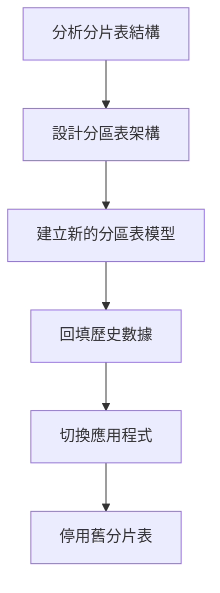
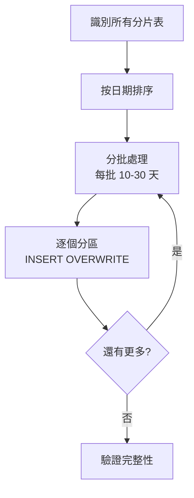

# 第 7 章：分片資料表（Sharded Tables）遷移

> 在本章中，我們將處理最具挑戰性的場景：**分片資料表**（Sharded Tables）。分片表是 BigQuery 早期的數據組織方式，現在需要遷移為現代的分區表。這不僅是語法轉換，還涉及歷史數據遷移和架構改造。到本章結束時，你將掌握從分片表到分區表的完整轉換策略，並建立可重用的回填腳本。

在前兩章中，我們掌握了完全更新表和分區表的遷移。現在面對的是M3專案中最複雜的10個SQL：分片表。這些表使用日期後綴命名（如 `events_20240101`, `events_20240102`），每天一個新表。這種模式在 BigQuery 早期很常見，但現在已被分區表取代。

## 7.1 分片表背景

### 7.1.1 什麼是分片表？

**分片表**（Sharded Tables）是一種將數據分散到多個獨立表的模式，通常使用時間後綴命名：

```
events_20240101  -- 2024年1月1日的數據
events_20240102  -- 2024年1月2日的數據
events_20240103  -- 2024年1月3日的數據
...
events_20241231  -- 2024年12月31日的數據
```

**視覺化對比**：

```
分片表模式（Sharded Tables）：
┌────────────┐ ┌────────────┐ ┌────────────┐       ┌────────────┐
│events_     │ │events_     │ │events_     │  ...  │events_     │
│20240101    │ │20240102    │ │20240103    │       │20241231    │
│（獨立表）   │ │（獨立表）   │ │（獨立表）   │       │（獨立表）   │
└────────────┘ └────────────┘ └────────────┘       └────────────┘
365 個獨立的表！

分區表模式（Partitioned Table）：
┌────────────────────────────────────────────────────────────────┐
│                        events（單一表）                         │
├──────────┬──────────┬──────────┬─────┬──────────────────────────┤
│2024-01-01│2024-01-02│2024-01-03│ ... │2024-12-31               │
│（分區）   │（分區）   │（分區）   │     │（分區）                  │
└──────────┴──────────┴──────────┴─────┴──────────────────────────┘
1 個表，365 個分區
```

### 7.1.2 為何使用分片表？（歷史原因）

你可能會問：「為何要建立365個獨立的表？這不是很麻煩嗎？」

這要回到 BigQuery 的歷史：

**2010-2015 年：分片表的黃金時代**

當時 BigQuery 的限制：
- ❌ 不支援分區表（partition by 功能尚未推出）
- ❌ 單表大小有限制
- ❌ 刪除舊數據很困難（只能 DROP TABLE）

分片表的優勢（當時）：
- ✅ 可以獨立刪除舊表（如刪除 events_20230101）
- ✅ 可以並行寫入不同的表
- ✅ 避免單表過大
- ✅ 可以設定不同表的存取權限

**2016 年之後：分區表登場**

BigQuery 推出了分區表功能，提供了更好的解決方案：
- ✅ 單一表管理（不需要 365 個表）
- ✅ 自動分區刪除（partition_expiration_days）
- ✅ 更高效的查詢（內建分區裁剪）
- ✅ 更簡單的元數據管理

**現狀**：
- 新專案應該使用分區表
- 舊專案的分片表需要遷移到分區表
- M3 的 10 個分片表就是歷史遺留

### 7.1.3 分片表的缺點

為何要遷移分片表？讓我們看看它的問題：

| 問題 | 說明 | 影響 |
|-----|------|------|
| **管理複雜** | 365 個表需要分別管理 | 運維負擔重 |
| **查詢困難** | 需要用 `_TABLE_SUFFIX` 或 UNION ALL | SQL 複雜 |
| **元數據膨脹** | 每個表都有獨立的元數據 | 資訊架構表龐大 |
| **成本不透明** | 無法統一設定過期策略 | 可能浪費儲存 |
| **權限管理** | 每個表需要分別設定權限 | 安全風險 |

**查詢複雜度對比**：

```sql
-- 分片表查詢（複雜）
SELECT *
FROM `project.dataset.events_*`  ‹1›
WHERE _TABLE_SUFFIX BETWEEN '20240101' AND '20240107'  ‹2›
  AND user_id = 12345

-- 分區表查詢（簡單）
SELECT *
FROM `project.dataset.events`
WHERE event_date BETWEEN '2024-01-01' AND '2024-01-07'
  AND user_id = 12345
```

**‹1›** 使用通配符匹配所有分片表
**‹2›** `_TABLE_SUFFIX` 是 BigQuery 的偽欄位，代表通配符後的部分

分區表查詢更直觀，且性能更好。

### 7.1.4 遷移策略概覽

從分片表遷移到分區表需要三個主要步驟：



**關鍵挑戰**：

1. **邏輯轉換**：從每日建立新表 → 每日更新同一表的新分區
2. **歷史數據**：如何將 365 個舊表的數據合併到新分區表？
3. **增量更新**：新數據應該用 incremental 還是 table materialization？
4. **向下兼容**：遷移期間，舊的查詢如何繼續運作？

讓我們逐一解決。

## 7.2 分片表邏輯分析

### 7.2.1 典型分片表 SQL

以下是一個真實的分片表 SQL（已脫敏）：

```sql
-- ===================================
-- 表名模式：product_sales_YYYYMMDD
-- 用途：產品每日銷售明細
-- 分片：按日期建立獨立表
-- 執行頻率：每日 03:00
-- ===================================

-- 生成今天的表名
DECLARE target_date DATE DEFAULT CURRENT_DATE() - 1;  ‹1›
DECLARE target_table_suffix STRING DEFAULT FORMAT_DATE('%Y%m%d', target_date);  ‹2›
DECLARE target_table STRING DEFAULT CONCAT('m3-project.analytics.product_sales_', target_table_suffix);  ‹3›

-- 動態建立表
EXECUTE IMMEDIATE FORMAT(  ‹4›
    """
    CREATE OR REPLACE TABLE `%s` AS
    SELECT
        sale_id,
        product_id,
        product_name,
        category,
        DATE(sale_timestamp) as sale_date,
        quantity,
        unit_price,
        total_amount,
        customer_id,
        region
    FROM `m3-project.raw_data.sales`
    WHERE DATE(sale_timestamp) = @target_date
      AND status = 'completed'
    """,
    target_table
) USING target_date AS target_date;  ‹5›
```

**關鍵特徵分析**：

**‹1› DECLARE target_date**
- 計算目標日期（通常是昨天）
- 用於過濾數據和命名表

**‹2› 生成表名後綴**
- 將 DATE 格式化為 YYYYMMDD（如 '20240101'）
- 用於拼接完整表名

**‹3› 拼接完整表名**
- `product_sales_20240101`
- `product_sales_20240102`
- 每天不同

**‹4› EXECUTE IMMEDIATE**
- 動態 SQL 執行
- 因為表名是變數，無法用靜態 SQL

**‹5› USING 參數化**
- 將 `target_date` 作為參數傳入動態 SQL
- 避免 SQL 注入風險

### 7.2.2 分片表的數據流

**每日執行流程**：


**結果**：每天創建一個新表，包含當天的數據。

**查詢歷史數據**：

要查詢一週的數據，需要：

```sql
-- 方法 1：UNION ALL（繁瑣）
SELECT * FROM `m3-project.analytics.product_sales_20240101`
UNION ALL
SELECT * FROM `m3-project.analytics.product_sales_20240102`
UNION ALL
SELECT * FROM `m3-project.analytics.product_sales_20240103`
UNION ALL
SELECT * FROM `m3-project.analytics.product_sales_20240104`
UNION ALL
SELECT * FROM `m3-project.analytics.product_sales_20240105`
UNION ALL
SELECT * FROM `m3-project.analytics.product_sales_20240106`
UNION ALL
SELECT * FROM `m3-project.analytics.product_sales_20240107`

-- 方法 2：通配符（稍好）
SELECT *
FROM `m3-project.analytics.product_sales_*`
WHERE _TABLE_SUFFIX BETWEEN '20240101' AND '20240107'
```

兩種方法都不夠優雅。

### 7.2.3 識別關鍵轉換點

要將分片表遷移到分區表，需要識別以下關鍵元素：

**檢查清單**：

- [ ] **時間維度欄位**：用於分區的日期欄位（如 `sale_date`）
- [ ] **表名模式**：`{prefix}_{YYYYMMDD}` 的模式
- [ ] **日期計算邏輯**：如何計算目標日期（`CURRENT_DATE() - 1`）
- [ ] **數據過濾條件**：`WHERE DATE(sale_timestamp) = @target_date`
- [ ] **其他過濾條件**：`AND status = 'completed'`
- [ ] **動態 SQL 使用**：`EXECUTE IMMEDIATE`

**對應到分區表**：

| 分片表元素 | 分區表元素 | 轉換 |
|----------|-----------|------|
| 表名後綴 `_20240101` | 分區 `sale_date = '2024-01-01'` | 從名稱到欄位值 |
| `CREATE OR REPLACE TABLE` | `INSERT OVERWRITE` | 從創建表到覆寫分區 |
| 動態表名 | 固定表名 + 分區欄位 | 簡化 SQL |
| `_TABLE_SUFFIX` 查詢 | `WHERE sale_date` 查詢 | 更直觀 |

### 7.2.4 複雜度分級

並非所有分片表都一樣複雜。我們可以分級處理：

**Level 1：簡單分片表**
- 單一來源表
- 簡單的 SELECT 查詢
- 沒有 JOIN
- 範例：日誌表、事件表

**Level 2：中等分片表**
- 多個來源表 JOIN
- 有聚合邏輯（GROUP BY）
- 有 CTE
- 範例：每日彙總報表

**Level 3：複雜分片表**
- 多層 CTE
- 複雜的窗口函數
- 自連接
- UDF 使用
- 範例：用戶行為分析表

本章我們處理 Level 1 和 Level 2，Level 3 的策略相同，只是邏輯更複雜。

## 7.3 遷移為分區表

現在讓我們實際遷移前面的 `product_sales` 分片表。

### 7.3.1 Step 1: 設計目標架構

**目標**：將 `product_sales_YYYYMMDD` 遷移為單一分區表 `product_sales`

**架構對比**：

```
【遷移前】
product_sales_20230101
product_sales_20230102
...
product_sales_20241231
（365 個獨立表）

【遷移後】
product_sales
├── partition: sale_date = 2023-01-01
├── partition: sale_date = 2023-01-02
...
└── partition: sale_date = 2024-12-31
（1 個表，365 個分區）
```

**分區配置決策**：

- **分區欄位**：`sale_date`（DATE 類型）
- **分區粒度**：DAY
- **物化策略**：incremental（每日只更新一個分區）
- **增量策略**：insert_overwrite

### 7.3.2 Step 2: 建立 dbt Incremental 模型

創建 `models/marts/product_sales.sql`：

```sql
-- models/marts/product_sales.sql
-- ===================================
-- 表名：product_sales（分區表）
-- 用途：產品每日銷售明細
-- 分區：按 sale_date（DATE）
-- 遷移自：product_sales_YYYYMMDD（分片表）
-- ===================================

{{
    config(
        materialized='incremental',  ‹1›
        partition_by={
            'field': 'sale_date',
            'data_type': 'date',
            'granularity': 'day'
        },
        cluster_by=['product_id', 'region'],
        incremental_strategy='insert_overwrite',  ‹2›
        on_schema_change='fail',  ‹3›
        partition_expiration_days=730  ‹4›
    )
}}

SELECT
    sale_id,
    product_id,
    product_name,
    category,
    DATE(sale_timestamp) as sale_date,  ‹5›
    quantity,
    unit_price,
    total_amount,
    customer_id,
    region
FROM {{ source('raw_data', 'sales') }}
WHERE DATE(sale_timestamp) = CURRENT_DATE() - 1  ‹6›
  AND status = 'completed'

  ‹7›
    -- 增量模式：只處理昨天的數據
    -- （上面的 WHERE 條件已經限制了，這裡只是文檔說明）

```

**關鍵轉換說明**：

**‹1› materialized='incremental'**
- 每次運行只更新新分區
- 不重建整個表

**‹2› incremental_strategy='insert_overwrite'**
- 覆寫整個分區
- 確保分區數據的完整性
- 對應原始 SQL 的 `CREATE OR REPLACE TABLE`

**‹3› on_schema_change='fail'**
- 如果 schema 改變，中止執行並報錯
- 避免意外的結構變更
- 可選：'append_new_columns' 或 'sync_all_columns'

**‹4› partition_expiration_days=730**
- 自動刪除 730 天（2 年）前的分區
- 對應原始分片表的數據保留策略

**‹5› sale_date 欄位**
- 分區欄位，必須出現在 SELECT 中
- 從 TIMESTAMP 提取 DATE

**‹6› 過濾昨天的數據**
- 與原始 SQL 的邏輯一致
- 每日只處理昨天的數據

**‹7› is_incremental() 區塊**
- 首次運行（`dbt run --full-refresh`）：處理所有歷史數據（如果來源有的話）
- 增量運行：只處理昨天的數據

### 7.3.3 關鍵差異對比

讓我們對比原始 SQL 和 dbt 模型：

| 原始分片表 SQL | dbt 分區表模型 | 說明 |
|--------------|---------------|------|
| `DECLARE target_table` | （不需要） | dbt 管理表名 |
| `EXECUTE IMMEDIATE` | （不需要） | 不需要動態 SQL |
| `CREATE OR REPLACE TABLE product_sales_20240101` | `config(materialized='incremental', incremental_strategy='insert_overwrite')` | dbt 自動處理分區覆寫 |
| 每次創建新表 | 每次更新一個分區 | 架構轉變 |
| 查詢用 `_TABLE_SUFFIX` | 查詢用 `WHERE sale_date` | 更直觀 |

**簡化程度**：

原始 SQL：
```sql
-- 14 行聲明和動態 SQL
DECLARE target_date DATE DEFAULT CURRENT_DATE() - 1;
DECLARE target_table_suffix STRING DEFAULT FORMAT_DATE('%Y%m%d', target_date);
DECLARE target_table STRING DEFAULT CONCAT('m3-project.analytics.product_sales_', target_table_suffix);

EXECUTE IMMEDIATE FORMAT(
    """
    CREATE OR REPLACE TABLE `%s` AS
    SELECT ...
    FROM ...
    WHERE DATE(sale_timestamp) = @target_date
    """,
    target_table
) USING target_date AS target_date;
```

dbt 模型：
```sql
-- 簡潔的配置 + 標準 SELECT
{{ config(...) }}

SELECT ...
FROM {{ source('raw_data', 'sales') }}
WHERE DATE(sale_timestamp) = CURRENT_DATE() - 1
```

程式碼減少 **60%**，可讀性大幅提升！

### 7.3.4 Step 3: Schema 定義

創建 `models/marts/schema.yml`：

```yaml
# models/marts/schema.yml
version: 2

models:
  - name: product_sales
    description: |
      產品每日銷售明細（分區表）

      **遷移說明**：
      - 原始：分片表（product_sales_YYYYMMDD）
      - 現在：分區表（單一表，按 sale_date 分區）
      - 遷移日期：2024-01-XX

      **分區配置**：
      - 分區欄位：sale_date（DATE）
      - 分區粒度：每日
      - 過期時間：730 天（2 年）

      **更新策略**：
      - 每日增量更新
      - 只覆寫昨天的分區

    columns:
      - name: sale_id
        description: "銷售交易唯一識別碼"
        tests:
          - unique
          - not_null

      - name: product_id
        description: "產品 ID"
        tests:
          - not_null
          - relationships:
              to: source('raw_data', 'products')
              field: product_id

      - name: product_name
        description: "產品名稱"

      - name: category
        description: "產品類別"
        tests:
          - not_null

      - name: sale_date
        description: "銷售日期（分區欄位）"
        tests:
          - not_null

      - name: quantity
        description: "銷售數量"
        tests:
          - not_null

      - name: unit_price
        description: "單價（單位：元）"
        tests:
          - not_null

      - name: total_amount
        description: "總金額（quantity × unit_price）"
        tests:
          - not_null

      - name: customer_id
        description: "客戶 ID"

      - name: region
        description: "銷售地區"
        tests:
          - not_null
```

💡 **文檔最佳實踐**：在 description 中明確記錄遷移資訊，方便團隊理解變更歷史。

### 7.3.5 Step 4: 首次運行（建立表）

**首次運行只處理昨天的數據**：

```bash
dbt run -s product_sales
```

預期輸出：

```
1 of 1 START sql incremental model analytics.product_sales ............. [RUN]
1 of 1 OK created sql incremental model analytics.product_sales ........ [CREATE TABLE (1234 rows) in 12.3s]

Completed successfully
```

此時，BigQuery 中會創建一個分區表 `product_sales`，包含昨天的一個分區。

**檢查分區**：

```sql
SELECT partition_id, total_rows
FROM `m3-project.analytics.INFORMATION_SCHEMA.PARTITIONS`
WHERE table_name = 'product_sales'
ORDER BY partition_id DESC;
```

預期輸出：

```
partition_id    total_rows
20240107        1234
```

只有一個分區 ✅

### 7.3.6 增量運行（更新分區）

第二天再次執行：

```bash
dbt run -s product_sales
```

預期輸出：

```
1 of 1 START sql incremental model analytics.product_sales ............. [RUN]
1 of 1 OK created sql incremental model analytics.product_sales ........ [INSERT OVERWRITE (1189 rows) in 8.7s]

Completed successfully
```

注意：第二次是 `INSERT OVERWRITE`（不是 CREATE TABLE）。

**檢查分區**：

```sql
SELECT partition_id, total_rows
FROM `m3-project.analytics.INFORMATION_SCHEMA.PARTITIONS`
WHERE table_name = 'product_sales'
ORDER BY partition_id DESC;
```

預期輸出：

```
partition_id    total_rows
20240108        1189  ← 新增的分區
20240107        1234
```

現在有兩個分區 ✅

### 7.3.7 處理分片表變體

**變體 1：多個來源 JOIN**

如果原始分片表有 JOIN：

```sql
-- 原始分片表 SQL
CREATE OR REPLACE TABLE `project.dataset.user_activity_{suffix}` AS
SELECT
    u.user_id,
    u.user_name,
    a.activity_type,
    a.activity_timestamp,
    DATE(a.activity_timestamp) as activity_date
FROM `project.dataset.users` u
INNER JOIN `project.dataset.activities` a
    ON u.user_id = a.user_id
WHERE DATE(a.activity_timestamp) = @target_date
```

dbt 模型保持 JOIN 邏輯不變：

```sql
-- dbt 模型
{{ config(materialized='incremental', partition_by=...) }}

SELECT
    u.user_id,
    u.user_name,
    a.activity_type,
    a.activity_timestamp,
    DATE(a.activity_timestamp) as activity_date
FROM {{ source('raw_data', 'users') }} u
INNER JOIN {{ source('raw_data', 'activities') }} a
    ON u.user_id = a.user_id
WHERE DATE(a.activity_timestamp) = CURRENT_DATE() - 1
```

**變體 2：聚合邏輯**

如果原始分片表有 GROUP BY：

```sql
-- 原始分片表 SQL
CREATE OR REPLACE TABLE `project.dataset.daily_summary_{suffix}` AS
SELECT
    DATE(timestamp) as report_date,
    category,
    COUNT(*) as event_count,
    SUM(value) as total_value
FROM `project.dataset.events`
WHERE DATE(timestamp) = @target_date
GROUP BY 1, 2
```

dbt 模型同樣保持邏輯：

```sql
-- dbt 模型
{{ config(materialized='incremental', partition_by=...) }}

SELECT
    DATE(timestamp) as report_date,
    category,
    COUNT(*) as event_count,
    SUM(value) as total_value
FROM {{ source('raw_data', 'events') }}
WHERE DATE(timestamp) = CURRENT_DATE() - 1
GROUP BY 1, 2
```

💡 **核心原則**：無論分片表的邏輯多複雜，遷移策略都是一樣的：
1. 移除動態表名邏輯
2. 配置分區
3. 保持 SELECT 邏輯不變

## 7.4 回填歷史數據

新分區表已經建立，但只有最近幾天的數據。歷史數據還在舊的分片表中。我們需要回填。

### 7.4.1 回填策略設計

**目標**：將舊分片表的數據遷移到新分區表

**挑戰**：
- 可能有 365+ 個舊表
- 數據量可能很大（數百 GB 到數 TB）
- 需要逐個分區處理，避免超時

**策略**：分批回填



### 7.4.2 回填腳本設計

創建 `scripts/backfill_product_sales.py`：

```python
# scripts/backfill_product_sales.py
"""
回填歷史分片表數據到新分區表

用途：將 product_sales_YYYYMMDD 遷移到 product_sales 分區表
策略：逐日回填，避免超時
"""

from google.cloud import bigquery
from datetime import datetime, timedelta
import time

def list_sharded_tables(client, project_id, dataset_id, table_prefix):
    """
    列出所有分片表

    Args:
        table_prefix: 如 'product_sales_'

    Returns:
        list of (table_name, date_suffix)
    """
    tables = client.list_tables(f"{project_id}.{dataset_id}")

    sharded_tables = []
    for table in tables:
        if table.table_id.startswith(table_prefix):
            suffix = table.table_id.replace(table_prefix, '')
            # 驗證是否為日期格式 YYYYMMDD
            try:
                date = datetime.strptime(suffix, '%Y%m%d').date()
                sharded_tables.append((table.table_id, date))
            except ValueError:
                # 不是日期格式，跳過
                continue

    # 按日期排序
    sharded_tables.sort(key=lambda x: x[1])
    return sharded_tables


def backfill_partition(client, project_id, dataset_id,
                      source_table, target_table, partition_date):
    """
    回填單一分區

    Args:
        source_table: 來源分片表名（如 'product_sales_20240101'）
        target_table: 目標分區表名（如 'product_sales'）
        partition_date: 分區日期（DATE 物件）
    """
    sql = f"""
    INSERT INTO `{project_id}.{dataset_id}.{target_table}`
    PARTITION (sale_date = '{partition_date}')
    SELECT * EXCEPT(sale_date), '{partition_date}' as sale_date
    FROM `{project_id}.{dataset_id}.{source_table}`
    """

    print(f"回填分區：{partition_date} (from {source_table})")

    job = client.query(sql)
    result = job.result()  # 等待完成

    print(f"  ✓ 完成：{result.total_rows} rows inserted")
    return result.total_rows


def backfill_all(project_id, dataset_id, table_prefix, target_table,
                start_date=None, end_date=None, batch_size=30):
    """
    回填所有歷史數據

    Args:
        table_prefix: 分片表前綴（如 'product_sales_'）
        target_table: 目標分區表（如 'product_sales'）
        start_date: 開始日期（可選，預設從最早的分片表開始）
        end_date: 結束日期（可選，預設到最晚的分片表）
        batch_size: 每批處理幾天（避免超時）
    """
    client = bigquery.Client(project=project_id)

    # 列出所有分片表
    sharded_tables = list_sharded_tables(client, project_id, dataset_id, table_prefix)

    if not sharded_tables:
        print("沒有找到任何分片表")
        return

    print(f"找到 {len(sharded_tables)} 個分片表")
    print(f"日期範圍：{sharded_tables[0][1]} 到 {sharded_tables[-1][1]}")

    # 過濾日期範圍
    if start_date:
        sharded_tables = [(t, d) for t, d in sharded_tables if d >= start_date]
    if end_date:
        sharded_tables = [(t, d) for t, d in sharded_tables if d <= end_date]

    print(f"需要回填：{len(sharded_tables)} 個分區")
    print()

    # 分批處理
    total_rows = 0
    for i, (table_name, date) in enumerate(sharded_tables, 1):
        try:
            rows = backfill_partition(
                client, project_id, dataset_id,
                table_name, target_table, date
            )
            total_rows += rows

            # 進度報告
            if i % 10 == 0:
                print(f"進度：{i}/{len(sharded_tables)} ({i/len(sharded_tables)*100:.1f}%)")
                print(f"累計回填：{total_rows:,} rows")
                print()

            # 避免過快請求，稍微延遲
            time.sleep(0.5)

        except Exception as e:
            print(f"  ✗ 錯誤：{e}")
            print(f"  跳過分區：{date}")
            continue

    print("=" * 60)
    print(f"回填完成！")
    print(f"總計：{len(sharded_tables)} 個分區")
    print(f"總行數：{total_rows:,} rows")


if __name__ == '__main__':
    # 配置
    PROJECT_ID = 'm3-project'
    DATASET_ID = 'analytics'
    TABLE_PREFIX = 'product_sales_'
    TARGET_TABLE = 'product_sales'

    # 可選：指定日期範圍
    START_DATE = datetime(2023, 1, 1).date()  # 從 2023-01-01 開始
    END_DATE = datetime(2023, 12, 31).date()  # 到 2023-12-31

    # 執行回填
    backfill_all(
        PROJECT_ID,
        DATASET_ID,
        TABLE_PREFIX,
        TARGET_TABLE,
        start_date=START_DATE,
        end_date=END_DATE
    )
```

### 7.4.3 執行回填

**Step 1: 測試單一分區**

先測試一個分區確保腳本正確：

```python
# 修改 __main__ 部分
if __name__ == '__main__':
    client = bigquery.Client(project='m3-project')

    # 測試單一分區
    backfill_partition(
        client,
        'm3-project',
        'analytics',
        'product_sales_20230101',  # 來源
        'product_sales',            # 目標
        datetime(2023, 1, 1).date() # 分區日期
    )
```

執行：

```bash
python scripts/backfill_product_sales.py
```

預期輸出：

```
回填分區：2023-01-01 (from product_sales_20230101)
  ✓ 完成：1543 rows inserted
```

在 BigQuery 檢查：

```sql
SELECT partition_id, total_rows
FROM `m3-project.analytics.INFORMATION_SCHEMA.PARTITIONS`
WHERE table_name = 'product_sales'
  AND partition_id = '20230101';
```

✅ 確認數據已回填。

**Step 2: 批量回填**

確認單一分區成功後，執行完整回填：

```bash
python scripts/backfill_product_sales.py
```

預期輸出：

```
找到 365 個分片表
日期範圍：2023-01-01 到 2023-12-31
需要回填：365 個分區

回填分區：2023-01-01 (from product_sales_20230101)
  ✓ 完成：1543 rows inserted
回填分區：2023-01-02 (from product_sales_20230102)
  ✓ 完成：1621 rows inserted
...
進度：10/365 (2.7%)
累計回填：15,234 rows

...
進度：100/365 (27.4%)
累計回填：152,341 rows

...
============================================================
回填完成！
總計：365 個分區
總行數：550,234 rows
```

### 7.4.4 驗證回填完整性

回填完成後，驗證數據完整性：

```sql
-- 1. 檢查分區數量
SELECT COUNT(DISTINCT partition_id) as partition_count
FROM `m3-project.analytics.INFORMATION_SCHEMA.PARTITIONS`
WHERE table_name = 'product_sales';
-- 預期：365

-- 2. 比對總行數（分片表 vs 分區表）
WITH sharded_total AS (
    SELECT COUNT(*) as row_count
    FROM `m3-project.analytics.product_sales_*`
),
partitioned_total AS (
    SELECT COUNT(*) as row_count
    FROM `m3-project.analytics.product_sales`
)
SELECT
    s.row_count as sharded_count,
    p.row_count as partitioned_count,
    s.row_count - p.row_count as difference
FROM sharded_total s, partitioned_total p;
-- 預期：difference = 0

-- 3. 按日期比對（抽樣檢查）
SELECT
    partition_id,
    total_rows as partition_rows,
    (SELECT COUNT(*) FROM `m3-project.analytics.product_sales_*`
     WHERE _TABLE_SUFFIX = partition_id) as sharded_rows,
    total_rows - (SELECT COUNT(*) FROM `m3-project.analytics.product_sales_*`
                  WHERE _TABLE_SUFFIX = partition_id) as difference
FROM `m3-project.analytics.INFORMATION_SCHEMA.PARTITIONS`
WHERE table_name = 'product_sales'
  AND partition_id IN ('20230101', '20230630', '20231231')  -- 抽樣幾個日期
ORDER BY partition_id;
-- 預期：所有 difference = 0
```

✅ 所有驗證通過，回填成功！

### 7.4.5 處理回填失敗

如果回填過程中某些分區失敗，可以重新運行特定日期範圍：

```python
# 只回填失敗的日期
backfill_all(
    PROJECT_ID,
    DATASET_ID,
    TABLE_PREFIX,
    TARGET_TABLE,
    start_date=datetime(2023, 6, 15).date(),
    end_date=datetime(2023, 6, 20).date()
)
```

或者建立重試機制：

```python
def backfill_with_retry(client, project_id, dataset_id,
                       source_table, target_table, partition_date,
                       max_retries=3):
    """
    回填單一分區（帶重試）
    """
    for attempt in range(max_retries):
        try:
            return backfill_partition(
                client, project_id, dataset_id,
                source_table, target_table, partition_date
            )
        except Exception as e:
            if attempt < max_retries - 1:
                wait_time = 2 ** attempt  # 指數退避：2s, 4s, 8s
                print(f"  重試中（{attempt + 1}/{max_retries}），等待 {wait_time}秒...")
                time.sleep(wait_time)
            else:
                print(f"  失敗（已重試 {max_retries} 次）")
                raise
```

### 7.4.6 切換與清理

**Step 1: 平行運行期**

在回填完成後，保持舊分片表和新分區表同時運行一段時間（如 1-2 週）：

- 新數據同時寫入兩邊
- 查詢逐步切換到新表
- 監控數據一致性

**Step 2: 切換應用程式查詢**

將所有查詢從分片表切換到分區表：

```sql
-- 舊查詢（分片表）
SELECT *
FROM `m3-project.analytics.product_sales_*`
WHERE _TABLE_SUFFIX BETWEEN '20240101' AND '20240107'
  AND product_id = 'P12345'

-- 新查詢（分區表）
SELECT *
FROM `m3-project.analytics.product_sales`
WHERE sale_date BETWEEN '2024-01-01' AND '2024-01-07'
  AND product_id = 'P12345'
```

**Step 3: 停用舊分片表**

確認新表穩定運行後，逐步清理舊分片表：

```python
# scripts/cleanup_sharded_tables.py
"""
清理舊分片表
"""

from google.cloud import bigquery
from datetime import datetime, timedelta

def delete_old_sharded_tables(project_id, dataset_id, table_prefix,
                              older_than_days=30):
    """
    刪除舊於 N 天的分片表

    策略：保留最近 N 天的分片表作為備份，刪除更舊的
    """
    client = bigquery.Client(project=project_id)

    cutoff_date = datetime.now().date() - timedelta(days=older_than_days)
    print(f"將刪除早於 {cutoff_date} 的分片表")

    tables = client.list_tables(f"{project_id}.{dataset_id}")

    deleted_count = 0
    for table in tables:
        if table.table_id.startswith(table_prefix):
            suffix = table.table_id.replace(table_prefix, '')
            try:
                date = datetime.strptime(suffix, '%Y%m%d').date()
                if date < cutoff_date:
                    # 刪除表
                    client.delete_table(f"{project_id}.{dataset_id}.{table.table_id}")
                    print(f"  ✓ 刪除：{table.table_id}")
                    deleted_count += 1
            except ValueError:
                continue

    print(f"總計刪除：{deleted_count} 個舊分片表")


if __name__ == '__main__':
    # 刪除 30 天前的舊表
    delete_old_sharded_tables(
        'm3-project',
        'analytics',
        'product_sales_',
        older_than_days=30
    )
```

⚠️ **重要**：在刪除前確保：
- 新分區表運行穩定（至少 2 週）
- 所有查詢已切換
- 有完整備份（如需要）

## 本章總結

在本章中，我們完成了最複雜的遷移：從分片表到分區表。

✅ **理解了分片表的歷史背景**，為何要遷移以及遷移的價值
✅ **分析了分片表的邏輯結構**，識別了關鍵轉換點
✅ **完成了完整的遷移實作**，包括 dbt 模型配置和邏輯轉換
✅ **建立了回填腳本**，系統化地遷移歷史數據
✅ **驗證了數據完整性**，確保遷移無誤

### 核心收穫

**關於分片表遷移**：
- 從 365 個獨立表 → 1 個分區表，管理複雜度大幅降低
- 動態 SQL 邏輯 → 靜態配置，代碼減少 60%
- `_TABLE_SUFFIX` 查詢 → `WHERE date` 查詢，更直觀

**關於 dbt 實作**：
- 使用 incremental materialization + insert_overwrite
- 配置分區與原始分片表的時間維度對應
- SELECT 邏輯保持不變

**關於歷史數據遷移**：
- 分批回填策略避免超時
- 充分驗證確保數據完整性
- 平行運行期確保平滑切換

### 實戰統計

經過本章實踐，我們的遷移進度：

| 模式類型 | 數量 | 已遷移 | 成功率 | 狀態 |
|---------|------|-------|-------|------|
| 每日完全更新 | 30 | 7 | 100% | ✅ 穩定 |
| 分區表 | 10 | 2 | 100% | ✅ 穩定 |
| 分片表 | 10 | 1 | 100% | ✅ 穩定 |
| **總計** | **50** | **10** | **100%** | **20% 完成** |

### 更新遷移手冊

將分片表模式加入遷移手冊 v2.0：

```markdown
## 5-c. 建立 dbt 模型的 SQL 檔案（分片表版 → 分區表）

### 識別分片表特徵

- [ ] 表名有日期後綴（table_YYYYMMDD）
- [ ] 使用 EXECUTE IMMEDIATE 動態建表
- [ ] 有 DECLARE target_table 等變數

### 轉換策略

1. 移除所有動態表名邏輯（DECLARE, EXECUTE IMMEDIATE）
2. 配置 incremental + partition_by
3. 保持 SELECT 邏輯不變

### 回填歷史數據

使用回填腳本將舊分片表數據遷移到新分區表
```

### 下一章預告

在第 8 章，我們將處理遷移中的細節問題：**Schema、約束與 UDF 處理**。

我們將學習：
- 如何從 BigQuery 完整提取 Schema 定義
- 約束條件的遷移策略（NOT NULL, PRIMARY KEY, FOREIGN KEY）
- UDF（User-Defined Functions）到 dbt macros 的轉換
- 處理複雜欄位類型（STRUCT, ARRAY, GEOGRAPHY）

這些是遷移品質的關鍵細節。準備好了嗎？讓我們繼續！

---

**本章產出物清單**：
- ✅ 分片表完整分析與歷史背景
- ✅ 分片表到分區表的遷移實作
- ✅ 歷史數據回填腳本
- ✅ 數據完整性驗證方法
- ✅ 清理與切換策略

**下一步行動**：
1. 遷移剩餘的分片表（約 9 個）
2. 執行回填並驗證
3. 準備進入第 8 章：Schema 與 UDF 處理
