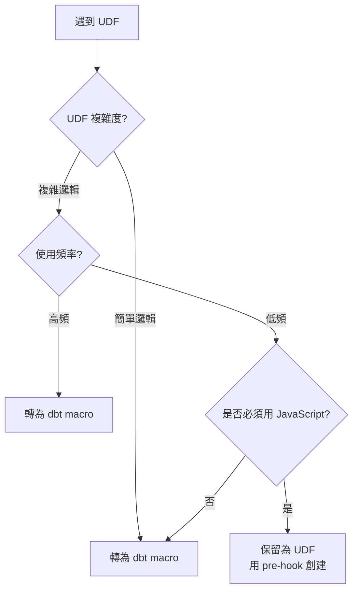

# 第 8 章：Schema、約束與 UDF 處理

> 在本章中，我們將深入遷移中的細節問題：**Schema 定義、約束條件和 User-Defined Functions（UDF）**。這些看似小的細節，實際上對數據品質、查詢性能和團隊協作都有重大影響。到本章結束時，你將掌握完整的 Schema 遷移策略，建立自動化提取工具，並學會將 BigQuery UDF 轉換為 dbt macros。

在前面的章節中，我們掌握了三種主要的遷移模式：完全更新表、分區表、分片表。但我們都使用了相對簡單的 Schema 定義。在實際專案中，Schema 可能非常複雜：上百個欄位、多層巢狀結構、複雜的約束條件、自定義函數。

M3 的 50 個 SQL 中，有些表有 100+ 欄位，每個欄位都有詳細的描述和約束。手動遷移這些 Schema 會非常耗時且容易出錯。我們需要自動化。

## 8.1 Schema 描述完整遷移

### 8.1.1 為何 Schema 描述如此重要？

**Schema 描述**不僅僅是註解，它是**數據文檔**、**團隊知識**和**數據治理**的基礎。

**沒有描述的後果**：

```yaml
# 沒有描述的 schema
columns:
  - name: amt
  - name: dt
  - name: usr_id
  - name: sts
```

6 個月後，新團隊成員看到這個 schema：
- ❓ `amt` 是什麼金額？總額？稅額？
- ❓ `dt` 是哪個日期？交易日？入帳日？
- ❓ `usr_id` 是買家還是賣家？
- ❓ `sts` 有哪些可能的值？

結果：浪費大量時間查詢代碼、詢問同事、猜測欄位意義。

**完整描述的價值**：

```yaml
# 完整描述的 schema
columns:
  - name: amt
    description: "交易總金額（含稅，單位：新台幣元）"
  - name: dt
    description: "交易發生日期（台北時區，格式：YYYY-MM-DD）"
  - name: usr_id
    description: "買家用戶 ID（參照 users.user_id）"
  - name: sts
    description: "交易狀態（pending:待付款, completed:已完成, cancelled:已取消）"
```

新團隊成員立即理解每個欄位的意義、單位、可能的值。

💡 **關鍵洞察**：完整的 Schema 描述能將團隊的 onboarding 時間減少 50%+。

### 8.1.2 從 BigQuery 提取 Schema

BigQuery 表可能已經有詳細的 Schema 定義。我們需要提取這些資訊。

**方法 1：使用 INFORMATION_SCHEMA**

```sql
-- 提取表的所有欄位資訊
SELECT
    column_name,
    data_type,
    is_nullable,
    description
FROM `m3-project.analytics.INFORMATION_SCHEMA.COLUMNS`
WHERE table_name = 'user_daily_transactions'
ORDER BY ordinal_position;
```

結果：

```
column_name         data_type   is_nullable  description
user_id             INT64       NO           用戶唯一識別碼
transaction_id      STRING      NO           交易 ID
transaction_date    DATE        NO           交易日期
amount              FLOAT64     NO           交易金額（單位：元）
payment_method      STRING      YES          支付方式
status              STRING      NO           交易狀態
```

**方法 2：使用 bq 命令列工具**

```bash
bq show --schema --format=prettyjson \
  m3-project:analytics.user_daily_transactions > schema.json
```

生成的 `schema.json`：

```json
[
  {
    "name": "user_id",
    "type": "INTEGER",
    "mode": "REQUIRED",
    "description": "用戶唯一識別碼"
  },
  {
    "name": "transaction_id",
    "type": "STRING",
    "mode": "REQUIRED",
    "description": "交易 ID"
  },
  {
    "name": "amount",
    "type": "FLOAT",
    "mode": "REQUIRED",
    "description": "交易金額（單位：元）"
  },
  ...
]
```

**方法 3：使用 Python BigQuery Client**

```python
from google.cloud import bigquery

client = bigquery.Client(project='m3-project')
table = client.get_table('m3-project.analytics.user_daily_transactions')

for field in table.schema:
    print(f"{field.name}: {field.field_type} - {field.description or 'No description'}")
```

### 8.1.3 自動化 Schema 生成腳本

手動複製貼上容易出錯。讓我們建立自動化腳本。

創建 `scripts/generate_schema_yml.py`：

```python
# scripts/generate_schema_yml.py
"""
從 BigQuery 表自動生成 dbt schema.yml

用途：
1. 提取 BigQuery 表的 schema
2. 生成 dbt schema.yml 格式
3. 包含欄位描述、類型、約束
"""

from google.cloud import bigquery
import yaml
from typing import Dict, List


def extract_schema_from_bigquery(project_id: str, dataset_id: str,
                                 table_id: str) -> Dict:
    """
    從 BigQuery 提取表的 schema

    Returns:
        dict: dbt schema.yml 格式的字典
    """
    client = bigquery.Client(project=project_id)
    table = client.get_table(f"{project_id}.{dataset_id}.{table_id}")

    # 建立 schema 結構
    model_schema = {
        'name': table_id,
        'description': table.description or f'TODO: 為 {table_id} 加入描述',
        'columns': []
    }

    # 遍歷所有欄位
    for field in table.schema:
        column = {
            'name': field.name,
            'description': field.description or f'TODO: 為 {field.name} 加入描述',
            'tests': []
        }

        # 根據 mode 加入 not_null test
        if field.mode == 'REQUIRED':
            column['tests'].append('not_null')

        # 推薦加入的其他 tests（需手動確認）
        # 如果欄位名包含 'id' 且不是外鍵，可能是 unique
        if 'id' in field.name.lower() and field.name.lower().endswith('id'):
            # 加入註解提示，需手動確認
            if not column['tests']:
                column['tests'] = []
            # column['tests'].append('unique')  # 取消註解以啟用

        model_schema['columns'].append(column)

    return model_schema


def extract_schema_with_info(project_id: str, dataset_id: str,
                             table_id: str) -> Dict:
    """
    從 BigQuery 提取 schema 並加入額外資訊

    包含：
    - 分區配置
    - Clustering 配置
    - 行數統計
    """
    client = bigquery.Client(project=project_id)
    table = client.get_table(f"{project_id}.{dataset_id}.{table_id}")

    model_schema = extract_schema_from_bigquery(project_id, dataset_id, table_id)

    # 加入表級別的元數據
    metadata_lines = []

    if table.description:
        metadata_lines.append(table.description)
        metadata_lines.append("")

    metadata_lines.append("**表資訊**:")
    metadata_lines.append(f"- 行數：{table.num_rows:,}")
    metadata_lines.append(f"- 大小：{table.num_bytes / (1024**3):.2f} GB")

    # 分區資訊
    if table.time_partitioning:
        metadata_lines.append("")
        metadata_lines.append("**分區配置**:")
        metadata_lines.append(f"- 分區欄位：{table.time_partitioning.field or '_PARTITIONDATE'}")
        metadata_lines.append(f"- 分區類型：{table.time_partitioning.type_}")
        if table.time_partitioning.expiration_ms:
            days = table.time_partitioning.expiration_ms / (1000 * 60 * 60 * 24)
            metadata_lines.append(f"- 過期時間：{days:.0f} 天")

    # Clustering 資訊
    if table.clustering_fields:
        metadata_lines.append("")
        metadata_lines.append("**Clustering**:")
        metadata_lines.append(f"- 欄位：{', '.join(table.clustering_fields)}")

    # 更新描述
    model_schema['description'] = '\n'.join(metadata_lines)

    return model_schema


def generate_schema_yml(models: List[Dict], output_file: str = None):
    """
    生成 schema.yml 檔案

    Args:
        models: 模型列表（每個是 dict）
        output_file: 輸出檔案路徑（None 則輸出到 stdout）
    """
    schema_yml = {
        'version': 2,
        'models': models
    }

    # 使用 | 符號支援多行描述
    def str_presenter(dumper, data):
        if '\n' in data:
            return dumper.represent_scalar('tag:yaml.org,2002:str', data, style='|')
        return dumper.represent_scalar('tag:yaml.org,2002:str', data)

    yaml.add_representer(str, str_presenter)

    # 生成 YAML
    yml_content = yaml.dump(
        schema_yml,
        allow_unicode=True,
        default_flow_style=False,
        sort_keys=False
    )

    if output_file:
        with open(output_file, 'w', encoding='utf-8') as f:
            f.write(yml_content)
        print(f"✓ Schema 已生成：{output_file}")
    else:
        print(yml_content)


def generate_schema_for_multiple_tables(project_id: str, dataset_id: str,
                                        table_ids: List[str],
                                        output_file: str):
    """
    為多個表生成統一的 schema.yml

    Args:
        table_ids: 表名列表
        output_file: 輸出檔案（如 models/marts/schema.yml）
    """
    models = []
    for table_id in table_ids:
        print(f"提取 schema：{table_id}")
        try:
            model = extract_schema_with_info(project_id, dataset_id, table_id)
            models.append(model)
        except Exception as e:
            print(f"  ✗ 錯誤：{e}")
            continue

    generate_schema_yml(models, output_file)


# 使用範例
if __name__ == '__main__':
    # 範例 1：單一表
    print("=== 單一表 schema ===")
    schema = extract_schema_with_info(
        'm3-project',
        'analytics',
        'user_daily_transactions'
    )
    generate_schema_yml([schema])

    print("\n" + "=" * 60 + "\n")

    # 範例 2：多個表
    print("=== 多個表 schema ===")
    generate_schema_for_multiple_tables(
        'm3-project',
        'analytics',
        ['user_daily_transactions', 'product_sales', 'daily_sales_summary'],
        'models/marts/schema.yml'
    )
```

### 8.1.4 執行 Schema 生成

**單一表**：

```bash
python scripts/generate_schema_yml.py
```

預期輸出：

```yaml
version: 2
models:
- name: user_daily_transactions
  description: |
    用戶每日交易記錄

    **表資訊**:
    - 行數：1,234,567
    - 大小：0.45 GB

    **分區配置**:
    - 分區欄位：transaction_date
    - 分區類型：DAY
    - 過期時間：365 天

    **Clustering**:
    - 欄位：user_id, payment_method
  columns:
  - name: user_id
    description: 用戶唯一識別碼
    tests:
    - not_null
  - name: transaction_id
    description: 交易 ID
    tests:
    - not_null
  - name: transaction_date
    description: 交易日期
    tests:
    - not_null
  - name: amount
    description: 交易金額（單位：元）
    tests:
    - not_null
  ...
```

**批量生成**：

```python
# 為整個資料夾的表生成 schema
generate_schema_for_multiple_tables(
    'm3-project',
    'analytics',
    [
        'user_daily_transactions',
        'product_sales',
        'daily_sales_summary',
        'user_activity_daily',
        'product_inventory_daily'
    ],
    'models/marts/schema.yml'
)
```

### 8.1.5 手動優化生成的 Schema

自動生成的 schema 是骨架，需要手動優化：

**優化 1：擴充描述**

```yaml
# 自動生成
- name: amount
  description: 交易金額（單位：元）

# 手動優化
- name: amount
  description: |
    交易總金額（含稅，單位：新台幣元）

    **計算方式**：quantity × unit_price
    **範圍**：> 0
    **精度**：小數點後兩位
```

**優化 2：加入業務規則**

```yaml
- name: status
  description: |
    交易狀態

    **可能的值**：
    - pending：等待付款
    - processing：處理中
    - completed：已完成
    - cancelled：已取消
    - refunded：已退款

    **狀態轉換**：
    pending → processing → completed
    pending → cancelled
    completed → refunded
  tests:
  - not_null
  - accepted_values:
      values: ['pending', 'processing', 'completed', 'cancelled', 'refunded']
```

**優化 3：加入參照關係**

```yaml
- name: user_id
  description: |
    用戶唯一識別碼

    **參照**：users.user_id
  tests:
  - not_null
  - relationships:
      to: source('raw_data', 'users')
      field: user_id
```

### 8.1.6 維護 Schema 的最佳實踐

**原則 1：Single Source of Truth**

Schema 定義應該在一個地方：dbt 的 schema.yml。

❌ 不要在多個地方維護：
- BigQuery 表描述
- dbt schema.yml
- 內部 Wiki
- Confluence 文檔

✅ 應該只在 dbt schema.yml 維護，然後：
- 使用 `dbt docs generate` 生成文檔
- 使用 dbt 的 `persist_docs` 配置同步到 BigQuery

**配置 persist_docs**：

```yaml
# dbt_project.yml
models:
  m3_analytics:
    marts:
      +persist_docs:
        relation: true  # 同步表描述到 BigQuery
        columns: true   # 同步欄位描述到 BigQuery
```

執行後，dbt 會將 schema.yml 的描述寫入 BigQuery 表的 metadata。

**原則 2：定期審查**

建立季度 Schema 審查流程：
1. 檢查是否有 "TODO" 描述
2. 驗證描述是否仍然準確
3. 更新業務規則變更

**原則 3：Code Review 必查**

在 Pull Request 中，檢查：
- [ ] 新欄位是否有描述
- [ ] 描述是否清楚完整
- [ ] 是否加入適當的 tests

## 8.2 約束條件處理

### 8.2.1 BigQuery 的約束類型

BigQuery 支援以下約束（大部分是 metadata，不強制執行）：

| 約束類型 | BigQuery 支援 | 強制執行 | dbt 對應 |
|---------|--------------|---------|---------|
| NOT NULL | ✅ Yes | ❌ No* | `not_null` test |
| PRIMARY KEY | ✅ Yes (metadata) | ❌ No | `unique` + `not_null` |
| FOREIGN KEY | ✅ Yes (metadata) | ❌ No | `relationships` test |
| UNIQUE | ✅ Yes (metadata) | ❌ No | `unique` test |
| CHECK | ❌ No | ❌ No | custom tests |

*BigQuery 不強制執行 NOT NULL，但會在 schema 中標記。

### 8.2.2 NOT NULL 約束遷移

**識別 BigQuery 中的 NOT NULL 欄位**：

```sql
SELECT
    column_name,
    is_nullable
FROM `m3-project.analytics.INFORMATION_SCHEMA.COLUMNS`
WHERE table_name = 'user_daily_transactions'
  AND is_nullable = 'NO';
```

結果：

```
column_name
user_id
transaction_id
transaction_date
amount
status
```

**在 dbt 中加入 not_null tests**：

```yaml
columns:
  - name: user_id
    tests:
      - not_null
  - name: transaction_id
    tests:
      - not_null
  - name: transaction_date
    tests:
      - not_null
  - name: amount
    tests:
      - not_null
  - name: status
    tests:
      - not_null
```

**執行測試**：

```bash
dbt test -s user_daily_transactions
```

如果有 NULL 值，測試會失敗：

```
Failure in test not_null_user_daily_transactions_user_id
  Got 5 results, configured to fail if != 0

  compiled SQL at target/compiled/.../not_null_user_daily_transactions_user_id.sql
```

這是好事！在遷移階段發現數據品質問題。

### 8.2.3 PRIMARY KEY 和 UNIQUE 約束

BigQuery 的 PRIMARY KEY 只是 metadata，不保證唯一性。在 dbt 中用 tests 驗證。

**遷移策略**：

```sql
-- BigQuery 表定義（可能有）
CREATE TABLE users (
    user_id INT64 PRIMARY KEY,  -- 聲明但不強制
    email STRING UNIQUE,        -- 聲明但不強制
    ...
)
```

**dbt schema.yml**：

```yaml
columns:
  - name: user_id
    description: "用戶唯一識別碼（PRIMARY KEY）"
    tests:
      - unique      # 驗證唯一性
      - not_null    # 驗證非空

  - name: email
    description: "用戶電子郵件（UNIQUE）"
    tests:
      - unique
```

**組合主鍵（Composite Key）**：

```yaml
# 對於組合主鍵（user_id + transaction_date）
models:
  - name: user_daily_summary
    tests:
      - dbt_utils.unique_combination_of_columns:  # 需安裝 dbt_utils
          combination_of_columns:
            - user_id
            - transaction_date
```

### 8.2.4 FOREIGN KEY 約束（Relationships）

FOREIGN KEY 在 dbt 中用 `relationships` test 表達。

**範例**：

```yaml
# transactions 表參照 users 表
models:
  - name: transactions
    columns:
      - name: user_id
        description: "買家用戶 ID（參照 users.user_id）"
        tests:
          - relationships:
              to: source('raw_data', 'users')  # 參照來源
              field: user_id                    # 參照欄位
```

**執行測試**：

```bash
dbt test -s transactions
```

如果有 orphan records（外鍵不存在），測試會失敗：

```
Failure in test relationships_transactions_user_id__user_id__source_raw_data_users
  Got 12 results, configured to fail if != 0

  These 12 user_id values in transactions do not exist in users:
  - 10023
  - 10045
  ...
```

這幫助我們發現數據完整性問題。

### 8.2.5 自定義約束（Custom Tests）

對於更複雜的業務規則，建立自定義 tests。

**範例 1：金額必須大於 0**

創建 `tests/assert_amount_positive.sql`：

```sql
-- tests/assert_amount_positive.sql
-- 驗證 amount 欄位必須 > 0

SELECT
    transaction_id,
    amount
FROM {{ ref('user_daily_transactions') }}
WHERE amount <= 0
```

如果查詢有結果，測試失敗。

**範例 2：日期範圍驗證**

```sql
-- tests/assert_valid_date_range.sql
-- 驗證 transaction_date 在合理範圍內

SELECT
    transaction_id,
    transaction_date
FROM {{ ref('user_daily_transactions') }}
WHERE transaction_date < '2020-01-01'  -- 業務開始日期
   OR transaction_date > CURRENT_DATE() + 1  -- 不應該有未來日期
```

**範例 3：狀態轉換驗證**

```sql
-- tests/assert_status_transition_valid.sql
-- 驗證狀態轉換的合理性

WITH status_changes AS (
    SELECT
        user_id,
        transaction_id,
        status AS current_status,
        LAG(status) OVER (PARTITION BY user_id ORDER BY transaction_date) AS previous_status
    FROM {{ ref('user_transactions_history') }}
)
SELECT *
FROM status_changes
WHERE
    -- 不允許從 completed 回到 pending
    (previous_status = 'completed' AND current_status = 'pending')
    OR
    -- 不允許從 cancelled 到任何其他狀態
    (previous_status = 'cancelled' AND current_status != 'cancelled')
```

### 8.2.6 約束遷移的完整流程

**Step 1：識別原始約束**

```python
# scripts/extract_constraints.py
from google.cloud import bigquery

def extract_constraints(project_id, dataset_id, table_id):
    client = bigquery.Client(project=project_id)
    table = client.get_table(f"{project_id}.{dataset_id}.{table_id}")

    constraints = {
        'not_null': [],
        'unique': [],
        'primary_key': [],
        'foreign_keys': []
    }

    for field in table.schema:
        if field.mode == 'REQUIRED':
            constraints['not_null'].append(field.name)

    # BigQuery API 目前不直接暴露 PRIMARY KEY/FOREIGN KEY metadata
    # 需要查詢 INFORMATION_SCHEMA 或從原始 DDL 解析

    return constraints
```

**Step 2：生成 dbt tests**

```python
def generate_tests_from_constraints(constraints):
    tests = []

    for column in constraints['not_null']:
        tests.append({
            'column': column,
            'test': 'not_null'
        })

    for column in constraints['unique']:
        tests.append({
            'column': column,
            'test': 'unique'
        })

    # ... 生成其他 tests

    return tests
```

**Step 3：整合到 schema.yml**

自動將提取的約束加入到 schema.yml 的 tests 區塊。

## 8.3 UDF 遷移策略

### 8.3.1 BigQuery UDF 概述

**User-Defined Functions (UDF)** 允許在 SQL 中使用自定義邏輯。

**範例**：

```sql
-- 定義 UDF
CREATE TEMP FUNCTION calculate_discount(amount FLOAT64, user_type STRING)
RETURNS FLOAT64
LANGUAGE js AS """
  if (user_type === 'premium') {
    return amount * 0.9;  // 10% 折扣
  } else {
    return amount;
  }
""";

-- 使用 UDF
SELECT
    transaction_id,
    amount,
    calculate_discount(amount, user_type) as discounted_amount
FROM transactions;
```

**UDF 的類型**：

1. **SQL UDF**：用 SQL 語法定義
2. **JavaScript UDF**：用 JavaScript 定義（更靈活）
3. **Persistent UDF**：保存在 dataset 中，可重複使用
4. **Temporary UDF**：只在單一查詢中有效

### 8.3.2 何時保留 UDF vs 轉為 Macro

**決策樹**：



**保留 UDF 的情況**：
- 複雜的 JavaScript 邏輯，用 SQL 難以表達
- 需要 JavaScript 特有的函數或庫
- 低頻使用，轉換成本高

**轉為 dbt macro 的情況**：
- 簡單的邏輯（可用 SQL 表達）
- 高頻使用（在多個模型中）
- 為了可移植性（dbt 可以跨數據倉庫）

### 8.3.3 UDF 到 Macro 的轉換

**範例 1：簡單計算 UDF**

**原始 BigQuery UDF**：

```sql
CREATE TEMP FUNCTION calculate_discount(amount FLOAT64, user_type STRING)
RETURNS FLOAT64 AS (
  CASE
    WHEN user_type = 'premium' THEN amount * 0.9
    WHEN user_type = 'gold' THEN amount * 0.85
    ELSE amount
  END
);
```

**dbt Macro** (`macros/calculate_discount.sql`)：

```sql
-- macros/calculate_discount.sql

  CASE
    WHEN {{ user_type }} = 'premium' THEN {{ amount }} * 0.9
    WHEN {{ user_type }} = 'gold' THEN {{ amount }} * 0.85
    ELSE {{ amount }}
  END

```

**使用**：

```sql
-- models/marts/transactions_with_discount.sql
SELECT
    transaction_id,
    amount,
    {{ calculate_discount('amount', 'user_type') }} as discounted_amount
FROM {{ ref('transactions') }}
```

編譯後：

```sql
SELECT
    transaction_id,
    amount,
    CASE
      WHEN user_type = 'premium' THEN amount * 0.9
      WHEN user_type = 'gold' THEN amount * 0.85
      ELSE amount
    END as discounted_amount
FROM transactions
```

**範例 2：日期處理 UDF**

**原始 UDF**：

```sql
CREATE TEMP FUNCTION get_fiscal_quarter(date_value DATE)
RETURNS STRING AS (
  CONCAT('FY', FORMAT_DATE('%Y', date_value), '-Q',
    CAST(CEIL(EXTRACT(MONTH FROM date_value) / 3.0) AS STRING))
);

-- 使用：get_fiscal_quarter('2024-05-15') → 'FY2024-Q2'
```

**dbt Macro**：

```sql
-- macros/get_fiscal_quarter.sql

  CONCAT(
    'FY',
    FORMAT_DATE('%Y', {{ date_field }}),
    '-Q',
    CAST(CEIL(EXTRACT(MONTH FROM {{ date_field }}) / 3.0) AS STRING)
  )

```

**使用**：

```sql
SELECT
    transaction_date,
    {{ get_fiscal_quarter('transaction_date') }} as fiscal_quarter,
    SUM(amount) as total_amount
FROM {{ ref('transactions') }}
GROUP BY 1, 2
```

### 8.3.4 保留 JavaScript UDF

對於必須用 JavaScript 的複雜邏輯，在 dbt 中用 **pre-hook** 創建 UDF。

**範例：複雜的 JSON 解析 UDF**

**原始 UDF**：

```sql
CREATE TEMP FUNCTION parse_complex_json(json_string STRING)
RETURNS ARRAY<STRUCT<key STRING, value FLOAT64>>
LANGUAGE js AS """
  const obj = JSON.parse(json_string);
  const result = [];
  for (const [key, value] of Object.entries(obj)) {
    if (typeof value === 'number') {
      result.push({key: key, value: value});
    }
  }
  return result;
""";
```

**dbt 模型** (`models/marts/parsed_events.sql`)：

```sql
-- models/marts/parsed_events.sql

{{ config(
    pre_hook=[
        """
        CREATE TEMP FUNCTION parse_complex_json(json_string STRING)
        RETURNS ARRAY<STRUCT<key STRING, value FLOAT64>>
        LANGUAGE js AS '''
          const obj = JSON.parse(json_string);
          const result = [];
          for (const [key, value] of Object.entries(obj)) {
            if (typeof value === 'number') {
              result.push({key: key, value: value});
            }
          }
          return result;
        ''';
        """
    ]
) }}

SELECT
    event_id,
    event_timestamp,
    parse_complex_json(event_data) as parsed_data
FROM {{ source('raw_data', 'events') }}
```

**pre-hook** 會在模型執行前運行，創建臨時 UDF。

### 8.3.5 Persistent UDF 遷移

如果原始專案使用 Persistent UDF（保存在 dataset 中），需要在 dbt 專案中重新創建。

**策略**：使用 dbt **on-run-start** hooks

```yaml
# dbt_project.yml
on-run-start:
  - |
    CREATE OR REPLACE FUNCTION `{{ target.project }}.{{ target.dataset }}.calculate_discount`(amount FLOAT64, user_type STRING)
    RETURNS FLOAT64 AS (
      CASE
        WHEN user_type = 'premium' THEN amount * 0.9
        WHEN user_type = 'gold' THEN amount * 0.85
        ELSE amount
      END
    );
  - |
    CREATE OR REPLACE FUNCTION `{{ target.project }}.{{ target.dataset }}.get_fiscal_quarter`(date_value DATE)
    RETURNS STRING AS (
      CONCAT('FY', FORMAT_DATE('%Y', date_value), '-Q',
        CAST(CEIL(EXTRACT(MONTH FROM date_value) / 3.0) AS STRING))
    );
```

執行 `dbt run` 時，這些 UDF 會在任何模型之前被創建。

**模型中使用**：

```sql
SELECT
    transaction_id,
    amount,
    `{{ target.dataset }}`.calculate_discount(amount, user_type) as discounted_amount
FROM {{ ref('transactions') }}
```

### 8.3.6 UDF 遷移的最佳實踐

**原則 1：優先轉為 Macro**

Macros 的優勢：
- 可移植性（跨數據倉庫）
- 易於測試
- 版本控制在 dbt 專案中
- 編譯時展開，性能更好

**原則 2：文檔化 UDF**

為每個 UDF/Macro 撰寫清楚的文檔：

```sql
-- macros/calculate_discount.sql
{#
  計算折扣後的金額

  參數：
    - amount (FLOAT64): 原始金額
    - user_type (STRING): 用戶類型（premium, gold, regular）

  返回：
    FLOAT64: 折扣後金額

  範例：
    {{ calculate_discount('amount', 'user_type') }}

  折扣規則：
    - premium: 10% 折扣（0.9 倍）
    - gold: 15% 折扣（0.85 倍）
    - regular: 無折扣
#}

  ...

```

**原則 3：集中管理**

將所有 UDF/Macros 放在專門的目錄：

```
macros/
├── business_logic/
│   ├── calculate_discount.sql
│   ├── get_fiscal_quarter.sql
│   └── classify_customer.sql
├── date_utils/
│   ├── get_week_start.sql
│   └── is_business_day.sql
└── string_utils/
    ├── clean_email.sql
    └── normalize_phone.sql
```

## 8.4 複雜欄位類型處理

### 8.4.1 STRUCT 類型

BigQuery 的 **STRUCT** 是巢狀結構，類似物件。

**範例**：

```sql
CREATE TABLE users (
    user_id INT64,
    profile STRUCT<
        name STRING,
        email STRING,
        age INT64
    >
)
```

查詢：

```sql
SELECT
    user_id,
    profile.name,      -- 訪問巢狀欄位
    profile.email
FROM users
```

**在 dbt 中處理 STRUCT**：

邏輯保持不變，但 schema.yml 需要詳細描述：

```yaml
columns:
  - name: user_id
    description: "用戶 ID"

  - name: profile
    description: |
      用戶檔案資訊（STRUCT 類型）

      **結構**：
      - name (STRING): 用戶姓名
      - email (STRING): 電子郵件
      - age (INT64): 年齡
```

如果需要扁平化：

```sql
-- models/marts/users_flattened.sql
SELECT
    user_id,
    profile.name as user_name,
    profile.email as user_email,
    profile.age as user_age
FROM {{ source('raw_data', 'users') }}
```

### 8.4.2 ARRAY 類型

**ARRAY** 是陣列，包含多個相同類型的值。

**範例**：

```sql
CREATE TABLE orders (
    order_id STRING,
    product_ids ARRAY<STRING>  -- 多個產品 ID
)
```

查詢（使用 UNNEST）：

```sql
SELECT
    order_id,
    product_id
FROM orders,
UNNEST(product_ids) as product_id  -- 展開陣列
```

**在 dbt 中處理 ARRAY**：

```sql
-- models/marts/order_items.sql
SELECT
    order_id,
    product_id,
    ARRAY_LENGTH(product_ids) as product_count
FROM {{ source('raw_data', 'orders') }},
UNNEST(product_ids) as product_id
```

**Schema 定義**：

```yaml
# source
sources:
  - name: raw_data
    tables:
      - name: orders
        columns:
          - name: product_ids
            description: "產品 ID 陣列（ARRAY<STRING>）"

# model
models:
  - name: order_items
    description: "訂單項目（展開後的產品列表）"
    columns:
      - name: product_id
        description: "產品 ID（從 product_ids 陣列展開）"
```

### 8.4.3 巢狀 STRUCT 和 ARRAY

更複雜的情況：ARRAY of STRUCT

```sql
CREATE TABLE transactions (
    transaction_id STRING,
    line_items ARRAY<STRUCT<
        product_id STRING,
        quantity INT64,
        unit_price FLOAT64
    >>
)
```

查詢：

```sql
SELECT
    transaction_id,
    item.product_id,
    item.quantity,
    item.unit_price,
    item.quantity * item.unit_price as line_total
FROM transactions,
UNNEST(line_items) as item
```

**dbt 模型**：

```sql
-- models/marts/transaction_line_items.sql
{{ config(
    description='交易明細（展開 line_items）'
) }}

SELECT
    transaction_id,
    item.product_id,
    item.quantity,
    item.unit_price,
    item.quantity * item.unit_price as line_total
FROM {{ source('raw_data', 'transactions') }},
UNNEST(line_items) as item
```

### 8.4.4 GEOGRAPHY 類型

BigQuery 特有的地理空間類型。

**範例**：

```sql
CREATE TABLE stores (
    store_id STRING,
    location GEOGRAPHY  -- 地理位置
)
```

查詢：

```sql
SELECT
    store_id,
    ST_ASTEXT(location) as location_wkt,  -- 轉為 WKT 格式
    ST_X(location) as longitude,
    ST_Y(location) as latitude
FROM stores
```

**在 dbt 中處理**：

保持 GEOGRAPHY 函數不變，在 schema.yml 中說明：

```yaml
columns:
  - name: location
    description: |
      商店地理位置（GEOGRAPHY 類型）

      **格式**：WGS84 座標系
      **範例查詢**：
      - ST_ASTEXT(location)：轉為 WKT 文字
      - ST_X(location)：取得經度
      - ST_Y(location)：取得緯度
```

## 本章總結

在本章中，我們掌握了遷移中的所有細節處理：

✅ **完整的 Schema 遷移流程**，包括自動化提取和生成工具
✅ **約束條件的系統化處理**，從 NOT NULL 到自定義業務規則
✅ **UDF 到 dbt Macros 的轉換**，保留必要的 JavaScript UDF
✅ **複雜欄位類型的處理**，包括 STRUCT、ARRAY、GEOGRAPHY

### 核心收穫

**關於 Schema 遷移**：
- 自動化生成減少 90% 的手動工作
- 完整的描述是團隊協作的關鍵
- persist_docs 確保單一來源

**關於約束處理**：
- dbt tests 取代 BigQuery constraints
- 早期發現數據品質問題
- 自定義 tests 表達複雜業務規則

**關於 UDF 遷移**：
- 優先轉為 dbt macros（可移植性）
- 保留必要的 JavaScript UDF
- 充分文檔化所有自定義邏輯

### 實戰統計

所有核心技術模式已完成：

| 模式類型 | 數量 | 已完成 | 狀態 |
|---------|------|-------|------|
| 完全更新表 | 30 | ✅ | 掌握 |
| 分區表 | 10 | ✅ | 掌握 |
| 分片表 | 10 | ✅ | 掌握 |
| Schema/UDF 處理 | - | ✅ | 掌握 |

### 下一章預告

在第 9 章，我們將進入**知識迭代循環 - 從錯誤中學習**。

這是本書最核心的章節之一，展示：
- 遷移手冊從 v1.0 到 v3.0 的完整演進
- 實際遇到的 10+ 種錯誤案例
- 錯誤 → 分析 → 手冊更新 → 改進的完整循環
- AI 能力成長的量化指標

這將是整個遷移專案的「知識結晶」。準備好了嗎？讓我們繼續！

---

**本章產出物清單**：
- ✅ Schema 自動生成腳本
- ✅ 約束提取與遷移工具
- ✅ UDF 到 Macro 轉換範例
- ✅ 複雜類型處理指南

**下一步行動**：
1. 為所有模型生成完整 schema.yml
2. 執行所有 tests 並修正問題
3. 準備進入第 9 章：知識迭代循環
