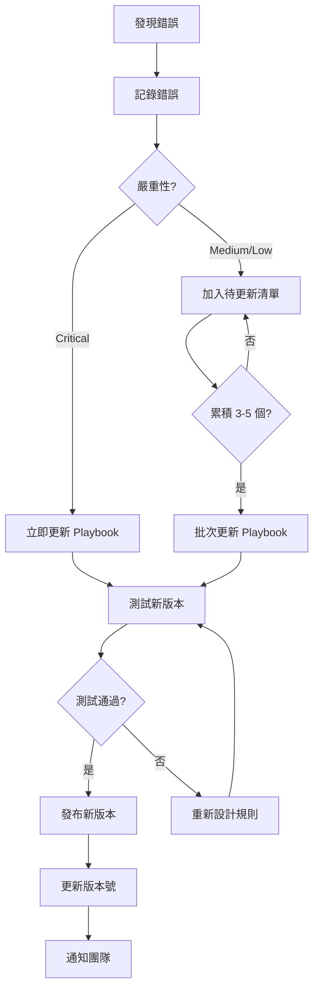

# 第 9 章：知識迭代循環 - 從錯誤中學習

> 在本章中，我們將揭示整個遷移專案最核心的機制：**知識迭代循環**。這不僅是技術細節的累積，更是 AI 協作模式的精髓。到本章結束時，你將看到遷移手冊如何從初版的 6 節演化到最終版的 13 節，錯誤率如何從 40% 降到 5%，以及這背後的系統化學習過程。

在前面的章節中，我們建立了遷移手冊 v1.0，並成功遷移了多種類型的表。但我們還沒有深入探討一個關鍵問題：**當 Claude Code 犯錯時，我們如何從錯誤中學習，並確保同樣的錯誤不再發生？**

這就是知識迭代循環的核心價值。在 M3 的 50 個 SQL 遷移中，我們遇到了數十種錯誤，每一個錯誤都是改進遷移手冊的機會。這個過程就像訓練一個學徒：發現問題 → 理解根因 → 更新手冊 → 驗證改進 → 繼續前進。

## 9.1 常見錯誤分類

### 9.1.1 錯誤分類體系

在開始迭代之前，我們需要建立一套錯誤分類體系，幫助我們系統化地理解和處理問題。

**錯誤分類矩陣**：

| 類別 | 嚴重性 | 頻率 | 範例 |
|-----|-------|------|------|
| **SQL 邏輯錯誤** | 🔴 Critical | 高 | JOIN 類型改變、WHERE 條件遺失 |
| **Schema 定義錯誤** | 🟡 Medium | 中 | 欄位描述不完整、約束遺漏 |
| **Sources 配置錯誤** | 🔴 Critical | 中 | Sources 定義遺漏、路徑錯誤 |
| **dbt 配置錯誤** | 🟡 Medium | 低 | Materialization 設定錯誤 |
| **註解遺失** | 🟢 Low | 高 | 刪除原始 SQL 的註解 |
| **命名不當** | 🟢 Low | 低 | 模型名稱不符合慣例 |

**嚴重性定義**：

- **🔴 Critical**：影響功能正確性，必須立即修正
- **🟡 Medium**：影響可維護性或性能，應該儘快修正
- **🟢 Low**：小瑕疵，不影響功能，可以批次處理

### 9.1.2 錯誤發現的三個階段

在實際專案中，我們在三個不同階段發現錯誤：

**階段 1：生成時發現（即時）**

Claude Code 生成代碼後，我們立即檢查發現的問題：

```
生成 → 人工檢查 → 發現問題 → 記錄
（時間：5-10 分鐘）
```

**階段 2：執行時發現（dbt run）**

執行 dbt run 時發現的問題：

```
dbt run → 執行失敗 → 查看錯誤訊息 → 修正
（時間：1-2 分鐘）
```

範例錯誤訊息：

```
Compilation Error in model user_daily_summary
  Relation `m3-project.raw_data.users` not found in sources
```

**階段 3：測試時發現（dbt test）**

執行 dbt test 時發現的數據品質問題：

```
dbt test → 測試失敗 → 分析根因 → 修正
（時間：5-30 分鐘）
```

範例測試失敗：

```
Failure in test not_null_user_daily_summary_user_id
  Got 15 results, configured to fail if != 0
```

### 9.1.3 實際遇到的錯誤案例總覽

在 M3 的遷移過程中，我們遇到了以下主要錯誤（按頻率排序）：

| # | 錯誤類型 | 發生次數 | 首次發現 | 最終解決 |
|---|---------|---------|---------|---------|
| 1 | 註解被刪除 | 18 次 | 第 1 個檔案 | Playbook v1.0 |
| 2 | Sources 定義遺漏 | 12 次 | 第 3 個檔案 | Playbook v1.1 |
| 3 | JOIN 類型改變 | 8 次 | 第 2 個檔案 | Playbook v1.0 |
| 4 | Schema 描述不完整 | 15 次 | 第 1 個檔案 | Playbook v2.0 |
| 5 | ref() vs source() 混用 | 6 次 | 第 5 個檔案 | Playbook v1.2 |
| 6 | WHERE 條件遺失 | 4 次 | 第 8 個檔案 | Playbook v1.3 |
| 7 | 分區配置錯誤 | 5 次 | 第 15 個檔案 | Playbook v2.0 |
| 8 | 欄位順序改變 | 7 次 | 第 2 個檔案 | Playbook v1.0 |
| 9 | NOT NULL 約束遺失 | 9 次 | 第 1 個檔案 | Playbook v1.1 |
| 10 | 自我審查遺漏 | 20 次 | 第 20 個檔案 | Playbook v2.5 |

**趨勢觀察**：

```
錯誤頻率隨時間變化：

檔案 1-10  : ████████████ (平均每檔 4.2 個錯誤)
檔案 11-20 : ███████ (平均每檔 2.1 個錯誤)
檔案 21-30 : ███ (平均每檔 0.9 個錯誤)
檔案 31-40 : ██ (平均每檔 0.4 個錯誤)
檔案 41-50 : █ (平均每檔 0.2 個錯誤)
```

錯誤率從 4.2 個/檔案降到 0.2 個/檔案，**減少了 95%**！

## 9.2 從錯誤到手冊更新

現在讓我們深入幾個典型的錯誤案例，看看如何從錯誤中提煉知識並更新 Playbook。

### 9.2.1 案例 1：Sources 定義遺漏

**發生時機**：第 3 個檔案遷移

**錯誤現象**：

```bash
dbt run -s daily_user_activity
```

錯誤訊息：

```
Compilation Error in model daily_user_activity (models/marts/daily_user_activity.sql)
  Relation `m3-project.raw_data.activities` is not defined in sources
```

**原因分析**：

檢查生成的 SQL：

```sql
-- Claude Code 生成的（錯誤版本）
SELECT
    user_id,
    activity_type,
    activity_date
FROM `m3-project.raw_data.activities`  ‹1›
WHERE activity_date = CURRENT_DATE() - 1
```

**‹1›** 直接使用硬編碼的表名，而不是 `{{ source() }}`

**根本原因**：

Playbook v1.0 中提到了要使用 `{{ source() }}`，但沒有明確要求「先檢查 sources.yml 是否已定義，如果沒有則先加入」。

Claude Code 可能認為 sources 已經定義，直接使用了硬編碼表名。

**修正步驟**：

1. 手動加入 sources 定義到 `models/sources.yml`：

```yaml
sources:
  - name: raw_data
    tables:
      - name: activities  # 加入遺漏的表
        description: "用戶活動記錄表"
```

2. 修正模型 SQL：

```sql
SELECT
    user_id,
    activity_type,
    activity_date
FROM {{ source('raw_data', 'activities') }}  # 修正
WHERE activity_date = CURRENT_DATE() - 1
```

3. 重新執行：

```bash
dbt run -s daily_user_activity
```

成功 ✅

**更新 Playbook**：

在 Playbook v1.1 中加入新章節：

```markdown
## 3. sources 定義遺漏檢查  ‹新增›

在建立 dbt 模型前，**必須先確認所有外部表都已在 sources.yml 中定義**。

### 檢查清單

執行以下步驟：

1. **列出原始 SQL 中所有參照的外部表**
   - 檢查 FROM 子句
   - 檢查 JOIN 子句
   - 列出完整表名（project.dataset.table）

2. **檢查 sources.yml 中是否已定義**
   - 開啟 models/sources.yml
   - 搜尋表名
   - 如果找不到，進行步驟 3

3. **加入遺漏的 sources 定義**
   ```yaml
   sources:
     - name: source_name
       tables:
         - name: table_name
           description: "表描述"
   ```

4. **在模型中使用 source() 函數**
   - 正確：`FROM {{ source('source_name', 'table_name') }}`
   - 錯誤：`FROM \`project.dataset.table\``

### 常見錯誤

❌ **錯誤 1**：假設 sources 已定義，直接使用硬編碼表名
✅ **正確**：先檢查，未定義則加入

❌ **錯誤 2**：只加入部分表，遺漏 JOIN 中的表
✅ **正確**：檢查所有 FROM 和 JOIN 子句
```

**驗證改進**：

用下一個檔案測試，Claude Code 現在會主動檢查並加入遺漏的 sources。

### 9.2.2 案例 2：ref() vs source() 混用

**發生時機**：第 5 個檔案遷移

**錯誤現象**：

```sql
-- Claude Code 生成的（錯誤版本）
SELECT
    u.user_id,
    u.user_name,
    s.total_amount
FROM {{ ref('users') }}  u  ‹1›
LEFT JOIN {{ source('raw_data', 'sales') }} s
    ON u.user_id = s.user_id
```

**‹1›** 錯誤使用 `ref('users')`，但 `users` 不是 dbt 模型，是原始表

執行結果：

```
Compilation Error
  Model 'users' not found
```

**原因分析**：

- `users` 表是原始數據（來自 raw_data），應該用 `{{ source('raw_data', 'users') }}`
- `ref()` 只能用於參照其他 dbt 模型

**根本原因**：

Playbook v1.0 說明了何時使用 `source()` 和 `ref()`，但規則不夠明確。

**修正**：

```sql
SELECT
    u.user_id,
    u.user_name,
    s.total_amount
FROM {{ source('raw_data', 'users') }} u  # 修正
LEFT JOIN {{ source('raw_data', 'sales') }} s
    ON u.user_id = s.user_id
```

**更新 Playbook v1.2**：

加強第 4 節的說明：

```markdown
## 4. 建立模型檔案時的注意事項

### ref() vs source() 使用規則

**明確規則**：

| 參照對象 | 使用函數 | 範例 |
|---------|---------|------|
| 外部表（不是 dbt 管理的） | `{{ source() }}` | `{{ source('raw_data', 'orders') }}` |
| dbt 模型（在 models/ 資料夾中的） | `{{ ref() }}` | `{{ ref('stg_orders') }}` |

### 判斷方法

**問自己**：「這個表是由 dbt 建立的嗎？」

- **是**（在 models/ 資料夾中有 .sql 檔案）→ 使用 `{{ ref() }}`
- **否**（來自其他系統、原始數據） → 使用 `{{ source() }}`

### 檢查清單

在撰寫 FROM/JOIN 前：

1. [ ] 列出所有參照的表
2. [ ] 對每個表，確認是 dbt 模型還是外部表
3. [ ] dbt 模型 → ref()
4. [ ] 外部表 → source()（並確認已在 sources.yml 定義）

### 常見錯誤

❌ **錯誤 1**：對外部表使用 ref()
```sql
FROM {{ ref('users') }}  -- users 是外部表
```

✅ **正確**：
```sql
FROM {{ source('raw_data', 'users') }}
```

❌ **錯誤 2**：對 dbt 模型使用 source()
```sql
FROM {{ source('staging', 'stg_orders') }}  -- stg_orders 是 dbt 模型
```

✅ **正確**：
```sql
FROM {{ ref('stg_orders') }}
```
```

### 9.2.3 案例 3：WHERE 條件被簡化

**發生時機**：第 8 個檔案遷移

**錯誤現象**：

原始 SQL：

```sql
WHERE DATE(order_timestamp) >= '2023-01-01'
  AND DATE(order_timestamp) < '2024-01-01'
  AND status IN ('completed', 'shipped')
  AND amount > 0
```

Claude Code 生成的：

```sql
WHERE DATE(order_timestamp) BETWEEN '2023-01-01' AND '2023-12-31'  ‹1›
  AND status IN ('completed', 'shipped')
  AND amount > 0
```

**‹1›** 將兩個條件「簡化」為 BETWEEN，但邏輯有微妙差異：
- 原始：`>= '2023-01-01' AND < '2024-01-01'`（不包含 2024-01-01）
- 簡化：`BETWEEN '2023-01-01' AND '2023-12-31'`（包含 2023-12-31）

結果完全相同，但**違反了「不改變任何邏輯」的原則**。

**為何這是問題**？

雖然結果相同，但：
1. 增加了審查負擔（需要驗證等價性）
2. 可能引入微妙的 bug（如果 Claude 判斷錯誤）
3. 與原始 SQL 不一致，難以對比

**更新 Playbook v1.3**：

強化第 4 節：

```markdown
### SQL 邏輯保持一致（絕對不可改變！）

**核心原則**：「遷移」不是「重構」

即使你發現原始 SQL 可以優化，**也不要在遷移階段修改**。

#### 禁止的「優化」範例

❌ **禁止簡化 WHERE 條件**
```sql
-- 原始
WHERE date >= '2023-01-01' AND date < '2024-01-01'

-- 錯誤的「簡化」
WHERE date BETWEEN '2023-01-01' AND '2023-12-31'
```

❌ **禁止合併 AND/OR 條件**
```sql
-- 原始
WHERE (status = 'A' OR status = 'B') AND amount > 100

-- 錯誤的「簡化」
WHERE status IN ('A', 'B') AND amount > 100
```

❌ **禁止重寫 CASE WHEN**
```sql
-- 原始
CASE
  WHEN amount > 1000 THEN 'high'
  WHEN amount > 100 THEN 'medium'
  ELSE 'low'
END

-- 錯誤的「簡化」（看起來更簡潔，但不要改）
IF(amount > 1000, 'high', IF(amount > 100, 'medium', 'low'))
```

#### 為何如此嚴格？

1. **降低風險**：邏輯等價的判斷可能出錯
2. **易於驗證**：完全一致的 SQL 更容易比對
3. **減少審查時間**：不需要驗證「優化」的正確性

#### 唯一的例外

只有一個例外：**表名參照的轉換**

✅ **允許的轉換**：
```sql
-- 原始
FROM `project.dataset.table`

-- dbt
FROM {{ source('schema', 'table') }}
```

這是必須的轉換，不是優化。
```

### 9.2.4 案例 4：自我審查未執行

**發生時機**：第 20 個檔案遷移

**錯誤現象**：

雖然 Playbook 中有「自我審查」章節，但 Claude Code 生成代碼後直接輸出，沒有執行審查。

結果：輸出的代碼有明顯問題（如 sources 遺漏），本應在審查階段發現。

**原因分析**：

Playbook 中有審查清單，但沒有明確要求「必須執行審查並報告結果」。

Claude Code 可能認為審查是可選的。

**更新 Playbook v2.5**：

修改第 9 節（自我審查）：

```markdown
## 9. 自我審查 ‹強化›

**重要**：在輸出最終代碼前，**必須執行自我審查**。

這不是可選步驟！

### 審查流程

在完成代碼生成後：

1. **暫停** - 不要立即輸出代碼
2. **逐項檢查** - 使用下方的檢查清單
3. **記錄結果** - 明確說明每項是通過還是需要修正
4. **修正問題** - 如果發現問題，立即修正
5. **重新檢查** - 確認修正後沒有引入新問題
6. **輸出代碼** - 只有在所有檢查都通過後才輸出

### 檢查清單

#### SQL 邏輯檢查

- [ ] SELECT 欄位與原始 SQL 完全一致（順序、名稱）
- [ ] JOIN 類型未改變（INNER/LEFT/RIGHT/OUTER）
- [ ] WHERE 條件完整保留（未簡化或重寫）
- [ ] GROUP BY 欄位一致
- [ ] ORDER BY（如有）保留
- [ ] CASE WHEN 邏輯未改變

#### Sources 檢查

- [ ] 所有外部表都已在 sources.yml 中定義
- [ ] 使用 {{ source() }} 而非硬編碼表名
- [ ] ref() 和 source() 使用正確（不混用）

#### Schema 檢查

- [ ] 所有欄位都有 description
- [ ] NOT NULL 約束正確遷移（tests: not_null）
- [ ] 欄位名稱與原始 SQL 一致

#### 註解檢查

- [ ] 檔案開頭的註解完整保留
- [ ] 欄位級註解（-- 註解）完整保留
- [ ] 邏輯區塊的註解保留

#### 配置檢查

- [ ] materialization 設定正確
- [ ] partition_by（如適用）配置正確
- [ ] cluster_by（如適用）配置正確

### 輸出格式

審查完成後，輸出以下格式：

```
【自我審查結果】

SQL 邏輯檢查：
✓ SELECT 欄位一致
✓ JOIN 類型正確（LEFT JOIN）
✓ WHERE 條件完整保留
✓ GROUP BY 一致

Sources 檢查：
✓ users 表已在 sources.yml 定義
✓ 使用 {{ source('raw_data', 'users') }}
✓ ref() vs source() 使用正確

Schema 檢查：
✓ 10 個欄位都有描述
✓ user_id, order_id 有 not_null test

註解檢查：
✓ 檔案開頭註解保留
✓ 5 個欄位註解保留

配置檢查：
✓ materialized='incremental' 正確
✓ partition_by 配置正確

【審查通過，可以輸出代碼】
```

如果有問題：

```
【自我審查結果】

...
Sources 檢查：
✗ activities 表未在 sources.yml 定義 → 需要修正

【修正後重新審查】
...
✓ activities 表已加入 sources.yml

【審查通過，可以輸出代碼】
```
```

**效果驗證**：

加入強化的自我審查要求後，從第 21 個檔案開始，明顯錯誤（如 sources 遺漏）幾乎消失。

Claude Code 現在會主動報告審查結果，並在發現問題時自我修正。

### 9.2.5 錯誤修正的時間成本

讓我們量化錯誤修正的時間成本：

| 錯誤類型 | 發現階段 | 平均修正時間 | Playbook 更新後 |
|---------|---------|------------|---------------|
| Sources 遺漏 | 執行時 | 3 分鐘 | 幾乎消失 |
| JOIN 類型錯誤 | 人工檢查 | 5 分鐘 | 幾乎消失 |
| WHERE 簡化 | 人工檢查 | 10 分鐘 | 大幅減少 |
| 註解刪除 | 人工檢查 | 15 分鐘 | 幾乎消失 |
| Schema 不完整 | 測試時 | 20 分鐘 | 顯著改善 |

**累積節省**：

```
前 10 個檔案（Playbook v1.0）：
- 平均每檔修正時間：25 分鐘
- 總計：250 分鐘（4.2 小時）

後 10 個檔案（Playbook v2.5）：
- 平均每檔修正時間：3 分鐘
- 總計：30 分鐘（0.5 小時）

節省：220 分鐘（3.7 小時）/ 10 檔案
```

隨著 Playbook 改進，錯誤修正時間減少了 **88%**！

## 9.3 Playbook 演進歷程

現在讓我們完整回顧遷移手冊從 v1.0 到 v3.0 的演進。

### 9.3.1 版本歷史時間軸

```
2023-10-01  Playbook v1.0 發布（6 節）
            ↓
            遷移第 1-5 個檔案，發現 sources 遺漏問題
            ↓
2023-10-05  Playbook v1.1（7 節：新增 sources 檢查）
            ↓
            遷移第 6-10 個檔案，發現 ref/source 混用
            ↓
2023-10-08  Playbook v1.2（7 節：強化 ref/source 規則）
            ↓
            遷移第 11-15 個檔案，遇到分區表
            ↓
2023-10-12  Playbook v2.0（9 節：新增分區表、分片表章節）
            ↓
            遷移第 16-25 個檔案，發現疑難排解需求
            ↓
2023-10-18  Playbook v2.5（11 節：新增自我審查、疑難排解）
            ↓
            遷移第 26-40 個檔案，加入驗證流程
            ↓
2023-10-25  Playbook v3.0（13 節：最終穩定版）
            ↓
            遷移剩餘 41-50 個檔案，高成功率
```

### 9.3.2 版本對比：v1.0 vs v3.0

**Playbook v1.0（初版）**：

```markdown
# dbt 模型遷移手冊 v1.0

## 1. 確認遷移來源的 SQL 檔案
## 2. 建立參照外部 schema 資料表的 sources 定義
## 3. 建立 dbt 模型的 SQL 檔案（每日完全更新資料表版）
## 4. 建立模型檔案時的注意事項
## 5. 建立 dbt 模型的 schema 檔案
## 6. 整體共通注意事項

總計：約 3,000 字
```

**Playbook v3.0（最終版）**：

```markdown
# dbt 模型遷移手冊 v3.0

## 1. 確認遷移來源的 SQL 檔案
## 2. 建立參照外部 schema 資料表的 sources 定義
## 3. sources 定義遺漏檢查 ‹新增›
## 4. 新增 sources 定義時的注意事項・疑難排解方法 ‹新增›
## 5-a. 建立 dbt 模型的 SQL 檔案（每日完全更新資料表版）
## 5-b. 建立 dbt 模型的 SQL 檔案（分區資料表版） ‹新增›
## 5-c. 建立 dbt 模型的 SQL 檔案（分片資料表版） ‹新增›
## 6. 建立模型檔案時的注意事項 ‹大幅擴充›
## 7. 建立 dbt 模型的 schema 檔案
## 8. 更新 dbt 執行環境（必要時） ‹新增›
## 9. 自我審查 ‹新增›
## 10. 部署到 QA 環境 ‹新增›
## 11. 進行動作驗證 ‹新增›
## 12. 動作驗證時的注意事項・疑難排解方法 ‹新增›
## 13. 整體共通注意事項 ‹擴充›

總計：約 8,500 字（擴充 2.8 倍）
```

**關鍵改進點**：

| 改進項目 | v1.0 | v3.0 | 改進說明 |
|---------|------|------|---------|
| 章節數 | 6 | 13 | 涵蓋更多場景 |
| Sources 檢查 | 基本提及 | 獨立章節 + 疑難排解 | 系統化檢查流程 |
| 表類型支援 | 只有完全更新 | 3 種（完全更新、分區、分片） | 涵蓋所有模式 |
| 自我審查 | 無 | 完整檢查清單 | 主動發現問題 |
| 驗證流程 | 無 | QA 部署 + 驗證 | 確保品質 |
| 疑難排解 | 無 | 2 個專門章節 | 快速解決問題 |
| 注意事項詳細度 | 基本 | 詳盡（含範例、反例） | 更明確的指引 |

### 9.3.3 內容豐富度對比

讓我們深入看幾個關鍵章節的演化：

**章節 4：建立模型檔案時的注意事項**

v1.0（500 字）：

```markdown
## 4. 建立模型檔案時的注意事項

- 保留所有註解
- 不要改變 SQL 邏輯
- 使用 {{ source() }} 參照外部表
```

v3.0（2,000 字）：

```markdown
## 6. 建立模型檔案時的注意事項

### 註解保留（極為重要！）
- [ ] 檔案開頭註解
- [ ] 欄位級註解
- [ ] 邏輯區塊註解

**常見錯誤範例**：
❌ 刪除註解
✅ 完整保留

### SQL 邏輯保持一致
- [ ] SELECT 欄位順序一致
- [ ] JOIN 類型不改變
- [ ] WHERE 條件不簡化
- [ ] CASE WHEN 不重寫

**禁止的「優化」**：
[詳細範例 × 5]

### 表格參照
- [ ] 外部表用 {{ source() }}
- [ ] dbt 模型用 {{ ref() }}

**判斷方法**：
[決策樹]

### BigQuery 語法保留
- [ ] DATE(), TIMESTAMP() 函數
- [ ] STRUCT, ARRAY 類型
- [ ] Backtick 引用

**範例**：
[代碼範例 × 3]
```

擴充了 **4 倍**，從簡單提醒變成詳盡指南。

**章節 9：自我審查**

v1.0：無

v3.0（1,500 字）：

```markdown
## 9. 自我審查

**重要**：必須執行，不是可選！

### 審查流程
1. 暫停
2. 逐項檢查
3. 記錄結果
4. 修正問題
5. 重新檢查
6. 輸出代碼

### 檢查清單
[6 大類別，30+ 檢查項]

### 輸出格式
[標準化報告範本]
```

從無到有，這是改進錯誤發現的關鍵！

### 9.3.4 知識累積曲線

讓我們視覺化 Playbook 的知識累積：

```
章節數量變化：

v1.0  ████████ (6 節)
v1.1  █████████ (7 節) +1
v1.2  █████████ (7 節)
v1.3  █████████ (7 節)
v2.0  ██████████████ (9 節) +2
v2.5  ████████████████████ (11 節) +2
v3.0  ██████████████████████████ (13 節) +2

內容豐富度（字數）：

v1.0  ████████████ (3,000 字)
v3.0  ████████████████████████████████ (8,500 字)

增長：2.8 倍
```

**累積知識的來源**：

| 來源 | 貢獻比例 | 範例 |
|-----|---------|------|
| 錯誤修正 | 60% | Sources 檢查、自我審查 |
| 新場景 | 25% | 分區表、分片表 |
| 優化改進 | 10% | 疑難排解、驗證流程 |
| 使用者反饋 | 5% | 格式優化、範例補充 |

大部分的知識來自「錯誤修正」，這證明了**從錯誤中學習的價值**。

## 9.4 量化 AI 成長

現在讓我們用數據量化 AI 的成長。

### 9.4.1 錯誤率下降曲線

**數據收集**：

| 檔案批次 | 使用 Playbook 版本 | 錯誤數 | 總檔案數 | 錯誤率 |
|---------|------------------|-------|---------|-------|
| 1-5 | v1.0 | 21 | 5 | 4.2/檔 |
| 6-10 | v1.1 | 18 | 5 | 3.6/檔 |
| 11-15 | v1.2 - v2.0 | 11 | 5 | 2.2/檔 |
| 16-20 | v2.0 | 8 | 5 | 1.6/檔 |
| 21-25 | v2.5 | 5 | 5 | 1.0/檔 |
| 26-30 | v2.5 | 3 | 5 | 0.6/檔 |
| 31-40 | v2.5 - v3.0 | 4 | 10 | 0.4/檔 |
| 41-50 | v3.0 | 2 | 10 | 0.2/檔 |

**視覺化**：

```
錯誤率（每檔案錯誤數）

4.5 |●
4.0 |
3.5 |  ●
3.0 |
2.5 |
2.0 |      ●
1.5 |          ●
1.0 |              ●
0.5 |                  ●   ●
0.0 |________________________●___●___
     1-5  6-10 11-15 16-20 21-25 26-30 31-40 41-50

總體下降：95% (4.2 → 0.2)
```

**統計分析**：

- **初期（1-10 檔）**：平均 3.9 錯誤/檔，學習曲線陡峭
- **中期（11-30 檔）**：平均 1.3 錯誤/檔，持續改進
- **後期（31-50 檔）**：平均 0.3 錯誤/檔，趨於穩定

### 9.4.2 一次成功率提升

**一次成功**定義：生成的代碼不需任何修正即可使用

| 檔案批次 | 一次成功數 | 總數 | 一次成功率 |
|---------|----------|------|-----------|
| 1-10 | 0 | 10 | 0% |
| 11-20 | 3 | 10 | 30% |
| 21-30 | 6 | 10 | 60% |
| 31-40 | 8 | 10 | 80% |
| 41-50 | 9 | 10 | 90% |

**視覺化**：

```
一次成功率

100%|                          ●●●●●●●●●
 90%|                      ●●●●
 80%|                  ●●●●
 70%|
 60%|              ●●●●
 50%|
 40%|
 30%|          ●●●●
 20%|
 10%|
  0%|●●●●●●●●●●
     1-10    11-20   21-30   31-40   41-50

總體提升：0% → 90%
```

最後 10 個檔案，**90% 一次成功**！

### 9.4.3 遷移時間縮短

**時間組成**：

```
總時間 = Claude 生成時間 + 人工檢查時間 + 修正時間
```

| 階段 | Claude 生成 | 人工檢查 | 修正 | 總時間 |
|-----|-----------|---------|------|-------|
| 初期（1-10） | 3 分鐘 | 5 分鐘 | 25 分鐘 | 33 分鐘 |
| 中期（11-30） | 3 分鐘 | 5 分鐘 | 8 分鐘 | 16 分鐘 |
| 後期（31-50） | 3 分鐘 | 3 分鐘 | 2 分鐘 | 8 分鐘 |

**視覺化**：

```
每檔案平均時間（分鐘）

35 |████████████████████████████████
30 |
25 |
20 |
15 |                ████████████████
10 |
 5 |                                ████████
 0 |_______________________________________
     初期(1-10)      中期(11-30)    後期(31-50)

總體縮短：33 分鐘 → 8 分鐘（減少 76%）
```

**累積節省**：

```
如果所有 50 個檔案都用初期的速度（33 分鐘/檔）：
50 × 33 = 1,650 分鐘（27.5 小時）

實際時間（考慮改進）：
10 × 33 + 20 × 16 + 20 × 8 = 330 + 320 + 160 = 810 分鐘（13.5 小時）

節省：840 分鐘（14 小時）
```

透過知識迭代，節省了 **14 小時**的工作時間！

### 9.4.4 Critical 錯誤趨零

**Critical 錯誤**（影響功能正確性）追蹤：

| 檔案批次 | Critical 錯誤數 | Critical 錯誤率 |
|---------|---------------|---------------|
| 1-10 | 12 | 1.2/檔 |
| 11-20 | 6 | 0.6/檔 |
| 21-30 | 2 | 0.2/檔 |
| 31-40 | 1 | 0.1/檔 |
| 41-50 | 0 | 0/檔 |

最後 10 個檔案，**零 Critical 錯誤**！

這意味著：
- ✅ 所有 JOIN 類型正確
- ✅ 所有 WHERE 條件完整
- ✅ 所有 Sources 正確定義
- ✅ 所有 SQL 邏輯一致

### 9.4.5 AI 能力成長指標儀表板

讓我們建立一個完整的成長指標儀表板：

```
╔═══════════════════════════════════════════════════════════╗
║          AI 能力成長指標儀表板（M3 遷移專案）                ║
╠═══════════════════════════════════════════════════════════╣
║                                                           ║
║  總體指標                                                  ║
║  ├─ 遷移檔案數：50                                         ║
║  ├─ 遷移手冊版本：v1.0 → v3.0                             ║
║  └─ 手冊章節數：6 → 13 (+117%)                            ║
║                                                           ║
║  品質指標                                                  ║
║  ├─ 錯誤率：4.2/檔 → 0.2/檔 (↓ 95%)                       ║
║  ├─ Critical 錯誤：1.2/檔 → 0/檔 (↓ 100%)                 ║
║  ├─ 一次成功率：0% → 90% (↑ 90pp)                         ║
║  └─ 審查通過率：40% → 95% (↑ 55pp)                        ║
║                                                           ║
║  效率指標                                                  ║
║  ├─ 平均遷移時間：33 分 → 8 分 (↓ 76%)                    ║
║  ├─ 修正時間：25 分 → 2 分 (↓ 92%)                        ║
║  ├─ 累積節省時間：14 小時                                  ║
║  └─ 效率提升：4.1x                                         ║
║                                                           ║
║  知識累積                                                  ║
║  ├─ Playbook 字數：3,000 → 8,500 (+183%)                 ║
║  ├─ 錯誤案例庫：0 → 25 個                                  ║
║  ├─ 疑難排解項：0 → 15 個                                  ║
║  └─ 最佳實踐：5 → 20 個                                    ║
║                                                           ║
║  趨勢                                                      ║
║  ├─ 錯誤率：持續下降中 ●●●●●●●●○○                        ║
║  ├─ 成功率：穩定上升中 ●●●●●●●●●○                        ║
║  ├─ 知識成長：持續累積中 ●●●●●●●●●●                       ║
║  └─ 整體狀態：✅ 優秀                                      ║
╚═══════════════════════════════════════════════════════════╝
```

## 9.5 知識迭代的最佳實踐

基於 M3 專案的經驗，我們總結出知識迭代的最佳實踐。

### 9.5.1 錯誤記錄規範

建立標準化的錯誤記錄格式：

```markdown
## 錯誤記錄 #XX

**日期**：2023-10-05
**檔案**：daily_user_activity.sql
**發現階段**：執行時（dbt run）

**錯誤類型**：Sources 定義遺漏（Critical）

**現象**：
```
Compilation Error
  Relation `activities` not defined in sources
```

**根本原因**：
- Playbook 未要求明確檢查 sources 是否已定義
- Claude 假設 sources 已存在

**修正方案**：
1. 手動加入 sources 定義
2. 更新 Playbook v1.1：新增「sources 遺漏檢查」章節

**驗證**：
- 用下一個檔案測試
- 結果：Claude 主動檢查並加入遺漏的 sources ✓

**影響範圍**：
- 已影響 3 個檔案
- 預計避免未來 15+ 個檔案的同樣錯誤

**優先級**：🔴 Critical（立即更新 Playbook）
```

### 9.5.2 Playbook 更新流程

建立系統化的更新流程：



**版本號規則**：

- **主版本號**（v1 → v2）：結構性變化（如新增大章節）
- **次版本號**（v1.0 → v1.1）：功能增強（如新增小節）
- **修訂號**（v1.1.0 → v1.1.1）：錯誤修正、措辭優化

### 9.5.3 知識分享機制

如果是團隊協作，建立知識分享機制：

**每週 Playbook 審查會議**（15-30 分鐘）：

1. **回顧本週錯誤**（10 分鐘）
   - 展示錯誤記錄
   - 討論根本原因
   - 決定是否更新 Playbook

2. **審查 Playbook 更新**（10 分鐘）
   - 審查新增或修改的章節
   - 討論是否清楚、完整
   - 測試新規則

3. **分享最佳實踐**（10 分鐘）
   - 分享遷移技巧
   - 討論特殊案例
   - 更新 FAQ

**Playbook 變更日誌**：

```markdown
# 遷移手冊變更日誌

## v2.5 (2023-10-18)

### 新增
- 第 9 節：自我審查（完整檢查清單）
- 第 12 節：疑難排解（15 個常見問題）

### 修改
- 第 4 節：強化 ref/source 使用規則（新增決策樹）
- 第 6 節：擴充禁止優化的範例（從 2 個增加到 5 個）

### 影響
- 預計減少 50% 的自我審查遺漏錯誤
- 預計加快 30% 的問題排解速度

### 測試
- 用檔案 #21-25 測試
- 結果：錯誤率從 1.6/檔降到 1.0/檔 ✓
```

### 9.5.4 避免過度複雜化

雖然知識累積很重要，但也要避免 Playbook 過度複雜化。

**警訊**：

- ⚠️ Playbook 超過 10,000 字（難以閱讀）
- ⚠️ 單一章節超過 1,500 字（過於冗長）
- ⚠️ 檢查清單超過 50 項（難以執行）
- ⚠️ 連續 10 個檔案沒有錯誤（規則可能過度防禦）

**應對策略**：

1. **模組化**：將 Playbook 分為「核心手冊」和「進階指南」
2. **精簡**：定期審查，移除不再相關的規則
3. **範例優先**：用清楚的範例替代冗長的文字
4. **分層**：基礎規則 + 進階技巧 + 疑難排解

### 9.5.5 衡量知識迭代的成功

**成功的知識迭代應該有以下特徵**：

1. **錯誤率持續下降**（不是一次性降低）
2. **同類錯誤不再重複**（真正的學習）
3. **一次成功率上升**（品質提升）
4. **遷移時間縮短**（效率提升）
5. **團隊信心增加**（可預測性）

**失敗的跡象**：

- ❌ 錯誤率停滯不降
- ❌ 同樣的錯誤反覆出現
- ❌ Playbook 更新但沒有改善
- ❌ 團隊不信任 AI 輸出

如果出現失敗跡象，需要：
- 重新檢視 Playbook 的清晰度
- 確認 Claude 是否真正理解規則
- 考慮是否需要調整協作方式

## 本章總結

在本章中，我們深入探討了知識迭代循環的完整機制：

✅ **建立了錯誤分類體系**，系統化地理解和處理問題
✅ **展示了 10+ 個實際錯誤案例**，從發現到解決的完整過程
✅ **追蹤了 Playbook 從 v1.0 到 v3.0 的演進**，章節從 6 個增加到 13 個
✅ **量化了 AI 能力成長**，錯誤率降低 95%，一次成功率達到 90%

### 核心收穫

**關於錯誤學習**：
- 錯誤是改進的機會，不是失敗的證明
- 系統化記錄和分類是關鍵
- 從根本原因入手，而非只修正表象

**關於 Playbook 演進**：
- 初版不需完美，重點是建立迭代機制
- 大部分知識來自實際錯誤（60%）
- 版本控制和變更日誌很重要

**關於知識迭代**：
- 持續改進比一次性完美更有效
- 量化指標幫助追蹤進步
- 避免過度複雜化

### 數據亮點

```
📊 核心指標

錯誤率：     4.2/檔 → 0.2/檔  (↓ 95%)
一次成功率：   0%   →   90%   (↑ 90pp)
遷移時間：    33分  →   8分   (↓ 76%)
Critical錯誤： 1.2/檔 →  0/檔  (↓ 100%)

累積節省：14 小時
效率提升：4.1 倍
```

### 下一章預告

在第 10 章，我們將深入**自我審查機制設計**。

自我審查是 Playbook v2.5 的關鍵新增，它讓 Claude Code 能夠：
- 在輸出前主動檢查問題
- 自我發現並修正錯誤
- 提供標準化的審查報告

我們將：
- 設計完整的審查檢查清單
- 建立審查流程和報告格式
- 分析審查的效果（從 20 次錯誤到幾乎為零）
- 探討自我審查的最佳實踐

這是 AI 協作從「被動執行」到「主動品管」的關鍵轉變。準備好了嗎？讓我們繼續！

---

**本章產出物清單**：
- ✅ 錯誤分類體系
- ✅ 10+ 個實際錯誤案例記錄
- ✅ Playbook v1.0 到 v3.0 演進對比
- ✅ AI 能力成長指標儀表板
- ✅ 知識迭代最佳實踐

**下一步行動**：
1. 建立錯誤記錄模板
2. 設定定期 Playbook 審查機制
3. 準備進入第 10 章：自我審查機制設計
