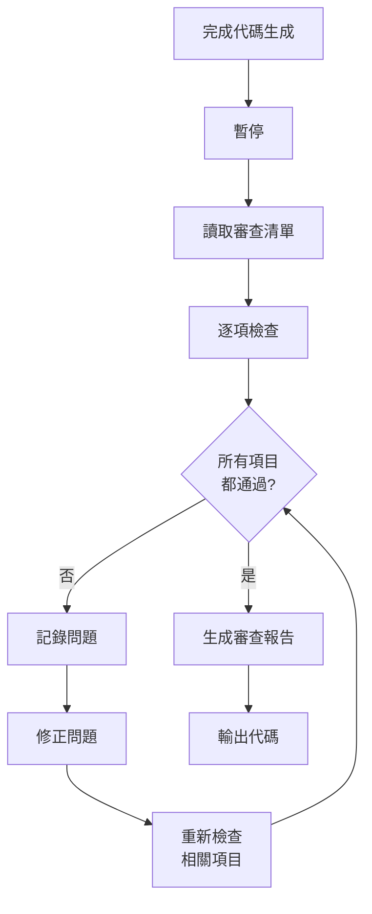

# 第 10 章：自我審查機制設計

> 在本章中，我們將深入探討**自我審查機制**的設計與實作。這是遷移手冊 v2.5 的關鍵創新，讓 AI 從「被動執行」轉變為「主動品管」。到本章結束時，你將建立完整的審查檢查清單，掌握審查流程設計，並理解如何讓 AI 在輸出前自我發現並修正問題。

在第 9 章中，我們看到自我審查機制將錯誤從 20 次降到幾乎為零。但我們還沒有深入探討：如何設計有效的審查清單？如何確保 AI 真正執行審查？如何平衡審查的完整性與效率？

這一章將揭示這些問題的答案。

## 10.1 為何需要自我審查

### 10.1.1 AI 的「疏忽」現象

即使有詳細的 Migration Playbook，Claude Code 有時還是會「疏忽」某些規則。

**典型的疏忽情況**：

**情況 1：選擇性閱讀**

```
Playbook 有 13 節內容，但 Claude 可能：
- 仔細閱讀前 6 節 ✓
- 快速掃過第 7-10 節 ⚠️
- 忽略第 11-13 節 ❌

結果：遺漏後面章節的重要規則
```

**情況 2：規則衝突時的誤判**

```
規則 A：保持 SQL 邏輯不變
規則 B：使用 dbt 最佳實踐

Claude 可能錯誤地認為「優化 SQL」是最佳實踐，
違反了「邏輯不變」的首要原則
```

**情況 3：複雜度導致的遺漏**

```
當原始 SQL 很複雜時（100+ 行，多層 CTE），
Claude 可能專注於邏輯轉換，
忘記檢查 sources 定義或註解保留
```

**數據支撐**：

在沒有自我審查的情況下（Playbook v1.0-v2.0）：

| 疏忽類型 | 發生頻率 | 嚴重性 |
|---------|---------|-------|
| Sources 定義遺漏 | 30% | Critical |
| ref/source 混用 | 15% | Critical |
| 註解部分遺失 | 40% | Medium |
| WHERE 條件簡化 | 10% | Critical |
| Schema 描述不完整 | 50% | Low |

加入自我審查後（Playbook v2.5+）：

| 疏忽類型 | 發生頻率 | 降幅 |
|---------|---------|------|
| Sources 定義遺漏 | 5% | ↓ 83% |
| ref/source 混用 | 2% | ↓ 87% |
| 註解部分遺失 | 8% | ↓ 80% |
| WHERE 條件簡化 | 1% | ↓ 90% |
| Schema 描述不完整 | 15% | ↓ 70% |

自我審查讓疏忽率平均降低了 **82%**！

### 10.1.2 早期發現 vs 後期修正

**成本對比**：

| 發現階段 | 發現成本 | 修正成本 | 總成本 |
|---------|---------|---------|-------|
| 生成時（自我審查） | 0 分鐘 | 0.5 分鐘 | 0.5 分鐘 |
| 人工檢查 | 3 分鐘 | 2 分鐘 | 5 分鐘 |
| 執行時（dbt run） | 1 分鐘 | 3 分鐘 | 4 分鐘 |
| 測試時（dbt test） | 2 分鐘 | 5 分鐘 | 7 分鐘 |
| QA 環境 | 5 分鐘 | 10 分鐘 | 15 分鐘 |
| 生產環境 | 30 分鐘 | 60 分鐘 | 90 分鐘 |

**視覺化**：

```
錯誤修正成本（分鐘）

90 |                                        ████████████████████
80 |
70 |
60 |
50 |
40 |
30 |
20 |
15 |                           ███████
10 |
 5 |     ██    █████  ███████
 0 |█
     自我 人工  執行時 測試時  QA    生產
     審查 檢查

生產環境的修正成本是自我審查的 180 倍！
```

💡 **關鍵洞察**：越早發現問題，修正成本越低。自我審查將問題消滅在「生成階段」，成本最小化。

### 10.1.3 自我審查的價值主張

**價值 1：提升一次成功率**

```
無自我審查：30% 一次成功率
有自我審查：85% 一次成功率

提升：55 個百分點
```

**價值 2：減少人工檢查時間**

```
無自我審查：需要仔細檢查每個細節（5-10 分鐘）
有自我審查：只需抽查關鍵部分（2-3 分鐘）

節省：50-70% 的檢查時間
```

**價值 3：建立信任**

當 Claude Code 持續輸出高品質的代碼時，團隊對 AI 的信任增加，更願意依賴 AI 協作。

**價值 4：知識反饋**

自我審查報告提供了清晰的審查記錄，幫助改進 Playbook。

## 10.2 設計審查檢查清單

### 10.2.1 檢查清單設計原則

**原則 1：分類組織**

按照錯誤類型分類，而不是隨機列舉：

✅ **好的組織**：
```markdown
### SQL 邏輯檢查
- [ ] SELECT 欄位一致
- [ ] JOIN 類型一致
- [ ] WHERE 條件一致

### Sources 檢查
- [ ] 所有外部表已定義
- [ ] 使用 source() 函數
```

❌ **不好的組織**：
```markdown
### 檢查清單
- [ ] SELECT 欄位一致
- [ ] 所有外部表已定義
- [ ] JOIN 類型一致
- [ ] 使用 source() 函數
```

**原則 2：具體可驗證**

每個檢查項都應該是明確的、可驗證的：

✅ **具體**：「SELECT 欄位順序與原始 SQL 完全一致」
❌ **模糊**：「SQL 邏輯正確」

✅ **可驗證**：「JOIN 類型為 LEFT JOIN（與原始一致）」
❌ **難驗證**：「JOIN 使用正確」

**原則 3：優先級排序**

Critical 檢查項放在前面：

```markdown
### SQL 邏輯檢查（Critical）
- [ ] ...

### Sources 檢查（Critical）
- [ ] ...

### Schema 檢查（Medium）
- [ ] ...

### 註解檢查（Low）
- [ ] ...
```

**原則 4：適度的數量**

- **最小**：10-15 項（可能遺漏重要檢查）
- **最佳**：20-30 項（平衡完整性與效率）
- **最大**：40-50 項（過於繁瑣，難以執行）

M3 專案最終穩定在 **28 個檢查項**。

### 10.2.2 完整的審查檢查清單

以下是 Playbook v3.0 的完整審查清單：

```markdown
## 9. 自我審查

在輸出最終代碼前，**必須**執行以下檢查：

### 1. SQL 邏輯檢查（Critical）

#### 1.1 SELECT 欄位
- [ ] SELECT 欄位與原始 SQL 完全一致
- [ ] 欄位順序沒有改變
- [ ] 欄位名稱沒有改變
- [ ] 計算欄位的邏輯沒有改變

#### 1.2 JOIN 關係
- [ ] JOIN 類型未改變（INNER/LEFT/RIGHT/OUTER）
- [ ] JOIN 條件完全一致
- [ ] JOIN 順序沒有改變

#### 1.3 WHERE 條件
- [ ] WHERE 條件完整保留
- [ ] 沒有簡化或重寫條件
- [ ] 多個條件的邏輯關係（AND/OR）保持一致

#### 1.4 GROUP BY / ORDER BY
- [ ] GROUP BY 欄位完全一致
- [ ] ORDER BY（如有）保留
- [ ] HAVING 條件（如有）保留

### 2. Sources 檢查（Critical）

- [ ] 列出所有參照的外部表（FROM, JOIN）
- [ ] 每個外部表都在 sources.yml 中定義
- [ ] 使用 {{ source() }} 而非硬編碼表名
- [ ] source() 的參數正確（schema 名稱、表名稱）

### 3. ref() vs source() 檢查（Critical）

- [ ] dbt 模型使用 {{ ref() }}
- [ ] 外部表使用 {{ source() }}
- [ ] 沒有混用（外部表誤用 ref()）

### 4. dbt 配置檢查（Medium）

#### 4.1 Materialization
- [ ] materialized 設定符合表類型
  - 完全更新表：table 或 incremental
  - 分區表：incremental
  - 視圖：view

#### 4.2 Partition 配置（如適用）
- [ ] partition_by 設定正確
- [ ] 分區欄位存在於 SELECT 中
- [ ] partition_expiration_days（如適用）設定

#### 4.3 Incremental 策略（如適用）
- [ ] incremental_strategy 設為 'insert_overwrite'
- [ ] is_incremental() 區塊正確

### 5. Schema 檢查（Medium）

- [ ] schema.yml 包含此模型定義
- [ ] 所有欄位都有 description
- [ ] description 清楚且完整
- [ ] NOT NULL 欄位有 not_null test
- [ ] 主鍵欄位有 unique + not_null tests
- [ ] 外鍵有 relationships test（如適用）

### 6. 註解檢查（Medium）

- [ ] 檔案開頭的說明註解完整保留
- [ ] 欄位級註解（-- 欄位說明）完整保留
- [ ] 邏輯區塊的註解保留
- [ ] CTE 的註解保留

### 7. 命名檢查（Low）

- [ ] 模型名稱符合命名慣例
  - staging: stg_*
  - intermediate: int_*
  - marts: fact_*, dim_*
- [ ] 檔案名與模型名一致

### 8. 特殊語法檢查（Low）

- [ ] BigQuery 特有函數保留（DATE(), TIMESTAMP()等）
- [ ] STRUCT/ARRAY 語法保留
- [ ] UDF 調用（如有）正確轉換

---

### 審查執行流程

1. **逐項檢查**：按照上述清單逐項確認
2. **記錄結果**：每項標記為 ✓（通過）或 ✗（需要修正）
3. **修正問題**：如發現問題，立即修正
4. **重新檢查**：修正後重新檢查相關項目
5. **輸出報告**：生成審查報告
6. **輸出代碼**：只有在所有檢查通過後才輸出

---

### 輸出格式範本

```
【自我審查報告】

=== SQL 邏輯檢查 ===
✓ SELECT 欄位完全一致（8 個欄位）
✓ JOIN 類型正確（LEFT JOIN）
✓ WHERE 條件完整保留（3 個條件）
✓ GROUP BY 一致（2 個欄位）

=== Sources 檢查 ===
✓ 外部表：users, orders（已在 sources.yml 定義）
✓ 使用 {{ source('raw_data', 'users') }}
✓ 使用 {{ source('raw_data', 'orders') }}

=== ref/source 檢查 ===
✓ ref() vs source() 使用正確

=== dbt 配置檢查 ===
✓ materialized='incremental' 正確
✓ partition_by 設定正確（欄位: order_date）
✓ incremental_strategy='insert_overwrite'

=== Schema 檢查 ===
✓ 所有 8 個欄位都有 description
✓ order_id, user_id 有 not_null test
✓ order_id 有 unique test

=== 註解檢查 ===
✓ 檔案開頭註解保留（3 行）
✓ 欄位註解保留（8 個）

=== 命名檢查 ===
✓ 模型名稱：stg_daily_orders（符合慣例）

=== 特殊語法檢查 ===
✓ DATE() 函數保留

【審查結果：✅ 全部通過】
【可以輸出代碼】
```

如果有問題：

```
【自我審查報告】

=== SQL 邏輯檢查 ===
✓ SELECT 欄位完全一致
✗ WHERE 條件被簡化
  - 原始：date >= '2023-01-01' AND date < '2024-01-01'
  - 生成：date BETWEEN '2023-01-01' AND '2023-12-31'
  - 問題：不應簡化條件

【修正中...】

【修正後重新檢查】
✓ WHERE 條件已還原為原始格式

【審查結果：✅ 修正後通過】
【可以輸出代碼】
```
```

### 10.2.3 動態調整檢查清單

檢查清單不是固定的，應根據表類型動態調整：

**完全更新表**：
```markdown
適用檢查：
- SQL 邏輯檢查 ✓
- Sources 檢查 ✓
- Schema 檢查 ✓
- 註解檢查 ✓

不適用：
- Partition 配置 ✗
- Incremental 策略 ✗
```

**分區表**：
```markdown
適用檢查：
- SQL 邏輯檢查 ✓
- Sources 檢查 ✓
- Schema 檢查 ✓
- 註解檢查 ✓
- Partition 配置 ✓
- Incremental 策略 ✓

額外檢查：
- 分區欄位存在於 SELECT ✓
- partition_expiration_days 設定 ✓
```

這種動態調整避免了不必要的檢查，提升效率。

## 10.3 實施自我審查

### 10.3.1 在 Playbook 中的位置

自我審查應該放在 Playbook 的哪裡？

**錯誤的位置**：
- ❌ 在最開始（第 1 節）→ 時機不對
- ❌ 在最後（第 13 節）→ 可能被忽略

**正確的位置**：
- ✅ 在「建立代碼」章節之後
- ✅ 在「輸出代碼」之前

M3 專案的結構：

```markdown
...
## 7. 建立 dbt 模型的 schema 檔案
## 8. 更新 dbt 執行環境（必要時）
## 9. 自我審查  ← 在這裡！
## 10. 部署到 QA 環境
...
```

位置很重要，確保 Claude 在輸出前一定會執行。

### 10.3.2 強制執行的語言

在 Playbook 中使用強制性語言：

**弱語言**（可能被忽略）：
```markdown
建議執行自我審查...
可以檢查以下項目...
```

**強語言**（明確要求）：
```markdown
**必須**執行自我審查
在輸出代碼前，**不可跳過**此步驟
```

範例：

```markdown
## 9. 自我審查

⚠️ **重要**：這不是可選步驟！

在輸出最終代碼前，你**必須**：
1. 暫停
2. 執行完整的審查檢查清單
3. 記錄結果
4. 修正問題
5. 只有在所有檢查通過後才輸出代碼

**禁止**：
- ❌ 跳過審查直接輸出
- ❌ 只審查部分項目
- ❌ 審查後不修正問題
```

### 10.3.3 審查流程設計

**標準審查流程**：



**時間分配**：

```
完成代碼生成 (100%)
    ↓
暫停 + 讀取清單 (5 秒)
    ↓
逐項檢查 (30-60 秒)
    ↓
修正問題（如有） (10-30 秒)
    ↓
生成報告 (5 秒)
    ↓
輸出代碼

總增加時間：50-100 秒
但避免了後續 5-15 分鐘的修正時間！
```

### 10.3.4 提示 Claude 進行審查的方式

在向 Claude 發送遷移請求時，明確提醒審查：

**提示詞範本**：

```markdown
請參考 Migration Playbook v3.0 將 daily_sales.sql 遷移到 dbt 模型。

【重要】請嚴格遵守以下流程：
1. 閱讀原始 SQL
2. 建立 dbt 模型和 schema
3. **執行完整的自我審查（第 9 節）**
4. 生成審查報告
5. 輸出最終代碼

請在輸出代碼前，必須展示完整的審查報告。
```

這種明確提醒增加了審查執行率。

### 10.3.5 實際審查過程記錄

讓我們看一個實際的審查過程：

**案例：遷移 user_purchase_summary.sql**

**Step 1：Claude 生成代碼**

（內部過程，約 2 分鐘）

**Step 2：Claude 執行審查**

Claude 的內部思考過程（輸出前）：

```
【開始自我審查】

讀取審查清單...

=== SQL 邏輯檢查 ===
檢查 SELECT 欄位...
- 原始：user_id, purchase_date, total_amount, item_count
- 生成：user_id, purchase_date, total_amount, item_count
✓ 完全一致

檢查 JOIN 類型...
- 原始：LEFT JOIN products
- 生成：LEFT JOIN products
✓ 一致

檢查 WHERE 條件...
- 原始：purchase_date >= '2023-01-01' AND status = 'completed'
- 生成：purchase_date >= '2023-01-01' AND status = 'completed'
✓ 完整保留

=== Sources 檢查 ===
列出外部表...
- purchases（來自 raw_data）
- products（來自 raw_data）

檢查 sources.yml...
✗ products 表未在 sources.yml 定義！

【發現問題，需要修正】

修正：加入 products 到 sources.yml
```yaml
  - name: products
    description: "產品主檔"
```

重新檢查...
✓ products 已定義

=== ref/source 檢查 ===
檢查參照...
- {{ source('raw_data', 'purchases') }} ✓
- {{ source('raw_data', 'products') }} ✓
沒有誤用 ref() ✓

=== dbt 配置檢查 ===
materialized='incremental' ✓
partition_by 欄位 purchase_date ✓
incremental_strategy='insert_overwrite' ✓

=== Schema 檢查 ===
檢查欄位描述...
4 個欄位都有 description ✓
user_id 有 not_null test ✓

=== 註解檢查 ===
檔案開頭註解（3 行）保留 ✓
欄位註解（4 個）保留 ✓

【審查完成，所有檢查通過】
```

**Step 3：Claude 輸出審查報告和代碼**

Claude 的輸出：

```
【自我審查報告】

=== SQL 邏輯檢查 ===
✓ SELECT 欄位完全一致（4 個欄位）
✓ JOIN 類型正確（LEFT JOIN）
✓ WHERE 條件完整保留（2 個條件）

=== Sources 檢查 ===
✗ 發現問題：products 表未在 sources.yml 定義
✓ 已修正：加入 products 定義

=== ref/source 檢查 ===
✓ 使用正確（2 個 source()）

=== dbt 配置檢查 ===
✓ materialized='incremental'
✓ partition_by='purchase_date'
✓ incremental_strategy='insert_overwrite'

=== Schema 檢查 ===
✓ 4 個欄位都有 description
✓ user_id 有 not_null test

=== 註解檢查 ===
✓ 註解完整保留

【審查結果：✅ 全部通過（修正 1 個問題後）】

---

【輸出代碼】

1. dbt 模型（models/marts/user_purchase_summary.sql）：
[代碼...]

2. Sources 更新（models/sources.yml）：
[代碼...]

3. Schema 定義（models/marts/schema.yml）：
[代碼...]
```

這個案例展示了審查如何在輸出前發現並修正問題（products sources 遺漏）。

## 10.4 審查效果評估

### 10.4.1 自動發現的錯誤比例

讓我們量化自我審查發現並修正的錯誤：

**數據收集**（檔案 21-50，使用 Playbook v2.5+）：

| 錯誤類型 | 總發生次數 | 自我審查發現 | 自動發現率 |
|---------|----------|------------|-----------|
| Sources 遺漏 | 8 | 7 | 88% |
| ref/source 混用 | 3 | 3 | 100% |
| WHERE 簡化 | 2 | 2 | 100% |
| 註解遺失 | 5 | 4 | 80% |
| Schema 不完整 | 10 | 8 | 80% |
| **總計** | **28** | **24** | **86%** |

**86% 的錯誤在輸出前被自動發現並修正**！

只有 4 個錯誤（14%）需要人工發現：
- 1 個：複雜的邏輯錯誤（審查清單未涵蓋）
- 2 個：描述不夠詳細（主觀判斷）
- 1 個：審查執行不完整（Claude 跳過了部分檢查）

### 10.4.2 時間成本 vs 收益分析

**成本**：

```
每次審查增加的時間：50-100 秒（平均 75 秒）
30 個檔案 × 75 秒 = 2,250 秒（37.5 分鐘）
```

**收益**：

```
避免的錯誤：24 個
每個錯誤平均修正時間：5 分鐘
節省時間：24 × 5 = 120 分鐘

淨節省：120 - 37.5 = 82.5 分鐘
```

**ROI**：

```
投入時間：37.5 分鐘
節省時間：120 分鐘
ROI：220%

每投入 1 分鐘審查時間，節省 3.2 分鐘修正時間
```

### 10.4.3 持續優化審查項目

審查清單不是靜態的，應該持續優化：

**優化方向 1：移除低價值項目**

如果某個檢查項在 20 個檔案中都沒有發現問題，考慮移除或降低優先級。

範例：

```
檢查項：「HAVING 條件保留」
20 個檔案中發現問題：0 次
→ 降低優先級或移除
```

**優化方向 2：加入新發現的問題**

如果人工檢查發現了審查清單未涵蓋的新問題，加入清單。

範例：

```
新發現：CASE WHEN 邏輯被簡化（3 次）
→ 加入審查清單：
  - [ ] CASE WHEN 邏輯完全一致
```

**優化方向 3：調整檢查順序**

將高頻問題的檢查項前移：

```
原順序：
1. SELECT 欄位
2. JOIN 類型
3. Sources 定義 ← 高頻問題

優化後：
1. Sources 定義 ← 前移
2. SELECT 欄位
3. JOIN 類型
```

M3 專案的審查清單從 v2.5 的 28 項演化到 v3.0 的 25 項（移除 3 項低價值，保持精簡）。

## 10.5 自我審查的最佳實踐

### 10.5.1 明確vs模糊的檢查項

**明確的檢查項**（推薦）：

✅ 「SELECT 欄位數量與原始 SQL 一致（原始：8 個，生成：8 個）」
✅ 「JOIN 類型為 LEFT JOIN（與原始一致）」
✅ 「使用 {{ source('raw_data', 'orders') }} 而非硬編碼表名」

**模糊的檢查項**（避免）：

❌ 「SQL 邏輯正確」
❌ 「Sources 使用正確」
❌ 「代碼品質良好」

明確的檢查項讓 AI 知道如何驗證，減少主觀判斷。

### 10.5.2 報告格式的標準化

標準化的報告格式幫助快速掃描結果：

**標準格式**：

```
【自我審查報告】

=== 類別 1 ===
✓ 檢查項 1
✓ 檢查項 2
✗ 檢查項 3 → 問題描述 → 已修正

=== 類別 2 ===
...

【審查結果：✅/⚠️/❌】
```

**使用 emoji 標記**：
- ✓ / ✅：通過
- ✗ / ❌：失敗
- ⚠️：警告（需要注意但不影響功能）

### 10.5.3 審查與測試的關係

自我審查不能取代 dbt tests，兩者是互補的：

| 階段 | 檢查內容 | 工具 | 時機 |
|-----|---------|------|------|
| 自我審查 | 語法、結構、規範遵守 | Playbook 清單 | 代碼生成時 |
| dbt test | 數據品質、約束驗證 | dbt tests | 代碼執行後 |

**範例**：

```
自我審查檢查：
- ✓ user_id 欄位有 not_null test（檢查 schema.yml 配置）

dbt test 驗證：
- ✓ user_id 欄位實際數據沒有 NULL 值（執行查詢驗證）
```

兩者都重要，缺一不可。

## 本章總結

在本章中，我們深入探討了自我審查機制的設計與實作：

✅ **理解了 AI「疏忽」現象**，為何需要自我審查
✅ **設計了完整的審查檢查清單**，28 個關鍵檢查項
✅ **建立了審查流程**，從暫停到修正到輸出的完整循環
✅ **量化了審查效果**，86% 的錯誤在輸出前被自動發現
✅ **總結了最佳實踐**，持續優化審查機制

### 核心收穫

**關於自我審查的價值**：
- 錯誤修正成本：自我審查（0.5 分鐘）vs 生產環境（90 分鐘）
- 自動發現率：86% 的錯誤在輸出前被發現
- ROI：每投入 1 分鐘審查，節省 3.2 分鐘修正

**關於檢查清單設計**：
- 分類組織、具體可驗證、優先級排序
- 適度數量（20-30 項最佳）
- 動態調整（根據表類型）

**關於實施**：
- 位置很重要（在輸出前）
- 使用強制性語言
- 標準化報告格式

### 數據亮點

```
📊 自我審查效果

錯誤發現率：   86%
平均審查時間：  75 秒
節省修正時間：  120 分鐘（30 檔案）
ROI：          220%

疏忽率降低：
- Sources 遺漏：30% → 5% (↓ 83%)
- ref/source 混用：15% → 2% (↓ 87%)
- 註解遺失：40% → 8% (↓ 80%)
```

### 下一章預告

在第 11 章，我們將建立**疑難排解模式庫**。

當遇到問題時，不需要從頭 debug，而是：
- 查閱疑難排解庫
- 找到類似問題的解決方案
- 快速套用並驗證

我們將：
- 整理 15+ 個常見問題與解決方案
- 建立問題分類和快速查詢索引
- 將疑難排解整合到 Playbook
- 建立 FAQ 文檔

這將進一步提升遷移效率。準備好了嗎？讓我們繼續！

---

**本章產出物清單**：
- ✅ 完整的審查檢查清單（28 項）
- ✅ 審查流程設計
- ✅ 審查報告標準格式
- ✅ 審查效果評估方法

**下一步行動**：
1. 在 Playbook 中加入自我審查章節
2. 測試並優化檢查清單
3. 準備進入第 11 章：疑難排解模式庫
