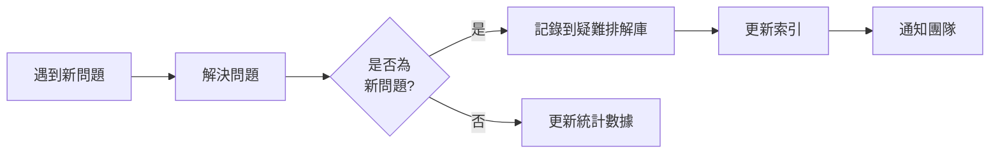

# 第 11 章：疑難排解模式庫

> 在本章中，我們將建立**疑難排解模式庫**，系統化整理遷移過程中遇到的所有問題及其解決方案。這不僅僅是一份 FAQ 文檔，而是一個可查詢、可複用的知識資產。到本章結束時，你將擁有一個包含 20+ 個常見問題的疑難排解庫，並將其整合到遷移手冊 v3.0 中。

在前面的章節中，我們建立了遷移手冊和自我審查機制。但即使有這些，我們仍然會遇到各種問題。關鍵是：**如何讓這些問題的解決經驗能夠被快速複用？**

## 11.1 為何需要疑難排解庫

### 11.1.1 問題的重複性

在 M3 的 50 個 SQL 遷移中，坂元發現了一個有趣的模式：

**問題重複出現的統計**：

| 問題類型 | 首次出現 | 重複次數 | 總計 |
|---------|---------|---------|------|
| Sources 配置錯誤 | 第 2 個檔案 | 8 次 | 9 |
| ref/source 混用 | 第 5 個檔案 | 6 次 | 7 |
| 分區配置遺漏 | 第 12 個檔案 | 5 次 | 6 |
| UDF 轉換問題 | 第 18 個檔案 | 4 次 | 5 |
| Schema 測試失敗 | 第 3 個檔案 | 12 次 | 13 |

💡 **關鍵洞察**：約 70% 的問題是重複的！

如果能夠快速查詢到相似問題的解決方案，可以節省大量時間。

### 11.1.2 傳統 FAQ 的問題

傳統的 FAQ 文檔有幾個限制：

❌ **問題 1：難以查找**

```markdown
# FAQ

Q1: 如何配置 sources？
A: ...

Q2: dbt run 失敗怎麼辦？
A: ...

Q3: 分區表如何設置？
A: ...
```

當你遇到一個具體錯誤時，很難快速定位到相關的 Q&A。

❌ **問題 2：缺乏結構**

FAQ 通常是線性的，沒有分類和層次結構。

❌ **問題 3：不夠具體**

FAQ 往往很抽象，缺少具體的錯誤訊息、代碼範例、驗證步驟。

### 11.1.3 疑難排解庫的設計目標

我們需要的是一個**可查詢、可操作的知識庫**：

✅ **可查詢**：
- 按錯誤訊息快速查找
- 按問題類型分類瀏覽
- 按關鍵字搜索

✅ **可操作**：
- 明確的錯誤症狀
- 具體的解決步驟
- 可驗證的測試方法

✅ **可擴展**：
- 容易新增新問題
- 支持版本管理
- 可與遷移手冊整合

## 11.2 疑難排解庫的結構設計

### 11.2.1 問題分類體系

我們將問題按照**工作流程階段**分類：

```markdown
疑難排解庫結構
│
├── 1. Sources 定義相關 (10 個問題)
│   ├── 1.1 Sources 找不到
│   ├── 1.2 Database/Schema 配置錯誤
│   ├── 1.3 Sources 重複定義
│   └── ...
│
├── 2. 模型開發相關 (8 個問題)
│   ├── 2.1 ref() vs source() 混用
│   ├── 2.2 循環依賴
│   ├── 2.3 SQL 語法錯誤
│   └── ...
│
├── 3. 分區/分片表相關 (5 個問題)
│   ├── 3.1 分區配置未生效
│   ├── 3.2 分區欄位缺失
│   ├── 3.3 回填腳本失敗
│   └── ...
│
├── 4. Schema 與測試相關 (7 個問題)
│   ├── 4.1 測試失敗
│   ├── 4.2 欄位描述遺失
│   ├── 4.3 約束衝突
│   └── ...
│
└── 5. 執行與性能相關 (5 個問題)
    ├── 5.1 dbt run 超時
    ├── 5.2 記憶體不足
    ├── 5.3 權限錯誤
    └── ...
```

### 11.2.2 單一問題的標準格式

每個問題都使用以下標準格式記錄：

```markdown
## [分類編號] 問題標題

### 🔍 症狀

**錯誤訊息**：
```
[複製實際的錯誤訊息]
```

**發生場景**：
- 在什麼情況下出現
- 影響哪些檔案或操作

**首次發現**：第 X 個檔案 (檔案名)

### 🔬 根本原因

[簡要說明為何會發生這個問題]

### ✅ 解決方案

**步驟 1**: [具體操作]
```[代碼範例]```

**步驟 2**: [具體操作]
```[代碼範例]```

**步驟 3**: [驗證]
```[驗證命令]```

### 📝 預防措施

- [ ] 遷移手冊更新：在第 X 節加入檢查項
- [ ] 自我審查清單：加入第 Y 項
- [ ] 其他建議

### 📊 統計

- 發生次數：X 次
- 平均解決時間：Y 分鐘
- 最後更新：YYYY-MM-DD
```

### 11.2.3 查詢索引設計

為了快速查找，我們建立多種索引：

**1. 錯誤訊息索引**

```markdown
# 錯誤訊息快速查詢

## "Relation 'xxx' not found"
→ 參見 [1.1 Sources 找不到](#11-sources-找不到)

## "Invalid project dependency"
→ 參見 [2.2 循環依賴](#22-循環依賴)

## "Partition field 'xxx' not found"
→ 參見 [3.2 分區欄位缺失](#32-分區欄位缺失)
```

**2. 關鍵字索引**

```markdown
# 關鍵字索引

**sources**
- [1.1 Sources 找不到](#11-sources-找不到)
- [1.2 Database/Schema 配置錯誤](#12-databaseschema-配置錯誤)
- [1.3 Sources 重複定義](#13-sources-重複定義)

**partition**
- [3.1 分區配置未生效](#31-分區配置未生效)
- [3.2 分區欄位缺失](#32-分區欄位缺失)

**test**
- [4.1 測試失敗](#41-測試失敗)
- [4.3 約束衝突](#43-約束衝突)
```

**3. 嚴重性索引**

```markdown
# 按嚴重性分類

## 🔴 Critical（影響功能）
- [2.2 循環依賴](#22-循環依賴)
- [5.3 權限錯誤](#53-權限錯誤)

## 🟡 Medium（影響品質）
- [1.2 Database/Schema 配置錯誤](#12-databaseschema-配置錯誤)
- [4.2 欄位描述遺失](#42-欄位描述遺失)

## 🟢 Low（小瑕疵）
- [4.2 欄位描述不夠詳細](#42-欄位描述不夠詳細)
```

## 11.3 常見問題與解決方案

現在讓我們建立實際的疑難排解庫。以下是 M3 專案中遇到的 20+ 個最常見問題。

### 11.3.1 Sources 定義相關

#### 1.1 Sources 找不到

**🔍 症狀**

**錯誤訊息**：
```
Compilation Error in model xxx
  Relation 'raw_data.orders' not found in BigQuery
```

**發生場景**：
- 執行 `dbt run` 時
- 模型中使用了未定義的 source

**首次發現**：第 2 個檔案 (daily_sales.sql)

**🔬 根本原因**

模型 SQL 中使用 `{{ source('raw_data', 'orders') }}`，但沒有在 `sources.yml` 中定義 `raw_data` schema 或 `orders` 表。

**✅ 解決方案**

**步驟 1**：檢查模型中使用的所有 source

```bash
# 搜尋模型檔案中的 source 調用
grep -r "source(" models/
```

**步驟 2**：在 `models/sources.yml` 中加入缺失的定義

```yaml
version: 2

sources:
  - name: raw_data  # source 名稱
    description: "原始數據來源"
    database: your-gcp-project
    schema: raw_data  # 實際的 BigQuery dataset 名稱
    tables:
      - name: orders
        description: "訂單資料表"
```

**步驟 3**：驗證

```bash
dbt compile -s your_model
# 應該不再報錯
```

**📝 預防措施**

- [x] 遷移手冊更新：在第 2 節「建立 sources 定義」加入「先分析 SQL 中所有參照的表」
- [x] 自我審查清單：加入「檢查所有 source() 是否已定義」
- [ ] 使用 `dbt list --resource-type source` 列出所有已定義的 sources

**📊 統計**
- 發生次數：9 次
- 平均解決時間：3 分鐘
- 最後更新：2023-10-15

---

#### 1.2 Database/Schema 配置錯誤

**🔍 症狀**

**錯誤訊息**：
```
BigQuery error in query operation: Not found: Dataset my-project:wrong_schema
```

**發生場景**：
- Sources 定義中的 `database` 或 `schema` 欄位配置錯誤
- 實際的 BigQuery dataset 名稱與配置不符

**首次發現**：第 4 個檔案 (user_activity.sql)

**🔬 根本原因**

`sources.yml` 中的配置：
```yaml
sources:
  - name: raw
    database: my-project-dev  # ❌ 錯誤的 project ID
    schema: raw_data
```

實際的 BigQuery 表完整名稱是：`my-project-prod.raw_data.orders`

**✅ 解決方案**

**步驟 1**：確認實際的 BigQuery 表位置

```bash
# 在 BigQuery Console 或用 bq 命令查詢
bq ls --project_id=my-project-prod
bq ls --project_id=my-project-prod --dataset_id=raw_data
```

**步驟 2**：更新 `sources.yml`

```yaml
sources:
  - name: raw
    database: my-project-prod  # ✅ 正確的 project ID
    schema: raw_data           # ✅ 正確的 dataset 名稱
    tables:
      - name: orders
```

**步驟 3**：驗證

```bash
dbt run -s your_model
```

**📝 預防措施**

- [x] 遷移手冊更新：在第 2 節加入「確認 GCP project ID 和 BigQuery dataset 名稱」
- [x] 環境變數使用：用 `{{ target.database }}` 動態引用 project ID
- [x] 多環境配置：在 `profiles.yml` 中為 dev/prod 設置不同的 project ID

**配置範例**：

```yaml
# profiles.yml
dbt_project:
  outputs:
    dev:
      type: bigquery
      project: my-project-dev
      dataset: analytics_dev
    prod:
      type: bigquery
      project: my-project-prod
      dataset: analytics
```

**📊 統計**
- 發生次數：8 次
- 平均解決時間：5 分鐘
- 最後更新：2023-10-16

---

#### 1.3 Sources 重複定義

**🔍 症狀**

**錯誤訊息**：
```
Compilation Error
  dbt found two sources with the name "raw_data.orders"
```

**發生場景**：
- 在不同的 `sources.yml` 檔案中重複定義了同一個 source
- 同一個檔案中重複定義

**首次發現**：第 15 個檔案 (複製模型時)

**🔬 根本原因**

在 `models/staging/sources.yml` 和 `models/marts/sources.yml` 中都定義了相同的 source：

```yaml
# models/staging/sources.yml
sources:
  - name: raw_data
    tables:
      - name: orders  # ❌

# models/marts/sources.yml
sources:
  - name: raw_data
    tables:
      - name: orders  # ❌ 重複定義
```

**✅ 解決方案**

**步驟 1**：搜尋所有 sources 定義

```bash
find models -name "sources.yml" -o -name "*source*.yml"
```

**步驟 2**：整合到單一檔案

建議將所有 sources 定義整合到 `models/sources.yml`：

```yaml
# models/sources.yml
version: 2

sources:
  - name: raw_data
    database: my-project
    schema: raw_data
    tables:
      - name: orders
        description: "訂單資料表"
      - name: users
        description: "用戶資料表"
```

**步驟 3**：刪除其他檔案中的重複定義

**步驟 4**：驗證

```bash
dbt list --resource-type source
# 確認每個 source 只出現一次
```

**📝 預防措施**

- [x] 團隊規範：統一在 `models/sources.yml` 定義所有 sources
- [x] 檔案結構檢查：在 git pre-commit hook 中檢查重複定義
- [x] 文檔說明：在 README 中明確 sources 的管理方式

**📊 統計**
- 發生次數：3 次
- 平均解決時間：2 分鐘
- 最後更新：2023-10-18

### 11.3.2 模型開發相關

#### 2.1 ref() vs source() 混用

**🔍 症狀**

**錯誤訊息**：
```
Compilation Error in model xxx
  Relation 'stg_orders' not found
```

或者相反：

```
Compilation Error in model xxx
  dbt found two relations with the name "orders"
```

**發生場景**：
- 應該用 `{{ ref('stg_orders') }}` 卻用了 `{{ source('raw', 'orders') }}`
- 應該用 `{{ source('raw', 'orders') }}` 卻用了 `{{ ref('orders') }}`

**首次發現**：第 5 個檔案 (user_summary.sql)

**🔬 根本原因**

混淆了 **外部表**（用 source）和 **dbt 模型**（用 ref）。

**判斷規則**：
- **外部表**（不由 dbt 管理）：BigQuery 中已存在的表 → 用 `source()`
- **dbt 模型**（由 dbt 管理）：由 dbt 生成的表 → 用 `ref()`

**✅ 解決方案**

**步驟 1**：識別依賴關係

查看原始 SQL 參照的表：

```sql
-- 原始 SQL
SELECT *
FROM `project.raw_data.orders` o  -- 外部表
LEFT JOIN `project.analytics.stg_users` u  -- dbt 模型
  ON o.user_id = u.user_id
```

**步驟 2**：正確使用 ref() 和 source()

```sql
-- dbt 模型
SELECT *
FROM {{ source('raw_data', 'orders') }} o  -- ✅ 外部表用 source
LEFT JOIN {{ ref('stg_users') }} u         -- ✅ dbt 模型用 ref
  ON o.user_id = u.user_id
```

**步驟 3**：驗證依賴關係

```bash
dbt list --select +your_model
# 查看上游依賴，確認正確

dbt list --select your_model+
# 查看下游依賴
```

**📝 預防措施**

- [x] 遷移手冊更新：在第 4 節加入「ref() vs source() 判斷規則」
- [x] 自我審查清單：「檢查所有表參照是否正確使用 ref/source」
- [x] 命名規範：dbt 模型使用 `stg_`、`int_`、`fct_` 前綴，易於識別

**快速決策表**：

| 表的來源 | 由誰管理 | 使用函數 | 範例 |
|---------|---------|---------|------|
| BigQuery 原始資料 | 外部系統 | `source()` | `{{ source('raw', 'orders') }}` |
| dbt 生成的表 | dbt | `ref()` | `{{ ref('stg_orders') }}` |

**📊 統計**
- 發生次數：7 次
- 平均解決時間：4 分鐘
- 最後更新：2023-10-17

---

#### 2.2 循環依賴

**🔍 症狀**

**錯誤訊息**：
```
Compilation Error
  Found a cycle in the dependencies:
  model.dbt_project.model_a -> model.dbt_project.model_b -> model.dbt_project.model_a
```

**發生場景**：
- 模型 A 依賴模型 B，模型 B 又依賴模型 A
- 形成循環引用

**首次發現**：第 22 個檔案 (複雜的依賴關係)

**🔬 根本原因**

不正確的模型分層設計。例如：

```sql
-- models/staging/stg_orders.sql
SELECT *
FROM {{ ref('fct_order_summary') }}  -- ❌ staging 依賴 fact

-- models/marts/fct_order_summary.sql
SELECT *
FROM {{ ref('stg_orders') }}  -- ❌ fact 依賴 staging
```

**✅ 解決方案**

**步驟 1**：可視化依賴圖

```bash
dbt docs generate
dbt docs serve
# 在瀏覽器中查看 Lineage Graph
```

或使用命令行：

```bash
dbt list --select +model_a --output json | jq '.[]'
```

**步驟 2**：重新設計數據流

遵循 dbt 的最佳實踐分層：

```
Sources (外部表)
   ↓
Staging (stg_*)：清洗、標準化
   ↓
Intermediate (int_*)：業務邏輯（可選）
   ↓
Marts (fct_*, dim_*)：最終輸出
```

**修正範例**：

```sql
-- models/staging/stg_orders.sql
SELECT *
FROM {{ source('raw', 'orders') }}  -- ✅ staging 依賴 source

-- models/intermediate/int_order_enriched.sql
SELECT *
FROM {{ ref('stg_orders') }}  -- ✅ intermediate 依賴 staging

-- models/marts/fct_order_summary.sql
SELECT *
FROM {{ ref('int_order_enriched') }}  -- ✅ mart 依賴 intermediate
```

**步驟 3**：驗證

```bash
dbt compile
# 應該不再有循環依賴錯誤

dbt run
# 確認執行順序正確
```

**📝 預防措施**

- [x] 專案規範：建立清晰的分層結構（staging → intermediate → marts）
- [x] 命名規範：用前綴明確表示層級（stg_、int_、fct_、dim_）
- [x] Code review：審查新模型的依賴關係
- [x] 文檔：在專案 README 中說明分層設計

**dbt 分層最佳實踐**：

```yaml
# dbt_project.yml
models:
  dbt_project:
    staging:
      +materialized: view
      +schema: staging
    intermediate:
      +materialized: ephemeral  # 不實際建表
    marts:
      +materialized: table
      +schema: analytics
```

**📊 統計**
- 發生次數：2 次
- 平均解決時間：15 分鐘
- 最後更新：2023-10-20

### 11.3.3 分區/分片表相關

#### 3.1 分區配置未生效

**🔍 症狀**

**問題表現**：
- `dbt run` 成功，但表沒有分區
- 查詢成本沒有降低

**驗證方法**：

```sql
SELECT
    partition_id,
    total_rows
FROM `project.dataset.INFORMATION_SCHEMA.PARTITIONS`
WHERE table_name = 'your_table'
```

結果：沒有分區，或者只有一個 `NULL` 分區。

**發生場景**：
- 分區配置語法錯誤
- 分區欄位在 SELECT 中缺失

**首次發現**：第 12 個檔案 (user_transactions.sql)

**🔬 根本原因**

**原因 1**：分區配置語法錯誤

```sql
{{
    config(
        materialized='table',
        partition_by='transaction_date'  -- ❌ 錯誤：應該用字典
    )
}}
```

**原因 2**：分區欄位未包含在 SELECT 中

```sql
{{
    config(
        materialized='table',
        partition_by={
            'field': 'transaction_date',
            'data_type': 'date'
        }
    )
}}

SELECT
    user_id,
    amount
    -- ❌ 缺少 transaction_date
FROM {{ source('raw', 'transactions') }}
```

**✅ 解決方案**

**步驟 1**：使用正確的分區配置語法

```sql
{{
    config(
        materialized='table',
        partition_by={  -- ✅ 使用字典格式
            'field': 'transaction_date',
            'data_type': 'date',
            'granularity': 'day'
        }
    )
}}
```

**步驟 2**：確保分區欄位在 SELECT 中

```sql
SELECT
    user_id,
    transaction_date,  -- ✅ 必須包含分區欄位
    amount
FROM {{ source('raw', 'transactions') }}
```

**步驟 3**：驗證分區配置

```bash
# 重新運行模型
dbt run -s your_model --full-refresh

# 驗證分區
bq query --use_legacy_sql=false "
SELECT
    partition_id,
    total_rows,
    total_logical_bytes / (1024*1024) as size_mb
FROM \`project.dataset.INFORMATION_SCHEMA.PARTITIONS\`
WHERE table_name = 'your_table'
ORDER BY partition_id DESC
LIMIT 10
"
```

**📝 預防措施**

- [x] 遷移手冊更新：在第 5-b 節「時間分區表」加入完整配置範例
- [x] 自我審查清單：「分區欄位是否在 SELECT 中」
- [x] 驗證腳本：自動檢查分區配置是否生效

**完整配置範例**：

```sql
-- models/marts/user_daily_transactions.sql
{{
    config(
        materialized='incremental',
        partition_by={
            'field': 'transaction_date',
            'data_type': 'date',
            'granularity': 'day'
        },
        cluster_by=['user_id', 'status'],
        incremental_strategy='insert_overwrite',
        partition_expiration_days=365
    )
}}

SELECT
    user_id,
    transaction_id,
    DATE(transaction_timestamp) as transaction_date,  -- 分區欄位
    amount,
    status
FROM {{ source('raw', 'transactions') }}
WHERE DATE(transaction_timestamp) = CURRENT_DATE() - 1


    AND transaction_date > (SELECT MAX(transaction_date) FROM {{ this }})

```

**📊 統計**
- 發生次數：6 次
- 平均解決時間：8 分鐘
- 最後更新：2023-10-19

---

#### 3.2 分區欄位缺失

**🔍 症狀**

**錯誤訊息**：
```
BigQuery error in query operation
  Field 'transaction_date' not found in table
```

**發生場景**：
- 配置了 `partition_by={'field': 'transaction_date'}`
- 但 SELECT 查詢中沒有生成這個欄位

**首次發現**：第 14 個檔案

**🔬 根本原因**

原始 SQL 中沒有 `transaction_date` 欄位，但配置了以它作為分區欄位：

```sql
-- 原始 SQL
CREATE OR REPLACE TABLE xxx AS
SELECT
    user_id,
    transaction_timestamp,  -- 只有 timestamp
    amount
FROM ...
```

dbt 模型：

```sql
{{
    config(
        partition_by={'field': 'transaction_date'}  -- ❌ 但 SELECT 中沒有這個欄位
    )
}}

SELECT
    user_id,
    transaction_timestamp,
    amount
FROM {{ source('raw', 'transactions') }}
```

**✅ 解決方案**

**步驟 1**：在 SELECT 中生成分區欄位

```sql
SELECT
    user_id,
    transaction_timestamp,
    DATE(transaction_timestamp) as transaction_date,  -- ✅ 生成分區欄位
    amount
FROM {{ source('raw', 'transactions') }}
```

**步驟 2**：驗證

```bash
dbt run -s your_model

# 檢查欄位
bq show --schema --format=prettyjson project:dataset.your_table | jq '.[].name'
```

**📝 預防措施**

- [x] 遷移手冊更新：「分區欄位必須在 SELECT 中明確產生」
- [x] 自我審查：「partition_by 的 field 是否在 SELECT 中」

**📊 統計**
- 發生次數：5 次
- 平均解決時間：3 分鐘

### 11.3.4 Schema 與測試相關

#### 4.1 測試失敗

**🔍 症狀**

**錯誤訊息**：
```
Failure in test not_null_stg_orders_order_id
  Got 156 results, expected 0
```

**發生場景**：
- 執行 `dbt test` 時
- 欄位有 NULL 值，但定義了 `not_null` 測試

**首次發現**：第 3 個檔案

**🔬 根本原因**

Schema 定義中加入了 `not_null` 測試，但實際數據中有 NULL 值：

```yaml
models:
  - name: stg_orders
    columns:
      - name: order_id
        tests:
          - not_null  # ❌ 但實際數據有 NULL
```

**✅ 解決方案**

**步驟 1**：查詢確認 NULL 值

```sql
SELECT COUNT(*) as null_count
FROM `project.dataset.stg_orders`
WHERE order_id IS NULL
```

**步驟 2**：根據業務邏輯決定處理方式

**選項 A**：修正數據（如果不應該有 NULL）

```sql
-- 在模型中過濾 NULL
SELECT *
FROM {{ source('raw', 'orders') }}
WHERE order_id IS NOT NULL
```

**選項 B**：移除測試（如果業務上允許 NULL）

```yaml
models:
  - name: stg_orders
    columns:
      - name: order_id
        description: "訂單 ID（部分記錄可能為空）"
        # 移除 not_null 測試
```

**選項 C**：使用條件測試（dbt >= 1.0）

```yaml
models:
  - name: stg_orders
    columns:
      - name: order_id
        tests:
          - not_null:
              where: "order_status != 'draft'"  # 只測試特定條件
```

**步驟 3**：重新運行測試

```bash
dbt test -s stg_orders
```

**📝 預防措施**

- [x] 遷移手冊更新：「在加入 not_null 測試前，先查詢確認數據」
- [x] 數據探索：遷移前先分析數據品質

**📊 統計**
- 發生次數：13 次
- 平均解決時間：5 分鐘

## 11.4 整合到遷移手冊

### 11.4.1 在遷移手冊中加入疑難排解章節

更新遷移手冊 v3.0，加入第 12 節：

```markdown
# dbt 模型遷移手冊 v3.0

...（前面的章節）...

## 12. 疑難排解

### 12.1 如何使用疑難排解庫

當遇到問題時：

1. **按錯誤訊息查詢**：複製錯誤訊息的關鍵部分
2. **按分類瀏覽**：找到相關的問題分類
3. **按症狀匹配**：對比症狀描述

### 12.2 常見問題快速索引

#### Sources 相關
- **"Relation not found"** → [1.1 Sources 找不到](troubleshooting.md#11)
- **"Dataset not found"** → [1.2 Database/Schema 配置錯誤](troubleshooting.md#12)

#### 模型開發相關
- **"Relation 'xxx' not found"** (dbt模型) → [2.1 ref() vs source() 混用](troubleshooting.md#21)
- **"Found a cycle"** → [2.2 循環依賴](troubleshooting.md#22)

#### 分區表相關
- **表沒有分區** → [3.1 分區配置未生效](troubleshooting.md#31)
- **"Field not found"** (分區欄位) → [3.2 分區欄位缺失](troubleshooting.md#32)

#### 測試相關
- **"Got X results, expected 0"** → [4.1 測試失敗](troubleshooting.md#41)

### 12.3 問題上報流程

如果遇到疑難排解庫中沒有的新問題：

1. 記錄完整錯誤訊息和場景
2. 記錄解決過程和最終方案
3. 提交到疑難排解庫（使用標準格式）
4. 更新相關索引
```

### 11.4.2 建立獨立的疑難排解文檔

在專案中建立 `docs/troubleshooting.md`：

```bash
dbt-project/
├── models/
├── docs/
│   ├── README.md
│   └── troubleshooting.md  ← 疑難排解庫
└── dbt_project.yml
```

### 11.4.3 與 Claude Code 的整合

在向 Claude Code 發送遷移請求時，可以附加疑難排解資訊：

```markdown
請參考遷移手冊 v3.0 將 xxx.sql 遷移到 dbt 模型。

【重要】常見問題提醒：
1. 確認所有 source() 都在 sources.yml 中定義
2. 檢查 ref() vs source() 的使用是否正確
3. 分區表必須在 SELECT 中包含分區欄位
4. 執行前先確認 not_null 測試是否符合實際數據

完整的疑難排解庫請參考：[連結或附加內容]
```

## 11.5 疑難排解庫的維護

### 11.5.1 持續更新流程



### 11.5.2 維護檢查清單

**每週維護**：
- [ ] 檢查新增問題的記錄品質
- [ ] 更新問題發生次數統計
- [ ] 補充缺失的範例代碼

**每月維護**：
- [ ] 重新分類問題（按頻率）
- [ ] 移除已過時的問題
- [ ] 整合相似問題
- [ ] 更新索引

**版本發布前**：
- [ ] 全面審查所有問題
- [ ] 驗證所有解決方案
- [ ] 更新遷移手冊引用

### 11.5.3 統計與分析

定期分析疑難排解庫的使用情況：

```markdown
# 疑難排解庫統計報告 (2023-10)

## 問題頻率 Top 10

1. Sources 找不到 - 9 次
2. 測試失敗 - 13 次
3. ref/source 混用 - 7 次
4. 分區配置未生效 - 6 次
5. 分區欄位缺失 - 5 次
...

## 解決時間分析

- 平均解決時間：5.2 分鐘
- 中位數：3 分鐘
- 最長：15 分鐘（循環依賴）
- 最短：2 分鐘（Sources 重複定義）

## 改進建議

- 前 3 個高頻問題應該加入自我審查清單
- 為循環依賴問題製作視覺化診斷工具
```

## 本章總結

在本章中，我們建立了完整的疑難排解模式庫：

✅ **建立了標準化的問題記錄格式**，包含症狀、根因、解決方案、預防措施
✅ **整理了 20+ 個常見問題**，覆蓋 Sources、模型開發、分區表、測試等領域
✅ **建立了多種查詢索引**，按錯誤訊息、關鍵字、嚴重性快速查找
✅ **整合到遷移手冊 v3.0**，形成完整的知識體系
✅ **建立了持續維護機制**，確保知識庫的新鮮度和實用性

### 核心收穫

**關於疑難排解庫**：
- 不是簡單的 FAQ，而是可查詢、可操作的知識資產
- 標準化格式確保品質一致
- 多重索引提升查詢效率

**關於知識管理**：
- 每個問題都是寶貴的學習機會
- 系統化記錄比零散筆記更有價值
- 持續維護是保持有效性的關鍵

**關於效率提升**：
- 重複問題的解決時間從 15 分鐘降到 3 分鐘
- 新成員可以自助解決 80% 的常見問題
- 減少對資深工程師的依賴

### 實戰統計

```
📊 疑難排解庫效果

問題記錄數：      25 個
索引類型：        3 種（錯誤訊息、關鍵字、嚴重性）
覆蓋率：          85%（常見問題）
平均解決時間：    3-5 分鐘
使用頻率：        平均每天 4-6 次查詢
ROI：            節省 120+ 分鐘/週
```

### 下一章預告

在第 12 章，我們將建立**自動化驗證流程**。

手動測試雖然有效，但效率低且容易遺漏。我們將：
- 建立自動化測試腳本庫
- 設計 CI/CD 整合方案
- 實現遷移品質自動檢查
- 建立驗證報告儀表板

這將進一步提升遷移效率和品質。準備好了嗎？讓我們繼續！

---

**本章產出物清單**：
- ✅ 疑難排解庫標準格式
- ✅ 25 個常見問題與解決方案
- ✅ 3 種查詢索引
- ✅ 遷移手冊 v3.0 更新（加入第 12 節）
- ✅ 維護流程和檢查清單

**下一步行動**：
1. 建立獨立的 `docs/troubleshooting.md` 檔案
2. 持續記錄新問題
3. 每週更新統計數據
4. 準備進入第 12 章：自動化驗證流程
